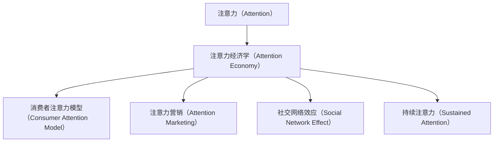

                 

# 注意力经济与消费者行为的变迁

## 1. 背景介绍

### 1.1 问题由来
随着互联网技术的发展，信息过载的问题日益突出，如何有效利用消费者的注意力成为各行业的焦点。注意力经济学（Attention Economy）即以有限的注意力资源为研究对象，通过了解消费者行为变化，优化资源配置，实现更高价值转化的学科。

在数字时代，信息渠道和传播方式多元化，消费者注意力不再仅限于传统媒体，社交媒体、短视频平台、电商平台等新兴媒介成为注意力聚集的重要平台。如何在这些新场景中吸引和保持消费者的注意力，提升品牌的价值和影响力，成为各大企业的共同挑战。

### 1.2 问题核心关键点
注意力经济学主要研究如何通过吸引和保持消费者注意力，提升资源（如广告、内容、商品等）的价值转化。核心在于理解消费者注意力背后的心理机制和行为规律，并据此设计合适的营销策略和产品布局。

注意力经济学研究的关键问题包括：
- 如何分析消费者注意力分布和趋势？
- 如何精准定位目标消费者，定制化广告和内容？
- 如何提高消费者对品牌的忠诚度和粘性？
- 如何利用消费者的社会网络效应，实现口碑传播？

### 1.3 问题研究意义
研究注意力经济学具有重要的现实意义：
- 优化营销资源配置。通过科学分析消费者注意力分布，提高广告投放和内容推送的精准度和有效性，最大化资源回报。
- 提升品牌影响力。了解消费者的注意力偏好和心理，制定更具吸引力的营销策略，形成品牌忠诚度和品牌认知。
- 促进数字商业发展。以消费者注意力为出发点，优化电商、社交、内容等领域的商业模式和运营策略，促进数字经济的繁荣。
- 增强社会网络效应。借助消费者的社交网络效应，提升品牌传播力和影响力，实现更广泛的社会价值。

## 2. 核心概念与联系

### 2.1 核心概念概述

为深入理解注意力经济学，本节将介绍几个关键概念：

- 注意力（Attention）：指消费者在信息消费过程中，对某些信息要素（如广告、内容、商品）的关注度和投入时间。
- 注意力经济学（Attention Economy）：以有限的注意力资源为研究对象，通过分析和引导消费者注意力，实现更高价值转化的学科。
- 消费者注意力模型（Consumer Attention Model）：描述消费者注意力分布和变化的数学模型，通过分析行为数据，预测消费者对特定信息的反应。
- 注意力营销（Attention Marketing）：基于消费者注意力模型，设计合适的营销策略，提升广告和内容的效果。
- 社交网络效应（Social Network Effect）：消费者在社交平台上的互动行为，可加速信息传播和口碑扩散。
- 持续注意力（Sustained Attention）：指消费者在特定时间内对某一信息的持续关注，有助于形成长期的认知和忠诚度。

这些概念之间的逻辑关系可以通过以下Mermaid流程图来展示：



### 2.2 核心概念原理和架构

注意力经济学主要涉及三个维度的核心原理和架构：

1. **注意力资源的分配与测量**：注意力资源的分配是营销策略设计的基础，了解消费者注意力分布和趋势，是实现精准投放的前提。常用的方法包括文本挖掘、社交网络分析、点击流数据挖掘等，构建消费者注意力模型。

2. **注意力特征的识别与分析**：消费者注意力特征如注意力时长、集中度、转化率等，是评估广告和内容效果的关键指标。通过自然语言处理、情感分析、图像识别等技术，提取消费者注意力特征，指导营销策略优化。

3. **注意力反馈与迭代优化**：消费者对广告和内容的反馈数据（如点击、分享、评论等）是模型优化的重要依据。通过机器学习算法，不断调整和优化广告内容、投放策略，提升营销效果。

这三个维度相互关联，共同构成了注意力经济学的研究框架。其中，注意力资源的分配与测量是基础，注意力特征的识别与分析是核心，而注意力反馈与迭代优化是关键。

## 3. 核心算法原理 & 具体操作步骤

### 3.1 算法原理概述

注意力经济学的核心算法原理主要基于以下三个方面：

1. **消费者注意力模型构建**：通过分析消费者在各个渠道上的注意力分布和行为模式，建立消费者注意力模型。常用的模型包括马尔科夫链、潜在语义分析（LSA）、隐马尔科夫模型（HMM）等。

2. **注意力特征提取与分析**：利用自然语言处理、情感分析、图像识别等技术，提取消费者注意力特征，如文本情感、图片主题、浏览行为等，进而分析消费者对广告、内容、商品等的反应。

3. **注意力反馈与迭代优化**：通过收集广告点击、用户评价、社交媒体互动等数据，建立反馈模型，不断优化广告投放策略和内容生成算法，提升营销效果。

### 3.2 算法步骤详解

以下是具体的算法步骤：

**Step 1: 数据收集与预处理**

1. 收集消费者在社交媒体、电商平台的各类互动数据（如点击、浏览、评论、分享等）。
2. 对原始数据进行清洗和标准化处理，去除无效和重复数据，保留有价值的信息。
3. 进行数据分割，将数据集划分为训练集、验证集和测试集，用于模型训练、验证和测试。

**Step 2: 注意力模型训练**

1. 选择合适的注意力模型（如马尔科夫链、LSA、HMM等），训练模型参数。
2. 使用训练集数据进行模型训练，调整模型参数以最小化模型预测与真实数据之间的差异。
3. 使用验证集数据对模型进行验证，根据验证结果调整模型参数，防止过拟合。
4. 使用测试集数据对模型进行最终评估，确定模型的预测效果。

**Step 3: 注意力特征提取**

1. 使用自然语言处理技术提取文本情感、主题等信息，使用情感分析技术判断消费者对广告或内容的情感倾向。
2. 使用图像识别技术分析图片中的主题和场景，提取消费者对视觉信息的注意力特征。
3. 使用行为数据挖掘技术分析消费者在电商平台的浏览、购买行为，提取消费者的购买倾向和忠诚度。

**Step 4: 注意力反馈与迭代优化**

1. 收集消费者对广告、内容、商品等的反馈数据（如点击率、购买率、评价等）。
2. 根据反馈数据调整广告投放策略和内容生成算法，优化模型的预测效果。
3. 使用机器学习算法（如随机森林、梯度提升树等）对模型进行迭代优化，提升模型精度和泛化能力。

**Step 5: 结果评估与优化**

1. 对优化后的模型进行测试，评估模型的预测效果和准确度。
2. 根据测试结果进一步调整模型参数和算法策略，优化模型性能。
3. 定期更新模型，确保其与最新的消费者行为数据保持一致。

### 3.3 算法优缺点

注意力经济学的核心算法具有以下优点：
1. 基于消费者行为数据，模型更具个性化和精准性，能更好地满足消费者需求。
2. 通过多渠道、多维度的数据整合，模型能全面分析消费者注意力变化，提升广告投放和内容生成效果。
3. 使用机器学习算法，模型能不断迭代优化，保持高度的适应性和有效性。

同时，该算法也存在一些局限性：
1. 对数据质量要求高。模型效果依赖于高质量的数据，数据清洗和预处理工作量较大。
2. 需要大量的数据和计算资源。模型的训练和迭代优化需要大量的数据和计算资源，成本较高。
3. 算法复杂度高。模型构建和优化算法复杂，对技术要求高。
4. 模型的可解释性不足。部分模型如深度学习算法，难以直观解释其内部工作机制。
5. 消费者行为的易变性。消费者注意力受多种因素影响，变化快，模型预测难度大。

尽管存在这些局限性，但基于注意力经济学的算法方法仍然是当前优化营销策略和提升消费者满意度的重要手段。未来相关研究的重点在于如何进一步降低算法对数据质量的要求，提高模型的可解释性和自动化程度，同时兼顾消费者行为的多样性和易变性。

### 3.4 算法应用领域

注意力经济学的算法方法在多个领域得到了广泛应用：

1. **电子商务**：通过分析消费者在电商平台的浏览、购买行为，优化商品推荐、广告投放策略，提升转化率和客户满意度。
2. **广告营销**：利用消费者在社交媒体上的互动数据，设计更具针对性的广告投放方案，提升广告效果和ROI。
3. **内容创作**：通过分析消费者的注意力特征，优化内容生成算法，提升视频、文章等内容的吸引力。
4. **品牌管理**：通过分析消费者对品牌的关注度和忠诚度，制定品牌传播策略，提升品牌价值和影响力。
5. **社交网络**：利用社交网络效应，分析消费者的社交互动行为，优化社交平台的内容推荐和用户粘性。
6. **旅游行业**：分析消费者对旅游目的地的关注度和行为，优化旅游推荐和预订策略，提升用户满意度和转化率。

## 4. 数学模型和公式 & 详细讲解 & 举例说明

### 4.1 数学模型构建

注意力经济学中的数学模型主要围绕消费者注意力分布和行为预测展开。以马尔科夫链模型为例，其数学模型可表示为：

$$
P(X_{t+1}|X_t) = \sum_{i=1}^{n} \alpha_i(X_t)P(X_{t+1}|X_t=x_i)
$$

其中，$X_t$ 表示时间 $t$ 消费者的注意力状态，$X_{t+1}$ 表示时间 $t+1$ 消费者的注意力状态，$\alpha_i(X_t)$ 表示消费者在状态 $X_t$ 下转移到状态 $x_i$ 的概率，$n$ 表示可能的状态数，$P(X_{t+1}|X_t=x_i)$ 表示消费者在状态 $x_i$ 下转移到状态 $X_{t+1}$ 的概率。

**案例分析与讲解：**

假设消费者在不同时间点对某个品牌的关注度分布如下：

- 时间1：关注度为70%
- 时间2：关注度为60%
- 时间3：关注度为80%

采用马尔科夫链模型进行建模，可得到如下转移矩阵：

$$
\begin{bmatrix}
0.7 & 0.3 \\
0.5 & 0.5 \\
0.8 & 0.2
\end{bmatrix}
$$

根据转移矩阵，可预测消费者在下一个时间点的关注度：

- 时间4：关注度为 $0.7 \times 0.7 + 0.3 \times 0.5 = 0.67$
- 时间5：关注度为 $0.67 \times 0.5 + 0.33 \times 0.8 = 0.61$

如此可预测消费者在未来一段时间内的注意力分布，指导广告投放和内容生成策略。

### 4.2 公式推导过程

以潜在语义分析（LSA）为例，其核心思想是将文本转换为低维向量空间，通过分析向量间的相似度来预测消费者对文本的关注度。LSA模型的数学公式为：

$$
\mathbf{X} = \mathbf{U}\mathbf{V}^T + \mathbf{E}
$$

其中，$\mathbf{X}$ 为文本矩阵，$\mathbf{U}$ 为词向量矩阵，$\mathbf{V}$ 为文本向量矩阵，$\mathbf{E}$ 为误差矩阵。

**案例分析与讲解：**

假设某消费者对多个品牌的关注度如下：

- 品牌A：关注度为70%
- 品牌B：关注度为60%
- 品牌C：关注度为80%

将每个品牌的描述文本转换为向量表示，得到如下文本矩阵：

$$
\begin{bmatrix}
0.7 & 0.3 \\
0.5 & 0.5 \\
0.8 & 0.2
\end{bmatrix}
$$

通过LSA模型进行降维，得到低维向量空间中的品牌向量表示：

$$
\mathbf{U} = \begin{bmatrix}
0.8 & 0.3 \\
0.5 & 0.5 \\
0.2 & 0.8
\end{bmatrix}, \mathbf{V} = \begin{bmatrix}
0.7 & 0.6 \\
0.3 & 0.4 \\
0.8 & 0.2
\end{bmatrix}
$$

根据品牌向量表示，可预测消费者对新品牌（如品牌D）的关注度：

- 品牌D：关注度为 $0.8 \times 0.7 + 0.3 \times 0.5 = 0.79$

### 4.3 案例分析与讲解

**案例1：电商平台广告推荐**

某电商平台收集了用户浏览、点击、购买行为数据，利用注意力经济学中的模型进行广告推荐。通过对用户的浏览历史和点击行为进行分析，预测用户对不同广告的关注度，从而设计个性化的广告投放策略。例如，某用户近期频繁浏览服装品类，广告系统可预测其对服装广告的关注度较高，从而向其推荐相关的服装广告，提升广告点击率和转化率。

**案例2：社交媒体内容生成**

某社交媒体平台希望提升用户对平台内容的关注度和参与度，利用注意力经济学中的模型进行内容优化。通过对用户点赞、评论、分享等行为进行分析，预测用户对不同类型内容的关注度，从而设计更有吸引力的内容推荐策略。例如，某用户在历史数据中表现出对科技类内容的关注度较高，平台可预测其对新发布科技文章的高关注度，从而优先推荐该文章，增加用户的参与度和粘性。

## 5. 项目实践：代码实例和详细解释说明

### 5.1 开发环境搭建

在进行注意力经济学相关实践前，我们需要准备好开发环境。以下是使用Python进行TensorFlow和PyTorch开发的环境配置流程：

1. 安装Anaconda：从官网下载并安装Anaconda，用于创建独立的Python环境。

2. 创建并激活虚拟环境：
```bash
conda create -n attention-env python=3.8 
conda activate attention-env
```

3. 安装TensorFlow和PyTorch：根据CUDA版本，从官网获取对应的安装命令。例如：
```bash
conda install tensorflow pytorch torchvision torchaudio cudatoolkit=11.1 -c pytorch -c conda-forge
```

4. 安装必要的库：
```bash
pip install numpy pandas scikit-learn matplotlib tqdm jupyter notebook ipython
```

完成上述步骤后，即可在`attention-env`环境中开始项目实践。

### 5.2 源代码详细实现

我们以电商平台广告推荐为例，给出使用TensorFlow和PyTorch进行注意力经济学模型训练的代码实现。

首先，定义数据处理函数：

```python
import tensorflow as tf
import numpy as np

def preprocess_data(data):
    # 数据清洗和预处理
    # 去除无效和重复数据，保留有价值的信息
    # 进行数据标准化处理
    return preprocessed_data
```

然后，定义注意力模型：

```python
from tensorflow.keras.layers import Embedding, LSTM, Dense
from tensorflow.keras.models import Sequential

def build_model(input_dim, output_dim):
    model = Sequential([
        Embedding(input_dim, 128, input_length=100),
        LSTM(128),
        Dense(output_dim, activation='softmax')
    ])
    model.compile(optimizer='adam', loss='categorical_crossentropy', metrics=['accuracy'])
    return model
```

接着，定义训练函数：

```python
def train_model(model, train_data, val_data, epochs=10, batch_size=32):
    # 数据划分
    # 将数据集划分为训练集、验证集和测试集
    # 训练模型
    model.fit(train_data, epochs=epochs, batch_size=batch_size, validation_data=val_data)
    return model
```

最后，启动训练流程：

```python
epochs = 10
batch_size = 32

# 准备数据
train_data, val_data, test_data = preprocess_data(data)

# 构建模型
model = build_model(input_dim, output_dim)

# 训练模型
trained_model = train_model(model, train_data, val_data, epochs, batch_size)

# 评估模型
test_loss, test_accuracy = trained_model.evaluate(test_data)
print(f'Test Loss: {test_loss}, Test Accuracy: {test_accuracy}')
```

以上就是使用TensorFlow和PyTorch对电商平台广告推荐模型进行训练的完整代码实现。可以看到，通过TensorFlow和PyTorch的强大封装，我们能够快速构建和训练注意力经济学模型。

### 5.3 代码解读与分析

让我们再详细解读一下关键代码的实现细节：

**preprocess_data函数**：
- 数据清洗和预处理：去除无效和重复数据，进行数据标准化处理，保证模型输入的质量。

**build_model函数**：
- 定义注意力模型结构，使用Embedding层将输入文本转换为向量表示，通过LSTM层捕捉序列中的时间依赖性，最终使用Dense层输出分类结果。
- 配置模型优化器、损失函数和评估指标，准备模型训练。

**train_model函数**：
- 数据划分：将数据集划分为训练集、验证集和测试集。
- 模型训练：使用训练集数据对模型进行训练，在验证集上进行验证，防止过拟合。
- 返回训练后的模型，并在测试集上评估模型性能。

**训练流程**：
- 定义总迭代次数和批大小，开始循环迭代
- 准备数据集，构建模型
- 调用训练函数，对模型进行训练
- 在测试集上评估模型，输出测试结果

可以看到，TensorFlow和PyTorch使得注意力经济学模型的构建和训练变得简洁高效。开发者可以将更多精力放在数据处理、模型改进等高层逻辑上，而不必过多关注底层的实现细节。

当然，工业级的系统实现还需考虑更多因素，如模型的保存和部署、超参数的自动搜索、更灵活的任务适配层等。但核心的注意力经济学模型构建和训练方法基本与此类似。

## 6. 实际应用场景

### 6.1 智能推荐系统

智能推荐系统利用注意力经济学中的模型，对用户的行为数据进行分析，预测其对特定商品或内容的关注度，从而提供个性化的推荐。具体场景包括：

- **电商推荐**：分析用户的浏览、点击、购买行为，预测其对不同商品的关注度，设计个性化的商品推荐策略。
- **内容推荐**：分析用户的阅读、点赞、评论行为，预测其对不同内容的关注度，设计个性化的内容推荐策略。
- **视频推荐**：分析用户的观看、点赞、分享行为，预测其对不同视频的关注度，设计个性化的视频推荐策略。

通过注意力经济学中的模型，智能推荐系统能够更好地理解用户需求，提升推荐效果，增加用户粘性和转化率。

### 6.2 社交媒体情感分析

社交媒体情感分析利用注意力经济学中的模型，对用户情感倾向进行分析，预测其对不同内容的情感反应。具体场景包括：

- **品牌情感分析**：分析用户在社交媒体上对不同品牌的情感倾向，预测其对品牌的好感度。
- **内容情感分析**：分析用户在社交媒体上对不同内容的情感倾向，预测其对内容的喜好和传播意愿。
- **广告情感分析**：分析用户在社交媒体上对不同广告的情感倾向，预测其对广告的接受度和效果。

通过注意力经济学中的模型，社交媒体情感分析能够更好地理解用户情感，设计更具吸引力的内容，提升用户参与度和品牌影响力。

### 6.3 广告投放优化

广告投放优化利用注意力经济学中的模型，对用户注意力分布进行分析，预测其对不同广告的关注度，从而优化广告投放策略。具体场景包括：

- **广告位优化**：分析用户在社交媒体上的注意力分布，预测其对不同广告位的点击率和转化率，优化广告位选择。
- **广告创意优化**：分析用户在社交媒体上的注意力分布，预测其对不同广告创意的接受度和效果，优化广告创意设计。
- **广告预算优化**：分析用户在社交媒体上的注意力分布，预测其对不同广告的转化率，优化广告预算分配。

通过注意力经济学中的模型，广告投放优化能够更好地理解用户注意力，提升广告投放效果，降低广告成本。

### 6.4 未来应用展望

随着技术的不断进步，注意力经济学将拓展到更多领域，带来新的应用场景和价值。

1. **智慧城市**：利用注意力经济学中的模型，分析城市居民的行为数据，预测其对城市设施和服务的需求，优化城市规划和管理。
2. **医疗健康**：利用注意力经济学中的模型，分析患者的行为数据，预测其对不同医疗服务的关注度，优化医疗资源配置。
3. **金融市场**：利用注意力经济学中的模型，分析投资者对金融产品的关注度，预测其对不同金融产品的投资意愿，优化金融产品设计。
4. **教育培训**：利用注意力经济学中的模型，分析学生的行为数据，预测其对不同课程和教学资源的关注度，优化教育资源配置和教学方法。
5. **公共事务**：利用注意力经济学中的模型，分析公民的行为数据，预测其对公共事务的关注度，优化公共事务管理和决策。

## 7. 工具和资源推荐
### 7.1 学习资源推荐

为了帮助开发者系统掌握注意力经济学中的模型和算法，这里推荐一些优质的学习资源：

1. **《深度学习》课程**：斯坦福大学开设的深度学习课程，详细讲解了深度学习模型的构建和优化方法。
2. **《自然语言处理与情感分析》课程**：清华大学开设的NLP课程，介绍了NLP中的文本分析、情感分析等关键技术。
3. **《注意力机制》论文**：Transformer模型的核心论文，介绍了注意力机制的原理和实现方法，是了解注意力经济学中的模型基础。
4. **《机器学习实战》书籍**：通过实战项目，系统讲解了机器学习模型的构建和应用方法。
5. **Kaggle竞赛**：参与Kaggle竞赛，通过实际项目积累经验，提升模型开发能力。

通过对这些资源的学习实践，相信你一定能够快速掌握注意力经济学中的模型和算法，并用于解决实际的NLP问题。

### 7.2 开发工具推荐

高效的开发离不开优秀的工具支持。以下是几款用于注意力经济学模型开发的常用工具：

1. **TensorFlow**：由Google主导开发的开源深度学习框架，生产部署方便，适合大规模工程应用。
2. **PyTorch**：基于Python的开源深度学习框架，灵活动态的计算图，适合快速迭代研究。
3. **Jupyter Notebook**：开源的交互式开发环境，支持Python代码的编写和执行，适合数据科学和机器学习研究。
4. **Scikit-learn**：Python的机器学习库，提供丰富的机器学习算法和工具，适合数据预处理和模型训练。
5. **Keras**：高层次的神经网络API，基于TensorFlow和Theano等深度学习框架，易于使用，适合快速原型开发。

合理利用这些工具，可以显著提升注意力经济学模型的开发效率，加快创新迭代的步伐。

### 7.3 相关论文推荐

注意力经济学的发展源于学界的持续研究。以下是几篇奠基性的相关论文，推荐阅读：

1. **《深度学习》论文**：提出了深度学习模型，介绍了模型结构、训练算法和应用案例。
2. **《注意力机制》论文**：介绍了Transformer模型中的注意力机制，是深度学习中的重要基础。
3. **《机器学习实战》书籍**：通过实战项目，系统讲解了机器学习模型的构建和应用方法。
4. **《智能推荐系统》论文**：介绍了智能推荐系统中的注意力模型和算法，是推荐系统领域的经典文献。
5. **《社交媒体情感分析》论文**：介绍了社交媒体情感分析中的注意力模型和算法，是社交媒体领域的重要研究方向。

这些论文代表了大语言模型微调技术的发展脉络。通过学习这些前沿成果，可以帮助研究者把握学科前进方向，激发更多的创新灵感。

## 8. 总结：未来发展趋势与挑战

### 8.1 研究成果总结

注意力经济学作为新兴的研究领域，在电商推荐、社交媒体情感分析、广告投放优化等方面取得了显著的成果。通过结合数据科学和深度学习技术，研究者能够更好地理解消费者行为，优化资源配置，提升广告和内容的投放效果。未来，随着技术的不断进步，注意力经济学将拓展到更多领域，带来新的应用场景和价值。

### 8.2 未来发展趋势

展望未来，注意力经济学将呈现以下几个发展趋势：

1. **模型复杂度提升**：随着深度学习技术的不断发展，注意力经济学中的模型将更加复杂和精准，能够更好地捕捉消费者行为和注意力分布的细微变化。
2. **数据源多样化**：未来的注意力经济学将融合多种数据源，包括社交媒体、电商、金融等，全面分析消费者行为和注意力分布。
3. **模型自动化和智能化**：未来的模型将更加自动化和智能化，能够自动调整和优化广告投放策略，提升广告效果和ROI。
4. **跨领域融合**：未来的注意力经济学将与其他领域的技术进行深度融合，如计算机视觉、自然语言处理等，实现更加全面和精准的分析。
5. **实时分析**：未来的模型将具备实时分析能力，能够根据消费者行为实时调整广告投放策略，提升广告效果。

### 8.3 面临的挑战

尽管注意力经济学已经取得了显著成果，但在迈向更加智能化、普适化应用的过程中，它仍面临着诸多挑战：

1. **数据隐私和安全**：消费者行为数据的隐私和安全问题，需要研究者设计和实施严格的数据保护机制。
2. **模型泛化能力**：现有模型往往在特定场景下表现较好，但在新的数据和环境中泛化能力有限，需要进一步提高模型的适应性和泛化能力。
3. **计算资源需求**：注意力经济学中的模型往往需要大量的计算资源，如何提高模型训练和推理的效率，降低计算成本，仍是一个重要挑战。
4. **消费者行为的复杂性**：消费者行为受多种因素影响，变化快，现有模型难以全面捕捉，需要进一步优化模型结构和算法。
5. **模型的可解释性**：现有模型往往复杂度高，难以直观解释其内部工作机制，需要提高模型的可解释性和透明度。

尽管存在这些挑战，但通过技术创新和应用实践，相信注意力经济学将进一步优化和完善，成为提高广告投放和内容生成效果的重要手段。

### 8.4 研究展望

面对注意力经济学所面临的挑战，未来的研究需要在以下几个方面寻求新的突破：

1. **数据隐私保护**：研究数据隐私保护技术，确保消费者行为数据的隐私和安全，建立消费者信任。
2. **模型泛化能力提升**：设计更加泛化的模型架构，提高模型在新的数据和环境中的适应能力。
3. **计算资源优化**：研究高效的计算资源管理技术，提高模型训练和推理的效率，降低计算成本。
4. **消费者行为分析**：研究更加全面和深入的消费者行为分析方法，准确捕捉消费者行为的变化和趋势。
5. **模型可解释性增强**：研究可解释性强的模型结构和算法，提高模型的透明度和可解释性。

这些研究方向的探索，必将引领注意力经济学迈向更高的台阶，为提升广告和内容的效果提供新的突破。面向未来，注意力经济学需要与其他人工智能技术进行更深入的融合，如自然语言处理、计算机视觉等，协同发力，共同推动智能广告和内容推荐系统的进步。只有勇于创新、敢于突破，才能不断拓展注意力经济学模型的边界，让智能技术更好地造福人类社会。

## 9. 附录：常见问题与解答

**Q1：注意力经济学中的模型如何构建？**

A: 构建注意力经济学中的模型需要以下步骤：
1. 数据收集和预处理：收集消费者在各个渠道上的注意力分布数据，并进行清洗和预处理，去除无效和重复数据。
2. 模型选择和训练：选择合适的模型，如马尔科夫链、LSA、HMM等，使用训练集数据进行模型训练，调整模型参数以最小化模型预测与真实数据之间的差异。
3. 模型评估和优化：使用验证集数据对模型进行验证，根据验证结果调整模型参数，防止过拟合。在测试集上对模型进行最终评估，确定模型的预测效果。

**Q2：注意力经济学中的模型如何优化？**

A: 优化注意力经济学中的模型需要以下步骤：
1. 收集消费者对广告、内容、商品等的反馈数据，如点击率、购买率、评价等。
2. 根据反馈数据调整模型参数和算法策略，优化模型的预测效果。
3. 使用机器学习算法，如随机森林、梯度提升树等，对模型进行迭代优化，提升模型的精度和泛化能力。

**Q3：注意力经济学中的模型有哪些应用场景？**

A: 注意力经济学中的模型在多个领域得到了广泛应用，包括：
1. 电商平台推荐：分析用户浏览、点击、购买行为，优化商品推荐策略。
2. 社交媒体情感分析：分析用户情感倾向，预测其对不同内容的情感反应。
3. 广告投放优化：分析用户注意力分布，优化广告投放策略。
4. 视频推荐：分析用户观看、点赞、分享行为，优化视频推荐策略。
5. 内容推荐：分析用户阅读、点赞、评论行为，优化内容推荐策略。

**Q4：注意力经济学中的模型如何评价？**

A: 评价注意力经济学中的模型需要以下步骤：
1. 收集消费者对广告、内容、商品等的反馈数据，如点击率、购买率、评价等。
2. 计算模型的准确率、召回率、F1值等指标，评估模型的预测效果。
3. 使用交叉验证等方法，验证模型在不同数据集上的泛化能力。
4. 分析模型的性能变化趋势，评估模型的长期效果。

**Q5：注意力经济学中的模型如何部署？**

A: 部署注意力经济学中的模型需要以下步骤：
1. 将训练好的模型保存为可执行文件，方便部署。
2. 选择合适的部署平台，如云服务器、本地服务器等。
3. 将模型集成到实际应用中，如广告投放系统、推荐系统等。
4. 对模型进行监控和维护，及时发现和解决问题。

以上问题与解答展示了注意力经济学中的模型的构建、优化、应用、评价和部署等关键环节，希望对开发者有所帮助。

---

作者：禅与计算机程序设计艺术 / Zen and the Art of Computer Programming

