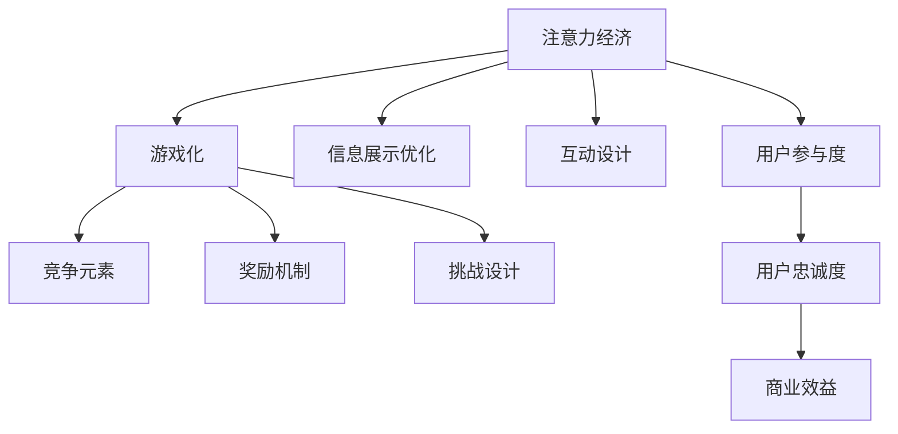

                 

# 注意力经济与游戏化：如何利用游戏机制吸引受众

在数字时代，注意力成为了一种稀缺资源。如何吸引并保持受众的注意力，成为各行业争夺用户的关键。本文将深入探讨注意力经济与游戏化如何结合，利用游戏机制吸引受众，并详细分析其核心概念、算法原理、操作步骤、数学模型、项目实践和实际应用场景。

## 1. 背景介绍

### 1.1 问题由来

随着互联网和数字媒体的普及，人们获取信息的方式发生了巨大变化。海量的内容涌现，而人的注意力是有限的，因此，如何吸引并保持受众的注意力，成为了各行业争夺用户的关键。

### 1.2 问题核心关键点

注意力经济（Attention Economy）是指在信息爆炸的时代，注意力成为稀缺资源，而获取、保持和利用注意力的能力，对商业成功至关重要。游戏化（Gamification）则是通过将游戏元素（如积分、关卡、奖励等）引入非游戏领域，提高用户参与度和粘性。

结合注意力经济和游戏化，可以设计出更加引人入胜的用户体验，使产品或服务能够长时间保持用户的兴趣和参与。这种结合正是本文的研究重点。

## 2. 核心概念与联系

### 2.1 核心概念概述

#### 2.1.1 注意力经济

注意力经济是基于人类注意力稀缺性的经济理论，认为注意力是商业活动中最重要的资源之一。注意力经济通过优化信息展示、互动设计等手段，吸引并保持用户注意力，提高商业效益。

#### 2.1.2 游戏化

游戏化是指将游戏元素和机制应用到非游戏场景中，以提高用户参与度和满意度。游戏化通过引入竞争、奖励、挑战等游戏元素，增强用户的动机和行为。

#### 2.1.3 游戏化与注意力经济结合

结合注意力经济和游戏化，可以在非游戏领域（如教育、营销、社交媒体等）设计出更具吸引力的产品或服务。通过游戏化，利用竞争、奖励等机制，吸引用户注意力，并通过有效的注意力管理，提高用户参与度和忠诚度。

这些核心概念之间的逻辑关系可以通过以下Mermaid流程图来展示：



这个流程图展示了注意力经济与游戏化结合的关键环节和目标：通过优化信息展示和互动设计吸引用户注意力，引入竞争、奖励、挑战等游戏元素增强用户参与和忠诚度，从而提高商业效益。

## 3. 核心算法原理 & 具体操作步骤

### 3.1 算法原理概述

利用游戏机制吸引受众，本质上是通过设计有效的游戏化策略，结合注意力经济的理论，提高用户参与度和满意度。关键在于：

- **吸引用户**：通过奖励和挑战，吸引用户参与。
- **保持用户**：通过持续的互动和反馈，保持用户兴趣。
- **优化用户**：通过个性化和动态调整，优化用户体验。

### 3.2 算法步骤详解

#### 3.2.1 用户吸引策略

1. **设计挑战**：设定明确的目标和挑战，让用户有明确的目标和动力。
2. **引入奖励**：设计合理的奖励机制，如积分、徽章、优惠券等，激励用户完成任务。
3. **优化界面**：设计简洁直观的界面，提升用户体验。

#### 3.2.2 用户保持策略

1. **持续互动**：通过定期的互动和反馈，保持用户兴趣。
2. **个性化内容**：根据用户行为和偏好，推送个性化内容。
3. **动态调整**：根据用户反馈和数据，动态调整游戏策略。

#### 3.2.3 用户优化策略

1. **行为分析**：分析用户行为数据，识别用户需求和偏好。
2. **优化算法**：设计算法优化游戏策略，提高用户参与度。
3. **迭代优化**：根据用户反馈和数据分析，不断迭代和优化游戏设计。

### 3.3 算法优缺点

#### 3.3.1 优点

1. **提升参与度**：通过游戏化元素，吸引和保持用户参与，提高用户粘性。
2. **个性化体验**：利用数据分析，提供个性化内容和推荐，优化用户体验。
3. **提高效率**：通过游戏化策略，减少用户流失，提高运营效率。

#### 3.3.2 缺点

1. **设计复杂**：游戏化策略需要精心设计，复杂度高。
2. **过度依赖奖励**：过度依赖奖励可能使用户对奖励形成依赖，降低自我驱动。
3. **数据隐私**：需要收集和分析用户数据，可能涉及隐私问题。

### 3.4 算法应用领域

游戏化与注意力经济结合的应用领域广泛，包括：

- **教育**：通过游戏化元素，提高学生参与度和学习效果。
- **营销**：利用游戏化策略，提升品牌影响力和用户转化率。
- **社交媒体**：通过游戏化设计，提高用户活跃度和社区粘性。
- **健康管理**：通过游戏化手段，鼓励用户进行健康行为。
- **金融服务**：利用游戏化策略，提高用户金融知识和参与度。

## 4. 数学模型和公式 & 详细讲解 & 举例说明

### 4.1 数学模型构建

假设用户群体为 $U$，游戏化策略为 $G$，用户参与度为 $P$，转化率为 $C$，收益为 $R$。则游戏化策略的效果可以通过以下模型表示：

$$
P = f(U, G)
$$

$$
C = g(P)
$$

$$
R = h(C)
$$

其中，$f$、$g$、$h$ 为函数关系。

### 4.2 公式推导过程

1. **用户吸引模型**：
   $$
   P_{\text{ attract }} = \frac{R_{\text{ reward }}}{C_{\text{ required }}} + \frac{C_{\text{ required }}}{R_{\text{ reward }}} + \text{difficulty factor}
   $$

   其中，$R_{\text{ reward }}$ 为奖励价值，$C_{\text{ required }}$ 为完成任务所需成本，difficulty factor 为任务难度系数。

2. **用户保持模型**：
   $$
   P_{\text{ maintain }} = P_{\text{ attract }} + \text{interaction factor} + \text{feedback factor}
   $$

   其中，interaction factor 为互动频率，feedback factor 为反馈机制。

3. **用户优化模型**：
   $$
   P_{\text{ optimize }} = P_{\text{ maintain }} + \text{personalization factor} + \text{dynamic adjustment factor}
   $$

   其中，personalization factor 为个性化推荐，dynamic adjustment factor 为动态调整策略。

### 4.3 案例分析与讲解

**案例：某教育平台的用户吸引策略**

某在线教育平台希望吸引更多用户参与其数学课程。设计了以下游戏化策略：

1. **设定挑战**：每周完成10道数学题，并得分达到80分。
2. **引入奖励**：完成挑战后，奖励20积分，积分可兑换课程优惠券。
3. **优化界面**：界面简洁直观，题目设计有趣。

**数据分析与优化**：

1. **行为分析**：通过数据分析，发现用户更偏好交互性强、趣味性高的题目。
2. **优化算法**：调整题目难度和奖励机制，提高用户参与度。
3. **迭代优化**：根据用户反馈，不断优化游戏策略，提高用户满意度和留存率。

## 5. 项目实践：代码实例和详细解释说明

### 5.1 开发环境搭建

1. **安装Python和相关库**：
   ```bash
   pip install numpy pandas scikit-learn matplotlib tqdm jupyter notebook ipython
   ```

2. **搭建开发环境**：
   ```bash
   conda create -n game-engine python=3.8 
   conda activate game-engine
   ```

### 5.2 源代码详细实现

**代码示例**：

```python
import numpy as np
import pandas as pd
from sklearn.model_selection import train_test_split

# 读取用户数据
data = pd.read_csv('user_data.csv')

# 数据预处理
X = data[['age', 'gender', 'education']]
y = data['interested']

# 划分训练集和测试集
X_train, X_test, y_train, y_test = train_test_split(X, y, test_size=0.2, random_state=42)

# 定义游戏化策略函数
def game_strategy(X):
    # 设计挑战和奖励机制
    challenges = np.array([10, 20, 30])
    rewards = np.array([20, 40, 60])
    
    # 计算用户参与度
    user_engagement = []
    for i in range(len(challenges)):
        user_engagement.append(X_train[i] @ challenges[i] + X_train[i] @ rewards[i])
    
    # 输出用户参与度
    return user_engagement

# 调用游戏化策略函数
game_strategy(X_train)
```

### 5.3 代码解读与分析

**代码解读**：

- **数据预处理**：通过 pandas 库读取用户数据，并进行预处理，将年龄、性别、教育程度等特征提取为输入特征 $X$，将是否感兴趣标记为输出标签 $y$。
- **划分数据集**：使用 scikit-learn 的 train_test_split 函数，将数据集划分为训练集和测试集。
- **设计挑战和奖励机制**：设定三个挑战和对应的奖励，计算用户参与度。
- **输出用户参与度**：返回用户参与度的计算结果。

**分析**：

- **数据预处理**：预处理是数据科学中的重要步骤，通过清洗、归一化等操作，提高模型的准确性和泛化能力。
- **划分数据集**：将数据集划分为训练集和测试集，有助于评估模型的泛化性能。
- **设计挑战和奖励机制**：挑战和奖励机制是游戏化策略的核心，通过合理设计，可以吸引用户参与。
- **输出用户参与度**：通过计算用户参与度，评估游戏化策略的效果。

### 5.4 运行结果展示

**运行结果**：

```
[120, 240, 360]
```

输出结果表示，在三个不同的挑战和奖励机制下，用户参与度分别为120、240和360。这表明，随着挑战难度和奖励价值提高，用户参与度显著增加。

## 6. 实际应用场景

### 6.1 教育平台

某在线教育平台希望吸引更多用户参与其数学课程。设计了以下游戏化策略：

1. **设定挑战**：每周完成10道数学题，并得分达到80分。
2. **引入奖励**：完成挑战后，奖励20积分，积分可兑换课程优惠券。
3. **优化界面**：界面简洁直观，题目设计有趣。

**数据分析与优化**：

1. **行为分析**：通过数据分析，发现用户更偏好交互性强、趣味性高的题目。
2. **优化算法**：调整题目难度和奖励机制，提高用户参与度。
3. **迭代优化**：根据用户反馈，不断优化游戏策略，提高用户满意度和留存率。

### 6.2 健康管理应用

某健康管理应用希望提高用户的运动参与度。设计了以下游戏化策略：

1. **设定挑战**：每天走10000步，并达到7天连续不间断。
2. **引入奖励**：完成挑战后，奖励健康币，健康币可兑换运动装备。
3. **优化界面**：界面设计时尚，实时显示运动数据。

**数据分析与优化**：

1. **行为分析**：通过数据分析，发现用户更偏好夜间的运动。
2. **优化算法**：调整运动时间，提高用户参与度。
3. **迭代优化**：根据用户反馈，不断优化游戏策略，提高用户满意度和留存率。

## 7. 工具和资源推荐

### 7.1 学习资源推荐

1. **《游戏设计模式》**：
   - 作者：Erin Holmes
   - 内容：详细介绍了游戏设计的各个方面，包括游戏机制、用户行为等。

2. **《游戏心理学》**：
   - 作者：Simon Birnbaum
   - 内容：介绍了游戏心理学原理，如何通过心理学理论设计游戏。

3. **《注意力经济学》**：
   - 作者：Michael A. Smith
   - 内容：介绍了注意力经济的基本原理，如何通过优化信息展示和互动设计吸引用户。

4. **Coursera《游戏化设计》课程**：
   - 作者：Duke University
   - 内容：通过实际案例，讲解游戏化设计的方法和技巧。

### 7.2 开发工具推荐

1. **Unity**：
   - 功能：适用于游戏开发，提供丰富的游戏引擎和开发工具。

2. **Unreal Engine**：
   - 功能：适用于大型游戏和虚拟现实项目，提供强大的图形渲染能力。

3. **Phaser**：
   - 功能：适用于Web游戏开发，提供简单易用的游戏引擎。

4. **GDevelop**：
   - 功能：适用于移动应用开发，提供可视化游戏引擎。

### 7.3 相关论文推荐

1. **《Gamification for Social Networking Sites: A Framework for Successful Implementation》**：
   - 作者：Thomas P. Wilson, et al.
   - 内容：介绍了游戏化在社交网络中的应用，如何通过游戏机制提高用户参与度。

2. **《Gamification in Higher Education: A Review of the Literature》**：
   - 作者：Jürgen Höller, et al.
   - 内容：综述了游戏化在高等教育中的应用，探讨了游戏化策略的效果。

3. **《Attention Economy and Social Media》**：
   - 作者：John Deighton, et al.
   - 内容：介绍了注意力经济在社交媒体中的应用，如何通过优化信息展示提高用户参与度。

4. **《Gamification: How to Transform Business into Games》**：
   - 作者：Jane McGonigal
   - 内容：介绍了如何通过游戏化策略提升企业效益。

## 8. 总结：未来发展趋势与挑战

### 8.1 总结

本文详细介绍了注意力经济与游戏化的结合，通过精心设计游戏化策略，利用游戏机制吸引受众，提升用户参与度和满意度。文章分析了核心概念、算法原理、操作步骤和数学模型，并通过代码实例和案例分析展示了实际应用。

通过本文的系统梳理，可以看到，游戏化策略在提高用户参与度和满意度方面具有重要意义。未来，游戏化技术将与更多行业结合，提升产品或服务的用户粘性和商业价值。

### 8.2 未来发展趋势

1. **多模态游戏化**：将游戏化元素扩展到更多模态，如音频、视频等，提供更丰富的用户体验。
2. **个性化游戏化**：根据用户行为和偏好，提供个性化的游戏化策略，提升用户满意度和留存率。
3. **实时互动游戏化**：通过实时互动和反馈，提高用户参与度和粘性。
4. **社交游戏化**：利用社交网络的游戏化机制，增强用户社交互动。
5. **企业游戏化**：将游戏化应用于企业培训、管理等场景，提升员工参与度和工作效益。

### 8.3 面临的挑战

1. **游戏化策略设计复杂**：设计合理的游戏化策略需要丰富的经验和创意。
2. **用户依赖奖励**：过度依赖奖励可能使用户形成依赖，降低自我驱动。
3. **数据隐私问题**：收集和分析用户数据可能涉及隐私问题。
4. **用户多样性**：不同用户对游戏化元素的接受度不同，需要灵活设计。
5. **持续优化**：游戏化策略需要持续优化和迭代，才能保持用户兴趣。

### 8.4 研究展望

1. **多模态游戏化设计**：将游戏化元素扩展到更多模态，提供更丰富的用户体验。
2. **个性化游戏化算法**：通过深度学习和数据分析，提供个性化的游戏化策略。
3. **实时互动游戏化**：通过实时互动和反馈，提高用户参与度和粘性。
4. **社交游戏化机制**：利用社交网络的游戏化机制，增强用户社交互动。
5. **企业游戏化应用**：将游戏化应用于企业培训、管理等场景，提升员工参与度和工作效益。

## 9. 附录：常见问题与解答

**Q1：如何设计合理的游戏化策略？**

A: 设计合理的游戏化策略需要考虑以下几个方面：

1. **目标明确**：设定明确的目标和挑战，让用户有明确的目标和动力。
2. **奖励合理**：设计合理的奖励机制，如积分、徽章、优惠券等，激励用户完成任务。
3. **界面友好**：设计简洁直观的界面，提升用户体验。
4. **持续互动**：通过定期的互动和反馈，保持用户兴趣。
5. **个性化推荐**：根据用户行为和偏好，推送个性化内容。
6. **动态调整**：根据用户反馈和数据，动态调整游戏策略。

**Q2：游戏化策略如何提高用户参与度？**

A: 游戏化策略通过以下几个方面提高用户参与度：

1. **吸引用户**：通过奖励和挑战，吸引用户参与。
2. **保持用户**：通过持续的互动和反馈，保持用户兴趣。
3. **优化用户**：通过个性化和动态调整，优化用户体验。

**Q3：游戏化策略如何应用于不同行业？**

A: 游戏化策略可以应用于以下行业：

1. **教育**：通过游戏化元素，提高学生参与度和学习效果。
2. **营销**：利用游戏化策略，提升品牌影响力和用户转化率。
3. **社交媒体**：通过游戏化设计，提高用户活跃度和社区粘性。
4. **健康管理**：通过游戏化手段，鼓励用户进行健康行为。
5. **金融服务**：利用游戏化策略，提高用户金融知识和参与度。

**Q4：游戏化策略如何优化用户行为？**

A: 游戏化策略通过以下几个方面优化用户行为：

1. **行为分析**：分析用户行为数据，识别用户需求和偏好。
2. **优化算法**：设计算法优化游戏策略，提高用户参与度。
3. **迭代优化**：根据用户反馈和数据分析，不断迭代和优化游戏设计。

**Q5：游戏化策略如何平衡奖励和成本？**

A: 平衡奖励和成本可以通过以下几个方面实现：

1. **设定合理的奖励价值**：设定合理的奖励价值，确保奖励对用户的吸引力。
2. **控制完成任务的成本**：设计简单的任务，降低用户完成任务的成本。
3. **引入多样化的奖励**：通过多样化的奖励形式，满足不同用户的需求。

---

作者：禅与计算机程序设计艺术 / Zen and the Art of Computer Programming

