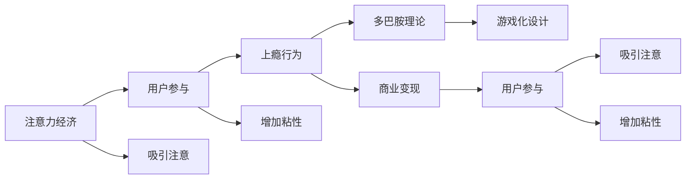

                 

# 注意力经济与用户参与：如何创建让人上瘾的产品

在互联网时代，注意力成为一种稀缺资源，而如何高效获取和利用用户的注意力，成为各互联网公司争夺的核心。在这篇文章中，我们将从注意力经济的角度出发，探讨如何通过产品设计，利用用户的注意力，创建出让人上瘾的产品。

## 1. 背景介绍

### 1.1 问题由来
在互联网产品设计中，如何吸引用户的注意力，如何利用用户的注意力，始终是产品设计的核心问题。在信息爆炸的时代，用户面临着海量的信息干扰，如何在这场信息战争中胜出，吸引用户的注意力，成为各互联网公司争夺的焦点。特别是在社交媒体、视频平台、在线游戏等领域，注意力经济的重要性尤为突出。

### 1.2 问题核心关键点
注意力经济的核心在于如何有效利用用户的时间和注意力。在产品设计中，这一目标主要通过以下几个方面来实现：

1. **吸引注意**：即通过内容、设计等手段，吸引用户停留并关注。
2. **增加粘性**：通过个性化、互动、奖励等方式，增加用户的使用频率和停留时间。
3. **商业变现**：通过广告、付费内容等手段，实现商业变现。

本文将从这些核心关键点出发，深入探讨如何通过产品设计，实现用户的注意力的高效利用。

## 2. 核心概念与联系

### 2.1 核心概念概述

为更好地理解注意力经济和用户参与的概念，本节将介绍几个密切相关的核心概念：

- **注意力经济**：以用户的注意力为关键资源进行商业运作的经济模式，关注如何通过产品设计吸引和保持用户注意力。
- **用户参与**：用户主动参与产品使用，如点赞、评论、分享等，形成社交互动，增加产品的活力和价值。
- **上瘾行为**：用户对产品产生依赖，难以自拔，形成了“上瘾”的现象。

- **多巴胺理论**：即通过奖励机制，刺激用户大脑产生多巴胺，形成愉悦感和满足感，增加用户的持续使用欲望。
- **游戏化设计**：将游戏元素引入产品设计中，如积分、关卡、成就等，增加产品的趣味性和互动性。

这些核心概念之间相互关联，共同构成了一个完整的产品设计框架。通过理解这些概念，我们可以更好地把握注意力经济和用户参与的核心要义，从而设计出让用户上瘾的产品。

### 2.2 核心概念原理和架构的 Mermaid 流程图



这个流程图展示了注意力经济和用户参与的关键环节，以及如何通过游戏化设计等多巴胺理论来增加用户粘性和上瘾行为，最终实现商业变现。

## 3. 核心算法原理 & 具体操作步骤
### 3.1 算法原理概述

注意力经济和用户参与的核心算法原理，可以归纳为以下几个方面：

1. **吸引注意的算法**：通过内容推荐、个性化设计等手段，吸引用户的注意力。
2. **增加粘性的算法**：通过互动元素、奖励机制等，增加用户的使用频率和停留时间。
3. **商业变现的算法**：通过广告、付费内容等手段，实现商业变现。

这些算法主要基于用户行为数据分析和机器学习模型，通过不断的迭代优化，实现对用户注意力的高效利用。

### 3.2 算法步骤详解

1. **数据收集**：通过用户行为数据分析，收集用户的点击、停留、互动等数据。
2. **模型训练**：使用机器学习算法，训练出用户兴趣模型，预测用户行为。
3. **个性化推荐**：基于用户兴趣模型，推荐个性化的内容，吸引用户注意力。
4. **互动设计**：在产品中加入互动元素，如评论、点赞、分享等，增加用户参与度。
5. **奖励机制**：设计合理的奖励机制，如积分、排名等，刺激用户产生多巴胺效应。
6. **广告变现**：根据用户兴趣模型，精准投放广告，实现商业变现。

### 3.3 算法优缺点

**优点**：
1. **提升用户体验**：通过个性化推荐和互动设计，提升用户体验，增加用户满意度。
2. **增加用户粘性**：通过奖励机制和多巴胺理论，增加用户的使用频率和停留时间。
3. **实现商业变现**：通过精准广告投放，实现高效商业变现。

**缺点**：
1. **数据隐私问题**：数据收集和分析需要处理大量用户数据，存在隐私和安全问题。
2. **用户体验风险**：不恰当的设计可能增加用户疲劳和厌倦感，导致用户流失。
3. **算法偏见**：算法模型可能存在偏见，导致推荐内容失衡，影响用户体验。

### 3.4 算法应用领域

注意力经济和用户参与的核心算法，已经在社交媒体、视频平台、在线游戏等领域得到了广泛应用，以下是一些典型应用：

1. **社交媒体平台**：如Facebook、Twitter等，通过推荐系统、个性化内容吸引用户注意，增加用户粘性和互动，实现商业变现。
2. **视频平台**：如YouTube、B站等，通过推荐算法、互动设计、广告投放等手段，增加用户停留时间和使用频率。
3. **在线游戏**：如王者荣耀、我的世界等，通过游戏化设计、奖励机制、社交互动等方式，吸引用户上瘾，实现商业变现。
4. **电商网站**：如亚马逊、淘宝等，通过个性化推荐、互动设计、评价系统等方式，提升用户体验，增加用户粘性和购买率。
5. **在线教育**：如Coursera、可汗学院等，通过个性化推荐、互动设计、奖励机制等方式，提升学习效果，增加用户粘性和满意度。

## 4. 数学模型和公式 & 详细讲解 & 举例说明

### 4.1 数学模型构建

本节将使用数学语言对注意力经济和用户参与的核心算法进行严格的刻画。

记用户集合为 $U=\{u_1,u_2,\ldots,u_n\}$，内容集合为 $I=\{i_1,i_2,\ldots,i_m\}$。设 $C_{uj}$ 为用户 $u$ 在内容 $i$ 上的点击次数，$T_{uj}$ 为用户在内容 $i$ 上的停留时间，$L_{uj}$ 为用户在内容 $i$ 上的互动次数，$E_{uj}$ 为用户在内容 $i$ 上的付费次数。

用户兴趣模型为 $\theta_u$，其中 $\theta_u=[\theta^1_u,\theta^2_u,\ldots,\theta^m_u]^T$。内容特征向量为 $\phi_i=[\phi^1_i,\phi^2_i,\ldots,\phi^n_i]^T$。

### 4.2 公式推导过程

用户兴趣模型的训练目标是最大化如下目标函数：

$$
\max_{\theta} \sum_{u=1}^n \sum_{i=1}^m C_{uj}\log\sigma(\theta^i_u \cdot \phi_i) + T_{uj}\log\sigma(\theta^i_u \cdot \phi_i) + L_{uj}\log\sigma(\theta^i_u \cdot \phi_i) + E_{uj}\log\sigma(\theta^i_u \cdot \phi_i)
$$

其中 $\sigma$ 为 sigmoid 函数，$\theta^i_u$ 为内容 $i$ 对用户 $u$ 的影响因子，$\phi_i$ 为内容 $i$ 的特征向量。

### 4.3 案例分析与讲解

以YouTube为例，其在推荐算法和互动设计上，通过协同过滤、内容嵌入、个性化推荐等手段，实现了对用户注意力的高效利用。具体而言，YouTube通过以下方式实现：

1. **协同过滤**：通过分析用户历史行为数据，发现用户之间的兴趣相似性，推荐相似内容。
2. **内容嵌入**：使用词向量、卷积神经网络等方法，将内容表示为向量，用于推荐系统训练。
3. **个性化推荐**：基于用户兴趣模型，推荐个性化内容，增加用户停留时间和使用频率。
4. **互动设计**：通过评论、点赞、分享等互动元素，增加用户参与度，形成社交互动。
5. **奖励机制**：通过积分、排名等奖励机制，刺激用户产生多巴胺效应，增加用户粘性。
6. **广告变现**：根据用户兴趣模型，精准投放广告，实现商业变现。

## 5. 项目实践：代码实例和详细解释说明

### 5.1 开发环境搭建

在进行注意力经济和用户参与的产品设计前，我们需要准备好开发环境。以下是使用Python进行Flask开发的开发环境配置流程：

1. 安装Anaconda：从官网下载并安装Anaconda，用于创建独立的Python环境。

2. 创建并激活虚拟环境：
```bash
conda create -n pythontest python=3.7 
conda activate pythontest
```

3. 安装Flask：
```bash
pip install flask
```

4. 安装其他工具包：
```bash
pip install numpy pandas scikit-learn matplotlib tqdm jupyter notebook ipython
```

完成上述步骤后，即可在`pythontest`环境中开始开发实践。

### 5.2 源代码详细实现

下面是一个简单的社交媒体平台推荐系统的实现代码示例，用于展示如何通过Flask和机器学习实现个性化推荐和互动设计。

首先，定义一个推荐系统的数据模型：

```python
class RecommendationSystem:
    def __init__(self, data):
        self.data = data
        self.model = None
        
    def fit(self, X, y):
        # 这里使用简单的线性回归模型，实际中应使用更复杂的模型
        self.model = LinearRegression()
        self.model.fit(X, y)
        
    def predict(self, user, item):
        # 这里使用简单的线性回归模型进行预测，实际中应使用更复杂的模型
        return self.model.predict([[user, item]])
```

然后，定义Flask应用，实现推荐系统接口：

```python
from flask import Flask, request, jsonify

app = Flask(__name__)

@app.route('/recommend', methods=['POST'])
def recommend():
    user = request.form.get('user')
    item = request.form.get('item')
    
    recommendation = RecommendationSystem.predict(user, item)
    return jsonify({'result': recommendation})
```

在实际应用中，根据用户输入的ID和内容ID，服务器会调用推荐系统API，返回推荐结果。

### 5.3 代码解读与分析

**RecommendationSystem类**：
- `__init__`方法：初始化数据和模型。
- `fit`方法：训练模型，可以使用多种机器学习算法。
- `predict`方法：根据用户ID和内容ID，预测推荐结果。

**Flask应用**：
- 使用`@app.route`装饰器定义路由，`/recommend`路由用于推荐系统接口。
- `request.form.get`方法从HTTP请求中获取用户ID和内容ID。
- `jsonify`方法将推荐结果转换为JSON格式，返回HTTP响应。

可以看到，Flask框架为开发推荐系统提供了便捷的API接口支持，可以轻松实现推荐算法和用户互动设计。

### 5.4 运行结果展示

运行Flask应用，可以通过POST请求访问`/recommend`接口，获取推荐结果。例如：

```bash
curl -X POST http://localhost:5000/recommend -d '{"user": "123", "item": "456"}'
```

这将返回推荐结果，可以根据推荐结果进行后续设计。

## 6. 实际应用场景

### 6.1 社交媒体平台

社交媒体平台如Facebook、Twitter、微信等，通过推荐系统、个性化内容、互动元素等手段，实现对用户注意力的高效利用。用户在这些平台上停留的时间越长，互动越频繁，平台就更能实现商业变现。

例如，Facebook通过推荐算法、个性化内容、互动设计等手段，吸引了数亿用户的关注。用户在平台上浏览、点赞、评论、分享等，形成社交互动，增加了平台的活跃度和用户粘性，实现了广告变现。

### 6.2 视频平台

视频平台如YouTube、B站等，通过推荐算法、内容嵌入、互动设计等手段，实现了对用户注意力的高效利用。用户在这些平台上观看视频、点赞、评论、分享等，形成社交互动，增加了平台的活跃度和用户粘性，实现了广告变现。

例如，YouTube通过协同过滤、内容嵌入、个性化推荐等手段，吸引了大量用户的关注。用户在平台上观看视频、点赞、评论、分享等，形成社交互动，增加了平台的活跃度和用户粘性，实现了广告变现。

### 6.3 在线游戏

在线游戏如王者荣耀、我的世界等，通过游戏化设计、互动元素、奖励机制等手段，实现了对用户注意力的高效利用。用户在游戏中花费大量时间，产生多巴胺效应，增加了游戏粘性，实现了商业变现。

例如，王者荣耀通过游戏化设计、互动元素、奖励机制等手段，吸引了大量用户的关注。用户在平台上进行游戏、购买皮肤、参与战斗等，产生多巴胺效应，增加了游戏粘性，实现了商业变现。

### 6.4 未来应用展望

随着注意力经济和用户参与的理论不断成熟，未来的产品设计将更加注重对用户注意力的高效利用，以下是对未来发展的几点展望：

1. **个性化推荐**：未来的推荐系统将更加个性化，能够精准预测用户兴趣，提供更加精准的推荐内容，提升用户体验。
2. **互动设计**：未来的产品设计将更加注重互动元素的设计，通过互动设计增加用户参与度和粘性。
3. **多巴胺理论**：未来的产品设计将更加注重多巴胺理论的应用，通过奖励机制刺激用户产生多巴胺效应，增加用户粘性。
4. **用户数据保护**：未来的产品设计将更加注重用户数据保护，通过隐私保护技术和算法，确保用户数据安全。
5. **伦理道德**：未来的产品设计将更加注重伦理道德，通过算法约束和伦理审查，确保产品设计的合规性和道德性。

## 7. 工具和资源推荐

### 7.1 学习资源推荐

为了帮助开发者系统掌握注意力经济和用户参与的理论基础和实践技巧，这里推荐一些优质的学习资源：

1. 《注意力经济与用户参与：构建高效互动产品》系列博文：由大模型技术专家撰写，深入浅出地介绍了注意力经济和用户参与的核心概念和实践方法。

2. 《机器学习基础》课程：斯坦福大学开设的机器学习经典课程，涵盖多种机器学习算法和应用，是学习注意力经济和用户参与的重要基础。

3. 《设计心理学》书籍：介绍了用户心理和行为规律，对产品设计有深远的指导意义。

4. 《产品设计与用户体验》课程：系统介绍了产品设计的全流程，包括需求分析、原型设计、用户测试等环节，是学习注意力经济和用户参与的重要资源。

5. 《UX Design》书籍：介绍了用户体验设计的核心原则和实践方法，对提升产品用户体验有重要作用。

通过对这些资源的学习实践，相信你一定能够快速掌握注意力经济和用户参与的精髓，并用于解决实际的NLP问题。

### 7.2 开发工具推荐

高效的开发离不开优秀的工具支持。以下是几款用于注意力经济和用户参与的产品设计开发的常用工具：

1. Flask：基于Python的开源Web框架，灵活便捷的API接口支持，适合快速迭代研究。
2. Django：基于Python的开源Web框架，功能强大，易于扩展，适合复杂应用开发。
3. React：基于JavaScript的前端框架，交互性强，适合构建动态页面。
4. Angular：基于JavaScript的前端框架，功能强大，适合构建大型应用。
5. Bootstrap：前端UI框架，提供丰富的组件和样式，适合快速开发原型。

合理利用这些工具，可以显著提升注意力经济和用户参与的产品设计开发的效率，加快创新迭代的步伐。

### 7.3 相关论文推荐

注意力经济和用户参与的研究源于学界的持续研究。以下是几篇奠基性的相关论文，推荐阅读：

1. Attracting Users and Profiting from Them: Economics of Attention in the Information Age（注意力经济的经济学研究）。
2. User Participation in the Web: Models, Motives, and Benefits（互联网用户参与的模型、动机和收益研究）。
3. Gamification in Designing for Attention Economy（游戏化设计在注意力经济中的应用研究）。
4. How to Build a Viral App: Attracting Users, Retaining Customers, and Increasing Revenue（如何构建病毒应用：吸引用户、保留客户、增加收入）。
5. Designing for Attention Economy: A Human-Centered Approach（关注经济的设计：以人为中心的方法）。

这些论文代表了大语言模型微调技术的发展脉络。通过学习这些前沿成果，可以帮助研究者把握学科前进方向，激发更多的创新灵感。

## 8. 总结：未来发展趋势与挑战

### 8.1 研究成果总结

本文对注意力经济和用户参与的核心算法原理和具体操作步骤进行了全面系统的介绍。从数据收集、模型训练、个性化推荐、互动设计等多个方面，深入探讨了如何通过产品设计，实现用户的注意力的高效利用。同时，本文还广泛探讨了注意力经济和用户参与的应用场景，展示了其广泛的应用价值。

通过本文的系统梳理，可以看到，注意力经济和用户参与的理论和技术正在不断发展，为产品设计带来了新的思路和方法。伴随技术的不断进步，未来的产品设计将更加注重用户数据保护、伦理道德和社会责任，从而实现可持续发展。

### 8.2 未来发展趋势

展望未来，注意力经济和用户参与的发展趋势将呈现以下几个方向：

1. **个性化推荐**：未来的推荐系统将更加个性化，能够精准预测用户兴趣，提供更加精准的推荐内容，提升用户体验。
2. **互动设计**：未来的产品设计将更加注重互动元素的设计，通过互动设计增加用户参与度和粘性。
3. **多巴胺理论**：未来的产品设计将更加注重多巴胺理论的应用，通过奖励机制刺激用户产生多巴胺效应，增加用户粘性。
4. **数据隐私保护**：未来的产品设计将更加注重用户数据保护，通过隐私保护技术和算法，确保用户数据安全。
5. **伦理道德**：未来的产品设计将更加注重伦理道德，通过算法约束和伦理审查，确保产品设计的合规性和道德性。

这些趋势将推动产品设计朝着更加智能、高效、可持续的方向发展。

### 8.3 面临的挑战

尽管注意力经济和用户参与技术已经取得了一定进展，但在应用过程中，仍面临诸多挑战：

1. **数据隐私问题**：数据收集和分析需要处理大量用户数据，存在隐私和安全问题。
2. **用户体验风险**：不恰当的设计可能增加用户疲劳和厌倦感，导致用户流失。
3. **算法偏见**：算法模型可能存在偏见，导致推荐内容失衡，影响用户体验。
4. **伦理道德**：产品设计可能涉及伦理道德问题，需要严格遵守法规和道德准则。
5. **商业变现难度**：精准广告投放需要大量数据和算法支持，对资源和技术要求较高。

### 8.4 研究展望

面对注意力经济和用户参与面临的挑战，未来的研究需要在以下几个方面寻求新的突破：

1. **隐私保护技术**：开发更加高效、安全的隐私保护算法，确保用户数据安全。
2. **推荐系统优化**：优化推荐算法，提高推荐内容的个性化和精准度。
3. **用户参与设计**：研究用户参与设计的心理和行为规律，设计更加高效、友好的互动元素。
4. **多巴胺理论应用**：研究多巴胺理论在产品设计中的应用，刺激用户产生愉悦感和满足感。
5. **伦理道德约束**：建立伦理道德约束机制，确保产品设计的合规性和道德性。

这些研究方向将引领注意力经济和用户参与技术迈向更高的台阶，为构建安全、可靠、可解释、可控的智能系统铺平道路。

## 9. 附录：常见问题与解答

**Q1：注意力经济和用户参与是否适用于所有产品？**

A: 注意力经济和用户参与的核心在于通过产品设计吸引和保持用户注意力。不同的产品可能需要根据自身特点进行不同的设计。例如，教育产品可能更注重知识传递，社交产品可能更注重社交互动，而商业产品则更注重商业变现。

**Q2：如何设计一个让用户上瘾的产品？**

A: 设计一个让用户上瘾的产品需要综合考虑多方面因素，如内容、交互、奖励等。具体而言：

1. **优质内容**：提供高质量、有价值的内容，吸引用户停留。
2. **互动设计**：设计有趣的互动元素，增加用户参与度和粘性。
3. **奖励机制**：设计合理的奖励机制，刺激用户产生多巴胺效应，增加用户粘性。
4. **持续优化**：根据用户反馈不断优化产品设计，提升用户体验。

**Q3：注意力经济和用户参与是否存在伦理道德风险？**

A: 注意力经济和用户参与的设计需要严格遵守伦理道德准则，避免侵犯用户隐私和权利。例如，不得通过误导性设计欺骗用户，不得滥用用户数据进行商业变现。同时，产品设计应注重用户数据保护，确保用户隐私安全。

**Q4：如何设计一个可持续发展的产品？**

A: 设计一个可持续发展的产品需要考虑多方面因素，如用户体验、数据隐私、伦理道德等。具体而言：

1. **用户体验**：注重用户需求和体验，设计高效、友好的产品界面。
2. **数据隐私**：严格遵守数据隐私保护法规，确保用户数据安全。
3. **伦理道德**：遵守伦理道德准则，确保产品设计的合规性和道德性。
4. **商业变现**：通过合规、透明的商业变现手段，实现可持续盈利。

**Q5：注意力经济和用户参与是否只适用于互联网产品？**

A: 注意力经济和用户参与的核心在于通过产品设计吸引和保持用户注意力。虽然最初应用于互联网产品，但其理论和技术同样适用于传统产品，如游戏、书籍、电影等。

总之，注意力经济和用户参与的研究和实践需要综合考虑多方面因素，通过不断优化产品设计，实现用户注意力的高效利用，从而创造出让人上瘾的产品。面对未来的挑战，需要不断探索和创新，推动产品设计的可持续发展。

