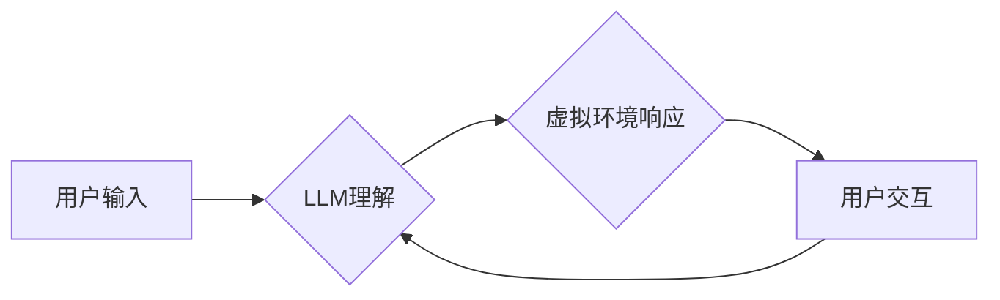

                 

## LLM在虚拟现实中的应用可能

> 关键词：大型语言模型 (LLM)、虚拟现实 (VR)、交互式体验、人工智能 (AI)、自然语言处理 (NLP)、沉浸式学习、虚拟助手、内容创作

## 1. 背景介绍

虚拟现实 (VR) 技术近年来发展迅速，为用户提供沉浸式、交互式的数字体验。大型语言模型 (LLM) 作为人工智能领域的一项突破性进展，拥有强大的文本理解和生成能力。将这两项技术结合，将为虚拟现实体验注入新的活力，创造出更加智能、个性化和富有互动性的虚拟世界。

当前，VR 应用主要集中在游戏、娱乐、培训和设计等领域。然而，这些应用往往缺乏深度和个性化。LLM 的加入可以打破这一局限性，赋予虚拟世界更强的智能和交互能力。例如，LLM 可以理解用户的自然语言指令，生成逼真的虚拟角色对话，甚至根据用户的喜好定制虚拟场景和体验。

## 2. 核心概念与联系

### 2.1 虚拟现实 (VR)

虚拟现实 (VR) 是一种利用计算机技术模拟真实环境或虚构环境的交互式体验技术。用户通过佩戴 VR 头显设备，可以沉浸在虚拟世界中，并通过手柄或其他设备与虚拟环境进行交互。

### 2.2 大型语言模型 (LLM)

大型语言模型 (LLM) 是一种基于深度学习的强大人工智能模型，能够理解和生成人类语言。通过训练海量文本数据，LLM 掌握了语言的语法、语义和上下文关系，可以执行各种自然语言处理 (NLP) 任务，例如文本生成、翻译、问答和对话。

### 2.3 核心概念联系

将 LLM 与 VR 技术结合，可以实现以下核心功能：

* **增强交互性:** LLM 可以理解用户的自然语言指令，并生成相应的虚拟环境响应，使虚拟体验更加自然和人性化。
* **个性化定制:** LLM 可以根据用户的喜好和行为模式，定制虚拟场景、角色和体验，提供更加个性化的虚拟世界。
* **智能内容生成:** LLM 可以根据用户的需求生成虚拟世界中的内容，例如故事、对话、任务和物品，丰富虚拟世界的可玩性和可探索性。

**Mermaid 流程图:**



## 3. 核心算法原理 & 具体操作步骤

### 3.1 算法原理概述

LLM 在 VR 应用中的核心算法原理主要基于自然语言处理 (NLP) 和机器学习 (ML) 技术。

* **自然语言处理 (NLP):** LLM 利用 NLP 技术理解用户的自然语言指令，并将其转换为虚拟环境可以识别的指令。
* **机器学习 (ML):** LLM 通过训练海量文本数据，学习语言的语法、语义和上下文关系，从而能够生成逼真的虚拟角色对话和内容。

### 3.2 算法步骤详解

1. **用户输入:** 用户通过语音或文本输入指令，例如“我要去森林里散步”或“请告诉我这个角色的故事”。
2. **LLM 理解:** LLM 利用 NLP 技术分析用户的输入，识别关键信息和意图。例如，识别“去森林里散步”中的地点和动作，识别“请告诉我这个角色的故事”中的角色和请求类型。
3. **虚拟环境响应:** 根据 LLM 的理解结果，虚拟环境生成相应的响应。例如，将用户带到虚拟森林场景，或向用户讲述虚拟角色的故事。
4. **用户交互:** 用户可以与虚拟环境进行交互，例如探索场景、与虚拟角色对话或完成任务。
5. **反馈循环:** 用户的交互行为会反馈给 LLM，LLM 会根据反馈信息调整其理解和生成内容，从而提供更加个性化和符合用户期望的虚拟体验。

### 3.3 算法优缺点

**优点:**

* **增强交互性:** LLM 可以理解用户的自然语言指令，使虚拟体验更加自然和人性化。
* **个性化定制:** LLM 可以根据用户的喜好和行为模式，定制虚拟场景、角色和体验，提供更加个性化的虚拟世界。
* **智能内容生成:** LLM 可以根据用户的需求生成虚拟世界中的内容，例如故事、对话、任务和物品，丰富虚拟世界的可玩性和可探索性。

**缺点:**

* **计算资源需求高:** LLM 的训练和运行需要大量的计算资源，这可能会限制其在低端设备上的应用。
* **数据依赖性强:** LLM 的性能取决于训练数据的质量和数量，如果训练数据不足或存在偏差，可能会导致模型生成不准确或不合适的响应。
* **伦理风险:** LLM 的强大能力也带来了一些伦理风险，例如生成虚假信息、传播偏见或侵犯隐私。

### 3.4 算法应用领域

LLM 在 VR 应用中的算法可以应用于以下领域:

* **沉浸式教育:** 创建互动式虚拟课堂，让学生沉浸在学习环境中，并与虚拟老师和同学进行交流。
* **虚拟旅游:** 提供虚拟旅游体验，让用户无需出家门即可游览世界各地，并与虚拟导游互动。
* **虚拟医疗:** 创建虚拟医疗环境，让医生可以远程诊断和治疗患者，并与患者进行互动式沟通。
* **虚拟娱乐:** 开发更加智能和交互式的虚拟游戏和娱乐体验，例如与虚拟角色进行对话、完成任务或探索虚拟世界。

## 4. 数学模型和公式 & 详细讲解 & 举例说明

### 4.1 数学模型构建

LLM 的核心数学模型通常基于 Transformer 架构。Transformer 模型利用注意力机制来捕捉文本序列中的长距离依赖关系，从而实现更准确的文本理解和生成。

**注意力机制:**

注意力机制是一种用于学习文本序列中重要信息的方法。它通过计算每个词与其他词之间的相关性，来确定每个词在句子中的重要程度。

**公式:**

$$
Attention(Q, K, V) = softmax(\frac{QK^T}{\sqrt{d_k}})V
$$

其中:

* $Q$ 是查询矩阵
* $K$ 是键矩阵
* $V$ 是值矩阵
* $d_k$ 是键向量的维度
* $softmax$ 是归一化函数

**举例说明:**

假设我们有一个句子 "The cat sat on the mat"。使用注意力机制，我们可以计算每个词与其他词之间的相关性。例如，"cat" 与 "sat" 之间存在较强的相关性，因为它们描述了同一个事件。

### 4.2 公式推导过程

Transformer 模型的注意力机制通过以下步骤计算每个词的注意力权重:

1. 将输入序列转换为查询 (Q)、键 (K) 和值 (V) 矩阵。
2. 计算每个词与所有其他词之间的相关性分数。
3. 使用 softmax 函数将相关性分数归一化，得到每个词的注意力权重。
4. 将注意力权重与值矩阵相乘，得到每个词的加权平均值，作为该词的最终表示。

### 4.3 案例分析与讲解

在 VR 应用中，LLM 可以利用注意力机制来理解用户的自然语言指令，并生成相应的虚拟环境响应。例如，当用户输入 "我想去海滩" 时，LLM 可以利用注意力机制识别 "海滩" 是用户想要去的目的地，并根据用户的历史行为和偏好，选择合适的虚拟海滩场景。

## 5. 项目实践：代码实例和详细解释说明

### 5.1 开发环境搭建

* **操作系统:** Windows/macOS/Linux
* **编程语言:** Python
* **深度学习框架:** TensorFlow/PyTorch
* **虚拟现实框架:** Unity/Unreal Engine

### 5.2 源代码详细实现

以下是一个简单的 Python 代码示例，演示了如何使用 LLM 生成虚拟角色对话:

```python
import openai

# 设置 OpenAI API 密钥
openai.api_key = "YOUR_API_KEY"

# 定义虚拟角色
character = "Bard"

# 用户输入
user_input = "你好，Bard"

# 使用 OpenAI API 生成角色对话
response = openai.Completion.create(
    engine="text-davinci-003",
    prompt=f"{character}: {user_input}",
    max_tokens=100,
    temperature=0.7
)

# 打印角色对话
print(response.choices[0].text)
```

**代码解读与分析:**

* 该代码使用 OpenAI 的 API 调用 text-davinci-003 模型，生成虚拟角色 Bard 的对话。
* `prompt` 参数指定了对话的初始内容，包括角色名称和用户输入。
* `max_tokens` 参数控制了生成的对话长度。
* `temperature` 参数控制了模型的随机性，值越大，生成的对话越随机。

### 5.3 运行结果展示

运行该代码后，将输出 Bard 的对话回复，例如:

```
Bard: 你好！很高兴认识你。有什么我可以帮你的吗？
```

## 6. 实际应用场景

### 6.1 沉浸式教育

LLM 可以为虚拟课堂增添互动性和个性化，例如:

* **虚拟导师:** LLM 可以扮演虚拟导师角色，解答学生疑问，提供个性化学习建议。
* **虚拟实验:** LLM 可以生成虚拟实验场景，让学生在安全的环境中进行实验操作。
* **虚拟角色扮演:** LLM 可以生成虚拟角色，让学生参与角色扮演游戏，学习历史事件或社会文化知识。

### 6.2 虚拟旅游

LLM 可以为虚拟旅游体验增添真实感和趣味性，例如:

* **虚拟导游:** LLM 可以扮演虚拟导游角色，向用户讲解景点历史和文化，提供个性化旅游建议。
* **虚拟互动:** LLM 可以与用户进行互动式对话，例如回答用户问题，提供景点推荐，甚至进行虚拟合影。
* **虚拟语言学习:** LLM 可以帮助用户在虚拟旅游场景中学习外语，例如与虚拟当地人进行对话，练习口语表达。

### 6.3 虚拟医疗

LLM 可以为虚拟医疗环境增添智能性和人性化，例如:

* **虚拟医生:** LLM 可以扮演虚拟医生角色，与患者进行问诊，提供初步诊断和治疗建议。
* **虚拟陪护:** LLM 可以陪伴患者进行虚拟治疗，提供情感支持和鼓励。
* **虚拟健康教育:** LLM 可以向患者提供健康知识和疾病信息，帮助患者更好地了解自己的身体状况。

### 6.4 未来应用展望

随着 LLM 技术的不断发展，其在 VR 应用中的潜力将更加巨大。未来，LLM 可能应用于以下领域:

* **虚拟社交:** 创建更加逼真的虚拟社交平台，让用户可以与虚拟角色或其他用户进行互动。
* **虚拟艺术创作:** 利用 LLM 生成虚拟艺术作品，例如绘画、音乐和文学作品。
* **虚拟设计:** 利用 LLM 辅助设计师进行虚拟产品设计，例如服装、家具和建筑。

## 7. 工具和资源推荐

### 7.1 学习资源推荐

* **OpenAI API 文档:** https://platform.openai.com/docs/api-reference
* **Hugging Face Transformers 库:** https://huggingface.co/docs/transformers/index
* **Deep Learning Specialization (Coursera):** https://www.coursera.org/specializations/deep-learning

### 7.2 开发工具推荐

* **Unity:** https://unity.com/
* **Unreal Engine:** https://www.unrealengine.com/
* **TensorFlow:** https://www.tensorflow.org/
* **PyTorch:** https://pytorch.org/

### 7.3 相关论文推荐

* **Attention Is All You Need:** https://arxiv.org/abs/1706.03762
* **BERT: Pre-training of Deep Bidirectional Transformers for Language Understanding:** https://arxiv.org/abs/1810.04805
* **GPT-3: Language Models are Few-Shot Learners:** https://arxiv.org/abs/2005.14165

## 8. 总结：未来发展趋势与挑战

### 8.1 研究成果总结

LLM 在 VR 应用领域取得了显著进展，为虚拟体验注入新的活力和智能。

### 8.2 未来发展趋势

* **更强大的 LLMs:** 未来，LLM 模型将更加强大，能够理解和生成更加复杂和自然的语言。
* **更沉浸式的 VR 体验:** LLM 将与其他 VR 技术相结合，例如增强现实 (AR) 和触觉反馈，创造更加沉浸式的虚拟体验。
* **更广泛的应用场景:** LLM 将应用于更多 VR 应用场景，例如医疗、教育、娱乐和商业。

### 8.3 面临的挑战

* **计算资源需求:** 训练和运行大型 LLMs 需要大量的计算资源，这可能会限制其在低端设备上的应用。
* **数据依赖性:** LLM 的性能取决于训练数据的质量和数量，如果训练数据不足或存在偏差，可能会导致模型生成不准确或不合适的响应。
* **伦理风险:** LLM 的强大能力也带来了一些伦理风险，例如生成虚假信息、传播偏见或侵犯隐私。

### 8.4 研究展望

未来，LLM 在 VR 应用领域的研究将继续深入，重点关注以下方面:

* **高效的 LLM 训练方法:** 开发更加高效的 LLM 训练方法，降低计算资源需求。
* **数据增强和去偏见技术:** 开发数据增强和去偏见技术，提高训练数据的质量和多样性。
* **伦理规范和安全机制:** 制定 LLM 在 VR 应用中的伦理规范和安全机制，规避潜在风险。


## 9. 附录：常见问题与解答

**Q1: LLM 在 VR 应用中有哪些优势？**

**A1:** LLM 在 VR 应用中可以增强交互性、个性化定制和智能内容生成，为用户提供更加沉浸式和富有互动性的虚拟体验。

**Q2: LLM 在 VR 应用中有哪些挑战？**

**A2:** LLM 在 VR 应用中面临的挑战包括计算资源需求高、数据依赖性强和伦理风险等。

**Q3: 如何选择合适的 LLM 模型用于 VR 应用？**

**A3:** 选择合适的 LLM 模型需要考虑应用场景、性能需求和计算资源限制等因素。

**Q4: 如何确保 LLM 在 VR 应用中的安全性和可靠性？**

**A4:** 确保 LLM 在 VR 应用中的安全性和可靠性需要制定相应的伦理规范和安全机制，并进行严格的测试和评估。


作者：禅与计算机程序设计艺术 / Zen and the Art of Computer Programming<end_of_turn>

