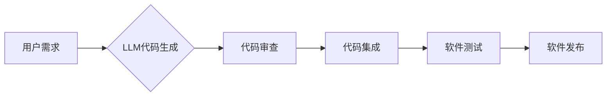

                 

## LLM对软件开发流程的潜在影响

> 关键词：大型语言模型 (LLM)、软件开发、代码生成、代码理解、软件测试、自动化、效率提升、创新

## 1. 背景介绍

软件开发行业正处于快速变革的时期，人工智能 (AI) 技术的不断发展为软件开发流程带来了前所未有的机遇。大型语言模型 (LLM) 作为 AI 技术的重要分支，凭借其强大的自然语言处理能力，展现出巨大的潜力，有望深刻地改变软件开发的各个环节。

LLM 是一种深度学习模型，通过训练海量文本数据，能够理解和生成人类语言。近年来，随着模型规模和训练数据的不断增长，LLM 的性能取得了飞跃式进步，在文本生成、翻译、问答等领域展现出令人惊叹的成果。

在软件开发领域，LLM 可以应用于代码生成、代码理解、软件测试等多个方面，极大地提高开发效率，降低开发成本，并促进软件开发的创新。

## 2. 核心概念与联系

### 2.1  LLM 的核心概念

LLM 的核心概念在于利用深度学习算法训练一个庞大的神经网络模型，使其能够学习和理解人类语言的复杂结构和语义关系。通过训练海量文本数据，LLM 可以掌握语言的语法规则、词汇表、语义理解等知识，并能够根据输入的文本生成流畅、自然的文本输出。

### 2.2  LLM 与软件开发的联系

LLM 与软件开发的联系主要体现在以下几个方面：

* **代码生成:** LLM 可以根据自然语言描述生成相应的代码，例如，用户可以描述一个功能需求，LLM 就可以生成对应的代码实现。
* **代码理解:** LLM 可以理解和解释代码的含义，帮助开发人员理解复杂的代码逻辑，并进行代码维护和调试。
* **软件测试:** LLM 可以自动生成测试用例，并进行代码测试，提高软件测试的效率和覆盖率。
* **文档生成:** LLM 可以自动生成软件文档，例如 API 文档、用户手册等，减少开发人员的文档编写工作量。

**Mermaid 流程图:**



## 3. 核心算法原理 & 具体操作步骤

### 3.1  算法原理概述

LLM 的核心算法原理是基于 Transformer 架构的深度学习模型。Transformer 模型通过自注意力机制学习文本序列之间的关系，能够捕捉长距离依赖关系，从而实现更准确的文本理解和生成。

LLM 的训练过程主要包括以下步骤：

1. **数据预处理:** 将海量文本数据进行清洗、分词、标记等预处理操作，使其能够被模型理解。
2. **模型训练:** 使用深度学习算法训练 Transformer 模型，使其能够学习文本的语义关系和生成能力。
3. **模型评估:** 使用测试数据集评估模型的性能，并根据评估结果进行模型调优。

### 3.2  算法步骤详解

1. **输入文本序列:** 将用户输入的文本序列作为模型的输入。
2. **词嵌入:** 将文本序列中的每个词转换为向量表示，以便模型进行处理。
3. **自注意力机制:** 使用自注意力机制计算每个词与其他词之间的关系，捕捉文本序列中的上下文信息。
4. **前馈神经网络:** 将自注意力机制的输出作为输入，通过多层前馈神经网络进行处理，提取文本的语义特征。
5. **输出文本序列:** 根据模型的输出，生成相应的文本序列。

### 3.3  算法优缺点

**优点:**

* **强大的文本理解和生成能力:** LLM 可以理解和生成人类语言，并能够进行复杂的文本处理任务。
* **可扩展性强:** LLM 的模型规模可以不断扩大，从而提升其性能。
* **通用性强:** LLM 可以应用于多个领域，例如自然语言处理、机器翻译、代码生成等。

**缺点:**

* **训练成本高:** 训练大型语言模型需要大量的计算资源和时间。
* **数据依赖性强:** LLM 的性能取决于训练数据的质量和数量。
* **可解释性差:** LLM 的决策过程难以理解，这可能会导致模型的不可信赖性。

### 3.4  算法应用领域

LLM 的应用领域非常广泛，包括：

* **自然语言处理:** 文本分类、情感分析、机器翻译、问答系统等。
* **代码生成:** 自动生成代码、代码补全、代码修复等。
* **软件测试:** 自动生成测试用例、代码测试等。
* **文档生成:** 自动生成软件文档、用户手册等。
* **创意写作:** 生成诗歌、小说、剧本等。

## 4. 数学模型和公式 & 详细讲解 & 举例说明

### 4.1  数学模型构建

LLM 的数学模型主要基于 Transformer 架构，其核心是自注意力机制。自注意力机制通过计算每个词与其他词之间的权重，来捕捉文本序列中的上下文信息。

**公式:**

$$
Attention(Q, K, V) = softmax(\frac{QK^T}{\sqrt{d_k}})V
$$

其中：

* $Q$：查询矩阵
* $K$：键矩阵
* $V$：值矩阵
* $d_k$：键向量的维度
* $softmax$：softmax 函数

### 4.2  公式推导过程

自注意力机制的公式推导过程如下：

1. 将查询矩阵 $Q$、键矩阵 $K$ 和值矩阵 $V$ 进行矩阵乘法，得到一个得分矩阵。
2. 对得分矩阵进行 softmax 操作，得到每个词与其他词之间的权重。
3. 将权重矩阵与值矩阵相乘，得到最终的注意力输出。

### 4.3  案例分析与讲解

例如，对于一个句子 "The cat sat on the mat"，自注意力机制可以计算每个词与其他词之间的关系，例如 "cat" 与 "sat" 之间的关系、"sat" 与 "on" 之间的关系等。通过这些关系，LLM 可以更好地理解句子的语义。

## 5. 项目实践：代码实例和详细解释说明

### 5.1  开发环境搭建

为了演示 LLM 在代码生成方面的应用，我们可以使用 Python 语言和 HuggingFace Transformers 库搭建开发环境。

**依赖包:**

```
pip install transformers
```

### 5.2  源代码详细实现

```python
from transformers import pipeline

# 初始化代码生成器
generator = pipeline("text-generation", model="gpt2")

# 输入代码描述
prompt = "编写一个 Python 函数，计算两个整数的和。"

# 生成代码
output = generator(prompt, max_length=100, num_return_sequences=1)

# 打印生成的代码
print(output[0]['generated_text'])
```

### 5.3  代码解读与分析

这段代码首先使用 HuggingFace Transformers 库初始化一个代码生成器，模型选择的是 GPT-2。然后，我们输入一个代码描述，例如 "编写一个 Python 函数，计算两个整数的和。" 代码生成器会根据输入的描述生成相应的 Python 代码。

### 5.4  运行结果展示

运行这段代码后，会输出以下类似的 Python 代码：

```python
def sum_two_numbers(a, b):
  return a + b
```

## 6. 实际应用场景

LLM 在软件开发领域的应用场景非常广泛，例如：

* **代码自动补全:** LLM 可以根据开发人员输入的代码片段，自动预测并补全后续代码，提高开发效率。
* **代码生成:** LLM 可以根据自然语言描述生成相应的代码，例如，用户可以描述一个功能需求，LLM 就可以生成对应的代码实现。
* **代码修复:** LLM 可以分析代码中的错误，并自动生成修复代码，帮助开发人员快速解决代码问题。
* **软件测试:** LLM 可以自动生成测试用例，并进行代码测试，提高软件测试的效率和覆盖率。
* **文档生成:** LLM 可以自动生成软件文档，例如 API 文档、用户手册等，减少开发人员的文档编写工作量。

### 6.4  未来应用展望

随着 LLM 技术的不断发展，其在软件开发领域的应用场景将会更加广泛，例如：

* **代码翻译:** LLM 可以将代码从一种编程语言翻译成另一种编程语言，帮助开发人员跨语言开发软件。
* **代码风格检查:** LLM 可以分析代码的风格，并提供建议，帮助开发人员编写更规范、易读的代码。
* **代码安全分析:** LLM 可以分析代码中的安全漏洞，帮助开发人员提高软件的安全性。

## 7. 工具和资源推荐

### 7.1  学习资源推荐

* **HuggingFace Transformers:** https://huggingface.co/docs/transformers/index
* **OpenAI API:** https://beta.openai.com/docs/api-reference/introduction
* **DeepLearning.AI:** https://www.deeplearning.ai/

### 7.2  开发工具推荐

* **VS Code:** https://code.visualstudio.com/
* **PyCharm:** https://www.jetbrains.com/pycharm/
* **Jupyter Notebook:** https://jupyter.org/

### 7.3  相关论文推荐

* **Attention Is All You Need:** https://arxiv.org/abs/1706.03762
* **BERT: Pre-training of Deep Bidirectional Transformers for Language Understanding:** https://arxiv.org/abs/1810.04805
* **GPT-3: Language Models are Few-Shot Learners:** https://arxiv.org/abs/2005.14165

## 8. 总结：未来发展趋势与挑战

### 8.1  研究成果总结

LLM 在软件开发领域的应用取得了显著的成果，例如代码生成、代码理解、软件测试等方面都展现出巨大的潜力。

### 8.2  未来发展趋势

LLM 的未来发展趋势包括：

* **模型规模的进一步扩大:** 更大的模型规模能够带来更强的性能和更广泛的应用场景。
* **多模态 LLMs:** 将文本、图像、音频等多种模态信息融合到 LLMs 中，实现更丰富的应用场景。
* **可解释性增强:** 研究更可解释的 LLM 模型，提高模型的透明度和可信赖性。

### 8.3  面临的挑战

LLM 在软件开发领域的应用也面临一些挑战，例如：

* **数据安全和隐私:** LLM 的训练需要海量数据，如何保证数据安全和隐私是一个重要问题。
* **模型偏见:** LLM 的训练数据可能存在偏见，导致模型生成的结果也存在偏见。
* **伦理问题:** LLM 的应用可能会带来一些伦理问题，例如代码自动生成可能会导致工作岗位减少。

### 8.4  研究展望

未来，我们需要继续研究 LLM 的算法原理、模型架构、应用场景等方面，并解决其面临的挑战，推动 LLM 技术在软件开发领域的健康发展。

## 9. 附录：常见问题与解答

**Q1: LLM 是否能够完全替代软件开发人员？**

**A1:** 目前，LLM 只能辅助软件开发人员，并不能完全替代他们。LLM 擅长于代码生成、代码理解等自动化任务，但仍然需要开发人员进行代码设计、架构设计、测试和维护等工作。

**Q2: 如何确保 LLM 生成的代码质量？**

**A2:** LLM 生成的代码需要经过开发人员的审查和测试，以确保其质量和安全性。

**Q3: LLM 的训练数据来源是什么？**

**A3:** LLM 的训练数据通常来自公开的文本数据集，例如维基百科、书籍、代码库等。

**Q4: 如何解决 LLM 模型的偏见问题？**

**A4:** 为了解决 LLM 模型的偏见问题，需要使用更加多样化、更加公平的数据集进行训练，并进行模型的调优和评估。


作者：禅与计算机程序设计艺术 / Zen and the Art of Computer Programming<end_of_turn>

