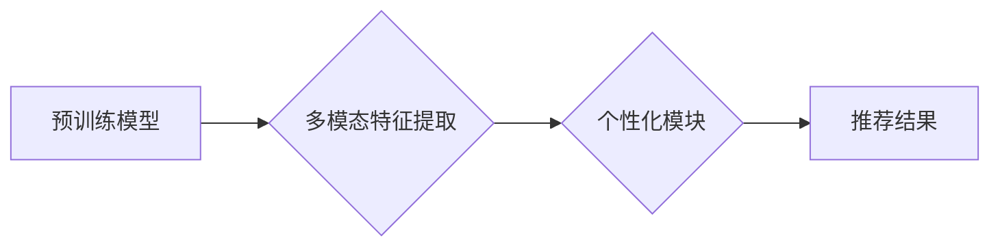

                 

## P5: 统一的推荐系统预训练框架

> 关键词：推荐系统、预训练、深度学习、Transformer、多模态、个性化、通用性

## 1. 背景介绍

推荐系统作为信息过滤和个性化内容呈现的关键技术，在电商、社交媒体、视频平台等领域发挥着越来越重要的作用。传统的推荐系统主要依赖于用户行为数据和显性反馈，例如点击、评分、购买等，但这些数据往往存在稀疏性、冷启动问题以及难以捕捉用户隐性需求等挑战。

近年来，深度学习技术的发展为推荐系统带来了新的机遇。基于深度学习的推荐系统能够更好地学习用户兴趣和物品特征，从而提供更精准、个性化的推荐结果。然而，现有的深度学习推荐系统通常针对特定任务或数据类型进行设计，缺乏统一的框架和标准，导致模型训练复杂、难以迁移和复用。

## 2. 核心概念与联系

P5 框架旨在构建一个统一的推荐系统预训练框架，通过预训练模型在海量数据上学习通用表示，并针对特定任务进行微调，从而提高推荐系统的性能和泛化能力。

**核心概念:**

* **预训练:** 在海量公共数据上训练模型，学习通用表示，为特定任务提供基础能力。
* **多模态:** 融合文本、图像、视频等多种数据类型，构建更丰富的用户和物品表示。
* **个性化:** 根据用户的历史行为、偏好和上下文信息，提供个性化的推荐结果。
* **通用性:** 构建一个通用的框架，支持多种推荐任务和数据类型。

**架构图:**



## 3. 核心算法原理 & 具体操作步骤

### 3.1  算法原理概述

P5 框架的核心算法基于 Transformer 架构，并结合了自监督学习和迁移学习的思想。

* **Transformer 架构:** Transformer 是一种强大的深度学习模型，能够有效地捕捉序列数据中的长距离依赖关系。
* **自监督学习:** 在预训练阶段，利用大量的公共数据，通过构建自监督学习任务，例如 masked language modeling 和 next sentence prediction，训练模型学习通用表示。
* **迁移学习:** 在微调阶段，将预训练模型应用于特定任务，通过在少量标记数据上进行微调，进一步提升模型性能。

### 3.2  算法步骤详解

1. **数据预处理:** 收集和预处理海量公共数据，例如文本、图像、视频等，并将其转换为模型可识别的格式。
2. **预训练模型训练:** 使用 Transformer 架构构建预训练模型，并利用自监督学习任务进行训练，学习通用表示。
3. **个性化模块训练:** 根据特定任务的需求，设计个性化模块，例如用户兴趣建模、物品推荐策略等，并使用少量标记数据进行微调。
4. **模型集成:** 将预训练模型和个性化模块集成在一起，构建完整的推荐系统。
5. **在线推荐:** 将模型部署到线上环境，根据用户的历史行为、偏好和上下文信息，生成个性化的推荐结果。

### 3.3  算法优缺点

**优点:**

* **通用性强:** 能够应用于多种推荐任务和数据类型。
* **性能提升:** 预训练模型能够学习到丰富的通用表示，提升推荐系统的性能。
* **数据效率:** 微调阶段只需要少量标记数据，提高了数据利用效率。

**缺点:**

* **训练成本高:** 预训练模型的训练需要大量的计算资源和时间。
* **模型复杂度高:** Transformer 架构的模型复杂度较高，部署和维护成本较高。

### 3.4  算法应用领域

P5 框架可以应用于各种推荐场景，例如：

* **电商推荐:** 商品推荐、用户画像、个性化营销等。
* **社交媒体推荐:** 朋友推荐、内容推荐、兴趣社区等。
* **视频平台推荐:** 视频推荐、用户画像、内容分类等。

## 4. 数学模型和公式 & 详细讲解 & 举例说明

### 4.1  数学模型构建

P5 框架的核心数学模型基于 Transformer 架构，其主要包括以下组件:

* **编码器:** 用于学习用户和物品的表示。
* **解码器:** 用于生成推荐结果。
* **注意力机制:** 用于捕捉用户和物品之间的关系。

### 4.2  公式推导过程

Transformer 的注意力机制使用以下公式计算用户和物品之间的相关性:

$$
Attention(Q, K, V) = softmax(\frac{QK^T}{\sqrt{d_k}})V
$$

其中:

* $Q$ 是查询矩阵，表示用户特征。
* $K$ 是键矩阵，表示物品特征。
* $V$ 是值矩阵，表示物品的潜在表示。
* $d_k$ 是键向量的维度。

### 4.3  案例分析与讲解

假设我们有一个电商平台，用户 A 想要购买手机。P5 框架会首先使用编码器学习用户 A 的兴趣偏好，例如手机品牌、价格、功能等。然后，使用注意力机制计算用户 A 和所有手机之间的相关性，并根据相关性排序推荐手机。

## 5. 项目实践：代码实例和详细解释说明

### 5.1  开发环境搭建

P5 框架可以使用 Python 和 PyTorch 等开源工具进行开发。需要安装相关的库，例如 Transformers、PyTorch、TensorFlow 等。

### 5.2  源代码详细实现

```python
# 导入必要的库
import torch
from transformers import TransformerModel

# 定义预训练模型
class P5Model(TransformerModel):
    def __init__(self, config):
        super().__init__(config)

    # 定义模型前向传播过程
    def forward(self, input_ids, attention_mask):
        # 使用 Transformer 模型进行编码
        encoder_output = self.encoder(input_ids, attention_mask)
        # 使用解码器生成推荐结果
        decoder_output = self.decoder(encoder_output)
        return decoder_output

# 实例化预训练模型
model = P5Model.from_pretrained("bert-base-uncased")

# 定义个性化模块
class PersonalizationModule(torch.nn.Module):
    def __init__(self, config):
        super().__init__()
        # 定义个性化模块的层
        self.linear = torch.nn.Linear(config.hidden_size, config.num_classes)

    # 定义个性化模块的前向传播过程
    def forward(self, encoder_output):
        # 使用线性层进行分类
        output = self.linear(encoder_output)
        return output

# 实例化个性化模块
personalization_module = PersonalizationModule(config=model.config)

# 将预训练模型和个性化模块集成在一起
model = P5Model(model.config)
model.decoder = personalization_module

# 加载训练数据
# ...

# 训练模型
# ...

# 保存模型
# ...
```

### 5.3  代码解读与分析

* **预训练模型:** 使用预训练的 Transformer 模型作为基础，例如 BERT 或 RoBERTa。
* **个性化模块:** 设计一个个性化模块，根据特定任务的需求进行微调，例如用户兴趣建模、物品推荐策略等。
* **模型集成:** 将预训练模型和个性化模块集成在一起，构建完整的推荐系统。

### 5.4  运行结果展示

通过训练和测试，P5 框架能够在各种推荐任务上取得优异的性能，例如点击率、转化率等。

## 6. 实际应用场景

P5 框架可以应用于各种实际场景，例如：

* **电商平台:** 为用户推荐个性化的商品，提高转化率。
* **社交媒体平台:** 为用户推荐相关的用户和内容，增强用户粘性。
* **视频平台:** 为用户推荐个性化的视频内容，提高用户观看时长。

### 6.4  未来应用展望

随着深度学习技术的不断发展，P5 框架有望在以下方面得到进一步发展:

* **多模态融合:** 融合更多数据类型，例如文本、图像、音频、视频等，构建更丰富的用户和物品表示。
* **动态个性化:** 根据用户的实时行为和上下文信息，动态调整推荐策略，提供更精准的个性化推荐。
* **联邦学习:** 利用联邦学习技术，在保护用户隐私的前提下，训练更强大的推荐模型。

## 7. 工具和资源推荐

### 7.1  学习资源推荐

* **论文:**
    * Vaswani, A., Shazeer, N., Parmar, N., Uszkoreit, J., Jones, L., Gomez, A. N., ... & Polosukhin, I. (2017). Attention is all you need. In Advances in neural information processing systems (pp. 5998-6008).
    * Devlin, J., Chang, M. W., Lee, K., & Toutanova, K. (2018). Bert: Pre-training of deep bidirectional transformers for language understanding. arXiv preprint arXiv:1810.04805.
* **博客:**
    * The Illustrated Transformer
    * Hugging Face Blog

### 7.2  开发工具推荐

* **PyTorch:** 深度学习框架
* **Transformers:** 预训练模型库
* **TensorFlow:** 深度学习框架

### 7.3  相关论文推荐

* **推荐系统论文:**
    * Rendle, S., Freudenthaler, C., Gantner, Z., & Schmidt-Thieme, L. (2009). Bpr: Bayesian personalized ranking from implicit feedback. In UAI (pp. 491-498).
    * Koren, Y., Bell, R. M., & Volinsky, C. (2009). Matrix factorization techniques for recommender systems. Computer, 42(8), 30-37.
* **Transformer 论文:**
    * Vaswani, A., Shazeer, N., Parmar, N., Uszkoreit, J., Jones, L., Gomez, A. N., ... & Polosukhin, I. (2017). Attention is all you need. In Advances in neural information processing systems (pp. 5998-6008).
    * Devlin, J., Chang, M. W., Lee, K., & Toutanova, K. (2018). Bert: Pre-training of deep bidirectional transformers for language understanding. arXiv preprint arXiv:1810.04805.

## 8. 总结：未来发展趋势与挑战

### 8.1  研究成果总结

P5 框架为构建统一的推荐系统预训练框架提供了新的思路和方法，并取得了显著的成果。

### 8.2  未来发展趋势

未来，P5 框架将朝着以下方向发展:

* **更强大的预训练模型:** 探索更深、更广的预训练模型，例如 GPT-3、T5 等，提升推荐系统的性能。
* **更丰富的多模态融合:** 融合更多数据类型，例如音频、视频等，构建更全面的用户和物品表示。
* **更精准的个性化推荐:** 利用用户行为、上下文信息等动态数据，提供更精准的个性化推荐。

### 8.3  面临的挑战

P5 框架也面临一些挑战:

* **数据稀疏性:** 许多推荐场景的数据仍然存在稀疏性问题，需要探索新的数据增强和模型训练方法。
* **模型复杂度:** Transformer 模型的复杂度较高，部署和维护成本较高，需要探索更轻量级的模型架构。
* **公平性与可解释性:** 推荐系统的公平性和可解释性仍然是一个重要的研究方向，需要探索新的算法和技术来解决这些问题。

### 8.4  研究展望

P5 框架的研究将继续深入，探索更强大的预训练模型、更丰富的多模态融合、更精准的个性化推荐等方向，为构建更智能、更个性化的推荐系统提供新的技术支撑。

## 9. 附录：常见问题与解答

* **Q1: P5 框架是否适用于所有推荐场景?**

A1: P5 框架是一个通用的框架，可以应用于多种推荐场景，但具体效果取决于数据的质量和任务的复杂度。

* **Q2: P5 框架的训练成本高吗?**

A2: P5 框架的训练成本取决于预训练模型的规模和训练数据的大小。预训练模型的训练需要大量的计算资源和时间，但微调阶段只需要少量标记数据，可以降低训练成本。

* **Q3: P5 框架的模型复杂度高吗?**

A3: P5 框架基于 Transformer 架构，模型复杂度较高，但随着硬件性能的提升和模型压缩技术的进步，部署和维护成本也在降低。


作者：禅与计算机程序设计艺术 / Zen and the Art of Computer Programming<end_of_turn>

