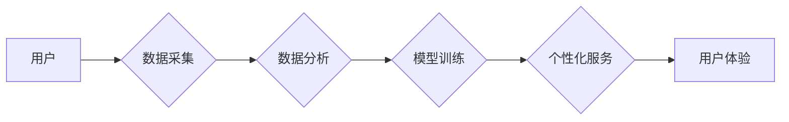

                 

## 体验经济的演变：AI驱动的个性化服务

> 关键词：体验经济、人工智能、个性化服务、机器学习、深度学习、自然语言处理、推荐系统、数据分析

### 1. 背景介绍

随着经济发展和科技进步，人类社会从物质经济向体验经济的演变已成为不可逆转的趋势。体验经济强调提供独特的、难忘的体验，而非单纯的产品或服务。在这个新经济模式下，个性化服务成为核心竞争力，消费者越来越渴望获得定制化的产品和服务，满足其独特的需求和喜好。

人工智能（AI）技术的快速发展为体验经济的演变提供了强大的技术支撑。AI能够通过学习和分析海量数据，理解用户的需求和偏好，从而提供更加个性化、精准的体验。从智能推荐系统到个性化内容定制，AI正在深刻地改变着我们生活的方方面面。

### 2. 核心概念与联系

**2.1 体验经济**

体验经济是指以提供独特的、难忘的体验为核心价值的经济模式。它强调创造情感价值，而非单纯的物质价值。体验经济的核心要素包括：

* **参与感:** 消费者积极参与到体验过程中，而非被动地接受服务。
* **情感价值:** 体验能够引发消费者的情感共鸣，留下深刻的印象。
* **个性化:** 体验能够根据消费者的需求和喜好进行定制化。
* **互动性:** 体验能够促进消费者之间的互动和交流。

**2.2 个性化服务**

个性化服务是指根据用户的具体需求和喜好，提供定制化的产品和服务。它旨在满足用户的独特需求，提升用户体验。个性化服务的实现需要依赖于对用户的深入了解和精准的预测。

**2.3 人工智能**

人工智能是指模拟人类智能的计算机系统。它能够通过学习和分析数据，完成复杂的认知任务，例如：

* **学习和推理:** 从数据中学习知识和规律，并进行逻辑推理。
* **自然语言处理:** 理解和生成人类语言。
* **计算机视觉:** 识别和理解图像和视频。
* **决策 making:** 根据数据和规则做出决策。

**2.4 AI驱动的个性化服务**

AI驱动的个性化服务是指利用人工智能技术，根据用户的需求和喜好，提供定制化的产品和服务。它能够通过分析用户的行为数据、偏好信息和上下文环境，提供更加精准、个性化的体验。

**2.5 架构图**



### 3. 核心算法原理 & 具体操作步骤

**3.1 算法原理概述**

AI驱动的个性化服务主要依赖于以下核心算法：

* **机器学习:** 通过训练模型，从数据中学习规律，并进行预测。
* **深度学习:** 利用多层神经网络，学习更复杂的特征和模式。
* **自然语言处理:** 理解和生成人类语言，用于个性化内容推荐和对话系统。
* **推荐系统:** 根据用户的历史行为和偏好，推荐相关产品或服务。

**3.2 算法步骤详解**

1. **数据采集:** 收集用户的行为数据、偏好信息、上下文环境等数据。
2. **数据预处理:** 清洗、转换和格式化数据，使其适合模型训练。
3. **特征工程:** 从原始数据中提取有价值的特征，用于模型训练。
4. **模型选择:** 选择合适的机器学习模型，例如线性回归、决策树、支持向量机等。
5. **模型训练:** 利用训练数据，训练模型并调整模型参数。
6. **模型评估:** 使用测试数据评估模型的性能，例如准确率、召回率等。
7. **模型部署:** 将训练好的模型部署到生产环境中，用于提供个性化服务。
8. **持续优化:** 持续收集用户反馈和数据，对模型进行调整和优化。

**3.3 算法优缺点**

**优点:**

* **个性化:** 可以根据用户的需求和喜好提供定制化的服务。
* **精准度:** 可以通过分析数据，预测用户的需求和行为。
* **效率:** 可以自动化提供服务，提高效率。

**缺点:**

* **数据依赖:** 需要大量的数据进行训练和优化。
* **算法复杂:** 需要专业的技术人员进行开发和维护。
* **隐私问题:** 需要谨慎处理用户的个人数据。

**3.4 算法应用领域**

AI驱动的个性化服务应用于各个领域，例如：

* **电商:** 个性化商品推荐、精准营销。
* **教育:** 个性化学习路径、智能辅导。
* **医疗:** 个性化诊断、精准治疗。
* **金融:** 个性化理财建议、风险管理。
* **娱乐:** 个性化内容推荐、智能游戏。

### 4. 数学模型和公式 & 详细讲解 & 举例说明

**4.1 数学模型构建**

个性化推荐系统通常采用协同过滤算法，其核心思想是基于用户的相似度或物品的相似度进行推荐。

**4.2 公式推导过程**

协同过滤算法的数学模型可以表示为：

$$
r_{ui} = \frac{\sum_{j \in N(u)} s_{uj} \cdot r_{uj}}{\sum_{j \in N(u)} s_{uj}}
$$

其中：

* $r_{ui}$ 表示用户 $u$ 对物品 $i$ 的评分。
* $N(u)$ 表示与用户 $u$ 相似的用户集合。
* $s_{uj}$ 表示用户 $u$ 和用户 $j$ 的相似度。
* $r_{uj}$ 表示用户 $j$ 对物品 $i$ 的评分。

**4.3 案例分析与讲解**

假设有一个电影推荐系统，用户 Alice 和用户 Bob 都喜欢动作片，Alice 对电影 A 给出了 5 分，Bob 对电影 A 给出了 4 分。如果系统认为 Alice 和 Bob 的相似度较高，那么系统会推断出 Alice 也可能喜欢电影 B，因为 Bob 对电影 B 给出了 5 分。

**4.4 公式应用场景**

该公式可以应用于各种个性化推荐场景，例如：

* **电影推荐:** 根据用户的观看历史和评分，推荐相似的电影。
* **音乐推荐:** 根据用户的听歌记录和喜好，推荐相似的音乐。
* **商品推荐:** 根据用户的购买历史和浏览记录，推荐相似的商品。

### 5. 项目实践：代码实例和详细解释说明

**5.1 开发环境搭建**

* Python 3.x
* TensorFlow 或 PyTorch
* Jupyter Notebook

**5.2 源代码详细实现**

```python
import pandas as pd
from sklearn.metrics.pairwise import cosine_similarity

# 加载用户评分数据
ratings = pd.read_csv('ratings.csv')

# 计算用户之间的相似度
user_similarity = cosine_similarity(ratings)

# 获取用户 Alice 的相似用户
alice_similar_users = user_similarity[0].argsort()[:-6:-1]

# 获取用户 Alice 喜欢的电影
alice_liked_movies = ratings[ratings.user == 0].index

# 推荐用户 Alice 可能喜欢的电影
recommendations = []
for user in alice_similar_users:
    for movie in ratings.index:
        if ratings.loc[user, movie] > 0 and movie not in alice_liked_movies:
            recommendations.append(movie)

# 打印推荐结果
print(recommendations)
```

**5.3 代码解读与分析**

* 该代码首先加载用户评分数据，然后使用 cosine_similarity 函数计算用户之间的相似度。
* 接着，根据用户 Alice 的相似用户，推荐用户 Alice 可能喜欢的电影。
* 最后，打印推荐结果。

**5.4 运行结果展示**

运行该代码后，将输出用户 Alice 可能喜欢的电影列表。

### 6. 实际应用场景

**6.1 电商平台**

电商平台可以利用 AI驱动的个性化服务，根据用户的浏览历史、购买记录和喜好，推荐相关的商品，提高用户转化率和购买金额。

**6.2 教育平台**

教育平台可以利用 AI驱动的个性化服务，根据学生的学习进度、知识掌握情况和学习风格，定制个性化的学习路径和辅导方案，提高学生的学习效率和兴趣。

**6.3 医疗保健**

医疗保健机构可以利用 AI驱动的个性化服务，根据患者的病史、症状和基因信息，提供个性化的诊断、治疗和健康管理方案，提高医疗服务的精准性和效率。

**6.4 未来应用展望**

随着 AI 技术的不断发展，AI驱动的个性化服务将应用于更多领域，例如：

* **智能家居:** 根据用户的习惯和喜好，自动调节家居环境。
* **智能交通:** 根据用户的出行需求，提供个性化的路线规划和交通服务。
* **个性化娱乐:** 根据用户的兴趣爱好，推荐个性化的音乐、电影和游戏。

### 7. 工具和资源推荐

**7.1 学习资源推荐**

* **书籍:**
    * 《深度学习》
    * 《机器学习实战》
    * 《自然语言处理》
* **在线课程:**
    * Coursera
    * edX
    * Udacity

**7.2 开发工具推荐**

* **Python:**
    * TensorFlow
    * PyTorch
    * scikit-learn
* **云平台:**
    * AWS
    * Azure
    * Google Cloud

**7.3 相关论文推荐**

* **协同过滤算法:**
    * "Collaborative Filtering: A User-Based Approach"
    * "Item-Based Collaborative Filtering Recommendation Algorithms"
* **深度学习推荐系统:**
    * "Deep Learning for Recommender Systems"
    * "Neural Collaborative Filtering"

### 8. 总结：未来发展趋势与挑战

**8.1 研究成果总结**

AI驱动的个性化服务已经取得了显著的成果，在电商、教育、医疗等领域得到了广泛应用。

**8.2 未来发展趋势**

* **更精准的个性化:** 利用更先进的 AI 技术，例如强化学习和迁移学习，实现更精准的个性化服务。
* **更丰富的体验:** 将 AI 与其他技术融合，例如虚拟现实和增强现实，提供更丰富的体验。
* **更可解释的模型:** 开发更可解释的 AI 模型，提高用户对个性化服务的信任度。

**8.3 面临的挑战**

* **数据隐私:** 如何保护用户的个人数据，避免数据泄露和滥用。
* **算法偏见:** 如何避免算法产生偏见，确保公平公正的个性化服务。
* **用户信任:** 如何提高用户对 AI驱动的个性化服务的信任度。

**8.4 研究展望**

未来，AI驱动的个性化服务将继续发展，为用户提供更加智能、便捷、个性化的体验。研究者需要关注数据隐私、算法公平性和用户信任等问题，确保 AI 技术的健康发展。

### 9. 附录：常见问题与解答

**9.1 如何提高 AI 驱动的个性化服务的精准度？**

可以通过以下方式提高 AI 驱动的个性化服务的精准度：

* 收集更多的数据，包括用户的行为数据、偏好信息和上下文环境。
* 使用更先进的 AI 技术，例如深度学习和强化学习。
* 开发更复杂的特征工程方法，提取更丰富的用户特征。
* 持续优化模型参数，提高模型的预测精度。

**9.2 如何解决 AI 驱动的个性化服务中的数据隐私问题？**

可以通过以下方式解决 AI 驱动的个性化服务中的数据隐私问题：

* 采用数据加密技术，保护用户的个人数据。
* 使用匿名化技术，去除用户的个人标识信息。
* 明确告知用户数据的使用目的和方式，并获得用户的同意。
* 建立完善的数据安全管理制度，防止数据泄露和滥用。


作者：禅与计算机程序设计艺术 / Zen and the Art of Computer Programming 
<end_of_turn>

