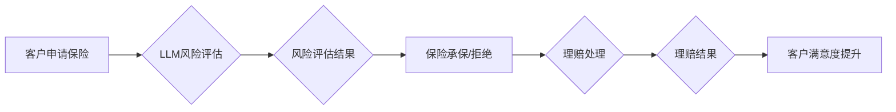

                 

## 保险和 LLM：准确的风险评估和理赔处理

> 关键词：保险、LLM、风险评估、理赔处理、自然语言处理、机器学习、数据分析、人工智能

## 1. 背景介绍

保险业作为一项古老而重要的金融服务，其核心在于评估风险并提供相应的保障。传统的风险评估方法主要依赖于历史数据、专家经验和人工审核，效率低下且难以应对复杂、多变的风险场景。近年来，随着人工智能（AI）技术的快速发展，特别是大型语言模型（LLM）的出现，保险业迎来了一次数字化转型机遇。LLM 凭借其强大的自然语言理解和生成能力，为保险业的风险评估和理赔处理带来了新的可能性。

## 2. 核心概念与联系

### 2.1  LLM 简介

大型语言模型（LLM）是一种基于深度学习的强大人工智能模型，通过训练海量文本数据，能够理解和生成人类语言。LLM 拥有以下关键特性：

* **强大的文本理解能力:**  LLM 可以理解复杂的句子结构、语义关系和上下文信息，从而准确地提取文本中的关键信息。
* **优秀的文本生成能力:** LLM 可以生成流畅、自然的文本，例如总结文档、撰写报告、进行对话等。
* **可迁移学习能力:**  LLM 可以通过微调在特定领域进行应用，例如保险理赔、医疗诊断等。

### 2.2  保险业痛点

传统保险业面临着以下痛点：

* **风险评估效率低下:**  依赖于人工审核和历史数据，难以快速、准确地评估新兴风险。
* **理赔处理繁琐:**  理赔流程复杂，需要大量人工干预，导致处理时间长、成本高。
* **客户体验差:**  理赔流程复杂，客户体验差，导致客户满意度低。

### 2.3  LLM 在保险业的应用

LLM 可以通过以下方式解决保险业的痛点：

* **智能风险评估:**  LLM 可以分析海量数据，识别风险模式，并为客户提供个性化的风险评估。
* **自动化理赔处理:**  LLM 可以自动提取理赔信息，审核理赔申请，并自动生成理赔结果。
* **个性化客户服务:**  LLM 可以与客户进行自然语言对话，提供个性化的保险建议和理赔服务。

**Mermaid 流程图**



## 3. 核心算法原理 & 具体操作步骤

### 3.1  算法原理概述

LLM 在保险业中的应用主要基于以下核心算法：

* **自然语言处理（NLP）:**  用于处理和理解保险相关的文本数据，例如保单条款、理赔申请、客户咨询等。
* **机器学习（ML）:**  用于训练模型，识别风险模式，预测理赔风险，并优化理赔流程。
* **深度学习（DL）:**  用于构建更复杂的LLM模型，提高模型的准确性和泛化能力。

### 3.2  算法步骤详解

**风险评估:**

1. **数据收集:**  收集客户信息、历史数据、市场数据等相关数据。
2. **数据预处理:**  清洗、转换、格式化数据，使其适合模型训练。
3. **特征提取:**  利用NLP技术提取文本数据中的关键信息，例如客户年龄、职业、保险类型、理赔历史等。
4. **模型训练:**  利用ML算法训练模型，识别风险模式，并建立风险评估模型。
5. **风险评估:**  将新客户信息输入模型，预测其风险等级。

**理赔处理:**

1. **理赔申请接收:**  接收客户的理赔申请，包括文本描述、图片、视频等。
2. **信息提取:**  利用NLP技术自动提取理赔申请中的关键信息，例如事故时间、地点、损失金额等。
3. **风险审核:**  根据提取的信息，利用预训练的风险模型进行风险审核，判断理赔申请的真实性。
4. **理赔决策:**  根据风险审核结果，自动生成理赔结果，并通知客户。
5. **理赔支付:**  完成理赔支付流程。

### 3.3  算法优缺点

**优点:**

* **提高效率:**  自动化处理大量数据和流程，显著提高效率。
* **降低成本:**  减少人工干预，降低人力成本。
* **提升准确性:**  利用大数据和算法分析，提高风险评估和理赔处理的准确性。
* **个性化服务:**  根据客户需求提供个性化的保险建议和理赔服务。

**缺点:**

* **数据依赖:**  算法性能依赖于数据质量和数量。
* **算法解释性:**  一些深度学习模型的决策过程难以解释，缺乏透明度。
* **伦理风险:**  算法可能存在偏见，导致不公平的结果。

### 3.4  算法应用领域

LLM 在保险业的应用领域广泛，包括：

* **风险评估:**  评估客户的风险等级，为定价提供依据。
* **理赔处理:**  自动处理理赔申请，提高理赔效率。
* **客户服务:**  提供智能客服，解答客户疑问，提供个性化建议。
* **欺诈检测:**  识别欺诈理赔申请，降低保险公司损失。
* **产品开发:**  开发新的保险产品，满足客户多样化需求。

## 4. 数学模型和公式 & 详细讲解 & 举例说明

### 4.1  数学模型构建

LLM 的训练过程本质上是一个优化问题，目标是找到一个模型参数，使得模型在训练数据上的预测结果与真实值尽可能接近。常用的数学模型包括：

* **线性回归:**  用于预测连续数值，例如客户的风险等级。
* **逻辑回归:**  用于预测分类结果，例如理赔申请是否欺诈。
* **神经网络:**  用于处理复杂数据，例如文本数据，可以构建更复杂的模型，提高预测精度。

### 4.2  公式推导过程

例如，使用线性回归模型预测客户的风险等级，模型公式如下：

$$
Risk = \beta_0 + \beta_1 * Age + \beta_2 * Income + ... + \beta_n * Feature_n
$$

其中：

* $Risk$ 是客户的风险等级
* $\beta_0, \beta_1, ..., \beta_n$ 是模型参数
* $Age, Income, ..., Feature_n$ 是客户的特征

模型参数可以通过最小化损失函数来训练，常用的损失函数包括均方误差（MSE）和交叉熵损失（Cross-Entropy Loss）。

### 4.3  案例分析与讲解

假设保险公司想要预测客户的汽车保险理赔风险，可以使用LLM训练一个风险评估模型。

1. **数据收集:**  收集客户的历史理赔数据、驾驶记录、车辆信息等数据。
2. **数据预处理:**  清洗、转换数据，例如将文本数据转换为数字向量。
3. **模型训练:**  使用深度学习模型，例如Transformer，训练一个风险评估模型。
4. **模型评估:**  使用测试数据评估模型的性能，例如准确率、召回率、F1-score等。
5. **模型部署:**  将训练好的模型部署到生产环境，用于预测新客户的理赔风险。

## 5. 项目实践：代码实例和详细解释说明

### 5.1  开发环境搭建

* **操作系统:**  Linux/macOS/Windows
* **编程语言:**  Python
* **深度学习框架:**  TensorFlow/PyTorch
* **自然语言处理库:**  NLTK/spaCy/HuggingFace Transformers

### 5.2  源代码详细实现

以下是一个使用HuggingFace Transformers库训练一个简单的文本分类模型的代码示例：

```python
from transformers import AutoModelForSequenceClassification, AutoTokenizer

# 加载预训练模型和分词器
model_name = "bert-base-uncased"
tokenizer = AutoTokenizer.from_pretrained(model_name)
model = AutoModelForSequenceClassification.from_pretrained(model_name, num_labels=2)

# 准备训练数据
train_texts = ["理赔申请真实", "理赔申请欺诈"]
train_labels = [1, 0]

# 将文本转换为模型输入格式
encoded_inputs = tokenizer(train_texts, padding=True, truncation=True)

# 训练模型
model.train()
optimizer = torch.optim.AdamW(model.parameters(), lr=2e-5)
for epoch in range(3):
    for batch in range(len(train_texts)):
        inputs = {k: v.to(device) for k, v in encoded_inputs.items()}
        outputs = model(**inputs)
        loss = outputs.loss
        loss.backward()
        optimizer.step()
        optimizer.zero_grad()

# 保存模型
model.save_pretrained("my_insurance_model")
```

### 5.3  代码解读与分析

* 代码首先加载预训练的BERT模型和分词器。
* 然后准备训练数据，并将其转换为模型输入格式。
* 使用AdamW优化器训练模型，并计算损失函数。
* 最后保存训练好的模型。

### 5.4  运行结果展示

训练完成后，可以使用测试数据评估模型的性能。

## 6. 实际应用场景

LLM 在保险业的应用场景广泛，例如：

* **智能客服:**  LLM 可以与客户进行自然语言对话，解答客户疑问，提供个性化建议。
* **自动理赔:**  LLM 可以自动提取理赔申请中的关键信息，审核理赔申请，并自动生成理赔结果。
* **风险评估:**  LLM 可以分析海量数据，识别风险模式，并为客户提供个性化的风险评估。
* **欺诈检测:**  LLM 可以识别欺诈理赔申请，降低保险公司损失。

### 6.4  未来应用展望

未来，LLM 在保险业的应用将更加广泛和深入，例如：

* **更精准的风险评估:**  利用更先进的LLM模型和更丰富的训练数据，实现更精准的风险评估。
* **更智能的理赔处理:**  利用LLM自动化处理更多理赔流程，提高理赔效率和准确性。
* **更个性化的客户服务:**  利用LLM提供更个性化的客户服务，例如根据客户需求定制保险产品。

## 7. 工具和资源推荐

### 7.1  学习资源推荐

* **书籍:**  《深度学习》、《自然语言处理》
* **在线课程:**  Coursera、edX、Udacity
* **博客:**  Towards Data Science、Machine Learning Mastery

### 7.2  开发工具推荐

* **深度学习框架:**  TensorFlow、PyTorch
* **自然语言处理库:**  NLTK、spaCy、HuggingFace Transformers
* **云平台:**  AWS、Azure、GCP

### 7.3  相关论文推荐

* **BERT: Pre-training of Deep Bidirectional Transformers for Language Understanding**
* **GPT-3: Language Models are Few-Shot Learners**
* **XLNet: Generalized Autoregressive Pretraining for Language Understanding**

## 8. 总结：未来发展趋势与挑战

### 8.1  研究成果总结

LLM 在保险业的应用取得了显著成果，例如提高了风险评估的准确性、自动化理赔处理、提升了客户服务体验。

### 8.2  未来发展趋势

未来，LLM 在保险业的应用将更加深入，例如：

* **更精准的风险评估:**  利用更先进的LLM模型和更丰富的训练数据，实现更精准的风险评估。
* **更智能的理赔处理:**  利用LLM自动化处理更多理赔流程，提高理赔效率和准确性。
* **更个性化的客户服务:**  利用LLM提供更个性化的客户服务，例如根据客户需求定制保险产品。

### 8.3  面临的挑战

LLM 在保险业的应用也面临一些挑战，例如：

* **数据安全和隐私:**  保险数据涉及客户隐私，需要确保数据安全和隐私保护。
* **算法解释性:**  一些深度学习模型的决策过程难以解释，缺乏透明度，需要提高算法的可解释性。
* **伦理风险:**  算法可能存在偏见，导致不公平的结果，需要关注算法的伦理风险。

### 8.4  研究展望

未来，需要进一步研究以下问题：

* 如何开发更安全、更可靠的LLM模型，确保其在保险业的应用安全有效。
* 如何提高LLM模型的解释性，使其决策过程更加透明。
* 如何解决LLM模型的伦理风险，确保其公平公正地应用于保险业。

## 9. 附录：常见问题与解答

**Q1: LLM 在保险业的应用有哪些？**

**A1:** LLM 在保险业的应用广泛，例如智能客服、自动理赔、风险评估、欺诈检测等。

**Q2: LLM 的训练数据有哪些？**

**A2:** LLM 的训练数据包括文本数据、代码数据、图像数据等。

**Q3: 如何评估 LLM 的性能？**

**A3:** LLM 的性能可以通过准确率、召回率、F1-score等指标来评估。

**Q4: LLM 在保险业的应用有哪些挑战？**

**A4:** LLM 在保险业的应用面临数据安全、算法解释性、伦理风险等挑战。


作者：禅与计算机程序设计艺术 / Zen and the Art of Computer Programming 
<end_of_turn>

