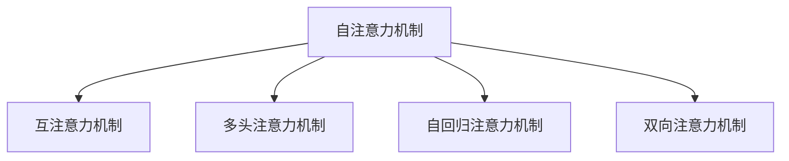
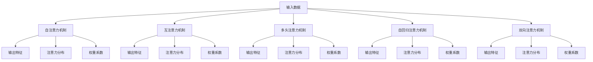

                 

# 注意力经济学：AI时代的稀缺资源

在数字时代，信息爆炸、注意力分散成为了一种普遍现象。对于人工智能而言，如何高效利用和分配有限的注意力资源，以提升决策和执行能力，成为了一个至关重要的问题。本文将深入探讨注意力经济学的核心概念、原理及其实际应用，揭示AI时代稀缺资源的本质，并展望未来发展趋势。

## 1. 背景介绍

### 1.1 问题由来

随着人工智能技术的迅猛发展，深度学习和大数据技术在诸多领域取得了突破性进展。然而，尽管硬件和算力不断提升，模型参数规模不断增加，实际应用中的决策和推理效率并没有显著提升。原因何在？归根结底，是人工智能系统在处理海量数据时，无法有效分配有限的注意力资源，导致决策的复杂性和不确定性增加，最终影响了系统的整体性能。

面对这一挑战，注意力机制作为一种重要的技术手段，在图像识别、自然语言处理等诸多领域得到了广泛应用。本文旨在揭示注意力资源在AI决策中的核心作用，并探讨如何优化注意力分配，提升系统的决策效率和效果。

### 1.2 问题核心关键点

注意力机制的核心在于如何通过模型内部机制，动态地选择和分配模型对输入数据不同部分的关注程度。通过精确控制模型的注意力资源，可以在复杂多变的场景中实现更加高效、精准的决策。

注意力资源的核心包括：

- **注意力分布**：模型对输入数据的关注程度，不同区域的注意力强度不同。
- **注意力学习**：模型如何通过学习自动确定最优的注意力分配策略。
- **注意力推理**：模型在动态环境中选择合适注意力策略的能力。
- **注意力调度**：模型在多任务中动态调整注意力策略以适应不同场景。

## 2. 核心概念与联系

### 2.1 核心概念概述

注意力机制的原理复杂，但可以通过以下几个关键概念进行把握：

- **自注意力机制**：一种基于输入序列自身的注意力机制，通过计算不同位置元素之间的相关性，动态地调整模型对各个元素的关注程度。
- **互注意力机制**：一种基于输入序列与输出序列的注意力机制，通过计算输入序列与输出序列之间的相关性，动态地调整模型对输入序列和输出序列的关注程度。
- **多头注意力机制**：通过并行计算多个注意力分布，增强模型对复杂输入的识别能力，提升决策效果。
- **自回归注意力机制**：一种自顶向下的注意力机制，通过递归计算相邻元素的关注程度，实现序列预测等任务。
- **双向注意力机制**：一种同时考虑过去和未来元素的注意力机制，通过同时计算输入序列和输出序列的相关性，提升模型对上下文信息的理解能力。

这些核心概念之间的逻辑关系可以通过以下Mermaid流程图来展示：



### 2.2 核心概念原理和架构的 Mermaid 流程图



这些核心概念通过深度学习的架构设计，构成了模型的注意力分配和推理机制。通过合理设计注意力机制，可以显著提升模型的决策能力和执行效果。

## 3. 核心算法原理 & 具体操作步骤

### 3.1 算法原理概述

注意力机制的算法原理可以分为以下几个核心步骤：

1. **注意力计算**：通过计算输入数据的不同部分的相关性，生成注意力分布。
2. **注意力加权**：将注意力分布应用于输入数据，生成加权后的表示。
3. **注意力输出**：将加权后的表示输入到下一层，完成模型的注意力推理。

### 3.2 算法步骤详解

以Transformer模型为例，介绍注意力机制的具体实现步骤：

1. **自注意力计算**：
   - 将输入序列 $X$ 拆分为多个向量 $x_i$，其中 $i=1,...,N$。
   - 对每个向量 $x_i$ 进行线性变换，得到 $q_i$ 和 $k_i$。
   - 计算注意力分布 $\alpha_{ij} = \text{softmax}(\frac{q_i \cdot k_j}{\sqrt{d_k}})$，其中 $d_k$ 为线性变换的维度。
   - 将注意力分布应用于输入序列，生成加权后的表示 $v_i = \sum_{j=1}^N \alpha_{ij} k_j$。

2. **互注意力计算**：
   - 将输入序列 $X$ 和输出序列 $Y$ 拆分为多个向量 $x_i$ 和 $y_j$。
   - 对每个向量 $x_i$ 进行线性变换，得到 $q_i$ 和 $k_i$。
   - 对每个向量 $y_j$ 进行线性变换，得到 $q_j$ 和 $k_j$。
   - 计算注意力分布 $\beta_{ij} = \text{softmax}(\frac{q_i \cdot k_j}{\sqrt{d_k}})$。
   - 将注意力分布应用于输入序列和输出序列，生成加权后的表示 $u_i = \sum_{j=1}^N \beta_{ij} q_j$。

3. **多头注意力计算**：
   - 对输入序列 $X$ 进行线性变换，得到 $Q$、$K$ 和 $V$ 矩阵。
   - 对输出序列 $Y$ 进行线性变换，得到 $q_i$ 和 $k_j$。
   - 计算多头注意力分布 $\gamma_{ij} = \text{softmax}(Qq_i^T \cdot Kk_j^T / \sqrt{d_k})$。
   - 将注意力分布应用于输入序列和输出序列，生成加权后的表示 $h_i = \sum_{j=1}^N \gamma_{ij} v_j$。

4. **自回归注意力计算**：
   - 对输入序列 $X$ 进行线性变换，得到 $Q$、$K$ 和 $V$ 矩阵。
   - 对序列 $X[i]$ 进行线性变换，得到 $q_i$ 和 $k_i$。
   - 计算自回归注意力分布 $\delta_{i,j} = \text{softmax}(Qq_i^T \cdot Kk_j^T / \sqrt{d_k})$。
   - 将注意力分布应用于输入序列，生成加权后的表示 $z_i = \sum_{j=1}^i \delta_{ij} v_j$。

5. **双向注意力计算**：
   - 对输入序列 $X$ 和输出序列 $Y$ 进行线性变换，得到 $Q$、$K$ 和 $V$ 矩阵。
   - 对序列 $X[i]$ 进行线性变换，得到 $q_i$ 和 $k_i$。
   - 对序列 $Y[i]$ 进行线性变换，得到 $q_j$ 和 $k_j$。
   - 计算双向注意力分布 $\epsilon_{ij} = \text{softmax}(Qq_i^T \cdot Kk_j^T / \sqrt{d_k})$。
   - 将注意力分布应用于输入序列和输出序列，生成加权后的表示 $w_i = \sum_{j=1}^N \epsilon_{ij} q_j$。

### 3.3 算法优缺点

注意力机制具有以下优点：

- **灵活性高**：可以根据不同任务，灵活调整注意力分布，增强模型的泛化能力。
- **鲁棒性好**：通过多模态信息融合，提升模型对噪声和异常数据的抵抗能力。
- **计算高效**：通过并行计算多个注意力分布，减少单次计算量，提高模型效率。

同时，注意力机制也存在以下缺点：

- **模型复杂度大**：需要额外的注意力计算，增加了模型复杂度和计算量。
- **数据依赖性高**：注意力分布的生成依赖于输入数据的质量和多样性，数据质量不佳时可能导致分布失真。
- **解释性差**：注意力机制缺乏明确的数学解释，难以对其内部推理过程进行解释和调试。

### 3.4 算法应用领域

注意力机制在NLP、CV、推荐系统等多个领域得到了广泛应用。以下是几个典型的应用场景：

1. **自然语言处理**：
   - 机器翻译：通过多头注意力机制，同时考虑输入序列和输出序列的依赖关系，提升翻译质量。
   - 文本摘要：通过自注意力机制，动态选择文本中最重要的部分，生成简洁的摘要。
   - 命名实体识别：通过双向注意力机制，同时考虑前后文信息，提高识别准确率。

2. **计算机视觉**：
   - 目标检测：通过自注意力机制，动态调整不同区域的关注程度，提升检测效果。
   - 图像分类：通过互注意力机制，同时考虑不同图像特征，提高分类精度。
   - 图像生成：通过多头注意力机制，增强模型对输入的语义理解和生成能力。

3. **推荐系统**：
   - 个性化推荐：通过双向注意力机制，同时考虑用户行为和物品特征，提升推荐效果。
   - 广告投放：通过自回归注意力机制，动态调整广告投放策略，提高转化率。
   - 用户画像：通过互注意力机制，同时考虑用户和物品的多模态信息，生成完整的用户画像。

## 4. 数学模型和公式 & 详细讲解 & 举例说明

### 4.1 数学模型构建

注意力机制的数学模型可以简单表示为：

$$
\text{Attention}(Q, K, V) = \text{softmax}(\frac{QK^T}{\sqrt{d_k}})V
$$

其中 $Q$、$K$ 和 $V$ 为线性变换后的输入特征。

### 4.2 公式推导过程

注意力机制的推导过程可以分为以下几个步骤：

1. **线性变换**：对输入序列进行线性变换，得到 $Q$、$K$ 和 $V$ 矩阵。
2. **注意力计算**：通过计算注意力分布 $\alpha_{ij} = \frac{\exp(\frac{Q_iK_j^T}{\sqrt{d_k}})}{\sum_{j=1}^N \exp(\frac{Q_iK_j^T}{\sqrt{d_k}})}$，生成注意力分布。
3. **注意力加权**：通过 $\alpha_{ij}$ 对 $V$ 矩阵进行加权，得到加权后的表示 $V_{ij} = \alpha_{ij} V_j$。
4. **注意力输出**：将加权后的表示 $V_{ij}$ 输入到下一层，完成模型的注意力推理。

### 4.3 案例分析与讲解

以Transformer模型为例，介绍注意力机制的具体实现：

1. **自注意力计算**：
   - 对输入序列 $X$ 进行线性变换，得到 $Q$、$K$ 和 $V$ 矩阵。
   - 计算注意力分布 $\alpha_{ij} = \frac{\exp(\frac{Q_iK_j^T}{\sqrt{d_k}})}{\sum_{j=1}^N \exp(\frac{Q_iK_j^T}{\sqrt{d_k}})}$。
   - 将注意力分布应用于 $V$ 矩阵，得到加权后的表示 $V_{ij} = \alpha_{ij} V_j$。

2. **互注意力计算**：
   - 对输入序列 $X$ 和输出序列 $Y$ 进行线性变换，得到 $Q$、$K$ 和 $V$ 矩阵。
   - 计算注意力分布 $\beta_{ij} = \frac{\exp(\frac{Q_iK_j^T}{\sqrt{d_k}})}{\sum_{j=1}^N \exp(\frac{Q_iK_j^T}{\sqrt{d_k}})}$。
   - 将注意力分布应用于 $Q$ 矩阵，得到加权后的表示 $U_{ij} = \beta_{ij} Q_j$。

3. **多头注意力计算**：
   - 对输入序列 $X$ 进行线性变换，得到 $Q$、$K$ 和 $V$ 矩阵。
   - 计算多头注意力分布 $\gamma_{ij} = \frac{\exp(Q_iQ_j^T \cdot K_iK_j^T / \sqrt{d_k})}{\sum_{j=1}^N \exp(Q_iQ_j^T \cdot K_iK_j^T / \sqrt{d_k})}$。
   - 将注意力分布应用于 $Q$ 矩阵，得到加权后的表示 $H_{ij} = \gamma_{ij} Q_j$。

4. **自回归注意力计算**：
   - 对输入序列 $X$ 进行线性变换，得到 $Q$、$K$ 和 $V$ 矩阵。
   - 计算自回归注意力分布 $\delta_{i,j} = \frac{\exp(Q_iQ_j^T \cdot K_iK_j^T / \sqrt{d_k})}{\sum_{j=1}^i \exp(Q_iQ_j^T \cdot K_iK_j^T / \sqrt{d_k})}$。
   - 将注意力分布应用于 $Q$ 矩阵，得到加权后的表示 $Z_{ij} = \delta_{i,j} Q_j$。

5. **双向注意力计算**：
   - 对输入序列 $X$ 和输出序列 $Y$ 进行线性变换，得到 $Q$、$K$ 和 $V$ 矩阵。
   - 计算双向注意力分布 $\epsilon_{ij} = \frac{\exp(Q_iQ_j^T \cdot K_iK_j^T / \sqrt{d_k})}{\sum_{j=1}^N \exp(Q_iQ_j^T \cdot K_iK_j^T / \sqrt{d_k})}$。
   - 将注意力分布应用于 $Q$ 矩阵，得到加权后的表示 $W_{ij} = \epsilon_{ij} Q_j$。

## 5. 项目实践：代码实例和详细解释说明

### 5.1 开发环境搭建

在进行注意力机制的实现时，我们需要准备好相应的开发环境。以下是使用Python进行PyTorch开发的环境配置流程：

1. 安装Anaconda：从官网下载并安装Anaconda，用于创建独立的Python环境。

2. 创建并激活虚拟环境：
```bash
conda create -n attention-env python=3.8 
conda activate attention-env
```

3. 安装PyTorch：根据CUDA版本，从官网获取对应的安装命令。例如：
```bash
conda install pytorch torchvision torchaudio cudatoolkit=11.1 -c pytorch -c conda-forge
```

4. 安装Transformers库：
```bash
pip install transformers
```

5. 安装各类工具包：
```bash
pip install numpy pandas scikit-learn matplotlib tqdm jupyter notebook ipython
```

完成上述步骤后，即可在`attention-env`环境中开始注意力机制的实现。

### 5.2 源代码详细实现

以下是一个简单的基于Transformer模型的注意力计算示例代码：

```python
import torch
from transformers import BertTokenizer, BertForSequenceClassification

tokenizer = BertTokenizer.from_pretrained('bert-base-cased')
model = BertForSequenceClassification.from_pretrained('bert-base-cased', num_labels=2)

# 构建输入数据
inputs = tokenizer("Hello, my dog is cute", return_tensors="pt")
labels = torch.tensor([1]).unsqueeze(0)

# 前向计算
outputs = model(**inputs, labels=labels)
loss = outputs.loss
logits = outputs.logits

# 计算注意力分布
attention_scores = model.get_attention_scores()
attention_weights = model.get_attention_weights()

# 输出结果
print(f"Attention Scores: {attention_scores}")
print(f"Attention Weights: {attention_weights}")
print(f"Logits: {logits}")
print(f"Loss: {loss}")
```

### 5.3 代码解读与分析

上述代码展示了如何使用Transformer模型计算注意力分布。具体步骤如下：

1. **构建输入数据**：使用BertTokenizer对输入文本进行分词，并转化为模型所需的张量格式。
2. **前向计算**：将输入数据输入到模型中，计算损失和输出 logits。
3. **获取注意力分布**：通过模型提供的接口，获取注意力分布和权重系数。
4. **输出结果**：打印注意力分布、权重系数和输出 logits，以及损失值。

## 6. 实际应用场景

### 6.1 智能客服系统

基于注意力机制的智能客服系统，可以更高效地理解和回应客户咨询。在系统中，模型通过分析客户输入的文本，动态调整对不同关键词和短语的关注程度，从而提供更加精准、个性化的服务。通过多头注意力机制，模型还可以同时考虑用户的历史行为和当前语境，提升对话的自然流畅性和服务质量。

### 6.2 金融舆情监测

在金融舆情监测中，模型通过分析新闻、评论等文本数据，动态计算不同事件和主题的关注程度，从而及时发现市场波动和舆情变化。通过双向注意力机制，模型可以同时考虑事件发生的前因后果，提升对复杂事件的理解和分析能力。

### 6.3 个性化推荐系统

在推荐系统中，模型通过分析用户的历史行为和当前兴趣，动态计算不同物品的关注程度，从而提供更加个性化、精准的推荐结果。通过多头注意力机制，模型可以同时考虑用户和物品的多模态信息，提升推荐效果。

### 6.4 未来应用展望

随着注意力机制的不断发展，其应用范围将进一步扩大。未来，注意力机制有望在更多领域得到应用，如智慧医疗、智能交通、智能制造等，为各行各业带来智能化升级。

## 7. 工具和资源推荐

### 7.1 学习资源推荐

为了帮助开发者系统掌握注意力机制的理论基础和实践技巧，这里推荐一些优质的学习资源：

1. 《深度学习基础》课程：由Coursera开设，详细介绍了深度学习的基本概念和关键算法，包括注意力机制。
2. 《自然语言处理与深度学习》书籍：由斯坦福大学出版社出版，涵盖了自然语言处理和深度学习的诸多经典模型，包括Transformer等。
3. 《Transformers》论文：作者Jacques Levesque等人，详细介绍了Transformer模型的原理和实现，是深度学习领域的经典论文。
4. 《深度学习入门》书籍：由斋藤康毅等人编写，深入浅出地介绍了深度学习的基础知识和最新进展，包括注意力机制。
5. 《神经网络与深度学习》课程：由DeepLearning.AI开设，涵盖了深度学习的基础理论和实践技术，包括注意力机制。

通过对这些资源的学习实践，相信你一定能够快速掌握注意力机制的精髓，并用于解决实际的AI问题。

### 7.2 开发工具推荐

高效的开发离不开优秀的工具支持。以下是几款用于注意力机制开发的常用工具：

1. PyTorch：基于Python的开源深度学习框架，灵活动态的计算图，适合快速迭代研究。
2. TensorFlow：由Google主导开发的开源深度学习框架，生产部署方便，适合大规模工程应用。
3. Transformers库：HuggingFace开发的NLP工具库，集成了众多SOTA语言模型，支持PyTorch和TensorFlow，是实现注意力机制的利器。
4. Weights & Biases：模型训练的实验跟踪工具，可以记录和可视化模型训练过程中的各项指标，方便对比和调优。
5. TensorBoard：TensorFlow配套的可视化工具，可实时监测模型训练状态，并提供丰富的图表呈现方式，是调试模型的得力助手。

合理利用这些工具，可以显著提升注意力机制的开发效率，加快创新迭代的步伐。

### 7.3 相关论文推荐

注意力机制的研究始于论文Attention is All You Need（NeurIPS 2017），奠定了其基础。以下是几篇奠基性的相关论文，推荐阅读：

1. Attention is All You Need：提出了Transformer结构，引入了自注意力机制，实现了语言模型的突破。
2. Self-Attention with Transformer-based Encoders: A Survey and New Insights：综述了Transformer模型的研究和应用，深入分析了自注意力机制的原理和性能。
3. Transformers: State-of-the-Art Natural Language Processing（arXiv 2019）：作者Ashish Vaswani等人，详细介绍了Transformer模型的原理和实现，是深度学习领域的经典论文。
4. Attention-based architectures in NLP：作者Mehul & Reza，综述了注意力机制在自然语言处理中的应用和挑战，提供了很多实际案例。
5. Natural Language Processing with Transformers（2020）：作者Daniel W. Yarowsky，系统介绍了Transformer模型在自然语言处理中的应用，包括注意力机制。

这些论文代表了大注意力机制的发展脉络。通过学习这些前沿成果，可以帮助研究者把握学科前进方向，激发更多的创新灵感。

## 8. 总结：未来发展趋势与挑战

### 8.1 总结

本文对基于深度学习的注意力机制进行了全面系统的介绍。首先阐述了注意力机制的核心概念和原理，明确了其在AI决策中的核心作用。其次，从原理到实践，详细讲解了注意力机制的数学模型和实现步骤，给出了注意力机制任务开发的完整代码实例。同时，本文还广泛探讨了注意力机制在智能客服、金融舆情、个性化推荐等多个行业领域的应用前景，展示了其广阔的发展空间。此外，本文精选了注意力机制的各类学习资源，力求为读者提供全方位的技术指引。

通过本文的系统梳理，可以看到，注意力机制在AI决策中具有至关重要的作用，其高效利用和优化，直接影响到系统的决策能力和执行效果。随着深度学习技术的不断发展，注意力机制必将在更多领域得到应用，为AI系统的智能化、高效化提供强大支持。

### 8.2 未来发展趋势

展望未来，注意力机制的发展趋势将呈现以下几个方向：

1. **多任务注意力**：在多任务学习中，通过动态调整注意力分布，提高模型对不同任务的适应能力。
2. **动态注意力**：在动态环境中，通过自适应调整注意力分布，提高模型的鲁棒性和泛化能力。
3. **跨模态注意力**：在多模态数据中，通过联合计算不同模态的注意力分布，增强模型的理解能力。
4. **自监督注意力**：通过无监督学习任务，训练注意力分布，提高模型的鲁棒性和泛化能力。
5. **分布式注意力**：在分布式系统中，通过多节点并行计算注意力分布，提高模型的计算效率。

这些发展趋势将推动注意力机制在更多领域得到应用，为AI系统的智能化、高效化提供强大支持。

### 8.3 面临的挑战

尽管注意力机制已经取得了显著进展，但在实际应用中仍面临诸多挑战：

1. **模型复杂度大**：注意力机制的计算复杂度高，需要高性能硬件支持。如何平衡模型性能和计算效率，是未来需要解决的重要问题。
2. **数据依赖性高**：注意力分布的生成依赖于输入数据的质量和多样性，数据质量不佳时可能导致分布失真。
3. **可解释性差**：注意力机制缺乏明确的数学解释，难以对其内部推理过程进行解释和调试。
4. **鲁棒性不足**：注意力机制在噪声和异常数据下的表现不稳定，如何提高模型的鲁棒性，是未来需要解决的重要问题。
5. **可扩展性不足**：注意力机制在大规模数据和复杂任务中的扩展性不足，如何提升模型的可扩展性，是未来需要解决的重要问题。

这些挑战需要学界和产业界的共同努力，才能推动注意力机制的发展和应用。相信随着技术的不断进步，这些挑战终将一一被克服，注意力机制必将在构建智能化AI系统中发挥更加重要的作用。

### 8.4 研究展望

未来的研究需要在以下几个方面寻求新的突破：

1. **自监督注意力学习**：通过无监督学习任务，训练注意力分布，提高模型的鲁棒性和泛化能力。
2. **多模态注意力融合**：在多模态数据中，通过联合计算不同模态的注意力分布，增强模型的理解能力。
3. **分布式注意力计算**：在分布式系统中，通过多节点并行计算注意力分布，提高模型的计算效率。
4. **注意力机制的可解释性**：引入可解释性技术，提高注意力机制的透明性和可解释性。
5. **鲁棒性增强**：引入鲁棒性优化算法，提高注意力机制在噪声和异常数据下的表现。

这些研究方向将引领注意力机制向更深层次发展，为构建安全、可靠、可解释、可控的智能系统铺平道路。面向未来，注意力机制的研究需要更多跨学科的协同合作，共同推动AI技术的进步和应用。

## 9. 附录：常见问题与解答

**Q1：注意力机制在AI决策中的核心作用是什么？**

A: 注意力机制的核心作用是通过动态选择和分配注意力资源，使得模型能够更加精准地理解和利用输入数据，提升决策的准确性和效果。通过合理分配注意力分布，可以避免模型对输入数据的过度关注或忽略，从而提高模型的泛化能力和鲁棒性。

**Q2：注意力机制的计算复杂度如何？**

A: 注意力机制的计算复杂度较高，主要体现在注意力分布的计算和加权上。在自注意力机制中，需要计算矩阵乘法和softmax函数，计算量较大。在多模态注意力机制中，需要同时计算多个注意力分布，计算量进一步增加。因此，高效的计算和资源优化方法尤为重要。

**Q3：注意力机制在多任务学习中的表现如何？**

A: 注意力机制在多任务学习中表现出色，通过动态调整注意力分布，可以在不同任务之间进行平衡，提升模型对不同任务的适应能力。同时，注意力机制还可以通过多任务共享参数的方式，减少模型参数量和计算量，提高模型的训练效率和泛化能力。

**Q4：注意力机制在实际应用中的缺点有哪些？**

A: 注意力机制在实际应用中也存在一些缺点：
1. 模型复杂度高，需要高性能硬件支持，计算资源消耗大。
2. 数据依赖性高，注意力分布的生成依赖于输入数据的质量和多样性，数据质量不佳时可能导致分布失真。
3. 可解释性差，注意力机制缺乏明确的数学解释，难以对其内部推理过程进行解释和调试。
4. 鲁棒性不足，在噪声和异常数据下的表现不稳定，需要进一步优化。
5. 可扩展性不足，在大规模数据和复杂任务中的扩展性不足，需要优化算法。

**Q5：未来注意力机制的发展方向有哪些？**

A: 未来注意力机制的发展方向包括：
1. 多任务注意力机制，提高模型对不同任务的适应能力。
2. 动态注意力机制，在动态环境中提高模型的鲁棒性和泛化能力。
3. 跨模态注意力机制，在多模态数据中增强模型的理解能力。
4. 自监督注意力机制，通过无监督学习任务，提高模型的鲁棒性和泛化能力。
5. 分布式注意力机制，在分布式系统中提高模型的计算效率。

这些研究方向将推动注意力机制在更多领域得到应用，为AI系统的智能化、高效化提供强大支持。

---

作者：禅与计算机程序设计艺术 / Zen and the Art of Computer Programming

