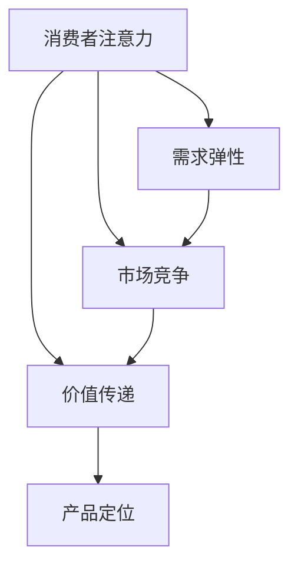
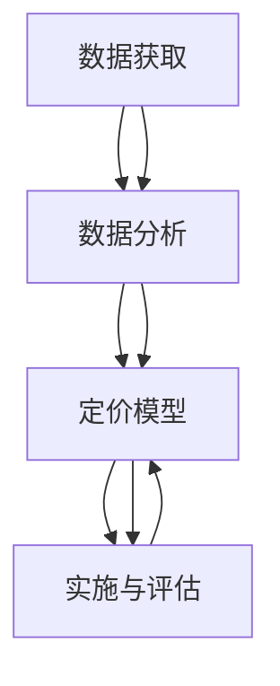

                 

# 注意力经济对企业产品定价的新要求

## 1. 背景介绍

### 1.1 问题由来

随着互联网技术的发展，信息流通速度加快，信息获取方式发生了翻天覆地的变化。数字时代下，注意力成为了一种稀缺资源，如何有效吸引和利用消费者注意力成为企业的核心竞争力和重要战略。"注意力经济"（Economies of Attention）的概念由此产生，它指在信息爆炸的时代，通过吸引和利用消费者的注意力，以获取商业价值的经济形态。

### 1.2 问题核心关键点

在注意力经济背景下，企业产品定价策略需要重新思考和定位。传统的成本加成、市场比较定价法、竞争定价等方法在信息过载的时代显得力不从心。为了在竞争激烈的市场中脱颖而出，企业需要借助数据科学、人工智能等技术手段，精确地理解消费者需求，实施动态定价策略，以最大化其商业价值。

### 1.3 问题研究意义

实施科学的定价策略是企业保持竞争力和实现利润最大化的关键。注意力经济下的新要求促使企业产品定价策略从单一的价格策略转向多元化的价值传递方式。这种转变不仅提升企业市场反应速度和竞争力，更能通过精准的定价，优化资源配置，提升消费者体验，最终实现企业与消费者共赢。

## 2. 核心概念与联系

### 2.1 核心概念概述

在注意力经济的背景下，企业产品定价策略的关键在于理解消费者注意力与价格的关系，以及如何通过数据驱动的方法，实现个性化、动态化的定价。

- **消费者注意力（Consumer Attention）**：消费者对品牌、产品、广告等的关注程度，是影响购买决策的重要因素。
- **价值传递（Value Communication）**：产品定价不仅传递价格信息，更传递品牌价值、品质保障等隐性价值。
- **需求弹性（Demand Elasticity）**：产品需求量对价格变化的敏感度，影响定价策略的制定。
- **市场竞争（Market Competition）**：竞争对手的定价策略、市场定位等影响企业的定价决策。
- **产品定位（Product Positioning）**：基于产品特性、目标消费者群体等，确定产品在市场中的定位。

这些概念通过以下Mermaid流程图展示它们的联系：



在信息爆炸的时代，消费者注意力显得尤为稀缺。如何通过精准的定价策略，传递产品的价值，并在竞争中占据优势，是企业产品定价的重要任务。

### 2.2 核心概念原理和架构

在注意力经济下，企业产品定价的核心原理可以概括为：

1. **需求驱动**：通过分析消费者需求，预测市场变化，动态调整产品价格，实现供需平衡。
2. **数据驱动**：利用大数据分析，洞察消费者行为，优化定价策略。
3. **竞争对等**：关注市场动态，平衡与竞争对手的定价关系，保持市场竞争力。
4. **价值匹配**：合理定价以匹配产品价值和品牌定位。

这些原理通过数据科学、人工智能等技术手段进行实现，架构上可以分为以下几个层次：

- **数据获取**：从多渠道收集消费者行为数据，如购买记录、浏览历史、社交媒体互动等。
- **数据分析**：利用统计分析、机器学习等技术手段，挖掘消费者行为模式，洞察需求变化。
- **定价模型**：建立基于消费者行为和市场环境的定价模型，实现动态定价。
- **实施与评估**：根据定价模型输出结果，在渠道进行实施，并实时评估效果，不断优化策略。

这些层次通过以下Mermaid流程图展示它们之间的联系：



通过这样的架构，企业可以实现基于数据和消费者行为的动态定价策略。

## 3. 核心算法原理 & 具体操作步骤

### 3.1 算法原理概述

注意力经济下，企业产品定价的核心算法原理是利用消费者行为数据，构建动态定价模型，实现个性化、动态化的定价。其基本流程包括：

1. **数据预处理**：清洗、整理消费者行为数据，进行特征工程，提取有效信息。
2. **模型构建**：利用回归、决策树、神经网络等模型，构建定价模型，实现需求预测和价格预测。
3. **策略实施**：根据模型输出结果，实施动态定价策略，实时调整产品价格。
4. **效果评估**：利用A/B测试、销售数据分析等手段，评估定价策略效果，优化模型和策略。

### 3.2 算法步骤详解

以下详细介绍基于数据的定价算法步骤：

**Step 1: 数据预处理**
- 从多渠道收集消费者行为数据，如购买记录、浏览历史、社交媒体互动等。
- 进行数据清洗，去除异常值和噪声，进行缺失值填补和归一化处理。
- 进行特征工程，提取有效特征，如用户历史购买金额、浏览时长、购买频率等。

**Step 2: 模型构建**
- 利用回归模型、决策树、神经网络等算法，构建需求预测模型。
- 通过建立基于预测结果的价格模型，实现价格预测。
- 利用强化学习等方法，构建动态定价策略，实时调整价格。

**Step 3: 策略实施**
- 根据模型预测结果，实时调整产品价格，实施动态定价策略。
- 利用实时数据，动态更新模型参数，保证定价策略的实时性和精准性。
- 通过多渠道发布价格信息，确保价格策略在各渠道的一致性。

**Step 4: 效果评估**
- 利用A/B测试、销售数据分析等手段，评估定价策略效果。
- 对模型进行效果评估，优化模型参数，提升模型预测准确度。
- 根据评估结果，不断调整和优化定价策略，实现最优定价。

### 3.3 算法优缺点

基于数据的定价算法有以下优点：
1. 精准性强：通过分析消费者行为数据，实现个性化定价。
2. 实时性好：利用实时数据，动态调整价格，提高市场反应速度。
3. 适应性强：可以适应市场变化，灵活调整定价策略。

然而，这种方法也存在以下缺点：
1. 数据质量要求高：需要高质量的消费者行为数据，数据缺失、噪声等问题可能影响模型效果。
2. 模型复杂度高：构建复杂定价模型，需要较多的数据和计算资源。
3. 实施难度大：需要技术支持，实现实时定价和效果评估。

### 3.4 算法应用领域

基于数据的定价算法广泛应用于多个领域：

- **零售业**：根据消费者购物历史和浏览记录，实现个性化推荐和动态定价。
- **电子商务**：利用消费者行为数据，实时调整商品价格，提高销售转化率。
- **旅游业**：根据游客历史消费行为，优化酒店和机票定价策略，提升客户体验。
- **金融服务**：分析客户交易行为，实现个性化理财建议和动态利率定价。
- **交通行业**：根据乘客流量和历史数据，调整票价和票量，优化运力配置。

## 4. 数学模型和公式 & 详细讲解 & 举例说明

### 4.1 数学模型构建

在注意力经济下，企业产品定价的数学模型主要基于消费者行为数据，构建需求预测和价格预测模型。这里以线性回归模型为例，构建一个简单的定价模型。

设产品价格为 $P$，影响因素包括消费者历史购买金额 $x_1$、购买频率 $x_2$、品牌忠诚度 $x_3$ 等。则定价模型可表示为：

$$
P = \beta_0 + \beta_1x_1 + \beta_2x_2 + \beta_3x_3 + \epsilon
$$

其中，$\beta$ 为模型参数，$\epsilon$ 为误差项。

### 4.2 公式推导过程

线性回归模型的推导过程如下：

1. **模型假设**：假设价格 $P$ 与影响因素之间存在线性关系。
2. **参数估计**：利用最小二乘法估计模型参数 $\beta$。
3. **预测与评估**：利用训练集数据估计模型参数，并在测试集上进行预测，评估模型效果。

推导公式为：

$$
\beta = (X^TX)^{-1}X^TY
$$

其中，$X$ 为特征矩阵，$Y$ 为目标变量向量。

### 4.3 案例分析与讲解

假设某电商平台销售一款手提电脑，需要构建定价模型。收集了消费者购买历史数据，包括购买金额、购买频率、品牌忠诚度等特征，构建线性回归模型，如下所示：

| 购买金额 | 购买频率 | 品牌忠诚度 | 产品价格 |
| --- | --- | --- | --- |
| 1000 | 2 | 3 | 2000 |
| 1500 | 1 | 4 | 2500 |
| ... | ... | ... | ... |

通过线性回归模型，可以预测不同特征下的产品价格。例如，当消费者购买金额为2000元，购买频率为2次，品牌忠诚度为3时，预测的产品价格为：

$$
P = 1000 + 500 \times 2 + 200 \times 3 = 3400
$$

通过模型预测，电商平台可以实时调整产品价格，实现动态定价。

## 5. 项目实践：代码实例和详细解释说明

### 5.1 开发环境搭建

在进行定价模型实践前，需要准备好开发环境。以下是使用Python进行Pandas、NumPy、Scikit-learn等库的环境配置流程：

1. 安装Anaconda：从官网下载并安装Anaconda，用于创建独立的Python环境。
2. 创建并激活虚拟环境：
```bash
conda create -n pricing-env python=3.8 
conda activate pricing-env
```
3. 安装必要的库：
```bash
pip install pandas numpy scikit-learn matplotlib seaborn
```

完成上述步骤后，即可在`pricing-env`环境中开始定价模型实践。

### 5.2 源代码详细实现

以下是一个简单的基于Pandas和Scikit-learn库的定价模型实现：

```python
import pandas as pd
from sklearn.linear_model import LinearRegression
from sklearn.model_selection import train_test_split

# 读取数据
data = pd.read_csv('price_data.csv')

# 特征工程
X = data[['purchase_amount', 'purchase_frequency', 'brand_loyalty']]
Y = data['product_price']

# 划分训练集和测试集
X_train, X_test, Y_train, Y_test = train_test_split(X, Y, test_size=0.2, random_state=42)

# 模型训练
model = LinearRegression()
model.fit(X_train, Y_train)

# 模型预测
Y_pred = model.predict(X_test)

# 评估模型效果
print('R-squared:', model.score(X_test, Y_test))
```

### 5.3 代码解读与分析

让我们再详细解读一下关键代码的实现细节：

**读取数据**：
```python
data = pd.read_csv('price_data.csv')
```
使用Pandas的read_csv方法，读取价格数据集，并将其存储为DataFrame对象。

**特征工程**：
```python
X = data[['purchase_amount', 'purchase_frequency', 'brand_loyalty']]
Y = data['product_price']
```
选择影响因素和产品价格，将它们分别作为特征和目标变量，进行模型训练。

**模型训练**：
```python
model = LinearRegression()
model.fit(X_train, Y_train)
```
构建线性回归模型，并使用训练集数据进行训练。

**模型预测**：
```python
Y_pred = model.predict(X_test)
```
使用训练好的模型对测试集进行预测，得到模型预测结果。

**评估模型效果**：
```python
print('R-squared:', model.score(X_test, Y_test))
```
计算模型的R-squared（决定系数），评估模型的预测效果。

## 6. 实际应用场景

### 6.1 智能零售

智能零售是注意力经济的重要应用场景之一。电商平台通过大数据分析和智能算法，实现个性化推荐和动态定价，提升用户体验和销售额。例如，某电商平台可以收集用户浏览历史、购买记录等数据，通过机器学习模型，预测用户购买意愿和支付能力，实现精准定价。

在具体实施中，平台可以实时调整商品价格，并在搜索结果页面动态展示不同价格的推荐产品，满足用户个性化需求。通过这种方式，电商平台能够有效提升用户粘性和消费转化率。

### 6.2 在线旅游

在线旅游是另一个重要应用场景。通过分析用户历史预订记录、行程偏好、消费习惯等数据，旅游平台可以构建动态定价模型，实现个性化推荐和实时定价。例如，某旅游平台可以收集用户历史预订信息、行程计划、预算限制等数据，预测用户需求，实现差异化定价。

在具体实施中，平台可以根据用户的预订记录，动态调整机票和酒店价格，提供最佳价格和推荐行程。通过这种方式，平台能够提升用户预订率，降低取消率，实现收益最大化。

### 6.3 金融服务

金融服务领域也广泛应用了基于数据的定价策略。银行和金融机构通过分析客户交易行为、资产配置、市场环境等数据，实现动态定价。例如，某银行可以收集客户历史交易记录、账户余额、信用评分等数据，预测客户贷款需求和风险水平，实现差异化定价。

在具体实施中，银行可以动态调整贷款利率和额度，确保贷款定价的合理性和风险可控。通过这种方式，银行能够提升客户满意度，降低坏账风险，实现盈利最大化。

### 6.4 未来应用展望

随着数据科学和人工智能技术的不断进步，基于数据的定价策略将进一步发展，以下是未来应用展望：

1. **大数据与云计算**：利用大数据和云计算技术，提升数据处理和模型训练的效率。
2. **人工智能与机器学习**：结合深度学习、强化学习等算法，实现更加精准的需求预测和动态定价。
3. **智能推荐与个性化**：通过智能推荐和个性化定价，提升用户体验和转化率。
4. **实时定价与动态优化**：利用实时数据，实现动态定价和优化，提升市场反应速度和竞争力。
5. **多渠道定价**：结合多渠道数据，实现跨平台定价和统一策略管理。

这些发展趋势将进一步推动企业产品定价策略的智能化和精细化。

## 7. 工具和资源推荐

### 7.1 学习资源推荐

为了帮助开发者系统掌握基于数据的定价策略，以下是一些优质的学习资源：

1. **《Python数据科学手册》**：详细介绍了Pandas、NumPy、Scikit-learn等库的用法，适合初学者入门。
2. **《机器学习实战》**：通过实际案例讲解机器学习算法，适合实战练习。
3. **Kaggle竞赛平台**：提供了大量数据集和机器学习竞赛，可以提升实战能力。
4. **Coursera机器学习课程**：斯坦福大学的经典课程，涵盖机器学习基本概念和算法，适合系统学习。

通过这些资源的学习实践，相信你一定能够快速掌握基于数据的定价策略，并用于解决实际的商业问题。

### 7.2 开发工具推荐

高效的开发离不开优秀的工具支持。以下是几款用于定价模型开发的常用工具：

1. **Jupyter Notebook**：开源的交互式笔记本环境，方便代码测试和分享。
2. **TensorFlow**：Google开源的深度学习框架，适合大规模模型训练和推理。
3. **PyTorch**：Facebook开源的深度学习框架，灵活高效，适合快速迭代研究。
4. **Anaconda**：Python环境管理工具，方便虚拟环境管理和依赖管理。
5. **Pandas**：数据处理和分析库，适合处理大数据和复杂数据集。

合理利用这些工具，可以显著提升定价模型的开发效率，加快创新迭代的步伐。

### 7.3 相关论文推荐

以下是几篇奠基性的相关论文，推荐阅读：

1. **"Data Mining: Concepts and Techniques"**：本书详细介绍了数据挖掘技术，包括聚类、分类、关联规则等算法。
2. **"Predictive Analytics: The Power to Predict the Future"**：作者提供大量实例，讲解了预测分析的方法和应用。
3. **"Machine Learning Yearning"**：作者Andrew Ng详细讲解了机器学习算法和实践，适合初学者和从业者参考。

这些论文代表了数据科学和人工智能领域的经典研究，对理解基于数据的定价策略具有重要意义。

## 8. 总结：未来发展趋势与挑战

### 8.1 研究成果总结

基于数据的定价策略在多个领域得到了广泛应用，取得了显著效果。具体包括以下几个方面：

1. **精准定价**：通过分析消费者行为数据，实现个性化定价，提高销售额。
2. **实时响应**：利用实时数据，实现动态定价，提升市场反应速度。
3. **优化资源**：通过优化定价策略，实现资源配置的最优化，提升用户满意度。

### 8.2 未来发展趋势

未来，基于数据的定价策略将呈现以下几个发展趋势：

1. **模型多样化**：利用深度学习、强化学习等算法，构建更加复杂和多样的定价模型。
2. **数据多样化**：结合多渠道数据，实现更加全面和准确的定价。
3. **实时化**：利用实时数据，实现动态定价和优化，提升市场反应速度。
4. **智能推荐**：结合智能推荐算法，提升用户体验和转化率。

### 8.3 面临的挑战

尽管基于数据的定价策略在多个领域取得了成功，但仍面临诸多挑战：

1. **数据质量**：数据缺失、噪声等问题可能影响模型效果。
2. **模型复杂度**：构建复杂定价模型，需要较多的数据和计算资源。
3. **实施难度**：需要技术支持，实现实时定价和效果评估。

### 8.4 研究展望

为了克服这些挑战，未来的研究方向主要包括以下几个方面：

1. **数据清洗与预处理**：提升数据质量和数据清洗技术，降低数据质量对模型效果的影响。
2. **模型简化与优化**：简化定价模型，提高模型训练和推理效率。
3. **实时化与动态优化**：优化实时数据处理和定价策略，提升市场反应速度。
4. **智能推荐与个性化**：结合智能推荐算法，提升用户体验和转化率。

## 9. 附录：常见问题与解答

**Q1：如何选择合适的特征？**

A: 选择合适的特征是定价模型的关键。一般选择与价格密切相关的特征，如消费者历史购买金额、购买频率、品牌忠诚度等。利用特征工程，进行数据预处理和特征提取，提升模型效果。

**Q2：如何评估模型效果？**

A: 评估模型效果可以通过R-squared、均方误差（MSE）、平均绝对误差（MAE）等指标进行。利用训练集和测试集进行模型训练和评估，选择最优模型。

**Q3：如何优化模型？**

A: 优化模型的方法包括调整模型参数、选择不同的特征组合、引入更多的先验知识等。利用交叉验证、网格搜索等方法，进行模型调优。

**Q4：如何实现实时定价？**

A: 实现实时定价需要构建实时数据处理系统，利用大数据技术和实时计算平台，实现实时数据采集和处理。同时，需要优化模型，降低计算资源消耗，保证实时定价的可行性。

**Q5：如何保障数据隐私与安全？**

A: 在数据采集和处理过程中，需要保障消费者隐私和数据安全。利用数据脱敏、访问控制等技术手段，保护用户数据。同时，需要建立健全的数据治理体系，确保数据使用的合法性和合规性。

---

作者：禅与计算机程序设计艺术 / Zen and the Art of Computer Programming

