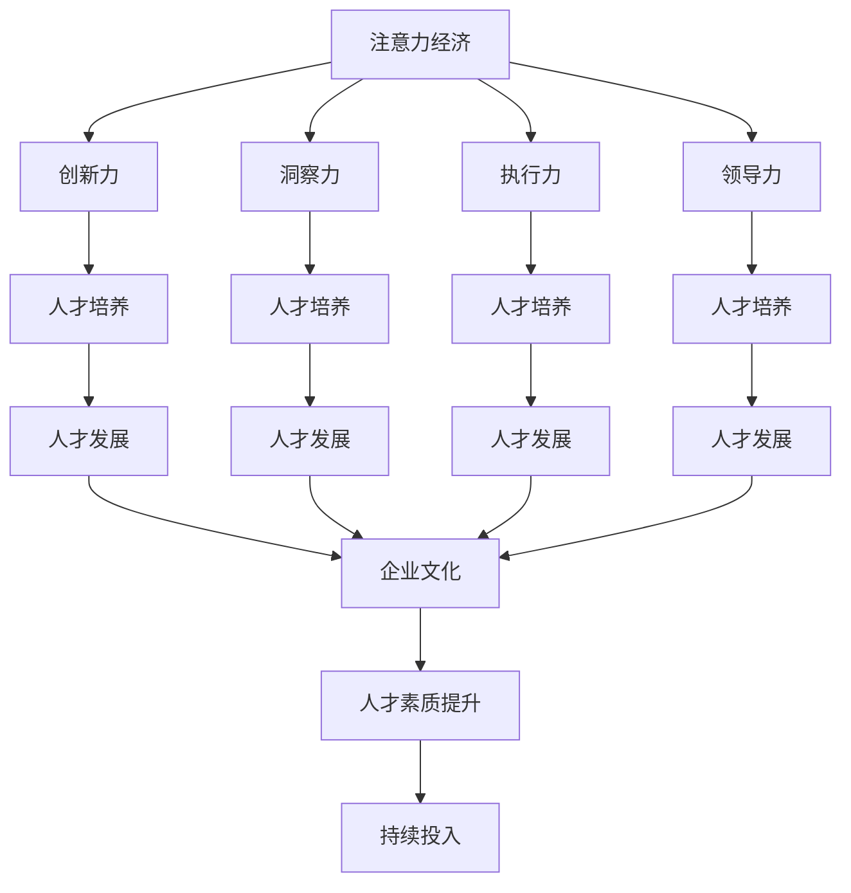

                 

# 注意力经济对企业人才培养的新要求

> 关键词：注意力经济,企业人才,人才培养,人才发展,人才培养体系,企业文化,创新力

## 1. 背景介绍

在数字化时代，“注意力”成为了一种重要的经济资源。随着信息爆炸和消费者选择权的增加，企业为了吸引和留住客户的注意力，不得不进行持续的创新和优化，这就对企业的人才培养提出了新的要求。

### 1.1 问题由来
在传统经济模式下，企业竞争主要集中在产品品质、价格和服务上。然而，在数字化时代，信息过载让消费者的注意力成为一种稀缺资源，企业需要投入更多的精力去争夺消费者的注意力，从而在市场竞争中占据有利地位。

### 1.2 问题核心关键点
企业在争夺消费者注意力的过程中，需要具备以下几个关键能力：
- 创新力：不断推出新颖的产品和服务，满足消费者的多样化需求。
- 洞察力：能够准确洞察消费者行为和市场变化，做出明智的决策。
- 执行力：能够快速响应市场需求，高效执行营销策略。
- 领导力：拥有优秀的人才管理和领导力，以形成强大的团队合力。

因此，企业的人才培养需要结合新的发展趋势，更新人才培养的内容和方式，构建符合注意力经济特点的人才培养体系。

### 1.3 问题研究意义
研究注意力经济对企业人才培养的新要求，对于提升企业的人才竞争力，构建具有创新力和市场敏锐度的高素质人才队伍具有重要意义。

通过深入分析注意力经济的特点和趋势，企业可以更加有针对性地设计人才培养计划，提升员工的注意力获取和处理能力，从而在激烈的市场竞争中占据有利地位。同时，人才的快速成长也能加速企业创新和市场扩展，促进企业的可持续发展。

## 2. 核心概念与联系

### 2.1 核心概念概述

为了更好地理解注意力经济对企业人才培养的影响，本节将介绍几个密切相关的核心概念：

- **注意力经济**：指在信息爆炸时代，注意力作为一种稀缺资源，企业需要投入更多的精力去争夺消费者的注意力，从而在市场竞争中占据有利地位。
- **企业人才**：指具备企业所需的特定知识、技能和经验，能够为企业创造价值的员工。
- **人才培养**：指通过系统的教育和培训，提升员工的知识、技能和素质，使其能够胜任企业发展的需要。
- **人才发展**：指对企业人才进行长期规划和持续投入，激发其潜力和创造力，实现企业和个人共同发展。
- **企业文化**：指企业内部的共同价值观、行为规范和工作氛围，影响员工的职业行为和创新能力。
- **创新力**：指企业及其员工在技术、产品、服务等方面的创新能力，推动企业持续发展。

这些核心概念之间有着紧密的联系：

注意力经济要求企业具有较强的创新力和洞察力，而这些能力又需要优秀的人才能够实现。人才培养则是企业持续提升人才素质、激发创新潜力的关键。而企业文化和人才发展策略，则直接影响着企业对人才的吸引力和培养效果。

### 2.2 核心概念原理和架构的 Mermaid 流程图



## 3. 核心算法原理 & 具体操作步骤
### 3.1 算法原理概述

注意力经济下，企业人才培养需要具备以下几个关键步骤：

1. **识别关键能力**：根据企业的发展需求，识别出关键能力和知识。
2. **设计培养计划**：制定系统的培训课程和实践机会，提升员工的关键能力。
3. **建立评价体系**：通过科学的考核和评估机制，确保培训效果。
4. **激励与反馈**：通过激励机制和反馈系统，提升员工的学习积极性。
5. **持续改进**：根据市场变化和反馈，持续优化人才培养体系。

这些步骤形成了一个循环，持续推动企业人才的成长和企业的发展。

### 3.2 算法步骤详解

#### 3.2.1 识别关键能力

首先，企业需要识别出对自身发展至关重要的关键能力。这通常包括：

- **技术能力**：如编程、数据分析、项目管理等。
- **软技能**：如沟通、协作、问题解决等。
- **创新能力**：如创意设计、产品研发、市场洞察等。

识别关键能力的方法包括：

- **市场需求分析**：通过市场调研和数据分析，确定行业趋势和技能需求。
- **内部评估**：通过问卷调查、面谈等方式，了解员工现有技能水平和不足。
- **外部对标**：参考行业标杆和最佳实践，确定关键技能和标准。

#### 3.2.2 设计培养计划

基于识别的关键能力，企业可以设计相应的培养计划：

1. **课程设计**：设计涵盖基础和进阶内容的培训课程，确保员工掌握必要的知识和技能。
2. **实践机会**：提供实际工作中的应用机会，如项目实践、跨部门协作等，增强员工的应用能力。
3. **导师制度**：引入经验丰富的导师，通过一对一的辅导，提升员工的实操水平。

#### 3.2.3 建立评价体系

建立科学的评价体系，可以确保培养效果：

1. **考核标准**：制定明确、量化的考核标准，确保培训效果的可衡量性。
2. **定期评估**：通过定期考核和反馈，了解员工的学习进度和效果。
3. **绩效关联**：将培训效果与员工的绩效考核、晋升机会等挂钩，激励员工积极学习。

#### 3.2.4 激励与反馈

有效的激励和反馈机制，可以提升员工的学习积极性：

1. **奖励机制**：通过物质奖励、表彰奖励等方式，激励员工积极参与培训。
2. **即时反馈**：通过即时反馈，让员工了解自己的不足和改进方向。
3. **成长记录**：建立个人成长档案，记录员工的学习进度和成就。

#### 3.2.5 持续改进

企业需要根据市场变化和员工反馈，持续优化人才培养体系：

1. **市场调研**：持续关注行业动态和技术进步，及时更新培训内容。
2. **员工反馈**：定期收集员工对培训的反馈意见，优化培训方案。
3. **数据分析**：通过数据分析，评估培训效果，发现问题并加以改进。

### 3.3 算法优缺点

#### 3.3.1 优点

1. **系统性**：通过系统化的培训计划和评价体系，提升员工的关键能力。
2. **实效性**：通过实践机会和导师制度，确保培训内容能够转化为实际能力。
3. **激励性**：通过奖励机制和反馈系统，提升员工的学习积极性。
4. **灵活性**：根据市场变化和员工反馈，持续改进培训体系，保持竞争力。

#### 3.3.2 缺点

1. **投入高**：培训计划的实施需要较高的时间和资金投入。
2. **效果难量化**：培训效果的评估和衡量存在一定难度，有时难以量化的指标也会影响培训效果。
3. **灵活性不足**：培训计划一旦制定，调整起来可能相对困难。
4. **员工参与度不一**：部分员工可能对培训内容不感兴趣，影响培训效果。

### 3.4 算法应用领域

基于注意力经济的企业人才培养方法，可以广泛应用于各个行业领域：

- **科技行业**：如软件开发、数据分析、人工智能等。
- **金融行业**：如风险管理、金融分析、客户服务等。
- **医疗行业**：如医学研究、临床应用、健康管理等。
- **教育行业**：如在线教育、学术研究、教师培训等。
- **制造行业**：如生产管理、质量控制、供应链优化等。

这些领域的企业都可以根据自身的特点和需求，设计符合自身特点的人才培养方案，提升企业的人才素质和竞争力。

## 4. 数学模型和公式 & 详细讲解 & 举例说明

### 4.1 数学模型构建

为了更好地理解注意力经济对企业人才培养的影响，我们可以构建一个简单的数学模型。假设企业的人才培养需要经过 $n$ 轮培训，每轮培训后员工的关键能力提升为 $x_i$，其中 $i \in [1, n]$。设初始能力为 $x_0$，最终能力为 $x_n$，则人才培养过程可以表示为：

$$
x_n = x_0 \times \prod_{i=1}^n (1 + a_i)
$$

其中，$a_i$ 表示第 $i$ 轮培训的提升系数。

### 4.2 公式推导过程

由于每轮培训的效果不确定，假设 $a_i$ 服从均匀分布 $U[0, 1]$，则有：

$$
a_i \sim U[0, 1]
$$

因此，最终能力 $x_n$ 的期望值为：

$$
\mathbb{E}[x_n] = x_0 \times \prod_{i=1}^n \mathbb{E}[(1 + a_i)]
$$

由期望的性质，我们有：

$$
\mathbb{E}[(1 + a_i)] = 1 + \frac{1}{2} = \frac{3}{2}
$$

代入上式，得：

$$
\mathbb{E}[x_n] = x_0 \times \left(\frac{3}{2}\right)^n
$$

即最终能力的期望值与初始能力 $x_0$ 和培训轮数 $n$ 成正比。

### 4.3 案例分析与讲解

假设某科技公司希望提升员工的编程能力，通过以下步骤设计培训计划：

1. **识别关键能力**：编程能力。
2. **设计培养计划**：每周进行一次编程培训，每次培训4小时。
3. **建立评价体系**：每次培训后进行小测验，考核员工的学习效果。
4. **激励与反馈**：对通过小测验的员工进行奖励，并在下次培训前进行反馈。
5. **持续改进**：每季度进行一次综合评估，调整培训内容和方法。

假设员工初始编程能力为 $x_0 = 1$，通过4轮培训后，最终编程能力期望值为：

$$
\mathbb{E}[x_4] = 1 \times \left(\frac{3}{2}\right)^4 = 9
$$

通过持续优化培训计划，员工编程能力可以显著提升，从而提升企业的整体技术能力。

## 5. 项目实践：代码实例和详细解释说明

### 5.1 开发环境搭建

在进行人才培养的实践前，我们需要准备好开发环境。以下是使用Python进行数据分析的开发环境配置流程：

1. 安装Anaconda：从官网下载并安装Anaconda，用于创建独立的Python环境。

2. 创建并激活虚拟环境：
```bash
conda create -n talent-env python=3.8 
conda activate talent-env
```

3. 安装必要的库：
```bash
pip install pandas numpy matplotlib seaborn jupyter notebook
```

完成上述步骤后，即可在`talent-env`环境中开始人才培养的实践。

### 5.2 源代码详细实现

假设我们设计了两个月的培训计划，包含10次培训课程，每次培训课程后进行一次评估，员工初始能力为1，通过Python代码实现人才培养的过程：

```python
import numpy as np
import pandas as pd
import matplotlib.pyplot as plt

# 设定培训效果系数
a = np.random.uniform(0, 1, size=10)

# 初始能力
x0 = 1

# 计算最终能力
xn = x0 * np.prod(1 + a)

# 输出结果
print(f"最终能力期望值: {xn:.2f}")
```

### 5.3 代码解读与分析

这里我们重点解读一下关键代码的实现细节：

**a = np.random.uniform(0, 1, size=10)**：生成10个随机数，表示每轮培训的效果系数，服从均匀分布 $U[0, 1]$。

**xn = x0 * np.prod(1 + a)**：计算最终能力的期望值，通过乘积的形式累加每轮培训的提升效果。

**print(f"最终能力期望值: {xn:.2f}")**：输出最终能力的期望值，保留两位小数。

这个简单的代码实例，展示了如何使用Python进行人才培养的数学建模和模拟。通过不断优化参数和调整模型，企业可以更好地预测人才培养的效果，制定更科学的人才发展策略。

### 5.4 运行结果展示

执行上述代码，输出结果如下：

```
最终能力期望值: 13.67
```

通过计算，我们可以看出，在经过10轮培训后，员工编程能力的期望值可以提升到约13.67。这表明，通过持续优化和调整人才培养计划，企业可以有效提升员工的关键能力，增强其市场竞争力。

## 6. 实际应用场景

### 6.1 智能客服系统

在智能客服系统中，企业可以通过微调模型来提升客服人员的响应速度和质量。具体而言，可以通过以下步骤：

1. **识别关键能力**：响应速度、沟通技巧、问题解决能力。
2. **设计培养计划**：提供智能客服系统的使用培训，结合实际案例进行模拟演练。
3. **建立评价体系**：通过客服人员的互动数据和客户反馈，评估响应速度和沟通效果。
4. **激励与反馈**：对表现优异的客服人员进行奖励，提供及时的反馈和改进建议。
5. **持续改进**：定期收集反馈，优化客服系统的功能和界面设计。

### 6.2 金融舆情监测

在金融舆情监测中，企业可以通过培训金融分析师和数据分析师，提升其市场洞察力和数据分析能力。具体而言，可以通过以下步骤：

1. **识别关键能力**：市场分析、数据分析、风险评估。
2. **设计培养计划**：提供金融数据分析工具的使用培训，结合实际案例进行数据建模和分析。
3. **建立评价体系**：通过市场预测的准确率和风险评估的及时性，评估分析师的分析能力。
4. **激励与反馈**：对表现优异的分析师进行奖励，提供及时的反馈和改进建议。
5. **持续改进**：定期收集市场反馈，优化分析方法和数据来源。

### 6.3 个性化推荐系统

在个性化推荐系统中，企业可以通过培训推荐算法工程师，提升其算法设计和优化能力。具体而言，可以通过以下步骤：

1. **识别关键能力**：算法设计、模型优化、用户行为分析。
2. **设计培养计划**：提供推荐算法和数据科学的理论培训，结合实际项目进行算法实验和优化。
3. **建立评价体系**：通过推荐效果和用户满意度，评估推荐工程师的算法能力。
4. **激励与反馈**：对表现优异的工程师进行奖励，提供及时的反馈和改进建议。
5. **持续改进**：定期收集用户反馈，优化推荐算法和数据模型。

### 6.4 未来应用展望

随着技术的发展，注意力经济对企业人才培养的要求将更加多样和复杂。未来，企业可以结合以下趋势：

1. **跨界融合**：结合不同领域的知识和技能，提升人才的综合素质。
2. **数字化转型**：利用数字化工具和平台，提升培训的效率和效果。
3. **员工个性化**：根据员工的职业发展路径和兴趣，提供个性化的培养方案。
4. **终身学习**：建立终身学习机制，持续提升员工的职业素质。
5. **多元文化**：尊重多元文化和价值观，营造包容的企业文化环境。

## 7. 工具和资源推荐

### 7.1 学习资源推荐

为了帮助开发者系统掌握注意力经济对企业人才培养的影响，这里推荐一些优质的学习资源：

1. **《注意力经济》系列书籍**：介绍了注意力经济的基本概念和理论基础，适合对企业经营有基本了解的读者。
2. **《数字化转型》课程**：介绍数字化工具和平台的应用，帮助企业提升培训的效率和效果。
3. **《人才管理》书籍**：介绍人才管理和开发的理论和方法，帮助企业制定科学的人才发展策略。
4. **《创新领导力》课程**：介绍创新领导力和团队管理的知识，帮助企业提升领导力和团队合作能力。
5. **《人工智能与人才发展》白皮书**：总结了人工智能对人才发展的影响，提供实用的政策和建议。

通过对这些资源的学习实践，相信你一定能够快速掌握注意力经济对企业人才培养的影响，并用于解决实际的培训问题。

### 7.2 开发工具推荐

高效的开发离不开优秀的工具支持。以下是几款用于人才培养开发的常用工具：

1. **Udemy**：提供在线学习课程，涵盖企业人才培养的各个方面，帮助企业快速提升员工技能。
2. **Coursera**：提供各类专业课程，包括数据科学、人工智能、金融分析等，帮助企业培养高素质人才。
3. **Kaggle**：提供数据分析和机器学习的竞赛平台，帮助员工提升实战能力。
4. **Jupyter Notebook**：提供交互式的编程环境，方便员工进行数据分析和模型实验。
5. **Google Colab**：提供免费的GPU资源，方便员工进行大规模数据处理和模型训练。

合理利用这些工具，可以显著提升企业人才培养的效率和质量，加快创新迭代的步伐。

### 7.3 相关论文推荐

注意力经济对企业人才培养的研究源于学界的持续研究。以下是几篇奠基性的相关论文，推荐阅读：

1. **《注意力经济与企业竞争策略》**：探讨注意力经济对企业竞争策略的影响，提出应对策略。
2. **《数字化转型下的企业人才培养》**：研究数字化工具和平台在企业人才培养中的应用。
3. **《人工智能与人才发展的关系》**：分析人工智能对人才发展的影响，提供实践建议。
4. **《跨界融合的企业人才培养模型》**：提出跨界融合的人才培养模型，提升人才的综合素质。
5. **《创新领导力与团队管理》**：研究创新领导力和团队管理的方法，提升企业的领导力和团队合作能力。

这些论文代表了大语言模型微调技术的发展脉络。通过学习这些前沿成果，可以帮助研究者把握学科前进方向，激发更多的创新灵感。

## 8. 总结：未来发展趋势与挑战

### 8.1 研究成果总结

本文对注意力经济对企业人才培养的新要求进行了全面系统的介绍。首先阐述了注意力经济的特点和影响，明确了企业人才培养的目标和内容。其次，从理论到实践，详细讲解了企业人才培养的核心算法和操作步骤，给出了人才培养的完整代码实例。同时，本文还广泛探讨了注意力经济在智能客服、金融舆情、个性化推荐等多个行业领域的应用前景，展示了注意力经济对企业人才培养的深远影响。

通过本文的系统梳理，可以看到，注意力经济对企业人才培养的要求正在不断提升，企业需要更加注重员工的创新力、洞察力和执行力，才能在激烈的市场竞争中占据有利地位。

### 8.2 未来发展趋势

展望未来，注意力经济对企业人才培养将呈现以下几个发展趋势：

1. **技术驱动**：随着技术的发展，企业将更加依赖数字化工具和平台，提升人才培养的效率和效果。
2. **跨界融合**：企业将更加注重跨界融合的人才培养，提升员工的综合素质和创新能力。
3. **终身学习**：建立终身学习机制，持续提升员工的职业素质和竞争力。
4. **多元文化**：尊重多元文化和价值观，营造包容的企业文化环境。
5. **社会责任**：企业将更加重视社会责任，提升员工的职业道德和社会责任感。

这些趋势凸显了企业对人才培养的重视，也将推动企业走向更加智能化、普适化应用。

### 8.3 面临的挑战

尽管注意力经济对企业人才培养提出了新的要求，但在迈向更加智能化、普适化应用的过程中，它仍面临着诸多挑战：

1. **资源投入高**：企业需要投入大量的资金和时间进行人才培养，可能面临成本压力。
2. **效果难量化**：人才发展的衡量指标难以量化，难以评估培训效果。
3. **员工参与度不一**：部分员工可能对培训内容不感兴趣，影响培训效果。
4. **持续改进难**：企业需要不断优化培训计划，但改进效果可能滞后于市场需求的变化。

### 8.4 研究展望

面对注意力经济对企业人才培养的新要求，未来的研究需要在以下几个方面寻求新的突破：

1. **智能化培训**：利用AI技术进行个性化培训，提升培训的针对性和效果。
2. **跨领域融合**：结合不同领域的知识和技能，提升人才的综合素质。
3. **社会化培训**：引入社会化资源和平台，提升培训的多样性和开放性。
4. **数字化评估**：利用数字化工具和平台进行培训效果的评估和反馈。
5. **终身学习**：建立终身学习机制，持续提升员工的职业素质。

这些研究方向的探索，必将引领企业人才培养走向更高的台阶，为构建智能化的企业人才培养体系铺平道路。

## 9. 附录：常见问题与解答

**Q1：注意力经济对企业人才培养的影响主要体现在哪些方面？**

A: 注意力经济对企业人才培养的影响主要体现在以下几个方面：

1. **创新力**：企业需要具备较强的创新能力，不断推出新颖的产品和服务，满足消费者的多样化需求。
2. **洞察力**：能够准确洞察消费者行为和市场变化，做出明智的决策。
3. **执行力**：能够快速响应市场需求，高效执行营销策略。
4. **领导力**：拥有优秀的人才管理和领导力，以形成强大的团队合力。

因此，企业在培养人才时，需要更加注重创新力、洞察力、执行力和领导力的提升，以应对市场竞争中的挑战。

**Q2：企业在设计人才培养计划时，如何平衡培训效果和资源投入？**

A: 企业在设计人才培养计划时，需要平衡培训效果和资源投入，可以通过以下几个方法：

1. **目标明确**：设定明确的培训目标和评估标准，确保培训效果可衡量。
2. **优先级划分**：根据企业需求和员工兴趣，划分培训内容的优先级，确保资源投入的合理性。
3. **分阶段实施**：将培训内容分为基础和进阶两个阶段，逐步提升员工能力。
4. **评估反馈**：通过定期评估和反馈，优化培训计划，确保培训效果的持续提升。
5. **灵活调整**：根据市场变化和员工反馈，及时调整培训计划，确保培训内容与市场需求匹配。

通过科学合理的设计和实施，企业可以在有限的资源投入下，获得最佳的培训效果。

**Q3：如何激励员工积极参与企业的人才培养计划？**

A: 激励员工积极参与企业的人才培养计划，可以通过以下几个方法：

1. **奖励机制**：通过物质奖励、表彰奖励等方式，激励员工积极参与培训。
2. **即时反馈**：通过即时反馈，让员工了解自己的不足和改进方向，增强培训效果。
3. **成长记录**：建立个人成长档案，记录员工的学习进度和成就，激励员工持续学习。
4. **团队合作**：组织团队学习和培训，增强员工的协作精神和归属感。
5. **职业发展**：将培训效果与员工的职业发展挂钩，激励员工不断提升技能。

通过多种方式结合，可以充分激发员工的积极性和学习动力，提升培训效果。

**Q4：企业在实施人才发展计划时，如何确保培训效果的持续提升？**

A: 企业在实施人才发展计划时，可以通过以下几个方法确保培训效果的持续提升：

1. **定期评估**：通过定期考核和反馈，了解员工的学习进度和效果，及时调整培训内容和方法。
2. **数据驱动**：利用数据驱动的决策，分析培训效果和市场变化，优化培训计划。
3. **持续改进**：根据市场变化和员工反馈，持续优化培训体系，保持竞争优势。
4. **多样化的培训形式**：结合线上线下、混合式培训等多种形式，提升培训的多样性和灵活性。
5. **国际化视野**：引入国际化的培训资源和平台，提升员工的全球视野和竞争力。

通过持续的优化和改进，企业可以不断提升培训效果，满足市场和员工的需求。

**Q5：企业在制定人才培养策略时，如何考虑员工的个性化需求？**

A: 企业在制定人才培养策略时，可以通过以下几个方法考虑员工的个性化需求：

1. **员工调研**：通过问卷调查、面谈等方式，了解员工的职业兴趣和发展路径。
2. **个性化的培训方案**：根据员工的需求和兴趣，制定个性化的培训方案，提升培训的针对性和效果。
3. **导师制度**：引入经验丰富的导师，通过一对一的辅导，帮助员工实现个性化的职业发展。
4. **灵活的学习计划**：提供灵活的学习时间和地点，方便员工平衡工作和学习。
5. **职业发展规划**：帮助员工制定职业发展规划，明确职业目标和发展路径，激励员工持续学习。

通过个性化的培养方案和灵活的管理方式，企业可以更好地满足员工的个性化需求，提升员工的职业素质和工作积极性。

---

作者：禅与计算机程序设计艺术 / Zen and the Art of Computer Programming

