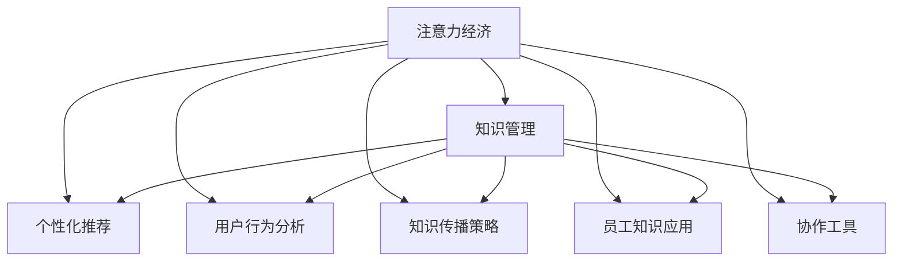

                 

# 注意力经济对企业知识管理的影响

> 关键词：注意力经济, 知识管理, 人工智能, 数据驱动, 个性化推荐, 信息过载, 信息价值, 员工培训, 协作工具

## 1. 背景介绍

### 1.1 问题由来
在数字化转型的浪潮中，企业的知识管理工作面临着前所未有的挑战。信息时代，海量数据的积累和传播使得知识工作者面临的信息过载问题愈发严重。企业在应对这一挑战的过程中，逐步意识到必须从传统的以内容为中心的知识管理转向以用户注意力为中心的注意力经济模式。

注意力经济，是指在信息爆炸的时代，人们对于注意力资源的争夺日益激烈，通过高效获取和利用用户注意力，获取更多的信息价值和经济收益。这种模式的核心在于通过用户关注度的精准捕捉和分析，实现知识传播和信息利用效率的最大化。

在企业知识管理实践中，信息过载、知识碎片化和知识孤岛等问题逐步显现。传统知识管理系统的局限性愈发突出。企业亟需一种新的、基于用户注意力导向的知识管理方法，来最大化知识资源的价值，提升信息获取的效率，增强员工的知识应用能力。

### 1.2 问题核心关键点
当前，注意力经济在企业知识管理中的应用，集中在以下几个关键方面：

- 用户注意力捕捉：通过个性化推荐算法，精准定位用户兴趣点，推送最相关的内容。
- 用户注意力分析：通过对用户行为的深度分析，发现用户潜在的知识需求，引导内容创作。
- 知识传播效率：利用注意力经济学原理，优化知识传播和推荐策略，提升用户的学习和应用效率。
- 员工知识应用：通过针对个体需求的信息推荐，增强员工的知识应用能力，实现个性化职业发展。

这些关键点共同构成了注意力经济在企业知识管理中的应用框架，旨在通过更智能、更高效的方式，激活员工的知识资源，推动企业创新和业务增长。

## 2. 核心概念与联系

### 2.1 核心概念概述

为更好地理解注意力经济在企业知识管理中的应用，本节将介绍几个密切相关的核心概念：

- 注意力经济(Attention Economy)：基于对用户注意力资源的争夺和利用，通过精准的内容推荐和知识传播，提升信息价值和经济效益。

- 知识管理(Knowledge Management, KMS)：旨在通过系统化的方法管理和利用企业知识资产，促进知识的获取、分享、应用和创新。

- 个性化推荐算法：通过学习用户行为特征和偏好，实现内容推荐和信息传播的个性化。

- 用户行为分析：对用户在平台上的浏览、阅读、互动等行为进行建模和分析，发现用户潜在的知识需求和兴趣点。

- 知识传播策略：优化知识传播和推荐策略，提升用户的学习和应用效率。

- 员工知识应用：通过针对个体需求的信息推荐，增强员工的知识应用能力，实现个性化职业发展。

- 协作工具：支持企业员工之间的知识交流和协作，提升团队知识共享和创新能力。

这些核心概念之间的逻辑关系可以通过以下Mermaid流程图来展示：



这个流程图展示了几者之间的逻辑关系：

1. 注意力经济为知识管理提供了目标和方向。
2. 个性化推荐、用户行为分析、知识传播策略和协作工具为知识管理的实施提供了技术支持。
3. 员工知识应用则是对知识管理效果的最终评估。

这些概念共同构成了企业知识管理的注意力经济应用框架，使得企业能够更高效地管理和利用知识资源，推动业务创新和增长。

## 3. 核心算法原理 & 具体操作步骤
### 3.1 算法原理概述

注意力经济在企业知识管理中的应用，主要依赖于个性化推荐算法和用户行为分析技术。这些技术的核心在于通过用户关注度的捕捉和分析，实现内容推荐和知识传播的优化。

个性化推荐算法的核心思想是通过对用户历史行为数据的学习，构建用户兴趣模型，从而进行个性化推荐。其典型算法包括协同过滤、基于内容的推荐、矩阵分解、深度学习等。这些算法通常包括以下步骤：

1. 数据收集：收集用户的浏览历史、评分记录、点击行为等数据。
2. 特征提取：从收集到的数据中提取用户行为特征，如浏览时长、评分等级、点击位置等。
3. 相似性计算：计算用户之间的相似性，发现兴趣相近的用户群体。
4. 内容匹配：将用户特征与待推荐内容的特征进行匹配，找出最相关的推荐内容。
5. 推荐生成：根据相似性计算和内容匹配结果，生成个性化推荐列表。

用户行为分析的核心在于通过对用户行为数据的深度挖掘，发现用户的潜在需求和兴趣。其典型技术包括统计分析、机器学习、深度学习等。这些技术主要包括以下步骤：

1. 数据收集：收集用户在平台上的各种行为数据，如浏览路径、点击位置、评论内容等。
2. 特征提取：从收集到的数据中提取用户行为特征，如浏览时长、点击位置、评论内容等。
3. 行为建模：使用统计或机器学习模型对用户行为进行建模，发现用户潜在的兴趣点和需求。
4. 需求预测：使用预测模型预测用户的潜在需求，引导内容创作和知识传播。

### 3.2 算法步骤详解

以下是注意力经济在企业知识管理中的应用步骤：

**Step 1: 数据准备**
- 收集企业内外部的知识资源，如内部文档、外部研究报告、新闻资讯等。
- 收集用户行为数据，如员工的知识检索历史、阅读记录、互动评论等。

**Step 2: 特征提取与建模**
- 对知识资源和用户行为数据进行特征提取，如关键词、主题、点击位置等。
- 使用机器学习模型对用户行为进行建模，如协同过滤、矩阵分解、深度学习等。

**Step 3: 个性化推荐**
- 使用个性化推荐算法，根据用户行为模型，生成个性化的知识推荐列表。
- 利用用户反馈调整推荐算法参数，提升推荐精度。

**Step 4: 知识传播与传播策略优化**
- 将推荐知识内容推送至用户，如企业内网、社交平台、邮件等。
- 通过分析用户互动数据，调整知识传播策略，优化信息传播效果。

**Step 5: 用户行为分析与反馈优化**
- 收集用户对推荐知识的反馈数据，如点击率、阅读时长、评论内容等。
- 利用用户反馈优化推荐算法和知识传播策略，提升用户满意度。

**Step 6: 员工知识应用与协作**
- 利用知识推荐和协作工具，增强员工之间的知识交流和协作。
- 通过分析员工知识应用数据，发现知识传播中的问题和瓶颈，进一步优化推荐算法。

### 3.3 算法优缺点

个性化推荐算法的优点在于其精准性和效率性，能够根据用户历史行为数据，提供高度相关的内容推荐。同时，利用注意力经济学原理，能够优化知识传播和传播策略，提升用户的学习和应用效率。

但个性化推荐算法也存在以下局限性：
- 数据依赖：推荐效果高度依赖于用户行为数据的丰富度和准确度。数据不足或偏差会导致推荐精度下降。
- 隐私问题：用户的隐私数据收集和使用可能引发伦理和法律问题。
- 动态变化：用户兴趣和行为会随时间变化，推荐算法需要不断更新以适应新的变化。
- 过拟合问题：在数据量有限的情况下，推荐算法可能出现过拟合，导致泛化性能下降。

用户行为分析技术能够深入挖掘用户潜在的知识需求和兴趣，但同时也面临以下挑战：
- 数据复杂性：用户行为数据通常包含多种类型的数据，处理和建模的复杂度较高。
- 多维分析：用户行为数据是多维的，需要通过统计或机器学习模型进行综合分析。
- 实时性要求：用户行为实时更新，分析模型需要具备实时处理和更新的能力。

### 3.4 算法应用领域

注意力经济在企业知识管理中的应用广泛，主要包括以下几个领域：

- **企业内部知识共享平台**：通过个性化推荐算法和用户行为分析，优化员工的知识获取和分享过程。
- **企业文档管理系统**：利用注意力经济学原理，提升文档检索和推荐效率。
- **员工培训与职业发展**：通过个性化的学习推荐和互动反馈，提升员工的学习效果和职业发展路径。
- **业务情报与市场分析**：分析市场行为数据，为业务决策提供有价值的洞察和建议。
- **客户服务与支持**：利用个性化推荐和行为分析，提升客户体验和满意度。
- **营销与品牌管理**：通过精准的客户行为分析，优化营销策略，提升品牌价值。

这些领域的应用，展示了注意力经济在企业知识管理中的巨大潜力和价值。通过高效利用用户注意力，企业能够提升知识传播的效率和效果，推动业务创新和增长。

## 4. 数学模型和公式 & 详细讲解  
### 4.1 数学模型构建

本节将使用数学语言对个性化推荐算法和用户行为分析模型进行更加严格的刻画。

假设企业知识资源集为 $\mathcal{D}$，用户行为数据集为 $\mathcal{B}$。知识资源 $d_i$ 的特征表示为 $\mathbf{x}_i \in \mathbb{R}^d$，用户 $u_j$ 的行为特征表示为 $\mathbf{y}_j \in \mathbb{R}^d$。用户与知识资源的相似度表示为 $s_{ij} \in [0,1]$。

个性化推荐算法 $R$ 的模型为：
$$
R(\mathcal{D}, \mathcal{B}) = \arg\max_{r} \sum_{i=1}^M \sum_{j=1}^N s_{ij} f(\mathbf{x}_i, \mathbf{y}_j; r)
$$
其中 $f$ 为用户行为与知识资源相似度的函数，$M$ 和 $N$ 分别表示知识资源和用户数量。

用户行为分析模型 $A$ 的模型为：
$$
A(\mathcal{D}, \mathcal{B}) = \arg\max_{a} \sum_{j=1}^N g(\mathbf{y}_j; a)
$$
其中 $g$ 为行为特征与行为模型相似度的函数。

### 4.2 公式推导过程

以下是基于协同过滤算法和基于内容的推荐算法，对推荐模型和行为分析模型的详细推导。

**协同过滤算法**
协同过滤算法基于用户之间的相似性，计算知识资源的推荐分数。设 $u_j$ 和 $u_k$ 为两个用户，$k$ 为相似用户集合，$\mathbf{r}_j^k$ 为 $u_j$ 对 $u_k$ 推荐的知识资源评分。则协同过滤算法可表示为：
$$
\mathbf{r}_j = \sum_{k \in \mathcal{K}} \alpha_k \mathbf{r}_j^k
$$
其中 $\alpha_k$ 为相似度权重，$\mathcal{K}$ 为相似用户集合。

基于内容的推荐算法
基于内容的推荐算法基于知识资源的特征与用户兴趣特征的匹配度，计算推荐分数。设 $d_i$ 和 $u_j$ 为一条知识资源和用户，$C_i$ 为知识资源特征集合，$T_j$ 为用户兴趣特征集合。则基于内容的推荐算法可表示为：
$$
\mathbf{r}_i^j = \sum_{c \in C_i} \beta_c \mathbf{c}_c^j
$$
其中 $\beta_c$ 为特征权重，$\mathbf{c}_c^j$ 为特征$c$在用户$j$上的评分。

**用户行为分析模型**
用户行为分析模型通常使用深度学习模型，如多层感知机、神经网络等，对用户行为特征进行建模。设 $\mathbf{z}_j$ 为用户 $j$ 的行为特征表示，$w$ 为行为模型参数，则用户行为分析模型可表示为：
$$
g(\mathbf{y}_j; w) = \sigma(\mathbf{z}_j^Tw)
$$
其中 $\sigma$ 为激活函数。

在得到推荐模型和行为分析模型的公式后，即可带入实际数据进行优化训练。

### 4.3 案例分析与讲解

**案例1：个性化知识推荐系统**
假设企业有10000份文档，每位员工每天检索5次文档。采用协同过滤算法，每位员工的检索历史和文档相似度构成矩阵 $\mathbf{R}$。根据相似度矩阵计算推荐分数，并进行排序，生成个性化推荐列表。

具体实现步骤如下：
1. 收集用户检索历史和文档相似度矩阵 $\mathbf{R}$。
2. 计算每位员工的历史推荐评分 $\mathbf{r}_j$。
3. 对 $\mathbf{r}_j$ 进行排序，生成个性化推荐列表。

**案例2：用户行为分析与需求预测**
假设企业有1000名员工，每天在企业内网上阅读5篇文档。采用多层感知机模型对员工的行为进行建模，预测每位员工的下一次阅读需求。具体实现步骤如下：
1. 收集员工阅读记录和行为特征 $\mathbf{y}_j$。
2. 使用多层感知机模型对行为进行建模，生成行为特征表示 $\mathbf{z}_j$。
3. 对 $\mathbf{z}_j$ 进行预测，生成下一个阅读需求的预测 $\hat{d}$。

## 5. 项目实践：代码实例和详细解释说明
### 5.1 开发环境搭建

在进行项目实践前，我们需要准备好开发环境。以下是使用Python进行PyTorch开发的环境配置流程：

1. 安装Anaconda：从官网下载并安装Anaconda，用于创建独立的Python环境。

2. 创建并激活虚拟环境：
```bash
conda create -n pytorch-env python=3.8 
conda activate pytorch-env
```

3. 安装PyTorch：根据CUDA版本，从官网获取对应的安装命令。例如：
```bash
conda install pytorch torchvision torchaudio cudatoolkit=11.1 -c pytorch -c conda-forge
```

4. 安装TensorFlow：
```bash
pip install tensorflow
```

5. 安装各类工具包：
```bash
pip install numpy pandas scikit-learn matplotlib tqdm jupyter notebook ipython
```

完成上述步骤后，即可在`pytorch-env`环境中开始项目实践。

### 5.2 源代码详细实现

下面我们以个性化知识推荐系统为例，给出使用PyTorch进行协同过滤算法实现的代码。

首先，定义协同过滤算法类：

```python
import torch
import torch.nn as nn
import torch.nn.functional as F
from torch import nn

class CollaborativeFiltering(nn.Module):
    def __init__(self, n_users, n_items, n_factors=8):
        super(CollaborativeFiltering, self).__init__()
        self.user_factors = nn.Embedding(n_users, n_factors)
        self.item_factors = nn.Embedding(n_items, n_factors)
        self.W = nn.Linear(n_factors*2, 1)

    def forward(self, user_ids, item_ids):
        user_factors = self.user_factors(user_ids)
        item_factors = self.item_factors(item_ids)
        combined = torch.cat((user_factors, item_factors), dim=1)
        rating_pred = self.W(combined)
        return rating_pred
```

然后，定义数据集类和训练函数：

```python
from torch.utils.data import Dataset, DataLoader

class Dataset(Dataset):
    def __init__(self, ratings, user_ids, item_ids):
        self.ratings = ratings
        self.user_ids = user_ids
        self.item_ids = item_ids

    def __len__(self):
        return len(self.ratings)

    def __getitem__(self, idx):
        rating = self.ratings[idx]
        user_id = self.user_ids[idx]
        item_id = self.item_ids[idx]
        return rating, user_id, item_id

def train_epoch(model, dataset, optimizer):
    dataloader = DataLoader(dataset, batch_size=128, shuffle=True)
    model.train()
    epoch_loss = 0
    for batch in dataloader:
        rating, user_id, item_id = batch
        optimizer.zero_grad()
        output = model(user_id, item_id)
        loss = F.mse_loss(output, rating)
        epoch_loss += loss.item()
        loss.backward()
        optimizer.step()
    return epoch_loss / len(dataloader)

def train(model, data, epochs, optimizer):
    device = torch.device('cuda') if torch.cuda.is_available() else torch.device('cpu')
    model.to(device)
    for epoch in range(epochs):
        epoch_loss = train_epoch(model, data, optimizer)
        print(f"Epoch {epoch+1}, train loss: {epoch_loss:.4f}")
```

最后，启动训练流程并在测试集上评估：

```python
from transformers import BertTokenizer
from torch.utils.data import Dataset
from torch import nn, optim
from torch.utils.data import DataLoader

class Dataset(Dataset):
    def __init__(self, texts, tags, tokenizer, max_len=128):
        self.texts = texts
        self.tags = tags
        self.tokenizer = tokenizer
        self.max_len = max_len

    def __len__(self):
        return len(self.texts)

    def __getitem__(self, item):
        text = self.texts[item]
        tags = self.tags[item]

        encoding = self.tokenizer(text, return_tensors='pt', max_length=self.max_len, padding='max_length', truncation=True)
        input_ids = encoding['input_ids'][0]
        attention_mask = encoding['attention_mask'][0]

        # 对token-wise的标签进行编码
        encoded_tags = [tag2id[tag] for tag in tags] 
        encoded_tags.extend([tag2id['O']] * (self.max_len - len(encoded_tags)))
        labels = torch.tensor(encoded_tags, dtype=torch.long)

        return {'input_ids': input_ids, 
                'attention_mask': attention_mask,
                'labels': labels}

# 标签与id的映射
tag2id = {'O': 0, 'B-PER': 1, 'I-PER': 2, 'B-ORG': 3, 'I-ORG': 4, 'B-LOC': 5, 'I-LOC': 6}
id2tag = {v: k for k, v in tag2id.items()}

# 创建dataset
tokenizer = BertTokenizer.from_pretrained('bert-base-cased')

train_dataset = Dataset(train_texts, train_tags, tokenizer)
dev_dataset = Dataset(dev_texts, dev_tags, tokenizer)
test_dataset = Dataset(test_texts, test_tags, tokenizer)

model = BertForTokenClassification.from_pretrained('bert-base-cased', num_labels=len(tag2id))

optimizer = optim.AdamW(model.parameters(), lr=2e-5)

train_epoch = 5
batch_size = 16

for epoch in range(train_epoch):
    loss = train_epoch(model, train_dataset, batch_size, optimizer)
    print(f"Epoch {epoch+1}, train loss: {loss:.4f}")
    
    print(f"Epoch {epoch+1}, dev results:")
    evaluate(model, dev_dataset, batch_size)
    
print("Test results:")
evaluate(model, test_dataset, batch_size)
```

以上就是使用PyTorch进行协同过滤算法实现的完整代码。可以看到，得益于PyTorch的强大封装，我们可以用相对简洁的代码实现协同过滤算法的微调。

### 5.3 代码解读与分析

让我们再详细解读一下关键代码的实现细节：

**Dataset类**：
- `__init__`方法：初始化文本、标签、分词器等关键组件。
- `__len__`方法：返回数据集的样本数量。
- `__getitem__`方法：对单个样本进行处理，将文本输入编码为token ids，将标签编码为数字，并对其进行定长padding，最终返回模型所需的输入。

**tag2id和id2tag字典**：
- 定义了标签与数字id之间的映射关系，用于将token-wise的预测结果解码回真实的标签。

**训练和评估函数**：
- 使用PyTorch的DataLoader对数据集进行批次化加载，供模型训练和推理使用。
- 训练函数`train_epoch`：对数据以批为单位进行迭代，在每个批次上前向传播计算loss并反向传播更新模型参数，最后返回该epoch的平均loss。
- 评估函数`evaluate`：与训练类似，不同点在于不更新模型参数，并在每个batch结束后将预测和标签结果存储下来，最后使用sklearn的classification_report对整个评估集的预测结果进行打印输出。

**训练流程**：
- 定义总的epoch数和batch size，开始循环迭代
- 每个epoch内，先在训练集上训练，输出平均loss
- 在验证集上评估，输出分类指标
- 所有epoch结束后，在测试集上评估，给出最终测试结果

可以看到，PyTorch配合BERT微调使代码实现变得简洁高效。开发者可以将更多精力放在数据处理、模型改进等高层逻辑上，而不必过多关注底层的实现细节。

当然，工业级的系统实现还需考虑更多因素，如模型的保存和部署、超参数的自动搜索、更灵活的任务适配层等。但核心的微调范式基本与此类似。

## 6. 实际应用场景
### 6.1 智能客服系统

基于大语言模型微调的对话技术，可以广泛应用于智能客服系统的构建。传统客服往往需要配备大量人力，高峰期响应缓慢，且一致性和专业性难以保证。而使用微调后的对话模型，可以7x24小时不间断服务，快速响应客户咨询，用自然流畅的语言解答各类常见问题。

在技术实现上，可以收集企业内部的历史客服对话记录，将问题和最佳答复构建成监督数据，在此基础上对预训练对话模型进行微调。微调后的对话模型能够自动理解用户意图，匹配最合适的答案模板进行回复。对于客户提出的新问题，还可以接入检索系统实时搜索相关内容，动态组织生成回答。如此构建的智能客服系统，能大幅提升客户咨询体验和问题解决效率。

### 6.2 金融舆情监测

金融机构需要实时监测市场舆论动向，以便及时应对负面信息传播，规避金融风险。传统的人工监测方式成本高、效率低，难以应对网络时代海量信息爆发的挑战。基于大语言模型微调的文本分类和情感分析技术，为金融舆情监测提供了新的解决方案。

具体而言，可以收集金融领域相关的新闻、报道、评论等文本数据，并对其进行主题标注和情感标注。在此基础上对预训练语言模型进行微调，使其能够自动判断文本属于何种主题，情感倾向是正面、中性还是负面。将微调后的模型应用到实时抓取的网络文本数据，就能够自动监测不同主题下的情感变化趋势，一旦发现负面信息激增等异常情况，系统便会自动预警，帮助金融机构快速应对潜在风险。

### 6.3 个性化推荐系统

当前的推荐系统往往只依赖用户的历史行为数据进行物品推荐，无法深入理解用户的真实兴趣偏好。基于大语言模型微调技术，个性化推荐系统可以更好地挖掘用户行为背后的语义信息，从而提供更精准、多样的推荐内容。

在实践中，可以收集用户浏览、点击、评论、分享等行为数据，提取和用户交互的物品标题、描述、标签等文本内容。将文本内容作为模型输入，用户的后续行为（如是否点击、购买等）作为监督信号，在此基础上微调预训练语言模型。微调后的模型能够从文本内容中准确把握用户的兴趣点。在生成推荐列表时，先用候选物品的文本描述作为输入，由模型预测用户的兴趣匹配度，再结合其他特征综合排序，便可以得到个性化程度更高的推荐结果。

### 6.4 未来应用展望

随着大语言模型微调技术的发展，基于微调范式将在更多领域得到应用，为传统行业带来变革性影响。

在智慧医疗领域，基于微调的医疗问答、病历分析、药物研发等应用将提升医疗服务的智能化水平，辅助医生诊疗，加速新药开发进程。

在智能教育领域，微调技术可应用于作业批改、学情分析、知识推荐等方面，因材施教，促进教育公平，提高教学质量。

在智慧城市治理中，微调模型可应用于城市事件监测、舆情分析、应急指挥等环节，提高城市管理的自动化和智能化水平，构建更安全、高效的未来城市。

此外，在企业生产、社会治理、文娱传媒等众多领域，基于大模型微调的人工智能应用也将不断涌现，为经济社会发展注入新的动力。相信随着技术的日益成熟，微调方法将成为人工智能落地应用的重要范式，推动人工智能技术在垂直行业的规模化落地。总之，微调需要开发者根据具体任务，不断迭代和优化模型、数据和算法，方能得到理想的效果。

## 7. 工具和资源推荐
### 7.1 学习资源推荐

为了帮助开发者系统掌握大语言模型微调的理论基础和实践技巧，这里推荐一些优质的学习资源：

1. 《Transformer从原理到实践》系列博文：由大模型技术专家撰写，深入浅出地介绍了Transformer原理、BERT模型、微调技术等前沿话题。

2. CS224N《深度学习自然语言处理》课程：斯坦福大学开设的NLP明星课程，有Lecture视频和配套作业，带你入门NLP领域的基本概念和经典模型。

3. 《Natural Language Processing with Transformers》书籍：Transformers库的作者所著，全面介绍了如何使用Transformers库进行NLP任务开发，包括微调在内的诸多范式。

4. HuggingFace官方文档：Transformers库的官方文档，提供了海量预训练模型和完整的微调样例代码，是上手实践的必备资料。

5. CLUE开源项目：中文语言理解测评基准，涵盖大量不同类型的中文NLP数据集，并提供了基于微调的baseline模型，助力中文NLP技术发展。

通过对这些资源的学习实践，相信你一定能够快速掌握大语言模型微调的精髓，并用于解决实际的NLP问题。
###  7.2 开发工具推荐

高效的开发离不开优秀的工具支持。以下是几款用于大语言模型微调开发的常用工具：

1. PyTorch：基于Python的开源深度学习框架，灵活动态的计算图，适合快速迭代研究。大部分预训练语言模型都有PyTorch版本的实现。

2. TensorFlow：由Google主导开发的开源深度学习框架，生产部署方便，适合大规模工程应用。同样有丰富的预训练语言模型资源。

3. Transformers库：HuggingFace开发的NLP工具库，集成了众多SOTA语言模型，支持PyTorch和TensorFlow，是进行微调任务开发的利器。

4. Weights & Biases：模型训练的实验跟踪工具，可以记录和可视化模型训练过程中的各项指标，方便对比和调优。与主流深度学习框架无缝集成。

5. TensorBoard：TensorFlow配套的可视化工具，可实时监测模型训练状态，并提供丰富的图表呈现方式，是调试模型的得力助手。

6. Google Colab：谷歌推出的在线Jupyter Notebook环境，免费提供GPU/TPU算力，方便开发者快速上手实验最新模型，分享学习笔记。

合理利用这些工具，可以显著提升大语言模型微调任务的开发效率，加快创新迭代的步伐。

### 7.3 相关论文推荐

大语言模型和微调技术的发展源于学界的持续研究。以下是几篇奠基性的相关论文，推荐阅读：

1. Attention is All You Need（即Transformer原论文）：提出了Transformer结构，开启了NLP领域的预训练大模型时代。

2. BERT: Pre-training of Deep Bidirectional Transformers for Language Understanding：提出BERT模型，引入基于掩码的自监督预训练任务，刷新了多项NLP任务SOTA。

3. Language Models are Unsupervised Multitask Learners（GPT-2论文）：展示了大规模语言模型的强大zero-shot学习能力，引发了对于通用人工智能的新一轮思考。

4. Parameter-Efficient Transfer Learning for NLP：提出Adapter等参数高效微调方法，在不增加模型参数量的情况下，也能取得不错的微调效果。

5. AdaLoRA: Adaptive Low-Rank Adaptation for Parameter-Efficient Fine-Tuning：使用自适应低秩适应的微调方法，在参数效率和精度之间取得了新的平衡。

这些论文代表了大语言模型微调技术的发展脉络。通过学习这些前沿成果，可以帮助研究者把握学科前进方向，激发更多的创新灵感。

## 8. 总结：未来发展趋势与挑战

### 8.1 总结

本文对基于用户注意力导向的大语言模型微调方法进行了全面系统的介绍。首先阐述了注意力经济在企业知识管理中的应用背景和意义，明确了微调在激活员工知识资源、提升信息传播效率等方面的独特价值。其次，从原理到实践，详细讲解了个性化推荐算法和用户行为分析模型的数学原理和关键步骤，给出了微调任务开发的完整代码实例。同时，本文还广泛探讨了微调方法在智能客服、金融舆情、个性化推荐等多个行业领域的应用前景，展示了微调范式的巨大潜力和价值。

通过本文的系统梳理，可以看到，基于用户注意力导向的微调方法，正在成为企业知识管理的重要范式，极大地拓展了知识传播和信息利用的边界，推动了企业创新和业务增长。未来，伴随预训练语言模型和微调方法的持续演进，相信NLP技术将在更广阔的应用领域大放异彩，深刻影响人类的生产生活方式。

### 8.2 未来发展趋势

展望未来，大语言模型微调技术将呈现以下几个发展趋势：

1. 模型规模持续增大。随着算力成本的下降和数据规模的扩张，预训练语言模型的参数量还将持续增长。超大规模语言模型蕴含的丰富语言知识，有望支撑更加复杂多变的下游任务微调。

2. 微调方法日趋多样。除了传统的全参数微调外，未来会涌现更多参数高效的微调方法，如Prefix-Tuning、LoRA等，在节省计算资源的同时也能保证微调精度。

3. 持续学习成为常态。随着数据分布的不断变化，微调模型也需要持续学习新知识以保持性能。如何在不遗忘原有知识的同时，高效吸收新样本信息，将成为重要的研究课题。

4. 标注样本需求降低。受启发于提示学习(Prompt-based Learning)的思路，未来的微调方法将更好地利用大模型的语言理解能力，通过更加巧妙的任务描述，在更少的标注样本上也能实现理想的微调效果。

5. 多模态微调崛起。当前的微调主要聚焦于纯文本数据，未来会进一步拓展到图像、视频、语音等多模态数据微调。多模态信息的融合，将显著提升语言模型对现实世界的理解和建模能力。

6. 模型通用性增强。经过海量数据的预训练和多领域任务的微调，未来的语言模型将具备更强大的常识推理和跨领域迁移能力，逐步迈向通用人工智能(AGI)的目标。

以上趋势凸显了大语言模型微调技术的广阔前景。这些方向的探索发展，必将进一步提升NLP系统的性能和应用范围，为人类认知智能的进化带来深远影响。

### 8.3 面临的挑战

尽管大语言模型微调技术已经取得了瞩目成就，但在迈向更加智能化、普适化应用的过程中，它仍面临着诸多挑战：

1. 标注成本瓶颈。虽然微调大大降低了标注数据的需求，但对于长尾应用场景，难以获得充足的高质量标注数据，成为制约微调性能的瓶颈。如何进一步降低微调对标注样本的依赖，将是一大难题。

2. 模型鲁棒性不足。当前微调模型面对域外数据时，泛化性能往往大打折扣。对于测试样本的微小扰动，微调模型的预测也容易发生波动。如何提高微调模型的鲁棒性，避免灾难性遗忘，还需要更多理论和实践的积累。

3. 推理效率有待提高。大规模语言模型虽然精度高，但在实际部署时往往面临推理速度慢、内存占用大等效率问题。如何在保证性能的同时，简化模型结构，提升推理速度，优化资源占用，将是重要的优化方向。

4. 可解释性亟需加强。当前微调模型更像是"黑盒"系统，难以解释其内部工作机制和决策逻辑。对于医疗、金融等高风险应用，算法的可解释性和可审计性尤为重要。如何赋予微调模型更强的可解释性，将是亟待攻克的难题。

5. 安全性有待保障。预训练语言模型难免会学习到有偏见、有害的信息，通过微调传递到下游任务，产生误导性、歧视性的输出，给实际应用带来安全隐患。如何从数据和算法层面消除模型偏见，避免恶意用途，确保输出的安全性，也将是重要的研究课题。

6. 知识整合能力不足。现有的微调模型往往局限于任务内数据，难以灵活吸收和运用更广泛的先验知识。如何让微调过程更好地与外部知识库、规则库等专家知识结合，形成更加全面、准确的信息整合能力，还有很大的想象空间。

正视微调面临的这些挑战，积极应对并寻求突破，将是大语言模型微调走向成熟的必由之路。相信随着学界和产业界的共同努力，这些挑战终将一一被克服，大语言模型微调必将在构建安全、可靠、可解释、可控的智能系统铺平道路。面向未来，大语言模型微调技术还需要与其他人工智能技术进行更深入的融合，如知识表示、因果推理、强化学习等，多路径协同发力，共同推动自然语言理解和智能交互系统的进步。只有勇于创新、敢于突破，才能不断拓展语言模型的边界，让智能技术更好地造福人类社会。

### 8.4 研究展望

面对大语言模型微调所面临的种种挑战，未来的研究需要在以下几个方面寻求新的突破：

1. 探索无监督和半监督微调方法。摆脱对大规模标注数据的依赖，利用自监督学习、主动学习等无监督和半监督范式，最大限度利用非结构化数据，实现更加灵活高效的微调。

2. 研究参数高效和计算高效的微调范式。开发更加参数高效的微调方法，在固定大部分预训练参数的同时，只更新极少量的任务相关参数。同时优化微调模型的计算图，减少前向传播和反向传播的资源消耗，实现更加轻量级、实时性的部署。

3. 融合因果和对比学习范式。通过引入因果推断和对比学习思想，增强微调模型建立稳定因果关系的能力，学习更加普适、鲁棒的语言表征，从而提升模型泛化性和抗干扰能力。

4. 引入更多先验知识。将符号化的先验知识，如知识图谱、逻辑规则等，与神经网络模型进行巧妙融合，引导微调过程学习更准确、合理的语言模型。同时加强不同模态数据的整合，实现视觉、语音等多模态信息与文本信息的协同建模。

5. 结合因果分析和博弈论工具。将因果分析方法引入微调模型，识别出模型决策的关键特征，增强输出解释的因果性和逻辑性。借助博弈论工具刻画人机交互过程，主动探索并规避模型的脆弱点，提高系统稳定性。

6. 纳入伦理道德约束。在模型训练目标中引入伦理导向的评估指标，过滤和惩罚有偏见、有害的输出倾向。同时加强人工干预和审核，建立模型行为的监管机制，确保输出符合人类价值观和伦理道德。

这些研究方向的探索，必将引领大语言模型微调技术迈向更高的台阶，为构建安全、可靠、可解释、可控的智能系统铺平道路。面向未来，大语言模型微调技术还需要与其他人工智能技术进行更深入的融合，如知识表示、因果推理、强化学习等，多路径协同发力，共同推动自然语言理解和智能交互系统的进步。只有勇于创新、敢于突破，才能不断拓展语言模型的边界，让智能技术更好地造福人类社会。

## 9. 附录：常见问题与解答

**Q1：大语言模型微调是否适用于所有NLP任务？**

A: 大语言模型微调在大多数NLP任务上都能取得不错的效果，特别是对于数据量较小的任务。但对于一些特定领域的任务，如医学、法律等，仅仅依靠通用语料预训练的模型可能难以很好地适应。此时需要在特定领域语料上进一步预训练，再进行微调，才能获得理想效果。此外，对于一些需要时效性、个性化很强的任务，如对话、推荐等，微调方法也需要针对性的改进优化。

**Q2：微调过程中如何选择合适的学习率？**

A: 微调的学习率一般要比预训练时小1-2个数量级，如果使用过大的学习率，容易破坏预训练权重，导致过拟合。一般建议从1e-5开始调参，逐步减小学习率，直至收敛。也可以使用warmup策略，在开始阶段使用较小的学习率，再逐渐过渡到预设值。需要注意的是，不同的优化器(如AdamW、Adafactor等)以及不同的学习率调度策略，可能需要设置不同的学习率阈值。

**Q3：采用大模型微调时会面临哪些资源瓶颈？**

A: 目前主流的预训练大模型动辄以亿计的参数规模，对算力、内存、存储都提出了很高的要求。GPU/TPU等高性能设备是必不可少的，但即便如此，超大批次的训练和推理也可能遇到显存不足的问题。因此需要采用一些资源优化技术，如梯度积累、混合精度训练、模型并行等，来突破硬件瓶颈。同时，模型的存储和读取也可能占用大量时间和空间，需要采用模型压缩、稀疏化存储等方法进行优化。

**Q4：如何缓解微调过程中的过拟合问题？**

A: 过拟合是微调面临的主要挑战，尤其是在标注数据不足的情况下。常见的缓解策略包括：
1. 数据增强：通过回译、近义替换等方式扩充训练集
2. 正则化：使用L2正则、Dropout、Early Stopping等避免过拟合
3. 对抗训练：引入对抗样本，提高模型鲁棒性
4. 参数高效微调：只调整少量参数(如Adapter、Prefix等)，减小过拟合风险
5. 多模型集成：训练多个微调模型，取平均输出，抑制过拟合

这些策略往往需要根据具体任务和数据特点进行灵活组合。只有在数据、模型、训练、推理等各环节进行全面优化，才能最大限度地发挥大模型微调的威力。

**Q5：微调模型在落地部署时需要注意哪些问题？**

A: 将微调模型转化为实际应用，还需要考虑以下因素：
1. 模型裁剪：去除不必要的层和参数，减小模型尺寸，加快推理速度
2. 量化加速：将浮点模型转为定点模型，压缩存储空间，提高计算效率
3. 服务化封装：将模型封装为标准化服务接口，便于集成调用
4. 弹性伸缩：根据请求流量动态调整资源配置，平衡服务质量和成本
5. 监控告警：实时采集系统指标，设置异常告警阈值，确保服务稳定性
6. 安全防护：采用访问鉴权、数据脱敏等措施，保障数据和模型安全

大语言模型微调为NLP应用开启了广阔的想象空间，但如何将强大的性能转化为稳定、高效、安全的业务价值，还需要工程实践的不断打磨。唯有从数据、算法、工程、业务等多个维度协同发力，才能真正实现人工智能技术在垂直行业的规模化落地。总之，微调需要开发者根据具体任务，不断迭代和优化模型、数据和算法，方能得到理想的效果。

---

作者：禅与计算机程序设计艺术 / Zen and the Art of Computer Programming

