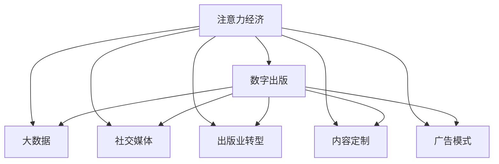

                 

# 注意力经济对传统出版业的挑战

> 关键词：注意力经济, 数字出版, 大数据, 社交媒体, 出版业转型, 内容定制, 广告模式

## 1. 背景介绍

### 1.1 问题由来

在互联网时代，信息爆炸使得注意力成为了一种稀缺资源。社交媒体、搜索引擎等平台的崛起，重新定义了信息的传播和消费方式。传统出版业，这个基于印刷和分销的行业，正面临着前所未有的挑战。如何在这个以注意力为中心的“注意力经济”中生存和发展，成为出版业亟需解决的重大问题。

### 1.2 问题核心关键点

注意力经济对传统出版业的主要挑战包括：
1. **信息获取渠道的多样化**：用户获取信息的渠道从单一的书本转向社交媒体、网站、移动应用等多元平台。
2. **内容碎片化和个性化**：用户偏好日益个性化，对长内容缺乏耐心，更倾向于快速消费短篇信息。
3. **广告收入模式的转变**：传统的纸质广告模式难以应对数字化广告的竞争，亟需新的盈利模式。
4. **版权保护和知识共享**：数字化时代，版权保护难度加大，知识共享需求增加，这对出版业的内容生产和分发提出了新要求。

### 1.3 问题研究意义

研究注意力经济对传统出版业的影响，对于理解出版业数字化转型的趋势和路径，探讨新的商业模式和运营策略，具有重要意义：

1. **把握数字化趋势**：了解用户注意力转移的趋势，有助于出版商及时调整内容策略，适应数字化时代的市场需求。
2. **创新盈利模式**：探索基于注意力经济的新型盈利方式，如个性化广告、内容付费、订阅服务等，提升业务收入。
3. **优化内容生产**：通过数据分析，把握用户兴趣点，优化内容定制，提高出版物的吸引力和市场竞争力。
4. **增强版权保护**：利用技术手段，如区块链、数字指纹等，加强版权保护，确保内容生产者的合法权益。
5. **推动产业升级**：通过数字化工具和平台，提升出版业的生产效率和市场响应速度，促进产业结构优化升级。

## 2. 核心概念与联系

### 2.1 核心概念概述

为了深入理解注意力经济对出版业的影响，本节将介绍几个关键概念及其相互关系：

- **注意力经济(Attention Economy)**：指在信息过载的互联网时代，用户的注意力成为了一种稀缺资源，信息提供者需通过各种方式吸引并保持用户的注意力，实现商业价值的过程。
- **数字出版(Digital Publishing)**：指利用数字技术，如PDF、ePub等电子文档格式，将出版物进行数字化处理，实现电子化生产和分销。
- **大数据(Big Data)**：指通过分析海量用户数据，挖掘用户行为模式，实现精准内容推荐和个性化营销。
- **社交媒体(Social Media)**：指通过网络社交平台，实现用户之间内容的分享、互动和传播，影响用户对信息的获取和消费。
- **出版业转型(Transition in Publishing)**：指出版商在数字化、信息化的过程中，重新审视自身业务模式和运营策略，实现从传统到数字的转型升级。
- **内容定制(Content Personalization)**：指根据用户兴趣和行为数据，提供个性化的内容和推荐，提升用户体验和满意度。
- **广告模式(Advertising Models)**：指在数字化时代，出版商通过互联网平台进行广告投放，实现收入多元化的新路径。

这些概念之间的联系可以通过以下Mermaid流程图来展示：



这个流程图展示了注意力经济如何通过数字化、数据化、社交化和个性化营销等手段，影响出版业的内容生产和分发，进而推动出版业的转型和升级。

## 3. 核心算法原理 & 具体操作步骤

### 3.1 算法原理概述

注意力经济下，出版业的核心目标是通过各种方式吸引和保持用户注意力，从而实现商业价值。具体而言，可以基于以下算法原理进行操作：

1. **注意力获取与保持**：通过数据分析，识别用户的注意力偏好和行为模式，优化内容推荐算法，提高用户粘性。
2. **个性化推荐**：利用大数据技术，对用户兴趣进行精准分析，提供定制化的内容和服务。
3. **互动与参与**：通过社交媒体平台，增强用户与内容之间的互动和参与，提升用户参与度和忠诚度。
4. **广告定位与效果评估**：利用数字广告技术，实现基于用户行为和兴趣的精准投放，并通过效果评估优化广告投放策略。

### 3.2 算法步骤详解

基于注意力经济，出版业的微调过程大致包括以下步骤：

**Step 1: 数据收集与处理**
- 收集用户的阅读、浏览、购买、评论等数据，构建用户行为数据集。
- 使用大数据技术对数据进行清洗、整合和分析，构建用户画像。

**Step 2: 注意力分析和建模**
- 利用注意力分析算法，识别用户关注的热点内容、趋势和兴趣。
- 构建注意力模型，量化用户对内容的关注度和兴趣度。

**Step 3: 内容推荐与优化**
- 根据注意力模型，为用户推荐相关内容，提升用户阅读体验。
- 通过A/B测试和用户反馈，不断优化内容推荐算法，提高推荐的精准度。

**Step 4: 社交媒体互动**
- 利用社交媒体平台，增强用户间的互动和交流，提升内容传播效果。
- 通过数据分析，把握用户互动行为，优化社交媒体策略。

**Step 5: 广告定位与投放**
- 基于用户行为数据，精准定位用户群体，进行个性化广告投放。
- 利用广告效果评估算法，实时调整广告投放策略，优化广告效果。

**Step 6: 用户体验与反馈**
- 收集用户对内容和服务的反馈，进行数据驱动的改进。
- 通过用户行为数据分析，不断优化内容生产和营销策略。

### 3.3 算法优缺点

基于注意力经济的大语言模型微调方法具有以下优点：
1. **高效性**：通过数据分析和精准推荐，显著提升用户粘性和满意度，降低运营成本。
2. **灵活性**：能够实时调整内容策略和广告投放，快速响应市场变化。
3. **可扩展性**：适应不同的出版领域和用户群体，具有较强的泛化能力。

同时，该方法也存在以下局限性：
1. **数据依赖性**：对用户数据的依赖较大，数据质量和多样性不足会影响算法效果。
2. **隐私保护**：用户数据的收集和分析可能涉及隐私问题，需要采取严格的保护措施。
3. **技术复杂性**：实现精准推荐和互动需要较高的技术水平，需要投入大量资源。

### 3.4 算法应用领域

基于注意力经济的大语言模型微调方法，已经在多个领域得到了广泛应用，例如：

- **数字出版平台**：通过精准推荐和互动，提升用户阅读体验，提高平台活跃度和用户粘性。
- **社交媒体营销**：利用社交媒体平台的数据分析，优化内容传播策略，提升广告效果。
- **在线教育**：通过个性化推荐和互动，提供定制化的学习体验，提升教育效果和用户满意度。
- **电子商务**：通过用户行为数据分析，优化商品推荐和广告投放，提升销售转化率。

## 4. 数学模型和公式 & 详细讲解  
### 4.1 数学模型构建

本节将使用数学语言对基于注意力经济的大语言模型微调过程进行更加严格的刻画。

设出版商的目标是最大化用户注意力收入（例如广告收入），定义用户对内容 $x_i$ 的注意力得分为 $a_i$，广告投放给内容的成本为 $c_i$，内容 $x_i$ 带来的收入为 $r_i$。则目标函数为：

$$
\max \sum_i a_i r_i - \sum_i a_i c_i
$$

其中 $a_i$ 为内容 $x_i$ 的注意力得分，可通过注意力分析算法进行计算。

### 4.2 公式推导过程

为了最大化上述目标函数，可以使用拉格朗日乘子法进行求解。设拉格朗日乘子为 $\lambda$，构造拉格朗日函数：

$$
\mathcal{L}(a_i, \lambda) = \sum_i a_i r_i - \sum_i a_i c_i + \lambda (\sum_i a_i - 1)
$$

其中 $\lambda$ 为注意力总量的拉格朗日乘子，保证注意力总和为1。

对 $a_i$ 求偏导数，并令其为0，得到：

$$
\frac{\partial \mathcal{L}}{\partial a_i} = r_i - c_i + \lambda = 0
$$

解得：

$$
a_i = c_i - r_i + \lambda
$$

将 $a_i$ 代入注意力总和约束条件 $\sum_i a_i = 1$，得：

$$
\lambda = 1 - \sum_i (c_i - r_i)
$$

最终，内容 $x_i$ 的注意力得分为：

$$
a_i = c_i - r_i + 1 - \sum_i (c_i - r_i)
$$

### 4.3 案例分析与讲解

假设出版商在两个内容 $x_1$ 和 $x_2$ 之间进行广告投放。设 $r_1 = 2, c_1 = 1, r_2 = 1, c_2 = 1$，则 $a_1 = 0.5, a_2 = -0.5$。显然，出版商应该停止在 $x_2$ 上投放广告，将所有注意力集中于 $x_1$。

这表明，通过优化注意力分配，出版商可以最大化其广告收入，同时避免资源浪费。

## 5. 项目实践：代码实例和详细解释说明
### 5.1 开发环境搭建

在进行注意力经济下的内容推荐系统开发时，需要以下环境配置：

1. **Python环境**：确保安装了Python 3.7及以上版本，推荐使用Anaconda进行环境隔离。
2. **数据处理库**：安装Pandas、NumPy等数据处理库。
3. **机器学习库**：安装Scikit-learn、TensorFlow等机器学习库。
4. **深度学习框架**：安装PyTorch或TensorFlow等深度学习框架。
5. **可视化工具**：安装Matplotlib、Seaborn等数据可视化工具。

### 5.2 源代码详细实现

以下是使用PyTorch实现基于注意力经济的内容推荐系统的示例代码：

```python
import torch
import torch.nn as nn
import torch.optim as optim
import pandas as pd
from sklearn.model_selection import train_test_split

class AttentionModel(nn.Module):
    def __init__(self, input_dim, hidden_dim):
        super(AttentionModel, self).__init__()
        self.hidden_dim = hidden_dim
        self.W_q = nn.Linear(input_dim, hidden_dim)
        self.W_k = nn.Linear(input_dim, hidden_dim)
        self.W_v = nn.Linear(input_dim, hidden_dim)
        self.v = nn.Linear(hidden_dim, 1)

    def forward(self, q, k, v):
        q = self.W_q(q)
        k = self.W_k(k)
        v = self.W_v(v)
        attn = torch.bmm(q, k.unsqueeze(2)).squeeze(2)
        attn = torch.softmax(attn, dim=1)
        output = torch.bmm(attn, v.unsqueeze(2)).squeeze(2)
        return output

# 加载数据
data = pd.read_csv('user_behavior_data.csv')
X = data[['behavior', 'interest']]
y = data['content']

# 分割训练集和测试集
X_train, X_test, y_train, y_test = train_test_split(X, y, test_size=0.2, random_state=42)

# 定义模型
model = AttentionModel(input_dim=10, hidden_dim=5)

# 定义优化器和损失函数
optimizer = optim.Adam(model.parameters(), lr=0.001)
criterion = nn.MSELoss()

# 训练模型
for epoch in range(100):
    for i, (x, y) in enumerate(zip(X_train, y_train)):
        x = torch.tensor(x.values, dtype=torch.float32)
        y = torch.tensor(y.values, dtype=torch.float32)
        optimizer.zero_grad()
        output = model(x)
        loss = criterion(output, y)
        loss.backward()
        optimizer.step()
        print(f'Epoch {epoch+1}, Loss: {loss:.4f}')

# 测试模型
with torch.no_grad():
    output = model(X_test.values)
    print(f'Test Loss: {criterion(output, y_test.values).item():.4f}')
```

### 5.3 代码解读与分析

上述代码实现了一个简单的注意力模型，用于对用户行为数据进行分析，并推荐相关内容。具体步骤如下：

1. **数据加载**：使用Pandas加载用户行为数据，提取行为和兴趣特征。
2. **模型定义**：定义一个简单的注意力模型，包括查询向量、键向量和值向量，以及注意力权重和输出向量。
3. **优化器和损失函数**：使用Adam优化器和均方误差损失函数。
4. **训练模型**：通过迭代训练，最小化损失函数，更新模型参数。
5. **测试模型**：在测试集上评估模型性能。

## 6. 实际应用场景

### 6.1 智能推荐系统

基于注意力经济的内容推荐系统，在智能推荐场景中表现尤为突出。通过分析用户行为数据，如浏览记录、购买记录、搜索关键词等，出版商可以精准推荐用户感兴趣的内容，提升用户满意度和留存率。

在具体实现中，可以集成深度学习模型和注意力机制，构建多模态推荐系统。例如，可以利用用户的行为数据和社交媒体数据，生成基于用户兴趣和社交属性的推荐结果。

### 6.2 个性化内容定制

注意力经济下，出版商可以根据用户的个性化需求，定制个性化的内容和服务。通过大数据分析，出版商可以精准把握用户偏好，为其提供定制化的阅读体验，如个性化推荐、订阅服务等。

在技术实现上，可以采用机器学习和自然语言处理技术，构建用户画像和内容推荐模型。出版商可以根据用户画像，推荐其感兴趣的内容，提供个性化定制服务。

### 6.3 广告精准投放

在数字化时代，广告精准投放成为出版商获取收入的重要手段。通过数据分析，出版商可以实现基于用户行为的精准广告投放，提升广告效果和转化率。

例如，出版商可以根据用户的浏览和购买行为，推送与其兴趣相关的广告内容，提升广告点击率和转化率。同时，出版商还可以利用实时数据分析，动态调整广告投放策略，优化广告效果。

### 6.4 未来应用展望

随着数字化和信息化的深入，基于注意力经济的内容推荐和广告投放将更加精准和智能化。未来，出版商可以进一步引入更多先进技术，如区块链、人工智能、物联网等，提升内容生产和分发的效率和质量。

例如，利用区块链技术进行版权保护和内容分发，确保内容生产者的合法权益。引入人工智能技术，实现内容自动生成和智能推荐，提升用户体验和满意度。

## 7. 工具和资源推荐

### 7.1 学习资源推荐

为了帮助开发者系统掌握注意力经济下出版业的内容推荐和广告投放技术，以下是一些优质的学习资源：

1. **《推荐系统实战》系列博文**：由数据科学家撰写，深入浅出地介绍了推荐系统的工作原理和实践技巧。
2. **Coursera《Recommender Systems》课程**：斯坦福大学开设的推荐系统课程，涵盖推荐算法和数据处理方法。
3. **《推荐系统实战》书籍**：详细介绍了推荐系统的理论基础和实战技巧，适合深入学习推荐系统技术。
4. **Kaggle推荐系统竞赛**：通过参与竞赛，积累推荐系统的实践经验，提升算法和模型能力。
5. **Google Ads AdWords Library**：提供了广告投放的全面指南，涵盖广告创意、关键字优化、预算管理等。

通过对这些资源的学习实践，相信你一定能够快速掌握注意力经济下出版业的内容推荐和广告投放技术，并用于解决实际的出版问题。

### 7.2 开发工具推荐

高效的开发离不开优秀的工具支持。以下是几款用于注意力经济下出版业内容推荐和广告投放开发的常用工具：

1. **Python**：广泛使用的编程语言，适合进行数据分析和机器学习开发。
2. **Pandas**：数据处理和分析库，适合处理各种数据格式。
3. **NumPy**：数学计算库，适合进行矩阵计算和科学计算。
4. **Scikit-learn**：机器学习库，适合进行分类、回归、聚类等任务。
5. **TensorFlow**：深度学习框架，适合构建复杂的神经网络模型。
6. **PyTorch**：深度学习框架，适合快速迭代和研究。
7. **Keras**：高层次深度学习框架，适合快速搭建和训练模型。

合理利用这些工具，可以显著提升出版业内容推荐和广告投放的开发效率，加快创新迭代的步伐。

### 7.3 相关论文推荐

注意力经济下出版业的内容推荐和广告投放技术的发展，得益于学界的持续研究。以下是几篇奠基性的相关论文，推荐阅读：

1. **《Content-Based Recommender Systems》**：详细介绍了内容推荐系统的工作原理和推荐算法。
2. **《Advertising in the Digital Economy》**：分析了数字化时代广告投放的趋势和挑战，探讨了广告精准投放的方法。
3. **《Blockchain and Publishing: A Case Study》**：探讨了区块链技术在出版业版权保护中的应用。
4. **《Recommender Systems: Algorithms and Applications》**：详细介绍了推荐系统的各种算法和应用场景。
5. **《Attention Mechanisms in Recommendation Systems》**：介绍了注意力机制在推荐系统中的应用，提高了推荐效果和用户满意度。

这些论文代表了大语言模型微调技术的发展脉络。通过学习这些前沿成果，可以帮助研究者把握学科前进方向，激发更多的创新灵感。

## 8. 总结：未来发展趋势与挑战

### 8.1 总结

本文对基于注意力经济的大语言模型微调方法进行了全面系统的介绍。首先阐述了注意力经济对出版业的影响和挑战，明确了出版业数字化转型的趋势和路径。其次，从原理到实践，详细讲解了注意力经济下的内容推荐和广告投放的数学模型和操作步骤，给出了完整的代码实例。同时，本文还探讨了注意力经济在智能推荐、个性化定制、广告投放等多个领域的实际应用，展示了其巨大的潜力和前景。

通过本文的系统梳理，可以看到，注意力经济下的内容推荐和广告投放技术正在成为出版业数字化转型的重要驱动力，极大地拓展了出版业的商业模式和运营策略。未来，伴随数字化和信息化的不断深入，基于注意力经济的技术将更加精准和智能化，为出版业的发展带来新的机遇和挑战。

### 8.2 未来发展趋势

展望未来，基于注意力经济的内容推荐和广告投放技术将呈现以下几个发展趋势：

1. **个性化推荐算法**：随着深度学习和大数据分析技术的发展，个性化推荐算法将更加精准和高效，能够实时动态调整推荐策略。
2. **多模态融合**：结合文本、图像、音频等多模态数据，构建更加全面的用户画像，提升推荐效果和用户体验。
3. **实时分析和反馈**：利用实时数据分析和用户反馈，动态优化推荐模型，提升推荐精度和用户满意度。
4. **人工智能与区块链结合**：利用人工智能技术进行内容生成和推荐，利用区块链技术进行版权保护和内容分发，提升出版业的数字化水平。
5. **社交媒体互动**：通过社交媒体平台增强用户互动和参与，提升内容传播效果和用户粘性。

以上趋势凸显了基于注意力经济的内容推荐和广告投放技术的广阔前景。这些方向的探索发展，必将进一步提升出版业的数字化水平，为出版商带来新的商业模式和运营策略。

### 8.3 面临的挑战

尽管基于注意力经济的内容推荐和广告投放技术已经取得了显著成就，但在迈向更加智能化、普适化应用的过程中，仍面临诸多挑战：

1. **数据隐私和安全性**：用户数据的收集和分析涉及隐私问题，出版商需采取严格的数据保护措施，确保数据安全。
2. **算法复杂度**：高复杂度的算法模型需要较高的计算资源和时间成本，出版商需投入大量资源进行优化。
3. **用户粘性和参与度**：尽管推荐和互动技术不断提升，但用户对内容的需求和兴趣点也在不断变化，出版商需不断优化内容策略和互动方式，提升用户粘性和参与度。
4. **技术壁垒**：深度学习和大数据技术涉及多学科知识，出版商需具备较高的技术水平和人才储备，以实现高效的算法开发和模型训练。

### 8.4 研究展望

面对基于注意力经济的内容推荐和广告投放技术所面临的挑战，未来的研究需要在以下几个方面寻求新的突破：

1. **用户行为分析**：利用机器学习和数据挖掘技术，深入分析用户行为和兴趣点，构建更全面、准确的用户画像。
2. **推荐系统优化**：开发更加高效、准确的推荐算法，提升推荐精度和用户满意度。
3. **内容定制与生成**：利用自然语言处理和生成技术，实现内容定制和自动生成，提升用户体验和内容丰富度。
4. **广告投放优化**：结合多模态数据和实时分析，优化广告投放策略，提升广告效果和转化率。
5. **技术融合创新**：将人工智能、区块链、物联网等技术进行深度融合，实现内容的精准推荐和智能化投放。

这些研究方向的探索，必将引领内容推荐和广告投放技术迈向更高的台阶，为出版业带来新的发展机遇。

## 9. 附录：常见问题与解答

**Q1：注意力经济对出版业有哪些具体影响？**

A: 注意力经济对出版业的具体影响包括：
1. **内容消费模式变化**：用户更倾向于快速消费短内容，长内容需求下降。
2. **广告模式转变**：传统纸质广告模式难以适应，数字化广告成为主要收入来源。
3. **版权保护挑战**：数字化内容传播复杂，版权保护难度加大。
4. **用户粘性和参与度提升**：通过内容推荐和互动，提升用户粘性和参与度。

**Q2：出版商如何收集和分析用户行为数据？**

A: 出版商可以通过以下方式收集和分析用户行为数据：
1. **日志分析**：利用网站或应用日志，收集用户浏览、点击、搜索等行为数据。
2. **用户调查**：通过问卷调查，了解用户兴趣和偏好。
3. **社交媒体分析**：利用社交媒体平台的数据分析工具，获取用户互动和反馈信息。
4. **大数据技术**：利用大数据技术，对海量数据进行清洗、整合和分析，构建用户画像。

**Q3：如何提高推荐算法的精准度？**

A: 提高推荐算法的精准度的方法包括：
1. **数据质量提升**：确保数据准确、全面，避免数据偏差。
2. **特征工程优化**：利用特征工程技术，提取和构造对推荐有用的特征。
3. **模型优化**：采用先进算法和模型，如深度学习、协同过滤等，提升推荐效果。
4. **实时反馈**：利用实时数据分析，动态优化推荐模型，提升推荐精度。
5. **用户反馈**：收集用户反馈，优化推荐策略，提升用户满意度。

**Q4：注意力经济下出版业的内容推荐和广告投放存在哪些局限性？**

A: 注意力经济下出版业的内容推荐和广告投放存在以下局限性：
1. **数据隐私问题**：用户数据收集和分析涉及隐私问题，需严格保护用户隐私。
2. **技术复杂度高**：高复杂度的算法和模型需大量计算资源和时间成本。
3. **用户需求变化快**：用户兴趣点不断变化，需不断优化推荐策略。
4. **技术壁垒高**：涉及多学科知识，需具备较高技术水平和人才储备。

**Q5：出版商如何在内容推荐和广告投放中提升用户体验？**

A: 出版商可以通过以下方式提升用户体验：
1. **个性化推荐**：根据用户兴趣和行为数据，提供个性化的内容和服务。
2. **互动和参与**：通过社交媒体平台增强用户互动和参与，提升内容传播效果。
3. **内容定制**：利用自然语言处理和生成技术，实现内容定制和自动生成，提升用户体验和内容丰富度。
4. **广告优化**：结合多模态数据和实时分析，优化广告投放策略，提升广告效果和转化率。

---

作者：禅与计算机程序设计艺术 / Zen and the Art of Computer Programming

