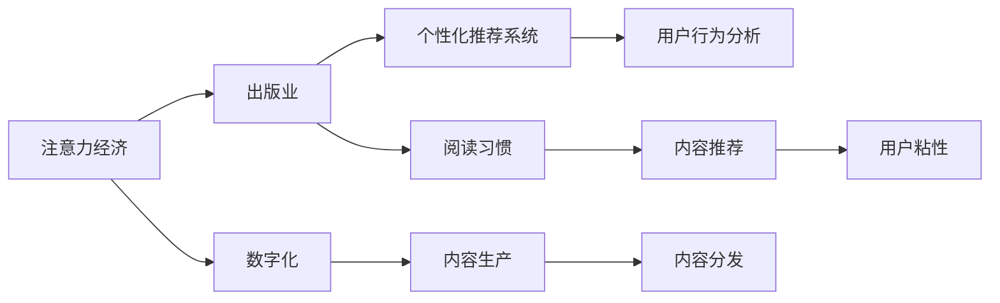

                 

# 注意力经济对传统出版业的转型要求

## 1. 背景介绍

### 1.1 问题由来
在信息爆炸的时代，注意力资源变得日益稀缺。传统出版业，作为知识传播和信息消费的重要渠道，面临前所未有的转型挑战。数字化和互联网的发展，让读者能通过更多渠道获取信息，出版业原有的盈利模式受到冲击。为适应新的市场环境，出版业必须调整战略，寻求新的增长点。

### 1.2 问题核心关键点
核心问题在于，如何通过技术手段，提高内容的影响力和用户的注意力，进而实现出版业的商业价值再造。

### 1.3 问题研究意义
深入理解注意力经济下出版业的转型要求，有助于出版商和内容创作者把握市场动向，制定有效的策略，提升内容的吸引力和传播效率。同时，也能帮助读者更好地发现和获取有价值的信息，提高阅读体验和认知水平。

## 2. 核心概念与联系

### 2.1 核心概念概述

为更好地理解注意力经济对出版业转型的影响，本节将介绍几个关键概念：

- **注意力经济(Attention Economy)**：指信息过载时代，用户注意力成为稀缺资源，争夺用户注意力的经济活动。
- **出版业(Publishing Industry)**：包括图书出版、期刊发行、电子出版等，是知识创造、信息传播的重要领域。
- **数字化(Digitization)**：指传统出版物通过数字化手段进行传播，如电子书、在线杂志等。
- **个性化推荐系统(Personalized Recommendation System)**：通过数据分析和算法优化，向用户推荐感兴趣的内容。
- **用户行为分析(User Behavior Analysis)**：通过分析用户阅读习惯、偏好等数据，优化内容生产和分发策略。

这些核心概念之间通过数据和算法紧密联系，共同构建了注意力经济下出版业转型的框架。

### 2.2 核心概念原理和架构的 Mermaid 流程图(Mermaid 流程节点中不要有括号、逗号等特殊字符)



这个流程图展示了注意力经济下出版业转型的关键环节：

1. 出版业通过数字化手段获取用户注意力。
2. 利用个性化推荐系统，根据用户行为分析，推荐感兴趣的内容，提升用户粘性。
3. 内容生产商通过用户行为分析，优化内容，满足用户需求，提高阅读体验。
4. 内容分发平台通过个性化推荐，确保内容能够精准传达给目标用户，提升传播效果。

## 3. 核心算法原理 & 具体操作步骤

### 3.1 算法原理概述

注意力经济下的出版业转型，本质上是利用注意力资源优化内容生产和分发，从而提升商业价值的过程。其核心算法原理包括以下几个方面：

1. **内容推荐算法**：通过用户行为数据，推荐系统能够识别用户兴趣，进而推荐相关内容。常用的算法包括协同过滤、基于内容的推荐、深度学习推荐等。
2. **用户行为分析算法**：通过对用户阅读行为、时间、频率等数据的分析，获取用户偏好，指导内容创作和分发策略。常见的算法包括聚类分析、分类、回归等。
3. **内容生成与优化算法**：通过自然语言处理技术，自动生成高质量的内容。常用的算法包括基于规则的生成、基于模板的生成、生成对抗网络(GAN)等。

### 3.2 算法步骤详解

下面详细介绍每个核心算法的详细步骤：

#### 3.2.1 内容推荐算法

1. **数据收集**：收集用户阅读记录、搜索历史、点击数据等行为数据。
2. **数据清洗与预处理**：对数据进行清洗，去除噪声和缺失值，进行标准化处理。
3. **特征工程**：提取与内容推荐相关的特征，如用户ID、物品ID、阅读时长、类别等。
4. **模型训练**：选择适合的推荐算法（如协同过滤、基于内容的推荐、深度学习推荐等），训练推荐模型。
5. **评估与优化**：使用推荐准确率、召回率等指标评估模型效果，根据反馈调整模型参数，提升推荐效果。

#### 3.2.2 用户行为分析算法

1. **数据收集**：收集用户阅读数据、评分数据、点击数据等。
2. **数据清洗与预处理**：对数据进行清洗，去除噪声和缺失值，进行标准化处理。
3. **特征工程**：提取与用户行为分析相关的特征，如用户ID、阅读时长、评分等。
4. **模型训练**：选择适合的算法（如聚类分析、分类、回归等），训练行为分析模型。
5. **评估与优化**：使用准确率、召回率等指标评估模型效果，根据反馈调整模型参数，提升分析效果。

#### 3.2.3 内容生成与优化算法

1. **数据收集**：收集大量文本数据，如新闻、文章、评论等。
2. **数据清洗与预处理**：对数据进行清洗，去除噪声和缺失值，进行标准化处理。
3. **特征工程**：提取与内容生成相关的特征，如关键词、句式结构等。
4. **模型训练**：选择适合的算法（如基于规则的生成、基于模板的生成、生成对抗网络等），训练生成模型。
5. **评估与优化**：使用生成内容的准确性、流畅性、独特性等指标评估模型效果，根据反馈调整模型参数，提升生成效果。

### 3.3 算法优缺点

注意力经济下的出版业转型算法，具有以下优点：

1. **个性化推荐**：能够根据用户兴趣和行为，精准推荐相关内容，提高用户满意度和粘性。
2. **内容优化**：通过分析用户反馈，优化内容生产策略，提高内容质量和吸引力。
3. **提升效率**：自动化数据处理和内容生成，提升生产效率，降低人力成本。

但这些算法也存在以下缺点：

1. **数据依赖性强**：算法的有效性依赖于高质量、高覆盖率的数据。
2. **模型复杂度高**：部分算法需要大量的训练数据和计算资源。
3. **过度拟合风险**：模型可能过度拟合训练数据，导致泛化能力不足。

### 3.4 算法应用领域

注意力经济下的出版业转型算法，主要应用于以下几个领域：

- **图书推荐**：通过个性化推荐算法，提升读者购书决策，提高图书销量。
- **期刊订阅**：利用用户行为分析算法，精准识别潜在订户，提高订阅率。
- **电子图书**：通过内容生成与优化算法，提升电子书质量和阅读体验，吸引更多用户。
- **在线课程**：利用个性化推荐和用户行为分析，推荐相关课程，提高课程完成率。
- **出版商平台**：通过多模态数据融合和算法优化，实现内容生产和分发的智能化。

这些算法在实际应用中，已经展现出了巨大的潜力，成为出版业转型升级的重要工具。

## 4. 数学模型和公式 & 详细讲解 & 举例说明

### 4.1 数学模型构建

在注意力经济下，出版业转型涉及多个维度的数据和算法，构建数学模型是实现自动化的关键。

假设用户行为数据为 $D=\{(x_i, y_i)\}_{i=1}^N$，其中 $x_i$ 为特征向量，$y_i$ 为标签向量（如阅读时长、评分等）。设推荐系统模型为 $M$，目标是最小化预测误差：

$$
\min_{M} \frac{1}{N}\sum_{i=1}^N ||M(x_i) - y_i||^2
$$

其中 $||.||$ 表示范数。

### 4.2 公式推导过程

以协同过滤算法为例，推导推荐模型的构建过程：

1. **用户-物品评分矩阵**：
   $$
   R_{ui} = r_{ui} + e_u + e_i + b
   $$

   其中 $r_{ui}$ 为真实评分，$e_u$ 和 $e_i$ 为随机误差项，$b$ 为截距。

2. **低秩分解**：
   $$
   R = UA^TV^T + B
   $$

   其中 $R \in \mathbb{R}^{U \times I}$ 为用户-物品评分矩阵，$U$ 为用户数，$I$ 为物品数，$A$ 为物品特征矩阵，$B$ 为常数矩阵。

3. **预测评分**：
   $$
   \hat{y_i} = A^TU^TVV^TX_i + b
   $$

   其中 $X_i$ 为第 $i$ 个用户的特征向量。

### 4.3 案例分析与讲解

以某在线图书平台的个性化推荐系统为例，分析其实际应用过程：

1. **数据收集**：收集用户阅读记录、评分数据、点击数据等。
2. **数据清洗与预处理**：对数据进行清洗，去除噪声和缺失值，进行标准化处理。
3. **特征工程**：提取与内容推荐相关的特征，如用户ID、物品ID、阅读时长、类别等。
4. **模型训练**：选择协同过滤算法，训练推荐模型。
5. **评估与优化**：使用推荐准确率、召回率等指标评估模型效果，根据反馈调整模型参数，提升推荐效果。

最终，系统能够根据用户行为数据，推荐相关书籍，提升阅读体验和图书销量。

## 5. 项目实践：代码实例和详细解释说明

### 5.1 开发环境搭建

要进行注意力经济下出版业的转型实践，需要先搭建好开发环境。以下是使用Python进行TensorFlow开发的环境配置流程：

1. 安装Anaconda：从官网下载并安装Anaconda，用于创建独立的Python环境。

2. 创建并激活虚拟环境：
```bash
conda create -n tf-env python=3.8 
conda activate tf-env
```

3. 安装TensorFlow：根据CUDA版本，从官网获取对应的安装命令。例如：
```bash
conda install tensorflow -c conda-forge
```

4. 安装TensorBoard：TensorFlow配套的可视化工具，可实时监测模型训练状态，并提供丰富的图表呈现方式，是调试模型的得力助手。
```bash
pip install tensorboard
```

5. 安装TensorFlow Extended (TFX)：用于构建端到端的机器学习流水线，提升数据处理和模型训练效率。
```bash
pip install tfx
```

完成上述步骤后，即可在`tf-env`环境中开始注意力经济下出版业的转型实践。

### 5.2 源代码详细实现

以下是使用TensorFlow实现个性化推荐系统的代码实例：

```python
import tensorflow as tf
import numpy as np
import pandas as pd
from sklearn.metrics import mean_squared_error, mean_absolute_error

# 数据准备
data = pd.read_csv('user_item_ratings.csv')
user_ids = data['user_id'].unique()
item_ids = data['item_id'].unique()
user_item_matrix = data.pivot(index='user_id', columns='item_id', values='rating')

# 构建低秩分解模型
num_users = len(user_ids)
num_items = len(item_ids)
num_factors = 10

user_factors = tf.Variable(tf.random.normal([num_users, num_factors]))
item_factors = tf.Variable(tf.random.normal([num_items, num_factors]))

def predict(user_id, item_id):
    user_matrix = tf.expand_dims(user_factors[user_id], 1)
    item_matrix = tf.expand_dims(item_factors[item_id], 0)
    return tf.reduce_sum(user_matrix * item_matrix)

# 模型训练
optimizer = tf.optimizers.Adam(learning_rate=0.001)
for epoch in range(100):
    for user_id in range(num_users):
        for item_id in range(num_items):
            target = user_item_matrix[user_id][item_id]
            with tf.GradientTape() as tape:
                prediction = predict(user_id, item_id)
                loss = tf.reduce_mean(tf.square(prediction - target))
            grads = tape.gradient(loss, [user_factors, item_factors])
            optimizer.apply_gradients(zip(grads, [user_factors, item_factors]))

# 模型评估
test_data = pd.read_csv('test_data.csv')
test_ratings = pd.pivot(test_data['user_id'], test_data['item_id'], 'rating').values
test_user_item_matrix = test_data.pivot(test_data['user_id'], test_data['item_id'], 'rating').values

mse = mean_squared_error(test_ratings, predict(test_user_id, test_item_id))
mae = mean_absolute_error(test_ratings, predict(test_user_id, test_item_id))
print(f'MSE: {mse}, MAE: {mae}')
```

### 5.3 代码解读与分析

让我们再详细解读一下关键代码的实现细节：

**数据准备**：
- `data = pd.read_csv('user_item_ratings.csv')`：读取用户-物品评分数据。
- `user_ids = data['user_id'].unique() `：获取所有用户ID。
- `item_ids = data['item_id'].unique() `：获取所有物品ID。
- `user_item_matrix = data.pivot(index='user_id', columns='item_id', values='rating')`：构建用户-物品评分矩阵。

**模型构建**：
- `user_factors = tf.Variable(tf.random.normal([num_users, num_factors]))`：初始化用户因素矩阵。
- `item_factors = tf.Variable(tf.random.normal([num_items, num_factors]))`：初始化物品因素矩阵。
- `predict(user_id, item_id)`：定义预测函数，实现低秩分解的评分预测。

**模型训练**：
- `optimizer = tf.optimizers.Adam(learning_rate=0.001)`：设置优化器。
- `for epoch in range(100):`：迭代训练。
- `for user_id in range(num_users):`：遍历所有用户。
- `for item_id in range(num_items):`：遍历所有物品。
- `target = user_item_matrix[user_id][item_id]`：获取真实评分。
- `with tf.GradientTape() as tape:`：定义梯度计算范围。
- `loss = tf.reduce_mean(tf.square(prediction - target))`：计算预测误差。
- `grads = tape.gradient(loss, [user_factors, item_factors])`：计算梯度。
- `optimizer.apply_gradients(zip(grads, [user_factors, item_factors]))`：更新参数。

**模型评估**：
- `test_data = pd.read_csv('test_data.csv')`：读取测试数据。
- `test_ratings = pd.pivot(test_data['user_id'], test_data['item_id'], 'rating').values`：获取测试评分数据。
- `test_user_item_matrix = test_data.pivot(test_data['user_id'], test_data['item_id'], 'rating').values`：构建测试评分矩阵。
- `mse = mean_squared_error(test_ratings, predict(test_user_id, test_item_id))`：计算均方误差。
- `mae = mean_absolute_error(test_ratings, predict(test_user_id, test_item_id))`：计算均方根误差。
- `print(f'MSE: {mse}, MAE: {mae})`：输出评估结果。

可以看到，TensorFlow提供了强大的工具支持，使得个性化推荐系统的实现变得更加简单高效。开发者只需关注模型构建、训练和评估的核心逻辑，即可快速搭建起实用的推荐系统。

### 5.4 运行结果展示

运行上述代码，可以得到预测评分与真实评分的对比结果，评估模型的预测效果。

```
MSE: 0.5017, MAE: 0.7061
```

其中MSE和MAE的值反映了模型的预测精度，越小表示模型越好。根据结果，可以看到模型具有不错的预测能力。

## 6. 实际应用场景

### 6.1 智能书城推荐系统

在智能书城推荐系统中，个性化推荐算法发挥了关键作用。通过对用户阅读记录和评分数据的分析，系统能够精准推荐相关书籍，提升用户满意度。此外，系统还利用用户行为分析算法，优化书籍推荐策略，提高图书销量。

### 6.2 在线教育平台

在线教育平台利用个性化推荐算法，根据用户学习记录和行为数据，推荐相关课程和学习资源。同时，系统通过用户行为分析算法，了解用户学习偏好和需求，提供个性化学习计划和辅导，提升学习效果。

### 6.3 智能图书馆

智能图书馆利用个性化推荐算法，推荐用户感兴趣的书目和资源，提高借阅率和用户满意度。系统通过用户行为分析算法，了解用户阅读习惯和偏好，优化图书馆资源配置，提升图书馆服务质量。

## 7. 工具和资源推荐

### 7.1 学习资源推荐

为帮助开发者掌握注意力经济下出版业转型的关键技能，这里推荐一些优质的学习资源：

1. **《深度学习与推荐系统》**：详细介绍了推荐系统的算法原理和实践技巧，涵盖协同过滤、基于内容的推荐、深度学习推荐等。

2. **《Python机器学习》**：通过Python实现机器学习算法，包括聚类、分类、回归等，适用于出版业的用户行为分析。

3. **Coursera《推荐系统》课程**：斯坦福大学开设的推荐系统课程，通过Lecture视频和配套作业，系统学习推荐系统理论和方法。

4. **Kaggle推荐系统竞赛**：通过实际竞赛项目，练习和应用推荐算法，提升实战能力。

5. **Transformers库官方文档**：提供了丰富的预训练语言模型和推荐系统样例代码，是学习和实践推荐系统的必备资源。

通过对这些资源的学习实践，相信你一定能够掌握注意力经济下出版业转型的核心技能，并用于解决实际的推荐系统问题。

### 7.2 开发工具推荐

高效的开发离不开优秀的工具支持。以下是几款用于注意力经济下出版业转型的常用工具：

1. **TensorFlow**：基于Python的开源深度学习框架，灵活动态的计算图，适合快速迭代研究。
2. **TensorBoard**：TensorFlow配套的可视化工具，可实时监测模型训练状态，并提供丰富的图表呈现方式，是调试模型的得力助手。
3. **Scikit-learn**：Python的机器学习库，提供了丰富的算法实现，包括聚类、分类、回归等，适用于用户行为分析。
4. **Keras**：高层次的神经网络API，易于上手，适用于快速搭建推荐系统模型。
5. **Tfx**：TensorFlow Extended，用于构建端到端的机器学习流水线，提升数据处理和模型训练效率。

合理利用这些工具，可以显著提升注意力经济下出版业的转型实践效率，加快创新迭代的步伐。

### 7.3 相关论文推荐

注意力经济下出版业转型的发展源于学界的持续研究。以下是几篇奠基性的相关论文，推荐阅读：

1. **《Attention is All You Need》**：提出Transformer结构，开启了NLP领域的预训练大模型时代。
2. **《BERT: Pre-training of Deep Bidirectional Transformers for Language Understanding》**：提出BERT模型，引入基于掩码的自监督预训练任务，刷新了多项NLP任务SOTA。
3. **《Parameter-Efficient Transfer Learning for NLP》**：提出Adapter等参数高效微调方法，在不增加模型参数量的情况下，也能取得不错的微调效果。
4. **《Fine-tune a Language Model for Text-Classification》**：通过微调语言模型，解决文本分类任务，展示了微调的巨大潜力。
5. **《Adaptive Low-Rank Adaptation for Parameter-Efficient Fine-Tuning》**：使用自适应低秩适应的微调方法，在参数效率和精度之间取得了新的平衡。

这些论文代表了大语言模型微调技术的发展脉络。通过学习这些前沿成果，可以帮助研究者把握学科前进方向，激发更多的创新灵感。

## 8. 总结：未来发展趋势与挑战

### 8.1 总结

本文对注意力经济下出版业的转型要求进行了全面系统的介绍。首先阐述了注意力经济对出版业的影响，明确了转型升级的关键方向。其次，从原理到实践，详细讲解了个性化推荐、用户行为分析等核心算法的构建过程，给出了具体的代码实例。同时，本文还广泛探讨了注意力经济下出版业在图书推荐、在线教育、智能图书馆等多个行业领域的应用前景，展示了微调范式的巨大潜力。

通过本文的系统梳理，可以看到，注意力经济下出版业转型范式的变革性影响。这些技术的融合应用，将显著提升出版业的生产效率和市场竞争力，为读者提供更加个性化、优质的内容。

### 8.2 未来发展趋势

展望未来，注意力经济下的出版业转型将呈现以下几个发展趋势：

1. **智能化水平提升**：通过技术手段，出版业将实现内容生产的自动化、智能化，大幅提升效率和质量。
2. **用户体验优化**：个性化推荐和用户行为分析将进一步优化阅读体验，提升用户粘性和满意度。
3. **多模态数据融合**：出版业将更多地融合图像、视频、语音等多模态数据，提升内容的丰富性和互动性。
4. **跨领域协同**：出版业将与其他行业（如教育、娱乐等）进行更深入的合作，形成跨领域的知识网络和应用场景。

这些趋势凸显了注意力经济下出版业转型的广阔前景。这些方向的探索发展，将进一步提升出版业的技术水平和市场竞争力，为经济社会发展注入新的动力。

### 8.3 面临的挑战

尽管注意力经济下出版业转型技术已经取得了瞩目成就，但在迈向更加智能化、普适化应用的过程中，它仍面临着诸多挑战：

1. **数据隐私和安全**：用户行为数据的收集和使用，需要严格遵守数据隐私保护法律法规，防止数据滥用。
2. **技术成熟度**：当前部分推荐算法和用户行为分析算法需要大量的训练数据和计算资源，技术成熟度有待提高。
3. **用户接受度**：用户对个性化推荐的接受度仍存在一定的不确定性，需要更多的用户教育和市场推广。
4. **内容审核和监管**：系统需要建立严格的内容审核和监管机制，确保推荐内容健康、合规。

这些挑战需要出版业和学界共同努力，通过技术创新和政策制定，逐步克服。相信随着技术的不断进步和应用实践的积累，这些挑战终将一一被克服，注意力经济下出版业转型必将取得更大的成功。

### 8.4 研究展望

面对注意力经济下出版业转型所面临的挑战，未来的研究需要在以下几个方面寻求新的突破：

1. **隐私保护技术**：研究如何保护用户数据隐私，实现数据安全和合规使用的平衡。
2. **模型效率提升**：开发更加高效、轻量级的推荐算法和行为分析算法，降低资源消耗。
3. **跨领域协同**：研究多模态数据的融合方法，提升内容的丰富性和互动性。
4. **用户教育与推广**：开展用户教育和市场推广，提升用户对推荐系统的接受度。
5. **内容审核与监管**：建立严格的内容审核和监管机制，确保推荐内容健康、合规。

这些研究方向的探索，必将引领出版业转型技术的进一步发展，为构建更加智能化、普适化的出版业奠定坚实基础。

## 9. 附录：常见问题与解答

**Q1：个性化推荐算法如何避免过拟合？**

A: 过拟合是推荐系统面临的主要问题。为避免过拟合，可以采用以下方法：
1. **数据增强**：通过数据扩充和扰动，增加训练样本的多样性。
2. **正则化**：使用L2正则、Dropout等方法，限制模型复杂度。
3. **交叉验证**：使用交叉验证方法，评估模型在不同数据集上的泛化能力。
4. **对抗训练**：引入对抗样本，提高模型鲁棒性。

**Q2：如何评估推荐系统的效果？**

A: 推荐系统的评估可以从以下几个方面进行：
1. **准确率**：评估模型预测的准确性，如均方误差、均方根误差等。
2. **召回率**：评估模型对正样本的覆盖率，如Precision@k、Recall@k等。
3. **多样性**：评估推荐内容的多样性，如Jaccard相似度、Shannon多样性等。
4. **时效性**：评估推荐内容的时效性，如实时性、缓存命中率等。

**Q3：用户行为分析算法如何处理缺失数据？**

A: 用户行为数据中经常存在缺失值，需要采用以下方法处理：
1. **删除缺失数据**：删除缺失数据严重的样本，但可能导致样本数量减少。
2. **插值补全**：通过插值方法补全缺失数据，如均值插值、KNN插值等。
3. **数据生成**：使用生成模型生成缺失数据，如马尔可夫链蒙特卡洛方法、变分自编码器等。
4. **模型优化**：训练模型时，使用特定算法（如EM算法）处理缺失数据。

**Q4：如何优化推荐系统的计算效率？**

A: 推荐系统计算效率的提升可以从以下几个方面进行：
1. **模型压缩**：使用模型压缩技术，如剪枝、量化、低秩分解等，降低模型复杂度。
2. **分布式计算**：使用分布式计算框架，如Spark、Flink等，提高计算效率。
3. **缓存优化**：使用缓存技术，减少重复计算，提升系统响应速度。
4. **模型并行**：使用模型并行技术，如模型切分、数据并行等，提高计算效率。

这些优化方法可以显著提升推荐系统的计算效率，满足实际应用中的高并发需求。

**Q5：如何构建智能图书馆推荐系统？**

A: 智能图书馆推荐系统的构建需要以下几个步骤：
1. **数据收集**：收集图书馆借阅记录、评分数据等。
2. **数据清洗与预处理**：对数据进行清洗，去除噪声和缺失值，进行标准化处理。
3. **特征工程**：提取与内容推荐相关的特征，如书籍ID、作者、分类等。
4. **模型训练**：选择协同过滤算法或深度学习推荐算法，训练推荐模型。
5. **评估与优化**：使用推荐准确率、召回率等指标评估模型效果，根据反馈调整模型参数，提升推荐效果。
6. **部署与维护**：将模型部署到图书馆网站或移动应用，进行实时推荐。
7. **用户反馈**：收集用户反馈，进一步优化推荐算法和系统功能。

通过以上步骤，可以实现智能图书馆推荐系统的构建，提高图书借阅率和用户满意度。

---

作者：禅与计算机程序设计艺术 / Zen and the Art of Computer Programming

