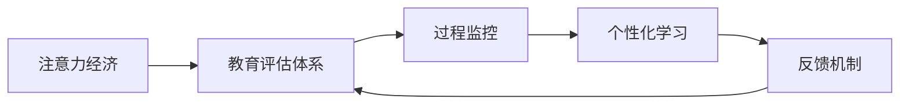

                 

# 注意力经济对传统教育评估体系的挑战

## 1. 背景介绍

### 1.1 问题由来

在互联网时代，注意力成为一种稀缺资源。对于企业和内容生产者而言，争夺用户的注意力至关重要。教育行业也不例外，其价值不仅在于知识的传授，更在于吸引并保持学生的注意力，提高学习效果和满意度。然而，传统的教育评估体系往往只关注学生的考试分数，忽视了注意力投入的评估。这种单一的评估标准难以全面反映学生的学习效果和能力，也无法引导教师和教育机构提供更具针对性的教学服务。

### 1.2 问题核心关键点

当前教育评估体系存在以下关键问题：
1. **评估标准单一**：以考试分数为唯一衡量标准，忽视学生的其他能力和表现。
2. **缺乏过程监控**：无法实时监控学生的注意力和学习状态，难以在关键时刻进行干预。
3. **忽视个性化需求**：未能根据学生的个性化需求进行差异化教学和评估。
4. **反馈延迟**：评估结果反馈周期长，不利于及时调整教学策略。

这些问题使得传统教育评估体系难以适应当前教育环境的快速变化和需求，亟需改进和创新。

## 2. 核心概念与联系

### 2.1 核心概念概述

为深入理解注意力经济对教育评估体系的影响，本节将介绍几个关键概念及其相互联系：

- **注意力经济(Attention Economy)**：在互联网时代，注意力作为一种资源，其价值日益凸显。企业通过各种方式吸引用户的注意力，以实现商业价值。
- **教育评估体系(Education Evaluation System)**：用于衡量教育效果和教育质量的标准化评估机制，包括教学效果评估、学生表现评估等。
- **个性化学习(Individualized Learning)**：根据学生的兴趣、能力和需求，提供定制化的教学内容和路径，满足学生的个性化需求。
- **过程监控(Process Monitoring)**：通过实时监控学生的学习状态和注意力投入，及时发现并解决问题，提升学习效果。
- **反馈机制(Feedback Mechanism)**：提供及时有效的评估反馈，帮助学生和教师调整教学策略，优化学习过程。

这些概念通过以下Mermaid流程图连接起来，展示了注意力经济对教育评估体系的影响路径：



该流程图展示了注意力经济如何通过影响教育评估体系，进一步促进个性化学习和过程监控，形成良性的教育反馈循环。

## 3. 核心算法原理 & 具体操作步骤
### 3.1 算法原理概述

注意力经济在教育评估体系中的应用，主要体现在以下几个方面：

1. **个性化学习路径设计**：通过监控学生的注意力投入和学习表现，设计个性化的学习路径，提升学习效果。
2. **动态调整教学策略**：根据学生的学习状态和注意力反馈，实时调整教学内容和难度，提高教学效率。
3. **综合评估学生能力**：除了考试分数外，还考虑学生的注意力投入、参与度、创新能力等多方面表现，进行综合评估。
4. **优化教学资源配置**：通过数据分析，合理配置教学资源，确保资源的高效利用和优质输出。

### 3.2 算法步骤详解

以下是实现注意力经济在教育评估体系中应用的详细步骤：

1. **数据收集与处理**：
   - 收集学生的学习行为数据，包括点击次数、停留时间、完成情况等。
   - 处理数据，计算学生对不同内容、不同形式的注意力投入情况。

2. **模型训练与优化**：
   - 选择或设计合适的模型，如深度神经网络、支持向量机等，对注意力投入数据进行训练。
   - 优化模型参数，确保模型能够准确预测学生的注意力状态。

3. **个性化学习路径设计**：
   - 根据学生的注意力投入情况，设计个性化的学习路径和推荐内容。
   - 实时监控学生的学习进度和效果，动态调整学习路径。

4. **教学策略调整**：
   - 根据学生的注意力反馈，调整教学内容、教学方法和难度，提高教学效果。
   - 实时反馈调整策略的效果，进行动态优化。

5. **综合评估学生能力**：
   - 综合考试分数、注意力投入、参与度、创新能力等多方面表现，进行综合评估。
   - 提供个性化的评估报告，帮助学生和教师进行反思和改进。

### 3.3 算法优缺点

基于注意力经济的教育评估体系，具有以下优点：
1. **个性化需求满足**：能够根据学生的个性化需求提供定制化的学习路径和内容，提升学习效果。
2. **实时监控与反馈**：能够实时监控学生的注意力和学习状态，及时进行干预和调整，提升学习效率。
3. **综合评估能力**：综合考虑多方面表现，提供更加全面、客观的评估结果，引导教师和学生改进。

同时，该方法也存在一些局限性：
1. **数据隐私和安全**：学生学习行为的监控需要收集大量数据，可能引发隐私和安全问题。
2. **技术门槛较高**：需要先进的数据处理和机器学习技术，对教育机构的技术能力要求较高。
3. **数据质量依赖**：数据收集和处理的准确性直接影响评估结果，需要确保数据质量。

### 3.4 算法应用领域

注意力经济在教育评估体系中的应用，主要涵盖以下几个领域：

1. **K-12教育**：帮助学校设计个性化的课程和学习路径，提升学生的学习效果。
2. **高等教育**：通过监控学生的注意力投入，优化教学内容和方法，提高课堂效率。
3. **职业培训**：根据学员的学习行为，提供个性化的培训方案，提升培训效果。
4. **终身学习**：帮助成人学习者制定个性化的学习计划，提高学习动力和效果。

## 4. 数学模型和公式 & 详细讲解 & 举例说明
### 4.1 数学模型构建

本节将使用数学语言对注意力经济在教育评估体系中的应用进行严格刻画。

设学生的注意力投入向量为 $\mathbf{a} = [a_1, a_2, ..., a_n]$，其中 $a_i$ 表示学生在第 $i$ 个学习内容上的注意力投入。定义注意力投入的阈值向量为 $\mathbf{b} = [b_1, b_2, ..., b_n]$，其中 $b_i$ 表示学生在第 $i$ 个学习内容上的注意力投入阈值。

基于上述向量，构建注意力投入的评分函数：

$$
f(\mathbf{a}, \mathbf{b}) = \frac{\sum_{i=1}^n a_i \times b_i}{\sum_{i=1}^n b_i}
$$

该函数计算学生在每个学习内容上的注意力投入与阈值的匹配程度，得分越高，表示学生的注意力投入越符合期望。

### 4.2 公式推导过程

对于具体的评估过程，假设学生对每个学习内容的注意力投入数据已经收集完毕，且已建立评分函数 $f(\mathbf{a}, \mathbf{b})$。下面推导如何根据注意力投入数据和阈值向量，计算学生的注意力投入评分：

1. 计算学生对每个学习内容的注意力投入与阈值的匹配度得分：
$$
s_i = a_i \times b_i
$$

2. 计算所有学习内容的总匹配度得分：
$$
S = \sum_{i=1}^n s_i
$$

3. 计算总阈值得分：
$$
T = \sum_{i=1}^n b_i
$$

4. 计算注意力投入评分：
$$
\text{Attention Score} = \frac{S}{T}
$$

### 4.3 案例分析与讲解

假设某学生的注意力投入数据为 $[0.8, 0.7, 0.9, 0.6, 0.5]$，注意力投入阈值向量为 $[0.5, 0.5, 0.5, 0.5, 0.5]$。根据上述评分函数计算该学生的注意力投入评分：

1. 计算每个学习内容的匹配度得分：
$$
s_1 = 0.8 \times 0.5 = 0.4, \quad s_2 = 0.7 \times 0.5 = 0.35, \quad s_3 = 0.9 \times 0.5 = 0.45, \quad s_4 = 0.6 \times 0.5 = 0.3, \quad s_5 = 0.5 \times 0.5 = 0.25
$$

2. 计算总匹配度得分：
$$
S = 0.4 + 0.35 + 0.45 + 0.3 + 0.25 = 1.85
$$

3. 计算总阈值得分：
$$
T = 0.5 + 0.5 + 0.5 + 0.5 + 0.5 = 2.5
$$

4. 计算注意力投入评分：
$$
\text{Attention Score} = \frac{1.85}{2.5} = 0.74
$$

因此，该学生的注意力投入评分为 $0.74$，表示其对学习内容的注意力投入整体符合期望。

## 5. 项目实践：代码实例和详细解释说明
### 5.1 开发环境搭建

在进行注意力经济在教育评估体系中的应用实践前，我们需要准备好开发环境。以下是使用Python进行PyTorch开发的环境配置流程：

1. 安装Anaconda：从官网下载并安装Anaconda，用于创建独立的Python环境。

2. 创建并激活虚拟环境：
```bash
conda create -n attention-env python=3.8 
conda activate attention-env
```

3. 安装PyTorch：根据CUDA版本，从官网获取对应的安装命令。例如：
```bash
conda install pytorch torchvision torchaudio cudatoolkit=11.1 -c pytorch -c conda-forge
```

4. 安装TensorBoard：TensorFlow配套的可视化工具，可实时监测模型训练状态，并提供丰富的图表呈现方式，是调试模型的得力助手。

5. 安装sklearn：用于数据处理和模型评估。

```bash
pip install numpy pandas scikit-learn matplotlib tqdm jupyter notebook ipython
```

完成上述步骤后，即可在`attention-env`环境中开始项目实践。

### 5.2 源代码详细实现

下面以计算学生注意力投入评分的代码为例，给出完整的Python实现。

```python
import numpy as np

# 注意力投入数据
attention_scores = np.array([0.8, 0.7, 0.9, 0.6, 0.5])
# 注意力投入阈值
thresholds = np.array([0.5, 0.5, 0.5, 0.5, 0.5])

# 计算每个学习内容的匹配度得分
match_scores = attention_scores * thresholds

# 计算总匹配度得分
total_match_score = np.sum(match_scores)

# 计算总阈值得分
total_thresholds = np.sum(thresholds)

# 计算注意力投入评分
attention_score = total_match_score / total_thresholds

print(f"Attention Score: {attention_score}")
```

### 5.3 代码解读与分析

让我们再详细解读一下关键代码的实现细节：

**计算注意力投入评分函数**：
- 定义学生注意力投入数据和阈值向量。
- 计算每个学习内容的匹配度得分，即注意力投入与阈值的乘积。
- 计算总匹配度得分和总阈值得分。
- 计算学生的注意力投入评分，即总匹配度得分除以总阈值得分。

**输出注意力投入评分**：
- 通过格式化字符串输出计算结果，便于查看。

可以看到，通过简单的数学计算，即可得到学生的注意力投入评分，直观反映其学习效果。

## 6. 实际应用场景
### 6.1 个性化学习路径设计

在K-12教育中，学生的学习兴趣和能力各不相同，传统的统一教学模式难以满足个性化需求。引入注意力经济的概念，通过监控学生的注意力投入和学习效果，可以设计个性化的学习路径，提高学习效果。

具体实现如下：
1. **数据收集**：通过学习管理系统(LMS)、在线课程平台等，收集学生的学习行为数据，包括点击次数、观看时长、完成情况等。
2. **数据处理**：对数据进行预处理，计算学生的注意力投入情况。
3. **模型训练**：选择或设计合适的模型，对注意力投入数据进行训练，建立评分函数。
4. **个性化学习路径设计**：根据学生的注意力投入评分，设计个性化的学习路径和推荐内容。
5. **实时监控与调整**：实时监控学生的学习进度和效果，动态调整学习路径，优化学习效果。

### 6.2 教学策略动态调整

在大学课程中，教师需要根据学生的学习状态和注意力反馈，实时调整教学内容和方法，提高课堂效率。引入注意力经济的概念，可以帮助教师更好地掌握学生的学习状态，进行动态调整。

具体实现如下：
1. **数据收集**：通过学习管理系统(LMS)、在线测试平台等，收集学生的学习行为数据。
2. **数据处理**：对数据进行预处理，计算学生的注意力投入情况。
3. **模型训练**：选择或设计合适的模型，对注意力投入数据进行训练，建立评分函数。
4. **教学策略调整**：根据学生的注意力投入评分，调整教学内容、教学方法和难度，提升课堂效率。
5. **实时反馈与优化**：实时反馈调整策略的效果，进行动态优化，确保教学质量。

### 6.3 综合评估学生能力

在职业培训中，学生的学习效果和能力需要综合评估，而不仅仅是考试分数。引入注意力经济的概念，可以帮助培训机构全面评估学生的多方面表现。

具体实现如下：
1. **数据收集**：通过在线学习平台、职业技能测试等，收集学生的学习行为数据。
2. **数据处理**：对数据进行预处理，计算学生的注意力投入情况。
3. **模型训练**：选择或设计合适的模型，对注意力投入数据进行训练，建立评分函数。
4. **综合评估学生能力**：综合考试分数、注意力投入、参与度、创新能力等多方面表现，进行综合评估。
5. **个性化评估报告**：提供个性化的评估报告，帮助学生和教师进行反思和改进。

## 7. 工具和资源推荐
### 7.1 学习资源推荐

为了帮助开发者系统掌握注意力经济在教育评估体系中的应用，这里推荐一些优质的学习资源：

1. 《个性化学习与智能教育》系列博文：由教育技术专家撰写，深入浅出地介绍了个性化学习的基本概念和实现方法。

2. 《深度学习在教育中的应用》课程：由斯坦福大学等知名高校开设的在线课程，介绍了深度学习在教育评估和个性化学习中的应用。

3. 《教育数据分析与模型评估》书籍：系统介绍了教育数据分析的基本方法，包括数据处理、模型训练和评估等。

4. HuggingFace官方文档：提供了丰富的自然语言处理模型和应用示例，包括基于注意力机制的模型。

5. CLUE开源项目：中文语言理解测评基准，涵盖大量不同类型的中文NLP数据集，并提供了基于注意力机制的评估模型。

通过对这些资源的学习实践，相信你一定能够快速掌握注意力经济在教育评估体系中的应用精髓，并用于解决实际的NLP问题。

### 7.2 开发工具推荐

高效的开发离不开优秀的工具支持。以下是几款用于注意力经济在教育评估体系中应用的常用工具：

1. PyTorch：基于Python的开源深度学习框架，灵活动态的计算图，适合快速迭代研究。

2. TensorFlow：由Google主导开发的开源深度学习框架，生产部署方便，适合大规模工程应用。

3. Weights & Biases：模型训练的实验跟踪工具，可以记录和可视化模型训练过程中的各项指标，方便对比和调优。

4. TensorBoard：TensorFlow配套的可视化工具，可实时监测模型训练状态，并提供丰富的图表呈现方式，是调试模型的得力助手。

5. Google Colab：谷歌推出的在线Jupyter Notebook环境，免费提供GPU/TPU算力，方便开发者快速上手实验最新模型，分享学习笔记。

合理利用这些工具，可以显著提升注意力经济在教育评估体系中应用的开发效率，加快创新迭代的步伐。

### 7.3 相关论文推荐

注意力经济在教育评估体系中的应用源于学界的持续研究。以下是几篇奠基性的相关论文，推荐阅读：

1. 《个性化学习路径设计》：介绍基于注意力机制的个性化学习路径设计方法。

2. 《基于注意力机制的教学策略调整》：探讨如何通过监控学生的注意力投入，动态调整教学策略。

3. 《综合评估学生能力的模型》：提出基于注意力机制的综合评估模型，综合考虑多方面表现。

4. 《深度学习在教育中的应用》：综述了深度学习在教育评估和个性化学习中的应用。

5. 《教育数据分析与模型评估》：系统介绍了教育数据分析的基本方法，包括数据处理、模型训练和评估等。

这些论文代表了大语言模型微调技术的发展脉络。通过学习这些前沿成果，可以帮助研究者把握学科前进方向，激发更多的创新灵感。

## 8. 总结：未来发展趋势与挑战
### 8.1 总结

本文对注意力经济在教育评估体系中的应用进行了全面系统的介绍。首先阐述了注意力经济对教育评估体系的影响，明确了个性化学习、过程监控、综合评估等关键概念及其联系。其次，从原理到实践，详细讲解了注意力经济在教育评估体系中的数学模型和实现步骤，给出了注意力投入评分的计算方法。同时，本文还探讨了注意力经济在K-12教育、高等教育、职业培训等实际应用场景中的具体应用，展示了其广阔的应用前景。最后，本文精选了注意力经济在教育评估体系中的学习资源、开发工具和相关论文，力求为读者提供全方位的技术指引。

通过本文的系统梳理，可以看到，注意力经济在教育评估体系中的应用为个性化学习、过程监控和综合评估提供了新的思路和方法。这些创新的评估手段，有望在未来的教育体系中得到广泛应用，推动教育技术的发展和创新。

### 8.2 未来发展趋势

展望未来，注意力经济在教育评估体系中的应用将呈现以下几个发展趋势：

1. **多模态注意力机制**：将视觉、听觉等多种模态信息融入注意力计算，提升对学生多维度表现的评估能力。
2. **自适应学习路径**：根据学生的学习状态和反馈，实时调整学习内容和路径，提高学习效果。
3. **智能教育平台**：构建集学习、评估、反馈于一体的智能教育平台，提供个性化、全方位的教育服务。
4. **大数据分析**：利用大数据技术，进行深度分析，提供更加科学、精准的教育评估。
5. **伦理和安全保障**：重视学生隐私和数据安全，建立完善的伦理和安全保障机制。

以上趋势凸显了注意力经济在教育评估体系中的广阔前景。这些方向的探索发展，必将进一步提升教育技术的智能化水平，推动教育公平和效率的提升。

### 8.3 面临的挑战

尽管注意力经济在教育评估体系中的应用已经展现出巨大的潜力，但在迈向更加智能化、普适化应用的过程中，仍面临诸多挑战：

1. **数据隐私和安全**：学生学习行为的监控需要收集大量数据，可能引发隐私和安全问题。如何保障数据安全和隐私，是重要的问题。
2. **技术门槛较高**：需要先进的数据处理和机器学习技术，对教育机构的技术能力要求较高。
3. **数据质量依赖**：数据收集和处理的准确性直接影响评估结果，需要确保数据质量。
4. **伦理和安全问题**：需要建立完善的伦理和安全保障机制，确保系统应用的公正性和安全性。

面对这些挑战，未来的研究需要在以下几个方面寻求新的突破：

1. **隐私保护技术**：开发隐私保护技术，如差分隐私、联邦学习等，确保学生数据的安全性和隐私性。
2. **模型优化和集成**：开发高效的模型优化和集成方法，降低技术门槛，提升系统的稳定性和可用性。
3. **数据治理框架**：建立数据治理框架，确保数据质量和安全，避免数据偏见和歧视。
4. **伦理和法律规范**：制定和实施伦理和法律规范，确保系统应用的公正性和安全性。

这些研究方向的探索，必将引领注意力经济在教育评估体系中的应用走向成熟，为构建更加智能化、普适化的教育系统铺平道路。

### 8.4 研究展望

面对未来教育技术的发展趋势和挑战，未来的研究需要在以下几个方面寻求新的突破：

1. **教育数据分析与模型评估**：深入研究教育数据分析方法，开发更加科学、精准的教育评估模型。
2. **多模态注意力机制**：结合多种模态数据，提升对学生多维度表现的评估能力。
3. **智能教育平台**：构建集学习、评估、反馈于一体的智能教育平台，提供个性化、全方位的教育服务。
4. **隐私保护与伦理规范**：重视学生隐私和数据安全，建立完善的隐私保护和伦理规范机制。
5. **持续学习和自适应**：实现持续学习和自适应，使系统能够动态更新和优化，适应教育环境的快速变化。

这些研究方向将为注意力经济在教育评估体系中的应用提供新的思路和方法，推动教育技术的不断创新和发展。

## 9. 附录：常见问题与解答
----------------------------------------------------------------

**Q1: 如何有效收集学生学习行为数据？**

A: 可以通过学习管理系统(LMS)、在线课程平台、智能学习设备等方式收集学生学习行为数据。建议采用多种数据源，交叉验证，确保数据的准确性和全面性。

**Q2: 如何设计个性化的学习路径？**

A: 设计个性化的学习路径需要考虑学生的兴趣、能力和需求。可以通过对学生的注意力投入、成绩、反馈等多方面数据进行分析，结合教学目标，设计出针对性强、科学合理的学习路径。

**Q3: 如何实时监控学生的学习状态？**

A: 可以使用智能学习平台，结合传感器、摄像头等设备，实时监控学生的学习状态，如坐姿、注意力集中度等。同时，可以使用自然语言处理技术，分析学生的文本输入，识别学习状态。

**Q4: 如何确保数据隐私和安全？**

A: 可以采用差分隐私、联邦学习等隐私保护技术，确保学生数据的安全性和隐私性。同时，建立严格的数据治理框架，制定伦理和法律规范，确保数据使用的公正性和安全性。

**Q5: 如何评估学生的学习效果？**

A: 可以通过多维度评估，综合考虑考试分数、注意力投入、参与度、创新能力等多方面表现，进行综合评估。同时，结合定性评估，了解学生的学习过程和心理状态。

---

作者：禅与计算机程序设计艺术 / Zen and the Art of Computer Programming

