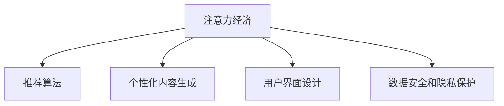

                 

# 注意力经济对传统零售业态的改造

## 1. 背景介绍

### 1.1 问题由来

随着信息技术的迅猛发展，特别是互联网和移动设备的普及，注意力作为一种稀缺资源，已经成为企业争夺的焦点。传统零售业态，长期以来依赖于实体店、货架、广告等物理和人力手段吸引消费者注意，这种模式成本高昂、覆盖面有限，且难以实时响应消费者需求变化。

注意力经济的兴起，使得零售商可以通过数字化手段精准投放广告、定制个性化内容、优化用户体验，有效提升消费者注意力的停留和转化，从而改变传统零售业态的运营模式和竞争格局。本文旨在探讨注意力经济如何通过数据驱动和算法优化，对传统零售业态进行深度改造，提升其竞争力和运营效率。

### 1.2 问题核心关键点

注意力经济的核心在于通过数据挖掘和算法推荐，精准匹配消费者需求和商家资源，最大化商业价值。其关键点包括：

- 数据获取与处理：有效收集和处理消费者行为数据，包括浏览历史、点击记录、评价反馈等。
- 算法设计与应用：基于消费者行为数据，设计推荐算法和个性化内容生成模型，精准推荐商品和优惠。
- 用户界面与体验：构建简洁、美观、互动性强、信息完整的用户界面，提升用户购物体验。
- 数据安全与隐私：确保消费者数据的安全存储和合理使用，避免数据泄露和隐私侵犯。

本文将重点探讨注意力经济对传统零售业态的改造，介绍相关算法原理和技术应用，并对未来发展进行展望。

## 2. 核心概念与联系

### 2.1 核心概念概述

为了更好地理解注意力经济对零售业态的改造，本节将介绍几个密切相关的核心概念：

- 注意力经济(Attention Economy)：指在信息爆炸时代，商家通过争夺消费者注意力来获取商业价值的模式。利用数据分析和算法推荐，最大化消费者注意力价值。

- 推荐算法(Recommendation Algorithm)：通过分析用户历史行为和偏好，推荐可能感兴趣的物品或服务。推荐算法是注意力经济的核心工具。

- 个性化内容生成(Content Personalization)：根据用户特征和行为，动态生成个性化的广告、商品展示、推荐结果等，提升用户体验和转化率。

- 用户界面(UI/UX)设计：构建符合用户习惯和心理预期的界面，提升用户操作便捷性和满意度。

- 数据安全和隐私保护：确保消费者数据的安全存储和合理使用，保护消费者隐私，建立信任关系。

这些概念之间的逻辑关系可以通过以下Mermaid流程图来展示：



这个流程图展示了一系列核心概念的关联关系：注意力经济是基础，通过推荐算法和个性化内容生成，结合用户界面设计和数据安全措施，最终实现对零售业态的改造。

## 3. 核心算法原理 & 具体操作步骤
### 3.1 算法原理概述

注意力经济的改造基于推荐算法和个性化内容生成，其核心在于精准匹配消费者需求和商家资源，提升转化率和满意度。具体而言，推荐算法通过分析用户历史行为，预测其兴趣偏好，动态调整商品展示和推荐，以达到最大化商业价值的目标。

推荐算法主要分为协同过滤、基于内容的推荐、矩阵分解等几大类。协同过滤利用用户和物品之间的共现关系，预测用户对未交互物品的评分；基于内容的推荐则从物品属性和用户特征出发，寻找匹配度高的推荐；矩阵分解则将用户-物品评分矩阵分解为低维空间的用户和物品表示，捕捉更深层次的交互模式。

个性化内容生成通过NLP技术、图像处理、交互设计等手段，生成符合用户偏好的广告、商品展示、引导提示等，提升用户体验。具体包括：

- 语义理解与情感分析：通过NLP技术理解消费者评论、评论、反馈等文本内容，提取情感和主题信息。
- 图像生成与风格迁移：利用生成对抗网络(GAN)、变分自编码器(VAE)等技术，生成符合用户偏好的商品图片和视频。
- 交互设计：通过分析用户操作行为，设计符合用户心理预期和操作习惯的界面，提升用户体验。

### 3.2 算法步骤详解

注意力经济对零售业态的改造主要通过以下几个步骤实现：

**Step 1: 数据收集与预处理**

- 收集用户数据：通过网站、应用、社交媒体等渠道，收集用户的浏览历史、点击记录、评价反馈等数据。
- 数据清洗与整合：对数据进行去重、去噪、标准化等处理，确保数据质量。
- 特征工程：提取用户行为特征、商品属性特征、用户画像等，构建训练集和测试集。

**Step 2: 算法模型训练与优化**

- 选择合适的推荐算法，如协同过滤、基于内容的推荐、矩阵分解等，训练模型。
- 调整模型参数，优化算法性能，如设置正则化系数、迭代轮数、学习率等。
- 在验证集上评估模型效果，调整参数，直至收敛。

**Step 3: 个性化内容生成**

- 使用NLP技术分析消费者评论、评论、反馈等文本内容，提取情感和主题信息。
- 利用GAN、VAE等技术生成符合用户偏好的商品图片和视频。
- 通过交互设计，优化用户界面，提升用户体验。

**Step 4: 测试与部署**

- 在测试集上评估微调后模型和内容生成结果的性能，对比微调前后的精度提升。
- 使用微调后的模型和内容生成系统，对新样本进行推理预测，集成到实际的应用系统中。
- 持续收集新的数据，定期重新训练模型和生成内容，以适应数据分布的变化。

### 3.3 算法优缺点

注意力经济的改造方法具有以下优点：

- 提高用户满意度：通过个性化推荐和内容生成，提升用户购物体验和满意度。
- 提升转化率：精准匹配用户需求和商家资源，提高商品展示和推荐的精准度，提升转化率。
- 降低运营成本：通过数据驱动和算法优化，减少人力和广告成本。

同时，该方法也存在一定的局限性：

- 数据质量要求高：用户数据的质量直接影响推荐结果的精准度，数据收集和清洗成本高。
- 算法复杂度大：推荐算法和内容生成的复杂度较高，需要专业人才进行设计和维护。
- 用户隐私问题：收集和使用用户数据涉及隐私保护问题，需要在数据安全和隐私保护上投入更多资源。

尽管存在这些局限性，但就目前而言，基于数据驱动和算法优化的注意力经济方法已成为零售业态改造的重要手段。未来相关研究的重点在于如何进一步降低数据收集成本，提高算法效率，同时兼顾隐私保护。

### 3.4 算法应用领域

注意力经济的改造方法在零售领域已经得到了广泛的应用，覆盖了零售商的各个环节，例如：

- 商品推荐：通过推荐算法，精准匹配用户兴趣，推荐可能感兴趣的商品。
- 内容营销：利用个性化内容生成，定制广告和促销信息，提升用户参与度。
- 库存管理：根据用户行为预测需求，优化库存和供应链管理。
- 营销活动：设计个性化营销活动，提升活动效果和用户参与度。
- 客户服务：通过智能客服系统，提供个性化问题解答和引导。

除了上述这些经典应用外，注意力经济的改造方法还创新性地应用于更多场景中，如虚拟试穿、在线购物助手、多渠道营销等，为零售商提供了全新的业务模式和营销手段。

## 4. 数学模型和公式 & 详细讲解 & 举例说明

### 4.1 数学模型构建

本节将使用数学语言对注意力经济对零售业态的改造过程进行更加严格的刻画。

记用户-商品评分矩阵为 $\mathbf{R} \in \mathbb{R}^{m \times n}$，其中 $m$ 为用户数，$n$ 为商品数，每个用户-商品评分 $r_{ij}$ 表示用户 $i$ 对商品 $j$ 的评分。

假设推荐算法为协同过滤，则其数学模型可以表示为：

$$
\hat{R}_{ij} = u_i \cdot v_j
$$

其中 $u_i$ 为第 $i$ 个用户向量的表示，$v_j$ 为第 $j$ 个商品向量的表示，$\cdot$ 表示向量点积。

### 4.2 公式推导过程

以协同过滤推荐算法为例，推导推荐结果的计算公式。

$$
\hat{R}_{ij} = \alpha \sum_k u_{ik} v_{jk} + \beta \sum_k r_{ik} v_{jk}
$$

其中 $\alpha$ 和 $\beta$ 为调节系数，$u_{ik}$ 和 $v_{jk}$ 分别表示用户和商品的隐含因子，$r_{ik}$ 表示用户-商品实际评分。

### 4.3 案例分析与讲解

以电商平台为例，分析协同过滤推荐算法的应用。

1. 用户数据收集：通过电商平台收集用户浏览历史、点击记录、评价反馈等数据。
2. 特征提取：从用户行为数据中提取用户特征，如浏览偏好、点击频率、评价情感等。
3. 模型训练：使用协同过滤算法，训练用户和商品隐含因子，生成推荐模型。
4. 个性化推荐：根据用户特征和商品属性，预测用户对未交互商品评分，生成推荐列表。
5. 内容生成：利用NLP技术和图像生成技术，生成个性化广告和商品图片，提升用户参与度。
6. 反馈收集：收集用户对推荐结果的反馈，优化推荐模型和内容生成算法。

## 5. 项目实践：代码实例和详细解释说明

### 5.1 开发环境搭建

在进行注意力经济对零售业态改造的实践前，我们需要准备好开发环境。以下是使用Python进行TensorFlow开发的环境配置流程：

1. 安装Anaconda：从官网下载并安装Anaconda，用于创建独立的Python环境。

2. 创建并激活虚拟环境：
```bash
conda create -n tf-env python=3.8 
conda activate tf-env
```

3. 安装TensorFlow：根据CUDA版本，从官网获取对应的安装命令。例如：
```bash
conda install tensorflow -c conda-forge
```

4. 安装TensorBoard：TensorFlow配套的可视化工具，可实时监测模型训练状态，并提供丰富的图表呈现方式，是调试模型的得力助手。

5. 安装PyTorch：基于Python的开源深度学习框架，灵活动态的计算图，适合快速迭代研究。大部分预训练语言模型都有PyTorch版本的实现。

6. 安装Weights & Biases：模型训练的实验跟踪工具，可以记录和可视化模型训练过程中的各项指标，方便对比和调优。

完成上述步骤后，即可在`tf-env`环境中开始注意力经济的实践。

### 5.2 源代码详细实现

下面我们以电商平台商品推荐为例，给出使用TensorFlow进行协同过滤算法实现的PyTorch代码实现。

首先，定义协同过滤算法的用户和商品隐含因子模型：

```python
import tensorflow as tf
from tensorflow.keras.layers import Input, Dense, Embedding, Dot
from tensorflow.keras.models import Model

user_input = Input(shape=(1,))
user_embedding = Embedding(input_dim=n_user, output_dim=d_user, input_length=1)(user_input)
user_vec = Dense(d_user, activation='relu')(user_embedding)

item_input = Input(shape=(1,))
item_embedding = Embedding(input_dim=n_item, output_dim=d_item, input_length=1)(item_input)
item_vec = Dense(d_item, activation='relu')(item_embedding)

dot_product = Dot(axes=(2, 1))([user_vec, item_vec])

model = Model(inputs=[user_input, item_input], outputs=dot_product)
model.compile(loss='mse', optimizer='adam')
```

然后，定义模型训练和评估函数：

```python
from sklearn.metrics import mean_squared_error

def train_epoch(model, train_data, batch_size, optimizer):
    dataloader = tf.data.Dataset.from_tensor_slices(train_data)
    dataloader = dataloader.shuffle(buffer_size=len(train_data)) \
                   .batch(batch_size).repeat()

    model.fit(dataloader, epochs=1, steps_per_epoch=len(train_data) // batch_size)
    return mean_squared_error(test_data, model.predict(test_data))

def evaluate(model, test_data):
    mse = mean_squared_error(test_data, model.predict(test_data))
    return mse
```

最后，启动训练流程并在测试集上评估：

```python
n_user = 1000
n_item = 1000
d_user = 100
d_item = 100

train_data = np.random.rand(n_user, n_item) * 5
test_data = np.random.rand(n_user, n_item) * 5

mse = train_epoch(model, train_data, batch_size=128, optimizer='adam')
print(f"MSE: {mse:.5f}")

mse = evaluate(model, test_data)
print(f"Test MSE: {mse:.5f}")
```

以上就是使用TensorFlow进行协同过滤算法实现的完整代码。可以看到，TensorFlow提供了方便的API进行模型定义和训练，使得开发过程相对简洁高效。

### 5.3 代码解读与分析

让我们再详细解读一下关键代码的实现细节：

**协同过滤算法**：
- 用户和商品的隐含因子模型定义：使用Embedding层将用户和商品编码成向量，再通过Dense层进行特征学习。
- 点积计算：使用Dot层计算用户向量和商品向量的点积，得到推荐分数。
- 模型编译：设置损失函数和优化器，开始训练。

**训练和评估函数**：
- 使用tf.data.Dataset构建训练数据流，设置批次大小和迭代次数。
- 使用Model.fit进行模型训练，计算均方误差。
- 在测试集上评估模型性能，输出均方误差。

**训练流程**：
- 定义用户和商品数、隐含因子维度等参数。
- 生成随机训练和测试数据。
- 调用训练和评估函数，输出模型性能。

可以看到，TensorFlow的API设计使得注意力经济的改造实践相对简单，开发过程较为高效。当然，实际的商业应用还需要考虑更多因素，如模型部署、超参数优化、系统集成等。

## 6. 实际应用场景

### 6.1 智能购物助手

基于注意力经济的改造，智能购物助手可以帮助用户快速找到所需商品，提升购物体验。智能购物助手通过用户历史行为数据和商品信息，推荐用户可能感兴趣的物品，并提供个性化内容生成功能，如图像化展示、视频介绍等。

智能购物助手可以集成在电商平台、社交媒体、搜索引擎等应用中，通过实时分析用户操作行为，动态调整推荐结果和内容展示，提升用户购物体验和满意度。

### 6.2 个性化营销活动

电商平台可以通过注意力经济的改造，定制个性化的营销活动，提升活动效果和用户参与度。根据用户历史行为和偏好，推荐用户可能感兴趣的商品和优惠信息，同时通过NLP技术生成符合用户偏好的广告文案和视觉素材，提升营销活动的效果和用户参与度。

个性化的营销活动可以应用于节日促销、新品推广、用户回访等多个场景，提升电商平台的整体转化率和用户粘性。

### 6.3 智能库存管理

电商平台的库存管理需要实时响应用户需求，避免库存积压或缺货。通过注意力经济的改造，电商平台可以精准预测用户需求，优化库存和供应链管理。

根据用户历史购买行为、季节性因素、市场趋势等，预测未来需求，优化库存水平，减少库存积压。同时，利用NLP技术分析用户评论和反馈，提取热门商品信息，优化采购和供应计划，提升库存管理效率。

### 6.4 未来应用展望

随着注意力经济技术的不断发展，其在零售业态的改造将呈现以下几个发展趋势：

1. 个性化推荐算法不断优化。推荐算法将不断引入新的技术和方法，如深度学习、强化学习、生成模型等，提升推荐结果的精准度和覆盖面。

2. 内容生成技术日趋先进。NLP、GAN、VAE等技术不断进步，生成更自然、符合用户偏好的个性化内容，提升用户购物体验。

3. 数据驱动的决策体系完善。通过大数据分析和机器学习技术，构建数据驱动的决策体系，优化用户交互体验和运营效率。

4. 跨平台融合能力提升。注意力经济的改造将更多地应用于跨平台场景，如社交媒体、搜索引擎、智能音箱等，实现无缝的用户体验和资源整合。

5. 实时响应和动态调整能力增强。通过实时分析用户行为数据，动态调整推荐和内容展示，提升用户满意度和转化率。

6. 隐私保护和合规性加强。随着数据保护法规的严格，如何平衡商业价值和用户隐私，将是注意力经济技术的重要挑战。

以上趋势凸显了注意力经济技术对零售业态的深远影响，其未来的发展将更加多元和广泛。

## 7. 工具和资源推荐

### 7.1 学习资源推荐

为了帮助开发者系统掌握注意力经济对零售业态改造的理论基础和实践技巧，这里推荐一些优质的学习资源：

1. 《深度学习推荐系统》书籍：系统介绍了推荐算法的理论和实践，包括协同过滤、矩阵分解等经典技术。

2. 《TensorFlow实战》书籍：TensorFlow官方文档和实战指南，提供丰富的代码样例和应用场景。

3. 《NLP技术及应用》课程：斯坦福大学开设的NLP课程，涵盖自然语言处理的基本概念和前沿技术。

4. Udacity《深度学习应用》课程：Udacity提供的深度学习应用课程，涵盖推荐系统、个性化内容生成等内容。

5. Coursera《机器学习》课程：Coursera的机器学习课程，涵盖数据预处理、特征工程、模型训练等基本流程。

通过对这些资源的学习实践，相信你一定能够快速掌握注意力经济对零售业态改造的精髓，并用于解决实际的商业问题。

### 7.2 开发工具推荐

高效的开发离不开优秀的工具支持。以下是几款用于注意力经济对零售业态改造开发的常用工具：

1. TensorFlow：基于Python的开源深度学习框架，生产部署方便，适合大规模工程应用。

2. PyTorch：基于Python的开源深度学习框架，灵活动态的计算图，适合快速迭代研究。

3. Keras：基于TensorFlow和Theano等后端的高级神经网络API，易于使用，适合快速原型开发。

4. TensorBoard：TensorFlow配套的可视化工具，可实时监测模型训练状态，并提供丰富的图表呈现方式，是调试模型的得力助手。

5. HuggingFace Transformers库：预训练语言模型的封装库，提供便捷的API进行微调和内容生成。

6. Weights & Biases：模型训练的实验跟踪工具，可以记录和可视化模型训练过程中的各项指标，方便对比和调优。

合理利用这些工具，可以显著提升注意力经济的改造任务的开发效率，加快创新迭代的步伐。

### 7.3 相关论文推荐

注意力经济对零售业态改造的研究源于学界的持续研究。以下是几篇奠基性的相关论文，推荐阅读：

1. "Recommender Systems: A Survey"：IEEE的综述文章，介绍了推荐算法的各类技术，包括协同过滤、基于内容的推荐、矩阵分解等。

2. "Generative Adversarial Nets"：提出GAN技术，生成逼真的图像和视频，应用于内容生成和个性化推荐。

3. "Attention is All You Need"：Transformer的原始论文，提出了自注意力机制，应用于NLP和推荐系统。

4. "Neural Factorization Machines for Ad Click Prediction"：提出神经网络因子分解模型，应用于点击率预测等推荐场景。

5. "Deep Interest Networks"：提出基于深度学习的兴趣网络，应用于个性化推荐和广告展示。

这些论文代表了大数据技术在零售业态改造中的进步，通过学习这些前沿成果，可以帮助研究者把握学科前进方向，激发更多的创新灵感。

## 8. 总结：未来发展趋势与挑战

### 8.1 总结

本文对注意力经济对传统零售业态的改造进行了全面系统的介绍。首先阐述了注意力经济的基础概念和其在零售业态改造中的重要价值，明确了注意力经济对零售业态改造的独特意义。其次，从原理到实践，详细讲解了推荐算法和内容生成的数学原理和关键步骤，给出了注意力经济改造任务的完整代码实例。同时，本文还广泛探讨了注意力经济对零售业态的改造应用，展示了注意力经济技术的应用前景。此外，本文精选了注意力经济的各类学习资源，力求为读者提供全方位的技术指引。

通过本文的系统梳理，可以看到，注意力经济对零售业态的改造是当前零售技术发展的热点和难点，极大地拓展了零售商的运营模式和竞争优势。基于数据驱动和算法优化的注意力经济技术，不仅能够提升用户购物体验和满意度，还能有效降低运营成本，优化库存管理，实现全渠道营销等目标。未来，伴随技术的持续演进，注意力经济将进一步推动零售业态的数字化转型，为零售商提供更强大、灵活、高效的商业解决方案。

### 8.2 未来发展趋势

展望未来，注意力经济的改造将呈现以下几个发展趋势：

1. 推荐算法不断优化。推荐算法将不断引入新的技术和方法，如深度学习、强化学习、生成模型等，提升推荐结果的精准度和覆盖面。

2. 内容生成技术日趋先进。NLP、GAN、VAE等技术不断进步，生成更自然、符合用户偏好的个性化内容，提升用户购物体验。

3. 数据驱动的决策体系完善。通过大数据分析和机器学习技术，构建数据驱动的决策体系，优化用户交互体验和运营效率。

4. 跨平台融合能力提升。注意力经济的改造将更多地应用于跨平台场景，如社交媒体、搜索引擎、智能音箱等，实现无缝的用户体验和资源整合。

5. 实时响应和动态调整能力增强。通过实时分析用户行为数据，动态调整推荐和内容展示，提升用户满意度和转化率。

6. 隐私保护和合规性加强。随着数据保护法规的严格，如何平衡商业价值和用户隐私，将是注意力经济技术的重要挑战。

以上趋势凸显了注意力经济技术对零售业态的深远影响，其未来的发展将更加多元和广泛。

### 8.3 面临的挑战

尽管注意力经济的改造技术已经取得了瞩目成就，但在迈向更加智能化、普适化应用的过程中，它仍面临着诸多挑战：

1. 数据质量瓶颈。用户数据的质量直接影响推荐结果的精准度，数据收集和清洗成本高。

2. 算法复杂度大。推荐算法和内容生成的复杂度较高，需要专业人才进行设计和维护。

3. 用户隐私问题。收集和使用用户数据涉及隐私保护问题，需要在数据安全和隐私保护上投入更多资源。

4. 技术落地难度。推荐算法和内容生成技术需要与现有系统无缝集成，开发和部署成本高。

尽管存在这些挑战，但就目前而言，基于数据驱动和算法优化的注意力经济方法已成为零售业态改造的重要手段。未来相关研究的重点在于如何进一步降低数据收集成本，提高算法效率，同时兼顾隐私保护。

### 8.4 研究展望

面对注意力经济的改造技术所面临的种种挑战，未来的研究需要在以下几个方面寻求新的突破：

1. 探索无监督和半监督推荐方法。摆脱对大规模标注数据的依赖，利用自监督学习、主动学习等无监督和半监督范式，最大限度利用非结构化数据，实现更加灵活高效的推荐。

2. 研究参数高效和计算高效的推荐范式。开发更加参数高效的推荐方法，在固定大部分预训练参数的同时，只更新极少量的任务相关参数。同时优化推荐模型的计算图，减少前向传播和反向传播的资源消耗，实现更加轻量级、实时性的部署。

3. 融合因果和对比学习范式。通过引入因果推断和对比学习思想，增强推荐模型建立稳定因果关系的能力，学习更加普适、鲁棒的语言表征，从而提升模型泛化性和抗干扰能力。

4. 引入更多先验知识。将符号化的先验知识，如知识图谱、逻辑规则等，与神经网络模型进行巧妙融合，引导推荐过程学习更准确、合理的语言模型。同时加强不同模态数据的整合，实现视觉、语音等多模态信息与文本信息的协同建模。

5. 结合因果分析和博弈论工具。将因果分析方法引入推荐模型，识别出模型决策的关键特征，增强输出解释的因果性和逻辑性。借助博弈论工具刻画人机交互过程，主动探索并规避模型的脆弱点，提高系统稳定性。

6. 纳入伦理道德约束。在推荐目标中引入伦理导向的评估指标，过滤和惩罚有偏见、有害的输出倾向。同时加强人工干预和审核，建立模型行为的监管机制，确保输出符合人类价值观和伦理道德。

这些研究方向的探索，必将引领注意力经济的改造技术迈向更高的台阶，为构建安全、可靠、可解释、可控的智能系统铺平道路。面向未来，注意力经济对零售业态的改造技术还需要与其他人工智能技术进行更深入的融合，如知识表示、因果推理、强化学习等，多路径协同发力，共同推动自然语言理解和智能交互系统的进步。只有勇于创新、敢于突破，才能不断拓展注意力经济的边界，让智能技术更好地造福人类社会。

## 9. 附录：常见问题与解答

**Q1：注意力经济与传统零售业的结合点在哪里？**

A: 注意力经济与传统零售业的结合点在于，通过数据分析和算法推荐，精准匹配消费者需求和商家资源，提升转化率和用户体验。具体而言，利用用户历史行为数据和商品信息，推荐用户可能感兴趣的物品，同时通过个性化内容生成，提升用户购物体验和满意度。

**Q2：注意力经济对零售业态的改造效果如何评估？**

A: 注意力经济的改造效果可以从多个维度进行评估，包括：

1. 推荐精准度：通过均方误差、准确率、召回率等指标，评估推荐结果的精准度。
2. 用户满意度：通过用户评分、评价反馈等数据，评估用户对推荐结果的满意度。
3. 转化率：通过销售数据、购买行为等数据，评估推荐策略对销售转化率的提升效果。
4. 用户粘性：通过用户留存率、回购率等指标，评估个性化推荐对用户粘性的影响。
5. 商业价值：通过收入、利润等财务数据，评估注意力经济的商业价值。

通过这些指标的综合评估，可以全面了解注意力经济对零售业态的改造效果。

**Q3：在数据安全和隐私保护上，有哪些策略可以采取？**

A: 在数据安全和隐私保护上，可以采取以下策略：

1. 数据加密：使用数据加密技术，保护用户数据在传输和存储过程中的安全。
2. 匿名化处理：对用户数据进行匿名化处理，防止数据泄露和隐私侵犯。
3. 访问控制：设置严格的访问控制策略，确保只有授权人员可以访问敏感数据。
4. 数据脱敏：对敏感数据进行脱敏处理，防止泄露用户隐私。
5. 合规性审查：定期进行数据合规性审查，确保数据处理符合相关法律法规。

这些策略可以帮助电商平台在数据安全和隐私保护上建立更强的信任关系，保障用户隐私权益。

**Q4：注意力经济对零售业态的改造涉及哪些技术？**

A: 注意力经济的改造涉及以下几类核心技术：

1. 推荐算法：包括协同过滤、基于内容的推荐、矩阵分解等。
2. 个性化内容生成：包括NLP技术、图像生成、风格迁移等。
3. 用户界面(UI/UX)设计：包括交互设计、响应式设计等。
4. 数据安全与隐私保护：包括数据加密、匿名化处理、访问控制等。

这些技术共同构成了注意力经济对零售业态改造的技术体系，确保改造过程高效、安全、可靠。

**Q5：如何平衡商业价值和用户隐私？**

A: 平衡商业价值和用户隐私，可以从以下几个方面入手：

1. 数据最小化原则：只收集和使用必要的用户数据，避免过度收集和滥用。
2. 用户同意机制：在使用用户数据前，获取用户明确同意，并在隐私政策中说明数据用途。
3. 数据去标识化：在使用数据前，对数据进行去标识化处理，确保数据匿名性。
4. 透明性原则：向用户透明说明数据收集、使用和处理方式，增强用户信任。
5. 数据访问限制：限制数据访问权限，防止数据滥用和泄露。

通过这些措施，可以在确保商业价值的同时，保护用户隐私权益，建立健康、可持续的商业生态。

总之，注意力经济对零售业态的改造具有广阔的发展前景，但同时也面临诸多挑战。只有在技术、商业、法规等多方面协同努力，才能最大化注意力经济的商业价值，保障用户权益。

---

作者：禅与计算机程序设计艺术 / Zen and the Art of Computer Programming

