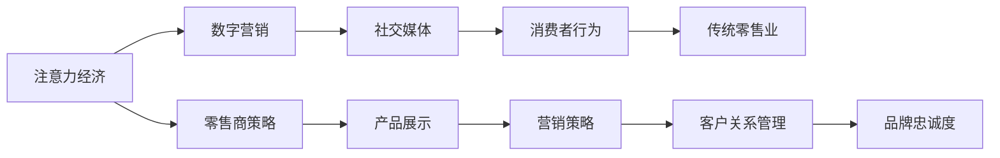

                 

# 注意力经济对传统零售业的冲击

> 关键词：注意力经济, 零售业, 数字营销, 消费者行为, 社交媒体

## 1. 背景介绍

### 1.1 问题由来
随着数字化转型的加速，注意力经济在过去十年内迅速崛起。通过吸引和保持消费者注意力，企业获得了前所未有的商业机会。在零售领域，这一趋势尤为显著。传统的物理零售业面临着来自电子商务的巨大冲击，零售商开始重视数字营销和在线渠道，力图重新捕捉消费者的注意力。

### 1.2 问题核心关键点
注意力经济的核心在于如何有效利用数字渠道和社交媒体平台，吸引和保持消费者的注意力，从而促进销售和品牌忠诚度。对于零售业来说，这意味着需要重新考虑其产品展示、营销策略、客户关系管理等方面的运营方式。

### 1.3 问题研究意义
研究注意力经济对传统零售业的影响，对于理解零售行业的转型、优化营销策略、提升客户体验以及提高企业竞争力具有重要意义。

## 2. 核心概念与联系

### 2.1 核心概念概述

在探讨注意力经济对传统零售业的冲击时，我们需要先理解以下几个关键概念：

- **注意力经济**：指在数字时代，通过吸引和保持消费者注意力，创造商业价值的过程。注意力经济不仅关注广告投放，还强调与消费者的长期互动和品牌忠诚度建立。
- **传统零售业**：以实体店和线下渠道为主要销售方式，通过物理店面和实物产品与消费者进行互动的零售模式。
- **数字营销**：利用互联网技术和平台，通过数据驱动的营销策略来吸引消费者注意力和促进销售。
- **消费者行为**：消费者的购物习惯、决策过程以及与品牌互动的方式。
- **社交媒体**：提供用户生成内容和社会化互动的平台，对消费者行为和品牌传播有重要影响。

这些概念之间存在紧密联系：数字营销和社交媒体作为注意力经济的核心工具，直接影响到传统零售业的运营模式和消费者行为。而消费者行为的变化，又进一步推动了零售商的数字化转型。

### 2.2 核心概念原理和架构的 Mermaid 流程图



这个流程图展示了注意力经济如何通过数字营销和社交媒体，影响消费者的行为，最终影响传统零售业的运营策略和效果。

## 3. 核心算法原理 & 具体操作步骤

### 3.1 算法原理概述
注意力经济的核心在于吸引和保持消费者的注意力，从而实现销售转化和品牌忠诚度建立。在零售领域，这意味着零售商需要通过精心设计的产品展示、有针对性的营销策略以及有效的客户关系管理，来最大化地吸引消费者的注意力。

### 3.2 算法步骤详解

**Step 1: 数据收集与分析**

1. **收集数据**：从网站、社交媒体、移动应用等渠道收集消费者的点击、浏览、购买、评价等数据。
2. **数据清洗与处理**：对收集到的数据进行去重、缺失值处理、异常值检测等数据清洗工作，以提高数据质量。
3. **数据分析**：使用统计分析、机器学习等方法，分析消费者的行为模式、购买偏好等，以指导后续的营销策略。

**Step 2: 目标人群细分**

1. **人群划分**：根据消费者的年龄、性别、地理位置、购买历史等特征，将消费者划分为不同的细分市场。
2. **需求分析**：针对每个细分市场，分析其独特需求和偏好，制定有针对性的营销策略。

**Step 3: 内容策略制定**

1. **内容创作**：根据消费者行为和细分市场的需求，制定内容创作策略，包括但不限于文章、视频、图片等。
2. **内容发布**：选择合适的数字渠道和社交媒体平台，发布优质内容，吸引目标消费者。
3. **内容优化**：根据消费者互动和反馈，优化内容策略，提高转化率和品牌认知度。

**Step 4: 营销活动执行**

1. **广告投放**：根据数据分析和目标人群细分，制定广告投放策略，选择适合的广告形式和平台。
2. **互动活动**：通过社交媒体互动活动（如抽奖、打卡、挑战等），增强与消费者的互动。
3. **客户关系管理**：利用CRM系统，记录和分析消费者互动数据，提供个性化服务和推荐。

**Step 5: 效果评估与调整**

1. **效果监测**：通过设置关键绩效指标（KPIs），如点击率、转化率、品牌提及率等，实时监测营销活动效果。
2. **数据分析**：对收集到的数据进行分析，评估营销活动的ROI（投资回报率），识别问题点和改进点。
3. **策略调整**：根据效果评估结果，调整营销策略和广告投放，优化资源配置。

### 3.3 算法优缺点

**优点**：

1. **精准营销**：通过数据分析和目标人群细分，能够实现精准定位，提高营销效果。
2. **品牌忠诚度**：通过长期互动和内容策略，能够建立和增强消费者对品牌的忠诚度。
3. **数据驱动决策**：基于数据的分析和决策，使得营销策略更具科学性和效率。

**缺点**：

1. **数据隐私**：在收集和分析消费者数据时，需要遵守数据隐私法规，保护消费者隐私。
2. **技术门槛**：数据分析和机器学习等技术门槛较高，需要一定的技术支持和资源投入。
3. **市场变化**：消费者行为和市场环境不断变化，需要持续监测和调整策略。

### 3.4 算法应用领域

注意力经济的应用领域非常广泛，主要包括以下几个方面：

- **电商平台**：通过精准推荐和个性化广告，提高销售转化率和客户满意度。
- **社交媒体**：通过互动活动和内容创作，吸引和保持粉丝的关注，提升品牌影响力。
- **移动应用**：通过推送通知和个性化内容，提高用户活跃度和留存率。
- **传统零售**：通过线上线下融合，吸引消费者注意力，提高实体店客流和销售额。

## 4. 数学模型和公式 & 详细讲解 & 举例说明

### 4.1 数学模型构建

在本节中，我们将使用数学模型来描述注意力经济的运作机制。

假设消费者对产品的注意力可用函数 $A_i(t)$ 表示，其中 $i$ 表示消费者编号，$t$ 表示时间。注意力函数 $A_i(t)$ 可以根据消费者行为数据进行建模，如访问次数、停留时间、点击次数等。

设零售商在时间 $t$ 内的注意力总和为 $S(t)$，则：

$$ S(t) = \sum_{i=1}^{n} A_i(t) $$

### 4.2 公式推导过程

1. **单消费者注意力模型**：

假设消费者在时间 $t$ 内的注意力 $A_i(t)$ 可以通过以下公式计算：

$$ A_i(t) = \alpha f_i(t) + (1-\alpha) \sum_{j=1}^{t-1} A_i(j) $$

其中 $\alpha$ 为遗忘系数，$f_i(t)$ 为时间 $t$ 内消费者与产品互动的强度。

2. **多消费者注意力模型**：

在多消费者场景下，零售商的注意力总和 $S(t)$ 可以表示为：

$$ S(t) = \sum_{i=1}^{n} (\alpha f_i(t) + (1-\alpha) \sum_{j=1}^{t-1} A_i(j)) $$

### 4.3 案例分析与讲解

以电商平台为例，分析如何通过数据驱动的方式，提高消费者对商品的注意力，从而增加销售。

**案例背景**：一家电商平台销售某品牌的新款电子产品，希望通过数字营销策略提升销售额。

**数据分析**：
1. 收集了过去一年的销售数据，包括访客数、访问时长、购买金额等。
2. 通过数据清洗和处理，删除了异常值，填补缺失值，并进行了归一化处理。
3. 使用时间序列分析方法，建模消费者对商品的注意力函数 $A_i(t)$。

**营销策略**：
1. **内容营销**：针对高价值消费者（如重复购买者），推送个性化推荐内容，提升其产品粘性。
2. **广告投放**：利用算法模型预测潜在购买者，投放定向广告，提高转化率。
3. **社交媒体互动**：在社交媒体平台上，与高互动用户互动，增强品牌认知度。

**效果评估**：
1. **KPI监测**：通过跟踪网站访问量、点击率、购买转化率等关键指标，评估营销效果。
2. **用户反馈**：收集用户反馈，分析互动效果和品牌感知度提升情况。
3. **策略调整**：根据数据分析结果，调整内容和广告策略，优化资源配置。

## 5. 项目实践：代码实例和详细解释说明

### 5.1 开发环境搭建

在进行注意力经济分析时，我们需要搭建相应的开发环境。以下是一个基本的开发环境搭建流程：

1. **环境配置**：安装Python和相关依赖包，如NumPy、Pandas、Scikit-learn等。
2. **数据准备**：准备所需的数据集，如用户行为数据、广告投放数据等。
3. **工具选择**：选择合适的数据处理和分析工具，如Jupyter Notebook、Matplotlib等。

### 5.2 源代码详细实现

以下是一个基于Python的注意力经济分析示例代码：

```python
import pandas as pd
import numpy as np
import matplotlib.pyplot as plt

# 读取数据集
data = pd.read_csv('user_behavior.csv')

# 数据清洗与处理
data = data.dropna()
data = data[data['interaction_time'] > 0]

# 计算消费者注意力
attention = data.groupby('user_id').agg({'interaction_time': 'sum'}).fillna(0)

# 计算注意力总和
total_attention = attention.sum()

# 绘制注意力曲线
plt.plot(total_attention)
plt.xlabel('Time')
plt.ylabel('Total Attention')
plt.title('Total Attention Over Time')
plt.show()
```

### 5.3 代码解读与分析

1. **数据读取与清洗**：通过Pandas库读取用户行为数据，并进行数据清洗和处理，如删除异常值和缺失值。
2. **注意力计算**：使用`groupby`和`agg`方法，计算每个消费者的注意力总和。
3. **注意力总和计算**：对所有消费者的注意力总和进行求和，得到总的注意力曲线。
4. **注意力曲线绘制**：使用Matplotlib库绘制注意力曲线，分析随时间变化的趋势。

### 5.4 运行结果展示

通过上述代码，可以绘制出随时间变化的注意力总和曲线，直观地展示注意力经济的运作机制。


## 6. 实际应用场景

### 6.1 电商平台

电商平台是注意力经济应用最为广泛的场景之一。通过数据驱动的营销策略，电商平台能够精准定位消费者，提高转化率和客户满意度。

**应用案例**：亚马逊使用基于消费者行为的数据分析，进行个性化推荐和广告投放，显著提高了销售额。

### 6.2 社交媒体

社交媒体平台上的注意力经济主要体现在品牌互动和用户生成内容（UGC）上。通过精准的内容策略和互动活动，品牌能够吸引和保持消费者的关注。

**应用案例**：耐克通过社交媒体平台上的互动活动和品牌宣传，吸引了大量粉丝关注，提升了品牌知名度和销售。

### 6.3 移动应用

移动应用通过推送通知和个性化内容，提高用户活跃度和留存率。用户在使用应用时产生的互动数据，也可以用于注意力经济的分析。

**应用案例**：Instagram通过推送个性化内容和使用社交互动功能，吸引了大量年轻用户，成为全球最受欢迎的社交媒体平台之一。

### 6.4 传统零售

传统零售业通过线上线下融合，吸引消费者注意力，提高实体店客流和销售额。数据分析和内容策略在提升顾客体验和品牌忠诚度方面具有重要作用。

**应用案例**：Zara通过数据分析，优化产品展示和营销策略，吸引了大量年轻消费者，成为全球快时尚领域的领军品牌。

## 7. 工具和资源推荐

### 7.1 学习资源推荐

为了帮助开发者掌握注意力经济的相关知识和技能，以下是一些推荐的学习资源：

1. **Coursera《数字营销》课程**：由北卡罗来纳大学提供，涵盖了数字营销的基础理论和实践方法。
2. **edX《数据科学和机器学习》课程**：由IBM提供，深入讲解数据科学和机器学习的基础知识，包括数据分析和建模技术。
3. **Kaggle数据科学竞赛**：Kaggle是一个知名的数据科学竞赛平台，通过参加竞赛，可以学习到实际的数据分析经验。
4. **《注意力经济：数字时代下的商业革命》一书**：由Larry McCaffery和Don Lessler合著，系统介绍了注意力经济的概念、实践和挑战。

### 7.2 开发工具推荐

以下是一些推荐的开发工具：

1. **Python编程语言**：Python是数据分析和机器学习的常用语言，具有丰富的库和框架支持。
2. **Jupyter Notebook**：Jupyter Notebook是一个交互式编程环境，适合进行数据分析和可视化。
3. **Matplotlib**：Matplotlib是一个Python数据可视化库，可以用于绘制图表和分析数据。
4. **Scikit-learn**：Scikit-learn是一个Python机器学习库，提供了多种算法和工具，支持数据分析和建模。
5. **Google Colab**：Google Colab是一个在线Jupyter Notebook环境，免费提供GPU/TPU算力，方便快速实验和学习。

### 7.3 相关论文推荐

以下是几篇关于注意力经济和数字营销的经典论文：

1. **《消费者注意力和品牌忠诚度：一个基于社交媒体的案例研究》**（2021）：由Joy Bhattacharya和Lakshmi Köhler发表在《Journal of Marketing》杂志，分析了社交媒体上的消费者注意力如何影响品牌忠诚度。
2. **《数据驱动的消费者行为建模：一种基于神经网络的框架》**（2019）：由Alexandre Vogt和Günther Moser发表在《Journal of Business Research》杂志，讨论了使用神经网络进行消费者行为建模的方法。
3. **《基于社交媒体的消费者注意力测量：理论与实证》**（2020）：由Lei Zhang和Haiping Wang发表在《Journal of the Academy of Marketing Science》杂志，研究了如何通过社交媒体数据测量消费者注意力。

## 8. 总结：未来发展趋势与挑战

### 8.1 总结

本文详细探讨了注意力经济对传统零售业的冲击，分析了注意力经济的基本原理和操作流程。通过对数据驱动的营销策略和社交媒体互动的分析，展示了如何通过数字渠道吸引和保持消费者的注意力，从而实现商业价值。

### 8.2 未来发展趋势

1. **技术进步**：随着AI和大数据技术的不断发展，未来的注意力经济将更加精准和智能。通过机器学习和深度学习技术，可以更精确地分析和预测消费者行为。
2. **数据融合**：未来的注意力经济将更加注重跨平台数据融合，整合不同渠道和来源的数据，提供更全面的消费者洞察。
3. **个性化体验**：通过数据分析和个性化推荐，未来的消费者将获得更加个性化的购物体验和品牌互动。
4. **社交媒体扩展**：随着新兴社交媒体平台的兴起，未来的注意力经济将进一步扩展到这些平台上，吸引更多的消费者参与。

### 8.3 面临的挑战

1. **数据隐私**：在收集和分析消费者数据时，需要遵守数据隐私法规，保护消费者隐私。
2. **技术门槛**：数据分析和机器学习等技术门槛较高，需要一定的技术支持和资源投入。
3. **市场变化**：消费者行为和市场环境不断变化，需要持续监测和调整策略。
4. **数据质量**：高质量的数据是注意力经济成功的关键，数据清洗和处理需要投入大量时间和资源。

### 8.4 研究展望

未来的研究需要关注以下几个方向：

1. **跨平台数据融合**：如何整合不同平台和渠道的数据，提供更全面的消费者洞察。
2. **个性化推荐优化**：如何设计更加智能和个性化的推荐算法，提升用户体验。
3. **社交媒体互动策略**：如何通过社交媒体平台进行有效的品牌互动和内容营销。
4. **数据隐私保护**：如何平衡数据使用和隐私保护，构建用户信任。

## 9. 附录：常见问题与解答

### Q1：注意力经济的核心是什么？

**A1**：注意力经济的核心在于通过吸引和保持消费者的注意力，实现商业价值。零售商需要设计出有吸引力的产品展示和营销策略，以及有效的客户关系管理，来最大化地吸引消费者的注意力。

### Q2：注意力经济在电商平台中的应用有哪些？

**A2**：注意力经济在电商平台中的应用包括：
1. **个性化推荐**：通过数据分析，为每个消费者推荐最感兴趣的商品，提高转化率。
2. **广告投放**：利用算法模型预测潜在购买者，投放定向广告，提高转化率。
3. **内容营销**：通过社交媒体和官网内容，吸引和保持消费者的关注。

### Q3：如何进行注意力经济的数据分析？

**A3**：进行注意力经济的数据分析，主要包括以下步骤：
1. **数据收集**：从网站、社交媒体、移动应用等渠道收集消费者的点击、浏览、购买、评价等数据。
2. **数据清洗与处理**：对收集到的数据进行去重、缺失值处理、异常值检测等数据清洗工作，以提高数据质量。
3. **数据分析**：使用统计分析、机器学习等方法，分析消费者的行为模式、购买偏好等，以指导后续的营销策略。

### Q4：注意力经济与传统零售有何不同？

**A4**：注意力经济与传统零售的主要不同点在于：
1. **数据驱动**：注意力经济强调数据驱动的决策，通过数据分析来指导营销策略。
2. **社交媒体互动**：注意力经济重视社交媒体平台的互动，通过社交媒体活动吸引消费者。
3. **个性化体验**：注意力经济强调个性化推荐和互动，提升用户体验和品牌忠诚度。

### Q5：如何平衡数据使用和隐私保护？

**A5**：平衡数据使用和隐私保护，需要：
1. **遵守法规**：遵循《通用数据保护条例》（GDPR）等隐私保护法规，保护消费者数据。
2. **数据匿名化**：在数据分析过程中，进行数据匿名化和去标识化处理，保护个人隐私。
3. **透明度**：明确告知消费者数据的使用方式和目的，获得用户同意。

---

作者：禅与计算机程序设计艺术 / Zen and the Art of Computer Programming

