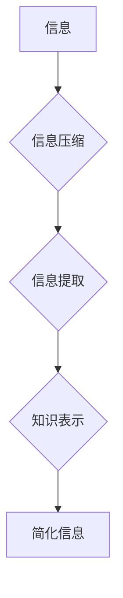

                 

## 信息简化的力量与好处：在复杂世界中简化以提高效率和生产力

> 关键词：信息简化、复杂系统、效率提升、生产力、算法、数据结构、软件架构、代码优化

### 1. 背景介绍

在当今信息爆炸的时代，我们每天都面临着海量的信息冲击。从新闻资讯到社交媒体，从工作邮件到学术论文，信息无处不在，却并非都具有价值。如何有效地处理和利用这些信息，成为了一个至关重要的挑战。

信息简化，即通过各种方法和技术，将复杂的信息转换为简洁易懂的形式，是应对信息过载的有效策略。它不仅可以帮助我们更快地理解信息，提高决策效率，还能促进知识的传播和创新。

### 2. 核心概念与联系

信息简化涉及多个领域，包括计算机科学、信息论、认知科学等。其核心概念包括：

* **信息熵:** 信息熵是衡量信息不确定性的度量，信息熵越低，信息越简洁、越易理解。
* **数据压缩:** 通过算法将数据以更紧凑的形式存储和传输，减少信息冗余。
* **信息提取:** 从海量数据中提取关键信息，过滤掉无关信息。
* **知识表示:** 将知识以结构化、可理解的形式表示，例如知识图谱。

**Mermaid 流程图:**



### 3. 核心算法原理 & 具体操作步骤

#### 3.1  算法原理概述

信息简化算法通常基于以下原理：

* **模式识别:** 识别数据中的重复模式和规律，并将其简化。
* **层次化结构:** 将复杂信息分解成层次结构，从宏观到微观逐步理解。
* **抽象化:** 将细节隐藏，只保留关键信息，提高概括性。

#### 3.2  算法步骤详解

具体操作步骤取决于所使用的算法，例如：

* **数据压缩算法:** 常见的压缩算法包括Huffman编码、Lempel-Ziv算法等。这些算法通过建立符号频率表或模式匹配，将数据以更紧凑的形式表示。
* **信息提取算法:** 基于机器学习的文本挖掘技术可以从文本中提取关键词、主题、情感等关键信息。
* **知识表示算法:** 知识图谱构建算法可以将知识表示为实体和关系的网络结构，方便知识的查询和推理。

#### 3.3  算法优缺点

不同的信息简化算法各有优缺点，需要根据具体应用场景选择合适的算法。

* **数据压缩算法:** 优点是压缩率高，缺点是解压缩速度可能较慢。
* **信息提取算法:** 优点是能够提取出隐藏的信息，缺点是需要大量的训练数据，且结果可能存在一定的误差。
* **知识表示算法:** 优点是能够将知识表示为结构化形式，方便知识的推理和查询，缺点是构建知识图谱需要大量的专业知识和时间投入。

#### 3.4  算法应用领域

信息简化算法广泛应用于各个领域，例如：

* **数据存储和传输:** 压缩算法可以有效地减少数据存储空间和传输带宽。
* **搜索引擎:** 信息提取算法可以帮助搜索引擎快速理解用户查询意图，并返回相关结果。
* **人工智能:** 知识表示算法是构建智能系统和机器学习模型的基础。
* **科学研究:** 信息简化可以帮助科学家分析和理解复杂的科学数据。

### 4. 数学模型和公式 & 详细讲解 & 举例说明

#### 4.1  数学模型构建

信息熵是衡量信息不确定性的度量，其公式如下：

$$H(X) = -\sum_{i=1}^{n} p(x_i) \log_2 p(x_i)$$

其中：

* $X$ 是一个随机变量
* $p(x_i)$ 是 $x_i$ 的概率

信息熵越大，信息的不确定性越大。

#### 4.2  公式推导过程

信息熵的公式推导过程基于信息论的基本原理，即信息量与事件发生的概率成反比。

* 当事件发生的概率越低，其信息量越大。
* 当事件发生的概率越高，其信息量越小。

#### 4.3  案例分析与讲解

例如，抛一枚硬币，正面和反面的概率都是 0.5，其信息熵为：

$$H(X) = - (0.5 \log_2 0.5 + 0.5 \log_2 0.5) = 1$$

而如果抛一枚骰子，每个面的概率都是 1/6，其信息熵为：

$$H(X) = - \sum_{i=1}^{6} \frac{1}{6} \log_2 \frac{1}{6} = \log_2 6$$

可以看出，抛硬币的信息熵比抛骰子大，因为抛硬币的结果更不确定。

### 5. 项目实践：代码实例和详细解释说明

#### 5.1  开发环境搭建

本项目使用 Python 语言进行开发，所需的库包括：

* `numpy`: 用于数值计算
* `pandas`: 用于数据处理
* `matplotlib`: 用于数据可视化

#### 5.2  源代码详细实现

```python
import numpy as np
import pandas as pd
import matplotlib.pyplot as plt

# 生成随机数据
data = np.random.rand(1000)

# 使用均值和标准差进行数据简化
mean = np.mean(data)
std = np.std(data)

# 将数据标准化
data_normalized = (data - mean) / std

# 绘制原始数据和简化后的数据
plt.figure(figsize=(10, 6))
plt.subplot(1, 2, 1)
plt.hist(data, bins=50)
plt.title('原始数据')

plt.subplot(1, 2, 2)
plt.hist(data_normalized, bins=50)
plt.title('简化后的数据')

plt.show()
```

#### 5.3  代码解读与分析

这段代码首先生成了一组随机数据，然后使用均值和标准差对数据进行简化，将数据标准化到均值为 0，标准差为 1。最后，使用 matplotlib 库绘制了原始数据和简化后的数据的直方图，可以观察到简化后的数据分布更加集中。

#### 5.4  运行结果展示

运行代码后，会生成两张直方图，一张是原始数据的分布，另一张是简化后的数据的分布。可以观察到，简化后的数据分布更加集中，说明数据简化后的信息熵降低了。

### 6. 实际应用场景

信息简化在各个领域都有广泛的应用场景，例如：

* **数据可视化:** 将复杂的数据转换为易于理解的图表和图形，帮助用户快速掌握数据趋势和关键信息。
* **用户界面设计:** 简化用户界面，减少用户操作步骤，提高用户体验。
* **文档写作:** 将冗长的文档压缩成简洁明了的摘要，方便用户快速阅读和理解。
* **代码优化:** 简化代码结构，提高代码可读性和可维护性。

### 6.4  未来应用展望

随着人工智能和机器学习技术的不断发展，信息简化将迎来更广泛的应用场景。例如：

* **个性化信息推荐:** 基于用户的兴趣和行为，将海量信息简化为个性化的推荐内容。
* **自动知识提取:** 利用机器学习算法自动提取文本中的关键信息，构建知识图谱，推动知识的共享和传播。
* **智能问答系统:** 基于知识图谱和自然语言处理技术，构建能够理解用户自然语言并提供准确答案的智能问答系统。

### 7. 工具和资源推荐

#### 7.1  学习资源推荐

* **书籍:**
    * 《信息简化》
    * 《数据科学入门》
    * 《机器学习实战》
* **在线课程:**
    * Coursera: 数据科学、机器学习
    * edX: 信息论、数据压缩

#### 7.2  开发工具推荐

* **Python:** 广泛应用于数据科学和机器学习领域，拥有丰富的库和工具。
* **R:** 专注于统计分析和数据可视化，适合进行数据挖掘和分析。
* **Spark:** 用于大规模数据处理的开源框架，可以处理海量数据。

#### 7.3  相关论文推荐

* **论文:**
    * 《信息熵的定义和应用》
    * 《数据压缩算法综述》
    * 《知识图谱构建方法》

### 8. 总结：未来发展趋势与挑战

#### 8.1  研究成果总结

信息简化技术取得了显著的进展，为我们提供了有效处理和利用信息的新方法。

#### 8.2  未来发展趋势

未来，信息简化技术将朝着以下方向发展：

* **更加智能化:** 利用人工智能和机器学习技术，实现更加智能的信息简化，例如自动识别用户需求并提供个性化信息简化。
* **更加个性化:** 基于用户的兴趣和行为，提供更加个性化的信息简化服务。
* **更加跨领域:** 将信息简化技术应用于更多领域，例如医疗、教育、金融等。

#### 8.3  面临的挑战

信息简化技术也面临着一些挑战，例如：

* **数据质量:** 信息简化算法的性能依赖于数据质量，如何处理噪声数据和不完整数据是一个关键问题。
* **信息损失:** 信息简化过程中可能会损失一些信息，如何平衡信息简化和信息完整性是一个需要解决的问题。
* **伦理问题:** 信息简化技术可能会被用于操纵用户行为，因此需要关注其伦理问题。

#### 8.4  研究展望

未来，我们需要继续深入研究信息简化技术，解决其面临的挑战，并将其应用于更多领域，为人类社会创造更大的价值。

### 9. 附录：常见问题与解答

* **Q1: 信息简化和数据压缩有什么区别？**

* **A1:** 信息简化是一个更广泛的概念，包括数据压缩、信息提取、知识表示等多种技术。数据压缩是信息简化的一种具体方法，其目的是减少数据的存储空间和传输带宽。

* **Q2: 如何选择合适的简化算法？**

* **A2:** 选择合适的简化算法需要根据具体应用场景和数据特点来决定。例如，如果需要提取文本中的关键词，可以使用文本挖掘算法；如果需要压缩图像数据，可以使用图像压缩算法。

* **Q3: 信息简化可能会导致信息损失吗？**

* **A3:** 信息简化过程中可能会损失一些信息，这取决于所使用的算法和简化程度。我们需要权衡信息简化和信息完整性的 trade-off。


作者：禅与计算机程序设计艺术 / Zen and the Art of Computer Programming 
<end_of_turn>

