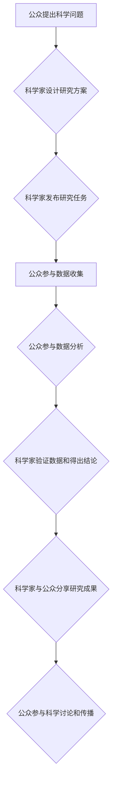

                 

## 公民科学：公众参与科学研究的新模式

> 关键词：公民科学、大众参与、科学研究、数据收集、人工智能、数据分析、科学普及

## 1. 背景介绍

科学研究，传统上被视为专业人士的领域，需要深厚的专业知识、昂贵的设备和漫长的研究周期。然而，随着科技的进步和互联网的普及，科学研究的边界正在逐渐扩展，公众参与科学研究的新模式——公民科学（Citizen Science）应运而生。

公民科学是指公众参与科学研究活动的广泛范畴，从简单的观测记录到复杂的实验设计和数据分析，公众可以以多种方式参与到科学研究中来。这种模式打破了传统科学研究的壁垒，让每个人都有机会参与到科学探索中，为科学研究提供新的视角和资源。

### 1.1  公民科学的兴起

公民科学的兴起与以下几个因素密切相关：

* **科技进步**:  互联网、移动设备和社交媒体等技术的进步，使得公众更容易获取科学信息、参与科学活动和与科学家交流。
* **数据爆炸**:  现代科学研究需要处理海量数据，而公民科学可以提供大量的人力资源，帮助科学家收集、整理和分析数据。
* **科学普及**:  公民科学可以提高公众对科学的兴趣和理解，促进科学知识的普及和传播。
* **社会责任**:  公众越来越意识到自己对环境、健康和社会发展等问题的责任，公民科学提供了一个参与解决这些问题的平台。

### 1.2  公民科学的意义

公民科学对科学研究、社会发展和个人成长都具有重要意义：

* **促进科学研究**:  公民科学可以为科学家提供大量的数据和资源，加速科学研究的进程，推动科学发现。
* **增强社会参与**:  公民科学让公众参与到科学研究中来，增强了公众对科学的理解和信任，促进社会对科学的重视。
* **提升个人能力**:  公民科学可以帮助公众学习科学知识、培养科学思维和解决问题的能力，促进个人成长。

## 2. 核心概念与联系

公民科学的核心概念包括：

* **参与**:  公众可以以多种方式参与科学研究，例如收集数据、分析数据、设计实验、传播科学知识等。
* **合作**:  公民科学强调公众与科学家之间的合作，科学家提供研究方向和指导，公众提供数据和人力资源。
* **开放**:  公民科学平台和数据通常是开放的，任何人都可以访问和利用。

**公民科学流程图**



## 3. 核心算法原理 & 具体操作步骤

公民科学平台通常需要利用一些算法来处理海量数据、匹配志愿者和研究项目、评估数据质量等。

### 3.1  算法原理概述

常见的公民科学平台算法包括：

* **数据挖掘算法**:  用于从海量数据中发现模式和趋势。
* **机器学习算法**:  用于自动分类、识别和预测数据。
* **推荐算法**:  用于匹配志愿者和研究项目，根据志愿者的兴趣和技能推荐合适的项目。

### 3.2  算法步骤详解

以数据挖掘算法为例，其步骤如下：

1. **数据收集**:  公民科学家收集数据，例如观测记录、图片、音频等。
2. **数据预处理**:  清理和转换数据，使其适合算法分析。
3. **特征提取**:  从数据中提取有意义的特征，例如时间、地点、物种等。
4. **模型训练**:  使用训练数据训练数据挖掘模型。
5. **模型评估**:  使用测试数据评估模型的性能。
6. **结果分析**:  分析模型的结果，发现数据中的模式和趋势。

### 3.3  算法优缺点

数据挖掘算法的优点包括：

* 可以从海量数据中发现隐藏的模式和趋势。
* 可以自动化数据分析过程，提高效率。

缺点包括：

* 需要大量的训练数据。
* 模型解释性较差，难以理解模型是如何得出结论的。

### 3.4  算法应用领域

数据挖掘算法在公民科学领域有广泛的应用，例如：

* **生物多样性研究**:  分析观测记录，识别物种分布和变化趋势。
* **气候变化研究**:  分析气象数据，监测气候变化趋势。
* **公共卫生研究**:  分析疾病数据，预测疾病流行趋势。

## 4. 数学模型和公式 & 详细讲解 & 举例说明

在公民科学中，数学模型和公式可以用于描述科学现象、预测研究结果、评估数据质量等。

### 4.1  数学模型构建

例如，在生物多样性研究中，可以使用物种丰富度指数来描述一个地区的物种多样性。物种丰富度指数的公式如下：

$$
S = \sum_{i=1}^{n} n_i
$$

其中：

* $S$ 是物种丰富度指数。
* $n_i$ 是第 $i$ 种物种的数量。
* $n$ 是总物种数。

### 4.2  公式推导过程

该公式的推导过程如下：

1. 首先，我们需要定义物种丰富度。物种丰富度是指一个地区内包含的物种数量。
2. 然后，我们可以将物种丰富度表示为所有物种数量的总和。
3. 因此，物种丰富度指数的公式为：$S = \sum_{i=1}^{n} n_i$。

### 4.3  案例分析与讲解

假设在一个地区，共有 5 种植物，分别有 10、8、5、3 和 2 个个体。那么，该地区的物种丰富度指数为：

$$
S = 10 + 8 + 5 + 3 + 2 = 28
$$

这意味着该地区包含 5 种植物，总共有 28 个个体。

## 5. 项目实践：代码实例和详细解释说明

以下是一个简单的公民科学项目代码实例，用于收集和分析鸟类观测数据。

### 5.1  开发环境搭建

* Python 3.x
* Jupyter Notebook
* Pandas
* Matplotlib

### 5.2  源代码详细实现

```python
import pandas as pd
import matplotlib.pyplot as plt

# 加载鸟类观测数据
data = pd.read_csv("bird_observations.csv")

# 计算不同物种的观测次数
species_counts = data["Species"].value_counts()

# 绘制条形图显示不同物种的观测次数
plt.bar(species_counts.index, species_counts.values)
plt.xlabel("物种")
plt.ylabel("观测次数")
plt.title("不同物种的观测次数")
plt.show()
```

### 5.3  代码解读与分析

* 该代码首先使用 Pandas 库加载鸟类观测数据。
* 然后，使用 `value_counts()` 方法计算不同物种的观测次数。
* 最后，使用 Matplotlib 库绘制条形图显示不同物种的观测次数。

### 5.4  运行结果展示

运行该代码后，将生成一个条形图，显示不同鸟类的观测次数。

## 6. 实际应用场景

公民科学已在多个领域取得了成功应用，例如：

* **生物多样性监测**:  例如，eBird 平台收集了全球数百万个鸟类观测记录，为科学家提供了宝贵的生物多样性数据。
* **气候变化研究**:  例如，ClimateWatch 平台收集了公众对植物和动物生长的观测记录，帮助科学家监测气候变化对生态系统的影响。
* **公共卫生监测**:  例如，Zooniverse 平台收集了公众对疾病传播的观测记录，帮助科学家预测疾病流行趋势。

### 6.4  未来应用展望

随着科技的进步和公众参与的增加，公民科学将在未来发挥更加重要的作用。

* **人工智能的应用**:  人工智能可以帮助公民科学平台自动处理数据、识别模式和预测结果，提高效率和准确性。
* **虚拟现实和增强现实的应用**:  虚拟现实和增强现实可以为公民科学家提供更身临其境的体验，提高参与度和兴趣。
* **跨学科合作**:  公民科学可以促进不同学科之间的合作，例如生物学、计算机科学、社会科学等，解决更复杂的问题。

## 7. 工具和资源推荐

### 7.1  学习资源推荐

* **Citizen Science Association**:  https://citizenscience.org/
* **Zooniverse**:  https://www.zooniverse.org/
* **SciStarter**:  https://scistarter.org/

### 7.2  开发工具推荐

* **Python**:  https://www.python.org/
* **Pandas**:  https://pandas.pydata.org/
* **Matplotlib**:  https://matplotlib.org/

### 7.3  相关论文推荐

* **Bonney, R., et al. (2014). Citizen science: A global endeavor. Trends in Ecology & Evolution, 29(1), 36-43.**
* **Dickinson, J. L., et al. (2010). Citizen science as an effective tool for ecological research and monitoring. Frontiers in Ecology and the Environment, 8(9), 392-397.**

## 8. 总结：未来发展趋势与挑战

### 8.1  研究成果总结

公民科学已成为科学研究的重要组成部分，为科学发现提供了新的视角和资源。

### 8.2  未来发展趋势

未来，公民科学将更加注重人工智能、虚拟现实和增强现实等技术的应用，推动公民科学平台的智能化、交互性和沉浸式体验。

### 8.3  面临的挑战

公民科学也面临一些挑战，例如：

* **数据质量**:  公民科学家收集的数据可能存在偏差或错误，需要进行严格的质量控制。
* **参与者动机**:  保持公民科学参与者的兴趣和参与度是一个持续的挑战。
* **伦理问题**:  公民科学涉及到个人隐私和数据安全等伦理问题，需要得到妥善的解决。

### 8.4  研究展望

未来，需要进一步研究公民科学的有效性、可持续性和伦理问题，为公民科学的发展提供理论和实践指导。

## 9. 附录：常见问题与解答

* **什么是公民科学？**

公民科学是指公众参与科学研究活动的广泛范畴，从简单的观测记录到复杂的实验设计和数据分析，公众可以以多种方式参与到科学研究中来。

* **公民科学有哪些优势？**

公民科学可以为科学家提供大量的数据和资源，加速科学研究的进程，推动科学发现。

* **如何参与公民科学？**

可以通过以下方式参与公民科学：

* 注册在线公民科学平台，例如 Zooniverse、SciStarter 等。
* 参加当地组织的公民科学活动。
* 利用手机应用程序收集科学数据。

* **公民科学的未来发展趋势是什么？**

未来，公民科学将更加注重人工智能、虚拟现实和增强现实等技术的应用，推动公民科学平台的智能化、交互性和沉浸式体验。


作者：禅与计算机程序设计艺术 / Zen and the Art of Computer Programming 
<end_of_turn>

