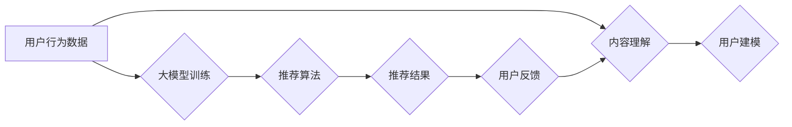

                 

## 大模型在音视频推荐中的创新应用

> 关键词：大模型、音视频推荐、Transformer、多模态学习、个性化推荐、内容理解、用户行为预测

## 1. 背景介绍

随着互联网的发展，音视频内容的爆炸式增长，用户对个性化、精准的音视频推荐需求日益强烈。传统的音视频推荐系统主要依赖于基于内容的推荐和基于协同过滤的推荐，但这些方法在面对海量数据和复杂用户偏好时，存在着一定的局限性。

大模型的出现为音视频推荐领域带来了新的机遇。大模型，指的是参数规模庞大、训练数据海量的人工智能模型，具备强大的泛化能力和学习能力。其在自然语言处理、图像识别等领域取得的突破性进展，为音视频推荐的创新应用提供了强大的技术支撑。

## 2. 核心概念与联系

### 2.1 音视频推荐系统

音视频推荐系统旨在根据用户的兴趣和偏好，推荐用户感兴趣的音视频内容。传统的音视频推荐系统主要包括以下几个模块：

* **数据采集与预处理:** 收集用户行为数据、音视频内容信息等，并进行清洗、转换、特征提取等预处理工作。
* **内容理解:** 对音视频内容进行分析，提取其文本、音频、视觉等特征，构建内容表示。
* **用户建模:** 建立用户画像，刻画用户的兴趣、偏好、行为等特征。
* **推荐算法:** 根据用户和内容的特征，预测用户对特定音视频内容的兴趣，并生成推荐列表。
* **评估与优化:** 对推荐结果进行评估，并根据评估结果优化推荐算法和系统参数。

### 2.2 大模型

大模型是指参数规模庞大、训练数据海量的人工智能模型。其特点包括：

* **参数规模:** 大模型通常拥有数十亿甚至数千亿个参数，使其能够学习到更复杂的模式和关系。
* **训练数据:** 大模型需要海量的数据进行训练，才能充分发挥其学习能力。
* **泛化能力:** 大模型在训练数据之外的未知数据上表现出色，具有较强的泛化能力。

### 2.3 多模态学习

多模态学习是指利用多种模态数据（如文本、图像、音频）进行联合学习，以提高模型的理解能力和预测精度。

**Mermaid 流程图**



## 3. 核心算法原理 & 具体操作步骤

### 3.1 算法原理概述

大模型在音视频推荐中的应用主要基于以下核心算法：

* **Transformer:** Transformer是一种基于注意力机制的神经网络架构，能够有效地处理序列数据，例如文本和音频。其强大的语义理解能力和长距离依赖建模能力，使其成为音视频推荐中的关键技术。
* **多模态融合:** 将文本、音频、视觉等多种模态数据进行融合，构建更全面的内容表示，提高推荐的准确性和个性化程度。

### 3.2 算法步骤详解

1. **数据预处理:** 收集用户行为数据、音视频内容信息等，并进行清洗、转换、特征提取等预处理工作。
2. **内容表示学习:** 利用Transformer模型对音视频内容进行编码，提取其文本、音频、视觉等特征，构建内容表示。
3. **用户行为建模:** 利用Transformer模型对用户行为数据进行编码，刻画用户的兴趣、偏好、行为等特征。
4. **多模态融合:** 将内容表示和用户行为表示进行融合，构建更全面的用户-内容交互表示。
5. **推荐模型训练:** 利用融合后的表示，训练推荐模型，预测用户对特定音视频内容的兴趣。
6. **推荐结果生成:** 根据训练好的推荐模型，生成推荐列表，并根据用户反馈进行优化。

### 3.3 算法优缺点

**优点:**

* **强大的语义理解能力:** Transformer模型能够有效地理解音视频内容的语义信息，提高推荐的准确性和个性化程度。
* **长距离依赖建模能力:** Transformer模型能够捕捉长距离的依赖关系，例如视频中不同场景之间的关联，提高内容理解的深度。
* **多模态融合能力:** 大模型能够融合多种模态数据，构建更全面的用户-内容交互表示，提高推荐的准确性和个性化程度。

**缺点:**

* **训练成本高:** 大模型的训练需要海量数据和强大的计算资源，成本较高。
* **模型复杂度高:** 大模型的结构复杂，调试和优化难度较大。
* **数据隐私问题:** 大模型的训练需要大量用户数据，如何保护用户隐私是一个重要的挑战。

### 3.4 算法应用领域

大模型在音视频推荐领域的应用前景广阔，可以应用于以下场景：

* **个性化推荐:** 根据用户的兴趣和偏好，推荐个性化的音视频内容。
* **内容发现:** 帮助用户发现新的、感兴趣的音视频内容。
* **内容分类:** 对音视频内容进行分类，例如电影、电视剧、音乐、游戏等。
* **内容摘要:** 自动生成音视频内容的摘要，帮助用户快速了解内容。
* **内容创作:** 利用大模型辅助内容创作，例如生成视频脚本、音乐旋律等。

## 4. 数学模型和公式 & 详细讲解 & 举例说明

### 4.1 数学模型构建

大模型在音视频推荐中的应用通常基于深度学习模型，例如Transformer模型。Transformer模型的核心是注意力机制，其数学模型可以表示为：

$$
Attention(Q, K, V) = \frac{exp(Q \cdot K^T / \sqrt{d_k})}{exp(Q \cdot K^T / \sqrt{d_k})} \cdot V
$$

其中：

* $Q$：查询矩阵
* $K$：键矩阵
* $V$：值矩阵
* $d_k$：键向量的维度

### 4.2 公式推导过程

注意力机制的核心思想是通过计算查询向量与键向量的相似度，来权衡不同键向量的贡献，从而得到最终的输出值。

公式推导过程如下：

1. 计算查询向量与每个键向量的点积，得到一个分数向量。
2. 对分数向量进行softmax归一化，得到每个键向量的权重。
3. 将权重与值向量进行加权求和，得到最终的输出值。

### 4.3 案例分析与讲解

例如，在视频推荐场景中，可以将视频的文本描述作为查询向量，视频的视觉特征作为键向量，视频的音频特征作为值向量。通过注意力机制，可以计算出每个视频视觉特征与文本描述的相似度，从而权衡不同视频的视觉特征对推荐的影响。

## 5. 项目实践：代码实例和详细解释说明

### 5.1 开发环境搭建

* **操作系统:** Linux
* **编程语言:** Python
* **深度学习框架:** TensorFlow 或 PyTorch
* **其他工具:** Git、Docker

### 5.2 源代码详细实现

```python
# 使用 TensorFlow 实现 Transformer 模型
import tensorflow as tf

# 定义 Transformer 模型
class Transformer(tf.keras.Model):
    def __init__(self, vocab_size, embedding_dim, num_heads, num_layers):
        super(Transformer, self).__init__()
        self.embedding = tf.keras.layers.Embedding(vocab_size, embedding_dim)
        self.transformer_layers = tf.keras.layers.StackedRNNCells([
            tf.keras.layers.MultiHeadAttention(num_heads=num_heads, key_dim=embedding_dim)
            for _ in range(num_layers)
        ])
        self.fc = tf.keras.layers.Dense(vocab_size)

    def call(self, inputs):
        embeddings = self.embedding(inputs)
        outputs = self.transformer_layers(embeddings)
        outputs = self.fc(outputs)
        return outputs

# 实例化 Transformer 模型
model = Transformer(vocab_size=10000, embedding_dim=128, num_heads=8, num_layers=6)

# 训练模型
model.compile(optimizer='adam', loss='sparse_categorical_crossentropy', metrics=['accuracy'])
model.fit(x_train, y_train, epochs=10)
```

### 5.3 代码解读与分析

* **模型定义:** 代码定义了一个名为`Transformer`的类，该类继承自`tf.keras.Model`，实现了Transformer模型的结构。
* **嵌入层:** `embedding`层将输入的词语索引转换为词向量。
* **Transformer层:** `transformer_layers`层是一个堆叠的`MultiHeadAttention`层，用于捕捉文本序列中的长距离依赖关系。
* **全连接层:** `fc`层将Transformer层的输出映射到输出空间。
* **模型训练:** 代码使用`model.compile()`方法配置模型的训练参数，并使用`model.fit()`方法训练模型。

### 5.4 运行结果展示

训练完成后，可以将模型应用于音视频推荐场景，例如预测用户对特定视频的兴趣评分。

## 6. 实际应用场景

### 6.1 个性化推荐

大模型可以根据用户的观看历史、点赞记录、评论内容等信息，构建用户的兴趣画像，并推荐个性化的音视频内容。例如，如果用户经常观看科幻电影，大模型可以推荐其他科幻电影、科幻电视剧等。

### 6.2 内容发现

大模型可以帮助用户发现新的、感兴趣的音视频内容。例如，可以根据用户的兴趣偏好，推荐与用户观看历史相关的热门视频、新上映的电影等。

### 6.3 内容分类

大模型可以对音视频内容进行分类，例如电影、电视剧、音乐、游戏等。例如，可以利用大模型对视频内容进行分析，判断其属于哪一类，并进行相应的推荐。

### 6.4 未来应用展望

大模型在音视频推荐领域的应用前景广阔，未来可以应用于以下场景：

* **跨模态推荐:** 将文本、音频、视觉等多种模态数据进行融合，构建更全面的用户-内容交互表示，提高推荐的准确性和个性化程度。
* **动态推荐:** 根据用户的实时行为和上下文信息，动态调整推荐内容，提供更精准的推荐体验。
* **生成式推荐:** 利用大模型生成新的音视频内容，例如推荐个性化的视频剪辑、音乐混音等。

## 7. 工具和资源推荐

### 7.1 学习资源推荐

* **书籍:**
    * 《深度学习》 by Ian Goodfellow, Yoshua Bengio, Aaron Courville
    * 《自然语言处理》 by Dan Jurafsky, James H. Martin
* **在线课程:**
    * Coursera: Deep Learning Specialization
    * Stanford CS224N: Natural Language Processing with Deep Learning

### 7.2 开发工具推荐

* **深度学习框架:** TensorFlow, PyTorch
* **自然语言处理库:** NLTK, spaCy
* **图像处理库:** OpenCV

### 7.3 相关论文推荐

* **Attention Is All You Need:** https://arxiv.org/abs/1706.03762
* **BERT: Pre-training of Deep Bidirectional Transformers for Language Understanding:** https://arxiv.org/abs/1810.04805

## 8. 总结：未来发展趋势与挑战

### 8.1 研究成果总结

大模型在音视频推荐领域取得了显著的成果，例如：

* **提高推荐准确率:** 大模型能够更好地理解用户和内容的语义信息，提高推荐的准确率。
* **增强个性化推荐:** 大模型能够根据用户的兴趣偏好，提供更个性化的推荐内容。
* **拓展推荐场景:** 大模型可以应用于多种音视频推荐场景，例如个性化推荐、内容发现、内容分类等。

### 8.2 未来发展趋势

* **跨模态融合:** 将文本、音频、视觉等多种模态数据进行融合，构建更全面的用户-内容交互表示。
* **动态推荐:** 根据用户的实时行为和上下文信息，动态调整推荐内容。
* **生成式推荐:** 利用大模型生成新的音视频内容，例如推荐个性化的视频剪辑、音乐混音等。
* **可解释性:** 研究大模型的决策过程，提高推荐结果的可解释性。

### 8.3 面临的挑战

* **训练成本高:** 大模型的训练需要海量数据和强大的计算资源，成本较高。
* **模型复杂度高:** 大模型的结构复杂，调试和优化难度较大。
* **数据隐私问题:** 大模型的训练需要大量用户数据，如何保护用户隐私是一个重要的挑战。

### 8.4 研究展望

未来，大模型在音视频推荐领域将继续发挥重要作用，并推动音视频推荐技术的发展。研究者需要不断探索新的算法、模型和应用场景，以解决大模型面临的挑战，并将其应用于更多实际场景。

## 9. 附录：常见问题与解答

**Q1: 大模型的训练需要多少数据？**

A1: 大模型的训练需要海量数据，通常需要数十亿甚至数千亿个数据点。

**Q2: 大模型的训练需要多少计算资源？**

A2: 大模型的训练需要强大的计算资源，通常需要使用分布式训练平台和高性能计算集群。

**Q3: 如何保护用户隐私？**

A3: 在训练大模型时，需要采取措施保护用户隐私，例如数据脱敏、联邦学习等。


作者：禅与计算机程序设计艺术 / Zen and the Art of Computer Programming 
<end_of_turn>

