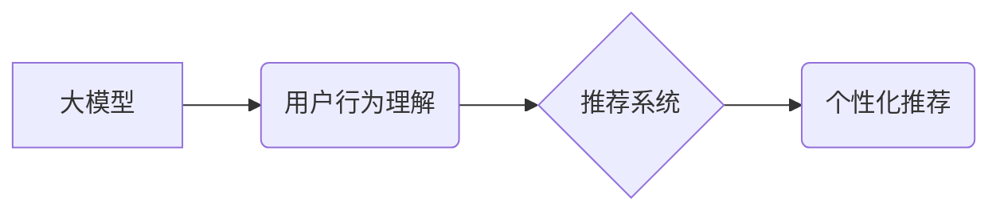

                 

## 大模型对推荐系统用户行为理解的深化

> 关键词：大模型、推荐系统、用户行为理解、深度学习、Transformer、个性化推荐

## 1. 背景介绍

推荐系统作为互联网时代的重要组成部分，旨在根据用户的历史行为、偏好和上下文信息，预测用户可能感兴趣的内容并提供个性化的推荐。传统的推荐系统主要依赖于协同过滤、内容过滤和基于规则等方法，但这些方法在面对海量数据和复杂用户行为时，往往难以有效地捕捉用户细粒度的兴趣和需求。

近年来，深度学习技术的快速发展为推荐系统带来了新的机遇。大模型，作为深度学习领域的重要突破，凭借其强大的学习能力和泛化能力，在理解用户行为、挖掘潜在兴趣和个性化推荐方面展现出巨大的潜力。

## 2. 核心概念与联系

### 2.1 大模型

大模型是指参数规模庞大、训练数据海量、训练成本高昂的深度学习模型。与传统深度学习模型相比，大模型拥有更强的表达能力和泛化能力，能够学习到更复杂的模式和关系。

### 2.2 推荐系统

推荐系统旨在根据用户的历史行为、偏好和上下文信息，预测用户可能感兴趣的内容并提供个性化的推荐。

### 2.3 用户行为理解

用户行为理解是指通过分析用户的行为数据，例如点击、浏览、购买等，挖掘用户的兴趣、偏好和需求，从而为推荐系统提供更精准的用户画像。

**核心概念与联系流程图:**



## 3. 核心算法原理 & 具体操作步骤

### 3.1 算法原理概述

大模型在推荐系统中主要通过以下两种方式实现用户行为理解和个性化推荐：

* **语义表示学习:** 利用大模型的强大的语言理解能力，将用户行为数据和物品信息转化为语义向量，从而捕捉用户兴趣和物品属性之间的潜在关系。
* **序列建模:** 利用大模型的序列建模能力，学习用户行为序列中的隐含模式和规律，预测用户未来的行为和偏好。

### 3.2 算法步骤详解

1. **数据预处理:** 收集用户行为数据、物品信息等数据，进行清洗、格式化和特征提取。
2. **语义表示学习:** 利用大模型训练语义嵌入模型，将用户行为数据和物品信息映射到低维语义空间。
3. **序列建模:** 利用大模型训练序列建模模型，学习用户行为序列中的隐含模式和规律。
4. **推荐模型训练:** 基于语义表示和序列建模结果，训练推荐模型，预测用户对特定物品的兴趣评分或点击概率。
5. **个性化推荐:** 根据用户特征和模型预测结果，为用户提供个性化的推荐列表。

### 3.3 算法优缺点

**优点:**

* **强大的学习能力:** 大模型能够学习到更复杂的模式和关系，提升用户行为理解的精度。
* **泛化能力强:** 大模型在不同领域和数据集上表现良好，具有较强的泛化能力。
* **个性化推荐:** 大模型能够根据用户的细粒度兴趣和需求，提供更精准的个性化推荐。

**缺点:**

* **训练成本高:** 大模型的训练需要大量的计算资源和时间成本。
* **数据依赖性强:** 大模型的性能依赖于训练数据的质量和规模。
* **解释性差:** 大模型的决策过程较为复杂，难以解释其推荐结果背后的逻辑。

### 3.4 算法应用领域

大模型在推荐系统领域有着广泛的应用，例如：

* **电商推荐:** 为用户推荐商品、优惠券和促销活动。
* **内容推荐:** 为用户推荐新闻、视频、音乐和书籍等内容。
* **社交推荐:** 为用户推荐朋友、群组和活动。
* **广告推荐:** 为用户推荐相关的广告和营销信息。

## 4. 数学模型和公式 & 详细讲解 & 举例说明

### 4.1 数学模型构建

大模型在推荐系统中的应用通常基于以下数学模型：

* **协同过滤模型:** 基于用户的历史行为数据，预测用户对特定物品的兴趣评分。
* **内容过滤模型:** 基于物品的特征信息，预测用户对特定物品的兴趣评分。
* **深度学习模型:** 利用深度神经网络，学习用户行为数据和物品信息之间的复杂关系，预测用户对特定物品的兴趣评分。

### 4.2 公式推导过程

**协同过滤模型:**

假设用户 $u$ 对物品 $i$ 的评分为 $r_{ui}$，则协同过滤模型的目标是学习一个评分预测函数 $f(u, i)$，使得 $f(u, i)$ 尽可能接近 $r_{ui}$。

常用的协同过滤模型包括基于用户的协同过滤和基于物品的协同过滤。

**基于用户的协同过滤:**

$$
f(u, i) = \sum_{v \in N(u)} \frac{sim(u, v) \cdot r_{v i}}{\sum_{w \in N(u)} sim(u, w)}
$$

其中，$N(u)$ 表示与用户 $u$ 相似的用户集合，$sim(u, v)$ 表示用户 $u$ 和用户 $v$ 之间的相似度。

**基于物品的协同过滤:**

$$
f(u, i) = \frac{\sum_{v \in N(i)} sim(i, v) \cdot r_{uv}}{\sum_{w \in N(i)} sim(i, w)}
$$

其中，$N(i)$ 表示与物品 $i$ 相似的物品集合，$sim(i, v)$ 表示物品 $i$ 和物品 $v$ 之间的相似度。

### 4.3 案例分析与讲解

假设我们有一个电商平台，用户 $u$ 对商品 $i$ 的评分为 $r_{ui}$。我们可以利用协同过滤模型预测用户 $u$ 对其他商品 $j$ 的评分。

如果用户 $u$ 和用户 $v$ 的评分相似度较高，则可以认为用户 $u$ 和用户 $v$ 的兴趣相近。因此，我们可以利用用户 $v$ 对商品 $j$ 的评分来预测用户 $u$ 对商品 $j$ 的评分。

## 5. 项目实践：代码实例和详细解释说明

### 5.1 开发环境搭建

推荐系统开发环境通常包括以下软件：

* **Python:** 作为推荐系统开发的主要编程语言。
* **深度学习框架:** 例如 TensorFlow、PyTorch 等，用于构建和训练大模型。
* **数据处理工具:** 例如 Pandas、NumPy 等，用于数据预处理和分析。
* **云计算平台:** 例如 AWS、Azure 等，用于提供计算资源和存储空间。

### 5.2 源代码详细实现

以下是一个使用 PyTorch 构建基于 Transformer 的推荐系统的代码示例：

```python
import torch
import torch.nn as nn

class TransformerRecommender(nn.Module):
    def __init__(self, embedding_dim, num_heads, num_layers):
        super(TransformerRecommender, self).__init__()
        self.embedding = nn.Embedding(num_users, embedding_dim)
        self.transformer = nn.Transformer(embedding_dim, num_heads, num_layers)
        self.fc = nn.Linear(embedding_dim, 1)

    def forward(self, user_ids, item_ids):
        user_embeddings = self.embedding(user_ids)
        item_embeddings = self.embedding(item_ids)
        output = self.transformer(user_embeddings, item_embeddings)
        scores = self.fc(output)
        return scores

# ... 其他代码 ...
```

### 5.3 代码解读与分析

该代码定义了一个基于 Transformer 的推荐模型，包括以下部分：

* **embedding 层:** 将用户 ID 和物品 ID 映射到低维向量空间。
* **Transformer 层:** 利用 Transformer 架构学习用户行为序列中的隐含模式和规律。
* **全连接层:** 将 Transformer 输出映射到评分预测结果。

### 5.4 运行结果展示

运行该代码后，可以得到用户对不同物品的评分预测结果，并进行评估和优化。

## 6. 实际应用场景

### 6.1 电商推荐

大模型在电商推荐系统中可以实现以下功能:

* **商品推荐:** 根据用户的历史购买记录、浏览记录和购物车内容，推荐用户可能感兴趣的商品。
* **个性化优惠券推荐:** 根据用户的消费习惯和偏好，推荐个性化的优惠券和促销活动。
* **跨境电商推荐:** 根据用户的语言、地理位置和文化背景，推荐跨境电商平台上的商品。

### 6.2 内容推荐

大模型在内容推荐系统中可以实现以下功能:

* **新闻推荐:** 根据用户的阅读历史、关注领域和兴趣标签，推荐个性化的新闻内容。
* **视频推荐:** 根据用户的观看历史、点赞记录和评论内容，推荐个性化的视频内容。
* **音乐推荐:** 根据用户的播放历史、收藏歌曲和音乐风格偏好，推荐个性化的音乐内容。

### 6.3 社交推荐

大模型在社交推荐系统中可以实现以下功能:

* **朋友推荐:** 根据用户的社交关系网络、共同兴趣和行为相似度，推荐潜在的朋友。
* **群组推荐:** 根据用户的兴趣爱好、职业背景和社交需求，推荐合适的群组。
* **活动推荐:** 根据用户的兴趣爱好、地理位置和时间安排，推荐相关的活动和聚会。

### 6.4 未来应用展望

大模型在推荐系统领域的应用前景广阔，未来可能在以下方面取得突破:

* **更精准的个性化推荐:** 利用大模型学习用户更细粒度的兴趣和需求，提供更精准的个性化推荐。
* **跨模态推荐:** 将文本、图像、音频等多种模态信息融合，实现更丰富的推荐体验。
* **解释性推荐:** 提升大模型的解释性，让用户能够理解推荐结果背后的逻辑。
* **联邦学习推荐:** 利用联邦学习技术，保护用户隐私的同时实现大规模数据训练，提升推荐系统的性能。

## 7. 工具和资源推荐

### 7.1 学习资源推荐

* **书籍:**
    * Deep Learning by Ian Goodfellow, Yoshua Bengio, and Aaron Courville
    * Natural Language Processing with PyTorch by Yoav Goldberg
* **课程:**
    * Stanford CS224N: Natural Language Processing with Deep Learning
    * DeepLearning.AI TensorFlow Specialization

### 7.2 开发工具推荐

* **深度学习框架:** TensorFlow、PyTorch、JAX
* **数据处理工具:** Pandas、NumPy、Scikit-learn
* **云计算平台:** AWS、Azure、Google Cloud Platform

### 7.3 相关论文推荐

* **BERT: Pre-training of Deep Bidirectional Transformers for Language Understanding**
* **GPT-3: Language Models are Few-Shot Learners**
* **Transformer-XL: Attentive Language Models Beyond a Fixed-Length Context**

## 8. 总结：未来发展趋势与挑战

### 8.1 研究成果总结

大模型在推荐系统领域取得了显著的成果，例如：

* **提升推荐精度:** 大模型能够学习到更复杂的模式和关系，提升推荐系统的准确率和召回率。
* **个性化推荐:** 大模型能够根据用户的细粒度兴趣和需求，提供更精准的个性化推荐。
* **跨模态推荐:** 大模型能够融合文本、图像、音频等多种模态信息，实现更丰富的推荐体验。

### 8.2 未来发展趋势

未来，大模型在推荐系统领域将继续朝着以下方向发展:

* **更强大的模型架构:** 研究更强大的模型架构，例如多模态 Transformer、自监督学习等，提升模型的学习能力和泛化能力。
* **更精准的用户画像:** 利用大模型学习更精准的用户画像，包括用户的兴趣、偏好、行为模式等，为推荐系统提供更丰富的用户信息。
* **更解释性的推荐:** 提升大模型的解释性，让用户能够理解推荐结果背后的逻辑，增强用户对推荐系统的信任度。
* **更安全的推荐:** 研究如何利用大模型构建更安全的推荐系统，防止推荐结果被恶意攻击或操纵。

### 8.3 面临的挑战

大模型在推荐系统领域也面临着一些挑战:

* **训练成本高:** 大模型的训练需要大量的计算资源和时间成本，这对资源有限的机构和个人来说是一个挑战。
* **数据依赖性强:** 大模型的性能依赖于训练数据的质量和规模，缺乏高质量数据的机构和个人难以充分利用大模型的优势。
* **解释性差:** 大模型的决策过程较为复杂，难以解释其推荐结果背后的逻辑，这可能会导致用户对推荐结果的信任度降低。
* **公平性问题:** 大模型可能会学习到用户的偏见和歧视，导致推荐结果不公平，需要研究如何解决大模型的公平性问题。

### 8.4 研究展望

未来，大模型在推荐系统领域的研究将继续深入，探索更强大的模型架构、更精准的用户画像、更解释性的推荐和更安全的推荐，为用户提供更个性化、更精准、更安全的推荐体验。

## 9. 附录：常见问题与解答

**Q1: 大模型的训练需要多少计算资源？**

A1: 大模型的训练需要大量的计算资源，例如 GPU、TPU 等。具体需要的计算资源取决于模型的规模、训练数据的大小和训练时间。

**Q2: 如何评估大模型在推荐系统中的性能？**

A2: 大模型在推荐系统中的性能通常通过以下指标进行评估:

* **准确率:** 推荐结果与真实用户行为的匹配程度。
* **召回率:** 推荐系统能够召回真实用户感兴趣的物品的比例。
* **点击率:** 用户点击推荐结果的比例。
* **转化率:** 用户通过推荐结果完成购买或其他目标行为的比例。

**Q3: 如何解决大模型的解释性问题？**

A3: 提升大模型的解释性可以通过以下方法:

* **使用可解释的模型架构:** 例如线性模型、决策树等。
* **利用注意力机制:** 分析大模型在预测结果中关注哪些输入特征。
* **生成模型解释:** 利用模型生成解释性文本，解释推荐结果背后的逻辑。

**Q4: 如何解决大模型的公平性问题？**

A4: 解决大模型的公平性问题可以通过以下方法:

* **使用公平性约束:** 在模型训练过程中加入公平性约束，防止模型学习到用户的偏见和歧视。
* **数据预处理:** 对训练数据进行预处理，消除潜在的偏见和歧视。
* **模型评估:** 对模型进行公平性评估，识别和解决模型中的公平性问题。


作者：禅与计算机程序设计艺术 / Zen and the Art of Computer Programming<end_of_turn>

