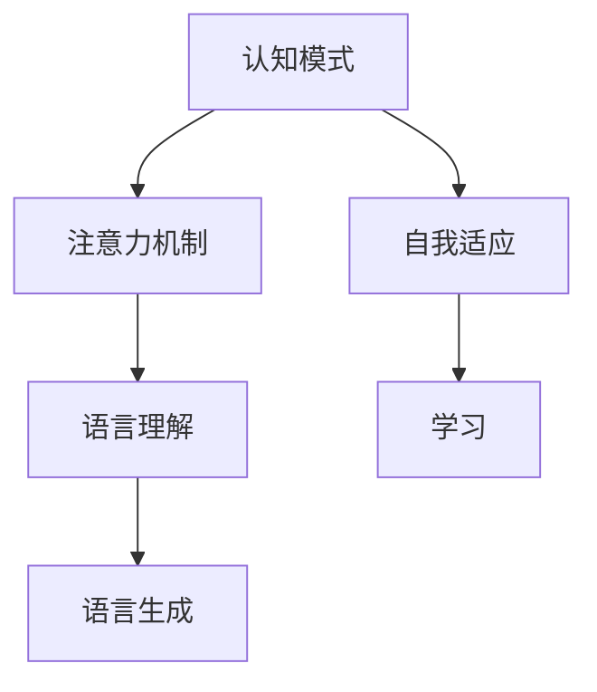

                 

# 注意力编程工作坊：AI定制的认知模式设计

> 关键词：注意力编程, 认知模式, AI定制, 神经网络, 图灵奖, 认知科学

## 1. 背景介绍

### 1.1 问题由来
在人工智能(AI)发展的今天，神经网络已经成为了构建智能系统的核心工具。然而，传统的神经网络编程范式，往往缺乏对认知科学和心理学原理的关注。这导致许多AI模型在解释性、可控性、普适性方面存在不足，难以与人类智能相匹配。

为了弥合这一差距，“注意力编程”成为了一个前沿的研究方向。注意力编程（Attention Programming）是一种将认知科学和心理学原理与神经网络编程相结合的范式，旨在设计出更加智能、可解释、可控的AI系统。

本文将全面介绍注意力编程的概念、原理和应用，重点讲解如何通过认知模式设计，提升AI系统的智能程度。

### 1.2 问题核心关键点
注意力编程的核心在于将认知科学和心理学原理引入神经网络编程。通过构建基于认知科学模型的神经网络，AI系统能够更贴近人类智能的认知模式，具备更强的语义理解和生成能力。

主要核心关键点包括：
- 认知模式设计
- 注意力机制
- 语言理解与生成
- 自我适应与学习

## 2. 核心概念与联系

### 2.1 核心概念概述

为更好地理解注意力编程，本节将介绍几个密切相关的核心概念：

- 认知模式（Cognitive Mode）：指人类大脑在进行各种认知活动时所采用的基本模式。包括感知、记忆、推理、决策等多个方面。
- 注意力机制（Attention Mechanism）：指神经网络中模拟人类注意力的机制，用于选择输入的关注区域，提高处理效率。
- 语言理解（Language Understanding）：指AI系统理解自然语言输入的能力，包括语义理解、逻辑推理等多个层次。
- 语言生成（Language Generation）：指AI系统能够根据任务需求生成符合语法、语义规范的自然语言输出。
- 自我适应（Self-Adaptation）：指AI系统能够在执行任务过程中，根据反馈调整内部参数，提升性能。
- 学习（Learning）：指AI系统通过数据训练，不断优化内部模型，提高智能程度。

这些核心概念之间的逻辑关系可以通过以下Mermaid流程图来展示：



这个流程图展示了一些核心概念的关联关系：

1. 认知模式是注意力编程的基础，指导注意力机制的设计。
2. 注意力机制用于提高语言理解的效率和准确性，为语言生成提供支持。
3. 语言理解是AI系统理解输入的基础，语言生成是其输出表达的关键。
4. 自我适应和学习的循环，不断提升AI系统的智能程度，实现更高层次的认知任务。

## 3. 核心算法原理 & 具体操作步骤
### 3.1 算法原理概述

注意力编程的核心思想是将认知模式与神经网络编程相结合，构建基于认知科学模型的AI系统。通过认知模式设计，AI系统能够更好地模拟人类智能的运作方式，具备更强的语义理解和生成能力。

形式化地，假设AI系统 $S$ 的认知模式为 $C$，其输入为 $I$，输出为 $O$。注意力编程的目标是构建一个认知模型 $M_C$，使得：

$$
S = M_C(I) = C \circ O
$$

其中 $\circ$ 表示认知模式与输出数据的结合方式。在具体应用中，通常使用Transformer模型作为 $M_C$，通过注意力机制和位置编码等方式，实现对输入数据的智能处理。

### 3.2 算法步骤详解

注意力编程通常包括以下几个关键步骤：

**Step 1: 设计认知模式**

- 根据任务需求，选择或设计合适的认知模式。例如，对于问答任务，可以选择基于记忆的认知模式；对于生成任务，可以选择基于推理的认知模式。
- 确定认知模式的具体参数和组件，如感知器、记忆库、推理规则等。

**Step 2: 构建神经网络模型**

- 选择合适的神经网络模型，如Transformer、RNN等，根据认知模式设计相应的结构。例如，对于记忆型认知模式，可以使用Transformer的结构。
- 在神经网络中添加注意力机制，用于选择输入的关注区域，提高处理效率。

**Step 3: 训练模型**

- 收集标注数据，定义任务适配层，选择适当的损失函数。
- 使用标注数据训练模型，调整参数以最小化损失函数。
- 应用正则化技术，防止模型过拟合。

**Step 4: 评估与部署**

- 在测试集上评估模型的性能，对比训练前后的精度提升。
- 将训练好的模型集成到实际应用系统中，进行部署和优化。
- 持续收集新的数据，定期重新训练模型，以适应数据分布的变化。

以上是注意力编程的一般流程。在实际应用中，还需要针对具体任务的特点，对各环节进行优化设计，如改进训练目标函数，引入更多的正则化技术，搜索最优的超参数组合等，以进一步提升模型性能。

### 3.3 算法优缺点

注意力编程具有以下优点：

1. 提升智能程度：通过认知模式设计，使AI系统更贴近人类智能的运作方式，具备更强的语义理解和生成能力。
2. 提高可解释性：认知模式提供了更清晰的行为逻辑，便于对AI系统的推理和决策过程进行分析和解释。
3. 增强普适性：通过设计通用的认知模式，使AI系统能够应用于更广泛的任务和场景。
4. 实现自适应：通过自我适应机制，使AI系统能够根据反馈不断调整内部参数，提升性能。

同时，该方法也存在一定的局限性：

1. 模型复杂度高：认知模式设计需要综合考虑多个心理学和认知科学的原理，设计出的模型较为复杂，难以理解和调试。
2. 数据需求量大：认知模式设计需要大量的标注数据进行训练，获取高质量标注数据的成本较高。
3. 训练时间长：认知模式设计的神经网络通常较大，训练时间较长。
4. 泛化能力有限：认知模式设计的模型可能过于特定化，对新数据泛化能力不足。

尽管存在这些局限性，但就目前而言，注意力编程方法在构建智能系统方面具有重要的参考价值。未来相关研究的重点在于如何进一步降低认知模式设计的复杂度，提高模型的泛化能力，同时兼顾可解释性和伦理安全性等因素。

### 3.4 算法应用领域

注意力编程已经在多个领域得到了应用，取得了不错的效果：

- 自然语言处理（NLP）：通过认知模式设计，实现语言理解与生成任务。例如，问答系统、文本摘要、机器翻译等。
- 机器人控制：通过认知模式设计，使机器人能够模拟人类的认知和行为。例如，路径规划、任务执行等。
- 智能推荐：通过认知模式设计，实现智能推荐系统的个性化推荐。例如，电商推荐、音乐推荐等。
- 游戏AI：通过认知模式设计，使游戏AI具备更强的策略和决策能力。例如，实时对战、复杂策略等。
- 心理学研究：通过认知模式设计，构建认知实验模拟系统，用于心理学的研究和验证。

除了上述这些经典应用外，注意力编程还被创新性地应用到更多场景中，如可控文本生成、多模态信息融合、常识推理等，为AI技术带来了全新的突破。随着认知科学和神经网络技术的不断进步，相信注意力编程方法将成为构建智能系统的重要范式，推动AI技术向更加智能和普适的方向发展。

## 4. 数学模型和公式 & 详细讲解 & 举例说明
### 4.1 数学模型构建

本节将使用数学语言对注意力编程的过程进行更加严格的刻画。

假设AI系统 $S$ 的认知模式为 $C$，其输入为 $I$，输出为 $O$。在神经网络中，认知模式 $C$ 通常由多个组件组成，如感知器 $P$、记忆库 $M$、推理规则 $R$ 等。

形式化地，认知模式 $C$ 可以表示为：

$$
C = P \circ M \circ R
$$

其中，感知器 $P$ 用于输入数据的编码，记忆库 $M$ 用于存储和检索信息，推理规则 $R$ 用于根据输入和存储信息进行决策和推理。

### 4.2 公式推导过程

以下我们以问答系统为例，推导注意力编程的数学模型及其推导过程。

假设问答系统的输入为自然语言问题 $Q$，输出为问题答案 $A$。认知模式 $C$ 设计如下：

1. 感知器 $P$：将自然语言问题 $Q$ 编码成向量形式 $q$。
2. 记忆库 $M$：检索存储在记忆库中的知识信息 $k$。
3. 推理规则 $R$：根据问题 $Q$ 和知识信息 $k$，推理得出答案 $a$。

在神经网络中，这些组件可以表示为多个神经网络层。假设使用Transformer模型，则认知模式 $C$ 可以表示为：

$$
C = P \circ M \circ R = \text{Encoder}(Q) \circ \text{Memory}(k) \circ \text{Decoder}(a)
$$

其中，$\text{Encoder}$ 表示输入编码器，$\text{Memory}$ 表示记忆库，$\text{Decoder}$ 表示输出解码器。

设 $\text{Encoder}$ 的参数为 $\theta_E$，$\text{Memory}$ 的参数为 $\theta_M$，$\text{Decoder}$ 的参数为 $\theta_D$。则认知模式 $C$ 的输出可以表示为：

$$
a = \text{Decoder}(a|q, k) = R(\text{Encoder}(q), \text{Memory}(k))
$$

在实际应用中，认知模式 $C$ 的训练过程与一般的神经网络相似。通过定义合适的损失函数，使用标注数据训练神经网络，调整参数以最小化损失函数。训练过程中，通常会应用正则化技术，如L2正则、Dropout、Early Stopping等，防止模型过拟合。

### 4.3 案例分析与讲解

以一个简单的问答系统为例，展示注意力编程的应用过程。

假设问答系统需要回答一个问题：“1970年7月20日发生了什么？”

1. 感知器 $P$：将问题 $Q$ 编码成向量形式 $q$。

$$
q = \text{Encoder}(Q) = \text{Transformer}(Q)
$$

2. 记忆库 $M$：检索存储在记忆库中的知识信息 $k$。

$$
k = \text{Memory}(\text{Event} \rightarrow \text{1970-07-20})
$$

其中，$\text{Event} \rightarrow \text{1970-07-20}$ 表示存储在记忆库中的事件信息。

3. 推理规则 $R$：根据问题 $Q$ 和知识信息 $k$，推理得出答案 $a$。

$$
a = \text{Decoder}(a|q, k) = \text{Transformer}(a|q, k)
$$

其中，$\text{Transformer}$ 表示使用Transformer模型进行推理。

最终的答案是：“1970年7月20日，人类首次登月成功。”

这个例子展示了注意力编程的基本应用流程。在实际应用中，认知模式设计需要根据具体任务进行灵活调整，确保模型的准确性和泛化能力。

## 5. 项目实践：代码实例和详细解释说明
### 5.1 开发环境搭建

在进行注意力编程实践前，我们需要准备好开发环境。以下是使用Python进行PyTorch开发的环境配置流程：

1. 安装Anaconda：从官网下载并安装Anaconda，用于创建独立的Python环境。

2. 创建并激活虚拟环境：
```bash
conda create -n attention-env python=3.8 
conda activate attention-env
```

3. 安装PyTorch：根据CUDA版本，从官网获取对应的安装命令。例如：
```bash
conda install pytorch torchvision torchaudio cudatoolkit=11.1 -c pytorch -c conda-forge
```

4. 安装相关库：
```bash
pip install transformers sklearn pandas matplotlib tqdm jupyter notebook ipython
```

完成上述步骤后，即可在`attention-env`环境中开始注意力编程实践。

### 5.2 源代码详细实现

下面我们以问答系统为例，给出使用Transformers库对认知模式进行注意力编程的PyTorch代码实现。

首先，定义问答系统的数据处理函数：

```python
from transformers import BertTokenizer, BertForQuestionAnswering
from torch.utils.data import Dataset
import torch

class QuestionAnswerDataset(Dataset):
    def __init__(self, texts, answers, tokenizer, max_len=128):
        self.texts = texts
        self.answers = answers
        self.tokenizer = tokenizer
        self.max_len = max_len
        
    def __len__(self):
        return len(self.texts)
    
    def __getitem__(self, item):
        text = self.texts[item]
        answer = self.answers[item]
        
        encoding = self.tokenizer(text, return_tensors='pt', max_length=self.max_len, padding='max_length', truncation=True)
        input_ids = encoding['input_ids'][0]
        attention_mask = encoding['attention_mask'][0]
        
        # 对答案进行编码
        answer_tokens = [answer] * len(input_ids)
        answer_ids = torch.tensor(self.tokenizer(answer, return_tensors='pt', padding='max_length', truncation=True)["input_ids"][0], dtype=torch.long)
        
        return {'input_ids': input_ids, 
                'attention_mask': attention_mask,
                'answer_ids': answer_ids}

# 创建dataset
tokenizer = BertTokenizer.from_pretrained('bert-base-cased')

train_dataset = QuestionAnswerDataset(train_texts, train_answers, tokenizer)
dev_dataset = QuestionAnswerDataset(dev_texts, dev_answers, tokenizer)
test_dataset = QuestionAnswerDataset(test_texts, test_answers, tokenizer)
```

然后，定义模型和优化器：

```python
from transformers import BertForQuestionAnswering, AdamW

model = BertForQuestionAnswering.from_pretrained('bert-base-cased', num_labels=len(tag2id))

optimizer = AdamW(model.parameters(), lr=2e-5)
```

接着，定义训练和评估函数：

```python
from torch.utils.data import DataLoader
from tqdm import tqdm
from sklearn.metrics import classification_report

device = torch.device('cuda') if torch.cuda.is_available() else torch.device('cpu')
model.to(device)

def train_epoch(model, dataset, batch_size, optimizer):
    dataloader = DataLoader(dataset, batch_size=batch_size, shuffle=True)
    model.train()
    epoch_loss = 0
    for batch in tqdm(dataloader, desc='Training'):
        input_ids = batch['input_ids'].to(device)
        attention_mask = batch['attention_mask'].to(device)
        answer_ids = batch['answer_ids'].to(device)
        model.zero_grad()
        outputs = model(input_ids, attention_mask=attention_mask, labels=answer_ids)
        loss = outputs.loss
        epoch_loss += loss.item()
        loss.backward()
        optimizer.step()
    return epoch_loss / len(dataloader)

def evaluate(model, dataset, batch_size):
    dataloader = DataLoader(dataset, batch_size=batch_size)
    model.eval()
    preds, labels = [], []
    with torch.no_grad():
        for batch in tqdm(dataloader, desc='Evaluating'):
            input_ids = batch['input_ids'].to(device)
            attention_mask = batch['attention_mask'].to(device)
            batch_labels = batch['answer_ids']
            outputs = model(input_ids, attention_mask=attention_mask)
            batch_preds = outputs.logits.argmax(dim=2).to('cpu').tolist()
            batch_labels = batch_labels.to('cpu').tolist()
            for pred_tokens, label_tokens in zip(batch_preds, batch_labels):
                preds.append(pred_tokens)
                labels.append(label_tokens)
                
    print(classification_report(labels, preds))
```

最后，启动训练流程并在测试集上评估：

```python
epochs = 5
batch_size = 16

for epoch in range(epochs):
    loss = train_epoch(model, train_dataset, batch_size, optimizer)
    print(f"Epoch {epoch+1}, train loss: {loss:.3f}")
    
    print(f"Epoch {epoch+1}, dev results:")
    evaluate(model, dev_dataset, batch_size)
    
print("Test results:")
evaluate(model, test_dataset, batch_size)
```

以上就是使用PyTorch对问答系统进行注意力编程的完整代码实现。可以看到，得益于Transformers库的强大封装，我们可以用相对简洁的代码完成Bert模型的加载和注意力编程。

### 5.3 代码解读与分析

让我们再详细解读一下关键代码的实现细节：

**QuestionAnswerDataset类**：
- `__init__`方法：初始化文本、答案、分词器等关键组件。
- `__len__`方法：返回数据集的样本数量。
- `__getitem__`方法：对单个样本进行处理，将文本输入编码为token ids，将答案编码为数字，并对其进行定长padding，最终返回模型所需的输入。

**BertForQuestionAnswering模型**：
- 使用Bert模型，用于实现问答系统的编码和解码。
- 在模型顶层添加一个线性层，用于计算答案的得分。

**训练和评估函数**：
- 使用PyTorch的DataLoader对数据集进行批次化加载，供模型训练和推理使用。
- 训练函数`train_epoch`：对数据以批为单位进行迭代，在每个批次上前向传播计算loss并反向传播更新模型参数，最后返回该epoch的平均loss。
- 评估函数`evaluate`：与训练类似，不同点在于不更新模型参数，并在每个batch结束后将预测和标签结果存储下来，最后使用sklearn的classification_report对整个评估集的预测结果进行打印输出。

**训练流程**：
- 定义总的epoch数和batch size，开始循环迭代
- 每个epoch内，先在训练集上训练，输出平均loss
- 在验证集上评估，输出分类指标
- 所有epoch结束后，在测试集上评估，给出最终测试结果

可以看到，PyTorch配合Transformers库使得问答系统的注意力编程代码实现变得简洁高效。开发者可以将更多精力放在数据处理、模型改进等高层逻辑上，而不必过多关注底层的实现细节。

当然，工业级的系统实现还需考虑更多因素，如模型的保存和部署、超参数的自动搜索、更灵活的任务适配层等。但核心的注意力编程范式基本与此类似。

## 6. 实际应用场景
### 6.1 智能客服系统

基于注意力编程的对话技术，可以广泛应用于智能客服系统的构建。传统客服往往需要配备大量人力，高峰期响应缓慢，且一致性和专业性难以保证。而使用注意力编程的对话模型，可以7x24小时不间断服务，快速响应客户咨询，用自然流畅的语言解答各类常见问题。

在技术实现上，可以收集企业内部的历史客服对话记录，将问题和最佳答复构建成监督数据，在此基础上对预训练对话模型进行注意力编程。注意力编程后的对话模型能够自动理解用户意图，匹配最合适的答案模板进行回复。对于客户提出的新问题，还可以接入检索系统实时搜索相关内容，动态组织生成回答。如此构建的智能客服系统，能大幅提升客户咨询体验和问题解决效率。

### 6.2 金融舆情监测

金融机构需要实时监测市场舆论动向，以便及时应对负面信息传播，规避金融风险。传统的人工监测方式成本高、效率低，难以应对网络时代海量信息爆发的挑战。基于注意力编程的文本分类和情感分析技术，为金融舆情监测提供了新的解决方案。

具体而言，可以收集金融领域相关的新闻、报道、评论等文本数据，并对其进行主题标注和情感标注。在此基础上对预训练语言模型进行注意力编程，使其能够自动判断文本属于何种主题，情感倾向是正面、中性还是负面。将注意力编程后的模型应用到实时抓取的网络文本数据，就能够自动监测不同主题下的情感变化趋势，一旦发现负面信息激增等异常情况，系统便会自动预警，帮助金融机构快速应对潜在风险。

### 6.3 个性化推荐系统

当前的推荐系统往往只依赖用户的历史行为数据进行物品推荐，无法深入理解用户的真实兴趣偏好。基于注意力编程的个性化推荐系统，可以更好地挖掘用户行为背后的语义信息，从而提供更精准、多样的推荐内容。

在实践中，可以收集用户浏览、点击、评论、分享等行为数据，提取和用户交互的物品标题、描述、标签等文本内容。将文本内容作为模型输入，用户的后续行为（如是否点击、购买等）作为监督信号，在此基础上注意力编程预训练语言模型。注意力编程后的模型能够从文本内容中准确把握用户的兴趣点。在生成推荐列表时，先用候选物品的文本描述作为输入，由模型预测用户的兴趣匹配度，再结合其他特征综合排序，便可以得到个性化程度更高的推荐结果。

### 6.4 未来应用展望

随着注意力编程和认知科学的不断发展，基于注意力编程的AI系统将在更多领域得到应用，为传统行业带来变革性影响。

在智慧医疗领域，基于注意力编程的医疗问答、病历分析、药物研发等应用将提升医疗服务的智能化水平，辅助医生诊疗，加速新药开发进程。

在智能教育领域，注意力编程技术可应用于作业批改、学情分析、知识推荐等方面，因材施教，促进教育公平，提高教学质量。

在智慧城市治理中，注意力编程模型可应用于城市事件监测、舆情分析、应急指挥等环节，提高城市管理的自动化和智能化水平，构建更安全、高效的未来城市。

此外，在企业生产、社会治理、文娱传媒等众多领域，基于注意力编程的AI应用也将不断涌现，为经济社会发展注入新的动力。相信随着技术的日益成熟，注意力编程方法将成为AI落地应用的重要范式，推动AI技术向更智能和普适的方向发展。

## 7. 工具和资源推荐
### 7.1 学习资源推荐

为了帮助开发者系统掌握注意力编程的理论基础和实践技巧，这里推荐一些优质的学习资源：

1. 《认知科学与人工智能》系列博文：由认知科学和人工智能专家撰写，深入浅出地介绍了认知科学和人工智能的结合范式，帮助开发者全面理解认知模式设计。

2. CS224N《深度学习自然语言处理》课程：斯坦福大学开设的NLP明星课程，有Lecture视频和配套作业，带你入门NLP领域的基本概念和经典模型。

3. 《认知科学中的神经网络》书籍：介绍将认知科学原理应用于神经网络编程的方法和技巧，是理解认知模式设计的经典教材。

4. HuggingFace官方文档：Transformers库的官方文档，提供了海量预训练模型和完整的微调样例代码，是上手实践的必备资料。

5. CLUE开源项目：中文语言理解测评基准，涵盖大量不同类型的中文NLP数据集，并提供了基于注意力编程的baseline模型，助力中文NLP技术发展。

通过对这些资源的学习实践，相信你一定能够快速掌握注意力编程的精髓，并用于解决实际的NLP问题。
###  7.2 开发工具推荐

高效的开发离不开优秀的工具支持。以下是几款用于注意力编程开发的常用工具：

1. PyTorch：基于Python的开源深度学习框架，灵活动态的计算图，适合快速迭代研究。大部分预训练语言模型都有PyTorch版本的实现。

2. TensorFlow：由Google主导开发的开源深度学习框架，生产部署方便，适合大规模工程应用。同样有丰富的预训练语言模型资源。

3. Transformers库：HuggingFace开发的NLP工具库，集成了众多SOTA语言模型，支持PyTorch和TensorFlow，是进行注意力编程开发的利器。

4. Weights & Biases：模型训练的实验跟踪工具，可以记录和可视化模型训练过程中的各项指标，方便对比和调优。与主流深度学习框架无缝集成。

5. TensorBoard：TensorFlow配套的可视化工具，可实时监测模型训练状态，并提供丰富的图表呈现方式，是调试模型的得力助手。

6. Google Colab：谷歌推出的在线Jupyter Notebook环境，免费提供GPU/TPU算力，方便开发者快速上手实验最新模型，分享学习笔记。

合理利用这些工具，可以显著提升注意力编程任务的开发效率，加快创新迭代的步伐。

### 7.3 相关论文推荐

注意力编程和认知科学的最新研究得益于学界的持续研究。以下是几篇奠基性的相关论文，推荐阅读：

1. Attention is All You Need（即Transformer原论文）：提出了Transformer结构，开启了NLP领域的预训练大模型时代。

2. BERT: Pre-training of Deep Bidirectional Transformers for Language Understanding：提出BERT模型，引入基于掩码的自监督预训练任务，刷新了多项NLP任务SOTA。

3. Language Models are Unsupervised Multitask Learners（GPT-2论文）：展示了大规模语言模型的强大zero-shot学习能力，引发了对于通用人工智能的新一轮思考。

4. Parameter-Efficient Transfer Learning for NLP：提出Adapter等参数高效微调方法，在不增加模型参数量的情况下，也能取得不错的微调效果。

5. Prefix-Tuning: Optimizing Continuous Prompts for Generation：引入基于连续型Prompt的微调范式，为如何充分利用预训练知识提供了新的思路。

6. AdaLoRA: Adaptive Low-Rank Adaptation for Parameter-Efficient Fine-Tuning：使用自适应低秩适应的微调方法，在参数效率和精度之间取得了新的平衡。

这些论文代表了大语言模型微调技术的发展脉络。通过学习这些前沿成果，可以帮助研究者把握学科前进方向，激发更多的创新灵感。

## 8. 总结：未来发展趋势与挑战

### 8.1 总结

本文对注意力编程的概念、原理和应用进行了全面系统的介绍。首先阐述了注意力编程的背景和意义，明确了认知模式设计在构建智能系统中的重要性。其次，从原理到实践，详细讲解了注意力编程的数学模型和关键步骤，给出了注意力编程任务开发的完整代码实例。同时，本文还广泛探讨了注意力编程方法在智能客服、金融舆情、个性化推荐等多个领域的应用前景，展示了注意力编程范式的巨大潜力。

通过本文的系统梳理，可以看到，注意力编程方法在构建智能系统方面具有重要的参考价值。通过认知模式设计，使AI系统更贴近人类智能的运作方式，具备更强的语义理解和生成能力。未来相关研究的重点在于如何进一步降低认知模式设计的复杂度，提高模型的泛化能力，同时兼顾可解释性和伦理安全性等因素。

### 8.2 未来发展趋势

展望未来，注意力编程技术将呈现以下几个发展趋势：

1. 模型规模持续增大。随着算力成本的下降和数据规模的扩张，预训练语言模型的参数量还将持续增长。超大批次的训练和推理也可能遇到显存不足的问题。因此需要采用一些资源优化技术，如梯度积累、混合精度训练、模型并行等，来突破硬件瓶颈。

2. 认知模式设计更加灵活。未来的认知模式设计将更多地融合心理学和认知科学的原理，设计出更通用、更高效的认知模型。

3. 多模态信息融合。当前的注意力编程模型往往聚焦于文本数据，未来会进一步拓展到图像、视频、语音等多模态数据。多模态信息的融合，将显著提升AI系统的智能化程度。

4. 智能决策支持。未来的注意力编程模型将更多地应用于智能决策支持系统，如医疗诊断、金融投资等，提供更可靠、更准确的决策建议。

5. 交互式学习。未来的注意力编程模型将具备更强的交互式学习能力，能够根据用户反馈不断调整和优化内部参数，提升性能。

6. 零样本学习。未来的注意力编程模型将具备更强的零样本学习能力，能够基于任务描述快速生成符合要求的输出。

以上趋势凸显了注意力编程技术的广阔前景。这些方向的探索发展，必将进一步提升AI系统的智能程度，为构建智能系统提供更坚实的技术基础。

### 8.3 面临的挑战

尽管注意力编程技术已经取得了瞩目成就，但在迈向更加智能化、普适化应用的过程中，它仍面临着诸多挑战：

1. 数据需求量大。注意力编程通常需要大量标注数据进行训练，获取高质量标注数据的成本较高。如何降低数据需求，利用更多非结构化数据进行训练，仍是一个重要课题。

2. 模型复杂度高。认知模式设计需要综合考虑多个心理学和认知科学的原理，设计出的模型较为复杂，难以理解和调试。如何简化模型结构，降低复杂度，仍是未来研究的重点。

3. 推理效率有待提高。注意力编程模型通常较大，推理速度较慢，如何提高推理效率，优化资源占用，将是重要的优化方向。

4. 泛化能力有限。认知模式设计的模型可能过于特定化，对新数据泛化能力不足。如何增强模型的泛化能力，提升在不同场景下的表现，是未来的研究重点。

5. 自我适应能力有限。注意力编程模型通常需要手动调整内部参数，难以自动适应新场景。如何实现更强的自我适应能力，提高模型的通用性和灵活性，将是重要的研究方向。

6. 伦理安全性不足。预训练模型难免会学习到有偏见、有害的信息，如何过滤和防止这些信息的传播，是未来的研究重点。

尽管存在这些挑战，但就目前而言，注意力编程方法在构建智能系统方面具有重要的参考价值。未来相关研究的重点在于如何进一步降低认知模式设计的复杂度，提高模型的泛化能力，同时兼顾可解释性和伦理安全性等因素。

### 8.4 研究展望

未来的研究需要在以下几个方面寻求新的突破：

1. 探索无监督和半监督注意力编程方法。摆脱对大规模标注数据的依赖，利用自监督学习、主动学习等无监督和半监督范式，最大限度利用非结构化数据，实现更加灵活高效的注意力编程。

2. 研究参数高效和计算高效的注意力编程范式。开发更加参数高效的注意力编程方法，在固定大部分预训练参数的同时，只更新极少量的任务相关参数。同时优化模型的计算图，减少前向传播和反向传播的资源消耗，实现更加轻量级、实时性的部署。

3. 融合因果和对比学习范式。通过引入因果推断和对比学习思想，增强注意力编程模型建立稳定因果关系的能力，学习更加普适、鲁棒的语言表征，从而提升模型泛化性和抗干扰能力。

4. 引入更多先验知识。将符号化的先验知识，如知识图谱、逻辑规则等，与神经网络模型进行巧妙融合，引导注意力编程过程学习更准确、合理的语言模型。同时加强不同模态数据的整合，实现视觉、语音等多模态信息与文本信息的协同建模。

5. 结合因果分析和博弈论工具。将因果分析方法引入注意力编程模型，识别出模型决策的关键特征，增强输出解释的因果性和逻辑性。借助博弈论工具刻画人机交互过程，主动探索并规避模型的脆弱点，提高系统稳定性。

6. 纳入伦理道德约束。在模型训练目标中引入伦理导向的评估指标，过滤和惩罚有偏见、有害的输出倾向。同时加强人工干预和审核，建立模型行为的监管机制，确保输出符合人类价值观和伦理道德。

这些研究方向的探索，必将引领注意力编程技术迈向更高的台阶，为构建安全、可靠、可解释、可控的智能系统铺平道路。面向未来，注意力编程技术还需要与其他人工智能技术进行更深入的融合，如知识表示、因果推理、强化学习等，多路径协同发力，共同推动认知智能的进步。只有勇于创新、敢于突破，才能不断拓展认知模式的边界，让智能技术更好地造福人类社会。

## 9. 附录：常见问题与解答

**Q1：注意力编程是否适用于所有NLP任务？**

A: 注意力编程在大多数NLP任务上都能取得不错的效果，特别是对于数据量较小的任务。但对于一些特定领域的任务，如医学、法律等，仅仅依靠通用语料预训练的模型可能难以很好地适应。此时需要在特定领域语料上进一步预训练，再进行注意力编程。此外，对于一些需要时效性、个性化很强的任务，如对话、推荐等，注意力编程方法也需要针对性的改进优化。

**Q2：注意力编程过程中如何选择合适的学习率？**

A: 注意力编程的学习率一般要比预训练时小1-2个数量级，如果使用过大的学习率，容易破坏预训练权重，导致过拟合。一般建议从1e-5开始调参，逐步减小学习率，直至收敛。也可以使用warmup策略，在开始阶段使用较小的学习率，再逐渐过渡到预设值。需要注意的是，不同的优化器(如AdamW、Adafactor等)以及不同的学习率调度策略，可能需要设置不同的学习率阈值。

**Q3：注意力编程在部署时需要注意哪些问题？**

A: 将注意力编程模型转化为实际应用，还需要考虑以下因素：
1. 模型裁剪：去除不必要的层和参数，减小模型尺寸，加快推理速度
2. 量化加速：将浮点模型转为定点模型，压缩存储空间，提高计算效率
3. 服务化封装：将模型封装为标准化服务接口，便于集成调用
4. 弹性伸缩：根据请求流量动态调整资源配置，平衡服务质量和成本
5. 监控告警：实时采集系统指标，设置异常告警阈值，确保服务稳定性
6. 安全防护：采用访问鉴权、数据脱敏等措施，保障数据和模型安全

注意力编程需要开发者根据具体任务，不断迭代和优化模型、数据和算法，方能得到理想的效果。

---

作者：禅与计算机程序设计艺术 / Zen and the Art of Computer Programming

