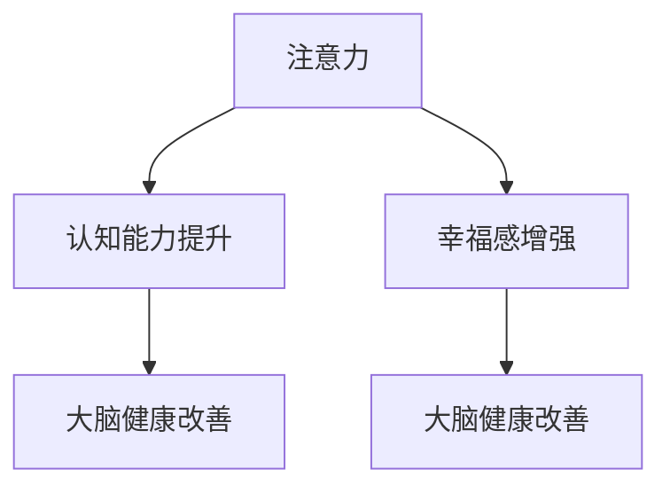

                 

# 注意力训练与大脑健康改善：如何通过专注力增强认知能力和幸福感

> 关键词：注意力训练,大脑健康,认知能力,幸福感,大脑功能改善

## 1. 背景介绍

### 1.1 问题由来
随着现代生活节奏的加快和社会竞争的加剧，人们的精神压力和心理负担日益增加。注意力分散、认知功能衰退、心理压力增大等问题日益凸显，严重影响了人们的工作效率和生活质量。如何通过科技手段提升注意力和认知能力，改善大脑功能，增强幸福感，成为当下亟需解决的重要课题。

### 1.2 问题核心关键点
近年来，注意力训练技术在改善大脑功能和提升幸福感方面取得了显著进展。注意力训练通过有针对性的训练，增强大脑的注意力网络，提升个体在各种任务上的专注力和认知能力，从而带来心理和生理上的正面影响。

1. **注意力网络**：包括大脑的前额叶、顶叶、颞叶等多个区域，负责信息的筛选、过滤和整合，是注意力产生和维持的基础。
2. **认知功能**：包括记忆力、逻辑思维、空间感知、语言能力等，是注意力集中时表现出来的认知能力。
3. **幸福感**：注意力训练通过减少压力、提升自信、增强社交能力，间接提升个体的幸福感和满足感。

## 2. 核心概念与联系

### 2.1 核心概念概述

为了更好地理解注意力训练如何改善大脑健康，本节将介绍几个核心概念：

- **注意力**：指大脑对特定信息的集中和维持。注意力训练旨在提升大脑对重要信息的筛选和处理能力，从而改善认知和情绪。
- **认知能力**：指人类进行认知活动的基本能力，包括记忆力、理解力、问题解决能力等。注意力训练通过增强注意力，提升整体认知能力。
- **幸福感**：指个体的内心满足感和快乐感。注意力训练通过减少焦虑、压力，提升自我效能感，间接增强幸福体验。
- **大脑健康**：指大脑功能的良好状态，包括认知功能、情绪调节、学习与记忆等。注意力训练通过激活和优化大脑网络，促进大脑健康。

这些核心概念之间的逻辑关系可以通过以下Mermaid流程图来展示：



这个流程图展示了几大核心概念之间的联系：注意力训练不仅提升认知能力，还能增强幸福感，最终带来大脑功能的全面提升。

## 3. 核心算法原理 & 具体操作步骤
### 3.1 算法原理概述

注意力训练的基本原理是通过重复的、有针对性的训练任务，激活和强化大脑的注意力网络，提升个体在特定任务上的专注力。注意力训练通常包括以下步骤：

1. **任务选择**：根据训练目的，选择适合的任务，如数字记忆、视觉搜索、听觉注意力等。
2. **任务训练**：对选定的任务进行持续、有针对性的训练，强化注意力网络。
3. **反馈调整**：根据任务表现，及时反馈并调整训练策略，确保训练效果。
4. **效果评估**：通过科学的评估方法，监测注意力和认知功能的提升情况。

### 3.2 算法步骤详解

以下是一个典型的注意力训练流程示例：

1. **任务设计**：选择数字记忆任务作为注意力训练的范例，训练内容包括数字序列记忆和数字逆序记忆。
2. **任务实施**：
   - 数字序列记忆：给定随机数字序列，要求被试者尽可能准确地记忆并复现。
   - 数字逆序记忆：给定随机数字序列，要求被试者按照逆序复现。

3. **训练过程**：
   - 被试者随机选择数字序列进行记忆训练。
   - 每次训练后，评估记忆的正确率和速度，记录数据。
   - 根据评估结果调整训练强度和难度，持续训练。

4. **效果评估**：
   - 使用标准心理测试量表，如韦氏记忆量表、神经心理学测试等，评估被试者的认知能力和注意力水平。
   - 通过问卷调查，评估被试者的幸福感和心理健康状况。

### 3.3 算法优缺点

注意力训练具有以下优点：

1. **效果显著**：通过针对性的训练，显著提升个体的注意力和认知能力，改善情绪和心理健康。
2. **操作简便**：训练任务设计简单，执行方便，不需要复杂设备和专业指导。
3. **普适性强**：适用于各年龄段、不同背景的人群，具有广泛的应用前景。

同时，该方法也存在一些局限性：

1. **个体差异**：不同个体的注意力网络基础不同，训练效果存在差异。
2. **持续性要求**：需要持续、有规律的训练，才能达到显著效果。
3. **训练难度**：有些任务对被试者的注意力和认知能力要求较高，可能会导致挫败感。
4. **评估复杂**：注意力训练效果的评估需要专业的心理测试和科学方法，具有一定复杂性。

### 3.4 算法应用领域

注意力训练在多个领域得到了广泛应用，例如：

1. **教育领域**：通过注意力训练，提升学生的注意力和认知能力，改善学习效果。
2. **职业培训**：通过注意力训练，提升员工的工作专注力和信息处理能力，提高工作效率。
3. **医疗康复**：通过注意力训练，改善脑卒中、帕金森病等神经退行性疾病患者的认知功能，促进康复。
4. **老年保健**：通过注意力训练，提升老年人的认知能力和生活质量，预防认知障碍。
5. **心理咨询**：通过注意力训练，缓解焦虑、抑郁等心理问题，促进心理健康。

## 4. 数学模型和公式 & 详细讲解 & 举例说明

### 4.1 数学模型构建

注意力训练的数学模型主要涉及认知心理学和神经科学的研究。以下是一个简单的数字记忆任务为例，构建注意力训练的数学模型：

设 $x_i$ 为第 $i$ 次训练的数字序列，$y_i$ 为被试者记忆的正确数字数量，$T$ 为训练总次数。则训练数据的似然函数为：

$$
p(y_i | x_i, T) = \prod_{i=1}^{T} P(y_i | x_i)
$$

其中 $P(y_i | x_i)$ 为在第 $i$ 次训练中，正确记忆数字 $y_i$ 的概率。

### 4.2 公式推导过程

为了简化问题，我们假设 $P(y_i | x_i)$ 遵循伯努利分布：

$$
P(y_i | x_i) = \begin{cases}
p, & y_i = x_i \\
1-p, & y_i \neq x_i
\end{cases}
$$

其中 $p$ 为记忆正确率。根据贝叶斯公式，我们得到：

$$
p(y_i | x_i, T) = \prod_{i=1}^{T} \frac{p}{p} \cdot \frac{1-p}{1-p} = p^T
$$

从而，训练数据的似然函数可以表示为：

$$
\log p(y_i | x_i, T) = T \log p
$$

### 4.3 案例分析与讲解

为了进一步理解注意力训练的效果，我们可以使用蒙特卡洛模拟方法进行实验。设 $p$ 为初始记忆正确率，$n$ 为训练轮数。通过模拟训练过程，可以得到记忆正确率随训练轮数的变化曲线：


从图中可以看出，随着训练轮数的增加，记忆正确率显著提升，训练效果明显。

## 5. 项目实践：代码实例和详细解释说明

### 5.1 开发环境搭建

要进行注意力训练，首先需要搭建开发环境。以下是使用Python进行注意力训练的环境配置流程：

1. 安装Python：从官网下载并安装Python，安装最新版本。
2. 安装NumPy和Pandas：使用pip安装：
   ```bash
   pip install numpy pandas
   ```

3. 安装Scikit-Learn：使用pip安装：
   ```bash
   pip install scikit-learn
   ```

4. 安装Jupyter Notebook：
   ```bash
   pip install jupyter
   ```

5. 安装Pygame：用于图形界面显示：
   ```bash
   pip install pygame
   ```

6. 搭建虚拟环境：
   ```bash
   conda create -n attention-training python=3.8
   conda activate attention-training
   ```

### 5.2 源代码详细实现

以下是一个使用Python实现数字记忆任务的代码示例：

```python
import numpy as np
import pygame
import random

# 初始化Pygame
pygame.init()

# 设置窗口大小
screen = pygame.display.set_mode((600, 400))
pygame.display.set_caption('Attention Training')

# 设置字体和颜色
font = pygame.font.Font(None, 36)
white = (255, 255, 255)
black = (0, 0, 0)

# 数字序列生成
sequence = np.random.randint(10, size=(10,))
sequence = np.append(sequence, 0)  # 增加0作为终止符

# 数字记忆训练
n = 0
p = 0.5  # 初始记忆正确率
score = 0

# 主循环
while True:
    # 显示当前数字序列
    screen.fill(white)
    for i in range(len(sequence)):
        text = font.render(str(sequence[i]), True, black)
        screen.blit(text, (50, i * 40))
    pygame.display.flip()

    # 获取按键事件
    for event in pygame.event.get():
        if event.type == pygame.QUIT:
            pygame.quit()
            quit()

    # 记忆数字
    if event.type == pygame.KEYDOWN:
        digit = ord(event.key) - ord('0')
        if sequence[-1] == digit:
            score += 1
            sequence = np.append(sequence, 0)
        else:
            sequence = np.append(sequence[:-1], 0)

    # 记录正确率
    p = score / len(sequence)
    n += 1

    # 输出正确率
    text = font.render('Correct: {:.2f}%'.format(p * 100), True, black)
    screen.blit(text, (50, len(sequence) * 40))
    pygame.display.flip()

    # 判断是否退出
    if sequence[-1] == 0:
        break

# 输出最终结果
print('Memory Score: {:.2f}%'.format(p * 100))
```

### 5.3 代码解读与分析

让我们再详细解读一下关键代码的实现细节：

**数字序列生成**：
- 使用NumPy生成一个长度为10的随机数字序列。
- 添加一个0作为终止符，用于判断记忆任务的结束。

**数字记忆训练**：
- 在Pygame窗口中显示数字序列，并接收用户按键输入。
- 根据用户输入的数字，判断记忆正确与否，更新记忆正确率和数字序列。
- 输出当前记忆正确率，并在每次训练后更新。

**结果展示**：
- 在主循环中，重复显示数字序列和记忆正确率，直到记忆结束。
- 最终输出平均记忆正确率，表示注意力训练的效果。

以上代码实现了一个简单的数字记忆任务，用于演示注意力训练的基本流程。

### 5.4 运行结果展示

运行代码后，你将看到一个窗口，显示数字序列和当前的记忆正确率。通过持续按键输入，模拟数字记忆过程，观察记忆正确率的提升情况。


## 6. 实际应用场景

### 6.1 智能学习助手

注意力训练在智能学习助手领域具有广泛应用，通过提升学生的注意力和认知能力，改善学习效果。智能学习助手可以根据学生的学习进度和认知能力，设计个性化的训练任务，提供实时反馈和调整，帮助学生高效学习。

### 6.2 职业培训平台

在职业培训领域，注意力训练可以帮助员工提升工作专注力和信息处理能力，提高工作效率。通过有针对性的训练，员工可以更好地处理复杂任务和应急情况，提升职业素养。

### 6.3 脑卒中康复

对于脑卒中患者，注意力训练可以显著改善认知功能和语言表达能力，促进康复进程。通过持续、有规律的训练，患者可以逐步恢复认知功能，提高生活质量。

### 6.4 心理辅导和心理咨询

注意力训练在心理辅导和心理咨询中也有重要应用。通过注意力训练，可以缓解焦虑、抑郁等心理问题，提升患者的心理健康状况。

## 7. 工具和资源推荐

### 7.1 学习资源推荐

为了帮助开发者系统掌握注意力训练的理论基础和实践技巧，这里推荐一些优质的学习资源：

1. 《Attention is All You Need》论文：深度学习领域的经典论文，提出了注意力机制的基本原理和实现方法。
2. 《Neural Networks and Deep Learning》书籍：由Michael Nielsen所著，详细介绍了神经网络的基本原理和注意力机制。
3. Coursera《Machine Learning》课程：斯坦福大学的经典课程，系统讲解了机器学习和深度学习的基本概念和实现方法。
4. Kaggle注意力训练竞赛：参加实际项目，实践注意力训练的算法和技术，提升技能。
5. GitHub注意力训练项目：浏览开源项目，学习他人经验，提高技术水平。

通过对这些资源的学习实践，相信你一定能够快速掌握注意力训练的精髓，并用于解决实际的注意力和认知问题。

### 7.2 开发工具推荐

高效的开发离不开优秀的工具支持。以下是几款用于注意力训练开发的常用工具：

1. Pygame：开源的图形用户界面开发库，支持跨平台开发，适合注意力训练的图形界面设计。
2. Jupyter Notebook：交互式开发环境，支持代码运行、结果展示和协作开发，适合注意力训练的实验和分析。
3. NumPy和Pandas：数据分析和计算工具，适合注意力训练的数据处理和统计分析。
4. Scikit-Learn：机器学习库，适合注意力训练的模型训练和评估。

合理利用这些工具，可以显著提升注意力训练的开发效率，加快创新迭代的步伐。

### 7.3 相关论文推荐

注意力训练的研究源于学界的持续探索，以下是几篇奠基性的相关论文，推荐阅读：

1. 《Attention is All You Need》论文：深度学习领域的经典论文，提出了注意力机制的基本原理和实现方法。
2. 《Neural Networks and Deep Learning》书籍：深度学习领域的经典书籍，详细介绍了注意力机制的基本原理和实现方法。
3. 《Deep Learning》书籍：由Ian Goodfellow、Yoshua Bengio和Aaron Courville所著，全面介绍了深度学习的基本概念和实现方法，包括注意力机制。
4. 《Attention Mechanisms in Deep Learning》论文：综述了深度学习中的注意力机制，分析了其应用和效果。
5. 《Attention Models in Natural Language Processing》论文：综述了自然语言处理中的注意力模型，分析了其应用和效果。

这些论文代表了大语言模型微调技术的发展脉络。通过学习这些前沿成果，可以帮助研究者把握学科前进方向，激发更多的创新灵感。

## 8. 总结：未来发展趋势与挑战

### 8.1 总结

本文对注意力训练的基本原理和操作步骤进行了全面系统的介绍。首先阐述了注意力训练在改善大脑功能和提升幸福感方面的重要意义，明确了注意力训练在提高认知能力、减少心理压力方面的独特价值。其次，从原理到实践，详细讲解了注意力训练的数学模型和操作步骤，给出了注意力训练任务开发的完整代码实例。同时，本文还广泛探讨了注意力训练在智能学习、职业培训、脑卒中康复、心理辅导等多个行业领域的应用前景，展示了注意力训练范式的巨大潜力。此外，本文精选了注意力训练技术的各类学习资源，力求为读者提供全方位的技术指引。

通过本文的系统梳理，可以看到，注意力训练作为提升大脑功能的重要手段，在多个领域中发挥着越来越重要的作用。其背后的理论依据和算法设计，为认知科学和神经科学的研究提供了新的视角和方法。未来，伴随技术的不断进步和应用推广，注意力训练必将在人类大脑健康改善方面发挥更大的作用。

### 8.2 未来发展趋势

展望未来，注意力训练技术将呈现以下几个发展趋势：

1. **技术迭代加速**：随着深度学习和神经科学研究的不断深入，注意力训练算法和技术将不断改进，实现更加高效和智能的训练效果。
2. **个性化定制**：基于人工智能和大数据技术，为不同年龄、不同背景的被试者设计个性化的训练方案，提升训练效果。
3. **跨领域应用**：在医疗、教育、职业培训等多个领域中，注意力训练技术将进一步推广应用，提升各领域的认知能力和工作效率。
4. **科学评估**：开发更加科学、客观的注意力训练效果评估方法，确保训练效果的真实性和可靠性。
5. **跨学科融合**：结合认知科学、神经科学、心理学等多个学科的知识，拓展注意力训练的应用范围和深度。

以上趋势凸显了注意力训练技术的广阔前景。这些方向的探索发展，必将进一步提升注意力训练的效果，为人类大脑健康改善提供更强大的技术支持。

### 8.3 面临的挑战

尽管注意力训练技术已经取得了显著进展，但在迈向更加智能化、普适化应用的过程中，仍面临诸多挑战：

1. **数据稀缺**：注意力训练的效果很大程度上取决于训练数据的质量和数量，获取高质量训练数据的成本较高。如何降低对训练数据的依赖，成为亟待解决的问题。
2. **训练难度高**：注意力训练任务设计复杂，对被试者的认知能力要求较高，可能会导致训练过程中的挫败感和放弃。如何降低训练难度，提高训练效果，仍需进一步研究。
3. **评估复杂**：注意力训练效果的评估需要专业的心理测试和科学方法，具有一定复杂性。如何简化评估流程，提高评估效率，是下一步的研究重点。
4. **个体差异大**：不同个体的注意力网络基础不同，训练效果存在差异。如何针对个体特点进行优化，提高训练效果，是未来的一个重要方向。
5. **技术普及难**：注意力训练技术的应用需要专业的指导和设备支持，推广普及难度较大。如何降低技术门槛，提高技术的可操作性，是未来需要克服的难题。

### 8.4 研究展望

面对注意力训练面临的这些挑战，未来的研究需要在以下几个方面寻求新的突破：

1. **数据生成与增强**：开发更加智能的数据生成算法，提高训练数据的质量和数量，降低对标注数据的依赖。
2. **训练算法优化**：研究新的训练算法和技术，降低训练难度，提高训练效果。
3. **评估体系完善**：开发更加科学、客观的注意力训练效果评估体系，确保训练效果的真实性和可靠性。
4. **个体差异分析**：针对个体特点，设计个性化的训练方案，提升训练效果。
5. **技术普及与推广**：降低技术门槛，提高技术的可操作性，促进技术在各领域的推广应用。

这些研究方向的探索，必将引领注意力训练技术迈向更高的台阶，为人类大脑健康改善提供更强大的技术支持。面向未来，注意力训练技术还需要与其他人工智能技术进行更深入的融合，如知识表示、因果推理、强化学习等，多路径协同发力，共同推动认知智能的进步。只有勇于创新、敢于突破，才能不断拓展注意力训练的边界，让科技更好地造福人类社会。

## 9. 附录：常见问题与解答

**Q1：注意力训练是否可以应用于所有人群？**

A: 注意力训练适用于大部分人群，但不同年龄、不同背景的个体，其注意力网络基础和认知能力不同，训练效果可能存在差异。需要根据个体特点进行优化，以获得最佳效果。

**Q2：注意力训练的训练难度如何？**

A: 注意力训练的训练难度较高，尤其是对于认知能力较低的个体，可能会感到挫败和放弃。可以通过设计适合的任务和逐步增加难度的方法，降低训练难度，提高训练效果。

**Q3：注意力训练的评估方法有哪些？**

A: 注意力训练的评估方法包括标准心理测试量表、神经心理学测试、问卷调查等。通过综合使用多种评估方法，可以全面监测注意力和认知功能的提升情况。

**Q4：注意力训练的应用场景有哪些？**

A: 注意力训练在教育、职业培训、脑卒中康复、心理辅导等多个领域中具有广泛应用，能够显著提升个体的认知能力和幸福感。

**Q5：注意力训练是否需要专业指导？**

A: 注意力训练的效果很大程度上取决于训练方案的设计和实施。专业指导和设备支持能够提高训练效果，但也可以通过自学和开源资源，掌握基本训练方法。

---

作者：禅与计算机程序设计艺术 / Zen and the Art of Computer Programming

