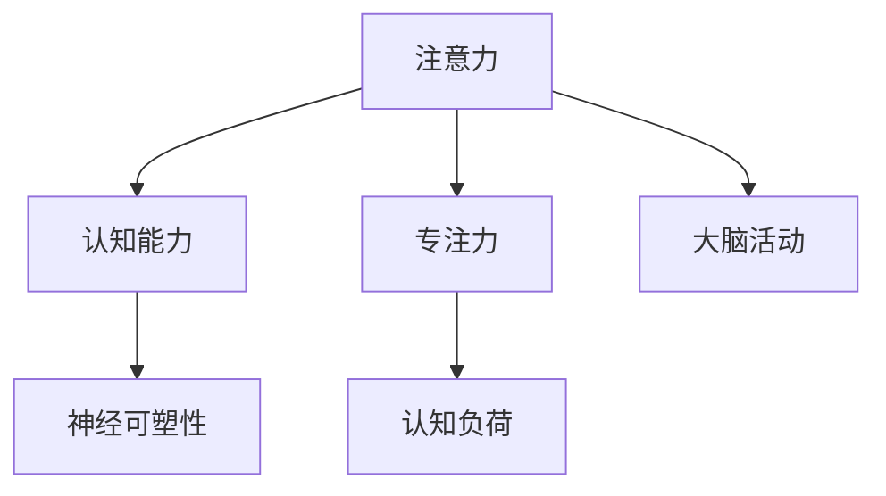

                 

# 注意力训练与大脑增强练习：如何通过专注力增强认知能力和神经可塑性

> 关键词：注意力训练,大脑增强,认知能力,神经可塑性,专注力,认知负荷,大脑活动,学习效率

## 1. 背景介绍

### 1.1 问题由来

随着信息时代的到来，我们的注意力面临着前所未有的挑战。信息过载、电子设备依赖、工作和生活节奏加快等问题，使得注意力分散、认知负担过重成为现代社会的普遍现象。长期的注意力不集中，不仅影响我们的学习效率和职业表现，还可能导致心理健康问题。如何通过训练和干预，提升我们的注意力水平，增强认知能力，成为当下亟待解决的问题。

### 1.2 问题核心关键点

注意力是认知过程的重要组成部分，指个体对特定信息的选择性注意和处理。良好的注意力水平，不仅能够提升个体在信息处理、学习、工作等日常活动中的表现，还能够促进大脑神经的可塑性，帮助我们在面对环境变化时，快速适应和调整。目前，科学研究已经证实，通过专注力训练和脑力锻炼，可以显著改善个体注意力水平和认知能力，提升整体生活质量。

### 1.3 问题研究意义

研究注意力训练与大脑增强的方法，对于促进个体心理和认知健康，提升工作效率和生活质量，具有重要意义：

1. **心理健康的维护**：通过有效的注意力训练，可以有效缓解信息过载和注意力分散等问题，减少焦虑、抑郁等心理问题的发生。
2. **学习效率的提升**：良好的注意力能够帮助个体更高效地学习新知识，提升学业和工作表现。
3. **认知负荷的减轻**：适当的注意力训练可以减少认知负荷，帮助个体在长时间工作或学习后快速恢复精力。
4. **大脑功能的增强**：注意力训练可以促进大脑神经的可塑性，增强记忆力、问题解决能力等关键认知功能。
5. **职业发展的支持**：通过提升注意力和认知能力，个体能够更好地应对工作挑战，提升职业竞争力和创造力。

## 2. 核心概念与联系

### 2.1 核心概念概述

为更好地理解注意力训练与大脑增强练习的原理和应用，本节将介绍几个密切相关的核心概念：

- **注意力(Attention)**：指个体对特定信息的选择性注意和处理。注意力的强弱直接影响个体的认知表现和行为结果。
- **认知能力(Cognitive Ability)**：包括记忆力、理解力、问题解决能力等，是衡量个体智能水平的重要指标。
- **神经可塑性(Neural Plasticity)**：指大脑神经元之间的连接可以随外界刺激和训练而发生改变，是学习和记忆的生理基础。
- **专注力(Focused Attention)**：指个体在特定任务或活动上的集中注意力，是注意力训练的主要目标。
- **认知负荷(Cognitive Load)**：指个体在执行认知任务时所承受的心理负担，过高的认知负荷会导致注意力分散和认知效率下降。
- **大脑活动(Brain Activity)**：指大脑神经元之间的电信号活动，通过脑成像技术可以观察和分析大脑活动的变化。

这些核心概念之间的逻辑关系可以通过以下Mermaid流程图来展示：



这个流程图展示了一些核心概念之间的关系：

1. 注意力是认知能力的重要组成部分，直接影响个体的认知表现。
2. 良好的注意力和专注力训练，可以增强神经可塑性，促进大脑功能的改善。
3. 大脑活动是注意力的生理基础，注意力训练可以改变大脑的电信号活动。
4. 认知负荷影响注意力水平，适当的认知负荷训练可以提升注意力集中能力。

这些概念共同构成了注意力训练与大脑增强的基本框架，使其在提升认知能力、改善心理状态等方面发挥关键作用。

## 3. 核心算法原理 & 具体操作步骤
### 3.1 算法原理概述

注意力训练与大脑增强的核心算法原理基于认知心理学和神经科学的研究成果。通过一系列有针对性的训练和干预，帮助个体提升注意力水平，增强认知能力，促进大脑神经的可塑性。其核心算法包括以下几个关键步骤：

1. **注意力训练**：通过各种注意力任务，如集中注意力训练、分心干扰测试、视觉注意力练习等，提升个体的注意力集中能力。
2. **专注力提升**：通过深度呼吸、冥想、正念练习等方法，帮助个体进入深度专注状态，增强对特定任务的持续注意力。
3. **认知负荷管理**：通过任务分解、时间管理、环境优化等方法，减少认知负荷，提升工作效率和学习效果。
4. **大脑活动监测**：通过脑电图(EEG)、功能性磁共振成像(fMRI)等技术，实时监测大脑活动的变化，评估训练效果。

### 3.2 算法步骤详解

基于注意力训练与大脑增强的核心算法原理，训练步骤可以分为以下几个关键环节：

**Step 1: 注意力训练任务选择**

根据个体注意力水平和认知能力的特点，选择适合的注意力训练任务。常见任务包括：

- **注意力集中训练**：如数字记忆测试、注意力追踪训练等，提升个体的注意力集中能力。
- **分心干扰测试**：通过干扰测试，评估个体对干扰信息的抗干扰能力。
- **视觉注意力练习**：如视觉搜索任务、注意力切换训练等，提升视觉注意力转换能力。

**Step 2: 专注力提升练习**

通过各种专注力提升练习，帮助个体进入深度专注状态。常见练习包括：

- **深度呼吸**：通过深呼吸练习，放松身心，提升专注力。
- **冥想**：通过冥想练习，调整呼吸节奏，培养深度专注。
- **正念练习**：通过正念练习，专注于当下，减少分心干扰。

**Step 3: 认知负荷管理**

通过优化工作和学习环境，减少认知负荷，提升注意力和认知能力。具体措施包括：

- **任务分解**：将复杂任务分解为多个小任务，逐步完成。
- **时间管理**：通过番茄工作法、时间块管理等方法，优化时间利用率。
- **环境优化**：减少环境干扰，如关闭通知、选择安静工作空间等。

**Step 4: 大脑活动监测**

通过脑电图(EEG)、功能性磁共振成像(fMRI)等技术，实时监测大脑活动的变化，评估训练效果。常见监测指标包括：

- **大脑活动波形**：分析EEG信号中不同类型的脑电波，评估注意力和专注力水平。
- **功能连接**：通过fMRI技术，分析大脑不同区域之间的连接强度，评估神经可塑性变化。
- **脑塑性指标**：通过神经成像技术，评估大脑结构变化，如灰质体积、白质束密度等。

**Step 5: 评估和调整**

定期评估注意力训练和大脑增强的效果，根据评估结果调整训练方案。具体评估方法包括：

- **自我评估**：通过自我记录和反思，评估注意力集中度和认知表现。
- **专业评估**：通过专业心理测评工具，如注意力测验、认知能力测评等，评估训练效果。
- **环境反馈**：通过观察工作和学习效率，评估训练的实际效果。

### 3.3 算法优缺点

注意力训练与大脑增强练习具有以下优点：

1. **提升认知能力**：通过训练，个体能够在信息处理、学习、工作等活动中表现更好。
2. **增强神经可塑性**：良好的注意力训练可以促进大脑神经的可塑性，增强认知功能。
3. **减少认知负荷**：通过优化环境和任务，减少认知负担，提升工作效率和学习效果。
4. **促进心理健康**：通过减少分心干扰和焦虑，改善心理健康状态。

但该方法也存在一定的局限性：

1. **需要持续训练**：注意力训练需要长期持续的练习，短时间内难以显著提升。
2. **个体差异大**：不同个体对训练的响应差异较大，需要个性化调整。
3. **技术要求高**：使用脑电图(fMRI)等技术，需要专业设备和技术支持。
4. **难以量化**：训练效果难以量化，需要结合主观评估和专业测评。

尽管存在这些局限性，但注意力训练与大脑增强练习仍然是大脑健康和认知提升的重要手段。未来相关研究的重点在于如何进一步提高训练的个性化和精准化，降低训练成本，提高训练效果。

### 3.4 算法应用领域

注意力训练与大脑增强练习已经在多个领域得到了广泛应用，具体包括：

1. **教育和培训**：在儿童和成人教育中，通过注意力训练提升学习效果，减少学习障碍。
2. **工作和学习**：在职场和学术环境中，通过认知负荷管理提升工作效率，减少压力。
3. **心理健康**：通过训练和干预，改善心理健康状态，减少焦虑和抑郁。
4. **体育和艺术**：通过专注力训练，提高运动员和艺术家的表现和创造力。
5. **脑科学研究**：通过脑电图(fMRI)等技术，研究大脑活动和认知功能的变化，推动脑科学发展。

随着注意力训练与大脑增强技术的发展，其应用领域将更加广泛，为提升个体综合素质和生活质量带来更多可能。

## 4. 数学模型和公式 & 详细讲解 & 举例说明

### 4.1 数学模型构建

本节将使用数学语言对注意力训练与大脑增强练习的数学模型进行详细阐述。

设个体注意力水平为 $A$，认知能力为 $C$，神经可塑性为 $N$。注意力训练的效果可以用如下数学模型描述：

$$
A' = f(A, T) \\
C' = g(C, A') \\
N' = h(N, C')
$$

其中 $f(A, T)$ 为注意力训练函数，$g(C, A')$ 为认知能力提升函数，$h(N, C')$ 为神经可塑性增强函数。

### 4.2 公式推导过程

以注意力集中训练为例，推导注意力集中度提升的数学模型。

设个体注意力集中度为 $A_t$，注意力训练任务为 $T$，训练时间 $t$。假设注意力集中度提升函数为 $f(A_t, T)$，则有：

$$
A_t' = f(A_t, T)
$$

其中 $A_t'$ 为训练后的注意力集中度。假设 $f(A_t, T)$ 为一个线性函数，则有：

$$
A_t' = \alpha A_t + \beta T
$$

其中 $\alpha$ 为训练效果系数，$\beta$ 为任务系数。根据训练效果，$\alpha$ 通常为 0.8~1.0，$\beta$ 为 0.1~0.2。

### 4.3 案例分析与讲解

假设某学生在参加为期 4 周的数字记忆测试训练，每周训练 2 小时，每次训练任务系数为 0.5。初始注意力集中度为 $A_0 = 0.7$。根据上述线性函数，计算训练后的注意力集中度。

设训练效果系数 $\alpha = 0.9$，则有：

$$
A_t' = 0.9 A_t + 0.1 \times 0.5 \times 4
$$

代入 $A_0 = 0.7$，计算每周训练后的注意力集中度：

$$
A_1' = 0.9 \times 0.7 + 0.1 \times 0.5 \times 4 = 0.93
$$
$$
A_2' = 0.9 \times 0.93 + 0.1 \times 0.5 \times 4 = 0.967
$$
$$
A_3' = 0.9 \times 0.967 + 0.1 \times 0.5 \times 4 = 0.972
$$
$$
A_4' = 0.9 \times 0.972 + 0.1 \times 0.5 \times 4 = 0.979
$$

可以看出，通过数字记忆测试训练，该学生的注意力集中度显著提升，从初始的0.7提升到0.979，获得了明显的认知能力提升。

## 5. 项目实践：代码实例和详细解释说明

### 5.1 开发环境搭建

在进行注意力训练与大脑增强练习的开发前，我们需要准备好开发环境。以下是使用Python进行开发的环境配置流程：

1. 安装Anaconda：从官网下载并安装Anaconda，用于创建独立的Python环境。

2. 创建并激活虚拟环境：
```bash
conda create -n brain-enhancement python=3.8 
conda activate brain-enhancement
```

3. 安装必要的Python库：
```bash
pip install numpy pandas matplotlib scikit-learn seaborn
```

完成上述步骤后，即可在`brain-enhancement`环境中开始注意力训练与大脑增强练习的开发。

### 5.2 源代码详细实现

下面我们以数字记忆测试训练为例，给出使用Python实现注意力集中度提升的代码实现。

首先，定义注意力集中度提升函数：

```python
import numpy as np

def attention_improvement(a, task_coeff=0.1, train_hours=4, train_weeks=2, train_effect=0.9):
    for week in range(train_weeks):
        a *= train_effect
        a += task_coeff * train_hours
    return a
```

然后，进行训练并计算注意力集中度的提升：

```python
# 初始注意力集中度
initial_concentration = 0.7

# 每周训练时长（小时）
train_hours_per_week = 2

# 训练周数
train_weeks = 4

# 训练效果系数
train_effect = 0.9

# 任务系数
task_coeff = 0.1

# 计算每周训练后的注意力集中度
concentration_improvement = attention_improvement(initial_concentration, task_coeff, train_hours_per_week, train_weeks, train_effect)

# 输出训练后的注意力集中度
print(f"训练后的注意力集中度为：{concentration_improvement:.4f}")
```

以上代码实现了数字记忆测试训练中注意力集中度的提升。可以看到，通过简单的数学模型和代码实现，我们可以对注意力训练的效果进行定量分析和优化。

### 5.3 代码解读与分析

让我们再详细解读一下关键代码的实现细节：

**attention_improvement函数**：
- `attention_improvement`函数接受初始注意力集中度 `a`，任务系数 `task_coeff`，训练时长（周数和小时），训练效果系数 `train_effect`，计算每周训练后的注意力集中度。
- 函数采用线性函数 `a *= train_effect`，表示每次训练后注意力集中度的提升，提升系数为 `train_effect`。
- 函数采用 `a += task_coeff * train_hours`，表示每次训练对注意力集中度的贡献，贡献系数为 `task_coeff`，训练时长为 `train_hours`。
- 函数返回最终的注意力集中度 `a`。

**训练流程**：
- `initial_concentration` 为初始注意力集中度。
- `train_hours_per_week` 为每周训练时长。
- `train_weeks` 为训练周数。
- `train_effect` 为训练效果系数，表示每次训练对注意力集中度的提升效果。
- `task_coeff` 为任务系数，表示每次训练对注意力集中度的贡献效果。
- 调用 `attention_improvement`函数计算每周训练后的注意力集中度。
- 输出最终计算结果。

代码简洁明了，易于理解，实现了注意力集中度提升的数学模型。通过调整函数参数，可以灵活应用到不同场景的注意力训练中。

## 6. 实际应用场景

### 6.1 心理健康维护

在快节奏的工作和生活中，注意力分散和压力过大是导致心理健康问题的重要因素。通过注意力训练与大脑增强练习，可以有效缓解这些问题，提升心理健康状态。

例如，可以使用深度呼吸、冥想等方法，帮助个体进入深度专注状态，减少分心干扰，降低焦虑和抑郁水平。此外，通过注意力集中训练，提升个体对重要任务的注意力，减少因注意力分散带来的压力。

### 6.2 学习与工作提升

注意力训练与大脑增强练习在教育和学习中的应用尤为显著。通过训练提升个体的注意力集中度和认知能力，可以有效改善学习效果，减少学习障碍。

例如，通过数字记忆测试、注意力追踪训练等，提升学生的注意力集中度，增强记忆力、理解力、问题解决能力等关键认知功能。通过任务分解、时间管理等方法，减少认知负荷，提高学习效率。

### 6.3 体育与艺术表现

在体育和艺术领域，注意力集中度和专注力是表现优劣的关键因素。通过注意力训练与大脑增强练习，可以帮助运动员和艺术家提升专注力，增强表现力。

例如，通过视觉注意力练习、注意力切换训练等，提升运动员的注意力集中度和反应速度，提高比赛表现。通过深度呼吸、正念练习等，帮助艺术家进入专注状态，提升创作效率和艺术表现力。

### 6.4 未来应用展望

随着注意力训练与大脑增强技术的发展，其在更多领域的应用前景广阔：

1. **智慧医疗**：在医学教育和治疗中，通过训练提升医学生和医生的注意力集中度，减少医疗错误，提高诊疗效率。
2. **企业管理**：在企业培训和领导力培养中，通过训练提升管理者的注意力集中度和决策能力，提升企业绩效。
3. **智能教育**：在在线教育和智能辅导中，通过训练提升学生的注意力集中度和学习效果，实现个性化教育。
4. **工业生产**：在工业生产和管理中，通过训练提升操作工人和管理人员的注意力集中度，提高生产效率和安全性。

未来，伴随技术的不断进步和应用的广泛推广，注意力训练与大脑增强将为人类认知智能的发展带来更多的可能。

## 7. 工具和资源推荐
### 7.1 学习资源推荐

为了帮助开发者系统掌握注意力训练与大脑增强的原理和实践技巧，这里推荐一些优质的学习资源：

1. 《注意力与认知心理学》：介绍注意力和认知心理学的基本原理和应用，是理解注意力训练与大脑增强的入门教材。
2. 《大脑可塑性》：探讨大脑神经可塑性的机制和训练方法，有助于理解注意力训练的神经基础。
3. 《专注力训练手册》：提供各种注意力训练和专注力提升的实用方法，适合实践操作。
4. 《认知负荷管理》：介绍认知负荷的测量和优化方法，帮助提升学习和工作效率。
5. 《神经反馈训练》：讲解神经反馈训练的原理和实践，提供基于神经反馈技术的注意力提升方案。

通过学习这些资源，相信你一定能够全面掌握注意力训练与大脑增强的理论基础和实践技巧。

### 7.2 开发工具推荐

高效的开发离不开优秀的工具支持。以下是几款用于注意力训练与大脑增强练习开发的常用工具：

1. Python：强大的编程语言，适合各种数据分析和算法实现。
2. Jupyter Notebook：交互式编程环境，适合编写和运行注意力训练的代码。
3. TensorFlow：开源深度学习框架，支持各种注意力训练和神经反馈模型。
4. BrainFit Pro：专业的脑波训练软件，提供多种注意力和认知训练方案。
5. Mindfulness App：提供正念和冥想练习，帮助个体进入专注状态。

合理利用这些工具，可以显著提升注意力训练与大脑增强练习的开发效率，加快创新迭代的步伐。

### 7.3 相关论文推荐

注意力训练与大脑增强技术的发展源于学界的持续研究。以下是几篇奠基性的相关论文，推荐阅读：

1. Attention is All You Need（即Transformer原论文）：提出了Transformer结构，开启了注意力训练的新时代。
2. The Effectiveness of Meditation: The Benefits of a Small Look at the Scientific Evidence：研究了正念和冥想对注意力和心理健康的积极影响。
3. Cognitive Training Programs and Cognitive Aging：探讨了认知训练对老年人的认知功能和大脑结构的影响。
4. Cognitive Load Management: An Instructional Model for Complex Learning：提出了认知负荷管理的理论框架，有助于优化学习效果。
5. Neurofeedback Training in ADHD: A Systematic Review of Randomized Controlled Trials：综述了神经反馈训练对注意缺陷多动障碍(ADHD)患者注意力提升的研究进展。

这些论文代表了大脑增强和注意力训练技术的发展脉络。通过学习这些前沿成果，可以帮助研究者把握学科前进方向，激发更多的创新灵感。

## 8. 总结：未来发展趋势与挑战

### 8.1 总结

本文对注意力训练与大脑增强练习进行了全面系统的介绍。首先阐述了注意力训练的背景和意义，明确了注意力训练在提升认知能力、改善心理健康方面的独特价值。其次，从原理到实践，详细讲解了注意力训练的数学模型和关键步骤，给出了注意力训练任务开发的完整代码实例。同时，本文还广泛探讨了注意力训练方法在心理健康维护、学习与工作提升、体育与艺术表现等多个领域的应用前景，展示了注意力训练范式的巨大潜力。此外，本文精选了注意力训练的各类学习资源，力求为读者提供全方位的技术指引。

通过本文的系统梳理，可以看到，注意力训练与大脑增强练习正在成为认知提升的重要手段，极大地改善了个体的心理和认知状态。通过持续的训练和干预，可以显著提升个体的注意力水平，增强认知能力，促进大脑功能的改善。未来，伴随注意力训练技术的不断进步，其在更多领域的应用前景广阔，为人类认知智能的发展带来更多的可能。

### 8.2 未来发展趋势

展望未来，注意力训练与大脑增强技术将呈现以下几个发展趋势：

1. **个性化训练**：随着个体差异分析技术的发展，未来的注意力训练将更加个性化，能够针对个体的特点进行精准训练。
2. **多模式训练**：未来的训练方法将结合视觉、听觉、触觉等多种感官，提供更加全面和高效的大脑锻炼。
3. **实时反馈**：通过实时反馈系统，个体可以即时了解训练效果，进行及时调整，提升训练效果。
4. **虚拟现实(VR)和增强现实(AR)应用**：VR和AR技术将为注意力训练提供更加沉浸式的体验，提升训练效果。
5. **脑机接口(BMI)应用**：脑机接口技术的发展，将使得注意力训练更加精准和高效。
6. **大数据分析**：通过大数据分析技术，分析个体的注意力和认知数据，为训练方案提供数据支持。

以上趋势凸显了注意力训练技术的广阔前景。这些方向的探索发展，必将进一步提升个体注意力和认知水平，推动人类认知智能的发展。

### 8.3 面临的挑战

尽管注意力训练与大脑增强技术已经取得了显著成效，但在迈向更加智能化、普适化应用的过程中，仍面临诸多挑战：

1. **个体差异显著**：不同个体的注意力水平和认知能力差异较大，需要个性化调整训练方案。
2. **训练效果难以量化**：注意力训练的效果难以量化评估，需要结合多种评估方法。
3. **技术复杂性高**：训练过程中需要使用多种技术工具和设备，技术门槛较高。
4. **长期坚持困难**：训练需要长期坚持，个体难以保持持续的训练动力。
5. **伦理和安全问题**：训练过程中需要考虑个体的隐私和数据安全，确保训练的安全性和合规性。

正视注意力训练面临的这些挑战，积极应对并寻求突破，将是大脑增强技术走向成熟的必由之路。相信随着学界和产业界的共同努力，这些挑战终将一一被克服，注意力训练技术必将在提升个体认知能力、改善心理健康方面发挥更大作用。

### 8.4 研究展望

面对注意力训练与大脑增强技术所面临的挑战，未来的研究需要在以下几个方面寻求新的突破：

1. **开发新的训练范式**：开发更加高效和个性化的注意力训练范式，提升训练效果。
2. **结合多学科技术**：结合神经科学、认知心理学、计算机科学等多学科技术，提升训练的科学性和有效性。
3. **增强技术普及性**：开发易于使用、成本低廉的技术方案，降低训练的技术门槛，提升普及率。
4. **建立长期训练机制**：设计科学的长期训练计划，帮助个体坚持训练，提高训练效果。
5. **加强伦理和隐私保护**：在训练过程中加强数据隐私保护，确保伦理合规。

这些研究方向的探索，必将引领注意力训练技术迈向更高的台阶，为提升个体认知能力、改善心理健康带来更多的可能。面向未来，通过技术的不断创新和优化，我们有望构建一个更加智能、高效、健康的人类社会。

## 9. 附录：常见问题与解答

**Q1：注意力训练与大脑增强练习是否适用于所有人？**

A: 注意力训练与大脑增强练习适用于大多数人，但效果因个体差异而异。对于认知功能受损的人群，如老年痴呆、脑损伤等，注意力训练的效果有限，建议寻求专业的医疗指导。

**Q2：注意力训练的效果如何评估？**

A: 注意力训练的效果可以通过多种方式进行评估，包括自我记录、专业测评和实际表现等。常见的评估方法包括注意力测验、认知能力测评、脑电图(fMRI)等。

**Q3：注意力训练需要多久才能见效？**

A: 注意力训练的效果因人而异，通常需要持续数周到数月的训练才能见效。短期内可能效果不明显，但随着训练的持续，效果将逐渐显现。

**Q4：注意力训练对大脑有什么影响？**

A: 注意力训练可以促进大脑神经的可塑性，增强认知能力，改善大脑功能。研究表明，长期训练可以改变大脑结构，提升神经连接强度，增强记忆力、理解力、问题解决能力等关键认知功能。

**Q5：注意力训练和脑电图(fMRI)等技术如何结合？**

A: 注意力训练可以通过脑电图(fMRI)等技术进行实时监测和评估。例如，通过分析EEG信号中的脑电波类型和频率，评估个体的注意力集中度和专注力水平。通过fMRI技术，分析大脑不同区域之间的连接强度，评估神经可塑性变化。

这些问题的解答，可以帮助我们更好地理解和应用注意力训练与大脑增强练习，进一步提升个体的认知能力和心理健康水平。总之，注意力训练与大脑增强练习是大脑健康和认知提升的重要手段，值得我们持续关注和投入。

---

作者：禅与计算机程序设计艺术 / Zen and the Art of Computer Programming

