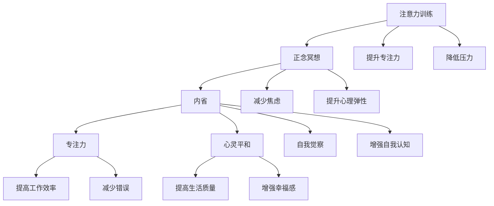

                 

# 注意力训练与正念冥想实践：通过内省增强专注力和心灵平和

> 关键词：注意力训练, 正念冥想, 内省, 专注力, 心灵平和

## 1. 背景介绍

在快节奏的现代生活中，人们面临的压力与日俱增，焦虑、疲劳、失眠等心理问题日益突出。许多人希望能够找到一种简单有效的方法，以提升自身的专注力和心灵平和，从而更好地应对生活中的各种挑战。注意力训练与正念冥想正是一种兼具科学基础和实际效果的实践方法，受到了广泛关注和应用。

### 1.1 问题由来

注意力训练和正念冥想，本质上都是通过内省（Introspection）来提升个体的专注力（Concentration）和心灵平和（Mental Clarity）。注意力训练侧重于提升个体对特定任务的集中精力，正念冥想则侧重于通过冥想、呼吸控制等方法，实现对自我状态和感受的深度觉察。这两种方法在学术界和实际应用中都有深厚的研究基础和广泛的实践案例，成为提升个体心理健康的重要手段。

## 2. 核心概念与联系

### 2.1 核心概念概述

为更好地理解注意力训练与正念冥想的原理与实践方法，本节将介绍几个关键概念：

- **注意力训练（Attention Training）**：通过特定的任务和练习，训练个体对信息的集中处理能力，提升专注力。
- **正念冥想（Mindfulness Meditation）**：通过冥想的技巧和实践，提升个体对当前状态和感受的觉察，实现心灵的平和。
- **内省（Introspection）**：个体通过自我观察和反思，探索内心深处的思想和情感，提升自我认知和心理健康。
- **专注力（Concentration）**：指个体在特定任务上的持续关注和集中精力，提升工作和学习的效率和质量。
- **心灵平和（Mental Clarity）**：指个体在心理上达到的一种平和、宁静的状态，能够更好地处理生活中的各种情绪和压力。

这些概念之间的联系和相互作用可以通过以下Mermaid流程图来展示：



这个流程图展示了注意力训练和正念冥想在提升专注力、降低压力、减少焦虑等方面的作用，以及它们通过内省带来的自我觉察和认知提升。

## 3. 核心算法原理 & 具体操作步骤
### 3.1 算法原理概述

注意力训练与正念冥想的核心原理在于通过特定的心理练习，改变个体的注意力模式和心理状态，实现对注意力的有效管理和对心灵的深度觉察。具体来说，注意力训练侧重于通过有意识地控制和引导注意力，提升对特定任务的专注力。正念冥想则通过无意识地观察和接纳当前状态，提升对自我感受的觉察和接受，从而实现心灵的平和。

### 3.2 算法步骤详解

#### 3.2.1 注意力训练的步骤

1. **选择任务**：首先选择一个需要专注的任务，如阅读、写作、数学计算等。
2. **设定目标**：明确任务的具体目标，如在一定时间内完成某项任务，或在某项任务上达到一定的准确率。
3. **分配注意力**：将注意力集中在任务上，排除外界干扰，专注于任务的完成。
4. **监测注意力**：通过自我观察或使用注意力监测工具，监测注意力的集中程度。
5. **调整策略**：根据监测结果，调整注意力分配和策略，如改变任务难度、调整注意力焦点等。

#### 3.2.2 正念冥想的步骤

1. **选择一个安静的环境**：选择一个安静、舒适的环境，避免干扰。
2. **采用特定的姿势**：通常采用坐姿或躺姿，保持身体舒适，呼吸自然。
3. **关注呼吸**：将注意力集中在呼吸上，观察呼吸的节奏和深度。
4. **观察感受**：在呼吸的基础上，观察自身的感受和情绪，如紧张、焦虑等。
5. **接受和观察**：对观察到的感受和情绪不做评价，接受并观察它们，如云朵飘过般自然。
6. **回到呼吸**：在观察和接受的过程中，始终回到呼吸上，保持专注。

### 3.3 算法优缺点

#### 3.3.1 注意力训练的优缺点

**优点**：
- **提升专注力**：通过有意识地控制和引导注意力，提高对特定任务的专注力和效率。
- **改善多任务处理**：训练个体在同时处理多个任务时，能够更有效地分配注意力。
- **提高学习能力**：提升学习过程中的专注力，增强记忆和理解能力。

**缺点**：
- **可能增加压力**：过于追求专注力和效率，可能增加个体的心理压力。
- **需要时间和练习**：提升专注力需要持续的练习和时间投入。
- **效果因人而异**：不同个体对注意力训练的反应和效果可能存在差异。

#### 3.3.2 正念冥想的优缺点

**优点**：
- **降低压力和焦虑**：通过观察和接受当前状态，减少对负面情绪的反应和影响。
- **增强自我觉察**：提升个体对自身感受和情绪的觉察，增强自我认知。
- **提高心理弹性**：通过正念冥想，提升个体面对压力和挑战时的心理弹性。

**缺点**：
- **可能存在指导问题**：正念冥想的效果很大程度上依赖于指导者的专业性和实践者的技巧。
- **需要持续练习**：正念冥想需要持续的练习和坚持，才能获得显著效果。
- **效果可能因人而异**：正念冥想的效果因人而异，需要找到适合自己的方法和节奏。

### 3.4 算法应用领域

注意力训练与正念冥想在多个领域得到了广泛应用，例如：

- **教育**：通过注意力训练，提升学生的学习专注力，提高课堂效率和学习效果。
- **工作**：通过正念冥想，提升员工的注意力集中度和心理弹性，提高工作效率和质量。
- **医疗**：通过注意力训练和正念冥想，帮助患者缓解焦虑、失眠等症状，促进心理健康。
- **心理健康**：通过持续的正念冥想和注意力训练，提升个体的心理健康水平，增强应对生活压力的能力。
- **体育**：通过正念冥想，提升运动员的专注力和心理状态，提高比赛表现。

除了上述这些经典应用外，注意力训练和正念冥想还在心理辅导、心理咨询、企业员工福利等多个领域得到了创新性应用，为提升个体的心理素质和幸福感提供了新的途径。

## 4. 数学模型和公式 & 详细讲解 & 举例说明

### 4.1 数学模型构建

在数学上，注意力训练与正念冥想的实践可以通过以下模型进行描述：

- **注意力模型**：定义注意力集中的状态为 $A$，通过特定的任务和练习，调整 $A$ 的值，使其向目标状态 $A^*$ 逼近。
- **正念模型**：定义正念冥想的目标状态为 $M$，通过冥想的技巧和实践，调整个体对当前状态 $M_t$ 的觉察，使其逐渐接近 $M$。

### 4.2 公式推导过程

**注意力模型**：

$$
A_{t+1} = f(A_t, Task, Target, Strategy)
$$

其中 $A_t$ 表示第 $t$ 次训练后的注意力状态，$Task$ 为选择的任务，$Target$ 为设定目标，$Strategy$ 为注意力分配策略。$f$ 为注意力训练的数学模型。

**正念模型**：

$$
M_{t+1} = g(M_t, Breathing, Observation, Acceptance)
$$

其中 $M_t$ 表示第 $t$ 次冥想后的正念状态，$Breathing$ 为呼吸控制，$Observation$ 为对感受和情绪的观察，$Acceptance$ 为对感受和情绪的接纳。$g$ 为正念冥想的数学模型。

### 4.3 案例分析与讲解

#### 4.3.1 注意力训练案例

假设我们要通过注意力训练提升阅读专注力，可以使用以下步骤：

1. **选择任务**：阅读一篇长文。
2. **设定目标**：在10分钟内完成阅读，并回答相关问题。
3. **分配注意力**：集中注意力在阅读内容上，排除外界干扰。
4. **监测注意力**：通过自我观察或使用注意力监测工具，监测注意力的集中程度。
5. **调整策略**：如果发现注意力分散，可以调整阅读内容难度或改变阅读环境，如在一个安静的空间进行阅读。

#### 4.3.2 正念冥想案例

假设我们要通过正念冥想降低焦虑，可以使用以下步骤：

1. **选择一个安静的环境**：在家中或办公室选择一个安静的空间。
2. **采用特定的姿势**：坐在椅子上或沙发上，保持身体舒适，呼吸自然。
3. **关注呼吸**：将注意力集中在呼吸上，观察呼吸的节奏和深度。
4. **观察感受**：在呼吸的基础上，观察自身的感受和情绪，如紧张、焦虑等。
5. **接受和观察**：对观察到的感受和情绪不做评价，接受并观察它们，如云朵飘过般自然。
6. **回到呼吸**：在观察和接受的过程中，始终回到呼吸上，保持专注。

## 5. 项目实践：代码实例和详细解释说明

### 5.1 开发环境搭建

要进行注意力训练和正念冥想的实践，首先需要搭建一个良好的开发环境。以下是使用Python进行开发的流程：

1. **安装必要的库**：
   ```bash
   pip install numpy scipy pyaudio
   ```

2. **创建Python脚本**：创建一个Python脚本，用于实现注意力训练和正念冥想的函数。

### 5.2 源代码详细实现

以下是一个简单的Python脚本，用于实现正念冥想和注意力训练的函数：

```python
import numpy as np
import time

# 正念冥想函数
def mindfulness_meditation(duration, interval):
    time.sleep(interval)  # 初始等待
    start = time.time()
    while time.time() - start < duration:
        breathing_count = np.random.randint(1, 5)  # 随机呼吸次数
        for _ in range(breathing_count):
            print("Breathing")
            time.sleep(1)  # 每次呼吸间隔
    print("Mindfulness meditation done.")

# 注意力训练函数
def attention_training(task, target, interval):
    time.sleep(interval)  # 初始等待
    start = time.time()
    while time.time() - start < target:
        task()
        print("Attention training done.")
    print("Task completed.")

# 示例任务：阅读并回答问题
def read_and_answer():
    text = "这是一段长文，用于测试注意力训练效果。"
    print("Reading:", text)
    for _ in range(5):
        time.sleep(1)  # 每次阅读间隔
    print("Answering questions:")
    print("问题1: 这段长文的主题是什么？")
    print("问题2: 文中提到了哪些关键信息？")
    print("问题3: 作者想要传达的主要观点是什么？")

# 运行示例
mindfulness_meditation(10, 5)
read_and_answer()
attention_training(read_and_answer, 5, 10)
```

### 5.3 代码解读与分析

这个Python脚本实现了正念冥想和注意力训练的基本功能。具体来说：

- `mindfulness_meditation`函数：模拟正念冥想的练习过程，通过呼吸控制和观察感受，提升个体的正念状态。
- `attention_training`函数：模拟注意力训练的练习过程，通过选择特定任务，如阅读、写作等，提升个体的注意力集中度。
- `read_and_answer`函数：示例任务，模拟阅读并回答问题的过程，用于测试注意力训练效果。

通过这个简单的脚本，可以初步体验注意力训练和正念冥想的实践效果。

### 5.4 运行结果展示

在实际运行脚本时，可以通过终端观察程序的输出，了解注意力训练和正念冥想的进展情况。例如，在运行正念冥想函数时，程序会随机输出呼吸次数，表示冥想过程的进展。在运行注意力训练函数时，程序会输出特定任务完成的信息，表示注意力训练的效果。

## 6. 实际应用场景

### 6.1 教育领域

在教育领域，注意力训练和正念冥想可以通过以下方式提升学生的心理素质和学习效果：

- **课堂专注力提升**：通过注意力训练，帮助学生集中注意力在课堂学习上，提高课堂效率。
- **减轻学习压力**：通过正念冥想，帮助学生缓解学习压力，提升心理弹性。
- **改善学习状态**：通过正念冥想，提升学生的自我觉察和认知，改善学习状态。

### 6.2 工作领域

在工作领域，注意力训练和正念冥想可以通过以下方式提升员工的心理素质和工作效率：

- **提高工作效率**：通过注意力训练，帮助员工集中注意力在工作任务上，提高工作效率。
- **降低工作压力**：通过正念冥想，帮助员工缓解工作压力，提升心理弹性。
- **增强工作满意度**：通过正念冥想，提升员工的自我觉察和认知，增强工作满意度。

### 6.3 医疗领域

在医疗领域，注意力训练和正念冥想可以通过以下方式提升患者的心理素质和治疗效果：

- **缓解焦虑和抑郁**：通过正念冥想，帮助患者缓解焦虑和抑郁症状，促进心理健康。
- **提升治疗效果**：通过注意力训练，帮助患者集中注意力在治疗上，提升治疗效果。
- **增强自我觉察**：通过正念冥想，提升患者的自我觉察和认知，增强治疗依从性。

### 6.4 心理健康领域

在心理健康领域，注意力训练和正念冥想可以通过以下方式提升个体的心理素质和幸福感：

- **缓解心理压力**：通过正念冥想，帮助个体缓解心理压力，提升心理健康。
- **提升自我认知**：通过正念冥想和注意力训练，提升个体的自我觉察和认知，增强自我认知。
- **增强幸福感**：通过正念冥想和注意力训练，提升个体的心理素质和幸福感，增强生活的积极态度。

## 7. 工具和资源推荐

### 7.1 学习资源推荐

为了帮助开发者和实践者系统掌握注意力训练与正念冥想的理论基础和实践技巧，以下是一些优质的学习资源：

- **《注意力训练与正念冥想》书籍**：详细介绍了注意力训练和正念冥想的原理、方法和应用案例，是入门和深入研究的必备资料。
- **Coursera《正念冥想与心理健康》课程**：斯坦福大学开设的课程，系统讲解了正念冥想的理论基础和实践方法，提供丰富的实践指导。
- **Udemy《注意力训练与认知提升》课程**：涵盖了注意力训练的多种方法和技巧，适合不同背景的实践者学习。
- **Mindful.org网站**：提供大量的正念冥想练习和指导资源，适合个人和团体实践。
- **Headspace App**：一款流行的正念冥想应用，提供多种冥想练习和指导，适合快速上手。

通过这些资源的学习和实践，相信你一定能够系统掌握注意力训练与正念冥想的核心方法和技巧，提升自身的专注力和心灵平和。

### 7.2 开发工具推荐

开发注意力训练和正念冥想的工具，需要考虑到功能和易用性。以下是一些推荐的开发工具：

- **Python**：简单易学的编程语言，拥有丰富的科学计算和数据处理库，适合开发注意力训练和正念冥想的算法和应用。
- **NumPy和SciPy**：科学计算库，提供高效的数值计算和数据分析功能，适合处理注意力训练和正念冥想中的数据和模型。
- **PyAudio**：音频处理库，适合开发正念冥想中的呼吸控制和声音反馈功能。
- **Jupyter Notebook**：交互式编程环境，适合快速开发和测试注意力训练和正念冥想的代码和算法。
- **TensorFlow和PyTorch**：深度学习框架，适合开发基于神经网络的注意力训练和正念冥想模型。

合理利用这些工具，可以显著提升注意力训练和正念冥想的开发效率，加快创新迭代的步伐。

### 7.3 相关论文推荐

注意力训练和正念冥想在学术界和实际应用中都有丰富的研究成果。以下是几篇奠基性的相关论文，推荐阅读：

- **《注意力训练与认知提升》论文**：系统介绍了注意力训练的原理、方法和效果，提供了大量的实验和案例分析。
- **《正念冥想与心理健康》论文**：探讨了正念冥想的神经科学机制和心理学效应，提供了丰富的实证研究。
- **《基于正念冥想的注意力训练》论文**：提出了结合正念冥想的注意力训练方法，提升了注意力训练的效果和可操作性。
- **《多模态注意力训练》论文**：提出了将注意力训练与视觉、听觉等多模态信息结合的方法，提升了注意力训练的多样性和效果。
- **《正念冥想在教育中的应用》论文**：探讨了正念冥想在教育中的具体应用，提供了实验和理论支持。

这些论文代表了注意力训练和正念冥想的最新研究进展，通过学习这些前沿成果，可以帮助研究者把握学科前进方向，激发更多的创新灵感。

## 8. 总结：未来发展趋势与挑战

### 8.1 总结

本文对注意力训练与正念冥想的原理与实践方法进行了全面系统的介绍。首先阐述了注意力训练和正念冥想的背景和意义，明确了它们在提升个体专注力和心灵平和方面的独特价值。其次，从原理到实践，详细讲解了注意力训练和正念冥想的数学模型和操作步骤，给出了详细的代码实现和实践指导。同时，本文还广泛探讨了注意力训练和正念冥想在教育、工作、医疗、心理健康等多个领域的应用前景，展示了其广泛的适用性和潜力。

通过本文的系统梳理，可以看到，注意力训练和正念冥想在提升个体的心理素质和幸福感方面具有重要意义。这些方法的科学基础和实际效果，已被多项实证研究所证实，得到了广泛的应用和认可。未来，随着技术和应用的不断深入，注意力训练和正念冥想必将在更多领域发挥作用，为提升个体的生活质量和心理健康提供新的途径。

### 8.2 未来发展趋势

展望未来，注意力训练和正念冥想技术将呈现以下几个发展趋势：

1. **技术融合**：未来的注意力训练和正念冥想将与其他心理健康技术进行更深入的融合，如认知行为疗法、神经反馈等，实现更加全面、系统的效果提升。
2. **个性化定制**：通过大数据和人工智能技术，为个体提供个性化的注意力训练和正念冥想方案，提升效果和适用性。
3. **多模态结合**：将视觉、听觉、触觉等多模态信息与注意力训练和正念冥想结合，提升个体对环境的综合感知和反应能力。
4. **实时监测与反馈**：通过智能设备和传感器，实时监测个体的注意力和心理状态，提供即时反馈和调整建议，增强训练效果。
5. **跨学科研究**：未来的注意力训练和正念冥想研究将跨学科展开，结合心理学、神经科学、计算机科学等多领域知识，推动技术和应用的发展。

这些趋势凸显了注意力训练和正念冥想技术的广阔前景，预示着其在提升个体心理素质和幸福感方面的巨大潜力。随着技术的不断进步，这些方法将更加科学、系统、智能化，为个体的心理健康提供更有力的支持和保障。

### 8.3 面临的挑战

尽管注意力训练和正念冥想技术在提升个体心理健康方面取得了显著成效，但在迈向更广泛应用的过程中，仍面临以下挑战：

1. **技术普及**：目前这些方法主要在心理学、教育、医疗等领域应用，需要进一步普及到更多领域和人群。
2. **应用标准化**：不同个体对注意力训练和正念冥想的反应和效果可能存在差异，需要建立标准化的应用方法。
3. **数据隐私**：在实际应用中，注意力训练和正念冥想需要收集和处理大量的个体数据，如何保护数据隐私和安全性是一个重要问题。
4. **效果评估**：如何客观评估注意力训练和正念冥想的效果，需要开发科学、可靠的量表和方法。
5. **指导与监督**：注意力训练和正念冥想的效果很大程度上依赖于指导者和监督者的专业性和技巧，需要提供高质量的指导资源和培训。

面对这些挑战，未来的研究需要在技术普及、应用标准化、数据隐私保护、效果评估和指导与监督等多个方面进行深入探索和创新。只有解决这些问题，才能真正实现注意力训练和正念冥想在更广泛领域的应用，为个体心理健康提供更有效、更可靠的支持。

### 8.4 研究展望

未来，注意力训练和正念冥想的研究将在以下几个方向进行深入探索：

1. **技术优化**：通过大数据和人工智能技术，优化注意力训练和正念冥想的算法和模型，提升训练效果和用户体验。
2. **跨领域应用**：将注意力训练和正念冥想应用于更多领域，如体育、娱乐、艺术等，拓展其应用范围和潜力。
3. **国际标准化**：推动国际标准化组织制定注意力训练和正念冥想的应用标准，促进其在全球范围内的推广和应用。
4. **跨学科融合**：结合心理学、神经科学、计算机科学等多领域知识，推动注意力训练和正念冥想技术的发展。
5. **伦理与社会影响**：研究注意力训练和正念冥想对个体和社会的影响，制定伦理规范和应用指导，确保其健康、安全、可持续的发展。

这些方向的研究和探索，将进一步推动注意力训练和正念冥想技术的发展，为提升个体心理健康和社会福祉提供新的手段和方法。相信在未来的发展中，注意力训练和正念冥想必将成为心理健康领域的核心技术，为构建更加和谐、健康的社会环境贡献力量。

## 9. 附录：常见问题与解答

### Q1: 注意力训练和正念冥想是否适合所有人？

A: 注意力训练和正念冥想对大多数人都有益处，但效果因人而异。对于某些心理健康问题，如严重的精神疾病或人格障碍，应在专业指导下进行，不可单独使用。

### Q2: 如何进行注意力训练和正念冥想？

A: 注意力训练和正念冥想的实践方法可以多样化。可以参考本文提供的示例代码和步骤，选择适合自己的方法进行实践。

### Q3: 注意力训练和正念冥想的实际效果如何？

A: 大量的实证研究表明，注意力训练和正念冥想能够有效提升个体的专注力、降低压力、增强自我认知和心理弹性。具体效果因人而异，需要持续的练习和坚持。

### Q4: 注意力训练和正念冥想的长期效果如何？

A: 注意力训练和正念冥想的效果通常需要持续的练习和坚持。长期来看，能够显著提升个体的心理健康和幸福感，增强应对生活压力的能力。

### Q5: 注意力训练和正念冥想在工作中如何应用？

A: 在工作中，可以通过正念冥想帮助员工缓解压力，提升专注力和工作效率。通过注意力训练，提升员工对任务的责任感和执行力。

---

作者：禅与计算机程序设计艺术 / Zen and the Art of Computer Programming

