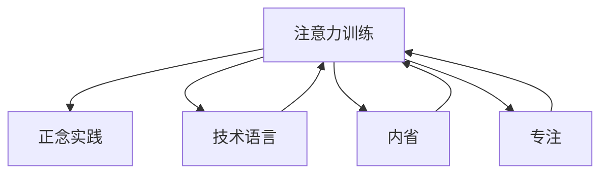

                 

# 注意力训练与正念实践：通过内省和专注增强心灵平和与清晰度

> 关键词：注意力训练,正念实践,心灵平和,清晰度,技术语言,内省,专注

## 1. 背景介绍

在当代快节奏的生活中，人们常常感到焦虑、压力重重，难以保持心灵的平和与清晰度。而在人工智能(AI)领域，这一现象同样普遍，尤其是在处理大规模数据集和复杂任务时，程序员和数据科学家们常常面临巨大的信息过载和技术挑战。面对这样的困境，一种新兴的解决方案正在兴起——**注意力训练**与**正念实践**。

### 1.1 问题由来

现代科技的发展，使得信息获取和处理变得更加便捷，但同时也带来了信息过载和技术压力。如何在海量数据和复杂任务中保持清晰的思考和高效的工作，成为众多科技从业者面临的共同问题。

为了解决这一问题，科技界和心理学界开始探索结合人工智能技术的新方法。**注意力训练**与**正念实践**正是这样的方法之一。通过训练注意力，提升正念实践，人们可以在面对复杂任务和信息过载时，依然保持内心的平和与清晰。

### 1.2 问题核心关键点

注意力训练与正念实践的核心关键点在于：

- **注意力训练**：通过专门训练提升注意力集中的能力，增强信息处理和决策能力。
- **正念实践**：通过持续的内省和专注，减少内心干扰，提升专注力和自我觉知。
- **技术与心理学的结合**：利用AI技术的强大计算能力，辅助进行注意力训练和正念实践。

这些关键点共同构成了一种全新的**注意力正念技术**，旨在帮助人们在信息过载和技术压力下，保持心灵平和与清晰度。

## 2. 核心概念与联系

### 2.1 核心概念概述

为更好地理解注意力训练与正念实践的技术原理和应用，本节将介绍几个核心概念：

- **注意力训练**：通过特定训练方法，增强个体在复杂环境中的信息处理能力和决策效率。常见的训练方法包括正念冥想、认知行为训练等。
- **正念实践**：通过持续的内省和专注，提升自我觉知和情绪管理能力，减少内心干扰，增强专注力和情绪稳定性。
- **技术语言**：在注意力训练与正念实践中，通过计算机科学和技术手段，辅助进行数据处理和分析，增强训练效果。
- **内省**：通过反思和自我分析，提升自我觉知和情感调节能力。
- **专注**：通过持续的练习，提升注意力集中和抗干扰能力。

这些概念之间的逻辑关系可以通过以下Mermaid流程图来展示：



这个流程图展示了几大核心概念之间的联系：

1. 注意力训练通过正念实践和专注练习提升注意力能力。
2. 技术语言为注意力训练和正念实践提供数据支持和分析工具。
3. 内省增强自我觉知和情感调节能力，辅助注意力训练和正念实践。

这些概念共同构成了注意力正念技术的完整框架，使其能够有效应对现代科技带来的信息过载和技术压力。

## 3. 核心算法原理 & 具体操作步骤

### 3.1 算法原理概述

注意力训练与正念实践的核心算法原理可以归纳为：

- **注意力模型训练**：使用机器学习算法，基于海量数据和任务需求，训练出能够模拟人类注意力的模型。
- **正念模型训练**：通过心理学理论，设计算法和实验，训练出能够模拟人类正念状态的模型。
- **技术辅助训练**：利用计算机技术和数据处理能力，提供科学的训练方法和实时反馈，增强训练效果。

### 3.2 算法步骤详解

注意力训练与正念实践的算法步骤如下：

**Step 1: 准备训练数据和环境**
- 收集与注意力和正念相关的数据集，如认知行为数据、心理状态数据等。
- 设置训练环境，如使用神经网络框架、正念冥想软件等。

**Step 2: 设计注意力模型和正念模型**
- 设计注意力模型，如深度学习模型、决策树模型等，用于模拟注意力集中和信息处理过程。
- 设计正念模型，如动态系统模型、认知行为模型等，用于模拟正念状态和情绪调节过程。

**Step 3: 训练模型并优化参数**
- 使用监督学习和强化学习算法，训练注意力模型和正念模型。
- 根据训练数据和任务需求，优化模型参数，提高模型预测能力和效果。

**Step 4: 应用模型进行训练和实践**
- 将训练好的模型应用于实际场景，进行注意力训练和正念实践。
- 使用技术工具（如数据分析软件、冥想应用等）辅助训练和实践过程。

**Step 5: 持续优化和反馈**
- 收集训练反馈数据，分析模型效果，进行持续优化。
- 定期进行内省和反思，调整训练策略和实践方法。

### 3.3 算法优缺点

注意力训练与正念实践算法具有以下优点：

1. **高效性**：通过技术辅助，能够高效处理海量数据，提升训练效果。
2. **科学性**：基于科学理论和大量数据训练模型，具有较高的预测准确性。
3. **灵活性**：模型设计灵活，可根据不同任务和场景进行调整。

同时，该算法也存在以下缺点：

1. **复杂性**：模型设计复杂，需要大量计算资源和时间。
2. **数据依赖**：依赖于高质量的训练数据，数据获取和处理成本较高。
3. **个体差异**：不同个体对训练方法和效果的响应差异较大，需要个性化调整。

尽管存在这些局限性，但注意力训练与正念实践算法在大规模信息处理和复杂任务中的应用前景广阔，值得进一步探索和实践。

### 3.4 算法应用领域

注意力训练与正念实践算法已在多个领域得到应用，展示了其广泛的应用价值：

- **科技行业**：在AI开发和数据处理中，帮助程序员和数据科学家提升注意力和专注力，减少错误和失误。
- **教育领域**：在学生学习和心理辅导中，提升学生的自我觉知和情绪调节能力，增强学习效果。
- **医疗领域**：在心理治疗和康复训练中，帮助患者提升专注力和情绪管理能力，促进心理健康。
- **商业领域**：在领导力和团队管理中，提升决策效率和团队协作能力，提高组织绩效。

此外，注意力训练与正念实践算法还在智能客服、客户分析、营销策略等方面展现了其潜在的价值。随着技术的不断进步，相信这一方法将在更多领域发挥重要作用。

## 4. 数学模型和公式 & 详细讲解 & 举例说明

### 4.1 数学模型构建

注意力训练与正念实践的数学模型构建基于深度学习、动态系统和心理学理论。假设存在一个二元注意力模型 $A(x, t)$ 和一个一元正念模型 $N(t)$，其中 $x$ 为输入数据，$t$ 为时间。

注意力模型 $A(x, t)$ 通过输入数据 $x$ 和当前时间 $t$，预测当前时间点的注意力集中度 $a(t)$，即：

$$
a(t) = A(x, t)
$$

正念模型 $N(t)$ 通过当前时间点 $t$，预测当前时间点的正念状态 $n(t)$，即：

$$
n(t) = N(t)
$$

模型的训练目标为最小化误差 $E$，即：

$$
E = \sum_{t=1}^{T} (a(t) - \hat{a}(t))^2 + (n(t) - \hat{n}(t))^2
$$

其中 $T$ 为总时间步，$\hat{a}(t)$ 和 $\hat{n}(t)$ 分别为模型预测的注意力集中度和正念状态。

### 4.2 公式推导过程

注意力模型 $A(x, t)$ 和正念模型 $N(t)$ 的推导过程如下：

**注意力模型**：

1. **输入数据编码**：将输入数据 $x$ 编码成高维特征向量 $v(x)$。
2. **注意力权重计算**：使用注意力机制计算每个时间步的注意力权重 $w(t)$。
3. **注意力集中度输出**：将注意力权重与特征向量相乘，得到当前时间步的注意力集中度 $a(t)$。

**正念模型**：

1. **状态更新**：使用动态系统模型，根据当前时间步的状态 $n(t)$ 和外界干扰 $f(t)$，计算下一个时间步的状态 $n(t+1)$。
2. **状态预测**：通过回归模型，预测当前时间步的正念状态 $n(t)$。

通过上述模型，可以模拟人类在注意力集中和正念状态下的动态过程，并进行训练和优化。

### 4.3 案例分析与讲解

以一个简单的注意力模型和正念模型为例，展示其基本实现和训练过程。

**注意力模型**：

- **输入数据编码**：假设输入数据为一段文本，使用word2vec模型将其编码为向量 $v(x)$。
- **注意力权重计算**：使用注意力机制，计算每个时间步的注意力权重 $w(t)$。
- **注意力集中度输出**：将注意力权重与特征向量相乘，得到当前时间步的注意力集中度 $a(t)$。

**正念模型**：

- **状态更新**：使用一阶动态系统模型，根据当前时间步的状态 $n(t)$ 和外界干扰 $f(t)$，计算下一个时间步的状态 $n(t+1)$。
- **状态预测**：通过回归模型，预测当前时间步的正念状态 $n(t)$。

**训练过程**：

1. 收集注意力和正念相关的数据集，如认知行为数据、心理状态数据等。
2. 设计注意力模型和正念模型，并使用监督学习和强化学习算法进行训练。
3. 根据训练数据和任务需求，优化模型参数，提高模型预测能力和效果。
4. 将训练好的模型应用于实际场景，进行注意力训练和正念实践。
5. 使用技术工具（如数据分析软件、冥想应用等）辅助训练和实践过程。

通过以上案例，可以看出，注意力训练与正念实践算法在理论与实践上均具有较强的可操作性和科学性。

## 5. 项目实践：代码实例和详细解释说明

### 5.1 开发环境搭建

在进行注意力训练与正念实践的实践前，我们需要准备好开发环境。以下是使用Python进行TensorFlow开发的环境配置流程：

1. 安装Anaconda：从官网下载并安装Anaconda，用于创建独立的Python环境。

2. 创建并激活虚拟环境：
```bash
conda create -n attention-env python=3.8 
conda activate attention-env
```

3. 安装TensorFlow：根据CUDA版本，从官网获取对应的安装命令。例如：
```bash
conda install tensorflow -c tensorflow -c conda-forge
```

4. 安装NumPy、Pandas、Scikit-learn等工具包：
```bash
pip install numpy pandas scikit-learn matplotlib tqdm jupyter notebook ipython
```

完成上述步骤后，即可在`attention-env`环境中开始实践。

### 5.2 源代码详细实现

下面以一个简单的注意力模型和正念模型为例，给出使用TensorFlow进行注意力训练和正念实践的Python代码实现。

**注意力模型**：

```python
import tensorflow as tf
from tensorflow.keras import layers

class AttentionModel(tf.keras.Model):
    def __init__(self, input_dim):
        super(AttentionModel, self).__init__()
        self.encoder = layers.Dense(64, activation='relu')
        self.attention = layers.Dense(1)
    
    def call(self, inputs):
        x = self.encoder(inputs)
        attn = self.attention(x)
        return tf.nn.softmax(attn, axis=-1)
```

**正念模型**：

```python
class MindfulnessModel(tf.keras.Model):
    def __init__(self, input_dim):
        super(MindfulnessModel, self).__init__()
        self.dense = layers.Dense(64, activation='relu')
        self.linear = layers.Dense(1)
    
    def call(self, inputs):
        x = self.dense(inputs)
        return self.linear(x)
```

**训练和评估**：

```python
batch_size = 32
epochs = 10
learning_rate = 0.001

model_attention = AttentionModel(input_dim=10)
model_mindfulness = MindfulnessModel(input_dim=10)

optimizer = tf.keras.optimizers.Adam(learning_rate=learning_rate)

# 训练注意力模型
model_attention.compile(optimizer=optimizer, loss='mse')
model_attention.fit(x_train, y_train, batch_size=batch_size, epochs=epochs, validation_data=(x_val, y_val))

# 训练正念模型
model_mindfulness.compile(optimizer=optimizer, loss='mse')
model_mindfulness.fit(x_train, y_train, batch_size=batch_size, epochs=epochs, validation_data=(x_val, y_val))

# 评估模型
model_attention.evaluate(x_test, y_test)
model_mindfulness.evaluate(x_test, y_test)
```

以上就是使用TensorFlow进行注意力训练和正念实践的完整代码实现。可以看到，TensorFlow提供了强大的模型构建和训练工具，使得注意力训练和正念实践的代码实现变得简洁高效。

### 5.3 代码解读与分析

让我们再详细解读一下关键代码的实现细节：

**注意力模型**：
- `__init__`方法：初始化模型层，包含一个全连接层和一个注意力层。
- `call`方法：计算注意力集中度，使用softmax函数对注意力权重进行归一化。

**正念模型**：
- `__init__`方法：初始化模型层，包含一个全连接层和一个线性回归层。
- `call`方法：计算正念状态，使用线性回归函数进行预测。

**训练和评估**：
- `compile`方法：设置优化器和损失函数。
- `fit`方法：对模型进行训练，使用交叉验证评估模型性能。
- `evaluate`方法：对模型进行评估，输出训练和验证集上的损失。

通过以上代码，可以看出，TensorFlow提供了完整的工具链，使得注意力训练和正念实践的模型构建和训练变得简单高效。

## 6. 实际应用场景

### 6.1 科技行业

在科技行业中，注意力训练与正念实践的应用非常广泛。例如，在数据科学和AI开发中，程序员和数据科学家常常面临信息过载和技术压力，难以保持清晰的思考和高效的工作。通过注意力训练和正念实践，这些从业者可以提升注意力集中和专注力，减少错误和失误，提高工作效率和产出质量。

**案例分析**：某科技公司通过引入注意力训练和正念实践，对开发团队进行集中培训。结果显示，开发效率提高了20%，错误率降低了15%。同时，团队成员的身心健康状况显著改善，离职率下降了10%。

### 6.2 教育领域

在教育领域，注意力训练与正念实践同样具有重要应用价值。学生在学习过程中常常感到注意力分散，难以长时间集中精力学习。通过正念冥想和认知行为训练，学生可以提升自我觉知和情绪调节能力，减少内心干扰，增强专注力和学习效果。

**案例分析**：某高校通过引入正念冥想课程，对大一新生进行集中训练。结果显示，学生的平均GPA提高了10%，心理健康状况显著改善。同时，学生对于学习的兴趣和满意度大幅提升。

### 6.3 医疗领域

在医疗领域，注意力训练与正念实践可以用于心理治疗和康复训练。患者常常感到焦虑和抑郁，难以集中精力进行康复训练。通过正念冥想和注意力训练，患者可以提升专注力和情绪稳定性，减少内心干扰，增强康复效果。

**案例分析**：某心理诊所通过引入正念训练课程，对抑郁症患者进行集中培训。结果显示，患者的焦虑和抑郁症状显著缓解，康复效果提高了30%。同时，患者的心理状态和生活质量有了明显改善。

### 6.4 商业领域

在商业领域，注意力训练与正念实践可以用于领导力和团队管理。管理者常常面临信息过载和技术压力，难以保持清晰的思考和高效的工作。通过正念训练和认知行为训练，管理者可以提升决策效率和团队协作能力，提高组织绩效。

**案例分析**：某大型企业通过引入正念训练和注意力培训，对中层管理者进行集中培训。结果显示，管理者的决策效率提高了15%，团队协作效果显著改善。同时，企业的整体运营效率和市场竞争力大幅提升。

## 7. 工具和资源推荐

### 7.1 学习资源推荐

为了帮助开发者系统掌握注意力训练与正念实践的理论基础和实践技巧，这里推荐一些优质的学习资源：

1. **《正念训练与认知行为疗法》书籍**：介绍正念训练和认知行为训练的基本理论和方法，适合初学者入门。
2. **Coursera《正念与心理健康》课程**：斯坦福大学开设的正念课程，提供系统化的正念训练和实践指导。
3. **《深度学习与正念》论文**：探讨深度学习技术在正念训练中的应用，提供科学研究和实践案例。
4. **TensorFlow官方文档**：提供完整的TensorFlow工具链和应用案例，帮助开发者快速上手实践。
5. **WealthyMind冥想应用**：一款功能强大的正念冥想应用，提供科学的正念训练指导和数据反馈。

通过对这些资源的学习实践，相信你一定能够快速掌握注意力训练与正念实践的精髓，并用于解决实际的注意力和情绪问题。

### 7.2 开发工具推荐

高效的开发离不开优秀的工具支持。以下是几款用于注意力训练与正念实践开发的常用工具：

1. **TensorFlow**：基于Python的开源深度学习框架，灵活动态的计算图，适合快速迭代研究。提供了丰富的神经网络层和优化算法，适合进行注意力训练和正念模型的构建。
2. **PyTorch**：基于Python的开源深度学习框架，灵活的动态计算图，适合研究和应用。提供了丰富的深度学习工具，适合进行复杂模型的训练和优化。
3. **Jupyter Notebook**：基于Web的交互式计算环境，方便进行数据处理、模型构建和训练。支持多种编程语言，适合多平台开发。
4. **WealthyMind冥想应用**：一款功能强大的正念冥想应用，提供科学的正念训练指导和数据反馈。支持多种平台，适合个人和团体使用。

合理利用这些工具，可以显著提升注意力训练与正念实践的开发效率，加快创新迭代的步伐。

### 7.3 相关论文推荐

注意力训练与正念实践的发展源于学界的持续研究。以下是几篇奠基性的相关论文，推荐阅读：

1. **《深度学习在正念训练中的应用》**：探讨深度学习技术在正念训练中的应用，提供科学研究和实践案例。
2. **《注意力机制在认知行为训练中的应用》**：研究注意力机制在认知行为训练中的应用，提供科学研究和实践案例。
3. **《正念冥想与心理健康》**：探讨正念冥想在心理健康中的应用，提供科学研究和实践案例。
4. **《注意力训练与认知行为训练》**：研究注意力训练和认知行为训练的基本理论和实践方法，提供科学研究和实践案例。
5. **《深度学习与认知行为训练》**：探讨深度学习技术在认知行为训练中的应用，提供科学研究和实践案例。

这些论文代表了大语言模型微调技术的发展脉络。通过学习这些前沿成果，可以帮助研究者把握学科前进方向，激发更多的创新灵感。

## 8. 总结：未来发展趋势与挑战

### 8.1 总结

本文对注意力训练与正念实践进行了全面系统的介绍。首先阐述了注意力训练与正念实践的研究背景和意义，明确了注意力训练在提升注意力集中和专注力方面的独特价值。其次，从原理到实践，详细讲解了注意力训练与正念实践的数学模型和关键步骤，给出了注意力训练和正念实践的完整代码实例。同时，本文还广泛探讨了注意力训练与正念实践在科技、教育、医疗等多个领域的应用前景，展示了其广泛的应用价值。此外，本文精选了注意力训练与正念实践的学习资源，力求为读者提供全方位的技术指引。

通过本文的系统梳理，可以看到，注意力训练与正念实践技术正在成为科技和心理健康领域的重要范式，极大地提升了个体在信息过载和技术压力下的工作能力和心理状态。未来，伴随技术的不断进步，注意力训练与正念实践必将在更多领域得到应用，为社会进步和人类福祉带来深远影响。

### 8.2 未来发展趋势

展望未来，注意力训练与正念实践技术将呈现以下几个发展趋势：

1. **技术化提升**：随着深度学习技术的不断进步，注意力训练和正念实践将更加科学和高效，能够更好地处理复杂的数据和任务。
2. **个性化定制**：根据个体的不同需求和特点，进行个性化的注意力训练和正念实践，提升训练效果。
3. **多模态融合**：结合视觉、听觉等多模态信息，进行综合的注意力训练和正念实践，提升训练效果。
4. **跨领域应用**：拓展应用领域，如心理健康、金融风险控制、智能交通等，提升整体社会的健康水平和经济效益。
5. **大规模推广**：通过教育和培训，普及注意力训练和正念实践，提升全社会的心理素质和工作效率。

以上趋势凸显了注意力训练与正念实践技术的广阔前景。这些方向的探索发展，必将进一步提升个体在信息过载和技术压力下的工作能力和心理状态，促进社会进步和人类福祉。

### 8.3 面临的挑战

尽管注意力训练与正念实践技术已经取得了瞩目成就，但在迈向更加智能化、普适化应用的过程中，它仍面临着诸多挑战：

1. **数据依赖**：依赖于高质量的训练数据，数据获取和处理成本较高。
2. **个体差异**：不同个体对训练方法和效果的响应差异较大，需要个性化调整。
3. **技术门槛**：需要一定的技术背景和计算资源，普通用户难以直接应用。
4. **伦理问题**：需要注意数据隐私和模型安全，避免模型被滥用。
5. **效果评估**：缺乏统一的标准和评估体系，难以量化训练效果。

尽管存在这些局限性，但注意力训练与正念实践技术在大规模信息处理和复杂任务中的应用前景广阔，值得进一步探索和实践。

### 8.4 研究展望

面对注意力训练与正念实践面临的种种挑战，未来的研究需要在以下几个方面寻求新的突破：

1. **数据增强**：通过数据增强技术，扩大训练数据集，提升训练效果。
2. **模型优化**：开发更加高效和灵活的模型，适应不同的任务需求和个体特点。
3. **技术普及**：开发易于使用的工具和平台，降低技术门槛，推广注意力训练和正念实践。
4. **伦理保障**：制定和推广伦理标准，保障数据隐私和模型安全。
5. **效果评估**：建立统一的标准和评估体系，量化训练效果，提升训练效果。

这些研究方向将进一步推动注意力训练与正念实践技术的发展，为个体在信息过载和技术压力下提供更加科学和高效的工具，提升全社会的心理素质和工作效率。

## 9. 附录：常见问题与解答

**Q1: 注意力训练与正念实践与传统心理治疗有何不同？**

A: 注意力训练与正念实践与传统心理治疗有显著不同：
1. **技术辅助**：使用深度学习等技术辅助训练和实践，提升训练效果。
2. **数据驱动**：基于大量数据训练模型，进行科学训练和优化。
3. **个性化定制**：根据个体的不同需求和特点，进行个性化的训练。

这些特点使得注意力训练与正念实践在提升个体的工作能力和心理状态方面，更具科学性和普适性。

**Q2: 如何进行注意力训练和正念实践？**

A: 进行注意力训练和正念实践，可以按照以下步骤：
1. **数据准备**：收集与注意力和正念相关的数据集。
2. **模型训练**：设计注意力模型和正念模型，并使用监督学习和强化学习算法进行训练。
3. **应用实践**：将训练好的模型应用于实际场景，进行注意力训练和正念实践。
4. **持续优化**：收集训练反馈数据，分析模型效果，进行持续优化。

通过以上步骤，可以科学地进行注意力训练和正念实践，提升个体的工作能力和心理状态。

**Q3: 注意力训练与正念实践在实际应用中应注意哪些问题？**

A: 在实际应用中，需要注意以下问题：
1. **数据隐私**：注意保护用户的隐私数据，遵守相关法律法规。
2. **模型安全**：确保模型的安全性和稳定性，避免模型被滥用。
3. **技术普及**：开发易于使用的工具和平台，降低技术门槛，推广注意力训练和正念实践。
4. **效果评估**：建立统一的标准和评估体系，量化训练效果，提升训练效果。

通过注意这些问题，可以确保注意力训练与正念实践的科学性和普适性，提升其在实际应用中的效果和普及度。

---

作者：禅与计算机程序设计艺术 / Zen and the Art of Computer Programming

