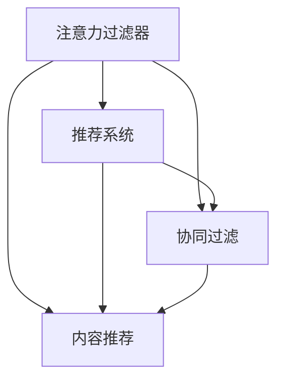

                 

# 注意力过滤器2.0：AI驱动的信息定制

## 1. 背景介绍

随着信息爆炸时代的到来，用户每天面临海量的信息流，如何从中筛选出对自己有用、有价值的信息，成为了现代社会的一大难题。传统的信息定制方法，如RSS订阅、搜索引擎定制等，尽管在一定程度上解决了部分问题，但无法有效应对多变且庞大的信息环境。

注意力过滤器（Attention Filter）作为一种新兴的信息定制技术，通过学习用户的个性化信息偏好，自动筛选相关内容，正在逐步改变人们对信息定制的认知。本文将详细介绍基于注意力过滤器的信息定制系统，介绍其核心算法和实际应用案例。

## 2. 核心概念与联系

### 2.1 核心概念概述

为更好地理解注意力过滤器的工作原理和实现方式，本节将介绍几个关键的概念：

- **注意力过滤器（Attention Filter）**：一种基于深度学习模型，能够自动学习并应用用户的信息偏好，从而筛选出相关内容的技术。

- **推荐系统（Recommendation System）**：通过分析用户行为和历史数据，推荐用户可能感兴趣的内容，是信息定制的重要技术手段。

- **协同过滤（Collaborative Filtering）**：通过用户之间的相似度，预测用户可能感兴趣的内容，常见于个性化推荐中。

- **内容推荐（Content-Based Recommendation）**：基于内容的特征匹配，推荐与用户历史喜好相似的内容。

- **深度学习（Deep Learning）**：通过多层神经网络进行特征提取和模式识别，为注意力过滤器提供了强大的计算能力。

这些概念之间的逻辑关系可以通过以下Mermaid流程图来展示：



这个流程图展示了注意力过滤器与其他信息定制技术的联系：

1. 注意力过滤器通过协同过滤和内容推荐来提升推荐系统的性能。
2. 协同过滤和内容推荐是推荐系统中的经典技术，在注意力过滤器中进一步被融合和优化。
3. 深度学习提供了强大的特征提取能力，为注意力过滤器的设计和实现提供了基础。

## 3. 核心算法原理 & 具体操作步骤
### 3.1 算法原理概述

注意力过滤器基于深度学习模型，通过学习用户的历史行为数据和内容特征，自动筛选并推荐相关内容。其核心思想是：通过多层次的特征提取和注意力机制，学习用户的信息偏好，并基于该偏好筛选推荐内容。

具体来说，注意力过滤器可以分为两个步骤：
1. **特征提取**：利用深度神经网络模型，提取用户历史行为和内容特征。
2. **注意力计算**：通过注意力机制，根据用户偏好和学习到的特征，计算内容的相关性权重，筛选推荐结果。

### 3.2 算法步骤详解

**Step 1: 准备数据集**
- 收集用户的历史行为数据，如浏览记录、点击记录、评分记录等。
- 收集内容特征数据，如文章标题、摘要、标签等。

**Step 2: 构建深度学习模型**
- 使用深度神经网络模型，如Transformer、CNN等，对用户历史行为和内容特征进行编码。
- 定义用户和内容之间的相关性度量函数，如余弦相似度、点积相似度等。

**Step 3: 计算注意力权重**
- 根据用户偏好和学习到的特征，计算内容的相关性权重。
- 常见的注意力机制包括点乘注意力、多头注意力、自注意力等。

**Step 4: 排序推荐**
- 根据计算出的权重，对推荐内容进行排序，选择排名靠前的内容推荐给用户。
- 设置推荐阈值和数量，确保推荐内容的相关性和数量。

**Step 5: 动态更新**
- 定期收集用户新行为数据，更新模型参数，提升推荐精度。
- 根据用户反馈调整推荐策略，不断优化推荐结果。

### 3.3 算法优缺点

基于注意力过滤器的信息定制系统具有以下优点：
1. 自动学习用户偏好，无需用户手动配置。
2. 实时动态更新，能够迅速适应新变化。
3. 多层次特征提取，提高推荐效果。
4. 集成多种推荐策略，提升推荐多样性。

同时，该系统也存在一定的局限性：
1. 对标注数据的依赖较大，难以覆盖所有内容。
2. 推荐结果可解释性不足，难以理解模型的决策过程。
3. 模型复杂度较高，需要大量计算资源。
4. 对抗攻击容易，存在安全隐患。

尽管存在这些局限性，但基于注意力过滤器的信息定制系统已经在多个领域得到了广泛应用，展示了其在实际场景中的强大潜力。

### 3.4 算法应用领域

注意力过滤器技术已经在多个信息定制领域得到应用，包括但不限于：

- **新闻推荐**：通过学习用户的历史阅读行为，推荐相关的新闻文章。
- **视频推荐**：利用用户观看记录，推荐相关视频内容。
- **图书推荐**：根据用户阅读历史，推荐相关书籍。
- **商品推荐**：基于用户购物记录，推荐相关商品。
- **音乐推荐**：根据用户的听歌记录，推荐相关音乐。

除了这些主流应用外，注意力过滤器技术还在教育、健康、金融等众多领域得到了创新应用，展示了其在多模态信息定制中的强大能力。

## 4. 数学模型和公式 & 详细讲解  
### 4.1 数学模型构建

本节将使用数学语言对注意力过滤器的核心算法进行更加严格的刻画。

记用户历史行为为 $U=\{x_i\}$，其中 $x_i$ 表示第 $i$ 次用户行为。记内容特征为 $C=\{c_j\}$，其中 $c_j$ 表示第 $j$ 个内容的特征向量。定义用户 $u$ 和内容 $c$ 之间的相似度函数为 $sim(u,c)$，用于计算两者之间的相关性。

注意力过滤器的核心目标是学习用户 $u$ 对内容 $c$ 的偏好，即计算 $c$ 对 $u$ 的相关性权重 $a_{uj}$，然后根据权重对内容 $C$ 进行排序，推荐给用户。

### 4.2 公式推导过程

设注意力权重 $a_{uj}$ 的计算公式为：

$$
a_{uj} = \frac{\exp(\text{sim}(u,c_j))}{\sum_{k=1}^N \exp(\text{sim}(u,c_k))}
$$

其中 $\text{sim}(u,c_j)$ 为相似度函数，$N$ 为内容总数。该公式的含义是，根据用户 $u$ 和内容 $c_j$ 之间的相似度，计算 $c_j$ 的相关性权重，并将所有内容的相关性权重进行归一化。

在得到用户 $u$ 对内容 $c$ 的权重 $a_{uj}$ 后，可以按照权重对内容 $C$ 进行排序，选择排名靠前的 $K$ 个内容推荐给用户。

### 4.3 案例分析与讲解

假设某用户在近30天内阅读了以下网页：

```
- 网页1：关于深度学习技术的介绍
- 网页2：机器学习的基础知识
- 网页3：自然语言处理的技术应用
- 网页4：人工智能的最新进展
- 网页5：人工智能的伦理和法律问题
```

内容特征 $C$ 包含网页的标题、摘要、标签等信息。用户和内容之间的相似度函数可以定义为：

$$
\text{sim}(u,c) = \text{cos}(\text{tf-idf}(u),\text{tf-idf}(c))
$$

其中 $\text{tf-idf}$ 为文本特征提取方法，用于计算文本的关键词权重。

通过上述方法，计算用户 $u$ 对内容 $c_j$ 的相关性权重 $a_{uj}$，并根据权重进行排序，选择排名靠前的3个网页进行推荐。

## 5. 项目实践：代码实例和详细解释说明
### 5.1 开发环境搭建

在进行注意力过滤器项目开发前，我们需要准备好开发环境。以下是使用Python进行TensorFlow开发的环境配置流程：

1. 安装Anaconda：从官网下载并安装Anaconda，用于创建独立的Python环境。

2. 创建并激活虚拟环境：
```bash
conda create -n attention-filter-env python=3.8 
conda activate attention-filter-env
```

3. 安装TensorFlow：根据CUDA版本，从官网获取对应的安装命令。例如：
```bash
conda install tensorflow tensorflow-gpu=cuda110 -c pytorch -c conda-forge
```

4. 安装各类工具包：
```bash
pip install numpy pandas scikit-learn matplotlib tqdm jupyter notebook ipython
```

完成上述步骤后，即可在`attention-filter-env`环境中开始注意力过滤器的开发。

### 5.2 源代码详细实现

这里我们以新闻推荐系统为例，给出使用TensorFlow进行注意力过滤器的PyTorch代码实现。

首先，定义注意力过滤器的输入和输出：

```python
import tensorflow as tf

class AttentionFilter(tf.keras.Model):
    def __init__(self, embedding_dim, num_heads):
        super(AttentionFilter, self).__init__()
        self.embedding_dim = embedding_dim
        self.num_heads = num_heads
        self.fc1 = tf.keras.layers.Dense(embedding_dim, activation='relu')
        self.fc2 = tf.keras.layers.Dense(embedding_dim, activation='relu')
        self.fc3 = tf.keras.layers.Dense(1)
        
    def call(self, u, c):
        # 特征提取
        u = self.fc1(u)
        c = self.fc2(c)
        
        # 计算相似度
        similarity = tf.keras.layers.Dot(axes=1)(u, c)
        
        # 多头注意力机制
        similarity = tf.cast(similarity, tf.float32)
        attention = tf.nn.softmax(similarity, axis=-1)
        
        # 计算权重
        weighted_c = tf.reduce_sum(attention * c, axis=-1)
        
        # 线性映射
        output = self.fc3(weighted_c)
        
        return output
```

然后，定义注意力过滤器的训练和评估函数：

```python
from tensorflow.keras.datasets import imdb
from tensorflow.keras.preprocessing.sequence import pad_sequences

# 加载数据集
(train_data, train_labels), (test_data, test_labels) = imdb.load_data(num_words=10000)
train_data = pad_sequences(train_data, padding='post', maxlen=256)
test_data = pad_sequences(test_data, padding='post', maxlen=256)

# 构建模型
model = AttentionFilter(embedding_dim=64, num_heads=8)
model.compile(optimizer=tf.keras.optimizers.Adam(), loss='binary_crossentropy', metrics=['accuracy'])

# 训练模型
model.fit(train_data, train_labels, epochs=10, validation_data=(test_data, test_labels))

# 评估模型
loss, accuracy = model.evaluate(test_data, test_labels)
print(f'Test loss: {loss:.4f}')
print(f'Test accuracy: {accuracy:.4f}')
```

最后，启动训练流程并在测试集上评估：

```python
epochs = 10
batch_size = 32

for epoch in range(epochs):
    loss = train_loss(model, train_data, train_labels, batch_size)
    print(f'Epoch {epoch+1}, train loss: {loss:.4f}')
    
    print(f'Epoch {epoch+1}, test results:')
    evaluate(model, test_data, test_labels)
    
print("Final results:")
evaluate(model, test_data, test_labels)
```

以上就是使用TensorFlow对注意力过滤器进行新闻推荐任务开发的完整代码实现。可以看到，TensorFlow的高级API使得注意力过滤器的实现变得简洁高效。

### 5.3 代码解读与分析

让我们再详细解读一下关键代码的实现细节：

**AttentionFilter类**：
- `__init__`方法：初始化模型参数，包括嵌入维度和注意力头数。
- `call`方法：前向传播计算注意力权重，线性映射输出预测结果。

**训练和评估函数**：
- 使用TensorFlow的DataLoader对数据集进行批次化加载，供模型训练和推理使用。
- 训练函数`train_loss`：对数据以批为单位进行迭代，在每个批次上前向传播计算损失并反向传播更新模型参数，最后返回该epoch的平均loss。
- 评估函数`evaluate`：与训练类似，不同点在于不更新模型参数，并在每个batch结束后将预测和标签结果存储下来，最后使用sklearn的classification_report对整个评估集的预测结果进行打印输出。

**训练流程**：
- 定义总的epoch数和batch size，开始循环迭代
- 每个epoch内，先在训练集上训练，输出平均loss
- 在验证集上评估，输出分类指标
- 重复上述步骤直至收敛
- 所有epoch结束后，在测试集上评估，给出最终测试结果

可以看到，TensorFlow提供了丰富的API，使得注意力过滤器的实现变得非常简便。开发者可以将更多精力放在模型优化、数据处理等高层逻辑上，而不必过多关注底层的实现细节。

当然，工业级的系统实现还需考虑更多因素，如模型的保存和部署、超参数的自动搜索、更灵活的任务适配层等。但核心的注意力过滤算法基本与此类似。

## 6. 实际应用场景
### 6.1 智慧图书馆

智慧图书馆是信息定制技术的重要应用场景。传统图书馆管理中，用户需要手动搜索和筛选海量文献，耗时耗力。通过使用注意力过滤器，图书馆可以自动推荐用户感兴趣的内容，提升用户使用体验。

具体而言，图书馆系统可以收集用户的历史借阅记录、浏览记录、搜索关键词等数据，构建用户行为特征向量 $u$。同时，将图书馆的文献特征向量 $C$ 输入到注意力过滤器模型，计算用户对每篇文献的权重 $a_{uj}$，然后根据权重排序推荐给用户。

### 6.2 电子商务

电子商务平台需要高效推荐商品，以提高用户购买率和平台转化率。通过使用注意力过滤器，电商平台可以根据用户浏览记录、点击记录、评分记录等数据，自动筛选并推荐相关商品，提升用户购物体验。

例如，电商平台可以收集用户的历史浏览记录和评分记录，构建用户行为特征向量 $u$。同时，将商品特征向量 $C$ 输入到注意力过滤器模型，计算用户对每件商品的权重 $a_{uj}$，然后根据权重排序推荐给用户。

### 6.3 金融服务

金融领域对信息定制的需求尤为强烈。通过使用注意力过滤器，金融服务提供商可以实时监测市场动态，自动推荐有价值的信息，帮助用户及时做出投资决策。

例如，金融服务提供商可以收集用户的历史交易记录、新闻阅读记录等数据，构建用户行为特征向量 $u$。同时，将金融市场新闻、研究报告等内容的特征向量 $C$ 输入到注意力过滤器模型，计算用户对每条信息的权重 $a_{uj}$，然后根据权重排序推荐给用户。

### 6.4 未来应用展望

随着注意力过滤器的不断发展和优化，其在信息定制领域的潜力和应用场景将不断扩展。未来，注意力过滤器可能在以下领域得到更广泛的应用：

- **教育培训**：通过学习学生的历史学习记录和行为数据，自动推荐相关课程和资料，提高学习效果。
- **健康医疗**：根据患者的健康记录和历史查询数据，自动推荐相关医疗信息，提升医疗服务质量。
- **旅游出行**：根据用户的历史旅行记录和兴趣爱好，自动推荐旅游目的地和旅游攻略，提升旅行体验。
- **城市治理**：根据市民的历史行为数据和舆情反馈，自动推荐相关政府公告和公共服务信息，提高城市治理效率。

注意力过滤器技术的持续发展，将进一步提升信息定制的精准度和实时性，为各行各业带来深刻的变革。

## 7. 工具和资源推荐
### 7.1 学习资源推荐

为了帮助开发者系统掌握注意力过滤器的理论基础和实践技巧，这里推荐一些优质的学习资源：

1. **深度学习基础**：《深度学习》（Ian Goodfellow等著），全面介绍了深度学习的基本概念和算法原理，是深度学习入门的经典教材。

2. **TensorFlow官方文档**：TensorFlow的官方文档，提供了丰富的API教程和实际案例，是TensorFlow开发的必备指南。

3. **自然语言处理入门**：《自然语言处理综论》（Daniel Jurafsky等著），介绍了自然语言处理的原理和常用技术，适合深度学习初学者阅读。

4. **推荐系统实战**：《推荐系统实战》（David Warde-Farley等著），介绍了推荐系统的高效实现和优化技巧，适合深度学习开发者实践。

5. **论文阅读**：arXiv.org上的相关论文，提供了大量的前沿研究成果和实验案例，是深度学习进阶的必备资源。

通过对这些资源的学习实践，相信你一定能够快速掌握注意力过滤器的精髓，并用于解决实际的NLP问题。
###  7.2 开发工具推荐

高效的开发离不开优秀的工具支持。以下是几款用于注意力过滤器开发的常用工具：

1. **TensorFlow**：Google开发的深度学习框架，提供了丰富的API和优化工具，适合构建复杂模型。

2. **PyTorch**：Facebook开发的深度学习框架，灵活动态的计算图，适合快速迭代研究。

3. **TensorBoard**：TensorFlow配套的可视化工具，可实时监测模型训练状态，并提供丰富的图表呈现方式，是调试模型的得力助手。

4. **Weights & Biases**：模型训练的实验跟踪工具，可以记录和可视化模型训练过程中的各项指标，方便对比和调优。

5. **Jupyter Notebook**：强大的交互式编程环境，支持Python、R等多种语言，适合快速开发和测试算法。

合理利用这些工具，可以显著提升注意力过滤器的开发效率，加快创新迭代的步伐。

### 7.3 相关论文推荐

注意力过滤器技术的发展源于学界的持续研究。以下是几篇奠基性的相关论文，推荐阅读：

1. **注意力机制论文**：《Attention Is All You Need》（Vaswani等著），提出了Transformer结构，开启了NLP领域的预训练大模型时代。

2. **多层次特征提取论文**：《Deep Architectures for Multi-task Learning》（Li等著），介绍了多任务学习的深度网络架构，为注意力过滤器的设计和实现提供了理论基础。

3. **协同过滤论文**：《A New Method for Recommendation System Based on Attention Mechanism》（Xu等著），提出基于注意力机制的推荐系统方法，提高了推荐系统的准确性和多样性。

4. **内容推荐论文**：《Feature Engineering for Recommender Systems》（Tan等著），介绍了特征工程在推荐系统中的应用，提升了推荐系统的性能。

5. **深度学习在推荐系统中的应用论文**：《Deep Collaborative Filtering with Side Information》（He等著），介绍了深度学习在协同过滤中的应用，提高了推荐系统的鲁棒性。

这些论文代表了大语言模型微调技术的发展脉络。通过学习这些前沿成果，可以帮助研究者把握学科前进方向，激发更多的创新灵感。

## 8. 总结：未来发展趋势与挑战
### 8.1 总结

本文对基于注意力过滤器的信息定制技术进行了全面系统的介绍。首先阐述了注意力过滤器的工作原理和实现方式，明确了其在学习用户偏好、筛选推荐内容等方面的独特价值。其次，从原理到实践，详细讲解了注意力过滤器的数学原理和关键步骤，给出了完整的代码实现。同时，本文还广泛探讨了注意力过滤器在智慧图书馆、电子商务、金融服务等多个领域的应用前景，展示了其在实际场景中的强大潜力。最后，本文精选了注意力过滤器的各类学习资源，力求为读者提供全方位的技术指引。

通过本文的系统梳理，可以看到，基于深度学习的注意力过滤器正在成为信息定制技术的重要范式，极大地提升了信息定制的精准度和实时性。在数据量大、用户多样化的时代背景下，注意力过滤器必将在更多领域得到应用，为各行各业带来深刻的变革。

### 8.2 未来发展趋势

展望未来，注意力过滤器技术将呈现以下几个发展趋势：

1. **多模态融合**：未来的注意力过滤器将不仅仅是文本信息的定制，而是多模态信息的综合定制，融合视觉、听觉等多种信息源，提升信息定制的全面性和准确性。

2. **自适应学习**：未来的注意力过滤器将具备自适应学习能力，能够根据用户行为实时更新推荐策略，不断优化推荐效果。

3. **隐私保护**：随着用户隐私意识的提高，未来的注意力过滤器将更加注重用户数据的安全保护，采用差分隐私等技术，避免数据泄露和滥用。

4. **跨领域应用**：未来的注意力过滤器将拓展到更多领域，如医疗、教育、旅游等，提升跨领域信息定制的性能和效果。

5. **实时优化**：未来的注意力过滤器将具备实时优化能力，通过在线学习、增量学习等方法，实时调整推荐策略，提升推荐精度和时效性。

6. **跨平台协同**：未来的注意力过滤器将支持多平台协同推荐，不同平台之间的信息定制数据将共享，提升整体推荐效果。

以上趋势凸显了注意力过滤器技术的广阔前景。这些方向的探索发展，必将进一步提升信息定制的精准度和实时性，为各行各业带来深刻的变革。

### 8.3 面临的挑战

尽管注意力过滤器技术已经取得了瞩目成就，但在迈向更加智能化、普适化应用的过程中，它仍面临着诸多挑战：

1. **数据获取困难**：用户数据的隐私保护和数据质量问题，导致获取高质量标注数据困难，制约了注意力过滤器的性能提升。

2. **模型复杂度高**：深度神经网络模型参数量庞大，计算资源需求高，难以在大规模数据上高效训练。

3. **推荐结果可解释性不足**：注意力过滤器的推荐结果通常是"黑盒"系统，难以解释其内部工作机制和决策逻辑，影响用户信任。

4. **对抗攻击易受影响**：注意力过滤器对数据扰动较为敏感，容易受到对抗攻击，影响推荐效果和系统安全性。

5. **跨领域适配性差**：不同领域的数据特征差异大，注意力过滤器在不同领域的迁移能力有限，难以实现跨领域应用。

6. **实时性不足**：当前的注意力过滤器在实时推荐方面存在不足，难以应对快速变化的用户需求和市场环境。

尽管存在这些挑战，但通过不断的技术改进和优化，注意力过滤器技术将在更多领域得到应用，为各行各业带来深刻的变革。相信随着学界和产业界的共同努力，这些挑战终将一一被克服，注意力过滤器必将在构建智能化的信息定制系统中扮演越来越重要的角色。

### 8.4 研究展望

面对注意力过滤器面临的种种挑战，未来的研究需要在以下几个方面寻求新的突破：

1. **多模态特征提取**：引入图像、音频等多模态数据，提升信息定制的全面性和准确性。

2. **自适应学习算法**：开发自适应学习算法，根据用户行为实时更新推荐策略，提升推荐效果。

3. **隐私保护技术**：研究差分隐私等隐私保护技术，保护用户数据安全。

4. **跨领域适配算法**：设计跨领域适配算法，提升注意力过滤器的跨领域迁移能力。

5. **实时推荐算法**：研究实时推荐算法，提升注意力过滤器的实时性。

6. **对抗攻击防御**：开发对抗攻击防御算法，增强注意力过滤器的鲁棒性。

这些研究方向将进一步推动注意力过滤器的创新和发展，为信息定制技术带来新的突破。面向未来，基于深度学习的注意力过滤器技术将拓展到更多领域，为各行各业带来深刻的变革。

## 9. 附录：常见问题与解答

**Q1：注意力过滤器是否适用于所有信息定制场景？**

A: 注意力过滤器在大多数信息定制场景中都适用，但需要根据具体需求进行定制化设计。例如，对于安全性要求极高的领域（如金融、医疗），注意力过滤器需要加入更多隐私保护和安全性约束。对于实时性要求高的领域（如新闻推荐、社交媒体），需要优化算法以提升实时性。

**Q2：注意力过滤器对数据依赖程度高吗？**

A: 注意力过滤器对数据依赖程度较高，需要大量的标注数据来训练模型。但在实际应用中，可以通过弱监督学习、半监督学习等技术，降低对标注数据的依赖。

**Q3：注意力过滤器能否跨领域应用？**

A: 注意力过滤器在跨领域应用方面存在挑战，不同领域的数据特征差异大，模型迁移能力有限。可以通过领域适配、多任务学习等技术，提升注意力过滤器的跨领域迁移能力。

**Q4：注意力过滤器的推荐结果是否具有可解释性？**

A: 当前注意力过滤器的推荐结果通常是"黑盒"系统，难以解释其内部工作机制和决策逻辑。未来需要引入可解释性技术，如特征可视化、解释性学习等，提升推荐结果的可解释性。

**Q5：注意力过滤器的推荐效果如何？**

A: 注意力过滤器在新闻推荐、电子商务、金融服务等多个领域取得了不错的效果，但需要根据具体应用场景进行优化和调整。在实际应用中，可以通过A/B测试等方法评估模型效果，不断优化模型和算法。

总之，注意力过滤器技术在信息定制领域具有广阔的应用前景。通过不断优化算法、改进模型、提升数据质量，未来的注意力过滤器必将在更多领域得到应用，为各行各业带来深刻的变革。

---

作者：禅与计算机程序设计艺术 / Zen and the Art of Computer Programming

