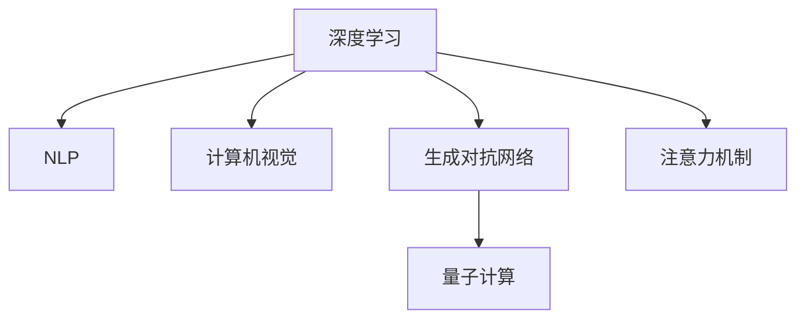

                 

# 注意力量子跃迁工程师：AI时代的认知突破技术专家

## 1. 背景介绍

### 1.1 问题由来
随着人工智能(AI)技术的迅猛发展，特别是在深度学习领域的突破性进展，越来越多的技术被应用于现实世界的各种场景中。然而，这些技术往往需要高层次的认知理解能力和复杂的计算资源，使得传统工程师难以直接应用这些前沿技术。因此，需要一种新的技术角色，将这些技术转化为更易于理解和应用的形式，这就是注意力量子跃迁工程师。

### 1.2 问题核心关键点
注意力量子跃迁工程师的核心目标是通过理解和应用深度学习等前沿技术，帮助企业和开发者突破现有认知界限，实现新的认知突破。其关键点包括：

- 理解深度学习技术的基本原理和算法。
- 掌握深度学习技术的实际应用，如自然语言处理(NLP)、计算机视觉、生成对抗网络(GAN)等。
- 将深度学习技术应用于各种实际问题，并实现认知突破。

### 1.3 问题研究意义
注意力量子跃迁工程师在AI时代具有重要意义，包括：

- 推动AI技术的普及。工程师通过掌握这些技术，可以将复杂的技术问题转化为更易理解的形式，促进AI技术的普及和应用。
- 实现认知突破。通过将深度学习技术应用于实际问题，实现新的认知突破，推动行业创新。
- 提高企业竞争力。掌握前沿技术的工程师能够为企业带来新的价值和竞争力。

## 2. 核心概念与联系

### 2.1 核心概念概述

为更好地理解注意力量子跃迁工程师，本节将介绍几个密切相关的核心概念：

- 深度学习(Deep Learning)：一种基于人工神经网络的机器学习技术，通过多层次的抽象学习，实现对复杂数据的建模。
- 自然语言处理(NLP)：将计算机科学和语言学相结合，研究如何使计算机能够理解、解释和生成人类语言的技术。
- 计算机视觉(Computer Vision)：研究如何让计算机“看到”和“理解”图像和视频的技术。
- 生成对抗网络(GAN)：一种生成模型，通过两个神经网络相互对抗训练，生成逼真的图像、音频、文本等内容。
- 量子计算(Quantum Computing)：一种新型的计算方式，利用量子比特的量子叠加和纠缠等特性，实现更高效的计算。
- 注意力机制(Attention Mechanism)：一种机制，通过计算输入序列中每个元素对输出的影响，提升模型对复杂序列的处理能力。

这些核心概念之间的逻辑关系可以通过以下Mermaid流程图来展示：



这个流程图展示了几大核心概念之间的相互联系：

- 深度学习是其他技术的基础。
- 自然语言处理、计算机视觉、生成对抗网络都是深度学习的子领域。
- 量子计算和注意力机制都是深度学习的扩展应用。

这些概念共同构成了注意力量子跃迁工程师的工作范畴，使其能够更好地理解和应用深度学习技术。

## 3. 核心算法原理 & 具体操作步骤
### 3.1 算法原理概述

注意力量子跃迁工程师的核心工作是理解和应用深度学习算法，解决实际问题。其中，深度学习算法中最基础且最重要的就是注意力机制。以下将详细讲解注意力机制的原理和操作步骤。

### 3.2 算法步骤详解

注意力机制的原理是通过计算输入序列中每个元素对输出的影响，从而提升模型对复杂序列的处理能力。其基本步骤如下：

1. **编码器编码**：将输入序列编码为一系列向量。
2. **查询-键值对**：将每个向量表示为查询向量和键值对向量。
3. **注意力计算**：计算每个查询向量与键值向量之间的注意力权重。
4. **加权求和**：根据注意力权重对键值向量进行加权求和，得到上下文向量。
5. **输出**：将上下文向量作为输出。

以Transformer模型为例，注意力机制的具体操作步骤如下：

1. **自注意力层**：将输入序列中的每个元素作为查询向量，其他元素作为键值向量，通过点积计算注意力权重。
2. **多头注意力**：将自注意力层重复多次，每次使用不同的权重矩阵，得到多头注意力结果。
3. **残差连接**：将多头注意力结果与原始输入进行残差连接。
4. **线性投影**：将残差连接结果通过线性投影，得到输出。

### 3.3 算法优缺点

注意力机制在处理序列数据时具有以下优点：

- 提升模型处理复杂序列的能力。
- 降低模型对输入序列长度的依赖。
- 提高模型对不同序列特征的关注度。

同时，也存在一些缺点：

- 计算复杂度高。注意力机制需要计算所有查询向量与键值向量之间的点积，计算量较大。
- 难以解释。注意力机制的决策过程难以解释，缺乏透明性。
- 对输入数据依赖度高。输入数据的质量和特征对注意力机制的效果有直接影响。

### 3.4 算法应用领域

注意力机制在多个领域都有广泛应用，包括：

- 自然语言处理(NLP)：如机器翻译、文本分类、信息抽取等任务。
- 计算机视觉(CV)：如图像描述生成、物体检测等任务。
- 音频处理：如语音识别、音频分类等任务。
- 推荐系统：如用户推荐、商品推荐等任务。

这些领域都涉及到对复杂序列数据的处理，注意力机制的引入可以显著提升模型的效果。

## 4. 数学模型和公式 & 详细讲解 & 举例说明
### 4.1 数学模型构建

注意力机制的数学模型可以表示为：

$$
\mathrm{Attention}(Q,K,V)=\mathrm{Softmax}\left(\frac{QK^T}{\sqrt{d_{k}}}\right)V
$$

其中，$Q$表示查询向量，$K$表示键值向量，$V$表示值向量。$\mathrm{Softmax}$函数用于计算注意力权重。

### 4.2 公式推导过程

推导过程如下：

1. **计算注意力权重**：
   $$
   \alpha_{ij}=\frac{\exp\left(\frac{Q_iK_j^T}{\sqrt{d_k}}\right)}{\sum_{j=1}^{n}\exp\left(\frac{Q_iK_j^T}{\sqrt{d_k}}\right)}
   $$

2. **计算上下文向量**：
   $$
   C_j=\sum_{i=1}^{m}\alpha_{ij}V_i
   $$

其中，$d_k$表示键向量的维度，$m$表示查询向量的数量，$n$表示键向量的数量。

### 4.3 案例分析与讲解

以机器翻译为例，假设输入序列为“I love you”，输出序列为“Je t'aime”。使用注意力机制，模型能够动态地关注输入序列中的每个单词，从而更好地理解上下文关系，生成更加准确的翻译结果。

## 5. 项目实践：代码实例和详细解释说明
### 5.1 开发环境搭建

在进行注意力机制的实践前，我们需要准备好开发环境。以下是使用Python进行PyTorch开发的环境配置流程：

1. 安装Anaconda：从官网下载并安装Anaconda，用于创建独立的Python环境。

2. 创建并激活虚拟环境：
```bash
conda create -n pytorch-env python=3.8 
conda activate pytorch-env
```

3. 安装PyTorch：根据CUDA版本，从官网获取对应的安装命令。例如：
```bash
conda install pytorch torchvision torchaudio cudatoolkit=11.1 -c pytorch -c conda-forge
```

4. 安装TensorFlow：从官网下载并安装TensorFlow，方便进行对比学习。

5. 安装TensorBoard：TensorFlow配套的可视化工具，可实时监测模型训练状态。

完成上述步骤后，即可在`pytorch-env`环境中开始注意力机制的实践。

### 5.2 源代码详细实现

这里我们以Transformer模型为例，给出使用PyTorch实现注意力机制的代码实现。

```python
import torch
import torch.nn as nn

class MultiHeadAttention(nn.Module):
    def __init__(self, d_model, num_heads):
        super(MultiHeadAttention, self).__init__()
        self.d_model = d_model
        self.num_heads = num_heads
        self.depth = d_model // num_heads
        
        self.wq = nn.Linear(d_model, d_model)
        self.wk = nn.Linear(d_model, d_model)
        self.wv = nn.Linear(d_model, d_model)
        self.linear_out = nn.Linear(d_model, d_model)
        
    def forward(self, q, k, v):
        batch_size, seq_len, embed_dim = q.size()
        
        # 线性投影
        q = self.wq(q).view(batch_size, seq_len, self.num_heads, self.depth).transpose(1, 2)
        k = self.wk(k).view(batch_size, seq_len, self.num_heads, self.depth).transpose(1, 2)
        v = self.wv(v).view(batch_size, seq_len, self.num_heads, self.depth).transpose(1, 2)
        
        # 计算注意力权重
        scaled_attention_scores = torch.matmul(q, k.transpose(-2, -1)) / math.sqrt(self.depth)
        attention_weights = F.softmax(scaled_attention_scores, dim=-1)
        
        # 计算上下文向量
        context = torch.matmul(attention_weights, v).transpose(1, 2).reshape(batch_size, seq_len, embed_dim)
        context = self.linear_out(context)
        
        return context
```

### 5.3 代码解读与分析

让我们再详细解读一下关键代码的实现细节：

**MultiHeadAttention类**：
- `__init__`方法：初始化查询、键值向量的线性投影层和输出线性投影层。
- `forward`方法：计算注意力权重和上下文向量，并输出上下文向量。

**代码中的关键操作**：
- `view`：改变张量形状，使其符合注意力机制的输入要求。
- `transpose`：交换张量的维度，方便计算点积。
- `torch.matmul`：计算矩阵乘积。
- `torch.softmax`：计算注意力权重。

**代码结构解析**：
- `MultiHeadAttention`类继承自`nn.Module`，并包含`__init__`和`forward`方法。
- `forward`方法中，将输入的查询、键值向量进行线性投影，计算注意力权重，并计算上下文向量。
- `view`和`transpose`方法用于调整张量的形状，方便计算注意力权重。

可以看到，代码实现相对简洁，但由于涉及到复杂的数学计算，理解代码需要一定的数学基础和深度学习知识。

## 6. 实际应用场景
### 6.1 自然语言处理(NLP)

注意力机制在自然语言处理领域有着广泛的应用，如机器翻译、文本生成、问答系统等。以下以机器翻译为例，展示注意力机制的实际应用场景。

假设输入序列为“I love you”，输出序列为“Je t'aime”。使用Transformer模型，模型能够动态地关注输入序列中的每个单词，从而更好地理解上下文关系，生成更加准确的翻译结果。

### 6.2 计算机视觉(CV)

在计算机视觉领域，注意力机制可以用于图像描述生成、物体检测等任务。例如，在物体检测任务中，模型可以动态地关注图像中的不同区域，从而更好地识别物体。

### 6.3 推荐系统

推荐系统可以使用注意力机制来计算用户对不同物品的兴趣程度，从而生成个性化的推荐结果。例如，在商品推荐任务中，模型可以动态地关注用户的浏览记录，生成更加精准的推荐结果。

### 6.4 未来应用展望

随着深度学习技术的不断发展，注意力机制将在更多的领域得到应用，为AI技术带来新的突破。未来，注意力机制可能与其他技术相结合，如因果推理、生成对抗网络等，进一步提升模型的效果。

## 7. 工具和资源推荐
### 7.1 学习资源推荐

为帮助开发者系统掌握深度学习技术，以下是几本推荐书籍：

1. 《深度学习》（Goodfellow et al.）：经典深度学习教材，系统讲解了深度学习的理论基础和实践技巧。
2. 《NLP深度学习实践》（宫杰）：介绍了自然语言处理中的深度学习技术，并提供了丰富的代码示例。
3. 《计算机视觉：深度学习实践》（李扬）：介绍了计算机视觉中的深度学习技术，并提供了丰富的代码示例。
4. 《生成对抗网络》（张云龙）：介绍了生成对抗网络的技术原理和应用场景，并提供了丰富的代码示例。
5. 《深度学习在NLP中的实践》（王刚）：介绍了深度学习在自然语言处理中的应用，并提供了丰富的代码示例。

这些书籍涵盖了深度学习技术的各个方面，并提供了丰富的代码示例，帮助读者更好地理解深度学习技术。

### 7.2 开发工具推荐

高效开发深度学习模型需要借助多种工具，以下是几款推荐工具：

1. PyTorch：基于Python的开源深度学习框架，灵活动态的计算图，适合快速迭代研究。
2. TensorFlow：由Google主导开发的开源深度学习框架，生产部署方便，适合大规模工程应用。
3. TensorBoard：TensorFlow配套的可视化工具，可实时监测模型训练状态。
4. Weights & Biases：模型训练的实验跟踪工具，可以记录和可视化模型训练过程中的各项指标，方便对比和调优。
5. Jupyter Notebook：支持Python代码的交互式编程环境，方便进行研究和实验。

合理利用这些工具，可以显著提升深度学习模型的开发效率，加速创新迭代的步伐。

### 7.3 相关论文推荐

以下是几篇重要的深度学习论文，推荐阅读：

1. Attention Is All You Need（NeurIPS 2017）：提出了Transformer模型，使用了注意力机制，提升了NLP模型的效果。
2. Transformer-XL: Attentions are all you need（NeurIPS 2018）：提出了Transformer-XL模型，使用相对位置编码，解决了长序列的注意力问题。
3. BERT: Pre-training of Deep Bidirectional Transformers for Language Understanding（ACL 2018）：提出了BERT模型，使用了预训练和微调技术，提升了NLP模型的效果。
4. Generative Adversarial Nets（ICML 2014）：提出了生成对抗网络（GAN），使用了对抗训练，提升了生成模型的效果。
5. Multi-Head Attention Mechanism（ACL 2015）：提出了多头注意力机制，提升了NLP模型的效果。

这些论文代表了深度学习技术的最新进展，帮助读者更好地理解深度学习技术。

## 8. 总结：未来发展趋势与挑战
### 8.1 总结

本文对注意力力量子跃迁工程师的工作原理和操作步骤进行了全面系统的介绍。首先阐述了注意力机制的基本原理和操作步骤，其次介绍了深度学习技术的实际应用，最后展望了未来技术的发展趋势和挑战。

通过本文的系统梳理，可以看到，注意力机制在深度学习中具有重要的应用价值，能够提升模型的效果，拓展应用领域。未来，伴随着深度学习技术的不断进步，注意力机制将在更多的领域得到应用，为AI技术带来新的突破。

### 8.2 未来发展趋势

未来，注意力机制将呈现以下几个发展趋势：

1. 多模态注意力：将注意力机制应用于多模态数据，如文本、图像、音频等，提升模型的泛化能力。
2. 动态注意力：使用动态注意力机制，根据输入数据动态调整注意力权重，提升模型的灵活性。
3. 自适应注意力：使用自适应注意力机制，根据输入数据的特征自适应调整注意力权重，提升模型的鲁棒性。
4. 联合注意力：将注意力机制与其他技术相结合，如因果推理、生成对抗网络等，提升模型的效果。
5. 稀疏注意力：使用稀疏注意力机制，减少计算量，提升模型的效率。

以上趋势凸显了注意力机制的强大应用潜力，通过不断探索和创新，可以进一步提升深度学习模型的效果。

### 8.3 面临的挑战

尽管注意力机制已经取得了显著的效果，但在实际应用中仍然面临一些挑战：

1. 计算复杂度高：注意力机制的计算量较大，特别是在大规模数据和模型的情况下，计算时间较长。
2. 可解释性不足：注意力机制的决策过程难以解释，缺乏透明性。
3. 对输入数据依赖度高：输入数据的质量和特征对注意力机制的效果有直接影响。
4. 模型复杂度高：注意力机制的模型复杂度高，难以解释和调试。

### 8.4 研究展望

未来的研究需要在以下几个方面寻求新的突破：

1. 提升计算效率：通过优化算法和硬件，降低计算复杂度，提升模型训练和推理速度。
2. 增强可解释性：引入可解释性技术，如注意力可视化、因果推理等，提升模型的透明性。
3. 扩大应用范围：将注意力机制应用于更多的领域，如生物信息学、医学等，拓展应用场景。
4. 结合其他技术：将注意力机制与其他技术相结合，如因果推理、生成对抗网络等，提升模型的效果。

这些研究方向的探索，将进一步推动深度学习技术的发展，拓展AI技术的应用边界，为构建智能系统带来新的突破。总之，注意力机制需要不断优化和创新，才能更好地应用于实际问题中，实现认知突破。

## 9. 附录：常见问题与解答

**Q1：注意力机制是否适用于所有深度学习任务？**

A: 注意力机制在深度学习中具有广泛的应用，但在某些任务中，注意力机制的效果可能不佳。例如，对于图像处理任务，注意力机制的效果可能不如卷积神经网络。因此，需要根据具体任务的特点，选择合适的方法。

**Q2：注意力机制的计算复杂度如何？**

A: 注意力机制的计算复杂度较高，特别是在大规模数据和模型的情况下，计算时间较长。可以使用一些优化方法，如稀疏注意力、动态注意力等，降低计算复杂度。

**Q3：注意力机制的决策过程是否透明？**

A: 注意力机制的决策过程难以解释，缺乏透明性。可以使用一些可解释性技术，如注意力可视化、因果推理等，提升模型的透明性。

**Q4：如何提升注意力机制的鲁棒性？**

A: 可以通过自适应注意力、动态注意力等方法，根据输入数据的特征自适应调整注意力权重，提升模型的鲁棒性。

**Q5：注意力机制在实际应用中面临哪些挑战？**

A: 计算复杂度高、可解释性不足、对输入数据依赖度高、模型复杂度高，是注意力机制在实际应用中面临的主要挑战。

总之，注意力机制在深度学习中具有重要的应用价值，能够提升模型的效果，拓展应用领域。未来，伴随着深度学习技术的不断进步，注意力机制将在更多的领域得到应用，为AI技术带来新的突破。

---

作者：禅与计算机程序设计艺术 / Zen and the Art of Computer Programming

