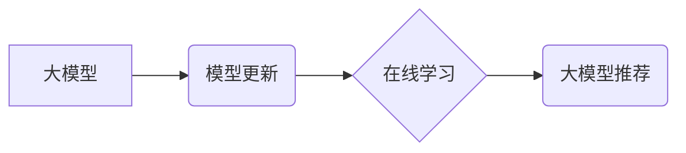

                 

## 大模型推荐中的模型更新与在线学习技术

> 关键词：大模型、模型更新、在线学习、推荐系统、迁移学习、知识蒸馏

## 1. 背景介绍

推荐系统作为信息过滤和个性化内容展示的重要工具，在电商、社交媒体、视频平台等领域发挥着越来越重要的作用。随着大模型技术的快速发展，大模型在推荐系统中的应用也日益广泛。大模型通常拥有庞大的参数量和强大的学习能力，能够从海量数据中学习到更丰富的用户偏好和物品特征，从而提供更精准、个性化的推荐结果。

然而，大模型的训练成本高昂，且在部署后难以进行实时更新。传统的模型更新方式需要重新训练整个模型，这不仅耗时费力，而且难以适应用户行为和物品信息的动态变化。因此，如何高效地更新大模型，使其能够持续学习和适应新数据，成为一个重要的研究课题。

在线学习技术为解决这一问题提供了新的思路。在线学习是一种无需等待所有数据收集完毕即可进行模型更新的学习方式，它能够实时地学习新数据，并根据学习到的知识不断更新模型参数。将在线学习技术应用于大模型推荐系统，可以实现模型的动态更新，使其能够更好地适应用户行为和物品信息的动态变化，从而提高推荐系统的准确性和个性化程度。

## 2. 核心概念与联系

### 2.1 模型更新

模型更新是指在模型训练完成后，根据新的数据或反馈信息，对模型参数进行调整的过程。传统的模型更新方式通常需要重新训练整个模型，这对于大模型来说是十分耗时的。

### 2.2 在线学习

在线学习是一种无需等待所有数据收集完毕即可进行模型更新的学习方式。它能够实时地学习新数据，并根据学习到的知识不断更新模型参数。在线学习的特点是：

* **数据流式更新:** 在线学习算法能够处理数据流，即数据以顺序的方式不断到来。
* **实时更新:** 模型参数在每次收到新数据后都会进行更新。
* **在线性:** 在线学习算法通常具有较低的计算复杂度，能够在资源有限的条件下进行高效地学习。

### 2.3 大模型推荐

大模型推荐是指利用大模型技术进行推荐系统构建和优化。大模型在推荐系统中可以发挥以下作用：

* **特征提取:** 大模型能够从海量数据中学习到更丰富的用户偏好和物品特征。
* **模型训练:** 大模型可以训练出更准确、更个性化的推荐模型。
* **个性化推荐:** 大模型可以根据用户的历史行为和偏好，提供更精准的个性化推荐。

### 2.4 核心概念关系



## 3. 核心算法原理 & 具体操作步骤

### 3.1 算法原理概述

在线学习算法的核心思想是利用新数据不断更新模型参数，使其能够随着时间推移而不断改进。常用的在线学习算法包括：

* **梯度下降法:** 梯度下降法是一种迭代算法，通过不断调整模型参数，使模型的损失函数最小化。在线学习中，梯度下降法通常采用小批量梯度下降的方式，每次更新模型参数时只使用一小部分数据进行计算。
* **随机梯度下降法:** 随机梯度下降法是一种更加高效的梯度下降法，每次更新模型参数时只使用一个数据点进行计算。
* **牛顿法:** 牛顿法是一种二次收敛的优化算法，能够更快地找到模型参数的最小值。

### 3.2 算法步骤详解

在线学习算法的具体操作步骤如下：

1. **初始化模型参数:** 首先需要对模型参数进行初始化。
2. **接收新数据:** 接收新数据并将其转换为模型可以理解的格式。
3. **计算损失函数:** 计算模型在当前参数下对新数据的预测结果与真实值的差异，即损失函数的值。
4. **计算梯度:** 计算损失函数对模型参数的梯度。梯度表示了损失函数在当前参数下变化的方向和大小。
5. **更新模型参数:** 根据梯度信息，更新模型参数。更新规则通常是将参数向梯度反方向移动，以减小损失函数的值。
6. **重复步骤2-5:** 重复上述步骤，直到模型收敛或达到预设的迭代次数。

### 3.3 算法优缺点

**优点:**

* **实时更新:** 在线学习算法能够实时地学习新数据，并根据学习到的知识不断更新模型参数。
* **高效性:** 在线学习算法通常具有较低的计算复杂度，能够在资源有限的条件下进行高效地学习。
* **适应性:** 在线学习算法能够适应数据分布的变化，并不断调整模型参数以保持模型的准确性。

**缺点:**

* **过拟合风险:** 在线学习算法容易出现过拟合问题，即模型过于依赖训练数据，无法泛化到新的数据上。
* **参数更新策略:** 在线学习算法的参数更新策略需要精心设计，不同的策略会影响模型的性能。

### 3.4 算法应用领域

在线学习算法广泛应用于以下领域：

* **推荐系统:** 在线学习可以用于更新推荐模型，使其能够适应用户行为和物品信息的动态变化。
* **广告点击预测:** 在线学习可以用于预测用户点击广告的概率，并根据预测结果进行广告投放优化。
* **欺诈检测:** 在线学习可以用于检测欺诈行为，并根据检测结果采取相应的措施。
* **自然语言处理:** 在线学习可以用于训练语言模型，使其能够更好地理解和生成自然语言。

## 4. 数学模型和公式 & 详细讲解 & 举例说明

### 4.1 数学模型构建

在线学习算法通常基于最小化损失函数的目标。损失函数衡量模型预测结果与真实值的差异。常用的损失函数包括均方误差 (MSE)、交叉熵 (Cross-Entropy) 等。

假设模型的预测结果为 $y_i$，真实值为 $t_i$，则均方误差损失函数可以表示为：

$$
L = \frac{1}{N} \sum_{i=1}^{N} (y_i - t_i)^2
$$

其中，$N$ 为样本数量。

### 4.2 公式推导过程

在线学习算法的目标是通过不断更新模型参数，最小化损失函数的值。梯度下降法是一种常用的优化算法，其核心思想是沿着梯度反方向更新模型参数。

梯度下降法的更新规则可以表示为：

$$
\theta_{t+1} = \theta_t - \eta \nabla L(\theta_t)
$$

其中，$\theta$ 为模型参数，$t$ 为迭代次数，$\eta$ 为学习率，$\nabla L(\theta_t)$ 为损失函数在当前参数下对参数的梯度。

### 4.3 案例分析与讲解

假设我们有一个简单的线性回归模型，其预测结果为：

$$
y = \theta_0 + \theta_1 x
$$

其中，$\theta_0$ 和 $\theta_1$ 为模型参数，$x$ 为输入特征。

如果我们使用均方误差损失函数，则梯度下降法的更新规则为：

$$
\theta_0^{t+1} = \theta_0^t - \eta \frac{1}{N} \sum_{i=1}^{N} (y_i - t_i)
$$

$$
\theta_1^{t+1} = \theta_1^t - \eta \frac{1}{N} \sum_{i=1}^{N} (y_i - t_i) x_i
$$

其中，$y_i$ 为模型预测结果，$t_i$ 为真实值，$x_i$ 为输入特征。

## 5. 项目实践：代码实例和详细解释说明

### 5.1 开发环境搭建

为了实现大模型推荐中的模型更新与在线学习技术，我们需要搭建一个合适的开发环境。

* **操作系统:** Linux 或 macOS
* **编程语言:** Python
* **深度学习框架:** TensorFlow 或 PyTorch
* **其他工具:** Git、Docker 等

### 5.2 源代码详细实现

以下是一个使用 TensorFlow 实现在线学习的推荐系统的简单代码示例：

```python
import tensorflow as tf

# 定义模型
model = tf.keras.Sequential([
    tf.keras.layers.Dense(64, activation='relu'),
    tf.keras.layers.Dense(1, activation='sigmoid')
])

# 定义损失函数和优化器
loss_fn = tf.keras.losses.BinaryCrossentropy()
optimizer = tf.keras.optimizers.Adam(learning_rate=0.001)

# 在线学习训练
def train_step(data):
    with tf.GradientTape() as tape:
        predictions = model(data['features'])
        loss = loss_fn(data['labels'], predictions)
    gradients = tape.gradient(loss, model.trainable_variables)
    optimizer.apply_gradients(zip(gradients, model.trainable_variables))
    return loss

# 加载数据
data = ...

# 在线学习训练循环
for epoch in range(10):
    for batch in data:
        loss = train_step(batch)
        print(f'Epoch: {epoch}, Loss: {loss.numpy()}')
```

### 5.3 代码解读与分析

* **模型定义:** 代码中定义了一个简单的线性回归模型，包含两个全连接层。
* **损失函数和优化器:** 使用二元交叉熵损失函数和 Adam 优化器。
* **在线学习训练:** `train_step` 函数定义了在线学习的训练过程，包括计算损失函数、计算梯度和更新模型参数。
* **数据加载:** 需要根据实际情况加载数据。
* **训练循环:** 代码中使用了一个简单的训练循环，迭代训练模型。

### 5.4 运行结果展示

运行上述代码后，会输出每个 epoch 的损失值。随着训练的进行，损失值会逐渐降低，表明模型的性能逐渐提升。

## 6. 实际应用场景

### 6.1 个性化推荐

在线学习技术可以用于个性化推荐系统，根据用户的历史行为和偏好，实时更新推荐模型，提供更精准的推荐结果。例如，电商平台可以利用在线学习技术，根据用户的浏览历史、购买记录和评价信息，实时更新推荐模型，推荐更符合用户需求的商品。

### 6.2 内容过滤

在线学习技术可以用于内容过滤系统，根据用户的反馈信息，实时更新过滤模型，过滤掉用户不感兴趣的内容。例如，社交媒体平台可以利用在线学习技术，根据用户的点赞、评论和分享行为，实时更新过滤模型，过滤掉用户不感兴趣的内容，提高用户体验。

### 6.3 搜索结果优化

在线学习技术可以用于搜索结果优化系统，根据用户的搜索行为和反馈信息，实时更新排序模型，提高搜索结果的准确性和相关性。例如，搜索引擎可以利用在线学习技术，根据用户的搜索词、点击记录和停留时间，实时更新排序模型，提高搜索结果的准确性和相关性。

### 6.4 未来应用展望

在线学习技术在推荐系统领域的应用前景广阔，未来可能在以下方面得到进一步发展：

* **更复杂的模型:** 在线学习技术可以应用于更复杂的推荐模型，例如深度学习模型，以提高推荐系统的准确性和个性化程度。
* **多模态数据:** 在线学习技术可以应用于多模态数据，例如文本、图像、视频等，以提供更全面的用户体验。
* **联邦学习:** 在线学习技术可以与联邦学习结合，实现对用户数据隐私的保护，同时提高推荐系统的准确性和泛化能力。

## 7. 工具和资源推荐

### 7.1 学习资源推荐

* **书籍:**
    * 《深度学习》 by Ian Goodfellow, Yoshua Bengio, and Aaron Courville
    * 《机器学习》 by Tom Mitchell
* **在线课程:**
    * Coursera: Machine Learning by Andrew Ng
    * Udacity: Deep Learning Nanodegree
* **博客和网站:**
    * TensorFlow Blog: https://blog.tensorflow.org/
    * PyTorch Blog: https://pytorch.org/blog/

### 7.2 开发工具推荐

* **深度学习框架:** TensorFlow, PyTorch
* **数据处理工具:** Pandas, NumPy
* **可视化工具:** Matplotlib, Seaborn

### 7.3 相关论文推荐

* **在线学习:**
    * "Online Learning: A Survey" by Robert E. Schapire and Yoram Singer
* **推荐系统:**
    * "Recommender Systems: The Textbook" by  Koren, Y.
    * "Matrix Factorization Techniques for Recommender Systems" by  Koren, Y.

## 8. 总结：未来发展趋势与挑战

### 8.1 研究成果总结

在线学习技术为大模型推荐系统提供了新的思路，能够实现模型的动态更新，使其能够更好地适应用户行为和物品信息的动态变化。

### 8.2 未来发展趋势

* **更复杂的模型:** 在线学习技术将应用于更复杂的推荐模型，例如深度学习模型，以提高推荐系统的准确性和个性化程度。
* **多模态数据:** 在线学习技术将应用于多模态数据，例如文本、图像、视频等，以提供更全面的用户体验。
* **联邦学习:** 在线学习技术将与联邦学习结合，实现对用户数据隐私的保护，同时提高推荐系统的准确性和泛化能力。

### 8.3 面临的挑战

* **过拟合风险:** 在线学习算法容易出现过拟合问题，需要采用有效的正则化技术来缓解。
* **数据质量:** 在线学习算法的性能依赖于数据的质量，需要保证数据的准确性和完整性。
* **模型复杂度:** 在线学习更复杂的模型需要更高的计算资源和更复杂的算法设计。

### 8.4 研究展望

未来，在线学习技术在推荐系统领域的应用将更加广泛和深入，将为用户提供更精准、更个性化的推荐体验。


## 9. 附录：常见问题与解答

### 9.1 Q: 在线学习和批量学习有什么区别？

**A:** 在线学习和批量学习的区别在于数据处理方式。批量学习需要将所有数据一次性加载到内存中进行训练，而在线学习则可以逐个数据点进行训练，无需等待所有数据收集完毕。

### 9.2 Q: 在线学习算法有哪些？

**A:** 常用的在线学习算法包括梯度下降法、随机梯度下降法、牛顿法等。

### 9.3 Q: 如何防止在线学习算法过拟合？

**A:** 可以采用以下方法防止在线学习算法过拟合：

* **正则化:** 添加正则化项到损失函数中，例如L1正则化和L2正则化。
* **学习率衰减:** 随着训练的进行，逐渐降低学习率，防止模型过度拟合训练数据。
* **数据增强:** 对训练数据进行增强，例如随机翻转、随机裁剪等，增加数据的多样性。

### 9.4 Q: 在线学习技术有哪些应用场景？

**A:** 在线学习技术广泛应用于以下场景：

* 推荐系统
* 广告点击预测
* 欺诈检测
* 自然语言处理


作者：禅与计算机程序设计艺术 / Zen and the Art of Computer Programming<end_of_turn>

