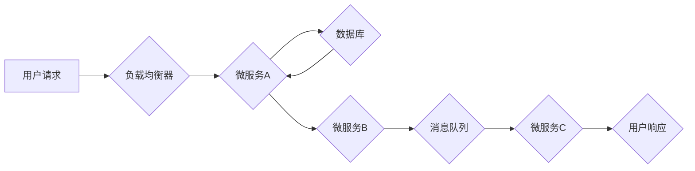

                 

## 如何利用编程技能开发千万用户级应用

> 关键词：百万级用户、高并发、分布式系统、微服务架构、云计算、数据库优化、性能测试、代码质量

### 1. 背景介绍

在当今数字时代，软件应用已渗透到生活的方方面面，从社交媒体到金融交易，再到智能家居，无处不在。而开发能够服务千万级用户的应用，则意味着需要面对更严峻的挑战，包括高并发访问、数据存储和处理、系统稳定性、安全性和可扩展性等。

开发千万级用户应用并非仅仅是代码的堆砌，更需要系统地思考架构设计、算法优化、性能调优、安全保障等多个方面。本文将从多个角度探讨如何利用编程技能开发千万级用户应用，并分享一些经验和建议。

### 2. 核心概念与联系

#### 2.1  百万级用户应用架构

百万级用户应用通常采用分布式架构，将系统功能和数据分散到多个服务器上，以提高系统的容错性、可扩展性和性能。常见的分布式架构模式包括：

* **微服务架构:** 将大型应用程序拆分成多个小型、独立的服务，每个服务负责特定的功能，并通过API进行通信。
* **服务网格:** 基于微服务架构，提供服务发现、负载均衡、安全管理等功能，简化微服务管理。
* **事件驱动架构:** 通过消息队列实现服务间异步通信，提高系统的响应速度和弹性。

#### 2.2  架构流程图



#### 2.3  核心技术

* **云计算:** 利用云平台提供的计算资源、存储资源和网络资源，实现应用的弹性伸缩和快速部署。
* **数据库优化:** 选择合适的数据库类型，并进行数据模型设计、索引优化、查询优化等，提高数据库的读写性能。
* **缓存技术:** 利用缓存技术存储 frequently accessed 数据，减少数据库访问次数，提高应用响应速度。
* **消息队列:** 利用消息队列实现异步消息处理，提高系统的吞吐量和可靠性。

### 3. 核心算法原理 & 具体操作步骤

#### 3.1  算法原理概述

在开发千万级用户应用时，需要考虑算法的效率和可扩展性。常见的算法优化方法包括：

* **时间复杂度分析:** 评估算法执行时间随输入数据大小变化的趋势，选择时间复杂度较低的算法。
* **空间复杂度分析:** 评估算法使用的内存空间大小，选择空间复杂度较低的算法。
* **数据结构选择:** 选择合适的的数据结构，例如哈希表、树、图等，提高算法的效率。

#### 3.2  算法步骤详解

以排序算法为例，常见的排序算法包括冒泡排序、插入排序、快速排序、归并排序等。

* **冒泡排序:** 比较相邻元素，如果顺序错误则交换位置，重复该过程直到整个数组有序。
* **插入排序:** 将一个元素插入到已经排序的子数组中，重复该过程直到整个数组有序。
* **快速排序:** 选择一个元素作为 pivot，将小于 pivot 的元素放在其左边，大于 pivot 的元素放在其右边，递归地对左右子数组进行排序。
* **归并排序:** 将数组分成两个子数组，递归地对子数组进行排序，然后将两个有序子数组合并成一个有序数组。

#### 3.3  算法优缺点

| 算法 | 时间复杂度 | 空间复杂度 | 优点 | 缺点 |
|---|---|---|---|---|
| 冒泡排序 | O(n^2) | O(1) | 简单易实现 | 效率低 |
| 插入排序 | O(n^2) | O(1) | 效率高，适合小规模数据 | 效率低 |
| 快速排序 | O(n log n) | O(log n) | 效率高 | 性能不稳定 |
| 归并排序 | O(n log n) | O(n) | 效率高，稳定性好 | 空间复杂度高 |

#### 3.4  算法应用领域

不同的算法适用于不同的场景，需要根据实际需求选择合适的算法。例如，快速排序适用于大规模数据排序，而插入排序适用于小规模数据排序。

### 4. 数学模型和公式 & 详细讲解 & 举例说明

#### 4.1  数学模型构建

在开发千万级用户应用时，需要使用数学模型来分析和优化系统性能。例如，可以使用 queuing theory 来分析用户请求的等待时间和服务时间，可以使用 load balancing theory 来分析负载均衡器的性能。

#### 4.2  公式推导过程

以 queuing theory 为例，常用的公式包括：

* **平均等待时间:** $W = \frac{L}{\lambda}$
* **平均队列长度:** $L = \frac{\lambda^2}{\mu(\mu-\lambda)}$

其中，$W$ 表示平均等待时间，$L$ 表示平均队列长度，$\lambda$ 表示用户请求的到达率，$\mu$ 表示服务器的服务率。

#### 4.3  案例分析与讲解

假设一个系统有 10 个服务器，每秒可以处理 100 个请求，用户请求的到达率为 80 个/秒。

* 平均等待时间: $W = \frac{80}{1000} = 0.08$ 秒
* 平均队列长度: $L = \frac{80^2}{100(100-80)} = 6.4$

该案例分析表明，系统平均等待时间为 0.08 秒，平均队列长度为 6.4，需要考虑优化系统性能。

### 5. 项目实践：代码实例和详细解释说明

#### 5.1  开发环境搭建

开发千万级用户应用需要搭建一个稳定的开发环境，包括服务器、数据库、网络等。可以使用云平台提供的服务，例如 AWS、Azure、GCP 等，快速搭建开发环境。

#### 5.2  源代码详细实现

以下是一个简单的微服务架构代码示例，使用 Python 和 Flask 框架实现：

```python
from flask import Flask, request, jsonify

app = Flask(__name__)

@app.route('/api/users', methods=['GET'])
def get_users():
    # 从数据库获取用户数据
    users = [
        {'id': 1, 'name': 'John Doe'},
        {'id': 2, 'name': 'Jane Doe'}
    ]
    return jsonify(users)

if __name__ == '__main__':
    app.run(debug=True)
```

#### 5.3  代码解读与分析

该代码示例定义了一个简单的 API 接口 `/api/users`，用于获取用户数据。

* `Flask` 框架用于构建 Web 应用。
* `request` 对象用于获取 HTTP 请求参数。
* `jsonify` 函数用于将 Python 数据结构转换为 JSON 格式。

#### 5.4  运行结果展示

运行该代码后，访问 `http://localhost:5000/api/users`，可以获取用户数据 JSON 格式的响应。

### 6. 实际应用场景

#### 6.1  社交媒体平台

社交媒体平台需要处理海量用户数据和消息，需要采用分布式架构、缓存技术、消息队列等技术来提高系统性能和可靠性。

#### 6.2  电商平台

电商平台需要处理用户订单、商品信息、支付信息等数据，需要采用数据库优化、负载均衡、安全保障等技术来保证系统稳定性和安全性。

#### 6.3  在线游戏

在线游戏需要处理玩家数据、游戏逻辑、网络通信等数据，需要采用高并发处理、延迟优化、数据同步等技术来保证游戏流畅性和公平性。

#### 6.4  未来应用展望

随着人工智能、大数据、云计算等技术的不断发展，未来千万级用户应用将更加智能化、个性化、实时化。

### 7. 工具和资源推荐

#### 7.1  学习资源推荐

* **书籍:**
    * 《设计模式: 复现经典》
    * 《分布式系统的设计与实现》
    * 《高性能网站设计与开发》
* **在线课程:**
    * Coursera: Distributed Systems
    * Udemy: Building Microservices
    * edX: Cloud Computing

#### 7.2  开发工具推荐

* **云平台:** AWS, Azure, GCP
* **数据库:** MySQL, PostgreSQL, MongoDB
* **消息队列:** Kafka, RabbitMQ
* **开发框架:** Spring Boot, Flask, Django

#### 7.3  相关论文推荐

* **论文:**
    * The Design and Implementation of the Apache Cassandra Distributed Database
    * Building Microservices: Designing Fine-Grained Systems

### 8. 总结：未来发展趋势与挑战

#### 8.1  研究成果总结

本文探讨了开发千万级用户应用的多个方面，包括架构设计、算法优化、性能调优、安全保障等。

#### 8.2  未来发展趋势

未来千万级用户应用将更加智能化、个性化、实时化，需要更加先进的技术和架构来支撑。

* **人工智能:** 利用人工智能技术，实现用户个性化推荐、智能客服、自动化的系统管理等功能。
* **大数据:** 利用大数据技术，分析用户行为数据，挖掘用户需求，提供更精准的服务。
* **云计算:** 利用云计算技术，实现应用的弹性伸缩、快速部署、成本优化等。

#### 8.3  面临的挑战

开发千万级用户应用面临着许多挑战，包括：

* **系统稳定性:** 确保系统能够稳定运行，即使在高并发访问的情况下也能保证服务质量。
* **数据安全:** 保护用户数据安全，防止数据泄露和攻击。
* **性能优化:** 提高系统的性能，降低用户等待时间，提升用户体验。
* **可扩展性:** 随着用户数量的增长，系统需要能够灵活扩展，满足不断增长的需求。

#### 8.4  研究展望

未来，需要继续研究和探索新的技术和架构，以应对开发千万级用户应用的挑战，并为用户提供更加优质的服务。

### 9. 附录：常见问题与解答

#### 9.1  常见问题

* 如何选择合适的数据库类型？
* 如何进行数据库优化？
* 如何实现系统的高并发处理？
* 如何保证系统的数据安全？

#### 9.2  解答

* 选择合适的数据库类型需要根据实际应用场景和数据特点进行考虑。
* 数据库优化包括数据模型设计、索引优化、查询优化等。
* 高并发处理可以通过分布式架构、缓存技术、消息队列等技术实现。
* 系统数据安全可以通过加密、权限控制、安全审计等措施保障。


作者：禅与计算机程序设计艺术 / Zen and the Art of Computer Programming 
<end_of_turn>

