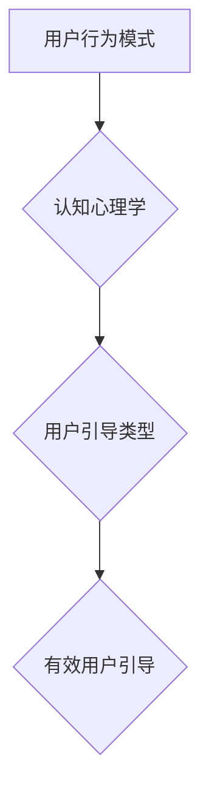

                 

## 如何进行有效的用户引导

> 关键词：用户引导、用户体验、交互设计、产品设计、信息架构、认知心理学

### 1. 背景介绍

在当今数字化时代，用户体验 (UX) 成为产品成功的关键因素。用户引导，作为提升用户体验的重要手段之一，旨在帮助用户快速理解产品功能，并引导他们完成目标任务。然而，并非所有用户引导都能够有效地达成目标。一些引导方式过于冗长、过于侵入式，反而会降低用户体验，甚至导致用户流失。

因此，如何进行有效的用户引导，成为产品经理、设计师和开发人员共同关注的议题。本文将深入探讨用户引导的核心概念、原理、算法、数学模型、代码实例以及实际应用场景，帮助读者理解和掌握有效的用户引导策略。

### 2. 核心概念与联系

用户引导的核心在于理解用户的行为模式和认知心理，并根据这些理解，设计出能够引导用户完成目标任务的交互体验。

**2.1 用户行为模式**

用户在使用产品时，会遵循一定的行为模式，例如：

* **探索模式:** 用户在刚开始使用产品时，会通过探索和尝试来了解产品的功能和特性。
* **任务模式:** 用户在完成特定任务时，会按照特定的步骤和流程来操作产品。
* **习惯模式:** 用户在长期使用产品后，会形成固定的操作习惯。

**2.2 认知心理学**

认知心理学研究人类的思维过程和认知能力，其理论可以帮助我们理解用户如何接收、处理和记忆信息。一些重要的认知心理学概念包括：

* **注意力:** 用户对特定信息或刺激的关注程度。
* **记忆:** 用户对信息的存储和检索能力。
* **学习:** 用户通过经验和实践获得新知识和技能的过程。

**2.3 用户引导类型**

根据引导方式和目标，用户引导可以分为多种类型：

* **新手引导:** 帮助新用户快速了解产品功能和基本操作。
* **任务引导:** 指导用户完成特定任务，例如注册账号、购买商品等。
* **个性化引导:** 根据用户的行为和偏好，提供个性化的引导内容。
* **交互式引导:** 通过交互式元素，例如提示框、动画、引导线等，引导用户操作。

**2.4 Mermaid 流程图**



### 3. 核心算法原理 & 具体操作步骤

**3.1 算法原理概述**

有效的用户引导算法需要考虑用户的行为模式、认知心理学以及产品功能。 

一个常见的算法是基于用户行为轨迹的个性化引导算法。该算法通过分析用户的行为轨迹，例如点击、停留时间、操作路径等，来识别用户的兴趣和需求，并根据这些信息提供个性化的引导内容。

**3.2 算法步骤详解**

1. **数据收集:** 收集用户的行为数据，例如点击事件、页面停留时间、操作路径等。
2. **数据分析:** 使用机器学习算法分析用户的行为数据，识别用户的兴趣和需求。
3. **引导内容生成:** 根据用户的兴趣和需求，生成个性化的引导内容，例如提示框、动画、引导线等。
4. **引导呈现:** 在合适的时机和位置呈现引导内容，引导用户完成目标任务。
5. **效果评估:** 评估引导效果，例如用户完成任务的比例、用户满意度等，并根据评估结果进行算法优化。

**3.3 算法优缺点**

* **优点:** 能够根据用户的实际需求提供个性化的引导，提高用户体验和引导效果。
* **缺点:** 需要收集和分析大量的用户行为数据，算法模型的训练和维护需要一定的技术成本。

**3.4 算法应用领域**

* **电商平台:** 引导用户浏览商品、加入购物车、完成购买。
* **社交媒体:** 引导用户关注好友、发布动态、参与活动。
* **教育平台:** 引导用户学习课程、完成作业、参加考试。

### 4. 数学模型和公式 & 详细讲解 & 举例说明

**4.1 数学模型构建**

用户引导效果可以被量化评估，例如用户完成目标任务的比例、用户满意度等。我们可以构建一个数学模型来预测用户引导效果，该模型可以考虑用户行为数据、引导内容特征以及产品功能等因素。

**4.2 公式推导过程**

假设我们想要预测用户完成目标任务的比例，我们可以使用 logistic 回归模型。该模型的公式如下：

$$
P(y=1) = \frac{1}{1 + e^{-(w_0 + w_1x_1 + w_2x_2 + ... + w_nx_n)}}
$$

其中：

* $P(y=1)$ 是用户完成目标任务的概率。
* $w_0, w_1, w_2, ..., w_n$ 是模型参数。
* $x_1, x_2, ..., x_n$ 是用户行为数据和引导内容特征的数值表示。

**4.3 案例分析与讲解**

假设我们想要预测用户在电商平台上完成购买的概率。我们可以收集用户的行为数据，例如浏览商品的次数、加入购物车的次数、查看商品详情页的次数等，以及引导内容特征，例如提示框的文案、动画的时长等。然后，我们可以使用 logistic 回归模型来训练一个预测模型，并根据用户的行为数据和引导内容特征，预测用户完成购买的概率。

### 5. 项目实践：代码实例和详细解释说明

**5.1 开发环境搭建**

* Python 3.x
* TensorFlow 或 PyTorch
* Jupyter Notebook

**5.2 源代码详细实现**

```python
import tensorflow as tf

# 定义模型
model = tf.keras.models.Sequential([
    tf.keras.layers.Dense(64, activation='relu', input_shape=(10,)),
    tf.keras.layers.Dense(1, activation='sigmoid')
])

# 编译模型
model.compile(optimizer='adam',
              loss='binary_crossentropy',
              metrics=['accuracy'])

# 训练模型
model.fit(X_train, y_train, epochs=10)

# 预测结果
predictions = model.predict(X_test)
```

**5.3 代码解读与分析**

* 我们使用 TensorFlow 库构建了一个简单的 logistic 回归模型。
* 模型输入层有 10 个神经元，对应于用户的行为数据和引导内容特征。
* 模型输出层只有一个神经元，输出用户完成目标任务的概率。
* 我们使用 Adam 优化器、二元交叉熵损失函数和准确率作为评估指标。
* 训练模型后，我们可以使用模型预测新用户的完成目标任务的概率。

**5.4 运行结果展示**

训练完成后，我们可以使用模型预测新用户的完成目标任务的概率。例如，如果模型预测用户的完成目标任务的概率为 0.8，则表示用户完成目标任务的可能性较高。

### 6. 实际应用场景

**6.1 电商平台**

* 引导用户浏览新品、限时抢购商品。
* 提示用户添加商品到购物车、完成购买。
* 根据用户的浏览历史推荐相关商品。

**6.2 教育平台**

* 引导用户注册账号、选择课程。
* 提示用户完成学习任务、参加考试。
* 根据用户的学习进度提供个性化的学习建议。

**6.3 软件应用**

* 引导用户完成软件安装、设置。
* 提示用户使用软件功能、解决问题。
* 根据用户的操作习惯提供个性化的功能推荐。

**6.4 未来应用展望**

随着人工智能技术的不断发展，用户引导将更加智能化、个性化和自动化。未来，用户引导可能能够：

* 更准确地预测用户的需求和行为。
* 提供更加个性化的引导内容和交互体验。
* 自动根据用户的行为调整引导策略。

### 7. 工具和资源推荐

**7.1 学习资源推荐**

* **书籍:**
    * 《Don't Make Me Think》 by Steve Krug
    * 《The Design of Everyday Things》 by Don Norman
* **在线课程:**
    * Coursera: User Experience (UX) Design Specialization
    * Udemy: The Complete UX Design Course

**7.2 开发工具推荐**

* **Figma:** 用户界面设计工具
* **Adobe XD:** 用户界面设计工具
* **Hotjar:** 用户行为分析工具

**7.3 相关论文推荐**

* **"A Survey of User Interface Design Principles"** by Nielsen
* **"The Psychology of Everyday Things"** by Norman

### 8. 总结：未来发展趋势与挑战

**8.1 研究成果总结**

本文探讨了用户引导的核心概念、原理、算法、数学模型以及实际应用场景。我们了解到，有效的用户引导需要考虑用户的行为模式、认知心理学以及产品功能。

**8.2 未来发展趋势**

未来，用户引导将更加智能化、个性化和自动化。人工智能技术将被更加广泛地应用于用户引导领域，例如：

* 使用机器学习算法分析用户的行为数据，提供更加个性化的引导内容。
* 使用自然语言处理技术，实现更加自然的引导交互。
* 使用增强现实技术，提供更加沉浸式的引导体验。

**8.3 面临的挑战**

* 如何收集和分析更加丰富、准确的用户行为数据。
* 如何设计更加智能、个性化和自动化的引导算法。
* 如何平衡引导效果和用户体验，避免过度引导。

**8.4 研究展望**

未来，我们需要继续深入研究用户引导领域，探索更加有效的引导策略和技术，以提升用户体验和产品成功率。


### 9. 附录：常见问题与解答

**9.1 如何评估用户引导效果？**

用户引导效果可以通过多种指标评估，例如用户完成目标任务的比例、用户满意度、用户流失率等。

**9.2 如何避免过度引导？**

过度引导会降低用户体验，因此我们需要在引导时保持适度，避免频繁弹出提示框或干扰用户操作。

**9.3 如何设计个性化的引导内容？**

我们可以根据用户的行为数据、偏好和需求，设计个性化的引导内容，例如推荐相关的商品、功能或学习资源。


作者：禅与计算机程序设计艺术 / Zen and the Art of Computer Programming 
<end_of_turn>

