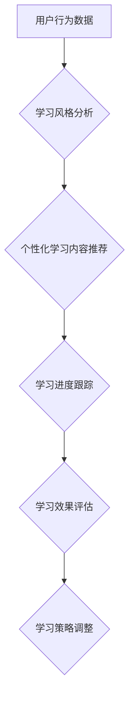

                 

## 学习风格：个性化知识获取的策略

> 关键词：学习风格、个性化学习、知识获取、认知科学、人工智能、机器学习、教育技术

### 1. 背景介绍

在当今信息爆炸的时代，获取知识的速度和效率成为至关重要的竞争力。然而，传统的学习模式往往过于单一，难以满足不同个体个性化的学习需求。学习风格是指个体在学习过程中倾向于采用的一种特定的认知方式，它影响着个体对信息的理解、记忆和应用能力。 

研究表明，学习风格并非一成不变，它会随着个体的成长、经历和学习环境的变化而有所调整。 因此，个性化学习，即根据个体的学习风格定制学习内容、方法和节奏，已成为教育和培训领域的重要趋势。

### 2. 核心概念与联系

#### 2.1 学习风格的类型

常见的学习风格分类方法包括：

* **视觉学习型:** 这种学习者更倾向于通过视觉信息，如图片、图表、视频等来理解和记忆知识。
* **听觉学习型:** 这种学习者更倾向于通过听觉信息，如演讲、音频、讨论等来理解和记忆知识。
* **动觉学习型:** 这种学习者更倾向于通过实践操作、动手活动来理解和记忆知识。
* **阅读/写作学习型:** 这种学习者更倾向于通过阅读和写作来理解和记忆知识。

#### 2.2 个性化学习的优势

个性化学习能够带来诸多优势：

* **提高学习效率:** 针对个体学习风格的学习方法可以帮助个体更有效地理解和记忆知识。
* **增强学习兴趣:** 个性化学习可以激发个体的学习兴趣，使其更积极主动地参与学习。
* **促进知识应用:** 个性化学习可以帮助个体将所学知识应用到实际生活中。
* **提升学习成就:** 个性化学习可以帮助个体取得更好的学习成果。

#### 2.3 个性化学习的实现

个性化学习的实现需要结合人工智能、机器学习等技术，通过分析个体的学习行为、偏好和能力，定制个性化的学习内容、方法和节奏。



### 3. 核心算法原理 & 具体操作步骤

#### 3.1 算法原理概述

个性化学习的核心算法通常基于机器学习技术，例如：

* **聚类算法:** 将用户根据学习行为、偏好等特征进行分类，识别不同的学习风格。
* **推荐算法:** 根据用户的学习风格和历史学习数据，推荐个性化的学习内容。
* **强化学习算法:** 通过对用户的学习行为进行奖励和惩罚，优化学习策略，提高学习效率。

#### 3.2 算法步骤详解

**1. 数据收集:** 收集用户的学习行为数据，例如学习时间、学习内容、学习方式、学习成绩等。

**2. 数据预处理:** 对收集到的数据进行清洗、转换和特征提取，以便于算法训练和应用。

**3. 模型训练:** 选择合适的机器学习算法，对预处理后的数据进行训练，建立个性化学习模型。

**4. 模型评估:** 使用测试数据对训练好的模型进行评估，评估模型的准确性和有效性。

**5. 个性化学习:** 根据用户的学习风格和历史学习数据，利用训练好的模型推荐个性化的学习内容、方法和节奏。

**6. 学习效果评估:** 持续跟踪用户的学习进度和学习效果，并根据反馈信息调整学习策略，不断优化个性化学习体验。

#### 3.3 算法优缺点

**优点:**

* **个性化定制:** 能够根据个体的学习风格和需求提供个性化的学习体验。
* **提高学习效率:** 针对个体学习方式的学习方法可以帮助个体更有效地理解和记忆知识。
* **增强学习兴趣:** 个性化学习可以激发个体的学习兴趣，使其更积极主动地参与学习。

**缺点:**

* **数据依赖:** 需要大量的用户学习数据才能训练出准确有效的个性化学习模型。
* **算法复杂度:** 个性化学习算法的训练和应用需要一定的技术复杂度。
* **伦理问题:** 个性化学习可能会导致个体之间的学习差异加剧，需要关注公平性和伦理问题。

#### 3.4 算法应用领域

个性化学习算法在教育、培训、在线学习、游戏等领域都有广泛的应用。

* **教育领域:** 个性化学习可以帮助学生根据自己的学习风格和进度进行学习，提高学习效率和学习兴趣。
* **培训领域:** 个性化学习可以帮助员工根据自己的职业发展需求进行培训，提升技能水平和工作效率。
* **在线学习领域:** 个性化学习可以帮助在线学习平台提供更个性化的学习体验，提高用户粘性和学习效果。
* **游戏领域:** 个性化学习可以帮助游戏开发者根据玩家的喜好和游戏进度提供个性化的游戏内容和挑战，提高玩家的游戏体验。

### 4. 数学模型和公式 & 详细讲解 & 举例说明

#### 4.1 数学模型构建

个性化学习算法通常基于概率模型，例如贝叶斯网络、隐马尔可夫模型等。这些模型可以用来预测用户的学习行为、学习风格和学习效果。

#### 4.2 公式推导过程

例如，可以使用贝叶斯定理来计算用户的学习风格概率：

$$P(S|D) = \frac{P(D|S)P(S)}{P(D)}$$

其中：

* $P(S|D)$ 是用户属于特定学习风格 $S$ 的概率，给定其学习数据 $D$。
* $P(D|S)$ 是给定用户属于特定学习风格 $S$ 的情况下，其学习数据 $D$ 出现的概率。
* $P(S)$ 是用户属于特定学习风格 $S$ 的先验概率。
* $P(D)$ 是用户学习数据 $D$ 出现的概率。

#### 4.3 案例分析与讲解

假设我们有一个学习平台，收集了用户的学习行为数据，包括学习时间、学习内容、学习方式等。我们可以使用贝叶斯网络来构建个性化学习模型，预测用户的学习风格。

例如，我们可以将用户的学习时间、学习内容和学习方式作为贝叶斯网络的节点，并将用户的学习风格作为目标节点。通过训练贝叶斯网络，我们可以得到每个节点之间的概率关系，从而预测用户的学习风格。

### 5. 项目实践：代码实例和详细解释说明

#### 5.1 开发环境搭建

* **操作系统:** Ubuntu 20.04 LTS
* **编程语言:** Python 3.8
* **机器学习库:** scikit-learn
* **数据处理库:** pandas, numpy

#### 5.2 源代码详细实现

```python
import pandas as pd
from sklearn.cluster import KMeans

# 加载用户学习数据
data = pd.read_csv('learning_data.csv')

# 特征工程
# ...

# 训练KMeans聚类模型
kmeans = KMeans(n_clusters=4, random_state=0)
kmeans.fit(data)

# 获取用户所属的学习风格类别
labels = kmeans.labels_

# 将学习风格类别添加到数据中
data['learning_style'] = labels

# 保存结果
data.to_csv('learning_data_with_style.csv', index=False)
```

#### 5.3 代码解读与分析

* **数据加载:** 使用 pandas 库加载用户学习数据。
* **特征工程:** 对学习数据进行预处理，提取特征，例如学习时间、学习内容、学习方式等。
* **模型训练:** 使用 scikit-learn 库的 KMeans 聚类算法训练模型，将用户根据学习行为进行分类。
* **结果保存:** 将用户所属的学习风格类别添加到数据中，并保存结果。

#### 5.4 运行结果展示

运行代码后，将生成一个包含用户学习数据和学习风格类别的 CSV 文件。我们可以使用数据可视化工具，例如 matplotlib 或 seaborn，来展示用户学习风格的分布情况。

### 6. 实际应用场景

#### 6.1 教育领域

个性化学习可以应用于各种教育场景，例如：

* **在线课程:** 根据学生的学习风格和进度，推荐个性化的学习内容和学习路径。
* **课堂教学:** 教师可以根据学生的学习风格，调整教学方法和教学内容，提高课堂教学效率。
* **个性化辅导:** 为学生提供个性化的辅导，帮助他们克服学习困难，提高学习成绩。

#### 6.2 培训领域

个性化学习可以应用于各种培训场景，例如：

* **职业技能培训:** 根据员工的职业发展需求，推荐个性化的培训课程和学习资源。
* **产品知识培训:** 根据员工的岗位职责，推荐个性化的产品知识培训内容。
* **团队协作培训:** 根据团队成员的性格和学习风格，设计个性化的团队协作培训方案。

#### 6.3 其他领域

个性化学习还可以应用于其他领域，例如：

* **游戏:** 根据玩家的喜好和游戏进度，提供个性化的游戏内容和挑战。
* **医疗保健:** 根据患者的病情和个人需求，提供个性化的医疗方案和健康指导。
* **金融服务:** 根据用户的投资目标和风险偏好，提供个性化的投资建议和理财服务。

#### 6.4 未来应用展望

随着人工智能和机器学习技术的不断发展，个性化学习将更加智能化、精准化和个性化。未来，个性化学习将更加深入地融入到我们的生活和工作中，帮助我们更高效地学习、工作和生活。

### 7. 工具和资源推荐

#### 7.1 学习资源推荐

* **书籍:**
    * 《个性化学习：理论与实践》
    * 《学习风格：认知科学与教育应用》
* **在线课程:**
    * Coursera: 个性化学习
    * edX: 学习科学与个性化学习

#### 7.2 开发工具推荐

* **Python:** 强大的编程语言，广泛应用于机器学习和数据分析。
* **scikit-learn:** Python 的机器学习库，提供各种机器学习算法和工具。
* **pandas:** Python 的数据处理库，用于数据分析和可视化。
* **matplotlib:** Python 的数据可视化库，用于生成各种类型的图表和图形。

#### 7.3 相关论文推荐

* **The Science of Learning: A Review of the Literature**
* **Personalized Learning: A Review of the Literature**
* **Machine Learning for Personalized Education**

### 8. 总结：未来发展趋势与挑战

#### 8.1 研究成果总结

个性化学习的研究取得了显著进展，已经形成了较为成熟的理论体系和技术框架。

#### 8.2 未来发展趋势

* **更精准的个性化:** 利用更先进的机器学习算法和数据分析技术，实现更精准的个性化学习。
* **更智能的学习系统:** 开发更智能的学习系统，能够自动调整学习内容、方法和节奏，并提供个性化的学习建议。
* **更广泛的应用场景:** 将个性化学习应用到更多领域，例如医疗保健、金融服务等。

#### 8.3 面临的挑战

* **数据隐私和安全:** 个性化学习需要收集大量的用户数据，如何保护用户数据隐私和安全是一个重要的挑战。
* **算法公平性:** 个性化学习算法可能会导致个体之间的学习差异加剧，需要关注算法的公平性和伦理问题。
* **技术可访问性:** 个性化学习技术需要一定的技术门槛，如何提高技术可访问性是一个重要的挑战。

#### 8.4 研究展望

未来，个性化学习研究将继续深入，探索更精准、更智能、更公平的个性化学习方法，为每个人提供更个性化的学习体验。

### 9. 附录：常见问题与解答

**1. 如何确定用户的学习风格？**

可以使用各种方法来确定用户的学习风格，例如问卷调查、观察学习行为、分析学习数据等。

**2. 个性化学习的成本如何？**

个性化学习的成本取决于具体的应用场景和技术方案。一般来说，个性化学习的成本比传统的学习模式更高，但其带来的效益也更高。

**3. 个性化学习是否适合所有人？**

个性化学习并非适合所有人，有些个体可能更倾向于传统的学习模式。

**作者：禅与计算机程序设计艺术 / Zen and the Art of Computer Programming**<end_of_turn>

