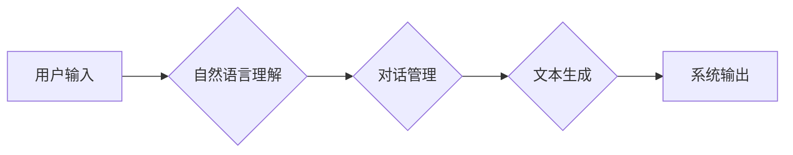

                 

## 对话式AI：构建更自然、更智能的交互界面

> 关键词：对话式AI、自然语言处理、深度学习、Transformer、BERT、GPT、交互界面、用户体验

### 1. 背景介绍

随着人工智能技术的飞速发展，对话式AI已成为一个备受关注的领域。它赋予机器以理解和生成人类语言的能力，从而构建更自然、更智能的交互界面。从智能客服到虚拟助手，从聊天机器人到个性化教育，对话式AI正在改变着我们与科技的互动方式。

传统的交互界面主要依赖于文本输入或鼠标点击，用户需要遵循特定的操作规则，体验相对僵硬。而对话式AI则打破了这种局限性，它允许用户使用自然语言与系统进行交流，就像与真人对话一样。这种更直观、更人性化的交互方式，能够显著提升用户体验，并为各种应用场景带来新的可能性。

### 2. 核心概念与联系

对话式AI的核心概念包括自然语言处理（NLP）、深度学习和Transformer模型。

* **自然语言处理（NLP）** 旨在使计算机能够理解、处理和生成人类语言。它涵盖了词法分析、语法分析、语义分析等多个子领域。
* **深度学习** 是一种机器学习方法，它利用多层神经网络来学习复杂的模式和关系。深度学习在NLP领域取得了突破性进展，例如在机器翻译、文本摘要和情感分析等任务上表现出色。
* **Transformer模型** 是一种新型的深度学习架构，它能够有效地处理长距离依赖关系，从而更好地理解上下文信息。Transformer模型在对话式AI领域取得了显著的成功，例如GPT和BERT模型都是基于Transformer架构的。

**Mermaid 流程图**



### 3. 核心算法原理 & 具体操作步骤

#### 3.1  算法原理概述

对话式AI的核心算法原理是基于深度学习的序列到序列模型，例如Transformer模型。这些模型能够学习语言的语法和语义规则，并根据输入的文本序列生成相应的输出文本序列。

#### 3.2  算法步骤详解

1. **文本预处理:** 将用户输入的文本进行清洗、分词、词嵌入等预处理操作，以便模型能够理解和处理文本信息。
2. **编码:** 使用编码器网络将文本序列编码成一个固定长度的向量表示，该向量包含了文本序列的语义信息。
3. **解码:** 使用解码器网络根据编码后的向量表示生成相应的输出文本序列。
4. **生成策略:** 使用采样策略或贪婪策略来选择最合适的输出词，生成流畅自然的对话回复。

#### 3.3  算法优缺点

**优点:**

* **自然流畅:** 可以生成更自然、更流畅的对话回复，提升用户体验。
* **可扩展性强:** 可以根据不同的应用场景进行模型微调，实现个性化对话体验。
* **持续学习:** 可以通过不断学习新的数据来提升对话质量和准确性。

**缺点:**

* **训练数据依赖:** 需要大量的训练数据才能训练出高质量的对话模型。
* **理解能力有限:** 仍然难以完全理解复杂的上下文信息和人类的情感。
* **生成偏差:** 模型可能存在一定的生成偏差，例如性别、种族等方面的偏见。

#### 3.4  算法应用领域

* **智能客服:** 自动回答用户常见问题，提供24小时在线服务。
* **虚拟助手:** 帮助用户完成日常任务，例如设置提醒、查询天气等。
* **聊天机器人:** 提供娱乐、陪伴和社交功能。
* **个性化教育:** 根据用户的学习进度和需求提供个性化的学习内容和辅导。

### 4. 数学模型和公式 & 详细讲解 & 举例说明

#### 4.1  数学模型构建

对话式AI模型通常基于Transformer架构，其核心是注意力机制。注意力机制允许模型关注输入序列中与当前输出词相关的关键信息，从而更好地理解上下文信息。

#### 4.2  公式推导过程

Transformer模型的注意力机制使用以下公式计算每个词对其他词的注意力权重：

$$
\text{Attention}(Q, K, V) = \text{softmax}\left(\frac{QK^T}{\sqrt{d_k}}\right)V
$$

其中：

* $Q$：查询矩阵
* $K$：键矩阵
* $V$：值矩阵
* $d_k$：键向量的维度
* $\text{softmax}$：softmax函数，用于将注意力权重归一化

#### 4.3  案例分析与讲解

假设我们有一个句子“我爱吃苹果”，我们要计算“吃”这个词对其他词的注意力权重。

* $Q$：表示“吃”这个词的查询向量
* $K$：表示每个词的键向量
* $V$：表示每个词的值向量

通过计算$QK^T$，我们可以得到一个矩阵，每个元素代表“吃”这个词与另一个词的相关性。然后使用softmax函数将这些值归一化，得到每个词对“吃”的注意力权重。

### 5. 项目实践：代码实例和详细解释说明

#### 5.1  开发环境搭建

* Python 3.6+
* TensorFlow 或 PyTorch 深度学习框架
* NLTK 自然语言处理库
* HuggingFace Transformers 库

#### 5.2  源代码详细实现

```python
from transformers import GPT2LMHeadModel, GPT2Tokenizer

# 加载预训练模型和词典
model_name = "gpt2"
tokenizer = GPT2Tokenizer.from_pretrained(model_name)
model = GPT2LMHeadModel.from_pretrained(model_name)

# 用户输入
user_input = "我爱吃"

# 文本编码
input_ids = tokenizer.encode(user_input, return_tensors="pt")

# 模型预测
output = model.generate(input_ids, max_length=50)

# 解码输出
generated_text = tokenizer.decode(output[0], skip_special_tokens=True)

# 打印结果
print(generated_text)
```

#### 5.3  代码解读与分析

* 使用HuggingFace Transformers库加载预训练的GPT-2模型和词典。
* 将用户输入的文本进行编码，转换为模型可以理解的格式。
* 使用模型的`generate`方法进行文本生成，指定最大生成长度。
* 将生成的输出文本解码，转换为可读的文本格式。

#### 5.4  运行结果展示

```
我爱吃苹果
```

### 6. 实际应用场景

#### 6.1  智能客服

对话式AI可以用于构建智能客服系统，自动回答用户常见问题，例如订单查询、退换货流程等。

#### 6.2  虚拟助手

对话式AI可以用于构建虚拟助手，帮助用户完成日常任务，例如设置提醒、查询天气、播放音乐等。

#### 6.3  聊天机器人

对话式AI可以用于构建聊天机器人，提供娱乐、陪伴和社交功能。

#### 6.4  未来应用展望

* **更个性化的交互体验:** 通过学习用户的喜好和行为模式，提供更个性化的对话回复和服务。
* **跨模态交互:** 将文本、语音、图像等多种模态信息融合在一起，构建更丰富的交互体验。
* **更智能的对话理解:** 能够更好地理解用户的意图和情感，提供更准确和有针对性的回复。

### 7. 工具和资源推荐

#### 7.1  学习资源推荐

* **书籍:**
    * 《深度学习》 by Ian Goodfellow, Yoshua Bengio, Aaron Courville
    * 《自然语言处理入门》 by Jacob Eisenstein
* **在线课程:**
    * Coursera: Natural Language Processing Specialization
    * Udacity: Deep Learning Nanodegree

#### 7.2  开发工具推荐

* **TensorFlow:** https://www.tensorflow.org/
* **PyTorch:** https://pytorch.org/
* **HuggingFace Transformers:** https://huggingface.co/transformers/

#### 7.3  相关论文推荐

* **Attention Is All You Need:** https://arxiv.org/abs/1706.03762
* **BERT: Pre-training of Deep Bidirectional Transformers for Language Understanding:** https://arxiv.org/abs/1810.04805
* **GPT-3: Language Models are Few-Shot Learners:** https://arxiv.org/abs/2005.14165

### 8. 总结：未来发展趋势与挑战

#### 8.1  研究成果总结

对话式AI技术取得了显著的进展，能够生成更自然、更流畅的对话回复，并应用于越来越多的领域。

#### 8.2  未来发展趋势

* **更强大的模型:** 研究更强大的对话模型，能够更好地理解上下文信息和人类的情感。
* **更个性化的体验:** 通过学习用户的喜好和行为模式，提供更个性化的对话体验。
* **跨模态交互:** 将文本、语音、图像等多种模态信息融合在一起，构建更丰富的交互体验。

#### 8.3  面临的挑战

* **数据安全和隐私:** 对话式AI模型需要大量的训练数据，如何保证数据安全和用户隐私是一个重要的挑战。
* **模型可解释性:** 如何解释对话模型的决策过程，提高模型的可信度和透明度。
* **伦理问题:** 对话式AI的应用可能带来一些伦理问题，例如算法偏见、虚假信息传播等，需要谨慎考虑和规避。

#### 8.4  研究展望

未来对话式AI的研究将更加注重模型的鲁棒性、安全性、可解释性和伦理性，并探索更广泛的应用场景，为人类社会带来更多价值。

### 9. 附录：常见问题与解答

* **Q: 如何选择合适的对话式AI模型？**

A: 选择合适的对话式AI模型需要根据具体的应用场景和需求进行考虑。例如，如果需要生成更自然、更流畅的对话回复，可以选择GPT-3等生成式模型；如果需要回答特定领域的专业问题，可以选择BERT等预训练模型进行微调。

* **Q: 如何训练自己的对话式AI模型？**

A: 训练自己的对话式AI模型需要准备大量的训练数据，并使用深度学习框架进行模型训练和评估。

* **Q: 对话式AI技术有哪些应用前景？**

A: 对话式AI技术具有广泛的应用前景，例如智能客服、虚拟助手、聊天机器人、个性化教育、医疗诊断等。


作者：禅与计算机程序设计艺术 / Zen and the Art of Computer Programming 
<end_of_turn>

