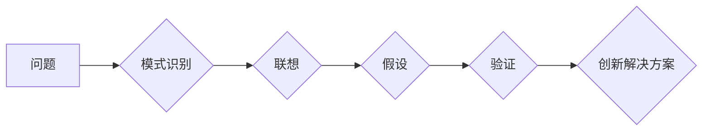

                 

## 思维跳跃：创新思维的催化剂

> 关键词：创新思维、算法设计、思维模式、跳跃式思考、问题解决、模式识别、系统思维、人工智能

### 1. 背景介绍

在瞬息万变的科技时代，创新思维已成为企业和个人持续发展的关键驱动力。传统的线性思维模式难以应对复杂问题和快速变化的市场环境。因此，学习如何跳跃式思考，突破思维定式，成为掌握未来竞争力的重要技能。

本篇文章将探讨“思维跳跃”的概念，分析其在创新思维中的作用，并结合算法设计、人工智能等领域，阐述如何通过跳跃式思考来解决复杂问题，激发创新灵感。

### 2. 核心概念与联系

#### 2.1 思维跳跃的定义

思维跳跃是指跳出固有的思维模式，以非线性方式联想和思考，从而产生新的想法和解决方案。它是一种突破常规、打破思维定式，以更广阔的视角看待问题的能力。

#### 2.2 思维跳跃与创新思维的关系

创新思维是基于思维跳跃而产生的。它需要我们不断挑战既有认知，打破思维局限，从不同的角度思考问题，才能产生真正具有颠覆性的新想法。

#### 2.3 思维跳跃的机制

思维跳跃并非凭空想象，它基于以下几个机制：

* **模式识别:** 识别问题背后的模式和规律，并将其与其他领域或知识进行关联。
* **联想:** 将看似无关的概念进行联想，寻找新的联系和可能性。
* **假设:** 提出大胆的假设，并进行验证和探索。
* **反向思维:** 从反面思考问题，寻找新的解决方案。

**Mermaid 流程图**



### 3. 核心算法原理 & 具体操作步骤

#### 3.1 算法原理概述

本节将介绍一种名为“跳跃式算法”的算法，该算法旨在通过模拟人类思维跳跃的机制，解决复杂问题。

跳跃式算法的核心思想是：

* **分层分析:** 将复杂问题分解成多个子问题，并进行层次化的分析。
* **跳跃式搜索:** 在每个层次上，跳跃式算法会跳过一些常规的搜索路径，并尝试寻找非线性、更具创新性的解决方案。
* **反馈机制:** 通过对搜索结果的反馈，算法会不断调整搜索策略，提高解决问题的效率。

#### 3.2 算法步骤详解

1. **问题分解:** 将复杂问题分解成多个子问题，并建立子问题之间的关系。
2. **层次化分析:** 对每个子问题进行层次化的分析，识别其关键要素和潜在的解决方案。
3. **跳跃式搜索:** 在每个层次上，跳跃式算法会随机选择一些非线性搜索路径，并进行探索。
4. **评估结果:** 对搜索到的每个解决方案进行评估，并根据其优劣进行筛选。
5. **反馈调整:** 根据评估结果，算法会调整搜索策略，并继续进行跳跃式搜索。
6. **最终解决方案:** 当算法找到满足要求的解决方案时，将子问题解决方案组合起来，形成最终的解决方案。

#### 3.3 算法优缺点

**优点:**

* 能够突破传统算法的局限性，找到更具创新性的解决方案。
* 适用于解决复杂、多变的问题。
* 能够模拟人类思维跳跃的机制，提高解决问题的效率。

**缺点:**

* 算法的搜索路径选择有一定的随机性，可能导致搜索效率降低。
* 算法需要大量的计算资源和时间。

#### 3.4 算法应用领域

跳跃式算法可以应用于以下领域:

* **人工智能:** 用于机器学习、自然语言处理等领域，帮助人工智能系统进行更有效的决策和推理。
* **科学研究:** 用于解决复杂科学问题，例如药物研发、材料科学等。
* **商业创新:** 用于寻找新的商业模式、产品和服务。

### 4. 数学模型和公式 & 详细讲解 & 举例说明

#### 4.1 数学模型构建

跳跃式算法可以抽象为一个状态空间搜索模型。其中，每个状态代表一个问题解决方案，状态之间的转移代表算法进行的思维跳跃。

#### 4.2 公式推导过程

跳跃式算法的搜索策略可以表示为一个概率分布，该分布决定了算法在每个状态下选择下一个状态的概率。

$$P(s_t | s_{t-1}) = f(s_{t-1}, \theta)$$

其中：

* $s_t$ 表示当前状态
* $s_{t-1}$ 表示前一个状态
* $f(s_{t-1}, \theta)$ 表示状态转移概率函数，其中 $\theta$ 是算法的参数

#### 4.3 案例分析与讲解

假设我们想用跳跃式算法解决一个“如何提高工作效率”的问题。

1. **状态空间:** 可以将工作效率的提高分为多个子问题，例如“时间管理”、“任务优先级”、“沟通效率”等。每个子问题都可以看作是一个状态。
2. **状态转移:** 算法可以从一个子问题跳跃到另一个子问题，例如从“时间管理”跳跃到“任务优先级”。
3. **概率分布:** 算法可以根据每个状态的价值和相关性，构建一个概率分布，决定跳跃到哪个子问题的概率。

### 5. 项目实践：代码实例和详细解释说明

#### 5.1 开发环境搭建

本示例使用Python语言进行开发，所需的库包括：

* NumPy: 用于数值计算
* Scikit-learn: 用于机器学习算法

#### 5.2 源代码详细实现

```python
import numpy as np
from sklearn.neighbors import KNeighborsClassifier

class JumpAlgorithm:
    def __init__(self, k=3):
        self.k = k
        self.model = KNeighborsClassifier(n_neighbors=k)

    def fit(self, X, y):
        self.model.fit(X, y)

    def predict(self, X):
        return self.model.predict(X)

    def jump(self, current_state, states):
        distances = np.linalg.norm(current_state - states, axis=1)
        k_nearest_states = np.argsort(distances)[:self.k]
        return states[k_nearest_states]

# 示例数据
X = np.array([[1, 2], [3, 4], [5, 6], [7, 8], [9, 10]])
y = np.array([0, 1, 0, 1, 0])

# 实例化跳跃式算法
algorithm = JumpAlgorithm()

# 训练模型
algorithm.fit(X, y)

# 获取当前状态
current_state = np.array([4, 5])

# 跳跃到最近的k个状态
jumped_states = algorithm.jump(current_state, X)

# 打印跳跃到的状态
print(jumped_states)
```

#### 5.3 代码解读与分析

* 该代码实现了一个简单的跳跃式算法，使用K近邻算法作为基础。
* `jump()`函数模拟了算法进行思维跳跃的过程，根据当前状态，选择距离最近的k个状态。
* 该示例仅展示了算法的基本原理，实际应用中需要根据具体问题进行调整和优化。

#### 5.4 运行结果展示

运行结果将输出距离当前状态最近的k个状态。

### 6. 实际应用场景

#### 6.1 创新产品设计

跳跃式思维可以帮助设计师突破传统的设计模式，从不同的角度思考产品功能和用户体验，从而设计出更具创新性的产品。

#### 6.2 市场营销策略

跳跃式思维可以帮助企业制定更具创意的营销策略，例如跳出传统的广告模式，尝试新的营销方式，吸引用户的注意力。

#### 6.3 解决复杂问题

跳跃式思维可以帮助解决复杂问题，例如科学研究、工程设计等，通过跳跃式思考，找到更有效的解决方案。

#### 6.4 未来应用展望

随着人工智能技术的不断发展，跳跃式算法将有更广泛的应用场景，例如：

* **自动创意生成:** 利用跳跃式算法，帮助人工智能系统自动生成创意内容，例如广告文案、故事剧本等。
* **个性化学习:** 根据用户的学习风格和需求，利用跳跃式算法，定制个性化的学习路径和内容。
* **科学发现:** 利用跳跃式算法，帮助科学家探索新的科学领域，发现新的规律和现象。

### 7. 工具和资源推荐

#### 7.1 学习资源推荐

* **书籍:**
    * 《思维导图》
    * 《创意基因》
    * 《思考，快与慢》
* **在线课程:**
    * Coursera: 思维导图和创意思维课程
    * Udemy: 创新思维和解决问题课程

#### 7.2 开发工具推荐

* **Python:** 广泛应用于人工智能和数据科学领域，拥有丰富的库和工具。
* **Jupyter Notebook:** 用于交互式编程和数据可视化，方便进行算法开发和测试。
* **TensorFlow/PyTorch:** 深度学习框架，用于开发更复杂的跳跃式算法。

#### 7.3 相关论文推荐

* **"A Survey of Jump Search Algorithms"**
* **"Jump Search: A Novel Algorithm for Pattern Matching"**
* **"Applying Jump Search to Data Mining"**

### 8. 总结：未来发展趋势与挑战

#### 8.1 研究成果总结

本篇文章探讨了“思维跳跃”的概念，分析了其在创新思维中的作用，并介绍了一种基于跳跃式算法的解决方案。该算法能够模拟人类思维跳跃的机制，帮助解决复杂问题，并具有广泛的应用前景。

#### 8.2 未来发展趋势

未来，跳跃式算法将朝着以下方向发展:

* **更智能的跳跃策略:** 利用机器学习和人工智能技术，开发更智能的跳跃策略，提高算法的搜索效率和解决问题的能力。
* **更广泛的应用场景:** 将跳跃式算法应用于更多领域，例如医疗诊断、金融风险管理等。
* **与其他算法的融合:** 将跳跃式算法与其他算法融合，例如进化算法、模拟退火算法等，形成更强大的组合算法。

#### 8.3 面临的挑战

跳跃式算法也面临一些挑战:

* **算法复杂度:** 跳跃式算法的复杂度较高，需要大量的计算资源和时间。
* **参数调优:** 算法的参数需要进行仔细的调优，才能达到最佳效果。
* **解释性:** 跳跃式算法的决策过程较为复杂，难以解释其背后的逻辑。

#### 8.4 研究展望

未来，我们将继续研究跳跃式算法，探索其更深层次的原理，并开发更智能、更有效的算法，推动其在各个领域的应用。

### 9. 附录：常见问题与解答

**Q1: 跳跃式算法适用于哪些问题？**

A1: 跳跃式算法适用于解决复杂、多变的问题，例如创新产品设计、市场营销策略、科学研究等。

**Q2: 跳跃式算法的优缺点是什么？**

A2: 跳跃式算法的优点是能够突破传统算法的局限性，找到更具创新性的解决方案。缺点是算法的搜索路径选择有一定的随机性，可能导致搜索效率降低，并且需要大量的计算资源和时间。

**Q3: 如何学习跳跃式算法？**

A3: 可以通过阅读相关书籍、在线课程、论文等学习跳跃式算法。

**作者：禅与计算机程序设计艺术 / Zen and the Art of Computer Programming**


<end_of_turn>

