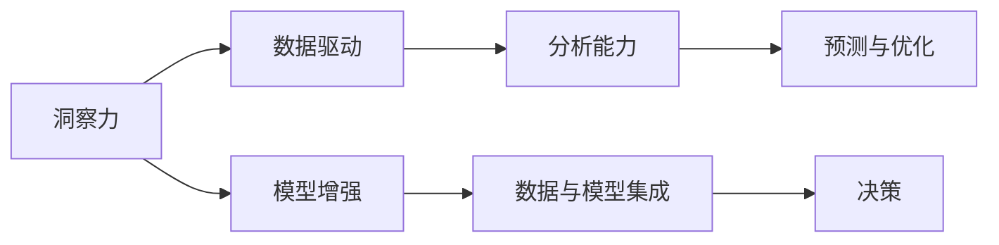

                 

# 洞察力vs分析能力：直觉与逻辑的较量

## 1. 背景介绍

在人工智能领域，洞察力（Insight）和分析能力（Analysis）一直是研究者和开发者探讨的重要话题。随着深度学习和大数据分析技术的迅猛发展，人们越来越关注如何将这两种能力结合起来，以期在智能决策中取得更好的效果。本文将深入探讨洞察力和分析能力的本质，并剖析两者的相互作用，以期为人工智能系统设计者提供新的思路和方法。

### 1.1 问题由来

在传统的决策过程中，洞察力和分析能力通常是独立存在的。例如，在商业决策中，洞察力指的是人们凭借直觉和经验对市场趋势、产品需求等做出判断，而分析能力则侧重于通过数据和模型来验证这些判断，以提供更加客观和科学的依据。然而，在人工智能日益兴起的今天，洞察力和分析能力开始越来越多地被整合在一起，通过机器学习、深度学习等技术，以更高效、更全面的方式进行决策。

### 1.2 问题核心关键点

洞察力和分析能力的结合，关键在于如何通过数据和模型获取洞察力，并将其转化为实际的决策依据。目前，这个问题的解决通常通过以下几种方法：

1. **数据驱动的洞察**：利用大数据和机器学习技术，从海量数据中挖掘出隐藏的模式和趋势，辅助决策。
2. **模型增强的洞察**：通过深度学习模型，如神经网络、支持向量机等，在分析能力的基础上，进一步增强决策的准确性和全面性。
3. **数据与模型的集成**：将数据驱动的洞察和模型增强的分析相结合，通过集成学习等方式，提升决策的鲁棒性和适应性。

## 2. 核心概念与联系

### 2.1 核心概念概述

在深入分析洞察力和分析能力之前，我们需要明确几个关键概念：

- **洞察力**：指人们凭借经验、直觉和专业知识，从复杂的信息中快速识别出重要的模式和趋势，从而做出快速而有效的决策。
- **分析能力**：指通过数据和模型，对特定问题进行系统性、结构化的分析和计算，以提供基于数据支持的决策依据。
- **机器学习**：指让机器通过数据学习规律，实现自主决策的过程。
- **深度学习**：一种特殊的机器学习方法，通过多层神经网络实现对复杂数据的表示和处理。
- **集成学习**：将多个模型集成起来，通过投票、加权等方式提升整体的决策能力。

这些概念之间的联系可以通过以下Mermaid流程图来展示：



这个流程图展示了大语言模型微调的核心概念及其之间的关系：

1. 洞察力通过数据驱动和模型增强两个途径获取支持。
2. 分析能力则主要依赖数据和模型进行预测与优化。
3. 数据与模型的集成最终用于辅助决策，实现洞察力与分析能力的结合。

## 3. 核心算法原理 & 具体操作步骤

### 3.1 算法原理概述

洞察力和分析能力的结合，本质上是一种数据驱动的决策过程。其核心思想是：通过深度学习模型，利用大数据和复杂数据结构，发现和抽取隐藏的模式和趋势，并将其转化为可操作的决策依据。

形式化地，假设决策问题为 $P$，我们希望找到决策依据 $D$，使得：

$$
D = f(P, \mathcal{D}, \mathcal{M})
$$

其中 $\mathcal{D}$ 为数据集，$\mathcal{M}$ 为模型，$f$ 为决策映射函数。具体步骤如下：

1. **数据预处理**：收集和清洗与决策问题相关的数据，构建数据集 $\mathcal{D}$。
2. **特征工程**：选择合适的特征，通过降维、归一化等手段，增强数据的可解释性和建模效果。
3. **模型训练**：利用深度学习模型 $\mathcal{M}$ 对数据进行训练，学习决策规律。
4. **结果输出**：通过模型 $\mathcal{M}$ 的预测结果，结合领域知识，形成最终的决策依据 $D$。

### 3.2 算法步骤详解

以下是基于深度学习模型进行洞察力和分析能力结合的详细步骤：

**Step 1: 数据预处理**
- 收集与决策问题相关的数据集 $\mathcal{D}$，确保数据的多样性和完整性。
- 对数据进行清洗，去除噪声和异常值，构建干净的数据集。
- 进行特征工程，选择和构造合适的特征，以增强模型的建模效果。

**Step 2: 模型训练**
- 选择合适的深度学习模型 $\mathcal{M}$，如神经网络、卷积神经网络、循环神经网络等。
- 划分数据集为训练集、验证集和测试集，设置合适的模型参数。
- 利用训练集对模型进行前向传播和反向传播，不断调整模型参数，最小化损失函数。
- 在验证集上评估模型性能，防止过拟合，并选择合适的模型和超参数。

**Step 3: 结果输出**
- 利用测试集对模型进行最终评估，验证模型的泛化能力。
- 结合领域知识和专家经验，对模型的预测结果进行解释和优化，形成最终的决策依据 $D$。
- 根据实际情况，选择最优的决策方案，并反馈给执行者。

### 3.3 算法优缺点

基于深度学习模型的洞察力和分析能力结合方法，具有以下优点：
1. 高效快速。通过深度学习模型，可以快速从海量数据中提取关键信息，辅助决策。
2. 高度自动化。模型训练和预测过程高度自动化，减少了人工干预和错误。
3. 可解释性强。现代深度学习模型具有较好的可解释性，可以通过可视化工具和技术辅助理解模型输出。

同时，该方法也存在一定的局限性：
1. 数据依赖性强。模型的效果很大程度上依赖于数据的质量和数量，获取高质量数据成本较高。
2. 模型复杂度高。深度学习模型参数量大，训练和推理复杂度较高。
3. 易受攻击。深度学习模型容易受到对抗样本的攻击，导致决策错误。
4. 缺乏灵活性。模型一旦训练完成，难以灵活调整和优化，适应新场景的能力较弱。

尽管存在这些局限性，但就目前而言，基于深度学习的洞察力和分析能力结合方法，在智能决策领域仍然是最主流范式。未来相关研究的重点在于如何进一步降低对数据和模型的依赖，提高模型的鲁棒性和适应性，同时兼顾可解释性和伦理安全性等因素。

### 3.4 算法应用领域

基于深度学习模型的洞察力和分析能力结合方法，在多个领域得到了广泛的应用，例如：

- 金融风控：利用深度学习模型对用户行为进行分析，预测违约风险，辅助决策。
- 医疗诊断：通过深度学习模型对医学影像进行识别和分析，辅助医生做出诊断。
- 智能推荐：利用深度学习模型对用户行为和偏好进行分析，提供个性化推荐。
- 广告投放：利用深度学习模型对用户行为和市场趋势进行分析，优化广告投放策略。
- 供应链管理：利用深度学习模型对供应链数据进行分析，优化供应链管理。

除了上述这些经典应用外，基于深度学习的洞察力和分析能力结合方法还在更多场景中得到创新性地应用，如城市交通管理、智能客服、语音识别等，为各行各业带来了新的突破。

## 4. 数学模型和公式 & 详细讲解 & 举例说明

### 4.1 数学模型构建

在深度学习模型中，洞察力和分析能力的结合通常通过以下几个关键步骤来实现：

1. **输入层**：接收原始数据，进行预处理和特征提取。
2. **隐藏层**：通过多层神经网络进行特征学习和模式识别。
3. **输出层**：根据特定任务，输出决策结果。

假设我们使用的是一个简单的三层神经网络，其输入为 $x$，输出为 $y$，隐藏层为 $h$，则模型可以表示为：

$$
y = f(h) = f(W_h x + b_h)
$$

其中 $W_h$ 和 $b_h$ 为隐藏层的权重和偏置，$f$ 为激活函数。

### 4.2 公式推导过程

以下我们以二分类问题为例，推导神经网络的输出层公式和损失函数：

假设模型在输入 $x$ 上的输出为 $\hat{y}=M_{\theta}(x) \in [0,1]$，表示样本属于正类的概率。真实标签 $y \in \{0,1\}$。则二分类交叉熵损失函数定义为：

$$
\ell(M_{\theta}(x),y) = -[y\log \hat{y} + (1-y)\log (1-\hat{y})]
$$

将其代入模型输出层公式，得：

$$
\hat{y} = \sigma(W_y x + b_y)
$$

其中 $\sigma$ 为 sigmoid 函数，$W_y$ 和 $b_y$ 为输出层的权重和偏置。将上式代入交叉熵损失函数，得：

$$
\mathcal{L}(\theta) = -\frac{1}{N}\sum_{i=1}^N [y_i\log \sigma(W_y x_i + b_y)+(1-y_i)\log(1-\sigma(W_y x_i + b_y))]
$$

将上式中的 $x_i$ 和 $y_i$ 分别表示为 $x$ 和 $y$，即可得到基于神经网络的洞察力和分析能力结合模型的数学模型。

### 4.3 案例分析与讲解

以医疗诊断为例，假设我们有一个包含多个医学影像的图像数据集，目标是自动识别出病变区域。其步骤如下：

1. **数据预处理**：将医学影像进行归一化、裁剪、增强等处理，构建数据集。
2. **特征提取**：利用卷积神经网络提取影像中的关键特征，如边缘、纹理等。
3. **模型训练**：利用卷积神经网络对特征进行学习，形成高层次的抽象表示。
4. **结果输出**：将模型的预测结果与医生的诊断结果进行比较，优化模型参数。

通过上述步骤，模型可以学习到影像中病变区域的特征，并自动输出诊断结果，辅助医生进行决策。

## 5. 项目实践：代码实例和详细解释说明

### 5.1 开发环境搭建

在进行深度学习模型开发前，我们需要准备好开发环境。以下是使用Python进行TensorFlow开发的环境配置流程：

1. 安装Anaconda：从官网下载并安装Anaconda，用于创建独立的Python环境。

2. 创建并激活虚拟环境：
```bash
conda create -n tf-env python=3.8 
conda activate tf-env
```

3. 安装TensorFlow：根据CUDA版本，从官网获取对应的安装命令。例如：
```bash
conda install tensorflow -c tf -c conda-forge
```

4. 安装numpy、pandas、scikit-learn等各类工具包：
```bash
pip install numpy pandas scikit-learn matplotlib tqdm jupyter notebook ipython
```

完成上述步骤后，即可在`tf-env`环境中开始深度学习模型开发。

### 5.2 源代码详细实现

下面我们以一个简单的深度学习模型为例，展示如何利用TensorFlow进行基于深度学习的洞察力和分析能力结合模型的实现。

首先，定义一个简单的神经网络模型：

```python
import tensorflow as tf

class SimpleNet(tf.keras.Model):
    def __init__(self, input_size, hidden_size, output_size):
        super(SimpleNet, self).__init__()
        self.dense1 = tf.keras.layers.Dense(hidden_size, activation='relu')
        self.dense2 = tf.keras.layers.Dense(output_size, activation='sigmoid')
        
    def call(self, x):
        x = self.dense1(x)
        x = self.dense2(x)
        return x
```

然后，定义数据集和模型训练过程：

```python
# 数据集
train_data = ...
train_labels = ...
test_data = ...
test_labels = ...

# 模型
model = SimpleNet(input_size=... , hidden_size=... , output_size=... )

# 优化器
optimizer = tf.keras.optimizers.Adam()

# 损失函数
loss_fn = tf.keras.losses.BinaryCrossentropy()

# 训练过程
@tf.function
def train_step(x, y):
    with tf.GradientTape() as tape:
        logits = model(x)
        loss_value = loss_fn(y, logits)
    gradients = tape.gradient(loss_value, model.trainable_variables)
    optimizer.apply_gradients(zip(gradients, model.trainable_variables))
    return loss_value

# 训练
num_epochs = ...
batch_size = ...
for epoch in range(num_epochs):
    for batch_x, batch_y in tf.data.Dataset.from_tensor_slices((train_data, train_labels)).batch(batch_size):
        loss_value = train_step(batch_x, batch_y)
```

最后，进行模型评估和结果输出：

```python
# 评估
test_loss = ...
test_metric = ...

# 结果输出
print("测试集损失：", test_loss)
print("测试集指标：", test_metric)
```

以上就是一个使用TensorFlow进行深度学习模型开发的完整代码实现。可以看到，TensorFlow提供了高度自动化的API，使得模型的定义、训练和评估过程变得简洁高效。

### 5.3 代码解读与分析

让我们再详细解读一下关键代码的实现细节：

**SimpleNet类**：
- `__init__`方法：定义模型的隐藏层和输出层。
- `call`方法：实现模型的前向传播过程。

**数据集定义**：
- `train_data` 和 `train_labels`：训练数据和标签。
- `test_data` 和 `test_labels`：测试数据和标签。

**优化器和损失函数**：
- `optimizer`：定义优化器，如Adam优化器。
- `loss_fn`：定义损失函数，如二分类交叉熵损失函数。

**训练过程**：
- `train_step`函数：定义单个批次的数据输入、前向传播、损失计算、梯度更新等步骤。
- `tf.data.Dataset`：定义数据集的批次生成器。
- `tf.function`：定义计算图，加速模型训练。

**评估过程**：
- `test_loss`：定义测试集的损失。
- `test_metric`：定义测试集的评价指标，如准确率、精确率等。

通过上述代码的实现，可以清晰地看到深度学习模型在洞察力和分析能力结合中的实际应用。

## 6. 实际应用场景

### 6.1 智能推荐系统

基于深度学习模型的智能推荐系统，可以广泛应用于电商、内容平台等场景。传统的推荐系统往往依赖于用户的历史行为数据进行推荐，难以捕捉用户的多样化需求和实时变化。而利用深度学习模型，结合用户画像和实时数据，可以实现更精准、更个性化的推荐。

在技术实现上，可以收集用户浏览、点击、评论等行为数据，构建用户画像，并利用深度学习模型进行训练。模型能够从用户的行为数据中学习到用户的兴趣偏好，结合实时数据进行推荐。如此构建的智能推荐系统，能够根据用户当前状态和上下文环境，动态生成推荐结果，满足用户的实时需求。

### 6.2 金融风控

金融风控是深度学习模型在金融领域的重要应用之一。传统的风控方法依赖于专家规则和手工特征提取，难以处理复杂和动态的风险数据。而利用深度学习模型，结合历史数据和实时数据，可以实现更高效、更准确的风险评估和预测。

在技术实现上，可以收集用户的历史交易数据、社交媒体信息等，构建风险评估模型。模型能够从数据中学习到用户的风险特征和行为模式，结合实时数据进行风险评估。如此构建的风控系统，能够实时监测用户的风险状态，提前预警潜在的风险事件，辅助金融机构进行决策。

### 6.3 医疗诊断

医疗诊断是深度学习模型在医疗领域的重要应用之一。传统的医疗诊断依赖于医生的经验和手工操作，难以处理大规模的影像数据和复杂病例。而利用深度学习模型，结合医学影像和病历数据，可以实现更快速、更准确的医疗诊断。

在技术实现上，可以收集医学影像和病历数据，构建医疗诊断模型。模型能够从数据中学习到疾病的特征和诊断模式，结合专家知识进行诊断。如此构建的医疗诊断系统，能够自动识别和标注病变区域，辅助医生进行诊断和治疗决策。

### 6.4 未来应用展望

随着深度学习模型的不断发展，基于深度学习的洞察力和分析能力结合方法将在更多领域得到应用，为各行各业带来新的突破。

在智慧城市治理中，深度学习模型可以应用于城市事件监测、舆情分析、应急指挥等环节，提高城市管理的自动化和智能化水平，构建更安全、高效的未来城市。

在智能客服系统方面，深度学习模型可以应用于智能客服系统的构建，提升客户咨询体验和问题解决效率。

在农业生产中，深度学习模型可以应用于农作物病虫害预测、农业机械自动驾驶等环节，提升农业生产的智能化和自动化水平。

此外，在智慧医疗、智能交通、智能制造等多个领域，深度学习模型也将得到广泛应用，为各行各业带来新的变革。

## 7. 工具和资源推荐

### 7.1 学习资源推荐

为了帮助开发者系统掌握深度学习模型的洞察力和分析能力结合的理论基础和实践技巧，这里推荐一些优质的学习资源：

1. 《深度学习》系列书籍：由深度学习领域的权威专家撰写，系统介绍了深度学习模型的基本原理和应用方法。
2. 《TensorFlow实战》书籍：由TensorFlow团队成员撰写，提供了大量实用的TensorFlow开发案例和技巧。
3. Coursera《深度学习》课程：斯坦福大学开设的深度学习课程，有Lecture视频和配套作业，带你深入理解深度学习模型。
4. Kaggle平台：提供海量数据集和竞赛，可以帮助开发者实践和提升深度学习模型的技能。
5. arXiv论文库：收录了大量前沿的深度学习论文，可以用于学习和借鉴最新的研究成果。

通过对这些资源的学习实践，相信你一定能够快速掌握深度学习模型的洞察力和分析能力结合的精髓，并用于解决实际的智能决策问题。

### 7.2 开发工具推荐

高效的开发离不开优秀的工具支持。以下是几款用于深度学习模型开发的常用工具：

1. TensorFlow：由Google主导开发的深度学习框架，生产部署方便，适合大规模工程应用。
2. PyTorch：基于Python的开源深度学习框架，灵活动态的计算图，适合快速迭代研究。
3. Jupyter Notebook：交互式的开发环境，方便快速编写和测试代码。
4. Weights & Biases：模型训练的实验跟踪工具，可以记录和可视化模型训练过程中的各项指标，方便对比和调优。
5. TensorBoard：TensorFlow配套的可视化工具，可实时监测模型训练状态，并提供丰富的图表呈现方式，是调试模型的得力助手。

合理利用这些工具，可以显著提升深度学习模型的开发效率，加快创新迭代的步伐。

### 7.3 相关论文推荐

深度学习模型的洞察力和分析能力结合的发展源于学界的持续研究。以下是几篇奠基性的相关论文，推荐阅读：

1. Deep Learning（深度学习）：由Ian Goodfellow等人撰写，全面介绍了深度学习模型的基本原理和应用方法。
2. ImageNet Classification with Deep Convolutional Neural Networks（使用深度卷积神经网络进行ImageNet分类）：提出卷积神经网络，并应用于大规模图像识别任务，取得了显著的成果。
3. AlexNet：提出卷积神经网络，并应用于大规模图像识别任务，取得了显著的成果。
4. AlphaGo（深度学习在人工智能博弈中的突破）：利用深度学习模型，AlphaGo在围棋领域取得了超越人类的表现，展示了深度学习在博弈中的强大能力。
5. ResNet：提出残差网络，解决了深度神经网络训练过程中的梯度消失问题，进一步提升了深度学习模型的表现。

这些论文代表了大语言模型微调技术的发展脉络。通过学习这些前沿成果，可以帮助研究者把握学科前进方向，激发更多的创新灵感。

## 8. 总结：未来发展趋势与挑战

### 8.1 总结

本文对基于深度学习模型的洞察力和分析能力结合方法进行了全面系统的介绍。首先阐述了洞察力和分析能力的基本概念，明确了两者在智能决策中的重要作用。其次，从原理到实践，详细讲解了深度学习模型的构建、训练和评估过程，给出了深度学习模型开发的完整代码实例。同时，本文还广泛探讨了深度学习模型在多个领域的应用前景，展示了深度学习模型的巨大潜力。

通过本文的系统梳理，可以看到，基于深度学习的洞察力和分析能力结合方法，正在成为智能决策的重要范式，极大地提升了决策的准确性和全面性。深度学习模型的高效、自动化和可解释性等特点，使其在各行各业中得到了广泛应用。未来，伴随深度学习模型的持续演进，深度学习模型必将在更多领域得到应用，为各行各业带来新的变革。

### 8.2 未来发展趋势

展望未来，深度学习模型的洞察力和分析能力结合方法将呈现以下几个发展趋势：

1. **数据驱动的智能决策**：随着大数据技术的进一步发展，深度学习模型将能够从海量数据中挖掘出更深层次的洞察力，实现更加精准的智能决策。
2. **模型增强的多领域应用**：深度学习模型将能够在多个领域实现智能决策，如医疗、金融、交通、制造等，推动各行各业的智能化升级。
3. **可解释性和透明性**：深度学习模型的可解释性将进一步提升，通过可视化工具和技术，更好地理解模型的决策过程和输出结果。
4. **自动化与智能化结合**：深度学习模型将与自动化技术、人工智能技术进一步结合，实现更加高效、智能的智能决策系统。
5. **多模态数据融合**：深度学习模型将能够融合多模态数据，如文本、图像、声音等，实现更加全面、准确的智能决策。

以上趋势凸显了深度学习模型的洞察力和分析能力结合技术的广阔前景。这些方向的探索发展，必将进一步提升深度学习模型在智能决策中的表现，为人类认知智能的进化带来深远影响。

### 8.3 面临的挑战

尽管深度学习模型的洞察力和分析能力结合方法已经取得了瞩目成就，但在迈向更加智能化、普适化应用的过程中，它仍面临着诸多挑战：

1. **数据依赖性强**：深度学习模型的效果很大程度上依赖于数据的质量和数量，获取高质量数据成本较高。
2. **模型复杂度高**：深度学习模型参数量大，训练和推理复杂度较高。
3. **易受攻击**：深度学习模型容易受到对抗样本的攻击，导致决策错误。
4. **缺乏灵活性**：模型一旦训练完成，难以灵活调整和优化，适应新场景的能力较弱。
5. **可解释性不足**：深度学习模型的决策过程通常缺乏可解释性，难以对其推理逻辑进行分析和调试。

尽管存在这些挑战，但未来相关研究的重点在于如何进一步降低对数据和模型的依赖，提高模型的鲁棒性和适应性，同时兼顾可解释性和伦理安全性等因素。

### 8.4 研究展望

面对深度学习模型面临的种种挑战，未来的研究需要在以下几个方面寻求新的突破：

1. **数据驱动的智能决策**：探索无监督和半监督深度学习模型，利用自监督学习、主动学习等无监督和半监督范式，最大限度利用非结构化数据，实现更加灵活高效的智能决策。
2. **模型增强的多领域应用**：开发更加参数高效的深度学习模型，在固定大部分预训练参数的同时，只更新极少量的任务相关参数。同时优化深度学习模型的计算图，减少前向传播和反向传播的资源消耗，实现更加轻量级、实时性的部署。
3. **可解释性和透明性**：引入因果分析和博弈论工具，增强深度学习模型的决策过程的因果性和逻辑性，提高系统的透明度和可解释性。
4. **多模态数据融合**：将符号化的先验知识，如知识图谱、逻辑规则等，与深度学习模型进行巧妙融合，引导深度学习模型的决策过程学习更准确、合理的洞察力和分析能力。
5. **自动化与智能化结合**：结合因果分析和博弈论工具，将深度学习模型与自动化技术、人工智能技术进一步结合，实现更加高效、智能的智能决策系统。

这些研究方向的探索，必将引领深度学习模型迈向更高的台阶，为构建安全、可靠、可解释、可控的智能系统铺平道路。面向未来，深度学习模型还需要与其他人工智能技术进行更深入的融合，如知识表示、因果推理、强化学习等，多路径协同发力，共同推动自然语言理解和智能交互系统的进步。只有勇于创新、敢于突破，才能不断拓展深度学习模型的边界，让智能技术更好地造福人类社会。

## 9. 附录：常见问题与解答

**Q1：深度学习模型与传统决策方法相比，有哪些优势？**

A: 深度学习模型与传统决策方法相比，具有以下优势：

1. **高效性**：深度学习模型可以通过大规模数据训练，自动提取特征和规律，快速做出决策。
2. **自动化**：深度学习模型能够自动化进行特征提取和决策过程，减少了人工干预和错误。
3. **可扩展性**：深度学习模型可以通过添加更多的层和参数，处理更复杂的数据和问题。
4. **可解释性**：现代深度学习模型具有较好的可解释性，可以通过可视化工具和技术辅助理解模型输出。

**Q2：深度学习模型的训练过程需要注意哪些问题？**

A: 深度学习模型的训练过程需要注意以下问题：

1. **数据质量**：确保数据的多样性和完整性，去除噪声和异常值，构建干净的数据集。
2. **模型超参数**：选择合适的模型参数，如学习率、批大小、迭代轮数等，避免过拟合和欠拟合。
3. **正则化技术**：使用L2正则、Dropout、Early Stopping等技术，防止模型过度适应小规模训练集。
4. **对抗样本攻击**：引入对抗样本，提高模型鲁棒性，避免模型受到攻击导致决策错误。
5. **模型集成**：通过集成多个模型，提高模型的泛化能力和稳定性。

**Q3：深度学习模型在智能推荐系统中如何实现多模态数据的融合？**

A: 深度学习模型在智能推荐系统中实现多模态数据融合的步骤如下：

1. **数据采集**：收集不同类型的用户行为数据，如浏览记录、购买记录、社交媒体信息等。
2. **数据预处理**：对不同类型的数据进行预处理和标准化，构建统一的特征表示。
3. **特征提取**：利用深度学习模型，如卷积神经网络、循环神经网络等，对不同类型的数据进行特征提取。
4. **数据融合**：将不同类型的数据特征进行融合，形成高层次的抽象表示。
5. **模型训练**：利用融合后的特征，进行深度学习模型的训练。
6. **推荐生成**：通过训练好的模型，生成推荐结果，结合用户画像和实时数据，实现个性化推荐。

通过上述步骤，深度学习模型能够实现多模态数据的融合，提升推荐系统的准确性和个性化程度。

**Q4：如何缓解深度学习模型在智能推荐系统中的过拟合问题？**

A: 缓解深度学习模型在智能推荐系统中的过拟合问题，可以采取以下措施：

1. **数据增强**：通过回译、近义替换等方式扩充训练集，增加模型的泛化能力。
2. **正则化技术**：使用L2正则、Dropout、Early Stopping等技术，防止模型过度适应小规模训练集。
3. **对抗样本攻击**：引入对抗样本，提高模型鲁棒性，避免模型受到攻击导致决策错误。
4. **模型集成**：通过集成多个模型，提高模型的泛化能力和稳定性。

这些措施需要根据具体任务和数据特点进行灵活组合，只有在数据、模型、训练、推理等各环节进行全面优化，才能最大限度地发挥深度学习模型的潜力。

**Q5：深度学习模型在金融风控中如何应用？**

A: 深度学习模型在金融风控中的应用步骤如下：

1. **数据采集**：收集用户的历史交易数据、社交媒体信息等，构建风险评估模型。
2. **数据预处理**：对数据进行清洗和标准化，构建干净的数据集。
3. **特征提取**：利用深度学习模型，如卷积神经网络、循环神经网络等，对数据进行特征提取。
4. **模型训练**：利用特征，进行深度学习模型的训练。
5. **风险评估**：通过训练好的模型，进行风险评估，预测用户的风险状态。
6. **预警与决策**：根据风险评估结果，提前预警潜在的风险事件，辅助金融机构进行决策。

通过上述步骤，深度学习模型能够从数据中学习到用户的风险特征和行为模式，结合专家知识进行风险评估和预警，提升金融风控的效率和准确性。

---

作者：禅与计算机程序设计艺术 / Zen and the Art of Computer Programming

