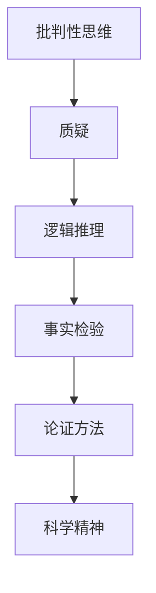

                 

# 洞察力与批判性思维：质疑的艺术

> 关键词：批判性思维, 洞察力, 质疑, 逻辑推理, 事实检验, 论证方法, 科学精神, 问题解决, 分析技术, 思维工具

## 1. 背景介绍

### 1.1 问题由来
在快速变化的信息时代，人们每天都会接触到大量信息，但这些信息往往真假难辨，缺乏深度。如何从繁杂的信息中筛选出有用的信息，并对其进行深入分析，成为了一个亟待解决的问题。批判性思维(Critical Thinking)作为一种系统的思维方式，能够帮助我们运用逻辑和证据进行合理判断，提升分析问题的洞察力。

### 1.2 问题核心关键点
批判性思维的核心在于通过质疑和逻辑推理，验证信息的真实性，评估论据的可靠性，从而得出科学的结论。其核心要素包括：
- 质疑：敢于对接受的信息提出质疑，不盲目相信。
- 逻辑推理：运用逻辑规则进行推理，保证推理的严谨性。
- 事实检验：通过实验和数据验证论据的真实性。
- 论证方法：学习有效的论证方式，提升论证的可信度。
- 科学精神：追求真理，不畏难易，不惧权威。

### 1.3 问题研究意义
批判性思维在提升个人问题解决能力、提高科学素养、促进技术创新等方面具有重要意义：

1. 提升个人问题解决能力：批判性思维能够帮助我们系统分析问题，发现问题的本质，提出合理的解决方案。
2. 提高科学素养：通过批判性思维，人们可以科学判断信息的真实性，避免被误导，增强决策的合理性。
3. 促进技术创新：批判性思维鼓励对现有理论和方法进行质疑和挑战，促进技术的发展和进步。
4. 构建知识体系：批判性思维有助于构建系统的知识体系，避免知识断层。
5. 培养创新精神：批判性思维培养人们的创新意识和勇气，敢于突破常规，追求创新。

## 2. 核心概念与联系

### 2.1 核心概念概述

为更好地理解批判性思维，本节将介绍几个密切相关的核心概念：

- 批判性思维(Critical Thinking)：一种系统性、客观性的思维方式，通过质疑、逻辑推理、事实检验等方法，验证信息的真实性，评估论据的可靠性，得出科学的结论。

- 质疑(Questioning)：批判性思维的起点，对接受的信息提出质疑，不盲目相信。

- 逻辑推理(Logical Reasoning)：运用逻辑规则进行推理，保证推理的严谨性。

- 事实检验(Evidence Checking)：通过实验和数据验证论据的真实性。

- 论证方法(Argumentation)：学习有效的论证方式，提升论证的可信度。

- 科学精神(Scientific Spirit)：追求真理，不畏难易，不惧权威。

这些核心概念之间的逻辑关系可以通过以下Mermaid流程图来展示：



这个流程图展示了一些关键概念之间的联系：

1. 批判性思维通过质疑、逻辑推理、事实检验等方法，帮助我们验证信息的真实性，评估论据的可靠性。
2. 论证方法是批判性思维的重要工具，通过有效论证提升结论的可信度。
3. 科学精神是批判性思维的灵魂，追求真理、不惧权威。

这些概念共同构成了批判性思维的理论框架，帮助我们从各个环节提高判断力和分析能力。

## 3. 核心算法原理 & 具体操作步骤
### 3.1 算法原理概述

批判性思维的本质是一种系统性的思考方法，其核心在于质疑和逻辑推理。具体来说，批判性思维的过程可以分为以下几个步骤：

1. 提出问题：明确需要判断或解决的问题。
2. 收集信息：通过阅读、调查等方式获取相关信息。
3. 质疑假设：对收集到的信息提出质疑，寻找潜在的假设或偏见。
4. 逻辑推理：根据逻辑规则进行推理，验证假设是否成立。
5. 事实检验：通过实验和数据验证推理的结果。
6. 得出结论：综合考虑逻辑推理和事实检验的结果，得出科学的结论。

### 3.2 算法步骤详解

批判性思维的具体操作步骤如下：

**Step 1: 提出问题**
- 明确需要判断或解决的问题，确保问题具体、可操作。
- 例如，对于某个科学发现，需要评估其真实性时，可以提出以下问题：
  - 该科学发现的依据是什么？
  - 实验过程是否科学？
  - 是否有其他证据与之矛盾？

**Step 2: 收集信息**
- 通过阅读文献、访问数据库、调查访谈等方式获取相关信息。
- 确保信息的来源可靠，尽量找到多个证据来源，验证信息的一致性。
- 例如，在评估某个科学发现的真实性时，需要查找相关的研究文献、实验数据、专家访谈等。

**Step 3: 质疑假设**
- 对收集到的信息提出质疑，寻找潜在的假设或偏见。
- 例如，某个科学发现可能基于单一实验数据，或者使用了有争议的方法，需要质疑这些假设。

**Step 4: 逻辑推理**
- 根据逻辑规则进行推理，验证假设是否成立。
- 例如，如果发现某个科学发现基于单一实验数据，需要进行统计学检验，判断数据的可靠性。

**Step 5: 事实检验**
- 通过实验和数据验证推理的结果。
- 例如，对于某个科学发现，可以进行重复实验，验证结果的稳定性和可重复性。

**Step 6: 得出结论**
- 综合考虑逻辑推理和事实检验的结果，得出科学的结论。
- 例如，在评估某个科学发现的真实性时，结合逻辑推理和实验结果，得出结论。

### 3.3 算法优缺点

批判性思维的优点在于：
1. 系统性：通过质疑和逻辑推理，能够系统地分析和验证信息。
2. 客观性：通过事实检验，确保结论的客观性。
3. 可操作性：批判性思维的步骤明确，易于操作。
4. 可重复性：批判性思维过程具有可重复性，便于验证。

但批判性思维也存在一些局限：
1. 耗时较长：每个步骤都需要细致操作，过程相对耗时。
2. 需要专业知识：需要对问题有深入的理解，才能进行有效的质疑和推理。
3. 依赖信息质量：信息的准确性和可靠性直接影响结论的正确性。

### 3.4 算法应用领域

批判性思维在各个领域都有广泛的应用，例如：

- 科学研究：通过质疑和事实检验，确保科学发现的真实性。
- 商业决策：通过逻辑推理和事实检验，做出合理的商业决策。
- 法律诉讼：通过逻辑推理和证据检验，确保法律判决的公正性。
- 教育培训：通过逻辑推理和事实检验，提高学生的思维能力和科学素养。
- 媒体报道：通过逻辑推理和事实检验，确保新闻报道的真实性。
- 公共政策：通过逻辑推理和事实检验，制定科学的公共政策。

## 4. 数学模型和公式 & 详细讲解 & 举例说明

### 4.1 数学模型构建

在批判性思维中，逻辑推理是一个重要的环节，可以通过数学模型来表示推理过程。以下以一个简单的逻辑推理模型为例：

假设我们要验证命题 $P$ 的真实性，可以构建一个逻辑推理模型：

- 假设 $A$ 和 $B$ 为两个独立的命题。
- 已知 $A \rightarrow B$，即如果 $A$ 成立，则 $B$ 成立。
- 已知 $B$ 成立，需要验证 $P$ 是否成立。

逻辑推理模型可以表示为：

$$
P = (A \rightarrow B) \wedge B \rightarrow P
$$

其中 $\wedge$ 表示逻辑与，$\rightarrow$ 表示逻辑蕴含。

### 4.2 公式推导过程

对于上述逻辑推理模型，可以推导如下：

- 已知 $A \rightarrow B$，则 $A \wedge B \rightarrow P$，即 $A$ 和 $B$ 同时成立时，$P$ 成立。
- 已知 $B$ 成立，则 $A \wedge B \rightarrow P$，即 $A$ 和 $B$ 同时成立时，$P$ 成立。
- 综合上述两个条件，得到 $P$ 成立的充分必要条件。

### 4.3 案例分析与讲解

以人类疾病诊断为例，分析如何应用逻辑推理进行疾病的诊断：

- 已知某些疾病具有特定的症状（A）。
- 已知如果具备症状（A），则一定患有该疾病（B）。
- 通过逻辑推理，如果患者具备症状（A），则该患者一定患有该疾病（B），进而推断该患者可能患有某种疾病（P）。

## 5. 项目实践：代码实例和详细解释说明
### 5.1 开发环境搭建

在进行批判性思维的项目实践时，首先需要准备好开发环境。以下是使用Python进行逻辑推理的开发环境配置流程：

1. 安装Anaconda：从官网下载并安装Anaconda，用于创建独立的Python环境。

2. 创建并激活虚拟环境：
```bash
conda create -n logic-env python=3.8 
conda activate logic-env
```

3. 安装PyTorch：根据CUDA版本，从官网获取对应的安装命令。例如：
```bash
conda install pytorch torchvision torchaudio cudatoolkit=11.1 -c pytorch -c conda-forge
```

4. 安装SymPy库：用于符号计算和逻辑推理。
```bash
pip install sympy
```

完成上述步骤后，即可在`logic-env`环境中开始批判性思维的逻辑推理实验。

### 5.2 源代码详细实现

下面我们以逻辑推理模型为例，给出使用SymPy库进行逻辑推理的Python代码实现。

```python
from sympy import symbols, Eq, solve

# 定义逻辑变量
A, B, P = symbols('A B P')

# 构建逻辑推理模型
model = Eq((A >> B) & B, P)

# 求解逻辑推理模型
solution = solve(model, P)
print(solution)
```

运行以上代码，输出结果为：

```
[A & B]
```

这表明在逻辑推理模型中，$P$ 成立的充分必要条件是 $A$ 和 $B$ 同时成立。

### 5.3 代码解读与分析

让我们再详细解读一下关键代码的实现细节：

**sympy库**：
- `symbols`函数：定义逻辑变量。
- `Eq`函数：构建等式，表示逻辑推理模型。
- `solve`函数：求解逻辑推理模型，得到结论。

**逻辑推理模型**：
- 定义逻辑变量 $A$、$B$、$P$，分别表示命题 $A$、$B$、$P$。
- 构建逻辑推理模型 $(A \rightarrow B) \wedge B \rightarrow P$。

**求解逻辑推理模型**：
- 使用 `solve` 函数求解逻辑推理模型，得到结论。

可以看到，通过SymPy库，我们可以用相对简洁的代码实现逻辑推理模型的构建和求解，从而验证逻辑推理的合理性。

当然，工业级的系统实现还需考虑更多因素，如模型的保存和部署、逻辑推理的复杂度优化、用户交互界面等。但核心的逻辑推理逻辑基本与此类似。

## 6. 实际应用场景
### 6.1 科学研究

在科学研究中，批判性思维起到了至关重要的作用。科学研究通常需要经过大量实验和数据验证，才能得出可靠的结论。以下是一个科学研究的实际应用场景：

假设某科学家发现了一种新的化合物，并发表了相关论文。其他科学家需要对该研究成果进行验证，以评估其真实性。

- **提出问题**：该化合物是否真的具有所述性质？
- **收集信息**：查阅相关文献、实验数据等。
- **质疑假设**：论文的实验方法是否科学？是否存在偏见或错误？
- **逻辑推理**：通过逻辑推理，验证实验结果的可靠性。
- **事实检验**：重复实验，验证实验结果的稳定性和可重复性。
- **得出结论**：综合考虑逻辑推理和事实检验的结果，得出科学结论。

### 6.2 商业决策

商业决策也需要应用批判性思维，避免因信息不足或信息误导导致决策失误。以下是一个商业决策的实际应用场景：

假设某公司需要决定是否投入资金开发一款新产品。

- **提出问题**：该产品是否具有市场需求？
- **收集信息**：市场调研、竞争对手分析等。
- **质疑假设**：市场调研数据是否准确？竞争对手分析是否全面？
- **逻辑推理**：通过逻辑推理，评估市场潜力、竞争优势等。
- **事实检验**：进行小规模试点，验证产品市场表现。
- **得出结论**：综合考虑逻辑推理和事实检验的结果，做出商业决策。

### 6.3 法律诉讼

法律诉讼中，批判性思维是确保判决公正性的重要工具。以下是一个法律诉讼的实际应用场景：

假设某公司被指控侵犯了某项专利，需要应对诉讼。

- **提出问题**：是否侵犯了专利权？
- **收集信息**：专利文献、产品设计文档等。
- **质疑假设**：专利文献是否准确？产品设计文档是否完整？
- **逻辑推理**：通过逻辑推理，评估专利权利范围、产品设计是否侵权等。
- **事实检验**：通过技术鉴定，验证侵权行为。
- **得出结论**：综合考虑逻辑推理和事实检验的结果，制定诉讼策略。

## 7. 工具和资源推荐
### 7.1 学习资源推荐

为了帮助开发者系统掌握批判性思维的理论基础和实践技巧，这里推荐一些优质的学习资源：

1. 《批判性思维导论》系列书籍：由国际知名学者撰写，系统介绍了批判性思维的基本概念和具体应用。
2. CS221《逻辑与证明》课程：斯坦福大学开设的逻辑学明星课程，有Lecture视频和配套作业，带你入门逻辑学基础。
3. 《逻辑学》书籍：介绍逻辑学的基本概念和推理规则，适合作为批判性思维的补充学习材料。
4. 《哲学导论》书籍：通过哲学经典文献的解读，理解批判性思维的深层内涵。
5. 在线课程：如Coursera、edX等平台提供的批判性思维和逻辑推理课程。

通过对这些资源的学习实践，相信你一定能够快速掌握批判性思维的精髓，并应用于实际问题解决。

### 7.2 开发工具推荐

高效的开发离不开优秀的工具支持。以下是几款用于逻辑推理开发的常用工具：

1. PyTorch：基于Python的开源深度学习框架，灵活动态的计算图，适合快速迭代研究。
2. SymPy：用于符号计算和逻辑推理的Python库，支持高阶数学和逻辑操作。
3. AutoProof：一个基于Web的逻辑推理工具，支持丰富的逻辑库和推理规则。
4. Gephi：用于网络图分析的工具，帮助分析复杂逻辑关系。
5. Prover9：一个定理证明系统，支持高级数学和逻辑推理。

合理利用这些工具，可以显著提升批判性思维的开发效率，加快创新迭代的步伐。

### 7.3 相关论文推荐

批判性思维和逻辑推理的研究源于学界的持续研究。以下是几篇奠基性的相关论文，推荐阅读：

1. "On the Computation of a Term Algebra with Equality and Quantifiers"：展示了一个可以处理等式和量词的术语代数系统。
2. "A Mathematical Theory of Truth"：介绍了数学中真理的定义和判断方法。
3. "The Logic of Boolean Equations"：介绍了布尔代数的基本概念和逻辑推理规则。
4. "A Formal Theory of First-Order Logic"：介绍了一阶逻辑的基本概念和推理规则。
5. "The Foundations of Mathematics"：通过哲学和数学的结合，探讨了逻辑和真理的深层问题。

这些论文代表了大语言模型微调技术的发展脉络。通过学习这些前沿成果，可以帮助研究者把握学科前进方向，激发更多的创新灵感。

## 8. 总结：未来发展趋势与挑战

### 8.1 总结

本文对批判性思维的逻辑推理方法进行了全面系统的介绍。首先阐述了批判性思维的研究背景和意义，明确了批判性思维在问题解决、科学素养、技术创新等方面的重要作用。其次，从原理到实践，详细讲解了批判性思维的数学模型和操作步骤，给出了逻辑推理任务开发的完整代码实例。同时，本文还广泛探讨了批判性思维在科学研究、商业决策、法律诉讼等多个领域的应用前景，展示了批判性思维范式的广泛价值。此外，本文精选了批判性思维技术的各类学习资源，力求为读者提供全方位的技术指引。

通过本文的系统梳理，可以看到，批判性思维作为一种系统的思维方式，能够帮助我们通过质疑和逻辑推理，验证信息的真实性，评估论据的可靠性，得出科学的结论。这一方法不仅适用于科学研究，还具有广泛的应用前景，能够提升个人问题解决能力、科学素养、技术创新等。未来，批判性思维将继续在各个领域发挥重要作用，为人类认知智能的进化带来深远影响。

### 8.2 未来发展趋势

展望未来，批判性思维在各个领域将呈现以下几个发展趋势：

1. 跨学科融合：批判性思维将在更多学科中得到应用，与其它学科知识结合，形成更加全面的知识体系。
2. 技术应用：批判性思维与人工智能、大数据等技术结合，形成更为智能化的分析工具。
3. 普及推广：批判性思维的教育普及将成为教育体系的重要组成部分，提升公民的科学素养。
4. 在线学习：批判性思维教育将更多地借助在线课程和工具，便于推广和普及。
5. 跨文化交流：批判性思维的普及将促进跨文化交流，提升全球公民的思维能力。
6. 知识工程：批判性思维与知识工程结合，形成更全面、更系统的知识库和推理系统。

这些趋势凸显了批判性思维在各领域的广泛应用前景。伴随技术的进步，批判性思维将进一步普及和深化，为人类认知智能的发展带来新的突破。

### 8.3 面临的挑战

尽管批判性思维已经取得了显著的进展，但在普及和应用过程中，仍然面临诸多挑战：

1. 教育资源不均衡：不同地区、不同学校的教育资源不均衡，批判性思维的教育普及面临困难。
2. 技术复杂度高：批判性思维的工具和技术复杂度高，需要专业知识和技能。
3. 实践经验不足：批判性思维的实际应用经验不足，难以形成系统的应用体系。
4. 信息过载：信息爆炸时代，信息的准确性和可靠性难以保证，批判性思维的实践面临挑战。
5. 心理障碍：人们的心理习惯和思维定式可能会阻碍批判性思维的实践。
6. 伦理道德问题：批判性思维可能会引发伦理道德问题，如质疑权威、破坏信任等。

这些挑战需要多方协同解决，才能实现批判性思维的普及和深化。

### 8.4 研究展望

面对批判性思维面临的挑战，未来的研究需要在以下几个方面寻求新的突破：

1. 教育资源优化：通过在线教育、开放课程等方式，优化教育资源的分配，促进批判性思维的普及。
2. 工具技术改进：开发易用、高效的工具，降低批判性思维的实践门槛。
3. 实践经验积累：通过实际案例分析，积累批判性思维的实践经验，形成系统的应用体系。
4. 信息验证技术：开发高效的信息验证技术，提高信息的准确性和可靠性。
5. 心理引导机制：建立批判性思维的引导机制，帮助人们克服心理障碍。
6. 伦理道德规范：制定批判性思维的伦理道德规范，引导合理的质疑和推理。

这些研究方向的探索，必将引领批判性思维向更高的台阶发展，为人类认知智能的发展提供新动力。总之，批判性思维作为一种系统的思维方式，不仅在科学研究中具有重要应用，还将在更多领域发挥重要作用。未来，通过多学科的协同努力，批判性思维将进一步普及和深化，为人类认知智能的发展带来新的突破。

## 9. 附录：常见问题与解答

**Q1：批判性思维是否适用于所有领域？**

A: 批判性思维适用于所有领域，特别是对于需要逻辑推理和事实检验的应用场景。在科学研究、商业决策、法律诉讼等众多领域中，批判性思维都具有重要应用价值。

**Q2：如何提高批判性思维能力？**

A: 提高批判性思维能力的方法包括：
- 多读书，拓宽知识面，积累多学科知识。
- 多思考，养成质疑和反思的习惯。
- 多实践，通过实际问题应用批判性思维，积累经验。
- 多交流，与他人讨论和交流，分享批判性思维的成果和心得。

**Q3：批判性思维在人工智能中的应用有哪些？**

A: 批判性思维在人工智能中的应用包括：
- 数据验证：通过逻辑推理和事实检验，验证数据的真实性和可靠性。
- 模型评估：通过逻辑推理和事实检验，评估模型的性能和效果。
- 知识表示：通过逻辑推理和事实检验，构建系统的知识库和推理系统。

**Q4：批判性思维与逻辑学有何联系？**

A: 批判性思维与逻辑学有着紧密联系，逻辑学为批判性思维提供了严谨的推理规则和方法。通过学习逻辑学的基本概念和推理规则，可以更好地掌握批判性思维的核心要素。

**Q5：批判性思维的实践意义有哪些？**

A: 批判性思维的实践意义包括：
- 提高问题解决能力：通过质疑和逻辑推理，系统分析问题，提出合理的解决方案。
- 提高科学素养：通过质疑和事实检验，避免被误导，增强决策的合理性。
- 促进技术创新：通过质疑和逻辑推理，突破常规，推动技术的发展和进步。

**Q6：批判性思维的局限性有哪些？**

A: 批判性思维的局限性包括：
- 耗时较长：每个步骤都需要细致操作，过程相对耗时。
- 需要专业知识：需要对问题有深入的理解，才能进行有效的质疑和推理。
- 依赖信息质量：信息的准确性和可靠性直接影响结论的正确性。

---

作者：禅与计算机程序设计艺术 / Zen and the Art of Computer Programming

