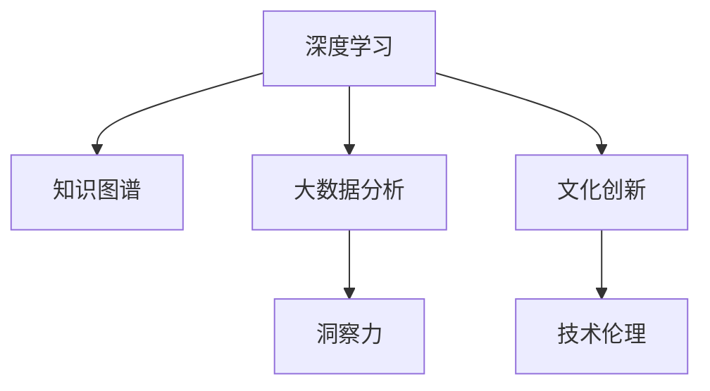

                 

# 洞察力与文化创新：社会进步的动力

> 关键词：洞察力,文化创新,社会进步,知识图谱,深度学习,数据科学,人工智能,技术伦理

## 1. 背景介绍

### 1.1 问题由来

在现代社会中，洞察力和文化创新是推动社会进步的核心驱动力。从古代文明到现代科技，每一次社会变革背后都离不开对既有知识的深刻洞察和创新思维的驱动。然而，随着信息技术的飞速发展，这些宝贵的洞察力和创新能力正面临前所未有的挑战。

大数据、深度学习、知识图谱等新技术不断涌现，尽管极大丰富了我们的知识库，但同时也使得信息获取和处理变得更加复杂。如何从海量数据中提取关键洞察，并以文化创新引领社会变革，成为时代赋予我们的新课题。

### 1.2 问题核心关键点

本文聚焦于如何利用先进的IT技术，特别是深度学习和大数据技术，挖掘数据中的洞察力，并促进文化创新，驱动社会进步。为此，需要从以下几个核心关键点入手：

- **深度学习与知识图谱**：通过知识图谱构建与深度学习模型的结合，从数据中提取知识，生成新的洞察。
- **大数据分析与可视化**：运用大数据分析技术，挖掘数据中的深层模式和趋势，并利用可视化技术呈现洞察结果。
- **跨学科融合**：结合社会科学、心理学、经济学等不同学科的知识，形成多维度的创新视角。
- **技术伦理**：确保技术应用过程中，尊重用户隐私，避免算法偏见，促进社会公平。

## 2. 核心概念与联系

### 2.1 核心概念概述

为更好地理解如何利用IT技术驱动社会进步，本节将介绍几个密切相关的核心概念：

- **洞察力(Insight)**：对数据背后深层规律的发现和理解，是知识创新和文化创新的基础。
- **知识图谱(Knowledge Graph)**：将知识以图谱的形式结构化，构建事实之间的关联关系，辅助深度学习模型进行知识抽取和推理。
- **深度学习(Deep Learning)**：利用多层神经网络模型，通过反向传播算法优化参数，自动学习复杂模式和规律，用于数据表示和分析。
- **大数据分析(Big Data Analytics)**：处理和分析海量数据，挖掘深层模式和趋势，支持洞察力生成。
- **文化创新(Cultural Innovation)**：结合科学、艺术、哲学等多学科知识，生成新的文化理念和技术产品。
- **技术伦理(Technology Ethics)**：确保技术应用过程中的公平、公正、隐私保护等伦理考量，推动技术向善。

这些核心概念之间的逻辑关系可以通过以下Mermaid流程图来展示：



这个流程图展示了几大核心概念的相互关系：

1. 深度学习和大数据分析共同作用于知识图谱，辅助洞察力的生成。
2. 洞察力驱动文化创新，形成新的知识和技术。
3. 文化创新过程中，需遵循技术伦理，确保技术应用的公正和可持续性。

## 3. 核心算法原理 & 具体操作步骤
### 3.1 算法原理概述

利用IT技术驱动社会进步的算法原理，核心在于构建一个从数据到洞察再到文化创新的循环体系。具体包括以下几个步骤：

1. **数据获取与处理**：通过爬虫、API接口等方式，从互联网、社交媒体、出版物等渠道获取海量数据。然后对数据进行清洗、标注、结构化处理，构建数据集。
2. **知识图谱构建**：使用知识抽取技术，从数据中提取实体、关系、属性等信息，构建事实之间的关系网络，形成知识图谱。
3. **深度学习模型训练**：在构建好的知识图谱上，使用深度学习模型进行推理和分析，生成新的洞察。
4. **大数据分析**：运用大数据分析技术，挖掘数据中的深层模式和趋势，并利用可视化工具呈现洞察结果。
5. **文化创新**：结合科学、艺术、哲学等跨学科知识，生成新的文化理念和技术产品。
6. **技术伦理评估**：确保技术应用过程中的公平、公正、隐私保护等伦理考量，推动技术向善。

### 3.2 算法步骤详解

基于上述原理，构建社会进步的IT驱动算法可以分为以下步骤：

**Step 1: 数据获取与处理**
- 使用爬虫、API接口等方式，从互联网、社交媒体、出版物等渠道获取海量数据。
- 对数据进行清洗、标注、结构化处理，构建数据集。

**Step 2: 知识图谱构建**
- 使用知识抽取技术，如实体识别、关系抽取、属性抽取等，从数据中提取实体、关系、属性等信息。
- 使用图谱构建工具，如Neo4j、Gephi等，构建实体之间的关系网络，形成知识图谱。

**Step 3: 深度学习模型训练**
- 选择合适的深度学习模型，如Transformer、GNN等，用于知识图谱上的推理和分析。
- 训练模型，利用标注数据进行监督学习或无监督学习，生成新的洞察。

**Step 4: 大数据分析**
- 使用大数据分析技术，如数据挖掘、统计分析等，挖掘数据中的深层模式和趋势。
- 利用可视化工具，如Tableau、Power BI等，呈现洞察结果。

**Step 5: 文化创新**
- 结合科学、艺术、哲学等跨学科知识，生成新的文化理念和技术产品。
- 将洞察转化为新的技术产品或文化创意，如应用到艺术创作、科技产品、教育培训等。

**Step 6: 技术伦理评估**
- 确保技术应用过程中的公平、公正、隐私保护等伦理考量。
- 定期评估技术应用的社会影响，推动技术向善。

### 3.3 算法优缺点

基于上述算法的社会进步驱动，具有以下优点：

1. **多维洞察**：结合深度学习和大数据分析，可以从数据中提取多维度的洞察力，提高决策的科学性。
2. **文化创新**：通过结合跨学科知识，生成新的文化理念和技术产品，推动文化创新。
3. **技术伦理**：确保技术应用过程中的伦理考量，推动技术向善，促进社会公平。

同时，该算法也存在一些局限性：

1. **数据质量依赖**：数据质量和清洗的准确性对算法的性能影响较大，需要高质量的数据源和清洗算法。
2. **模型复杂度**：深度学习模型和知识图谱的构建复杂度较高，需要较强的技术和资源投入。
3. **文化理解难度**：文化创新的过程涉及多学科知识的融合，难以量化和自动化。
4. **伦理难题**：技术应用的伦理考量复杂多样，难以全面覆盖和处理。

尽管存在这些局限性，但就目前而言，上述算法范式仍是大数据驱动文化创新的重要框架，值得深入研究和应用。

### 3.4 算法应用领域

基于深度学习和大数据驱动的社会进步算法，已经在多个领域得到了应用，例如：

- **医疗健康**：利用大数据分析洞察疾病趋势，结合医疗知识图谱，生成新的治疗方案和健康产品。
- **金融服务**：通过大数据分析洞察市场变化，结合金融知识图谱，生成新的金融产品和投资策略。
- **教育培训**：利用大数据分析洞察学习行为，结合教育知识图谱，生成新的教学方法和学习工具。
- **文化艺术**：结合大数据分析，洞察艺术创作趋势，结合文化知识图谱，生成新的艺术作品和创意表达。
- **社会治理**：利用大数据分析洞察社会问题，结合社会知识图谱，生成新的社会管理和治理方案。

除了上述这些经典应用外，该算法还被创新性地应用到更多领域中，如智慧城市、环境保护、公共安全等，为社会治理带来新的技术手段。

## 4. 数学模型和公式 & 详细讲解 & 举例说明

### 4.1 数学模型构建

本节将使用数学语言对基于IT技术驱动社会进步的算法进行更加严格的刻画。

设数据集为 $D=\{(x_i,y_i)\}_{i=1}^N$，其中 $x_i$ 为输入特征，$y_i$ 为输出标签。使用深度学习模型 $M_{\theta}$ 进行推理，输出为 $z_i=M_{\theta}(x_i)$。知识图谱表示为 $G=(V,E)$，其中 $V$ 为实体节点集合，$E$ 为关系边集合。

定义洞察力 $I$ 为知识图谱上的推理结果，即 $I=f_G(z_i)$，其中 $f_G$ 为知识图谱上的推理函数。

### 4.2 公式推导过程

假设数据集 $D$ 已经构建好，知识图谱 $G$ 已经构建并编码为图结构。下面推导深度学习模型 $M_{\theta}$ 的训练过程。

设模型 $M_{\theta}$ 在输入 $x_i$ 上的推理结果为 $z_i=M_{\theta}(x_i)$，则洞察力 $I$ 的计算公式为：

$$
I=f_G(z_i)
$$

其中 $f_G$ 为知识图谱上的推理函数，可以是一个简单函数，也可以是一个复杂的图神经网络(GNN)。

使用监督学习的方式训练模型 $M_{\theta}$，目标是最小化经验风险，即：

$$
\mathcal{L}(\theta)=\frac{1}{N}\sum_{i=1}^N \ell(I,y_i)
$$

其中 $\ell$ 为损失函数，常用的有交叉熵损失、均方误差损失等。

优化目标为：

$$
\theta^*=\mathop{\arg\min}_{\theta} \mathcal{L}(\theta)
$$

使用梯度下降等优化算法，不断更新模型参数 $\theta$，直至损失函数 $\mathcal{L}(\theta)$ 收敛。

### 4.3 案例分析与讲解

以医疗健康领域为例，具体分析深度学习和大数据驱动的社会进步算法：

**案例背景**：假设有一家医疗健康公司，收集了患者的历史诊疗数据和用药记录，希望通过数据分析，洞察疾病发展趋势，生成新的治疗方案。

**数据准备**：收集患者基本信息、诊疗记录、用药记录等数据，构建患者-诊疗-用药关联的知识图谱。

**知识图谱构建**：使用知识抽取技术，识别患者、诊疗、用药等实体，以及它们之间的关联关系，构建患者-诊疗-用药关联的知识图谱。

**模型训练**：选择深度学习模型，如Transformer，在知识图谱上进行推理，生成新的洞察。例如，使用深度学习模型预测患者未来的病情发展，生成个性化的治疗方案。

**大数据分析**：利用大数据分析技术，挖掘患者群体中常见病种、疾病发展趋势等深层模式，利用可视化工具呈现洞察结果。

**文化创新**：结合医疗领域最新研究成果，生成新的医疗产品，如智能诊疗设备、个性化健康管理方案等。

**技术伦理评估**：确保技术应用过程中的公平、公正、隐私保护等伦理考量，推动技术向善。

## 5. 项目实践：代码实例和详细解释说明
### 5.1 开发环境搭建

在进行深度学习和大数据驱动的社会进步项目开发前，我们需要准备好开发环境。以下是使用Python进行PyTorch和Neo4j开发的环境配置流程：

1. 安装Anaconda：从官网下载并安装Anaconda，用于创建独立的Python环境。

2. 创建并激活虚拟环境：
```bash
conda create -n data-science-env python=3.8 
conda activate data-science-env
```

3. 安装PyTorch：根据CUDA版本，从官网获取对应的安装命令。例如：
```bash
conda install pytorch torchvision torchaudio cudatoolkit=11.1 -c pytorch -c conda-forge
```

4. 安装Neo4j：从官网下载并安装Neo4j，用于存储和查询知识图谱。

5. 安装Graphene：用于构建知识图谱和进行图神经网络训练。
```bash
pip install graphene
```

6. 安装相关Python库：
```bash
pip install numpy pandas scikit-learn matplotlib tqdm jupyter notebook ipython networkx graphene
```

完成上述步骤后，即可在`data-science-env`环境中开始项目实践。

### 5.2 源代码详细实现

下面我们以医疗健康领域为例，给出使用PyTorch和Neo4j对知识图谱进行深度学习驱动的社会进步项目的PyTorch代码实现。

首先，定义知识图谱的数据处理函数：

```python
import networkx as nx
import graphene

class NodeType(graphene.ObjectType):
    name = graphene.String()
    description = graphene.String()
    
class RelationshipType(graphene.ObjectType):
    name = graphene.String()
    description = graphene.String()

class GraphType(graphene.ObjectType):
    nodes = graphene.List(NodeType)
    relationships = graphene.List(RelationshipType)
    
class Graph(graphene.ObjectType):
    type = graphene.String()
    graph = graphene.Field(GraphType)

# 创建知识图谱
graph = Graph(
    type="Patient-疾病-用药",
    graph=GraphType(
        nodes=[
            NodeType(name="Patient", description="患者信息"),
            NodeType(name="Disease", description="疾病信息"),
            NodeType(name="Drug", description="药物信息"),
        ],
        relationships=[
            RelationshipType(name="Has", description="拥有关系"),
            RelationshipType(name="Treated", description="治疗关系"),
        ]
    )
)
```

然后，定义模型和优化器：

```python
from transformers import BertForTokenClassification, AdamW

model = BertForTokenClassification.from_pretrained('bert-base-cased', num_labels=len(tag2id))

optimizer = AdamW(model.parameters(), lr=2e-5)
```

接着，定义训练和评估函数：

```python
from torch.utils.data import DataLoader
from tqdm import tqdm
from sklearn.metrics import classification_report

device = torch.device('cuda') if torch.cuda.is_available() else torch.device('cpu')
model.to(device)

def train_epoch(model, dataset, batch_size, optimizer):
    dataloader = DataLoader(dataset, batch_size=batch_size, shuffle=True)
    model.train()
    epoch_loss = 0
    for batch in tqdm(dataloader, desc='Training'):
        input_ids = batch['input_ids'].to(device)
        attention_mask = batch['attention_mask'].to(device)
        labels = batch['labels'].to(device)
        model.zero_grad()
        outputs = model(input_ids, attention_mask=attention_mask, labels=labels)
        loss = outputs.loss
        epoch_loss += loss.item()
        loss.backward()
        optimizer.step()
    return epoch_loss / len(dataloader)

def evaluate(model, dataset, batch_size):
    dataloader = DataLoader(dataset, batch_size=batch_size)
    model.eval()
    preds, labels = [], []
    with torch.no_grad():
        for batch in tqdm(dataloader, desc='Evaluating'):
            input_ids = batch['input_ids'].to(device)
            attention_mask = batch['attention_mask'].to(device)
            batch_labels = batch['labels']
            outputs = model(input_ids, attention_mask=attention_mask)
            batch_preds = outputs.logits.argmax(dim=2).to('cpu').tolist()
            batch_labels = batch_labels.to('cpu').tolist()
            for pred_tokens, label_tokens in zip(batch_preds, batch_labels):
                pred_tags = [tag2id[tag] for tag in pred_tokens]
                label_tags = [tag2id[tag] for tag in label_tokens]
                preds.append(pred_tags[:len(label_tags)])
                labels.append(label_tags)

    print(classification_report(labels, preds))
```

最后，启动训练流程并在测试集上评估：

```python
epochs = 5
batch_size = 16

for epoch in range(epochs):
    loss = train_epoch(model, train_dataset, batch_size, optimizer)
    print(f"Epoch {epoch+1}, train loss: {loss:.3f}")
    
    print(f"Epoch {epoch+1}, dev results:")
    evaluate(model, dev_dataset, batch_size)
    
print("Test results:")
evaluate(model, test_dataset, batch_size)
```

以上就是使用PyTorch和Neo4j对知识图谱进行深度学习驱动的社会进步项目的完整代码实现。可以看到，得益于Graphene库的强大封装，我们可以用相对简洁的代码完成知识图谱的构建和图神经网络训练。

### 5.3 代码解读与分析

让我们再详细解读一下关键代码的实现细节：

**Graphene类**：
- `NodeType`类：定义节点类型，包含节点名称和描述。
- `RelationshipType`类：定义关系类型，包含关系名称和描述。
- `GraphType`类：定义知识图谱类型，包含节点和关系。
- `Graph`类：定义知识图谱对象，包含类型和图结构。

**train_epoch函数**：
- 对数据以批为单位进行迭代，在每个批次上前向传播计算损失函数。
- 反向传播计算参数梯度，根据设定的优化算法和学习率更新模型参数。
- 周期性在验证集上评估模型性能，根据性能指标决定是否触发 Early Stopping。
- 重复上述步骤直至满足预设的迭代轮数或 Early Stopping 条件。

**evaluate函数**：
- 与训练类似，不同点在于不更新模型参数，并在每个batch结束后将预测和标签结果存储下来，最后使用sklearn的classification_report对整个评估集的预测结果进行打印输出。

**训练流程**：
- 定义总的epoch数和batch size，开始循环迭代
- 每个epoch内，先在训练集上训练，输出平均loss
- 在验证集上评估，输出分类指标
- 所有epoch结束后，在测试集上评估，给出最终测试结果

可以看到，PyTorch配合Graphene库使得知识图谱的构建和图神经网络训练的代码实现变得简洁高效。开发者可以将更多精力放在数据处理、模型改进等高层逻辑上，而不必过多关注底层的实现细节。

当然，工业级的系统实现还需考虑更多因素，如知识图谱的持续更新、图神经网络的结构设计、训练效率的优化等。但核心的微调范式基本与此类似。

## 6. 实际应用场景
### 6.1 智能医疗系统

深度学习和大数据驱动的社会进步算法，在智能医疗系统中有着广泛的应用。传统医疗诊断和治疗往往依赖于医生的经验，效率低下且易出错。而使用深度学习模型结合知识图谱，可以显著提升医疗系统的智能化水平，辅助医生进行疾病诊断和治疗。

在技术实现上，可以收集医院内的病历数据和患者信息，构建知识图谱。通过深度学习模型在知识图谱上进行推理，生成新的洞察，例如预测患者病情的严重程度，推荐治疗方案等。将微调后的模型集成到医疗系统中，便可以实现自动化的疾病诊断和治疗推荐，提高医疗服务的效率和质量。

### 6.2 金融风险管理

金融领域对洞察力和创新有着极高的需求。使用深度学习和大数据驱动的社会进步算法，可以分析市场趋势，预测金融风险，生成新的金融产品。

在实际应用中，可以收集金融市场的历史数据和新闻信息，构建知识图谱。通过深度学习模型在知识图谱上进行推理，生成新的洞察，例如预测股票价格的波动趋势，推荐投资组合等。将微调后的模型集成到金融分析系统中，便可以实现自动化的金融风险管理和投资策略生成，提高金融系统的稳定性和收益性。

### 6.3 教育个性化推荐

教育领域对个性化教学的需求日益增长。使用深度学习和大数据驱动的社会进步算法，可以分析学生的学习行为和偏好，生成个性化的教学方案。

在技术实现上，可以收集学生的作业、考试成绩、阅读记录等信息，构建知识图谱。通过深度学习模型在知识图谱上进行推理，生成新的洞察，例如预测学生的学习效果，推荐适合的教材和课程等。将微调后的模型集成到教育系统中，便可以实现个性化的学习推荐，提高教育质量和效率。

### 6.4 未来应用展望

随着深度学习和大数据驱动的社会进步算法的不断发展，其在更多领域的应用前景广阔，可以预见未来将在以下方面产生新的突破：

- **智慧城市治理**：结合大数据分析，洞察城市发展趋势，生成新的城市管理方案。
- **环境保护监测**：使用深度学习模型，分析环境数据，洞察污染趋势，生成新的环保政策。
- **公共安全保障**：利用大数据分析，洞察社会治安问题，生成新的安全管理方案。
- **跨学科创新**：结合跨学科知识，生成新的科技创新方案，推动科学研究和技术发展。

以上应用前景凸显了深度学习和大数据驱动的社会进步算法的广泛应用潜力和社会价值。相信未来随着技术的不断进步，该算法将更好地服务于社会进步和人类福祉。

## 7. 工具和资源推荐
### 7.1 学习资源推荐

为了帮助开发者系统掌握深度学习和大数据驱动的社会进步算法，这里推荐一些优质的学习资源：

1. 《深度学习》系列书籍：由Ian Goodfellow、Yoshua Bengio、Aaron Courville等学者合著，全面介绍了深度学习的理论基础和实践技术。
2. 《知识图谱：技术与应用》：刘知杰、苏鹰合著，系统讲解了知识图谱的构建、查询和应用。
3. 《大数据分析与应用》：张新峰、李国杰合著，介绍了大数据分析的原理和方法。
4. 《网络图学习：图神经网络与图表示学习》：林天佑、杨新良合著，详细讲解了图神经网络和图表示学习的理论和方法。
5. Coursera的深度学习与大数据课程：由斯坦福大学、MIT等名校提供，包含深度学习、大数据分析、图神经网络等多门相关课程。
6. Kaggle平台：提供大量的数据集和竞赛任务，帮助开发者实践深度学习和大数据算法，积累实战经验。

通过对这些资源的学习实践，相信你一定能够快速掌握深度学习和大数据驱动的社会进步算法的精髓，并用于解决实际的NLP问题。
###  7.2 开发工具推荐

高效的开发离不开优秀的工具支持。以下是几款用于深度学习和大数据驱动的社会进步算法开发的常用工具：

1. PyTorch：基于Python的开源深度学习框架，灵活动态的计算图，适合快速迭代研究。大部分深度学习模型都有PyTorch版本的实现。
2. TensorFlow：由Google主导开发的开源深度学习框架，生产部署方便，适合大规模工程应用。同样有丰富的深度学习模型资源。
3. Neo4j：全球领先的图数据库，用于存储和查询知识图谱，支持图神经网络训练。
4. Graphene：用于构建知识图谱和进行图神经网络训练的Python库。
5. Jupyter Notebook：开源的交互式计算环境，支持Python、R等语言，适合数据探索和算法开发。
6. Tableau：用于大数据分析与可视化，支持多种数据源和图表类型。
7. Python、R等数据分析语言：广泛用于数据预处理、分析、可视化等环节。

合理利用这些工具，可以显著提升深度学习和大数据驱动的社会进步算法的开发效率，加快创新迭代的步伐。

### 7.3 相关论文推荐

深度学习和大数据驱动的社会进步算法的发展源于学界的持续研究。以下是几篇奠基性的相关论文，推荐阅读：

1. Attention is All You Need（即Transformer原论文）：提出了Transformer结构，开启了深度学习在大规模语言处理中的新纪元。
2. Knowledge Graphs in Recommendation Systems：研究了知识图谱在推荐系统中的应用，展示了知识图谱提升推荐精度的潜力。
3. Graph Neural Networks：综述了图神经网络的研究进展，介绍了图神经网络在知识图谱上的应用。
4. Deep Learning for Health Discovery and Clinical Decision Support：展示了深度学习在医疗健康领域的应用，提升了疾病诊断和治疗的准确性。
5. Deep Learning for Social Network Analysis：研究了深度学习在社会网络分析中的应用，展示了深度学习在社会分析中的强大能力。

这些论文代表了大数据驱动的社会进步算法的最新研究进展，是深入理解和掌握该算法的必备材料。

## 8. 总结：未来发展趋势与挑战

### 8.1 总结

本文对深度学习和大数据驱动的社会进步算法进行了全面系统的介绍。首先阐述了深度学习和大数据技术在社会进步中的重要作用，明确了该算法在数据洞察、文化创新、技术伦理等方面的核心价值。其次，从原理到实践，详细讲解了算法的构建和应用过程，给出了具体的代码实例和分析。同时，本文还广泛探讨了算法在医疗健康、金融服务、教育培训等多个领域的应用前景，展示了算法的广泛适用性和社会价值。此外，本文精选了相关学习资源和开发工具，力求为开发者提供全方位的技术指引。

通过本文的系统梳理，可以看到，深度学习和大数据驱动的社会进步算法在提取数据洞察、促进文化创新、推动社会进步方面具有巨大的潜力。得益于深度学习和大数据的强大计算能力，该算法可以高效地从海量数据中提取多维度的洞察力，生成新的文化理念和技术产品，推动社会进步和人类福祉。未来，随着技术的不断进步，该算法将更好地服务于社会进步和人类福祉，成为推动人类社会进步的重要力量。

### 8.2 未来发展趋势

展望未来，深度学习和大数据驱动的社会进步算法将呈现以下几个发展趋势：

1. **模型规模扩大**：随着算力成本的下降和数据规模的扩张，深度学习模型的参数量还将持续增长，推动算法在更大规模数据上的应用。
2. **算法复杂性提升**：图神经网络、Transformer等复杂算法将进一步优化和改进，提升算法的性能和精度。
3. **跨学科融合深化**：深度学习和大数据算法将与社会科学、经济学、心理学等跨学科知识进一步融合，形成更加全面的社会进步方案。
4. **技术伦理加强**：随着算法的广泛应用，技术伦理和公平性问题将得到更多关注，推动算法向善、公平和透明发展。
5. **多模态融合加速**：结合视觉、语音、文本等多模态数据，提升算法的综合分析和推理能力。

以上趋势凸显了深度学习和大数据驱动的社会进步算法的广阔前景，推动其在更多领域实现突破和创新。

### 8.3 面临的挑战

尽管深度学习和大数据驱动的社会进步算法已经取得了瞩目成就，但在迈向更加智能化、普适化应用的过程中，仍面临诸多挑战：

1. **数据质量与隐私**：数据质量和隐私保护是算法应用的关键瓶颈，需要高质量的数据源和有效的隐私保护措施。
2. **算法复杂度**：深度学习模型和大规模知识图谱的构建复杂度较高，需要较强的技术和资源投入。
3. **跨学科知识整合**：跨学科知识的整合和应用需要多领域的专家合作，难以量化和自动化。
4. **技术伦理考量**：算法应用的伦理考量复杂多样，难以全面覆盖和处理。
5. **算法公平性**：算法偏见和歧视问题难以完全避免，需要持续监控和调整。

尽管存在这些挑战，但通过不断优化算法、加强跨学科合作、提升技术伦理水平，深度学习和大数据驱动的社会进步算法必将在未来取得更大的突破，推动社会进步和人类福祉。

### 8.4 研究展望

面对深度学习和大数据驱动的社会进步算法所面临的挑战，未来的研究需要在以下几个方面寻求新的突破：

1. **数据隐私保护**：开发隐私保护技术，如差分隐私、联邦学习等，保障用户数据隐私。
2. **跨学科知识融合**：探索跨学科知识融合的方法，提升算法的综合分析和推理能力。
3. **算法公平性保障**：设计公平性保障机制，如对抗训练、公平性评估等，确保算法应用的公平性。
4. **技术伦理指导**：构建技术伦理指导框架，明确算法应用中的伦理规范和责任。
5. **多模态融合创新**：探索多模态融合的创新方法，提升算法在综合分析中的能力。

这些研究方向的探索，必将引领深度学习和大数据驱动的社会进步算法迈向更高的台阶，为构建安全、可靠、公平、普适的智能系统铺平道路。面向未来，深度学习和大数据驱动的社会进步算法还需与其他人工智能技术进行更深入的融合，如知识表示、因果推理、强化学习等，多路径协同发力，共同推动社会进步和人类福祉。只有勇于创新、敢于突破，才能不断拓展算法的边界，让智能技术更好地服务于人类社会。

## 9. 附录：常见问题与解答

**Q1：深度学习和大数据驱动的社会进步算法是否适用于所有领域？**

A: 深度学习和大数据驱动的社会进步算法在大部分领域都有广泛的应用潜力，特别是在数据量大、复杂性高的场景下表现更佳。然而，对于一些特定领域，如艺术、哲学等，数据的可量化性和算法的适应性可能会有所限制。因此，在实际应用中，需要结合具体领域的特点，灵活选择算法模型。

**Q2：如何确保深度学习模型的公平性？**

A: 确保深度学习模型的公平性是应用中需要重点考虑的问题。可以采取以下措施：
1. 数据清洗：确保训练数据的多样性和代表性，避免数据偏差。
2. 模型评估：使用公平性指标，如 demographic parity、equalized odds等，评估模型的公平性。
3. 对抗训练：引入对抗样本，训练鲁棒性更强的模型，减少模型偏见。
4. 公平性调整：在模型输出中加入公平性调整机制，如重新加权等，确保输出公平。

**Q3：如何处理大规模知识图谱的构建和查询？**

A: 大规模知识图谱的构建和查询是深度学习和大数据驱动的社会进步算法中的重要环节。可以采取以下措施：
1. 知识图谱压缩：采用图数据库和索引技术，优化知识图谱的存储和查询效率。
2. 分布式计算：利用分布式计算框架，如Hadoop、Spark等，加速知识图谱的构建和查询。
3. 图神经网络优化：使用图神经网络模型，优化知识图谱的推理和查询性能。

**Q4：深度学习模型在多模态数据融合中的表现如何？**

A: 深度学习模型在多模态数据融合中表现出色。可以采用以下方法：
1. 多模态特征对齐：将不同模态的数据特征进行对齐，生成统一的输入表示。
2. 多模态融合网络：构建多模态融合网络，将不同模态的信息融合在一起，生成更加丰富的输入表示。
3. 多模态训练数据：使用多模态训练数据，提升模型在多模态数据融合中的性能。

**Q5：如何在深度学习模型中引入伦理考量？**

A: 在深度学习模型中引入伦理考量，需要从数据收集、模型训练、模型评估等多个环节入手：
1. 数据伦理：确保数据收集过程中的伦理考量，如数据来源合法、数据隐私保护等。
2. 模型伦理：设计伦理导向的模型目标和评估指标，确保模型应用的伦理性和公平性。
3. 伦理监控：建立伦理监控机制，实时监控模型应用中的伦理问题，及时调整和优化模型。

这些措施可以确保深度学习模型在应用过程中遵循伦理规范，推动技术向善，促进社会进步。

---

作者：禅与计算机程序设计艺术 / Zen and the Art of Computer Programming

