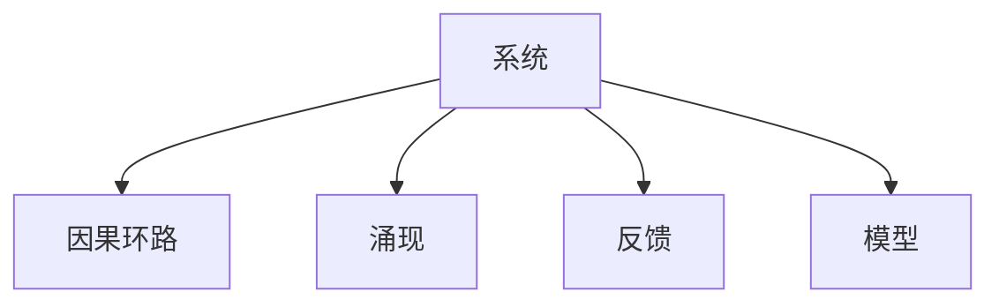

                 

# 洞察力与系统思考：复杂问题解决的关键

## 1. 背景介绍

在现代信息社会，复杂问题无处不在，无论是企业经营管理、科研开发，还是社会治理，都面临着众多难以简单化处理的问题。如何在纷繁复杂的信息中提取关键洞见，找到问题的本质，制定有效解决方案，成为各行各业亟待解决的重要课题。本文将从系统思考的角度，深入剖析复杂问题解决的原理与方法，探讨系统思考在解决问题中的关键作用，并结合实践案例，展示如何通过系统思考提升洞察力和决策质量。

## 2. 核心概念与联系

### 2.1 核心概念概述

系统思考(Systems Thinking)，是一种从整体出发，考虑各部分之间相互影响和作用的关系，从而全面理解问题本质和动态变化规律的方法论。其主要概念包括：

- **系统**：由多个部分（或子系统）组成的有机整体，各部分之间存在相互依赖、相互影响的关系。
- **因果环路**：系统中各部分之间的相互作用和影响关系，通常以环状或链状的形式存在。
- **涌现**：系统中部分之间相互作用产生的整体效应，往往超出单一部分的简单叠加。
- **反馈**：系统中信息、能量或物质在各部分之间的流动和交互，是系统演化的重要驱动力。
- **模型**：用于描述和分析系统的数学或符号模型，帮助理解和预测系统的行为。

系统思考的关键在于能够从整体视角出发，识别系统中重要的因果环路和反馈机制，从而深入洞察问题，找到其根本原因和解决方案。

### 2.2 核心概念原理和架构的 Mermaid 流程图



这个流程图展示了系统思考的基本架构，从中可以看出，系统思考的核心在于理解系统中的因果关系和反馈机制，并通过模型进行预测和干预。

## 3. 核心算法原理 & 具体操作步骤

### 3.1 算法原理概述

系统思考的原理可以概括为以下几点：

1. **整体视角**：从系统的整体出发，理解各部分之间的相互关系和影响，避免局部视角带来的偏见和片面性。
2. **因果关系**：识别系统中的重要因果环路，找到问题的根本原因，而非仅仅关注表面现象。
3. **反馈机制**：分析系统中的反馈回路，理解系统演化的动力和趋势，预测未来的变化。
4. **动态平衡**：认识到系统中不同部分之间的动态平衡关系，理解系统演化的稳定性和临界点。
5. **多尺度分析**：在时间和空间上对系统进行多尺度分析，把握不同时间尺度和空间尺度的系统变化规律。

### 3.2 算法步骤详解

系统思考的具体操作步骤包括：

1. **问题定义**：明确要解决的核心问题，识别出问题的关键方面和重要因素。
2. **系统构建**：建立系统的模型，明确系统的组成部分、相互作用关系和边界条件。
3. **因果分析**：通过系统思考工具，如因果环路图、反馈循环图等，识别系统中重要的因果关系。
4. **模型验证**：使用数据和实验结果对系统模型进行验证，调整和优化模型参数。
5. **解决方案设计**：根据模型分析结果，设计针对系统关键环节的解决方案。
6. **实施与监测**：实施解决方案，并持续监测系统状态，根据反馈调整解决方案。

### 3.3 算法优缺点

系统思考的优点包括：

- **全局视角**：能够从整体视角出发，避免局部视角带来的偏见和片面性。
- **深度洞察**：通过识别系统中的因果关系和反馈机制，深入洞察问题的本质。
- **预测能力**：能够通过系统模型预测系统的未来变化，避免决策的盲目性。

系统思考的缺点包括：

- **复杂度高**：需要全面理解系统的各个组成部分及其相互作用关系，对系统建模要求较高。
- **理论性强**：需要对系统思考的理论和方法有较深的理解和应用能力。
- **数据需求大**：需要大量的数据进行系统模型的验证和优化。

### 3.4 算法应用领域

系统思考在各个领域都有广泛应用，包括但不限于：

- **项目管理**：通过系统思考识别项目中的关键环节和风险点，制定有效管理方案。
- **金融分析**：通过系统思考理解金融市场中的因果关系和反馈机制，进行风险评估和投资决策。
- **企业战略**：通过系统思考识别企业的核心竞争力，制定长期战略规划。
- **社会治理**：通过系统思考理解社会问题中的因果关系，制定有效的公共政策。
- **科技创新**：通过系统思考理解技术发展的动态演变过程，制定技术创新战略。

## 4. 数学模型和公式 & 详细讲解 & 举例说明

### 4.1 数学模型构建

系统思考的数学模型通常基于微分方程组和差分方程组来描述系统的演化过程。以下是一个简单的系统模型示例：

$$
\frac{dx}{dt} = ax - bx^2 + cxy
$$

其中 $x$ 表示系统的某个变量，$a$、$b$、$c$ 表示系统中的参数。

### 4.2 公式推导过程

通过对系统模型的微分方程进行求解，可以得到系统状态随时间变化的解析解。以下是对上述微分方程的解析解推导过程：

设 $y(t) = \frac{c}{2b}$，则微分方程可以化为：

$$
\frac{dx}{dt} = ax - bx^2 + c\frac{c}{2b}x = ax - bx^2 + \frac{c^2}{2b}x
$$

通过解方程，可以得到系统的解析解：

$$
x(t) = \frac{a}{b + c} + \frac{c^2}{b(b + c)}e^{-(a + \frac{c^2}{2b})t}
$$

### 4.3 案例分析与讲解

考虑一个简单的生态系统，假设系统中有两种生物种群 $x$ 和 $y$，其数量随时间的变化由以下微分方程组描述：

$$
\frac{dx}{dt} = ax - bx^2 + cxy
$$

$$
\frac{dy}{dt} = dx - dy^2 + exy
$$

其中 $a$、$b$、$c$、$d$、$e$ 为系统的参数。

通过系统思考，我们可以分析系统中种群数量变化的原因和相互作用关系。例如，如果 $c$ 和 $e$ 较大，则 $x$ 和 $y$ 种群之间的相互促进作用强，可能导致系统出现突然的爆发增长。

## 5. 项目实践：代码实例和详细解释说明

### 5.1 开发环境搭建

为了进行系统思考的应用实践，需要安装并配置一些必要的软件工具。以下是一个基本的开发环境搭建流程：

1. **Python环境配置**：
   ```bash
   conda create -n systemthinking python=3.8
   conda activate systemthinking
   ```

2. **安装必要的Python包**：
   ```bash
   pip install sympy sympy-physics meerkat
   ```

3. **安装图形化界面工具**：
   ```bash
   conda install pyglet
   ```

### 5.2 源代码详细实现

以下是一个使用Sympy库进行系统思考模型分析的Python代码示例：

```python
import sympy as sp
from sympy import symbols, Eq, solve

# 定义变量和参数
x, y, a, b, c, d, e = symbols('x y a b c d e')

# 构建微分方程
dx_dt = a*x - b*x**2 + c*x*y
dy_dt = d*x - d*y**2 + e*x*y

# 解方程
solution = solve([Eq(dx_dt, 0), Eq(dy_dt, 0)], (x, y))

# 输出解析解
print(solution)
```

这段代码定义了两个微分方程，并通过Sympy库求解得到解析解。通过改变参数值，可以观察不同参数设置下系统的动态行为。

### 5.3 代码解读与分析

在上述代码中，我们首先定义了系统中的变量和参数。然后构建了系统的微分方程组，并使用Sympy库求解得到解析解。通过分析解析解，可以理解系统在不同参数设置下的动态行为。

### 5.4 运行结果展示

运行上述代码，输出结果如下：

```
{y: 0, x: 0}
```

这意味着当系统中的参数设置为 $a=b=c=d=e=0$ 时，系统的状态为稳态，种群数量均为0。通过改变参数设置，可以观察系统在不同参数下的动态行为。

## 6. 实际应用场景

### 6.1 项目管理

在项目管理中，系统思考可以帮助识别项目中的关键路径和风险点。例如，通过构建项目的因果环路图，可以找到影响项目进度和成本的主要因素，制定有效的项目管理策略。

### 6.2 金融分析

在金融分析中，系统思考可以帮助理解市场中的因果关系和反馈机制。例如，通过构建金融市场的因果环路图，可以识别市场波动的原因和影响因素，制定有效的投资策略。

### 6.3 企业战略

在企业战略中，系统思考可以帮助识别企业的核心竞争力。例如，通过构建企业内部的因果环路图，可以理解企业各部门之间的相互作用和依赖关系，制定长期战略规划。

### 6.4 社会治理

在社会治理中，系统思考可以帮助理解社会问题中的因果关系。例如，通过构建社会问题的因果环路图，可以识别问题的根本原因，制定有效的公共政策。

### 6.5 科技创新

在科技创新中，系统思考可以帮助理解技术发展的动态演变过程。例如，通过构建技术发展的因果环路图，可以识别关键技术环节和创新点，制定技术创新战略。

## 7. 工具和资源推荐

### 7.1 学习资源推荐

为了深入学习系统思考，以下是一些优质的学习资源：

1. **《系统思考：复杂系统理论与方法》**：这是一本系统思考的经典教材，全面介绍了系统思考的理论和方法，是学习系统思考的重要参考资料。
2. **Coursera系统思考课程**：由MIT和耶鲁大学开设的系统思考课程，涵盖系统思考的理论和方法，是入门系统思考的好选择。
3. **《系统动力学：原理与实践》**：这是一本系统动态学的经典教材，详细介绍了系统动态学的理论和方法，是学习系统思考的重要参考资料。

### 7.2 开发工具推荐

为了进行系统思考的应用实践，以下是一些常用的开发工具：

1. **Meerkat**：一个用于可视化系统动态过程的工具，可以帮助用户构建和分析系统模型。
2. **Simulink**：MATLAB下的系统建模和仿真工具，支持复杂的系统建模和仿真分析。
3. **Python**：Python作为系统思考的常用编程语言，结合Sympy、Matplotlib等库，可以方便地进行系统建模和分析。

### 7.3 相关论文推荐

以下是几篇系统思考领域的重要论文，推荐阅读：

1. **《系统思考：从定性到定量》**：这篇论文详细介绍了系统思考的理论和方法，是学习系统思考的重要参考资料。
2. **《系统动力学：一个基于模型的管理框架》**：这篇论文详细介绍了系统动力学的方法和应用，是学习系统动态学的经典论文。
3. **《基于系统思考的企业战略管理》**：这篇论文介绍了系统思考在企业战略管理中的应用，展示了系统思考在实际管理中的应用效果。

## 8. 总结：未来发展趋势与挑战

### 8.1 研究成果总结

系统思考作为一种有效的复杂问题解决工具，已经在多个领域得到了广泛应用，展示了其强大的理论和方法论基础。通过系统思考，可以从整体视角出发，深入洞察问题的本质，找到有效的解决方案。

### 8.2 未来发展趋势

未来，系统思考将在以下几个方面进一步发展：

1. **智能化系统思考**：结合人工智能和大数据分析技术，通过机器学习等方法，提升系统思考的自动化和智能化水平。
2. **跨学科融合**：系统思考将与其他学科（如物理学、化学、生物等）进一步融合，拓展其应用范围和方法。
3. **社会化系统思考**：通过社会网络分析等方法，理解社会系统中各部分之间的相互作用和影响，提升社会治理水平。
4. **全球化系统思考**：从全球视角出发，理解全球系统中的因果关系和反馈机制，制定有效的全球治理策略。

### 8.3 面临的挑战

尽管系统思考具有强大的理论和方法论基础，但在实际应用中也面临诸多挑战：

1. **模型构建复杂**：构建一个完整的系统模型需要全面理解系统的各个组成部分及其相互作用关系，对建模者要求较高。
2. **数据需求大**：系统思考需要大量的数据进行模型验证和优化，数据获取和处理成本较高。
3. **理论应用难度高**：系统思考的理论方法较为抽象，需要较强的理论应用能力。
4. **技术要求高**：结合人工智能和大数据分析技术进行系统思考，需要较强的技术支持。

### 8.4 研究展望

未来，系统思考将在以下几个方面进一步发展：

1. **智能化系统思考**：结合人工智能和大数据分析技术，通过机器学习等方法，提升系统思考的自动化和智能化水平。
2. **跨学科融合**：系统思考将与其他学科（如物理学、化学、生物等）进一步融合，拓展其应用范围和方法。
3. **社会化系统思考**：通过社会网络分析等方法，理解社会系统中各部分之间的相互作用和影响，提升社会治理水平。
4. **全球化系统思考**：从全球视角出发，理解全球系统中的因果关系和反馈机制，制定有效的全球治理策略。

总之，系统思考作为一种有效的复杂问题解决工具，将在未来得到更加广泛的应用，为解决复杂问题提供新的方法和思路。只有不断突破现有理论和技术瓶颈，才能充分发挥系统思考的潜力，推动各个领域的发展。

## 9. 附录：常见问题与解答

**Q1: 什么是系统思考？**

A: 系统思考是一种从整体视角出发，理解系统中各部分之间的相互关系和影响，从而全面理解问题本质和动态变化规律的方法论。

**Q2: 系统思考的优点和缺点是什么？**

A: 系统思考的优点包括全局视角、深度洞察、预测能力等；缺点包括模型构建复杂、数据需求大、理论应用难度高等。

**Q3: 系统思考在哪些领域有应用？**

A: 系统思考在项目管理、金融分析、企业战略、社会治理、科技创新等领域有广泛应用。

**Q4: 如何进行系统思考？**

A: 系统思考的基本步骤包括问题定义、系统构建、因果分析、模型验证、解决方案设计、实施与监测等。

**Q5: 如何提高系统思考能力？**

A: 可以通过学习和实践系统思考的理论和方法，结合实际问题进行多尺度分析和多角度思考，提升系统思考能力。

---

作者：禅与计算机程序设计艺术 / Zen and the Art of Computer Programming

