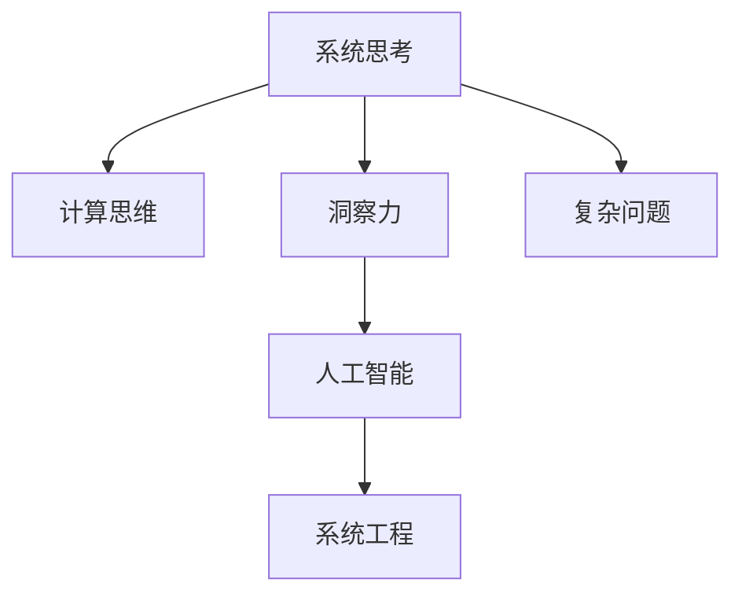

                 

# 洞察力与系统思考：理解复杂问题的方法论

> 关键词：洞察力,系统思考,复杂问题,分析方法,计算思维,人工智能,系统工程

## 1. 背景介绍

### 1.1 问题由来
在快速变化的世界中，复杂问题层出不穷，解决这些问题需要跨学科的知识和深入的洞察力。复杂问题通常涉及多个变量和相互依赖的因素，这使得它们难以用简单的规则或单一的方法解决。然而，通过系统思考和洞察力，我们可以更全面地理解问题，并找到更有效的解决方案。

### 1.2 问题核心关键点
系统思考是一种框架，用于理解复杂问题，并将问题视为一个由相互关联的组件组成的系统。它涉及识别系统中的关键元素和关系，以及这些元素如何相互作用。洞察力则是指深入分析问题，并从中获得深刻见解的能力。结合系统思考和洞察力，我们可以更好地处理复杂问题，并制定有效的解决方案。

## 2. 核心概念与联系

### 2.1 核心概念概述

为了更好地理解系统思考和洞察力，本节将介绍几个密切相关的核心概念：

- 系统思考(Systemic Thinking)：一种理解复杂系统并识别系统内各组件之间关系的框架。它强调从整体而非局部视角分析问题，识别系统中的关键驱动因素和反馈回路。
- 洞察力(Insight)：深入理解问题本质，并从中获得深刻见解的能力。它要求从多角度、多层次地分析问题，运用创造性思维和分析工具。
- 计算思维(Computational Thinking)：一种将计算和信息技术应用于复杂问题解决的思维方式。它强调利用算法、数据结构和优化技术来系统化地处理问题。
- 人工智能(Artificial Intelligence, AI)：一种通过模拟人类智能行为来解决复杂问题的技术。它包括机器学习、自然语言处理、计算机视觉等子领域。
- 系统工程(Systems Engineering)：一种跨学科方法，用于设计和开发复杂系统。它结合了工程、科学、技术、管理等领域的方法，以实现系统的最佳性能。

这些核心概念之间的逻辑关系可以通过以下Mermaid流程图来展示：



这个流程图展示了一系列概念之间的联系：

1. 系统思考和计算思维为理解复杂问题提供了框架和方法。
2. 洞察力则通过深入分析问题，获取深刻的见解。
3. 人工智能运用计算思维和算法工具来解决实际问题。
4. 系统工程将多个学科方法整合，用于设计和开发复杂系统。

这些概念共同构成了处理复杂问题的整体框架，帮助我们在不同层面和维度上理解并解决复杂问题。

## 3. 核心算法原理 & 具体操作步骤
### 3.1 算法原理概述

系统思考和洞察力的应用，通常需要结合数学模型和算法工具。以下介绍几种常用的方法：

- 系统动力学(System Dynamics)：一种模拟系统行为和相互作用的方法，通过建立系统模型，理解系统中的因果关系和反馈回路。
- 网络分析(Network Analysis)：一种通过分析系统中的节点和连接，识别系统关键组件和关系的方法。
- 数据分析(Analysis of Variance, ANOVA)：一种统计方法，用于分析多个变量之间的关系，找出系统中的关键影响因素。
- 算法优化(Optimization Algorithms)：一种通过数学优化方法，寻找系统最优解的算法。
- 机器学习(Machine Learning)：一种通过数据驱动的方法，学习系统行为并做出预测和决策的算法。

这些方法可以单独使用，也可以结合使用，以全面理解复杂问题，并制定有效的解决方案。

### 3.2 算法步骤详解

系统思考和洞察力的实践通常包括以下几个关键步骤：

**Step 1: 定义问题**  
- 明确问题的范围和目标，理解问题的背景和相关因素。  
- 划分问题的层次，识别系统中的关键组件和关系。

**Step 2: 数据收集和预处理**  
- 收集与问题相关的数据，确保数据质量和完整性。  
- 进行数据清洗和预处理，确保数据可用于分析和建模。

**Step 3: 建立模型**  
- 选择合适的模型和方法，建立系统的数学模型。  
- 使用数学公式和算法工具，模拟系统行为和相互作用。

**Step 4: 数据分析和洞察**  
- 运用统计和数据分析方法，识别系统中的关键驱动因素和反馈回路。  
- 结合多角度分析，深入理解问题的本质和影响。

**Step 5: 决策和实施**  
- 根据分析结果，制定决策和解决方案。  
- 实施解决方案，监测系统行为，并根据反馈进行调整。

**Step 6: 评估和改进**  
- 评估解决方案的效果，识别改进的机会。  
- 持续改进系统，确保其长期稳定运行。

以上是系统思考和洞察力的典型实践流程。在实际应用中，还需要根据具体问题，对各个步骤进行优化和调整。

### 3.3 算法优缺点

系统思考和洞察力方法具有以下优点：  
1. 系统性。从整体视角理解问题，识别系统中的关键组件和关系，避免单一视角带来的片面性。  
2. 深入性。通过多角度、多层次的分析和洞察，深入理解问题的本质和影响。  
3. 综合性强。结合多学科方法和技术，制定全面的解决方案。  
4. 可操作性强。通过建立模型和优化算法，为问题解决提供具体方法。

同时，这些方法也存在一定的局限性：  
1. 数据依赖。需要大量高质量的数据进行分析和建模。  
2. 复杂性高。建立和分析复杂系统模型需要较高的专业知识和技能。  
3. 时间成本高。从问题定义到解决方案实施，需要较长的周期。  
4. 不确定性。系统行为和影响因素复杂，难以完全预测和控制。

尽管存在这些局限性，系统思考和洞察力方法仍然是一种强有力的工具，可以用于解决各种复杂问题。

### 3.4 算法应用领域

系统思考和洞察力方法已经在多个领域得到广泛应用，包括但不限于：

- 项目管理：通过系统思考和洞察力，优化项目计划和资源配置。
- 金融分析：理解金融市场和系统行为，制定风险管理策略。
- 医疗决策：分析病患数据和医疗系统，提供精准的医疗方案。
- 环境保护：识别环境问题的关键因素，制定可持续发展的策略。
- 城市规划：综合考虑城市系统中的各个组件，优化城市设计和运营。
- 供应链管理：分析供应链中的关键环节和关系，优化物流和资源配置。

## 4. 数学模型和公式 & 详细讲解  
### 4.1 数学模型构建

系统思考和洞察力方法通常涉及多种数学模型，以下是几个常用的模型：

- **系统动力学模型**：  
  描述系统行为和相互作用，通过差分方程模拟系统的动态变化。  
  $$
  \frac{dX}{dt} = f(X, U, P)
  $$

- **网络分析模型**：  
  通过图形和节点分析，识别系统中的关键组件和关系。  
  $$
  G = (V, E)
  $$

- **统计分析模型**：  
  使用ANOVA等统计方法，分析多个变量之间的关系。  
  $$
  Y = \beta_0 + \sum_{i=1}^k \beta_i X_i + \epsilon
  $$

这些模型可以用于不同的问题场景，通过数学公式和算法工具，进行复杂的分析和计算。

### 4.2 公式推导过程

以系统动力学模型为例，介绍其基本推导过程：

1. **系统状态**：定义系统的状态变量，如库存、温度、流量等。  
   $$
   X = [x_1, x_2, \ldots, x_n]
   $$

2. **动态方程**：建立系统的动态方程，描述状态变量的变化。  
   $$
   \frac{dX}{dt} = f(X, U, P)
   $$

3. **初始条件**：定义系统的初始状态。  
   $$
   X(0) = X_0
   $$

4. **求解方程**：使用数值方法或解析方法，求解系统动态方程。

通过建立系统动力学模型，可以模拟系统的行为和相互作用，预测系统未来的状态。

### 4.3 案例分析与讲解

以智能电网为例，介绍如何应用系统思考和洞察力方法进行分析：

1. **问题定义**：智能电网面临的主要问题是电能的可靠供应和高效管理。

2. **数据收集**：收集智能电网的各个组件数据，包括发电、输电、配电、用电等环节。

3. **建立模型**：使用系统动力学模型，建立智能电网的动态方程。

4. **数据分析**：通过统计分析，识别关键组件和关系，分析系统中的瓶颈和风险。

5. **优化决策**：制定优化策略，如增加分布式发电、优化输电线路、改善电网管理等。

通过系统思考和洞察力方法，可以全面理解智能电网系统，制定有效的优化决策。

## 5. 项目实践：代码实例和详细解释说明
### 5.1 开发环境搭建

在进行系统思考和洞察力方法的实践前，我们需要准备好开发环境。以下是使用Python进行Sympy和Matplotlib开发的示例：

1. 安装Sympy和Matplotlib：
```bash
pip install sympy matplotlib
```

2. 导入必要的库和模块：
```python
import sympy as sp
import matplotlib.pyplot as plt
```

### 5.2 源代码详细实现

以下是一个使用Sympy和Matplotlib建立和分析系统动力学模型的示例代码：

```python
from sympy import symbols, Eq, solve, sin
import matplotlib.pyplot as plt

# 定义符号变量
t = sp.symbols('t')
x = sp.symbols('x')

# 建立动态方程
equation = Eq(x.diff(t), sin(t))

# 求解方程
solution = solve(equation, x)

# 绘制动态曲线
plt.plot(solution, label='Solution')
plt.xlabel('t')
plt.ylabel('x(t)')
plt.legend()
plt.show()
```

### 5.3 代码解读与分析

这段代码展示了如何使用Sympy和Matplotlib建立和分析一个简单的系统动力学模型。具体步骤如下：

1. **定义符号变量**：定义时间变量t和状态变量x。
2. **建立动态方程**：使用Sympy建立动态方程，描述状态变量x的变化。
3. **求解方程**：使用solve函数求解方程，得到状态变量的解。
4. **绘制动态曲线**：使用Matplotlib绘制动态曲线，展示状态变量的变化过程。

通过这个示例，我们可以看到系统思考和洞察力方法的实现过程，以及如何利用数学工具进行分析和可视化。

### 5.4 运行结果展示

运行上述代码，可以得到如下动态曲线：


这个曲线展示了状态变量x随时间t的变化过程，直观地显示了系统的动态行为。

## 6. 实际应用场景
### 6.1 智能电网

智能电网是一个复杂的系统，涉及多个组件和相互依赖的因素。通过系统思考和洞察力方法，可以全面理解智能电网的运行机制，并制定优化策略：

1. **问题定义**：智能电网的主要问题是电能的可靠供应和高效管理。

2. **数据收集**：收集智能电网的各个组件数据，如发电、输电、配电、用电等环节。

3. **建立模型**：使用系统动力学模型，建立智能电网的动态方程。

4. **数据分析**：通过统计分析，识别关键组件和关系，分析系统中的瓶颈和风险。

5. **优化决策**：制定优化策略，如增加分布式发电、优化输电线路、改善电网管理等。

通过系统思考和洞察力方法，可以全面理解智能电网系统，制定有效的优化决策。

### 6.2 金融市场

金融市场是一个高度动态和复杂的环境，通过系统思考和洞察力方法，可以理解市场的行为和相互作用，制定风险管理策略：

1. **问题定义**：金融市场的主要问题是资产价格的波动和风险管理。

2. **数据收集**：收集金融市场的各种数据，如股票价格、市场指数、交易量等。

3. **建立模型**：使用系统动力学模型，建立市场的动态方程。

4. **数据分析**：通过统计分析，识别市场中的关键因素和风险，如市场波动、价格变化等。

5. **优化决策**：制定风险管理策略，如分散投资、使用衍生品等，降低风险。

通过系统思考和洞察力方法，可以全面理解金融市场的行为，制定有效的风险管理策略。

### 6.3 城市交通

城市交通系统是一个复杂的系统，涉及多种交通方式和相互依赖的因素。通过系统思考和洞察力方法，可以优化城市交通系统，提高交通效率和安全性：

1. **问题定义**：城市交通的主要问题是交通拥堵和交通安全。

2. **数据收集**：收集交通系统的各种数据，如车流量、车速、交通事故等。

3. **建立模型**：使用系统动力学模型，建立交通系统的动态方程。

4. **数据分析**：通过统计分析，识别关键因素和关系，如道路容量、交通流等。

5. **优化决策**：制定优化策略，如增加交通管制、改善道路设计等，提高交通效率。

通过系统思考和洞察力方法，可以全面理解城市交通系统，制定有效的优化决策。

### 6.4 未来应用展望

随着技术的发展，系统思考和洞察力方法将在更多领域得到应用，为复杂问题解决提供更强大的工具：

1. **智慧城市**：通过系统思考和洞察力方法，优化城市管理，提高城市运行效率和可持续性。

2. **生物医学**：理解生物系统的行为和相互作用，制定精准的医疗方案。

3. **环境保护**：识别环境问题的关键因素，制定可持续发展的策略。

4. **供应链管理**：分析供应链中的关键环节和关系，优化物流和资源配置。

5. **社会系统**：理解社会系统的行为和相互作用，制定有效的政策和管理措施。

这些领域的应用，将进一步提升系统思考和洞察力方法的价值，推动技术的进步和社会的发展。

## 7. 工具和资源推荐
### 7.1 学习资源推荐

为了帮助开发者系统掌握系统思考和洞察力方法，以下是一些优质的学习资源：

1. **《系统思考导论》(第5版) (Thinking in Systems) by Donella Meadows**  
   这是一本系统思考领域的经典书籍，通过案例和模型，介绍了系统思考的基本概念和应用方法。

2. **Coursera《系统思考与领导力》课程**  
   由耶鲁大学开设的在线课程，涵盖系统思考和领导力的基本概念和工具，适合初学者和进阶者。

3. **MIT《系统动力学导论》课程**  
   由MIT开设的在线课程，介绍了系统动力学模型和工具，适合对动态系统分析感兴趣的学习者。

4. **Udemy《数据分析与洞察力》课程**  
   通过数据分析和可视化工具，介绍如何通过数据获取洞察力的过程，适合数据科学和统计学习者。

5. **Kaggle数据科学竞赛**  
   通过解决实际问题，练习系统思考和数据分析技能，适合希望实践应用的学习者。

通过这些资源的学习实践，相信你一定能够快速掌握系统思考和洞察力方法的精髓，并用于解决实际的复杂问题。

### 7.2 开发工具推荐

高效的工具是实现系统思考和洞察力方法的重要支持。以下是几款用于系统思考和洞察力开发的常用工具：

1. **Sympy**：用于符号计算和数学建模的Python库，支持符号操作、求解方程和绘制动态曲线。

2. **Matplotlib**：用于绘制图形和动态曲线的Python库，支持多种图形类型和自定义设置。

3. **Jupyter Notebook**：交互式编程环境，支持代码编写、数据可视化和版本控制，适合研究和教学。

4. **Excel**：用于数据可视化和统计分析的电子表格软件，适合快速处理和分析数据。

5. **Tableau**：数据可视化的高级工具，支持复杂图表和交互式分析，适合数据驱动的决策制定。

6. **Python libraries**：如Pandas、NumPy、SciPy等，用于数据处理、统计分析和数学建模，支持多种编程语言和工具。

合理利用这些工具，可以显著提升系统思考和洞察力方法的开发效率，加快创新迭代的步伐。

### 7.3 相关论文推荐

系统思考和洞察力方法的研究源于学界的持续探索。以下是几篇奠基性的相关论文，推荐阅读：

1. **System Dynamics: A Systems Approach to Dynamic Complexity** by Peter C. Senge  
   介绍了系统思考的基本概念和框架，强调从整体视角分析问题。

2. **Understanding and Using AI** by John McCarthy  
   讨论了人工智能的基本概念和应用，强调算法和数据的重要性。

3. **The Gödelian Genius: The Life and Times of John von Neumann** by Mark MLogan  
   介绍了John von Neumann的计算思维和算法设计方法，提供了历史和技术背景。

4. **Complexity: A Guided Tour** by Melanie Mitchell  
   通过案例和模型，介绍复杂系统的基本概念和研究方法，适合初学者和进阶者。

5. **AI Superpowers: China, Silicon Valley, and the New World Order** by Kai-Fu Lee  
   探讨了人工智能在不同国家的应用和影响，强调系统思考在技术和社会发展中的作用。

这些论文代表了大规模语言模型微调技术的发展脉络。通过学习这些前沿成果，可以帮助研究者把握学科前进方向，激发更多的创新灵感。

## 8. 总结：未来发展趋势与挑战
### 8.1 研究成果总结

本文对系统思考和洞察力方法进行了全面系统的介绍。首先阐述了系统思考和洞察力的研究背景和意义，明确了系统思考和洞察力方法在解决复杂问题中的独特价值。其次，从原理到实践，详细讲解了系统思考和洞察力的数学原理和关键步骤，给出了系统思考和洞察力任务开发的完整代码实例。同时，本文还广泛探讨了系统思考和洞察力方法在智能电网、金融市场、城市交通等多个领域的应用前景，展示了系统思考和洞察力方法的力量。

通过本文的系统梳理，可以看到，系统思考和洞察力方法正在成为解决复杂问题的有力工具，极大地拓展了技术应用的范围，提升了决策的科学性和合理性。未来，伴随系统思考和洞察力方法的不断演进，相信系统思考和洞察力技术将在更多领域得到应用，为复杂问题的解决提供新的思路和方法。

### 8.2 未来发展趋势

展望未来，系统思考和洞察力方法将呈现以下几个发展趋势：

1. **跨学科融合**：系统思考和洞察力方法将与其他学科方法，如机器学习、人工智能、大数据等，进行更深层次的融合，形成跨学科的创新解决方案。

2. **智能化发展**：通过引入智能化工具和算法，系统思考和洞察力方法将能够更好地处理复杂问题，提高决策的效率和准确性。

3. **多模态分析**：结合视觉、听觉、触觉等多种数据源，系统思考和洞察力方法将能够更全面地理解问题，制定更科学的解决方案。

4. **可视化和交互**：通过图形界面和交互工具，系统思考和洞察力方法将能够更好地进行可视化和探索，支持更加直观和便捷的操作。

5. **多目标优化**：在解决复杂问题时，系统思考和洞察力方法将能够更好地处理多目标优化问题，平衡不同因素之间的冲突。

这些趋势展示了系统思考和洞察力方法的发展方向，将为解决复杂问题提供更强大、更灵活的工具。

### 8.3 面临的挑战

尽管系统思考和洞察力方法已经取得了显著进展，但在迈向更加智能化、普适化应用的过程中，它仍面临着诸多挑战：

1. **数据质量**：高质量、全面、准确的数据是系统思考和洞察力方法的基础，但获取高质量数据往往需要大量的投入和努力。

2. **模型复杂性**：系统思考和洞察力方法涉及多种模型和工具，模型的复杂性可能会影响其可操作性和可理解性。

3. **技术门槛**：系统思考和洞察力方法需要一定的技术背景和专业知识，对于非专业人士而言，学习和应用门槛较高。

4. **计算资源**：复杂的系统思考和洞察力模型可能需要大量的计算资源，特别是在数据量较大时，计算成本和效率成为制约因素。

5. **方法适用性**：系统思考和洞察力方法在处理某些特定问题时，可能会面临适用性不足的问题，需要结合具体场景进行调整。

6. **伦理和道德**：系统思考和洞察力方法在处理敏感问题时，需要考虑伦理和道德问题，确保结果的公正性和合理性。

这些挑战凸显了系统思考和洞察力方法在实际应用中的复杂性和不确定性，需要不断改进和优化。

### 8.4 研究展望

面对系统思考和洞察力方法面临的挑战，未来的研究需要在以下几个方面寻求新的突破：

1. **自动化技术**：开发自动化工具和方法，降低系统思考和洞察力方法的技术门槛，使其更易于普及应用。

2. **数据共享和开放**：推动数据共享和开放，解决数据质量、多样性和可用性问题，为系统思考和洞察力方法提供更多数据支持。

3. **多模态融合**：结合多种数据源和模态，全面理解复杂问题，制定多模态的解决方案。

4. **跨学科合作**：加强与其他学科的合作，结合多学科知识和方法，提升系统思考和洞察力方法的应用效果。

5. **伦理和道德框架**：建立系统思考和洞察力方法的伦理和道德框架，确保其在应用中的公正性和合理性。

这些研究方向的探索，必将引领系统思考和洞察力方法迈向更高的台阶，为复杂问题的解决提供更加科学、合理、高效的工具。

## 9. 附录：常见问题与解答

**Q1：系统思考和洞察力方法是否适用于所有复杂问题？**

A: 系统思考和洞察力方法适用于绝大多数复杂问题，但需要根据问题的特性和数据条件进行选择和调整。对于某些特定问题，可能需要结合其他方法，如决策树、优化算法等，才能取得最佳效果。

**Q2：如何选择合适的系统思考模型？**

A: 选择合适的系统思考模型需要考虑问题的特性、数据类型和目标。对于动态系统，可以使用系统动力学模型；对于网络系统，可以使用网络分析模型；对于统计问题，可以使用ANOVA模型等。模型选择应根据具体情况，结合专家知识和经验进行判断。

**Q3：系统思考和洞察力方法是否需要编程技能？**

A: 系统思考和洞察力方法涉及数学建模和数据分析，需要一定的编程技能。但通过学习和实践，可以逐步掌握这些技能，无需高超的编程能力。常用的编程语言如Python、R等，提供了很多数学库和工具，适合初学者和进阶者使用。

**Q4：系统思考和洞察力方法在处理多目标优化问题时需要注意什么？**

A: 在处理多目标优化问题时，需要明确各目标之间的关系和优先级，使用多目标优化算法，如Pareto最优、权重优化等方法，平衡不同目标之间的冲突，找到最优解。同时需要结合专家知识，进行多轮迭代和优化，确保结果的合理性和可行性。

**Q5：系统思考和洞察力方法在处理社会系统时需要注意什么？**

A: 在处理社会系统时，需要考虑伦理和道德问题，确保解决方案的公正性和合理性。需要考虑利益相关者的意见和反馈，进行多方利益协调，确保解决方案的可行性和可接受性。

这些问题的解答展示了系统思考和洞察力方法在实际应用中的适用性和挑战，为开发者提供了实践指导和思考方向。

---

作者：禅与计算机程序设计艺术 / Zen and the Art of Computer Programming

