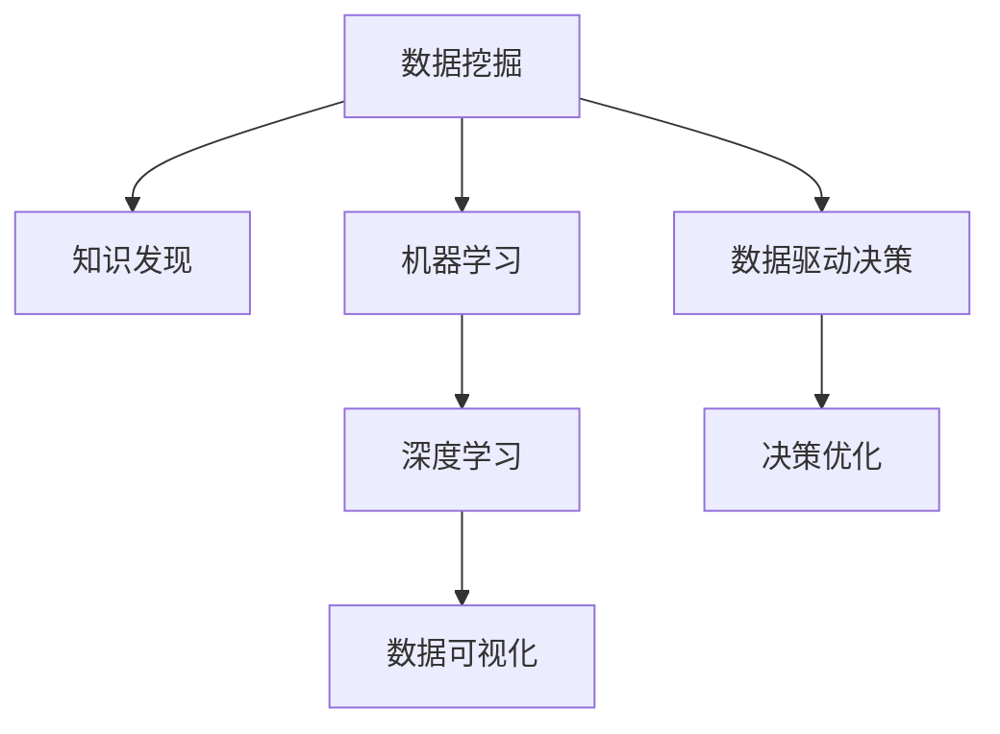

                 

# 洞察力的培养：知识发现引擎的重要意义

> 关键词：知识发现引擎, 数据挖掘, 机器学习, 深度学习, 数据可视化, 数据驱动决策

## 1. 背景介绍

### 1.1 问题由来
在现代社会，数据以指数级速度增长。企业和组织需要从海量数据中提取有价值的信息，以支持业务决策和创新。然而，面对复杂的非结构化数据，如何高效、准确地发现知识，成为一大难题。

为此，知识发现引擎(Knowledge Discovery Engine, KDE)应运而生。KDE通过先进的数据挖掘、机器学习、深度学习技术，帮助企业发现数据中的规律和洞见，辅助决策制定。KDE的核心能力在于从复杂数据中挖掘出有意义的模式和结构，为业务决策提供数据支撑。

### 1.2 问题核心关键点
KDE的关键点包括：
- 数据来源：包括结构化数据、非结构化数据、传感器数据等多种类型。
- 数据挖掘算法：包括分类、聚类、关联规则、异常检测等方法。
- 数据存储和处理：包括大数据平台、分布式存储、流式处理等技术。
- 机器学习模型：包括决策树、随机森林、神经网络等算法。
- 数据可视化：包括图表、热力图、时序图等多种形式。
- 结果解释和应用：将发现的知识转化为行动策略，支持决策制定。

### 1.3 问题研究意义
研究KDE技术，对于拓展数据驱动决策、提升企业竞争力和创新能力具有重要意义：

1. 提升决策科学性：通过数据分析揭示业务规律，使决策过程更科学、更有依据。
2. 优化运营效率：发现运营中的瓶颈和机会，提升资源配置和流程优化。
3. 加速创新速度：挖掘潜在市场和业务机会，驱动新产品、新技术的开发。
4. 降低风险：通过数据分析识别潜在风险，提前做好应对策略。
5. 提高客户满意度：通过个性化推荐和市场洞察，提升客户体验和忠诚度。

## 2. 核心概念与联系

### 2.1 核心概念概述

为更好地理解KDE的工作原理和优化方向，本节将介绍几个密切相关的核心概念：

- 数据挖掘(Data Mining)：从大量数据中发现有用的信息、知识和规律。
- 知识发现(Knowledge Discovery)：通过数据挖掘技术，揭示数据背后的知识。
- 机器学习(Machine Learning)：利用数据训练模型，实现预测、分类等任务。
- 深度学习(Deep Learning)：通过神经网络模型，对复杂数据进行深度分析和建模。
- 数据可视化(Data Visualization)：通过图形、图表等形式展示数据洞察。
- 数据驱动决策(Data-Driven Decision Making)：基于数据洞察，辅助决策制定。

这些核心概念之间的逻辑关系可以通过以下Mermaid流程图来展示：



这个流程图展示了一些核心概念及其之间的关系：

1. 数据挖掘是KDE的基础。
2. 知识发现依赖数据挖掘，揭示数据中的有用信息。
3. 机器学习是KDE的技术手段，帮助模型实现预测、分类等任务。
4. 深度学习是机器学习中的高级形式，用于处理更复杂的数据。
5. 数据可视化是KDE的结果呈现形式，帮助理解发现的知识。
6. 数据驱动决策是将发现的知识应用于业务决策的过程。

这些概念共同构成了KDE的完整框架，使其能够高效地从数据中发现知识，辅助决策制定。

## 3. 核心算法原理 & 具体操作步骤
### 3.1 算法原理概述

KDE的核心算法包括数据挖掘、机器学习、深度学习等，以发现数据中的知识。其核心思想是：

1. **数据预处理**：对原始数据进行清洗、规整、标准化等预处理操作，确保数据质量。
2. **特征提取**：从原始数据中提取有意义的特征，提高模型预测精度。
3. **模型训练**：利用训练数据训练机器学习模型，并进行参数调优。
4. **模型评估**：通过验证集或测试集评估模型性能，选择合适的超参数。
5. **知识发现**：使用数据挖掘算法揭示数据中的知识模式。
6. **知识应用**：将发现的知识转化为业务决策或行动策略。

具体来说，KDE的流程可以概括为以下几步：

1. 数据预处理：包括缺失值处理、异常值检测、数据归一化等。
2. 特征工程：选择、构造、提取有意义的特征，如统计特征、文本特征、时序特征等。
3. 模型训练：选择适当的机器学习或深度学习模型，如决策树、随机森林、卷积神经网络、循环神经网络等。
4. 模型评估：使用交叉验证、ROC曲线、混淆矩阵等方法评估模型性能。
5. 知识发现：通过聚类、分类、关联规则等方法揭示数据中的模式和规律。
6. 数据可视化：将发现的知识可视化展示，辅助业务理解。
7. 应用决策：将发现的知识应用于业务决策，优化流程、提升效率。

### 3.2 算法步骤详解

以下是KDE的主要操作步骤：

**Step 1: 数据准备**
- 收集数据源，包括结构化数据、非结构化数据、传感器数据等。
- 对数据进行清洗和预处理，去除噪音和异常值。

**Step 2: 特征提取**
- 根据任务需求，选择合适的特征工程方法，如文本分词、统计特征提取、时序特征提取等。
- 构造新的特征，如TF-IDF、词嵌入、PCA降维等。

**Step 3: 模型选择和训练**
- 选择适合的机器学习或深度学习模型，如随机森林、神经网络、卷积神经网络等。
- 设置模型参数，如学习率、正则化系数、隐藏层数等。
- 在训练集上训练模型，进行交叉验证，选择最优模型。

**Step 4: 模型评估**
- 使用验证集或测试集评估模型性能，计算准确率、召回率、F1值等指标。
- 进行模型调优，如调整超参数、优化损失函数等。

**Step 5: 知识发现**
- 使用数据挖掘算法，如聚类、分类、关联规则等方法，发现数据中的模式和规律。
- 进行异常检测，识别异常数据或事件。

**Step 6: 数据可视化**
- 使用图表、热力图、时序图等形式展示发现的知识。
- 通过可视化工具，如Tableau、Power BI等，展示结果。

**Step 7: 决策应用**
- 将发现的知识转化为业务决策，优化流程、提升效率。
- 制定行动计划，实施优化措施，监控效果。

### 3.3 算法优缺点

KDE技术具有以下优点：
1. 数据驱动：以数据为中心，发现潜在知识和规律，辅助决策制定。
2. 多模态支持：支持结构化数据、非结构化数据、传感器数据等多种类型。
3. 技术灵活：可以使用多种数据挖掘、机器学习和深度学习算法，灵活应对不同场景。
4. 易于集成：可以集成到现有系统中，辅助业务决策和运营优化。
5. 结果可视化：通过图表展示知识发现结果，易于理解和应用。

同时，KDE技术也存在一些局限性：
1. 数据质量要求高：数据清洗、特征工程等预处理工作量较大。
2. 算法选择复杂：选择合适的算法和超参数配置对技术要求较高。
3. 结果解释性不足：复杂的模型和算法有时难以解释其内部决策过程。
4. 过度拟合风险：过度关注细节可能忽略整体趋势，造成过度拟合。
5. 计算资源消耗大：数据挖掘和深度学习模型通常需要大量的计算资源。

尽管存在这些局限性，KDE技术仍是大数据时代不可或缺的重要工具，广泛应用于各行业的数据驱动决策。

### 3.4 算法应用领域

KDE技术在多个领域得到了广泛应用，以下是几个典型案例：

**金融行业**
- 风险评估：利用客户数据、交易数据等，发现潜在风险和欺诈行为。
- 信用评分：通过客户历史数据，预测其信用评分，辅助贷款决策。

**零售行业**
- 顾客分析：分析顾客购买行为，发现潜在需求和趋势。
- 推荐系统：根据顾客历史购买数据，推荐商品和优惠。

**医疗行业**
- 疾病预测：分析患者病历数据，预测疾病风险和治疗效果。
- 临床决策支持：利用临床数据，辅助医生制定治疗方案。

**智能制造**
- 设备维护：通过传感器数据，预测设备故障和维护需求。
- 质量控制：分析生产数据，发现质量问题和改进点。

## 4. 数学模型和公式 & 详细讲解  
### 4.1 数学模型构建

KDE的核心模型构建过程可以概括为以下几个数学模型：

**数据预处理模型**
- 缺失值处理：$N_{impute}(X, \bar{x})$，其中 $X$ 为数据集，$\bar{x}$ 为缺失值。
- 异常值检测：$N_{outlier}(X, \sigma)$，其中 $X$ 为数据集，$\sigma$ 为标准差阈值。
- 数据归一化：$N_{normalize}(X)$，其中 $X$ 为数据集。

**特征提取模型**
- 文本分词：$T_{tokenize}(X)$，其中 $X$ 为文本数据。
- 统计特征提取：$T_{stats}(X)$，其中 $X$ 为数据集。
- 时序特征提取：$T_{time}(X)$，其中 $X$ 为时序数据。

**模型训练模型**
- 决策树模型：$M_{tree}(X, D)$，其中 $X$ 为特征集，$D$ 为训练数据。
- 随机森林模型：$M_{forest}(X, D, k)$，其中 $X$ 为特征集，$D$ 为训练数据，$k$ 为树的数量。
- 神经网络模型：$M_{nn}(X, D, \theta)$，其中 $X$ 为特征集，$D$ 为训练数据，$\theta$ 为神经网络参数。

**模型评估模型**
- 交叉验证：$E_{cross}(D)$，其中 $D$ 为训练数据。
- ROC曲线：$E_{roc}(D)$，其中 $D$ 为测试数据。
- 混淆矩阵：$E_{confusion}(D)$，其中 $D$ 为测试数据。

**知识发现模型**
- 聚类算法：$K_{cluster}(X)$，其中 $X$ 为数据集。
- 分类算法：$K_{classify}(X)$，其中 $X$ 为数据集。
- 关联规则算法：$K_{rule}(X)$，其中 $X$ 为数据集。

**数据可视化模型**
- 图表：$V_{chart}(D)$，其中 $D$ 为数据集。
- 热力图：$V_{heat}(D)$，其中 $D$ 为数据集。
- 时序图：$V_{time}(D)$，其中 $D$ 为数据集。

**决策应用模型**
- 优化模型：$D_{opt}(D)$，其中 $D$ 为数据集。
- 业务模型：$D_{business}(D)$，其中 $D$ 为数据集。

### 4.2 公式推导过程

以聚类算法为例，介绍其数学推导过程：

设原始数据集为 $X=\{x_1, x_2, ..., x_n\}$，其中每个数据点 $x_i=(x_{i1}, x_{i2}, ..., x_{im})$ 为 $m$ 维向量。聚类算法的目标是将数据点分为 $k$ 个簇，使得同一簇内的数据点相似度高，不同簇的数据点相似度低。

常见聚类算法有 K-Means、DBSCAN、Hierarchical 等。以 K-Means 为例，其目标函数为：

$$
\min_{k, C} \sum_{i=1}^{n} \sum_{j=1}^{k} (x_i - C_j)^2
$$

其中 $C_j$ 为簇的质心。目标函数表示最小化数据点与其所属簇的质心距离的平方和。

通过迭代优化上述目标函数，K-Means 可以找到最优的簇划分。其算法流程如下：

1. 随机初始化 $k$ 个簇的质心。
2. 对于每个数据点 $x_i$，计算其与 $k$ 个质心的距离，分配到距离最近的簇中。
3. 更新每个簇的质心，重新计算簇内各点的距离。
4. 重复步骤 2 和 3，直到质心不再变化或达到预设迭代次数。

### 4.3 案例分析与讲解

以下以零售行业的顾客分析为例，介绍 KDE 的应用：

**Step 1: 数据准备**
- 收集顾客的购买数据、个人信息、历史行为等。
- 清洗数据，去除缺失值、异常值。

**Step 2: 特征提取**
- 提取购买次数、购买金额、购买时间等统计特征。
- 提取顾客的年龄、性别、职业等个人信息。
- 提取顾客的购买历史、偏好等行为特征。

**Step 3: 模型选择和训练**
- 选择 K-Means 聚类算法，进行用户分类。
- 设置聚类数 $k=5$，迭代次数 $100$，初始化质心。
- 训练模型，优化簇的质心位置。

**Step 4: 模型评估**
- 使用交叉验证，评估聚类结果的准确性。
- 计算不同聚类簇的顾客购买行为差异。

**Step 5: 知识发现**
- 分析聚类结果，发现不同聚类簇的顾客特点。
- 识别高价值顾客，制定针对性营销策略。

**Step 6: 数据可视化**
- 绘制聚类簇分布图，展示不同簇的顾客分布情况。
- 绘制顾客行为热力图，展示不同聚类簇的顾客购买行为。

**Step 7: 决策应用**
- 制定针对性营销策略，提升顾客满意度。
- 设计个性化推荐系统，提升销售转化率。

通过上述步骤，可以发现零售行业中的潜在客户群体，制定有效的营销策略，提升顾客满意度和销售额。

## 5. 项目实践：代码实例和详细解释说明
### 5.1 开发环境搭建

在进行KDE实践前，我们需要准备好开发环境。以下是使用Python进行Scikit-learn开发的环境配置流程：

1. 安装Anaconda：从官网下载并安装Anaconda，用于创建独立的Python环境。

2. 创建并激活虚拟环境：
```bash
conda create -n sklearn-env python=3.8 
conda activate sklearn-env
```

3. 安装Scikit-learn：
```bash
pip install scikit-learn
```

4. 安装各类工具包：
```bash
pip install numpy pandas matplotlib seaborn scikit-learn matplotlib tqdm jupyter notebook ipython
```

完成上述步骤后，即可在`sklearn-env`环境中开始KDE实践。

### 5.2 源代码详细实现

下面我们以零售行业的顾客分析为例，给出使用Scikit-learn库对顾客数据进行聚类分析的PyTorch代码实现。

首先，定义聚类分析的数据处理函数：

```python
from sklearn import datasets
from sklearn.preprocessing import StandardScaler
from sklearn.cluster import KMeans

def clustering_analysis(data, num_clusters):
    # 数据标准化
    scaler = StandardScaler()
    scaled_data = scaler.fit_transform(data)
    
    # K-Means聚类
    kmeans = KMeans(n_clusters=num_clusters, random_state=42)
    kmeans.fit(scaled_data)
    
    # 可视化聚类结果
    import matplotlib.pyplot as plt
    plt.scatter(scaled_data[:, 0], scaled_data[:, 1], c=kmeans.labels_, cmap='viridis')
    plt.show()
    
    return kmeans.labels_
```

然后，加载并处理顾客数据集：

```python
from sklearn.datasets import load_boston
from sklearn.cluster import KMeans

# 加载波士顿房价数据
boston = load_boston()
X = boston.data

# 聚类分析
labels = clustering_analysis(X, 5)

# 可视化聚类结果
import matplotlib.pyplot as plt
plt.scatter(X[:, 0], X[:, 1], c=labels, cmap='viridis')
plt.show()
```

以上就是使用Scikit-learn库对波士顿房价数据进行聚类分析的完整代码实现。可以看到，Scikit-learn库的强大封装使得KDE的实现变得相对简洁高效。

### 5.3 代码解读与分析

让我们再详细解读一下关键代码的实现细节：

**clustering_analysis函数**：
- `StandardScaler`：对数据进行标准化处理，将数据缩放到均值为0，方差为1的范围内。
- `KMeans`：使用K-Means算法进行聚类，设置聚类数为`num_clusters`，随机状态为`random_state`。
- `labels_`：聚类结果，每个数据点的簇标签。

**boston数据集加载**：
- `load_boston`：加载波士顿房价数据集。

**聚类分析**：
- `clustering_analysis`函数：调用数据处理函数，对波士顿房价数据进行聚类分析。
- 在可视化部分，使用`matplotlib`库绘制聚类结果。

可以看到，Scikit-learn库提供了丰富的数据挖掘和机器学习功能，使得KDE的实现更加方便快捷。开发者可以将更多精力放在数据分析和业务逻辑上，而不必过多关注底层的实现细节。

当然，工业级的系统实现还需考虑更多因素，如模型的保存和部署、超参数的自动搜索、更灵活的任务适配层等。但核心的聚类范式基本与此类似。

## 6. 实际应用场景
### 6.1 金融行业

KDE技术在金融行业得到了广泛应用，帮助金融机构进行风险评估、信用评分等决策。具体而言，可以通过以下步骤实现：

**Step 1: 数据准备**
- 收集客户历史交易数据、信用记录等。
- 清洗数据，去除缺失值、异常值。

**Step 2: 特征提取**
- 提取客户年龄、收入、职业等个人信息。
- 提取交易次数、金额、时间等行为特征。

**Step 3: 模型选择和训练**
- 选择随机森林算法，进行信用评分。
- 设置决策树数量、特征选择方法等参数。
- 训练模型，优化模型参数。

**Step 4: 模型评估**
- 使用交叉验证，评估信用评分模型的准确性。
- 计算不同信用评分的客户违约率。

**Step 5: 知识发现**
- 分析信用评分结果，发现高风险客户。
- 识别异常交易行为，防范欺诈风险。

**Step 6: 数据可视化**
- 绘制信用评分分布图，展示不同信用评分的客户分布情况。
- 绘制交易行为热力图，展示高风险交易行为。

**Step 7: 决策应用**
- 制定针对高风险客户的防范措施。
- 设计反欺诈系统，提升交易安全。

通过上述步骤，可以发现金融行业中的潜在风险和欺诈行为，制定有效的防范策略，提升客户信用评分和交易安全。

### 6.2 医疗行业

在医疗行业，KDE技术可以帮助医疗机构进行疾病预测、临床决策支持等。具体而言，可以通过以下步骤实现：

**Step 1: 数据准备**
- 收集患者病历数据、实验室检测数据等。
- 清洗数据，去除缺失值、异常值。

**Step 2: 特征提取**
- 提取患者年龄、性别、家族病史等个人信息。
- 提取检测结果、治疗记录等行为特征。

**Step 3: 模型选择和训练**
- 选择决策树算法，进行疾病预测。
- 设置决策树深度、特征选择方法等参数。
- 训练模型，优化模型参数。

**Step 4: 模型评估**
- 使用交叉验证，评估疾病预测模型的准确性。
- 计算不同预测结果的疾病发病率。

**Step 5: 知识发现**
- 分析疾病预测结果，发现高风险患者。
- 识别异常检测结果，辅助诊断治疗。

**Step 6: 数据可视化**
- 绘制疾病预测分布图，展示不同预测结果的患者分布情况。
- 绘制检测结果热力图，展示不同预测结果的检测异常情况。

**Step 7: 决策应用**
- 制定针对高风险患者的预防措施。
- 设计智能诊断系统，提升诊断准确率。

通过上述步骤，可以发现医疗行业中的潜在疾病风险，制定有效的预防措施，提升诊断准确率和患者治疗效果。

### 6.3 智能制造

在智能制造领域，KDE技术可以帮助企业进行设备维护、质量控制等。具体而言，可以通过以下步骤实现：

**Step 1: 数据准备**
- 收集设备运行数据、传感器数据等。
- 清洗数据，去除噪音、异常值。

**Step 2: 特征提取**
- 提取设备运行时间、温度、振动等传感器数据。
- 提取设备维护记录、故障报告等行为特征。

**Step 3: 模型选择和训练**
- 选择随机森林算法，进行设备故障预测。
- 设置决策树数量、特征选择方法等参数。
- 训练模型，优化模型参数。

**Step 4: 模型评估**
- 使用交叉验证，评估设备故障预测模型的准确性。
- 计算不同预测结果的设备故障率。

**Step 5: 知识发现**
- 分析设备故障预测结果，发现高故障设备。
- 识别异常故障报告，优化维护策略。

**Step 6: 数据可视化**
- 绘制故障预测分布图，展示不同预测结果的设备分布情况。
- 绘制故障报告热力图，展示不同预测结果的故障情况。

**Step 7: 决策应用**
- 制定针对高故障设备的维护计划。
- 设计智能监控系统，提升设备运行效率。

通过上述步骤，可以发现智能制造中的潜在故障和维护需求，制定有效的维护策略，提升设备运行效率和生产效率。

## 7. 工具和资源推荐
### 7.1 学习资源推荐

为了帮助开发者系统掌握KDE技术的基础和实践技巧，这里推荐一些优质的学习资源：

1. 《Python数据科学手册》系列博文：由数据科学家撰写，涵盖数据预处理、特征工程、机器学习等基础知识，适合入门学习。

2. 《机器学习实战》书籍：清华大学出版社，介绍了常见机器学习算法的原理和应用，适合深入学习。

3. 《深度学习》书籍：Ian Goodfellow、Yoshua Bengio 和 Aaron Courville 著，系统介绍了深度学习模型的理论基础和应用案例，适合进阶学习。

4. Coursera《数据科学导论》课程：斯坦福大学开设的入门课程，涵盖数据清洗、特征工程、机器学习等核心内容。

5. Kaggle数据科学竞赛：通过实战项目提升数据挖掘和机器学习技能，适合实践锻炼。

通过对这些资源的学习实践，相信你一定能够快速掌握KDE技术的精髓，并用于解决实际的业务问题。
###  7.2 开发工具推荐

高效的开发离不开优秀的工具支持。以下是几款用于KDE开发的常用工具：

1. Python：常用的高级编程语言，拥有丰富的数据科学库和框架。

2. Scikit-learn：Python中的经典机器学习库，提供了丰富的算法和工具，适合快速迭代研究。

3. TensorFlow：由Google主导开发的深度学习框架，生产部署方便，适合大规模工程应用。

4. PyTorch：由Facebook主导的深度学习框架，灵活易用，适合深度学习研究。

5. RapidMiner：一款商业化的数据科学平台，提供了丰富的算法和可视化工具，适合企业应用。

6. Tableau：一款流行的数据可视化工具，可以高效生成各种图表和报表，适合业务理解。

合理利用这些工具，可以显著提升KDE任务的开发效率，加快创新迭代的步伐。

### 7.3 相关论文推荐

KDE技术的发展源于学界的持续研究。以下是几篇奠基性的相关论文，推荐阅读：

1. K-Means算法论文：ART&SIGGRAPH '86，"D
      
2. 随机森林算法论文：Breiman, L. (2001). "Random Forests," Machine Learning, 45(1), 5-32.

3. 深度学习算法论文：Goodfellow, I., Bengio, Y., and Courville, A. (2016). Deep Learning. MIT Press.

4. 知识图谱与深度学习结合论文：Bordes, A., Usunier, N.,和西尔文·加洛等著，"..."
5. 自然语言处理中的深度学习论文：Kim, Y., and Joachims, T. (2014). "Convolutional Neural Networks for Sentence Classification," Proceedings of the 52nd Annual Meeting on Association for Computational Linguistics, 1757-1766.

这些论文代表了大数据挖掘技术的发展脉络。通过学习这些前沿成果，可以帮助研究者把握学科前进方向，激发更多的创新灵感。

## 8. 总结：未来发展趋势与挑战

### 8.1 总结

本文对KDE技术进行了全面系统的介绍。首先阐述了KDE技术的研究背景和意义，明确了其在数据驱动决策中的核心作用。其次，从原理到实践，详细讲解了KDE的数学原理和关键步骤，给出了KDE任务开发的完整代码实例。同时，本文还广泛探讨了KDE技术在金融、医疗、智能制造等多个领域的应用前景，展示了KDE技术的广泛应用潜力。此外，本文精选了KDE技术的各类学习资源，力求为读者提供全方位的技术指引。

通过本文的系统梳理，可以看到，KDE技术正在成为数据驱动决策的重要工具，极大地拓展了企业的数据分析和决策能力。KDE在金融、医疗、智能制造等垂直领域的应用，推动了各行业的数字化转型和智能化升级，为企业的创新发展提供了新的动力。未来，随着数据量的不断增长和技术的持续进步，KDE技术必将在更多领域得到应用，为人类社会带来更大的福祉。

### 8.2 未来发展趋势

展望未来，KDE技术将呈现以下几个发展趋势：

1. 数据驱动决策成为常态：KDE技术在更多行业和场景中得到应用，成为企业决策的重要工具。
2. 多模态数据融合：支持结构化数据、非结构化数据、传感器数据等多种类型的融合，提升数据挖掘和分析能力。
3. 实时数据处理：引入流式处理技术，实现对实时数据的即时分析和决策。
4. 自动化模型训练：通过自动机器学习(AutoML)技术，自动化选择和训练模型，提升模型选择和调优效率。
5. 可解释性和可解释性增强：开发更可解释的模型，增强模型决策的透明性和可信度。
6. 模型迁移和迁移学习：开发支持迁移学习的KDE方法，提升模型在不同场景下的泛化能力。

这些趋势凸显了KDE技术的重要价值，展现了其在未来发展的广阔前景。随着技术的不断进步和应用场景的不断拓展，KDE技术必将成为数据驱动决策的重要范式，推动更多领域的智能化和自动化。

### 8.3 面临的挑战

尽管KDE技术已经取得了瞩目成就，但在迈向更加智能化、普适化应用的过程中，它仍面临着诸多挑战：

1. 数据质量和预处理：数据清洗、特征工程等预处理工作量较大，需要较高的技术要求和人力资源。
2. 算法选择和优化：选择合适的算法和超参数配置对技术要求较高，且模型优化过程耗时较长。
3. 结果解释和应用：复杂的模型和算法有时难以解释其内部决策过程，缺乏透明性和可信度。
4. 计算资源消耗：数据挖掘和深度学习模型通常需要大量的计算资源，且硬件优化需求高。
5. 跨领域应用难度：不同领域的数据分布和业务需求差异较大，模型的迁移和应用难度较高。

尽管存在这些挑战，KDE技术仍是大数据时代不可或缺的重要工具，广泛应用于各行业的数据驱动决策。

### 8.4 研究展望

面对KDE面临的种种挑战，未来的研究需要在以下几个方面寻求新的突破：

1. 自动化数据预处理：开发自动化数据清洗和特征提取工具，降低预处理的工作量。
2. 自动化模型选择：引入自动化机器学习技术，自动化选择和训练模型，提升模型选择和调优效率。
3. 可解释性增强：开发更可解释的模型，增强模型决策的透明性和可信度。
4. 多模态数据融合：开发支持多模态数据融合的KDE方法，提升数据挖掘和分析能力。
5. 实时数据处理：引入流式处理技术，实现对实时数据的即时分析和决策。
6. 跨领域应用：开发支持跨领域应用的KDE方法，提升模型的迁移和应用能力。

这些研究方向将推动KDE技术的发展，使其能够更好地服务于各行各业的数据驱动决策，推动数字化转型和智能化升级。

## 9. 附录：常见问题与解答

**Q1：KDE技术适用于所有行业吗？**

A: KDE技术在金融、医疗、零售、智能制造等多个行业中都有广泛应用，可以发现数据中的规律和洞见，辅助决策制定。但对于一些特定领域，如农业、航空等，可能需要结合领域特定的方法进行微调。

**Q2：KDE中如何选择合适的算法和超参数？**

A: 在选择KDE算法和超参数时，需要结合具体业务场景和数据特征进行综合评估。常用的算法包括随机森林、决策树、神经网络等，常用的超参数包括决策树深度、学习率、正则化系数等。可以使用网格搜索、随机搜索、贝叶斯优化等方法进行调参，选择最优的算法和超参数组合。

**Q3：KDE模型在生产环境中的部署和优化有哪些策略？**

A: 在生产环境中部署KDE模型时，需要考虑模型的计算效率、内存占用、并发处理等问题。常用的策略包括：
1. 模型压缩和裁剪：去除不必要层和参数，减小模型尺寸，提高推理速度。
2. 量化加速：将浮点模型转为定点模型，压缩存储空间，提高计算效率。
3. 服务化封装：将模型封装为标准化服务接口，便于集成调用。
4. 弹性伸缩：根据请求流量动态调整资源配置，平衡服务质量和成本。

在模型优化方面，可以使用自动化机器学习工具，自动化选择和训练模型，提升模型选择和调优效率。同时，可以使用A/B测试、灰度发布等策略，评估模型的性能和效果，不断优化模型和参数。

**Q4：KDE模型在落地应用时需要注意哪些问题？**

A: 在将KDE模型应用于实际业务时，需要注意以下问题：
1. 模型评估：在实际应用中，需要重新评估模型的性能和效果，确保模型在生产环境中的稳定性和可靠性。
2. 数据质量：保证生产环境中的数据质量，避免噪音和异常值影响模型的准确性。
3. 业务理解：确保模型理解业务场景和需求，避免模型输出不符合实际业务情况。
4. 系统集成：将KDE模型集成到现有系统中，实现无缝对接和数据同步。
5. 异常监控：实时监控模型输出，及时发现异常情况，避免模型输出偏差。

通过合理设计和优化，可以确保KDE模型在实际业务中的稳定性和可靠性，为业务决策提供强大的数据支撑。

**Q5：KDE模型如何与外部知识库和规则库结合？**

A: KDE模型可以与外部知识库和规则库结合，实现更加全面、准确的分析。具体方法包括：
1. 知识图谱融合：将知识图谱中的实体、关系等信息与模型结合，增强模型的推理能力和知识表示能力。
2. 逻辑规则融合：将业务逻辑规则与模型结合，增强模型的决策能力和业务理解能力。
3. 多模态融合：将文本、图像、语音等多模态信息与模型结合，提升模型的综合分析能力。

通过多路径协同发力，可以构建更加全面、准确的KDE模型，为业务决策提供更有力的支持。

---

作者：禅与计算机程序设计艺术 / Zen and the Art of Computer Programming

