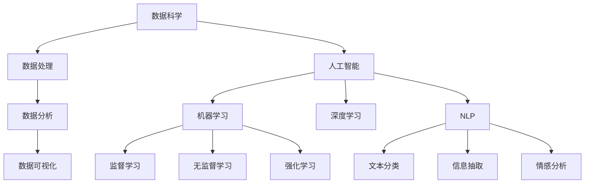

                 

# 洞察力：人类智慧的闪光点

## 1. 背景介绍

### 1.1 问题由来

在信息技术日新月异、数据爆炸的时代，洞察力显得尤为重要。洞察力不仅能够帮助我们更好地理解复杂的现象，还能在数据分析和决策中发挥关键作用。在商业、金融、医疗、社交网络等领域，洞察力的作用日益凸显，成为企业竞争力的重要组成部分。然而，随着数据量的爆炸式增长，人类个体在数据处理和分析方面面临巨大挑战，迫切需要技术手段辅助提升洞察力。

### 1.2 问题核心关键点

洞察力源于数据，但远不止于数据。它需要深度思考、创造性思维和强大的问题解决能力。在技术层面，洞察力的获取需要从数据收集、预处理、分析、可视化等多个环节入手，并依赖于先进的技术手段。目前，洞察力的提升主要依赖于数据科学、人工智能和机器学习等领域的研究和发展。

## 2. 核心概念与联系

### 2.1 核心概念概述

为更好地理解如何通过技术手段提升洞察力，本节将介绍几个密切相关的核心概念：

- 数据科学(Data Science)：一门以数据为中心的跨学科领域，涉及数据收集、处理、分析、可视化等多个环节，旨在从数据中提取知识和洞见。

- 人工智能(Artificial Intelligence)：一种模仿人类智能行为的高级计算机技术，包括机器学习、深度学习、自然语言处理、计算机视觉等多个子领域。

- 机器学习(Machine Learning)：一种利用算法和统计模型，让计算机系统从数据中学习和改进的技术，用于发现数据中隐含的模式和规律。

- 深度学习(Deep Learning)：一种利用多层神经网络模拟人类大脑工作机制的机器学习方法，用于处理大规模复杂数据。

- 自然语言处理(Natural Language Processing, NLP)：一门研究如何让计算机理解和处理自然语言的技术，如文本分类、信息抽取、情感分析等。

- 数据可视化(Data Visualization)：一种将数据转化为图形或图表的技术，帮助人们更直观地理解数据，从中提取洞见。

这些核心概念之间的逻辑关系可以通过以下Mermaid流程图来展示：



这个流程图展示了几大核心概念之间的联系：

1. 数据科学涵盖数据处理、分析和可视化等多个环节，为人工智能提供数据支撑。
2. 人工智能包括机器学习、深度学习和自然语言处理等多个子领域，用于从数据中提取洞见。
3. 机器学习包含监督学习、无监督学习和强化学习等多种方法，用于建立模型和算法。
4. 深度学习利用多层神经网络，处理大规模复杂数据，用于提升模型的准确性。
5. 自然语言处理专注于文本数据的处理和分析，提升模型对自然语言的理解能力。

这些概念共同构成了提升洞察力的技术框架，为我们提供了从数据中提取洞见的多元路径。

## 3. 核心算法原理 & 具体操作步骤
### 3.1 算法原理概述

洞察力的获取是一个多步骤的过程，涉及数据收集、清洗、特征工程、模型构建、评估等多个环节。在数据科学领域，这一过程可以通过一系列算法和技术的组合来实现。以下是基于数据科学的主要步骤：

1. **数据收集**：收集各类结构化和非结构化数据，如文本、图像、音频、视频等，为后续分析和洞见提取提供素材。

2. **数据清洗和预处理**：对数据进行缺失值处理、去噪、规范化、归一化等操作，确保数据的准确性和一致性。

3. **特征工程**：选择、提取和构建有意义的特征，以提高模型对数据的理解和预测能力。

4. **模型构建**：选择合适的算法，如线性回归、决策树、支持向量机、神经网络等，构建预测模型。

5. **模型评估和优化**：使用交叉验证、网格搜索、随机搜索等方法，评估模型性能，并进行超参数调优。

6. **结果解释和可视化**：通过解释模型输出，结合可视化技术，提取有意义的洞见。

### 3.2 算法步骤详解

以下以机器学习模型为例，详细介绍各个步骤的操作：

#### 3.2.1 数据收集和预处理

使用Python的Pandas库，可以从各种数据源收集数据：

```python
import pandas as pd

# 从CSV文件中读取数据
data = pd.read_csv('data.csv')

# 对缺失值进行处理
data.fillna(method='ffill', inplace=True)

# 标准化数据
from sklearn.preprocessing import StandardScaler
scaler = StandardScaler()
data = scaler.fit_transform(data)
```

#### 3.2.2 特征工程

特征工程是提升模型性能的关键步骤，涉及特征选择、特征提取和特征构建。例如，在文本数据中，可以使用词袋模型、TF-IDF、Word2Vec等方法进行特征提取：

```python
from sklearn.feature_extraction.text import CountVectorizer
from sklearn.decomposition import TruncatedSVD

# 使用词袋模型进行特征提取
vectorizer = CountVectorizer()
X = vectorizer.fit_transform(data['text'])

# 使用奇异值分解进行降维
svd = TruncatedSVD(n_components=100)
X = svd.fit_transform(X)
```

#### 3.2.3 模型构建和训练

选择合适的模型，并进行训练：

```python
from sklearn.ensemble import RandomForestClassifier

# 定义模型
model = RandomForestClassifier(n_estimators=100, random_state=42)

# 训练模型
model.fit(X, data['label'])
```

#### 3.2.4 模型评估和优化

使用交叉验证评估模型性能，并进行超参数调优：

```python
from sklearn.model_selection import cross_val_score
from sklearn.model_selection import GridSearchCV

# 使用交叉验证评估模型
scores = cross_val_score(model, X, data['label'], cv=5)
print(f"Cross-validation score: {scores.mean()}")

# 进行超参数调优
param_grid = {
    'n_estimators': [50, 100, 200],
    'max_depth': [None, 10, 20],
    'min_samples_split': [2, 5, 10]
}
grid_search = GridSearchCV(model, param_grid, cv=5)
grid_search.fit(X, data['label'])
print(f"Best parameters: {grid_search.best_params_}")
```

#### 3.2.5 结果解释和可视化

使用Matplotlib和Seaborn库进行结果可视化：

```python
import matplotlib.pyplot as plt
import seaborn as sns

# 绘制混淆矩阵
cm = confusion_matrix(data['label'], model.predict(X))
sns.heatmap(cm, annot=True)
plt.show()

# 绘制ROC曲线
fpr, tpr, thresholds = roc_curve(data['label'], model.predict_proba(X)[:, 1])
sns.lineplot(x=fpr, y=tpr, label='ROC Curve')
plt.show()
```

### 3.3 算法优缺点

基于数据科学的洞察力获取方法具有以下优点：

1. 系统性：通过一系列有组织的步骤和算法，确保数据分析和洞见提取的系统性和准确性。
2. 可解释性：每一步操作都有理论支撑，便于理解和解释结果。
3. 可扩展性：支持大规模数据处理，适用于多种类型的数据和任务。

然而，这种方法也存在一些局限性：

1. 需要大量预处理：数据清洗和特征工程耗时耗力，对数据质量和操作技巧要求较高。
2. 模型复杂度高：构建和训练复杂的模型需要较长的计算时间和较高的计算资源。
3. 依赖于数据质量：数据噪声和缺失值会影响模型的性能和结果解释。

尽管存在这些局限性，但基于数据科学的洞察力获取方法在实践中已经得到了广泛应用，并在多个领域取得了显著效果。未来，随着算法和技术的进步，这些方法的效率和效果将进一步提升。

### 3.4 算法应用领域

基于数据科学的洞察力获取方法，已经在商业智能(Business Intelligence, BI)、金融分析、市场营销、医疗诊断等多个领域得到了广泛应用，助力企业和机构更好地理解和决策：

1. **商业智能**：通过对客户行为和市场趋势的数据分析，帮助企业制定精准的市场策略和决策。
2. **金融分析**：利用历史交易数据和市场信息，进行风险评估和投资策略优化。
3. **市场营销**：通过消费者行为数据的分析，优化营销活动和产品推荐策略。
4. **医疗诊断**：利用医学影像和病历数据，辅助医生进行疾病诊断和治疗方案制定。

此外，在教育、公共卫生、环境保护等多个领域，基于数据科学的洞察力获取方法也展示了巨大的潜力和应用前景。

## 4. 数学模型和公式 & 详细讲解 & 举例说明

### 4.1 数学模型构建

以下以线性回归模型为例，介绍数学模型的构建过程：

设输入向量为 $X \in \mathbb{R}^n$，输出向量为 $Y \in \mathbb{R}$，线性回归模型的目标是最小化预测值与真实值之间的均方误差(Mean Squared Error, MSE)：

$$
\min_{\theta} \frac{1}{m} \sum_{i=1}^m (h_\theta(X_i) - Y_i)^2
$$

其中 $h_\theta(X) = \theta^TX$ 为线性模型，$\theta$ 为模型参数。

### 4.2 公式推导过程

1. **损失函数**：均方误差损失函数定义为：

$$
J(\theta) = \frac{1}{2m} \sum_{i=1}^m (h_\theta(X_i) - Y_i)^2
$$

2. **梯度下降**：使用梯度下降算法更新模型参数 $\theta$：

$$
\theta_{t+1} = \theta_t - \alpha \nabla_{\theta} J(\theta)
$$

其中 $\alpha$ 为学习率，$\nabla_{\theta} J(\theta)$ 为损失函数关于 $\theta$ 的梯度，可通过反向传播算法计算。

3. **正规方程**：当数据量较小时，可使用正规方程求解 $\theta$：

$$
\theta = (X^T X)^{-1} X^T Y
$$

### 4.3 案例分析与讲解

假设我们有一组房价数据，其中输入变量包括房屋面积和房间数，输出变量为房屋价格。通过构建线性回归模型，我们可以预测新房屋的价格：

1. **数据收集和预处理**：从数据集中获取房价、面积和房间数，并进行缺失值处理和数据规范化。
2. **特征工程**：使用Pandas库进行特征工程，构建房屋面积和房间数的组合特征。
3. **模型构建和训练**：使用Scikit-learn库构建线性回归模型，并进行训练。
4. **模型评估和优化**：使用交叉验证和均方误差评估模型性能，并进行超参数调优。
5. **结果解释和可视化**：使用Matplotlib和Seaborn库绘制预测结果和误差分布图，进行结果解释。

## 5. 项目实践：代码实例和详细解释说明

### 5.1 开发环境搭建

在进行洞察力获取实践前，我们需要准备好开发环境。以下是使用Python进行Scikit-learn开发的环境配置流程：

1. 安装Anaconda：从官网下载并安装Anaconda，用于创建独立的Python环境。

2. 创建并激活虚拟环境：
```bash
conda create -n scikit-learn-env python=3.8 
conda activate scikit-learn-env
```

3. 安装Scikit-learn和其他相关工具包：
```bash
conda install scikit-learn pandas numpy matplotlib seaborn
```

4. 安装必要的库和依赖项：
```bash
pip install scikit-learn pandas numpy matplotlib seaborn
```

完成上述步骤后，即可在`scikit-learn-env`环境中开始洞察力获取实践。

### 5.2 源代码详细实现

这里我们以线性回归模型为例，给出使用Scikit-learn库构建和训练模型的PyTorch代码实现。

首先，定义模型和优化器：

```python
from sklearn.linear_model import LinearRegression

model = LinearRegression()

# 定义优化器
optimizer = SGD(model.parameters(), lr=0.01, momentum=0.9)
```

接着，定义训练和评估函数：

```python
from sklearn.metrics import mean_squared_error

# 定义训练函数
def train_model(model, X, y, epochs):
    mse_loss = []
    for epoch in range(epochs):
        optimizer.zero_grad()
        y_pred = model(X)
        loss = mean_squared_error(y_pred, y)
        mse_loss.append(loss)
        loss.backward()
        optimizer.step()
    return mse_loss

# 定义评估函数
def evaluate_model(model, X, y):
    y_pred = model(X)
    mse = mean_squared_error(y, y_pred)
    return mse
```

最后，启动训练流程并在测试集上评估：

```python
# 准备数据
X = data[['area', 'rooms']]
y = data['price']

# 分割数据集
X_train, X_test, y_train, y_test = train_test_split(X, y, test_size=0.2, random_state=42)

# 训练模型
train_loss = train_model(model, X_train, y_train, epochs=100)

# 在测试集上评估
test_loss = evaluate_model(model, X_test, y_test)
print(f"Mean Squared Error on test set: {test_loss}")
```

以上就是使用Scikit-learn进行线性回归模型构建和训练的完整代码实现。可以看到，Scikit-learn库提供了丰富的机器学习算法和工具，使得洞察力获取任务的开发更加高效和便捷。

### 5.3 代码解读与分析

让我们再详细解读一下关键代码的实现细节：

**train_model函数**：
- 定义训练过程，循环迭代epochs次，每次更新模型参数，记录损失值，返回损失值列表。

**evaluate_model函数**：
- 使用测试集评估模型性能，计算均方误差，并返回结果。

**训练流程**：
- 准备数据集X和y
- 使用train_test_split函数分割数据集为训练集和测试集
- 在训练集上调用train_model函数进行模型训练，记录训练损失
- 在测试集上调用evaluate_model函数进行模型评估，输出测试损失

可以看到，Scikit-learn库通过其简洁易用的API，显著简化了洞察力获取任务的操作流程，使得开发者可以专注于算法和模型的设计，而不必过多关注底层实现细节。

## 6. 实际应用场景

### 6.1 商业智能

基于数据科学的洞察力获取方法在商业智能中得到了广泛应用。企业可以通过数据分析，挖掘市场趋势、客户需求和业务机会，制定更为精准的决策策略。例如，通过客户行为数据分析，企业可以识别出高价值客户和潜在客户，制定针对性的营销方案，提升销售业绩。

### 6.2 金融分析

金融行业对数据的依赖性极高，洞察力获取方法在此领域尤为关键。通过历史交易数据和市场信息的分析，金融分析师可以评估风险、优化投资策略和预测市场趋势。例如，利用机器学习算法，可以对股票价格进行预测和波动分析，辅助投资者做出更为明智的投资决策。

### 6.3 市场营销

市场营销领域需要处理大量的消费者行为数据，洞察力获取方法可以帮助企业更好地理解市场需求和消费者偏好，制定精准的营销策略。例如，通过分析社交媒体和电商平台的消费者反馈，企业可以识别出受欢迎的产品和服务，优化产品设计和市场推广。

### 6.4 医疗诊断

在医疗领域，洞察力获取方法可以辅助医生进行疾病诊断和治疗方案制定。例如，通过对医学影像和病历数据的分析，可以识别出患者的疾病类型和病情严重程度，为医生提供更有价值的诊断依据。此外，通过机器学习算法，可以对患者的治疗效果进行预测和评估，优化治疗方案，提升医疗质量。

## 7. 工具和资源推荐

### 7.1 学习资源推荐

为了帮助开发者系统掌握洞察力获取的理论基础和实践技巧，这里推荐一些优质的学习资源：

1. 《Python数据科学手册》：由Stefan Jansen等作者撰写，全面介绍了Python在数据分析和机器学习中的应用。

2. 《统计学习基础》：由Gareth James等作者撰写，介绍了机器学习的基本概念和算法，涵盖线性回归、决策树、支持向量机等多个主题。

3. 《机器学习实战》：由Peter Harrington等作者撰写，通过Python和Scikit-learn库，提供了一系列机器学习实践案例。

4. Coursera和edX等在线课程：提供大量数据科学和机器学习课程，涵盖从基础到高级的多个主题，适合不同层次的学习者。

5. Kaggle平台：提供大量数据科学和机器学习竞赛，通过实际问题解决，帮助学习者提升实践能力。

通过对这些资源的学习实践，相信你一定能够快速掌握洞察力获取的精髓，并用于解决实际的商业和科学问题。

### 7.2 开发工具推荐

高效的开发离不开优秀的工具支持。以下是几款用于洞察力获取开发的常用工具：

1. Jupyter Notebook：Python的交互式开发环境，支持代码编写、数据可视化、笔记本共享等多种功能。

2. PyCharm：一款Python IDE，提供代码自动补全、调试、版本控制等功能，适合大项目开发。

3. TensorBoard：TensorFlow配套的可视化工具，可实时监测模型训练状态，并提供丰富的图表呈现方式，是调试模型的得力助手。

4. Weights & Biases：模型训练的实验跟踪工具，可以记录和可视化模型训练过程中的各项指标，方便对比和调优。

5. Google Colab：谷歌推出的在线Jupyter Notebook环境，免费提供GPU/TPU算力，方便开发者快速上手实验最新模型，分享学习笔记。

合理利用这些工具，可以显著提升洞察力获取任务的开发效率，加快创新迭代的步伐。

### 7.3 相关论文推荐

洞察力获取源于数据科学和机器学习的交叉融合，以下是几篇奠基性的相关论文，推荐阅读：

1. "Machine Learning Yearning" by Andrew Ng：介绍了机器学习在多个实际应用中的策略和最佳实践，涵盖数据收集、模型选择、评估等多个环节。

2. "The Elements of Statistical Learning" by Trevor Hastie等：介绍了统计学习的基本概念和算法，涵盖线性回归、决策树、支持向量机等多个主题，提供系统性的理论支持。

3. "Deep Learning" by Ian Goodfellow等：全面介绍了深度学习的原理和应用，涵盖神经网络、卷积神经网络、循环神经网络等多个主题，提供前沿的技术支持。

4. "Natural Language Processing with Python" by Steven Bird等：介绍了自然语言处理的基本概念和算法，涵盖文本分类、信息抽取、情感分析等多个主题，提供实际案例和应用场景。

5. "Data Science for Business" by Foster Provost和Tom Fawcett：介绍了数据科学在商业中的应用，涵盖数据驱动决策、客户分析、市场策略等多个主题，提供实用的方法和工具。

这些论文代表了大数据科学和机器学习的研究脉络，通过学习这些前沿成果，可以帮助研究者把握学科前进方向，激发更多的创新灵感。

## 8. 总结：未来发展趋势与挑战

### 8.1 总结

本文对基于数据科学的洞察力获取方法进行了全面系统的介绍。首先阐述了洞察力获取的理论基础和实践方法，明确了数据科学在提升洞察力中的重要作用。其次，从原理到实践，详细讲解了数据科学的主要步骤和技术手段，给出了洞察力获取任务开发的完整代码实例。同时，本文还广泛探讨了洞察力获取方法在商业智能、金融分析、市场营销等多个行业领域的应用前景，展示了其巨大的潜力和应用价值。此外，本文精选了数据科学的各类学习资源，力求为读者提供全方位的技术指引。

通过本文的系统梳理，可以看到，基于数据科学的洞察力获取方法已经成为各行各业的重要工具，极大地提升了决策的准确性和科学性。未来，随着数据规模的增长和技术的进步，洞察力获取方法还将进一步提升其效率和效果，为企业的决策提供更有力的支持。

### 8.2 未来发展趋势

展望未来，数据科学的洞察力获取方法将呈现以下几个发展趋势：

1. **自动化和智能化**：随着自动机器学习和增强学习技术的发展，洞察力获取将变得更加自动化和智能化，能够自动选择和优化算法，提高决策的效率和质量。

2. **多模态数据融合**：数据科学将不仅限于单一类型的数据，而是融合文本、图像、音频、视频等多种数据类型，提供更全面的洞察力。

3. **实时数据处理**：随着流数据处理技术的发展，洞察力获取将具备实时处理能力，能够实时响应数据变化，提供及时的决策支持。

4. **集成化和可解释性**：洞察力获取方法将与更多工具和技术集成，提供更好的可解释性和可视化能力，帮助用户更好地理解数据和洞见。

5. **跨领域应用**：洞察力获取方法将在更多领域得到应用，如医疗、教育、公共卫生等，提供更广泛的数据分析和决策支持。

这些趋势凸显了数据科学洞察力获取方法的广阔前景，为各行各业提供了更强大的数据驱动决策工具。

### 8.3 面临的挑战

尽管数据科学洞察力获取方法已经取得了显著进展，但在迈向更加智能化、自动化和跨领域应用的过程中，仍面临诸多挑战：

1. **数据质量**：数据质量不高、数据噪声和缺失值等问题，严重影响洞察力的准确性和可靠性。需要进一步提升数据清洗和预处理技术。

2. **计算资源**：大规模数据的处理和分析需要强大的计算资源，如何优化算法和模型，降低计算成本，是未来重要的研究方向。

3. **模型复杂度**：构建和训练复杂的模型需要较长的计算时间和较高的计算资源，如何简化模型，提高模型效率，是未来重要的研究方向。

4. **可解释性**：现有模型往往较为复杂，难以解释其内部工作机制和决策逻辑，如何提供更强的可解释性，是未来重要的研究方向。

5. **跨领域应用**：在不同领域应用数据科学洞察力获取方法时，需要考虑领域的特殊性，如何建立通用的方法和框架，适应不同领域的需求，是未来重要的研究方向。

6. **数据隐私和安全**：数据科学洞察力获取方法涉及大量的敏感数据，如何保护数据隐私和安全，是未来重要的研究方向。

面对这些挑战，未来需要在数据质量、计算资源、模型简化、可解释性、跨领域应用等多个方面寻求新的突破，进一步提升数据科学的洞察力获取能力。

### 8.4 研究展望

在数据科学洞察力获取领域的未来研究中，以下几个方向值得关注：

1. **自动化机器学习(AutoML)**：通过自动化算法选择和模型调优，提升洞察力获取的效率和效果。

2. **增强学习(Reinforcement Learning, RL)**：利用增强学习技术，提升模型的自主学习和优化能力，适应更复杂和多变的环境。

3. **多模态数据融合**：融合多种类型的数据，提供更全面的洞察力，提升模型的泛化能力和应用范围。

4. **模型简化和压缩**：通过模型简化和压缩技术，降低计算成本，提升模型的实时性和可扩展性。

5. **跨领域应用框架**：建立通用的洞察力获取方法和框架，适应不同领域的需求，提升方法的普适性和可扩展性。

6. **数据隐私和安全**：在保护数据隐私和安全的前提下，探索更高效的数据处理和分析方法。

这些研究方向将为数据科学的洞察力获取方法提供新的动力，推动其在更多领域和场景中的应用，为人类决策提供更有力的支持。

## 9. 附录：常见问题与解答

**Q1：数据科学在洞察力获取中的作用是什么？**

A: 数据科学通过收集、清洗、分析和可视化数据，帮助人们发现数据中的规律和洞见。在洞察力获取中，数据科学提供了一个系统化的流程，从数据收集到结果解释，每一步都有科学方法和工具支持，确保了洞察力的准确性和可靠性。

**Q2：在洞察力获取过程中，如何选择合适的算法？**

A: 选择合适的算法需要考虑数据类型、问题类型和可用资源等多个因素。一般来说，可以通过以下步骤选择算法：
1. 确定问题类型（如分类、回归、聚类等）
2. 选择相应的算法（如线性回归、决策树、支持向量机等）
3. 在训练集上评估算法性能，选择最佳算法
4. 在测试集上验证算法泛化能力，优化模型参数

**Q3：在数据预处理过程中，如何处理缺失值和噪声？**

A: 处理缺失值和噪声是数据预处理的重要环节，常见的处理方法包括：
1. 缺失值处理：填补缺失值、删除缺失样本、插值法等
2. 噪声处理：去噪滤波、平滑处理、异常值检测等
3. 特征选择：选择有意义的特征，去除冗余和无关特征
4. 数据规范化：对数据进行标准化或归一化，确保数据的一致性和可比性

**Q4：在模型评估过程中，如何评估模型性能？**

A: 模型性能评估需要选择合适的评估指标，如准确率、召回率、F1值、均方误差等。评估过程中，需要使用交叉验证、网格搜索、随机搜索等方法，优化模型参数，选择最佳模型。同时，需要对比不同模型性能，选择最优模型。

**Q5：如何提升洞察力获取的效率和效果？**

A: 提升洞察力获取的效率和效果需要从多个方面入手，如自动化算法选择和调优、数据预处理和清洗、模型简化和优化等。此外，还可以通过集成更多工具和技术，如流数据处理、多模态数据融合等，提升洞察力获取的实时性和全面性。

通过本文的系统梳理，可以看到，数据科学的洞察力获取方法已经成为各行各业的重要工具，极大地提升了决策的准确性和科学性。未来，随着数据规模的增长和技术的进步，洞察力获取方法还将进一步提升其效率和效果，为企业的决策提供更有力的支持。

