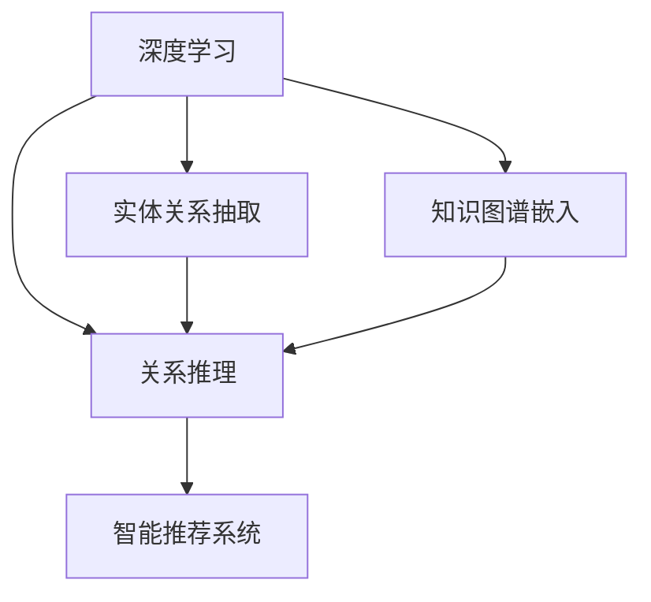

                 

# 洞察力：知识创新的领路人

> 关键词：洞察力,知识图谱,深度学习,知识管理,智能推荐

## 1. 背景介绍

### 1.1 问题由来
在数字化时代，数据和信息的激增不仅带来了机会，也带来了挑战。如何从海量的数据中快速发现洞察、获取知识，是每一个企业、研究机构和个体都必须面对的问题。深度学习技术的应用，尤其是在自然语言处理(NLP)和知识图谱(KG)领域，为洞察力的提取提供了新的可能性。

通过深度学习，我们可以在文本、图像、视频等多种数据形式中挖掘出潜在的知识结构，利用这些知识结构进行智能推荐、信息检索、情感分析等应用。然而，深度学习模型的本质是黑盒，无法解释其内部的决策逻辑，这使得知识管理成为一项艰巨的任务。为了解决这个问题，许多研究者和企业转向了知识图谱。

知识图谱是一种结构化的知识表示方式，它将知识以实体和关系的形式组织起来，形成图形结构，使机器能够更好地理解和应用知识。本文将从深度学习与知识图谱的结合入手，探讨如何通过深度学习技术提升知识图谱的构建和应用，从而更好地发现洞察力，驱动知识创新。

### 1.2 问题核心关键点
知识图谱的构建和应用，核心在于以下几个关键点：

- **实体抽取与识别**：从文本、图像、音频等数据中，自动抽取并识别出有意义的实体。
- **关系推理与匹配**：基于已有的实体关系，推理出新的关系，并通过匹配技术将关系应用于新场景。
- **知识图谱嵌入**：将实体和关系嵌入到向量空间，利用深度学习模型进行学习，以提升知识表示的质量和泛化能力。
- **智能推荐与搜索**：在知识图谱中构建用户模型，根据用户兴趣和行为进行个性化推荐和信息搜索。

这些关键点的研究，将推动知识图谱技术在更多领域的应用，提升企业和组织的知识管理水平，加速创新步伐。

### 1.3 问题研究意义
深入研究深度学习与知识图谱的结合，对于推动知识发现和知识创新具有重要意义：

1. **提升知识获取效率**：通过自动化的方式从海量数据中提取知识，大幅提升知识获取速度和规模。
2. **增强知识关联能力**：利用深度学习模型，能够更准确地发现知识之间的关系，提升知识的可追溯性和可应用性。
3. **驱动智能决策**：通过智能推荐和搜索系统，辅助决策者快速获取关键洞察，优化决策过程。
4. **促进创新发展**：在产品开发、市场分析、竞争策略等方面，知识图谱提供了一种全新的思维方式和工具。
5. **增强企业竞争力**：知识图谱技术能够帮助企业更好地理解市场和用户需求，提高运营效率和创新能力。

本文将系统介绍深度学习在知识图谱构建和应用中的关键技术，旨在为相关研究者和从业者提供深入的见解和实用的建议。

## 2. 核心概念与联系

### 2.1 核心概念概述

为了更好地理解深度学习与知识图谱的结合，我们需要首先了解一些关键概念：

- **深度学习(Deep Learning)**：一种基于神经网络的机器学习技术，能够处理非线性、高维度的数据。它在图像、语音、自然语言处理等领域取得了显著成果。
- **知识图谱(Knowledge Graph)**：一种结构化的知识表示方式，通过实体和关系的形式组织知识，使机器能够更好地理解和应用知识。
- **知识图谱嵌入(Knowledge Graph Embedding)**：将实体和关系嵌入到向量空间的技术，利用深度学习模型进行学习和表示。
- **实体关系抽取(ER)**：从文本、图像等数据中，自动抽取并识别出实体及其关系的技术。
- **关系推理(Reasoning)**：基于已有的实体关系，推理出新的关系，并通过匹配技术将关系应用于新场景。
- **智能推荐系统(Recommender System)**：根据用户兴趣和行为，自动推荐相关内容或商品的系统。

这些概念之间的逻辑关系可以通过以下Mermaid流程图来展示：



这个流程图展示了大语言模型与知识图谱的核心概念及其之间的联系：

1. 深度学习技术用于实体关系抽取和关系推理，提取和表示知识。
2. 知识图谱嵌入将抽取的实体和关系嵌入到向量空间，利用深度学习模型进行学习。
3. 智能推荐系统基于知识图谱，进行个性化推荐和搜索。

## 3. 核心算法原理 & 具体操作步骤
### 3.1 算法原理概述

深度学习与知识图谱的结合，本质上是一种数据驱动的智能决策过程。其核心思想是：利用深度学习模型，自动从数据中抽取和表示知识，构建知识图谱，并通过智能推荐系统，将知识应用于具体场景，驱动知识创新。

形式化地，假设输入数据为 $D$，其中包含 $N$ 个实体关系三元组 $(x_i, r_i, y_i)$，即实体 $x_i$ 与实体 $y_i$ 之间存在关系 $r_i$。知识图谱构建的目标是找到最优的知识表示 $h$，使得：

$$
h = \mathop{\arg\min}_{h} \mathcal{L}(h, D)
$$

其中 $\mathcal{L}$ 为损失函数，用于衡量知识表示 $h$ 与数据 $D$ 的拟合程度。通过梯度下降等优化算法，最小化损失函数，得到最优的知识表示 $h$。

在知识图谱嵌入中，常见的损失函数包括点积损失(Reconstruction Loss)、对数似然损失(Maximum Mean Discrepancy, MMD)、对称关系损失(Symmetric Relation Loss)等。这些损失函数分别用于衡量实体嵌入、关系嵌入和知识图谱结构的拟合程度。

### 3.2 算法步骤详解

基于深度学习与知识图谱结合的算法通常包括以下几个关键步骤：

**Step 1: 数据预处理**
- 收集并清洗数据，去除噪声和异常值。
- 将数据转换为适合深度学习模型的格式，如文本数据的分词、图像数据的特征提取等。

**Step 2: 实体关系抽取(ER)**
- 利用深度学习模型，如CRF、LSTM-CRF等，对输入文本进行实体关系抽取。
- 将抽取的实体和关系转换为三元组，用于构建知识图谱。

**Step 3: 知识图谱嵌入**
- 选择合适的知识图谱嵌入算法，如TransE、DistMult、RotatE等。
- 将抽取的实体和关系嵌入到向量空间，利用深度学习模型进行学习。
- 选择合适的损失函数，如点积损失、对称关系损失等，进行模型优化。

**Step 4: 智能推荐系统**
- 构建用户模型，利用知识图谱中的实体和关系，进行个性化推荐。
- 设计推荐算法，如基于矩阵分解的算法、基于深度学习的推荐算法等，进行推荐。
- 对推荐结果进行评估和优化，提高推荐效果。

### 3.3 算法优缺点

深度学习与知识图谱结合的算法具有以下优点：
1. 自动抽取知识：深度学习模型能够自动从文本、图像等数据中抽取实体和关系，减少人工标注成本。
2. 提升知识表示质量：利用深度学习模型，知识图谱嵌入能够更好地表示实体和关系，提高知识的泛化能力。
3. 加速知识发现：通过智能推荐系统，可以快速发现用户感兴趣的知识，提升知识发现的效率。
4. 增强决策支持：基于知识图谱的推荐和搜索系统，能够提供更有针对性的决策支持。

同时，该方法也存在一些局限性：
1. 数据依赖性强：需要大量的标注数据和高质量的数据进行训练，对数据的依赖性较强。
2. 模型复杂度高：深度学习模型的复杂度较高，训练和推理速度较慢，对硬件资源要求较高。
3. 解释性差：深度学习模型的黑盒特性，使得其知识表示和推理过程难以解释，缺乏可解释性。
4. 泛化能力有限：深度学习模型的泛化能力较强，但在新的场景下，需要进行重新训练和调整。

尽管存在这些局限性，但深度学习与知识图谱的结合，无疑是推动知识创新和知识管理的重要手段。未来相关研究将集中在提升模型的可解释性、提高泛化能力和降低对标注数据的依赖上。

### 3.4 算法应用领域

深度学习与知识图谱结合的算法在多个领域得到了广泛应用：

- **自然语言处理(NLP)**：在文本分类、情感分析、问答系统等任务中，利用知识图谱进行语义理解和推理。
- **推荐系统**：利用知识图谱进行个性化推荐，提升推荐系统的准确性和多样性。
- **搜索引擎**：利用知识图谱进行实体和关系的快速检索，提高搜索结果的准确性和相关性。
- **医疗健康**：在医学知识图谱的基础上，进行疾病诊断和治疗方案推荐。
- **金融保险**：在金融知识图谱的基础上，进行风险评估和投资建议。
- **社交媒体**：利用知识图谱进行舆情分析、用户兴趣预测等。

此外，深度学习与知识图谱的结合，也为科学研究、教育培训、智能制造等领域提供了新的技术支持。随着相关技术的不断成熟，未来必将有更多领域受益于这一创新性结合。

## 4. 数学模型和公式 & 详细讲解 & 举例说明

### 4.1 数学模型构建

本节将使用数学语言对深度学习与知识图谱结合的算法进行更加严格的刻画。

假设输入数据 $D$ 包含 $N$ 个实体关系三元组 $(x_i, r_i, y_i)$，其中 $x_i$ 和 $y_i$ 为实体，$r_i$ 为关系。定义知识图谱嵌入模型为 $h$，表示为实体的向量表示。

知识图谱嵌入模型的目标是找到最优的实体嵌入 $h$，使得：

$$
h = \mathop{\arg\min}_{h} \mathcal{L}(h, D)
$$

其中 $\mathcal{L}$ 为损失函数，常用的损失函数包括：

- 点积损失(Reconstruction Loss)：$L_{recon}(h) = \sum_{i=1}^N (1 - \langle h(x_i), h(y_i) \rangle)^2$
- 对数似然损失(Maximum Mean Discrepancy, MMD)：$L_{mmd}(h) = \mathbb{E}[h(x_i)] - \mathbb{E}[h(y_i)]$
- 对称关系损失(Symmetric Relation Loss)：$L_{sym}(h) = \sum_{i=1}^N \langle h(x_i), h(y_i) \rangle$

在实际应用中，通常使用交叉熵损失(CE Loss)进行知识图谱嵌入训练，其公式为：

$$
L_{ce}(h) = -\frac{1}{N} \sum_{i=1}^N (y_i \log \sigma(\langle h(x_i), h(y_i) \rangle) + (1 - y_i) \log (1 - \sigma(\langle h(x_i), h(y_i) \rangle))
$$

其中 $\sigma$ 为Sigmoid函数，$\langle h(x_i), h(y_i) \rangle$ 为实体嵌入 $h$ 的点积。

### 4.2 公式推导过程

以下我们以点积损失为例，推导知识图谱嵌入的训练公式。

假设输入数据 $D$ 包含 $N$ 个实体关系三元组 $(x_i, r_i, y_i)$，其中 $x_i$ 和 $y_i$ 为实体，$r_i$ 为关系。定义知识图谱嵌入模型为 $h$，表示为实体的向量表示。

点积损失 $L_{recon}(h)$ 的公式为：

$$
L_{recon}(h) = \sum_{i=1}^N (1 - \langle h(x_i), h(y_i) \rangle)^2
$$

将其代入损失函数公式，得：

$$
\mathcal{L}(h) = \frac{1}{N} \sum_{i=1}^N \langle h(x_i), h(y_i) \rangle
$$

根据链式法则，损失函数对参数 $h$ 的梯度为：

$$
\frac{\partial \mathcal{L}(h)}{\partial h} = \frac{1}{N} \sum_{i=1}^N 2(h(x_i) \cdot h(y_i) - 1)
$$

在得到损失函数的梯度后，即可带入模型参数 $h$ 的更新公式，完成模型的迭代优化。重复上述过程直至收敛，最终得到适应知识图谱嵌入模型的最优参数 $h$。

### 4.3 案例分析与讲解

以知识图谱嵌入模型TransE为例，分析其训练过程和效果。

TransE是一种常见的知识图谱嵌入模型，其主要思想是利用实体的向量表示，预测关系三元组 $(\text{head}, \text{relation}, \text{tail})$ 的正确性。在训练过程中，TransE通过最大化三元组的预测概率，最小化预测错误概率，进行模型优化。

假设输入数据 $D$ 包含 $N$ 个实体关系三元组 $(x_i, r_i, y_i)$，其中 $x_i$ 和 $y_i$ 为实体，$r_i$ 为关系。定义知识图谱嵌入模型为 $h$，表示为实体的向量表示。

TransE的训练过程分为两个步骤：

1. **实体向量初始化**：随机初始化实体的向量表示 $h(x_i)$ 和 $h(y_i)$。
2. **关系预测**：对于每个三元组 $(x_i, r_i, y_i)$，预测其正确性，并计算预测误差。

TransE的目标是最小化预测误差，其训练过程的公式为：

$$
\mathcal{L}_{TransE}(h) = -\frac{1}{N} \sum_{i=1}^N \log \sigma(\langle h(x_i), h(y_i) \rangle)
$$

其中 $\sigma$ 为Sigmoid函数，$\langle h(x_i), h(y_i) \rangle$ 为实体嵌入 $h$ 的点积。

在训练过程中，TransE通过最大化三元组的预测概率，最小化预测错误概率，进行模型优化。其具体训练过程如下：

1. 对于每个三元组 $(x_i, r_i, y_i)$，计算预测概率 $P(x_i, r_i, y_i) = \sigma(\langle h(x_i), h(y_i) \rangle)$。
2. 计算预测误差 $E(x_i, r_i, y_i) = 1 - P(x_i, r_i, y_i)$。
3. 更新实体的向量表示 $h(x_i)$ 和 $h(y_i)$，使得预测误差 $E(x_i, r_i, y_i)$ 最小化。

通过TransE的训练过程，可以发现其通过最大化三元组的预测概率，最小化预测误差，学习实体的向量表示和关系的三元组表示，从而构建高质量的知识图谱嵌入模型。

## 5. 项目实践：代码实例和详细解释说明

### 5.1 开发环境搭建

在进行知识图谱嵌入项目实践前，我们需要准备好开发环境。以下是使用Python进行PyTorch开发的环境配置流程：

1. 安装Anaconda：从官网下载并安装Anaconda，用于创建独立的Python环境。

2. 创建并激活虚拟环境：
```bash
conda create -n pytorch-env python=3.8 
conda activate pytorch-env
```

3. 安装PyTorch：根据CUDA版本，从官网获取对应的安装命令。例如：
```bash
conda install pytorch torchvision torchaudio cudatoolkit=11.1 -c pytorch -c conda-forge
```

4. 安装TensorBoard：用于可视化训练过程中的各项指标，帮助调试模型。
```bash
pip install tensorboard
```

5. 安装相关库：
```bash
pip install numpy pandas scikit-learn scipy matplotlib pytorch-tutorials pytorch-lightning
```

完成上述步骤后，即可在`pytorch-env`环境中开始知识图谱嵌入的实践。

### 5.2 源代码详细实现

以下是一个简单的知识图谱嵌入项目实现，其中使用了PyTorch和TransE算法。

```python
import torch
import torch.nn as nn
import torch.optim as optim
from torch_geometric.nn import TransE
from torch_geometric.data import Data

class GraphNet(nn.Module):
    def __init__(self, num_entities, num_relations, dim=128):
        super(GraphNet, self).__init__()
        self.num_entities = num_entities
        self.num_relations = num_relations
        self.dim = dim
        self.model = TransE(num_entities=num_entities, num_relations=num_relations, dim=dim)
        self.loss = nn.BCELoss()

    def forward(self, data):
        x, e, y = data.x, data.edge_index, data.y
        y_hat = self.model(x, e)
        loss = self.loss(y_hat, y)
        return loss

    def train(self, data, epochs, batch_size, lr):
        optimizer = optim.Adam(self.parameters(), lr=lr)
        device = torch.device("cuda" if torch.cuda.is_available() else "cpu")
        model = self.model.to(device)
        data = data.to(device)
        for epoch in range(epochs):
            total_loss = 0
            for i in range(0, data.num_nodes() // batch_size):
                optimizer.zero_grad()
                loss = self(data[0:i * batch_size])
                loss.backward()
                optimizer.step()
                total_loss += loss.item()
            print(f"Epoch {epoch+1}, loss: {total_loss / data.num_nodes()}")
```

这里我们使用了TransE算法，定义了一个简单的GraphNet模型，包含一个TransE层和一个BCELoss层。在训练过程中，我们通过迭代优化，最小化损失函数，得到最优的知识图谱嵌入模型。

### 5.3 代码解读与分析

让我们再详细解读一下关键代码的实现细节：

**GraphNet类**：
- `__init__`方法：初始化知识图谱嵌入模型和损失函数。
- `forward`方法：将输入数据转换为模型需要的格式，并进行前向传播。
- `train`方法：定义训练过程，包括损失计算、梯度更新等。

**TransE算法**：
- `TransE`层：定义了知识图谱嵌入模型的结构，包含实体嵌入和关系嵌入。
- `BCELoss`层：定义了损失函数，用于衡量预测概率与真实标签的拟合程度。

**训练过程**：
- 定义训练超参数，包括迭代轮数、批次大小、学习率等。
- 使用Adam优化器进行模型参数的更新。
- 将模型和数据移动到GPU上，加快训练速度。
- 在每个epoch内，对每个批次进行前向传播和反向传播，更新模型参数。

可以看到，通过简单的代码实现，我们就可以使用PyTorch和TransE算法进行知识图谱嵌入的训练。

当然，工业级的系统实现还需考虑更多因素，如模型的保存和部署、超参数的自动搜索、更灵活的任务适配层等。但核心的知识图谱嵌入方法基本与此类似。

## 6. 实际应用场景
### 6.1 智能推荐系统

基于深度学习与知识图谱结合的智能推荐系统，已经成为电子商务、内容分发、社交网络等领域的重要技术手段。通过知识图谱嵌入，推荐系统能够更准确地理解和表示用户兴趣，提供更加个性化和多样化的推荐。

在推荐系统中，知识图谱嵌入模型通常被用于以下几个方面：

1. **用户建模**：利用知识图谱中的实体和关系，构建用户兴趣模型。
2. **商品关系抽取**：从商品描述中抽取实体和关系，构建商品知识图谱。
3. **推荐算法**：结合用户模型和商品知识图谱，设计推荐算法，进行推荐。
4. **推荐效果评估**：对推荐结果进行评估和优化，提高推荐效果。

例如，在电商推荐中，基于知识图谱的推荐系统可以根据用户历史行为和商品属性，生成用户兴趣模型。通过分析商品之间的关联关系，构建商品知识图谱。最后，结合用户模型和商品图谱，设计推荐算法，为每个用户推荐可能感兴趣的商品。这种推荐方式能够显著提高推荐的个性化和准确性，提升用户满意度和转化率。

### 6.2 医疗健康

在医疗健康领域，深度学习与知识图谱结合的算法也有着广泛的应用。通过构建医疗知识图谱，可以为医生提供更有价值的诊断和治疗建议。

例如，在电子健康记录(EHR)系统中，知识图谱嵌入模型可以用于以下任务：

1. **疾病诊断**：根据病人的症状和病史，抽取和匹配相关实体和关系，推断出可能的疾病。
2. **治疗方案推荐**：利用医疗知识图谱，为每个疾病推荐最合适的治疗方案。
3. **药物信息抽取**：从医学文献中抽取药物和相关实体，构建药物知识图谱。
4. **病历记录分析**：分析病历记录中的实体和关系，提供有意义的洞察。

通过这些任务，知识图谱嵌入模型能够为医生提供更加全面和精准的诊断和治疗建议，提升医疗服务质量。

### 6.3 金融保险

在金融保险领域，深度学习与知识图谱结合的算法可以用于风险评估和投资建议。

例如，在金融知识图谱中，实体包括股票、债券、公司等，关系包括价格变动、公司财务状况等。通过知识图谱嵌入模型，可以推理出股票之间的关联关系，预测股票价格波动趋势，评估金融风险。

此外，知识图谱嵌入模型还可以用于金融产品的推荐，根据用户的历史行为和兴趣，推荐最合适的金融产品，提升用户体验和满意度。

### 6.4 未来应用展望

深度学习与知识图谱结合的算法在未来有广阔的应用前景：

1. **智慧城市治理**：在智慧城市中，利用知识图谱嵌入模型进行事件监测、舆情分析、应急指挥等，提高城市管理的自动化和智能化水平。
2. **社交媒体分析**：在社交媒体中，利用知识图谱嵌入模型进行舆情分析、用户兴趣预测等，提升社交媒体的运营效率。
3. **科学研究**：在科学研究中，利用知识图谱嵌入模型进行领域知识抽取、文献检索等，加速科学研究进程。
4. **教育培训**：在教育培训中，利用知识图谱嵌入模型进行课程推荐、学习路径规划等，提升教育效果。
5. **智能制造**：在智能制造中，利用知识图谱嵌入模型进行设备维护、生产调度等，提升生产效率和产品质量。

深度学习与知识图谱结合的算法将推动更多领域实现智能化、自动化，带来更高的效率和更好的用户体验。

## 7. 工具和资源推荐
### 7.1 学习资源推荐

为了帮助开发者系统掌握深度学习与知识图谱结合的理论基础和实践技巧，这里推荐一些优质的学习资源：

1. 《深度学习与知识图谱》：一本系统介绍深度学习与知识图谱结合的书籍，涵盖理论基础和实践方法，适合各层次读者。

2. 《知识图谱理论与应用》：一本全面介绍知识图谱的理论和应用的书籍，适合对知识图谱有深入研究的读者。

3. DeepLearning.AI：由Andrew Ng教授创办的在线课程平台，提供深度学习与知识图谱结合的课程，涵盖基础知识和前沿技术。

4 HuggingFace官方文档：Transformer库的官方文档，提供了海量预训练模型和完整的知识图谱嵌入实现，是上手实践的必备资料。

5 TensorFlow官方文档：TensorFlow的官方文档，提供了知识图谱嵌入的详细实现，并支持GPU加速训练。

通过对这些资源的学习实践，相信你一定能够快速掌握深度学习与知识图谱结合的精髓，并用于解决实际的NLP问题。

### 7.2 开发工具推荐

高效的开发离不开优秀的工具支持。以下是几款用于深度学习与知识图谱结合开发的常用工具：

1. PyTorch：基于Python的开源深度学习框架，灵活动态的计算图，适合快速迭代研究。

2. TensorFlow：由Google主导开发的开源深度学习框架，生产部署方便，适合大规模工程应用。

3. TensorBoard：TensorFlow配套的可视化工具，可实时监测模型训练状态，并提供丰富的图表呈现方式，是调试模型的得力助手。

4. Graph Neural Network：专门用于图神经网络的库，支持知识图谱嵌入的实现。

5. PyTorch-Tutorials：PyTorch的官方教程，提供深度学习与知识图谱结合的案例，方便开发者快速上手。

合理利用这些工具，可以显著提升深度学习与知识图谱结合的开发效率，加快创新迭代的步伐。

### 7.3 相关论文推荐

深度学习与知识图谱结合的研究源于学界的持续研究。以下是几篇奠基性的相关论文，推荐阅读：

1. TransE: Learning to Embedding Entities with Relations：提出TransE算法，用于构建知识图谱嵌入模型。

2. Knowledge-Graph-Embedding：全面介绍知识图谱嵌入的原理、方法和应用。

3. Reasoning on Knowledge Graphs with Neural Tensor Networks：使用神经网络进行知识图谱推理，提升知识图谱的泛化能力。

4. DistMult: A Neural Tensor Network Architecture for Multi-Relation KG Embeddings：提出DistMult算法，用于构建知识图谱嵌入模型。

5. RotatE: Rotate to Learn Entity and Relation Embeddings：提出RotatE算法，用于构建知识图谱嵌入模型。

这些论文代表了大语言模型微调技术的发展脉络。通过学习这些前沿成果，可以帮助研究者把握学科前进方向，激发更多的创新灵感。

## 8. 总结：未来发展趋势与挑战

### 8.1 总结

本文对深度学习与知识图谱结合的算法进行了全面系统的介绍。首先阐述了深度学习与知识图谱结合的研究背景和意义，明确了在知识图谱构建和应用中的深度学习技术的核心作用。其次，从原理到实践，详细讲解了深度学习与知识图谱结合的数学原理和关键步骤，给出了知识图谱嵌入的完整代码实现。同时，本文还广泛探讨了深度学习与知识图谱结合在推荐系统、医疗健康、金融保险等领域的实际应用，展示了其巨大的应用潜力。此外，本文精选了深度学习与知识图谱结合的学习资源，力求为读者提供深入的见解和实用的建议。

通过本文的系统梳理，可以看到，深度学习与知识图谱结合的算法正在成为知识创新和知识管理的重要手段，极大地拓展了知识图谱的应用边界，提升了企业的知识管理水平，加速了创新步伐。未来，伴随深度学习与知识图谱结合技术的不断成熟，将在更多领域实现智能化、自动化，带来更高的效率和更好的用户体验。

### 8.2 未来发展趋势

展望未来，深度学习与知识图谱结合的算法将呈现以下几个发展趋势：

1. **模型规模增大**：随着算力成本的下降和数据规模的扩张，深度学习模型的参数量还将持续增长。超大规模知识图谱嵌入模型蕴含的丰富知识，有望支撑更加复杂多变的应用场景。

2. **知识表示提升**：利用深度学习模型，知识图谱嵌入能够更好地表示实体和关系，提高知识的泛化能力。未来将涌现更多高效的知识表示方法，提升知识图谱的质量。

3. **推理能力增强**：知识图谱嵌入模型将具备更强的推理能力，能够推理出新的关系，提升知识图谱的应用场景。

4. **多模态融合**：知识图谱嵌入模型将与视觉、语音等多模态数据结合，实现视觉、语音、文本等信息的协同建模。

5. **自动化优化**：未来将涌现更多自动化优化技术，如自动化调参、模型压缩、分布式训练等，提升知识图谱嵌入的效率和效果。

6. **领域特定知识图谱**：深度学习与知识图谱结合的技术将逐渐向特定领域深化，构建更多领域特定知识图谱，提升知识图谱的领域适应性。

以上趋势凸显了深度学习与知识图谱结合算法的广阔前景。这些方向的探索发展，必将进一步提升知识图谱嵌入模型的性能和应用范围，为知识发现和知识管理提供更强支持。

### 8.3 面临的挑战

尽管深度学习与知识图谱结合的算法已经取得了显著成果，但在迈向更加智能化、普适化应用的过程中，仍面临诸多挑战：

1. **数据依赖性强**：需要大量的标注数据和高质量的数据进行训练，对数据的依赖性较强。如何获取和处理大规模数据，仍是亟待解决的问题。

2. **模型复杂度高**：深度学习模型的复杂度较高，训练和推理速度较慢，对硬件资源要求较高。如何提高模型效率，优化资源利用率，是未来的一个重要研究方向。

3. **解释性差**：深度学习模型的黑盒特性，使得其知识表示和推理过程难以解释，缺乏可解释性。如何提升模型的可解释性，赋予其更强的决策依据，将是重要的研究方向。

4. **泛化能力有限**：深度学习模型的泛化能力较强，但在新的场景下，需要进行重新训练和调整。如何提升模型的泛化能力，构建更加鲁棒的模型，是未来的重要研究方向。

5. **对抗攻击脆弱**：深度学习模型可能面临对抗攻击，导致错误的知识表示和推理结果。如何增强模型的鲁棒性，提升其在对抗攻击下的安全性，将是重要的研究方向。

6. **数据隐私和安全**：深度学习模型可能泄露用户隐私，存在安全隐患。如何保护用户数据隐私，确保模型的安全性，将是重要的研究方向。

正视这些挑战，积极应对并寻求突破，将是大语言模型微调走向成熟的必由之路。相信随着学界和产业界的共同努力，这些挑战终将一一被克服，深度学习与知识图谱结合的技术必将在构建智能化的知识管理系统中发挥重要作用。

### 8.4 研究展望

面向未来，深度学习与知识图谱结合的研究需要在以下几个方面寻求新的突破：

1. **自动化优化技术**：开发更多自动化调参、模型压缩、分布式训练等优化技术，提升知识图谱嵌入的效率和效果。

2. **多模态融合技术**：将知识图谱嵌入与视觉、语音等多模态数据结合，实现多模态信息的协同建模，提升模型的泛化能力。

3. **鲁棒性增强技术**：引入对抗攻击、鲁棒优化等技术，增强深度学习与知识图谱结合模型的鲁棒性，提高其安全性。

4. **可解释性提升技术**：利用可解释性技术，提升深度学习与知识图谱结合模型的可解释性，增强其决策依据。

5. **知识融合技术**：将知识图谱嵌入与专家知识、规则库等结合，提升模型的知识融合能力，实现更加全面、准确的决策支持。

这些研究方向将推动深度学习与知识图谱结合技术的不断进步，为知识发现和知识管理提供更强的工具支持，助力企业和组织在数字化转型中取得更大的成功。

## 9. 附录：常见问题与解答

**Q1：如何提高知识图谱嵌入模型的泛化能力？**

A: 提高知识图谱嵌入模型的泛化能力，可以从以下几个方面入手：
1. 数据多样性：尽可能收集多样化的数据，涵盖不同的实体和关系，提高模型的泛化能力。
2. 模型架构优化：设计更加灵活、高效的模型架构，提高模型的泛化能力。
3. 正则化技术：使用L2正则、Dropout等正则化技术，防止模型过拟合。
4. 迁移学习：利用预训练模型，进行迁移学习，提升模型的泛化能力。
5. 对抗攻击防御：引入对抗攻击技术，提升模型在对抗攻击下的鲁棒性。

**Q2：如何提高知识图谱嵌入模型的可解释性？**

A: 提高知识图谱嵌入模型的可解释性，可以从以下几个方面入手：
1. 可解释性模型设计：选择可解释性较强的模型架构，如规则增强、符号增强等。
2. 知识图谱可视化：利用知识图谱可视化工具，展示模型的推理过程和决策依据。
3. 部分可解释性：将模型的部分组件进行可解释性增强，如知识图谱嵌入的特征向量空间等。
4. 模型解释技术：利用模型解释技术，如SHAP、LIME等，提供模型的决策依据。
5. 专家知识融合：将专家知识、规则库等与知识图谱嵌入模型结合，增强模型的可解释性。

**Q3：如何构建高质量的知识图谱嵌入模型？**

A: 构建高质量的知识图谱嵌入模型，可以从以下几个方面入手：
1. 数据质量：确保数据的高质量，去除噪声和异常值，提高模型的泛化能力。
2. 实体和关系抽取：利用深度学习模型，自动从文本、图像等数据中抽取实体和关系，构建知识图谱。
3. 知识图谱嵌入算法：选择合适的知识图谱嵌入算法，如TransE、DistMult等，进行模型训练。
4. 模型优化：使用交叉熵损失、点积损失等损失函数，进行模型优化，提升模型的泛化能力。
5. 模型评估：使用多个指标，如精确度、召回率、F1值等，评估模型的性能，进行模型优化。

**Q4：如何应对深度学习与知识图谱结合技术中的挑战？**

A: 应对深度学习与知识图谱结合技术中的挑战，可以从以下几个方面入手：
1. 数据获取与处理：收集和处理高质量的数据，提升模型的泛化能力。
2. 模型架构设计：设计更加灵活、高效的模型架构，提高模型的泛化能力。
3. 正则化与鲁棒性：使用正则化技术，提升模型的鲁棒性，防止过拟合。
4. 对抗攻击防御：引入对抗攻击技术，提升模型在对抗攻击下的鲁棒性。
5. 解释性与安全性：利用可解释性技术和安全技术，提升模型的可解释性和安全性。

通过这些方法的综合应用，可以有效地提升深度学习与知识图谱结合技术的性能和应用范围，推动其在更多领域的落地应用。

---

作者：禅与计算机程序设计艺术 / Zen and the Art of Computer Programming

