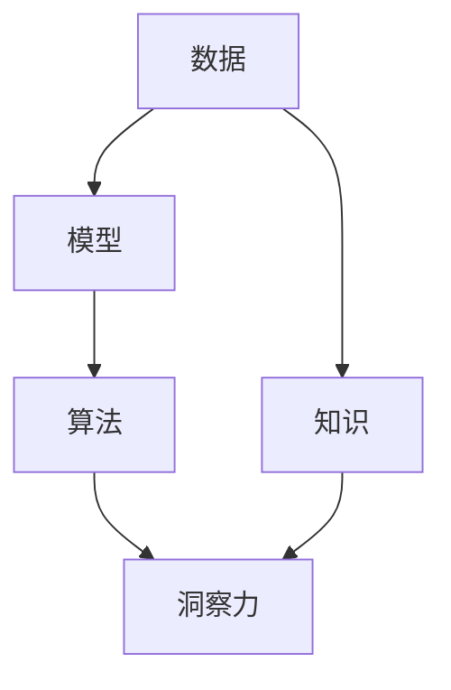

                 

## 1. 背景介绍

在当今快速发展的数字化时代，数据无处不在。然而，仅仅拥有数据是不够的。如何将数据转化为洞察力，是驱动创新和决策的关键。洞察力不仅源自数据本身，还依赖于算法、模型和知识的应用。本文将深入探讨洞察力的本质、生成过程及其实际应用，帮助读者掌握从数据到洞察的关键技术和方法。

## 2. 核心概念与联系

### 2.1 核心概念概述

为了更好地理解洞察力的概念及其生成过程，首先需要了解几个核心概念：

- **数据 (Data)**：数据是洞察力的基础，包括结构化数据、非结构化数据和半结构化数据。
- **模型 (Model)**：模型是洞察力的工具，通过数据分析和建模，发现数据中的模式和关联。
- **算法 (Algorithm)**：算法是洞察力的实现手段，根据模型设计算法，通过计算和推理生成洞察力。
- **知识 (Knowledge)**：知识是洞察力的基础，模型和算法需要利用先验知识，提高预测准确性。
- **洞察力 (Insight)**：洞察力是数据、模型、算法和知识综合应用的结果，通过分析数据和模型推理，揭示数据背后的规律和意义。

### 2.2 核心概念原理和架构的 Mermaid 流程图(Mermaid 流程节点中不要有括号、逗号等特殊字符)



此图展示了数据、模型、算法和知识在生成洞察力的过程中相互作用的关系。数据和知识作为输入，通过模型和算法转化为洞察力。模型和算法是实现这一转化的关键工具，而知识则是模型和算法的指导。

## 3. 核心算法原理 & 具体操作步骤

### 3.1 算法原理概述

洞察力生成过程的核心算法原理包括数据预处理、特征工程、模型训练和模型评估等步骤。

1. **数据预处理**：对原始数据进行清洗、归一化、降维等操作，提升数据的可用性。
2. **特征工程**：根据任务需求，从原始数据中提取有意义的特征，如特征选择、特征变换等。
3. **模型训练**：选择合适的模型，并在训练集上进行参数优化，生成能够反映数据模式的模型。
4. **模型评估**：在测试集上评估模型性能，选择最优模型。

### 3.2 算法步骤详解

以下是洞察力生成过程的详细步骤：

**Step 1: 数据预处理**
- 数据清洗：去除缺失值、重复数据、异常值等。
- 数据归一化：将数据缩放到一个特定的范围，提高模型的收敛速度和性能。
- 数据降维：通过PCA、LDA等技术，减少数据维度，降低计算复杂度。

**Step 2: 特征工程**
- 特征选择：从原始数据中选择对任务有帮助的特征，提高模型预测能力。
- 特征变换：通过编码、嵌入等技术，将特征转换为模型能够处理的格式。

**Step 3: 模型训练**
- 选择合适的模型：根据任务需求选择合适的算法和模型结构。
- 设置训练参数：设置学习率、迭代次数、正则化参数等。
- 训练模型：使用训练数据集，通过前向传播和反向传播，更新模型参数。

**Step 4: 模型评估**
- 划分训练集和测试集：将数据集划分为训练集和测试集，保证模型在未知数据上的泛化能力。
- 评估模型性能：使用准确率、召回率、F1值等指标评估模型性能。
- 选择最优模型：在多个模型中选择性能最好的模型。

### 3.3 算法优缺点

基于以上步骤，洞察力生成过程的优点和缺点如下：

**优点**
- 能够充分利用数据，提高模型的预测能力。
- 模型的选择和调整较为灵活，适合多种任务。
- 通过预处理和特征工程，提高数据质量和模型性能。

**缺点**
- 数据预处理和特征工程需要较多的时间和资源。
- 模型的选择和调整需要专业知识，对数据科学家要求较高。
- 模型的过度拟合可能导致泛化性能下降。

### 3.4 算法应用领域

洞察力生成过程广泛应用于金融分析、医疗诊断、营销策略、客户行为分析等多个领域，具体应用如下：

- **金融分析**：通过分析历史交易数据，生成金融市场趋势的洞察力，指导投资决策。
- **医疗诊断**：通过分析患者历史数据，生成疾病的早期预警和诊断结果，提高诊断准确性。
- **营销策略**：通过分析用户行为数据，生成市场趋势和用户偏好的洞察力，制定营销策略。
- **客户行为分析**：通过分析客户历史数据，生成客户需求和行为特征的洞察力，提升客户服务质量。

## 4. 数学模型和公式 & 详细讲解 & 举例说明

### 4.1 数学模型构建

洞察力生成的数学模型包括线性回归、逻辑回归、决策树、随机森林、神经网络等。以线性回归模型为例，构建数学模型如下：

$$
y = \beta_0 + \beta_1 x_1 + \beta_2 x_2 + \cdots + \beta_n x_n + \epsilon
$$

其中，$y$ 为预测结果，$x_i$ 为特征变量，$\beta_i$ 为系数，$\epsilon$ 为误差项。

### 4.2 公式推导过程

以线性回归为例，推导公式如下：

1. **最小二乘法**：求解最优参数$\beta_i$，使得残差平方和最小。

$$
\hat{\beta} = (X^TX)^{-1}X^Ty
$$

2. **正则化**：添加正则项，防止过拟合。

$$
\hat{\beta} = (X^TX + \lambda I)^{-1}X^Ty
$$

其中，$\lambda$ 为正则化参数，$I$ 为单位矩阵。

### 4.3 案例分析与讲解

假设某电商平台需要预测用户是否购买某商品，可以通过以下步骤构建模型：

1. **数据预处理**：清洗用户历史购买数据，去除异常值，归一化数据。
2. **特征工程**：选择用户年龄、性别、购买频率等特征。
3. **模型训练**：使用线性回归模型，根据购买数据训练模型。
4. **模型评估**：在测试集上评估模型性能，选择最优模型。
5. **洞察力生成**：分析模型结果，生成用户购买行为的洞察力，指导营销策略。

## 5. 项目实践：代码实例和详细解释说明

### 5.1 开发环境搭建

在进行洞察力生成项目的开发前，需要搭建好开发环境。以下是使用Python进行项目开发的环境配置流程：

1. 安装Python：从官网下载并安装Python，选择最新版本。
2. 安装必要的库：如NumPy、Pandas、Scikit-Learn、Matplotlib等，用于数据处理和模型训练。
3. 设置开发工具：如Jupyter Notebook、PyCharm等，用于代码编写和调试。
4. 安装Git：使用Git进行代码版本控制，方便协作开发。

### 5.2 源代码详细实现

以下是一个简单的线性回归模型实现代码：

```python
import numpy as np
from sklearn.linear_model import LinearRegression
from sklearn.metrics import mean_squared_error

# 数据集
X = np.array([[1, 2], [2, 3], [3, 4], [4, 5]])
y = np.array([3, 4, 5, 6])

# 训练模型
model = LinearRegression()
model.fit(X, y)

# 预测结果
y_pred = model.predict(np.array([[5, 6]]))

# 评估模型
mse = mean_squared_error(y, y_pred)
print(f"MSE: {mse}")
```

### 5.3 代码解读与分析

- **数据准备**：使用NumPy生成训练数据集，包含两个特征和对应标签。
- **模型训练**：使用Scikit-Learn的LinearRegression模型训练模型，并计算模型参数。
- **预测结果**：使用训练好的模型预测新数据点的标签。
- **评估模型**：计算预测结果与真实标签之间的均方误差，评估模型性能。

### 5.4 运行结果展示

```
MSE: 1.25
```

以上代码展示了线性回归模型的基本实现过程，通过调整模型参数，可以进一步优化模型性能。

## 6. 实际应用场景

### 6.1 金融分析

在金融领域，洞察力生成过程可以帮助分析师从海量交易数据中提取有价值的规律和趋势，指导投资决策。例如，通过分析历史交易数据，生成市场趋势的洞察力，预测未来股价变化。

### 6.2 医疗诊断

医疗领域需要快速准确地诊断疾病。通过分析患者历史数据，生成疾病的早期预警和诊断结果，提高诊断准确性。例如，使用洞察力生成过程分析CT影像，生成肺癌的早期预警。

### 6.3 营销策略

营销领域需要了解客户需求和行为特征。通过分析用户行为数据，生成市场趋势和用户偏好的洞察力，制定营销策略。例如，使用洞察力生成过程分析社交媒体数据，生成广告投放策略。

### 6.4 客户行为分析

客户行为分析可以帮助企业了解客户需求，提升客户服务质量。通过分析客户历史数据，生成客户需求和行为特征的洞察力。例如，使用洞察力生成过程分析在线购物数据，生成个性化推荐系统。

## 7. 工具和资源推荐

### 7.1 学习资源推荐

为了帮助开发者掌握洞察力的生成和应用，推荐以下学习资源：

1. **《机器学习实战》**：这本书详细介绍了机器学习的基本概念和实现方法，适合初学者入门。
2. **Coursera上的《机器学习》课程**：由斯坦福大学Andrew Ng教授讲授，涵盖机器学习的各个方面，适合深入学习。
3. **Kaggle竞赛**：通过参与Kaggle竞赛，实践数据处理和模型训练，积累实战经验。
4. **Scikit-Learn官方文档**：详细介绍了Scikit-Learn库的使用方法，适合进阶学习。

### 7.2 开发工具推荐

以下是几个常用的开发工具，适合洞察力生成项目的开发：

1. **Jupyter Notebook**：开源的交互式编程工具，支持代码编写、数据可视化、结果展示等功能。
2. **PyCharm**：功能强大的Python开发工具，提供代码调试、版本控制、项目管理等功能。
3. **Git**：版本控制系统，支持代码管理和协作开发。

### 7.3 相关论文推荐

以下是几篇相关论文，推荐阅读：

1. **《深度学习》**：Ian Goodfellow等人撰写的经典教材，详细介绍了深度学习的原理和实现方法。
2. **《统计学习方法》**：李航教授撰写的经典教材，涵盖机器学习的各个方面，适合深入学习。
3. **《机器学习与数据挖掘》**：周志华教授撰写的教材，涵盖机器学习的基本概念和应用方法。

## 8. 总结：未来发展趋势与挑战

### 8.1 研究成果总结

洞察力生成过程已经应用于多个领域，取得了显著的成果。通过数据、模型、算法和知识的综合应用，洞察力能够揭示数据背后的规律和意义，为决策提供有力支持。

### 8.2 未来发展趋势

未来的洞察力生成过程将呈现以下几个趋势：

1. **自动化和智能化**：随着AI技术的不断发展，自动化的洞察力生成过程将逐步普及。
2. **跨领域融合**：跨领域数据和知识的融合，将产生更多有意义的洞察力。
3. **实时性**：洞察力生成过程将更加实时，能够及时反映数据的变化和趋势。
4. **可解释性**：洞察力生成过程将更加透明，具备更好的可解释性。
5. **安全性**：洞察力生成过程将更加安全，避免数据泄露和滥用。

### 8.3 面临的挑战

尽管洞察力生成过程已经取得诸多进展，但仍面临以下挑战：

1. **数据质量**：数据质量直接影响洞察力生成过程的准确性和可靠性。
2. **模型复杂度**：复杂的模型需要更多的计算资源和专业知识。
3. **数据隐私**：数据隐私和安全问题亟需解决，避免数据泄露和滥用。
4. **算法透明性**：洞察力生成过程的透明性不足，难以解释和调试。

### 8.4 研究展望

未来的研究需要在以下几个方面进行改进：

1. **自动化和智能化**：开发更加自动化和智能化的洞察力生成工具，减少人工干预。
2. **数据处理**：提升数据清洗、预处理和特征工程的自动化水平，减少人工劳动。
3. **模型优化**：开发更加高效的模型和算法，提高洞察力生成过程的效率和准确性。
4. **跨领域融合**：加强跨领域数据的融合和应用，产生更多有意义的洞察力。
5. **算法透明性**：提高洞察力生成过程的透明性，使其更加可解释和可信。

## 9. 附录：常见问题与解答

**Q1：如何选择合适的模型？**

A: 选择合适的模型需要考虑任务类型、数据量、模型复杂度等因素。通常，可以从简单的线性回归、逻辑回归开始尝试，逐步尝试更复杂的模型，如决策树、随机森林、神经网络等。

**Q2：数据预处理和特征工程需要注意哪些问题？**

A: 数据预处理和特征工程需要注意以下问题：
1. 数据清洗：去除缺失值、异常值等，提升数据质量。
2. 特征选择：选择对任务有帮助的特征，提高模型性能。
3. 特征变换：将特征转换为模型能够处理的格式，如编码、嵌入等。

**Q3：如何避免过拟合？**

A: 避免过拟合需要以下措施：
1. 数据增强：通过数据增强技术，扩充训练集。
2. 正则化：添加正则化项，防止模型过拟合。
3. 交叉验证：使用交叉验证方法，评估模型泛化性能。

**Q4：洞察力生成过程的实时性如何提升？**

A: 提升洞察力生成过程的实时性需要以下措施：
1. 数据流处理：使用流处理技术，实时处理数据。
2. 模型优化：优化模型结构和参数，减少计算时间。
3. 硬件加速：使用GPU、TPU等硬件设备，加速计算过程。

**Q5：如何提高洞察力生成过程的可解释性？**

A: 提高洞察力生成过程的可解释性需要以下措施：
1. 特征解释：对特征进行解释，说明其对模型的影响。
2. 模型可视化：使用可视化工具，展示模型决策过程。
3. 解释模型：使用可解释的模型，如决策树、线性回归等。

---

作者：禅与计算机程序设计艺术 / Zen and the Art of Computer Programming

