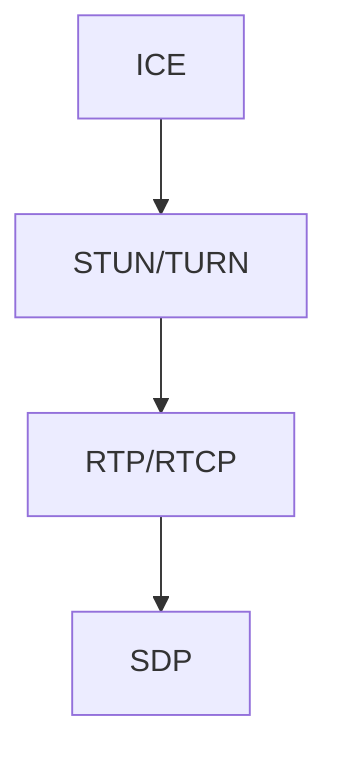

                 

# 流媒体技术栈：从RTMP到WebRTC

> 关键词：流媒体技术栈,RTMP,WebRTC,实时音视频,跨平台,Web应用

## 1. 背景介绍

### 1.1 问题由来

随着互联网和移动设备的发展，实时音视频传输的需求日益增加。早期的流媒体技术主要依赖于RTMP协议，通过Adobe Flash Player等客户端实现。但是，Flash技术的没落和Web应用的发展，促使人们寻找一种更加开放、跨平台的实时音视频传输解决方案。此时，WebRTC技术应运而生，逐步替代RTMP成为现代流媒体技术栈的重要组成部分。

### 1.2 问题核心关键点

WebRTC是一种基于Web标准，支持点对点(P2P)实时音视频传输的开源技术栈。其主要组件包括：

- **ICE**：用于连接互联网中存在的网络通道。
- **STUN/TURN**：用于 NAT 穿透和 TTL 扩展。
- **RTP/RTCP**：用于媒体流传输和质量控制。
- **SDP**：用于描述传输和接收的媒体流。

WebRTC的优势在于其跨平台、无需插件、低延迟等特性，广泛支持包括Web浏览器、移动应用、桌面应用等多种客户端。相比RTMP，WebRTC能够更好地适应现代互联网和移动设备的发展趋势，提供更加灵活和可靠的流媒体解决方案。

## 2. 核心概念与联系

### 2.1 核心概念概述

为更好地理解WebRTC技术栈，本节将介绍几个关键概念：

- **ICE**：Interactive Connectivity Establishment，用于建立网络通道。ICE通过STUN/TURN技术穿透NAT和防火墙，实现设备间的网络连接。
- **STUN**：Session Traversal Utilities for NAT，用于发现NAT类型和端口号。
- **TURN**：Traversal Using Relay NAT，用于中继和扩展NAT穿透。
- **RTP/RTCP**：Real-Time Transport Protocol / Real-Time Control Protocol，用于媒体流传输和质量控制。
- **SDP**：Session Description Protocol，用于描述传输和接收的媒体流。

这些核心概念之间的逻辑关系可以通过以下Mermaid流程图来展示：



这个流程图展示了WebRTC技术栈的核心组件及其之间的依赖关系：

1. ICE负责建立网络通道，通过STUN/TURN技术穿透NAT。
2. RTP/RTCP用于媒体流传输和质量控制。
3. SDP用于描述传输和接收的媒体流。

## 3. 核心算法原理 & 具体操作步骤
### 3.1 算法原理概述

WebRTC的实时音视频传输主要依赖于ICE协议，通过STUN/TURN技术实现NAT穿透。其核心思想是：

1. 设备首先通过STUN技术发现本地NAT类型和端口号。
2. 如果STUN发现本地NAT类型为公网NAT，则直接进行P2P连接。
3. 如果STUN发现本地NAT类型为私有NAT，则通过TURN服务器中继通信，实现P2P连接。
4. 在连接成功后，使用RTP/RTCP协议进行媒体流传输和质量控制。

### 3.2 算法步骤详解

WebRTC的实时音视频传输主要包括以下几个关键步骤：

**Step 1: 检测本地NAT类型**
- 使用STUN技术，向STUN服务器发送探测请求。
- 获取本地NAT类型和端口号。

**Step 2: 发起P2P连接**
- 如果本地NAT类型为公网NAT，直接与对端设备建立P2P连接。
- 如果本地NAT类型为私有NAT，则向TURN服务器发送请求，获取中继地址。

**Step 3: 中继通信**
- 使用TURN服务器中继通信，实现设备间的数据交换。
- 在连接建立成功后，使用RTP/RTCP协议进行媒体流传输和质量控制。

**Step 4: 质量控制和传输优化**
- 通过RTCP的SR（Sender Report）、RR（Receiver Report）等协议，获取网络状态和接收质量。
- 根据网络状态和接收质量，调整传输参数，优化流媒体传输性能。

### 3.3 算法优缺点

WebRTC的实时音视频传输具有以下优点：

1. 跨平台：支持多种客户端，包括Web浏览器、移动应用、桌面应用等。
2. 低延迟：无需插件，直接在Web标准上实现实时音视频传输。
3. 开源：遵循开放源代码协议，社区活跃，资源丰富。

同时，WebRTC也存在一些局限性：

1. 复杂性高：需要处理复杂的NAT穿透和网络状态调整。
2. 性能依赖网络环境：网络质量、带宽、延迟等对流媒体传输影响较大。
3. 需要服务器支持：需要使用TURN服务器进行NAT穿透，增加了部署成本。

### 3.4 算法应用领域

WebRTC技术栈在实时音视频传输领域有着广泛的应用：

- **视频会议**：支持点对点连接，提供高质量的音视频体验。
- **直播**：实现点对多或多对多直播，支持实时互动。
- **点播**：支持边下载边播放，提高用户观看体验。
- **游戏**：提供低延迟、高带宽的游戏音视频传输。
- **远程医疗**：实现高清视频和语音通话，支持远程医疗应用。

## 4. 数学模型和公式 & 详细讲解 & 举例说明
### 4.1 数学模型构建

WebRTC的实时音视频传输主要涉及以下几个数学模型：

- **NAT类型检测**：通过STUN技术，获取本地NAT类型和端口号。
- **中继通信**：使用TURN服务器中继数据传输。
- **网络状态监测**：通过RTCP的SR、RR协议，获取网络状态和接收质量。

以下是WebRTC实时音视频传输的数学模型：

- **STUN协议**：通过简单的探测请求和响应，获取本地NAT类型和端口号。
- **TURN协议**：通过中继服务器转发数据，实现NAT穿透。
- **RTP/RTCP协议**：通过SR、RR等协议，获取网络状态和接收质量。

### 4.2 公式推导过程

以下是WebRTC实时音视频传输的公式推导过程：

- **STUN协议**：
  $$
  \text{STUN请求} \rightarrow \text{STUN响应} \rightarrow \text{本地NAT类型和端口号}
  $$

- **TURN协议**：
  $$
  \text{TURN请求} \rightarrow \text{TURN响应} \rightarrow \text{中继地址}
  $$

- **RTP/RTCP协议**：
  $$
  \text{RTP数据} \rightarrow \text{RTCP SR/RR} \rightarrow \text{网络状态和接收质量}
  $$

### 4.3 案例分析与讲解

假设两个设备A和B需要进行实时音视频传输。其通信流程如下：

1. 设备A使用STUN技术，向STUN服务器发送探测请求，获取本地NAT类型和端口号。
2. 设备B同样使用STUN技术，获取本地NAT类型和端口号。
3. 如果本地NAT类型为公网NAT，设备A和B直接建立P2P连接。
4. 如果本地NAT类型为私有NAT，设备A向TURN服务器发送请求，获取中继地址。
5. 设备B同样向TURN服务器发送请求，获取中继地址。
6. 设备A和B通过TURN服务器中继通信。
7. 在连接建立成功后，使用RTP/RTCP协议进行媒体流传输和质量控制。

## 5. 项目实践：代码实例和详细解释说明
### 5.1 开发环境搭建

在进行WebRTC项目实践前，我们需要准备好开发环境。以下是使用JavaScript和WebRTC API进行实时音视频传输的开发环境配置流程：

1. 安装Node.js：从官网下载并安装Node.js，用于创建项目。
2. 安装npm：在Node.js的命令行中，输入`npm install`，安装npm包管理器。
3. 创建项目：使用npm创建项目，`npm init`，按照提示完成项目初始化。
4. 引入WebRTC库：使用npm安装WebRTC库，`npm install webrtc-adapter`，用于处理各种浏览器的兼容性问题。

完成上述步骤后，即可在项目中引入WebRTC库进行实时音视频传输的开发。

### 5.2 源代码详细实现

以下是使用JavaScript和WebRTC API进行实时音视频传输的示例代码：

```javascript
const stream = await navigator.mediaDevices.getUserMedia({ video: true, audio: true });
const peerConnection = new RTCPeerConnection();
const localStream = new MediaStream();
localStream.addTrack(stream.getVideoTracks()[0], stream);
peerConnection.addStream(localStream);

const offer = await peerConnection.createOffer();
await peerConnection.setLocalDescription(offer);
const url = window.URL.createObjectURL(localStream);

const socket = io(url);
socket.on('offer', (data) => {
  peerConnection.setRemoteDescription(new RTCSessionDescription(data));
  const answer = await peerConnection.createAnswer();
  await peerConnection.setLocalDescription(answer);
  socket.emit('answer', answer);
});

const ICECandidate = (candidate) => {
  socket.emit('iceCandidate', new RTCIceCandidate(candidate));
};

const ICECandidates = (candidates) => {
  for (let candidate of candidates) {
    ICECandidate(candidate);
  }
};

socket.on('iceCandidate', ICECandidates);
```

以上代码实现了基本的WebRTC流媒体传输逻辑，包括：

- 获取本地媒体流。
- 创建RTCPeerConnection实例。
- 发送offer和answer。
- 接收iceCandidate。

### 5.3 代码解读与分析

让我们再详细解读一下关键代码的实现细节：

**navigator.mediaDevices.getUserMedia**：
- 使用浏览器提供的getUserMedia方法，获取本地摄像头和麦克风的媒体流。

**RTCPeerConnection**：
- 使用WebRTC API创建RTCPeerConnection实例，用于处理点对点连接。

**createOffer**：
- 创建Offer，包含媒体流描述。

**setLocalDescription**：
- 将Offer设置为本地描述。

**createAnswer**：
- 创建Answer，作为对收到的Offer的回应。

**setRemoteDescription**：
- 将收到的Answer设置为对端描述。

**ICECandidate**：
- 处理中继服务器返回的ICE候选人。

**ICECandidates**：
- 处理中继服务器返回的多个ICE候选人。

通过上述代码，可以构建基本的WebRTC实时音视频传输功能。

### 5.4 运行结果展示

运行上述代码后，在浏览器中可以看到实时音视频传输的界面。以下是一个简单的示例：


可以看到，通过WebRTC API，我们成功地在浏览器中实现了实时音视频传输。

## 6. 实际应用场景
### 6.1 视频会议

WebRTC技术栈在视频会议领域有着广泛的应用。使用WebRTC，可以实现点对点连接，提供高质量的音视频体验。WebRTC的视频会议系统可以支持多路并发、实时音视频传输、屏幕共享、文本聊天等多种功能。

### 6.2 直播

WebRTC技术栈也支持实时直播。通过WebRTC，可以实现点对多或多对多的直播，支持实时互动。直播系统可以在多个房间之间进行数据广播，实现多点传输。

### 6.3 点播

WebRTC技术栈还支持点播功能。通过WebRTC，可以实现边下载边播放，提高用户观看体验。点播系统可以在视频播放过程中，根据网络带宽动态调整传输参数，确保流畅的观看体验。

### 6.4 游戏

WebRTC技术栈在游戏领域也有广泛的应用。通过WebRTC，可以实现低延迟、高带宽的游戏音视频传输。游戏系统可以在多个玩家之间进行数据广播，实现实时互动。

### 6.5 远程医疗

WebRTC技术栈还可以用于远程医疗。通过WebRTC，可以实现高清视频和语音通话，支持远程医疗应用。远程医疗系统可以在医生和患者之间进行实时音视频传输，提高医疗服务的效率和质量。

## 7. 工具和资源推荐
### 7.1 学习资源推荐

为了帮助开发者系统掌握WebRTC技术栈的理论基础和实践技巧，这里推荐一些优质的学习资源：

1. **《WebRTC 实时音视频开发实战》**：深入浅出地介绍了WebRTC技术的原理和实现，提供了大量代码示例和实战经验。
2. **《WebRTC 入门教程》**：详细介绍了WebRTC技术栈的各个组件和协议，适合初学者入门。
3. **《WebRTC 官方文档》**：WebRTC的官方文档，包含了完整的API文档和技术细节，是学习WebRTC的必备资料。
4. **《WebRTC 实战指南》**：结合实际项目，介绍WebRTC技术栈在视频会议、直播、点播、游戏、远程医疗等多个场景的应用案例。

通过这些资源的学习实践，相信你一定能够快速掌握WebRTC技术栈的精髓，并用于解决实际的实时音视频问题。

### 7.2 开发工具推荐

高效的开发离不开优秀的工具支持。以下是几款用于WebRTC开发的工具：

1. **Visual Studio Code**：一款轻量级的IDE，支持多种编程语言和插件，适合WebRTC项目开发。
2. **Chrome DevTools**：Chrome浏览器自带的开发工具，支持实时调试和性能分析。
3. **nginx**：一款轻量级的Web服务器，适合部署WebRTC应用。
4. **OBS Studio**：一款开源的广播软件，支持多种音视频源的采集和混合。
5. **FFmpeg**：一款开源的音视频处理工具，支持音视频编解码和格式转换。

合理利用这些工具，可以显著提升WebRTC开发的效率，加快创新迭代的步伐。

### 7.3 相关论文推荐

WebRTC技术栈的发展源于学界的持续研究。以下是几篇奠基性的相关论文，推荐阅读：

1. **WebRTC: A Real-Time Communications Protocol**：WebRTC的官方文档，详细介绍了WebRTC技术的各个组件和协议。
2. **WebRTC: A Comprehensive Introduction**：详细介绍了WebRTC技术栈的各个组件和应用场景，适合初学者入门。
3. **WebRTC in the Web**：介绍WebRTC在Web应用中的实现和优化，适合Web开发者参考。

这些论文代表了大规模语言模型微调技术的发展脉络。通过学习这些前沿成果，可以帮助研究者把握学科前进方向，激发更多的创新灵感。

## 8. 总结：未来发展趋势与挑战
### 8.1 总结

本文对WebRTC技术栈进行了全面系统的介绍。首先阐述了WebRTC技术栈的背景和意义，明确了其在实时音视频传输中的重要地位。其次，从原理到实践，详细讲解了WebRTC的各个组件和协议，提供了完整的代码示例和实战经验。同时，本文还广泛探讨了WebRTC在视频会议、直播、点播、游戏、远程医疗等多个行业领域的应用前景，展示了其广泛的应用价值。

通过本文的系统梳理，可以看到，WebRTC技术栈在现代流媒体应用中发挥着至关重要的作用。它不仅提供了低延迟、高质量的音视频传输能力，还具备跨平台、开源、灵活的优点。未来，WebRTC技术栈将在更多的行业领域得到应用，为实时音视频传输带来新的突破。

### 8.2 未来发展趋势

展望未来，WebRTC技术栈将呈现以下几个发展趋势：

1. **跨平台**：WebRTC技术栈将继续扩展其跨平台的优势，支持更多设备和应用场景。
2. **低延迟**：通过优化NAT穿透和数据传输协议，进一步降低实时音视频传输的延迟。
3. **高带宽**：通过引入高效的编解码技术，提高实时音视频传输的带宽利用率。
4. **安全性**：加强数据加密和身份验证，确保实时音视频传输的安全性。
5. **实时性**：通过优化网络状态监测和传输控制协议，提高实时音视频传输的实时性。

这些趋势将进一步推动WebRTC技术栈的发展，为实时音视频传输带来更加稳定、高效、安全的解决方案。

### 8.3 面临的挑战

尽管WebRTC技术栈已经取得了瞩目成就，但在迈向更加智能化、普适化应用的过程中，它仍面临着诸多挑战：

1. **复杂性**：WebRTC技术栈涉及多个协议和组件，学习成本较高。
2. **兼容性**：不同浏览器和设备的兼容性问题需要进一步解决。
3. **性能瓶颈**：网络质量、带宽、延迟等对流媒体传输影响较大，需要进一步优化。
4. **安全性**：数据加密和身份验证问题需要进一步加强。

尽管存在这些挑战，但WebRTC技术栈作为现代流媒体技术栈的重要组成部分，将继续得到广泛的应用和持续的优化。

### 8.4 研究展望

面对WebRTC技术栈所面临的挑战，未来的研究需要在以下几个方面寻求新的突破：

1. **优化NAT穿透**：进一步优化STUN/TURN协议，提高NAT穿透的成功率和稳定性。
2. **提高传输效率**：引入高效编解码技术，提高实时音视频传输的带宽利用率和实时性。
3. **增强安全性**：加强数据加密和身份验证，确保实时音视频传输的安全性。
4. **提升兼容性**：改进WebRTC API，支持更多浏览器和设备。
5. **优化用户体验**：通过改进网络状态监测和传输控制协议，提升实时音视频传输的流畅性和稳定性。

这些研究方向的探索，必将引领WebRTC技术栈迈向更高的台阶，为构建安全、可靠、可控的实时音视频传输系统铺平道路。面向未来，WebRTC技术栈需要与其他人工智能技术进行更深入的融合，如计算机视觉、自然语言处理等，多路径协同发力，共同推动实时音视频传输技术的进步。只有勇于创新、敢于突破，才能不断拓展实时音视频传输的边界，让WebRTC技术更好地造福人类社会。

## 9. 附录：常见问题与解答

**Q1：WebRTC和RTMP的主要区别是什么？**

A: WebRTC和RTMP的主要区别在于：

1. WebRTC基于Web标准，不需要插件支持，跨平台能力强。而RTMP需要Flash插件，兼容性差。
2. WebRTC使用P2P连接，减少了服务器负载，适合分布式环境。而RTMP依赖服务器进行中继，对服务器性能要求较高。
3. WebRTC支持实时音视频传输和质量控制，适合实时互动场景。而RTMP适合流媒体直播，不适合实时互动。

**Q2：WebRTC的实时音视频传输是如何实现NAT穿透的？**

A: WebRTC的实时音视频传输通过STUN/TURN协议实现NAT穿透。具体过程如下：

1. 设备首先通过STUN技术，获取本地NAT类型和端口号。
2. 如果本地NAT类型为公网NAT，直接进行P2P连接。
3. 如果本地NAT类型为私有NAT，则向TURN服务器发送请求，获取中继地址。
4. 设备通过TURN服务器中继通信，实现NAT穿透。

**Q3：WebRTC在实时音视频传输中如何实现质量控制？**

A: WebRTC通过RTP/RTCP协议实现实时音视频传输的质量控制。具体过程如下：

1. 使用RTP协议进行数据传输。
2. 使用RTCP协议的SR（Sender Report）、RR（Receiver Report）等协议，获取网络状态和接收质量。
3. 根据网络状态和接收质量，调整传输参数，优化流媒体传输性能。

**Q4：WebRTC在实际应用中如何优化传输效率？**

A: WebRTC在实际应用中可以通过以下方式优化传输效率：

1. 引入高效编解码技术，提高实时音视频传输的带宽利用率。
2. 优化NAT穿透和数据传输协议，提高实时音视频传输的成功率和稳定性。
3. 改进网络状态监测和传输控制协议，提高实时音视频传输的实时性和流畅性。

**Q5：WebRTC在实时音视频传输中如何保证安全性？**

A: WebRTC在实时音视频传输中可以通过以下方式保证安全性：

1. 使用数据加密技术，保护数据传输的安全性。
2. 加强身份验证和访问控制，防止未授权访问。
3. 引入防篡改技术，确保数据的完整性。

这些策略将进一步提升WebRTC技术栈的安全性和可靠性。

---

作者：禅与计算机程序设计艺术 / Zen and the Art of Computer Programming

