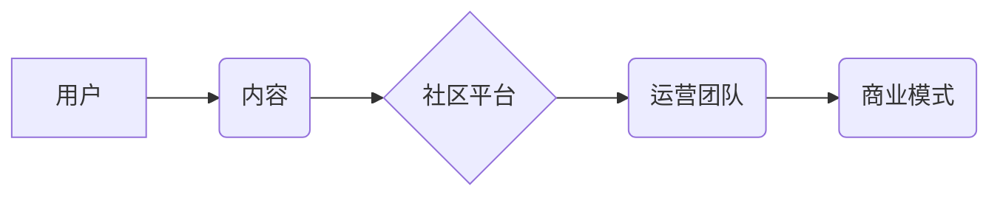

                 

## 技术社区运营：从管理到盈利模式

> 关键词：技术社区、社区运营、社区管理、盈利模式、用户增长、内容运营、商业化

### 1. 背景介绍

在当今数字时代，技术社区已成为科技领域不可或缺的一部分。它们为开发者、工程师、爱好者提供了一个交流、学习、协作的平台，推动技术进步和创新。随着技术发展日新月异，技术社区的规模和影响力也在不断扩大，其运营模式也日益复杂。

传统技术社区往往以开源项目、论坛、博客等形式存在，依靠志愿者和爱好者的热情驱动。然而，随着社区规模的增长，单纯依靠志愿者难以满足社区的运营需求，如何实现社区的可持续发展和盈利成为一个重要的课题。

### 2. 核心概念与联系

**2.1 技术社区运营的核心概念**

技术社区运营是一个多维度的概念，涉及到用户管理、内容运营、社区建设、商业化等多个方面。

* **用户管理:**  是指对社区用户的招募、引导、留存和活跃度提升等方面的管理。
* **内容运营:**  是指围绕社区主题，策划、创作、发布和管理高质量的内容，吸引用户参与和互动。
* **社区建设:**  是指打造一个活跃、友好的社区氛围，鼓励用户交流、分享和协作。
* **商业化:**  是指通过多种方式为社区运营提供资金支持，实现可持续发展。

**2.2 技术社区运营的架构**

技术社区运营的架构可以概括为以下几个层级：



* **用户:**  社区的核心，是社区运营的最终目标。
* **内容:**  是社区运营的灵魂，吸引用户参与和互动。
* **社区平台:**  是用户和内容交互的载体，提供各种功能和服务。
* **运营团队:**  负责社区的运营管理，包括用户管理、内容运营、社区建设等。
* **商业模式:**  是社区的生存和发展基础，为社区运营提供资金支持。

### 3. 核心算法原理 & 具体操作步骤

**3.1 算法原理概述**

技术社区运营中，算法可以用于用户画像、内容推荐、社区活跃度分析等方面。例如，基于用户的行为数据，可以使用协同过滤算法推荐相关的用户和内容，提高用户粘性和活跃度。

**3.2 算法步骤详解**

以协同过滤算法为例，其具体步骤如下：

1. **数据收集:**  收集用户行为数据，例如用户浏览记录、点赞记录、评论记录等。
2. **用户相似度计算:**  使用余弦相似度等算法计算用户之间的相似度。
3. **内容相似度计算:**  使用余弦相似度等算法计算内容之间的相似度。
4. **推荐算法:**  根据用户相似度和内容相似度，推荐用户可能感兴趣的内容。

**3.3 算法优缺点**

* **优点:**  能够根据用户的兴趣偏好进行个性化推荐，提高用户体验。
* **缺点:**  需要大量的用户行为数据进行训练，容易出现冷启动问题，即对于新用户和新内容难以进行推荐。

**3.4 算法应用领域**

协同过滤算法广泛应用于电商推荐、音乐推荐、电影推荐等领域，在技术社区运营中，可以用于推荐相关用户、项目、文档等。

### 4. 数学模型和公式 & 详细讲解 & 举例说明

**4.1 数学模型构建**

协同过滤算法的核心是用户-项目评分矩阵，其中每个元素表示用户对项目的评分。

**4.2 公式推导过程**

用户相似度可以使用余弦相似度公式计算：

$$
\text{相似度}(u_i, u_j) = \frac{\sum_{k=1}^{n} r_{ik} \cdot r_{jk}}{\sqrt{\sum_{k=1}^{n} r_{ik}^2} \cdot \sqrt{\sum_{k=1}^{n} r_{jk}^2}}
$$

其中：

* $u_i$ 和 $u_j$ 是两个用户
* $r_{ik}$ 是用户 $u_i$ 对项目 $k$ 的评分
* $n$ 是项目总数

**4.3 案例分析与讲解**

假设有两个用户 Alice 和 Bob，他们对三个项目 A、B、C 的评分如下：

| 用户 | 项目 A | 项目 B | 项目 C |
|---|---|---|---|
| Alice | 5 | 3 | 4 |
| Bob | 4 | 5 | 3 |

使用余弦相似度公式计算 Alice 和 Bob 的相似度：

$$
\text{相似度}(Alice, Bob) = \frac{(5 \cdot 4) + (3 \cdot 5) + (4 \cdot 3)}{\sqrt{(5^2 + 3^2 + 4^2)} \cdot \sqrt{(4^2 + 5^2 + 3^2)}} = 0.8
$$

结果表明，Alice 和 Bob 的相似度为 0.8，说明他们对项目的喜好有一定的相似性。

### 5. 项目实践：代码实例和详细解释说明

**5.1 开发环境搭建**

可以使用 Python 语言和相应的库进行协同过滤算法的实现。

**5.2 源代码详细实现**

```python
import numpy as np

def cosine_similarity(vector1, vector2):
  """计算两个向量的余弦相似度。"""
  dot_product = np.dot(vector1, vector2)
  norm1 = np.linalg.norm(vector1)
  norm2 = np.linalg.norm(vector2)
  return dot_product / (norm1 * norm2)

# 用户评分矩阵
ratings = np.array([
  [5, 3, 4],
  [4, 5, 3]
])

# 计算用户相似度
user_similarity = np.zeros((ratings.shape[0], ratings.shape[0]))
for i in range(ratings.shape[0]):
  for j in range(i + 1, ratings.shape[0]):
    user_similarity[i, j] = cosine_similarity(ratings[i], ratings[j])
    user_similarity[j, i] = user_similarity[i, j]

# 打印用户相似度矩阵
print(user_similarity)
```

**5.3 代码解读与分析**

* `cosine_similarity()` 函数计算两个向量的余弦相似度。
* `ratings` 变量存储用户评分矩阵。
* 循环计算所有用户之间的相似度，并存储在 `user_similarity` 矩阵中。

**5.4 运行结果展示**

运行代码后，会输出用户相似度矩阵，其中每个元素表示两个用户之间的相似度。

### 6. 实际应用场景

技术社区运营中，协同过滤算法可以用于以下场景：

* **用户推荐:**  根据用户的兴趣偏好，推荐其他用户或项目。
* **内容推荐:**  根据用户的浏览记录和点赞记录，推荐相关内容。
* **社区活跃度分析:**  分析用户之间的互动关系，识别活跃用户和潜在活跃用户。

### 7. 工具和资源推荐

**7.1 学习资源推荐**

* **书籍:**  《推荐系统实践》
* **在线课程:**  Coursera 上的《推荐系统》课程

**7.2 开发工具推荐**

* **Python:**  一个常用的编程语言，用于实现协同过滤算法。
* **Scikit-learn:**  一个机器学习库，提供协同过滤算法的实现。

**7.3 相关论文推荐**

* **协同过滤算法的经典论文:**  
    * "Collaborative Filtering: A User-Based Approach"
    * "Memory-Based Collaborative Filtering"

### 8. 总结：未来发展趋势与挑战

**8.1 研究成果总结**

技术社区运营的算法研究取得了显著进展，协同过滤算法等方法为社区运营提供了有效的工具。

**8.2 未来发展趋势**

* **深度学习:**  将深度学习技术应用于社区运营，提高推荐算法的准确性和个性化程度。
* **多模态推荐:**  结合文本、图片、视频等多模态数据进行推荐，提供更丰富的用户体验。
* **社区治理:**  利用算法辅助社区管理，提高社区的活跃度和安全性。

**8.3 面临的挑战**

* **数据隐私:**  如何保护用户数据隐私，是社区运营面临的重要挑战。
* **算法公平性:**  算法推荐结果可能存在偏差，需要保证算法的公平性和可解释性。
* **社区生态建设:**  算法只是社区运营的一部分，还需要注重社区文化的建设和用户之间的互动。

**8.4 研究展望**

未来，技术社区运营的研究将更加注重算法的公平性、可解释性和安全性，同时也将更加关注社区生态的建设和用户体验的提升。


### 9. 附录：常见问题与解答

**9.1 如何提高协同过滤算法的准确性？**

* 增加用户行为数据的量和质量。
* 使用更复杂的算法模型，例如矩阵分解算法。
* 结合其他数据源，例如用户画像数据。

**9.2 如何解决协同过滤算法的冷启动问题？**

* 使用基于内容的推荐算法，推荐与用户兴趣相关的项目。
* 利用用户属性信息进行推荐。
* 使用迁移学习技术，将已有的知识迁移到新的用户和项目。


作者：禅与计算机程序设计艺术 / Zen and the Art of Computer Programming 
<end_of_turn>

