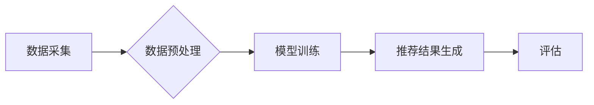

                 

## 1. 背景介绍

在当今数据爆炸的时代，电商平台面临着巨大的挑战：如何精准地推荐商品给用户，提高转化率，并最终提升用户忠诚度。传统的基于规则的推荐系统已经难以满足用户的个性化需求，而基于机器学习的推荐系统则逐渐成为主流。近年来，随着深度学习技术的快速发展，基于AI的大模型在推荐系统领域展现出强大的潜力，能够更好地理解用户的需求，提供更精准、更个性化的推荐，从而提升电商平台的整体运营效率。

## 2. 核心概念与联系

### 2.1  搜索推荐系统

搜索推荐系统是将搜索引擎和推荐系统的功能结合起来，为用户提供更精准、更全面的商品搜索和推荐结果。它可以根据用户的搜索关键词、浏览历史、购买记录等信息，推荐与用户需求相关的商品，提高用户的购物体验。

### 2.2  AI 大模型

AI大模型是指在海量数据上训练的深度学习模型，拥有强大的泛化能力和学习能力。它可以用于各种自然语言处理任务，例如文本分类、机器翻译、问答系统等，在推荐系统领域，AI大模型可以学习用户的兴趣偏好，并根据用户的行为数据进行精准的商品推荐。

### 2.3  推荐系统架构

推荐系统通常由以下几个模块组成：

* 数据采集模块：负责收集用户行为数据，例如搜索记录、浏览记录、购买记录、评分等。
* 数据预处理模块：对收集到的数据进行清洗、转换、特征提取等操作，以便于模型训练。
* 模型训练模块：利用机器学习算法，训练推荐模型，例如协同过滤、内容过滤、深度学习等。
* 推荐结果生成模块：根据用户的特征和模型的预测结果，生成推荐商品列表。
* 评估模块：对推荐系统的性能进行评估，例如准确率、召回率、点击率等。

**Mermaid 流程图**



## 3. 核心算法原理 & 具体操作步骤

### 3.1  算法原理概述

在搜索推荐系统中，常用的算法包括协同过滤、内容过滤和深度学习等。

* **协同过滤**：根据用户的历史行为数据，预测用户对商品的喜好。
* **内容过滤**：根据商品的特征信息，推荐与用户兴趣相符的商品。
* **深度学习**：利用深度神经网络，学习用户的兴趣偏好和商品的特征，进行更精准的推荐。

### 3.2  算法步骤详解

以协同过滤算法为例，其具体步骤如下：

1. **数据收集**: 收集用户对商品的评分或购买记录等行为数据。
2. **用户-商品矩阵构建**: 将用户和商品作为矩阵的行和列，将用户对商品的评分或购买记录作为矩阵的元素。
3. **相似度计算**: 计算用户之间的相似度或商品之间的相似度。常用的相似度计算方法包括余弦相似度、皮尔逊相关系数等。
4. **推荐生成**: 根据用户的相似用户或商品的相似商品，推荐用户可能感兴趣的商品。

### 3.3  算法优缺点

**协同过滤算法**

* **优点**: 可以发现隐含的用户偏好，推荐个性化商品。
* **缺点**: 数据稀疏性问题，新用户新商品推荐困难。

**内容过滤算法**

* **优点**: 不需要用户历史行为数据，可以推荐新商品。
* **缺点**: 容易陷入“同质化推荐”问题，缺乏个性化。

**深度学习算法**

* **优点**: 可以学习更复杂的特征，推荐更精准的商品。
* **缺点**: 需要大量数据进行训练，模型训练复杂。

### 3.4  算法应用领域

协同过滤、内容过滤和深度学习算法广泛应用于电商平台、社交媒体、音乐平台等领域，用于推荐商品、内容、好友等。

## 4. 数学模型和公式 & 详细讲解 & 举例说明

### 4.1  数学模型构建

协同过滤算法的数学模型可以表示为用户-商品评分矩阵的预测问题。假设用户 $u$ 对商品 $i$ 的评分为 $r_{ui}$，则目标是预测用户 $u$ 对商品 $i$ 的评分。

### 4.2  公式推导过程

常用的协同过滤算法包括基于用户的协同过滤和基于物品的协同过滤。

* **基于用户的协同过滤**: 预测用户 $u$ 对商品 $i$ 的评分，可以根据用户 $u$ 相似用户的评分进行加权平均。

$$
\hat{r}_{ui} = \frac{\sum_{v \in N(u)} \frac{sim(u,v)}{d(u,v)} r_{vi}}{\sum_{v \in N(u)} \frac{sim(u,v)}{d(u,v)}}
$$

其中，$N(u)$ 表示用户 $u$ 的相似用户集合，$sim(u,v)$ 表示用户 $u$ 和用户 $v$ 的相似度，$d(u,v)$ 表示用户 $u$ 和用户 $v$ 之间的距离。

* **基于物品的协同过滤**: 预测用户 $u$ 对商品 $i$ 的评分，可以根据商品 $i$ 相似商品的评分进行加权平均。

$$
\hat{r}_{ui} = \frac{\sum_{j \in N(i)} \frac{sim(i,j)}{d(i,j)} r_{uj}}{\sum_{j \in N(i)} \frac{sim(i,j)}{d(i,j)}}
$$

其中，$N(i)$ 表示商品 $i$ 的相似商品集合，$sim(i,j)$ 表示商品 $i$ 和商品 $j$ 的相似度，$d(i,j)$ 表示商品 $i$ 和商品 $j$ 之间的距离。

### 4.3  案例分析与讲解

假设有一个电商平台，用户 $A$ 对商品 $X$ 和商品 $Y$ 都评分为 5，用户 $B$ 对商品 $Y$ 和商品 $Z$ 都评分为 4。如果我们想预测用户 $A$ 对商品 $Z$ 的评分，可以使用基于用户的协同过滤算法。

根据用户 $A$ 和用户 $B$ 的评分数据，我们可以计算出用户 $A$ 和用户 $B$ 的相似度。假设用户 $A$ 和用户 $B$ 的相似度为 0.8。

然后，我们可以使用公式计算用户 $A$ 对商品 $Z$ 的预测评分：

$$
\hat{r}_{AZ} = \frac{0.8 \times 4}{0.8} = 4
$$

因此，根据基于用户的协同过滤算法，我们预测用户 $A$ 对商品 $Z$ 的评分为 4。

## 5. 项目实践：代码实例和详细解释说明

### 5.1  开发环境搭建

推荐系统开发环境通常包括以下软件：

* Python 语言环境
* 深度学习框架，例如 TensorFlow、PyTorch
* 数据处理工具，例如 Pandas、NumPy
* 可视化工具，例如 Matplotlib、Seaborn

### 5.2  源代码详细实现

以下是一个基于协同过滤算法的简单推荐系统代码示例：

```python
import pandas as pd
from sklearn.metrics.pairwise import cosine_similarity

# 加载用户-商品评分数据
ratings = pd.read_csv('ratings.csv')

# 计算用户之间的相似度
user_similarity = cosine_similarity(ratings)

# 预测用户对商品的评分
def predict_rating(user_id, item_id):
    # 获取用户相似用户
    similar_users = user_similarity[user_id].argsort()[:-10:-1]
    # 计算预测评分
    predicted_rating = sum([ratings.loc[similar_users[i], item_id] for i in range(len(similar_users))]) / len(similar_users)
    return predicted_rating

# 预测用户 1 对商品 5 的评分
predicted_rating = predict_rating(1, 5)
print(f'用户 1 对商品 5 的预测评分: {predicted_rating}')
```

### 5.3  代码解读与分析

* 代码首先加载用户-商品评分数据。
* 然后使用 cosine_similarity 函数计算用户之间的相似度。
* predict_rating 函数用于预测用户对商品的评分，它首先获取用户相似用户，然后根据相似用户的评分进行加权平均，得到预测评分。

### 5.4  运行结果展示

运行代码后，会输出用户 1 对商品 5 的预测评分。

## 6. 实际应用场景

### 6.1  电商平台

电商平台可以利用搜索推荐系统，根据用户的搜索历史、浏览记录、购买记录等信息，推荐与用户需求相符的商品，提高用户的购物体验和转化率。

### 6.2  社交媒体

社交媒体平台可以利用搜索推荐系统，推荐用户可能感兴趣的内容，例如新闻、视频、图片等，提高用户的活跃度和粘性。

### 6.3  音乐平台

音乐平台可以利用搜索推荐系统，推荐用户可能喜欢的音乐，例如歌曲、专辑、艺术家等，提高用户的音乐体验和付费率。

### 6.4  未来应用展望

随着人工智能技术的不断发展，搜索推荐系统将更加智能化、个性化。未来，搜索推荐系统将能够更好地理解用户的需求，提供更精准、更全面的推荐，从而提升用户体验和平台运营效率。

## 7. 工具和资源推荐

### 7.1  学习资源推荐

* **书籍**:
    * 《推荐系统》
    * 《深度学习》
* **在线课程**:
    * Coursera 上的推荐系统课程
    * Udacity 上的深度学习课程

### 7.2  开发工具推荐

* **Python**: 
    * TensorFlow
    * PyTorch
    * Scikit-learn
* **数据处理工具**:
    * Pandas
    * NumPy

### 7.3  相关论文推荐

* **协同过滤**:
    * "Collaborative Filtering: A User-Based Approach"
* **深度学习**:
    * "Deep Learning for Recommender Systems"

## 8. 总结：未来发展趋势与挑战

### 8.1  研究成果总结

近年来，搜索推荐系统在电商平台、社交媒体、音乐平台等领域取得了显著的成果，能够有效地提高用户体验和平台运营效率。

### 8.2  未来发展趋势

* **个性化推荐**: 更加注重用户的个性化需求，提供更精准、更全面的推荐。
* **跨平台推荐**: 将不同平台的用户数据进行整合，提供更丰富的推荐内容。
* **实时推荐**: 基于用户的实时行为数据，提供更及时、更准确的推荐。

### 8.3  面临的挑战

* **数据稀疏性**: 用户行为数据往往是稀疏的，难以训练出准确的推荐模型。
* **冷启动问题**: 新用户和新商品难以进行推荐。
* **公平性问题**: 推荐算法可能存在偏见，导致不公平的推荐结果。

### 8.4  研究展望

未来，搜索推荐系统将继续朝着更加智能化、个性化、公平化的方向发展，需要进一步研究解决数据稀疏性、冷启动问题和公平性问题等挑战。

## 9. 附录：常见问题与解答

* **Q1**: 如何解决数据稀疏性问题？
* **A1**: 可以使用矩阵分解、隐语义模型等方法，将用户-商品评分矩阵进行低维表示，降低数据稀疏性。
* **Q2**: 如何解决冷启动问题？
* **A2**: 可以利用用户画像、商品特征等信息，对新用户和新商品进行推荐。
* **Q3**: 如何保证推荐算法的公平性？
* **A3**: 可以使用公平性约束条件，在训练推荐模型时，保证推荐结果的公平性。


作者：禅与计算机程序设计艺术 / Zen and the Art of Computer Programming 
<end_of_turn>

