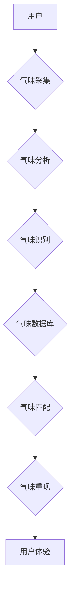

                 

## 数字化气味存储创业：珍贵记忆的嗅觉重现

> 关键词：气味存储、电子鼻、人工智能、嗅觉记忆、创业机会、数字化体验

### 1. 背景介绍

人类五感中，嗅觉与记忆有着密不可分的联系。一缕熟悉的香味，往往能瞬间唤起我们脑海中尘封的记忆，带我们回到过去某个特定的时间和地点。然而，传统的存储方式无法捕捉和记录气味信息，这使得我们无法将珍贵的嗅觉记忆数字化保存和分享。

近年来，随着人工智能、传感器技术和化学分析技术的快速发展，数字化气味存储技术逐渐成为现实。电子鼻作为气味感知的核心设备，能够识别和分析各种气味分子，并将其转化为数字信号。结合人工智能算法，我们可以对气味进行分类、识别、匹配和合成，实现气味信息的数字化存储、检索和重现。

### 2. 核心概念与联系

#### 2.1  电子鼻

电子鼻是一种模仿人类嗅觉功能的电子设备，它利用化学传感器阵列来检测气味分子，并通过信号处理和分析算法识别气味种类和浓度。

#### 2.2  气味数据库

气味数据库是存储和管理气味信息的数据库，它包含了气味特征、描述、分类、关联等信息。

#### 2.3  人工智能算法

人工智能算法，例如机器学习和深度学习，可以用于气味识别、分类、匹配和合成。

**核心概念架构流程图**



### 3. 核心算法原理 & 具体操作步骤

#### 3.1  算法原理概述

数字化气味存储的核心算法原理是将气味分子转化为数字信号，并通过人工智能算法进行分析和处理。

* **气味感知:** 电子鼻利用化学传感器阵列检测气味分子，每个传感器对特定气味分子具有不同的响应。
* **信号处理:** 电子鼻将传感器输出的模拟信号转换为数字信号，并进行预处理，例如去噪和平滑。
* **气味特征提取:** 利用机器学习算法从数字信号中提取气味特征，例如峰值、波形、时间序列等。
* **气味识别和分类:** 利用深度学习算法对气味特征进行分类和识别，将气味与数据库中的气味信息进行匹配。
* **气味合成:** 根据气味数据库中的信息，利用化学合成技术或电子鼻模拟器合成目标气味。

#### 3.2  算法步骤详解

1. **气味采集:** 使用电子鼻采集目标气味的样本。
2. **信号处理:** 对电子鼻输出的模拟信号进行数字化转换，并进行去噪和平滑处理。
3. **气味特征提取:** 利用机器学习算法，例如主成分分析 (PCA) 或线性判别分析 (LDA)，从数字信号中提取气味特征。
4. **气味识别和分类:** 利用深度学习算法，例如卷积神经网络 (CNN) 或循环神经网络 (RNN)，对提取的气味特征进行分类和识别。
5. **气味匹配:** 将识别出的气味特征与气味数据库中的气味信息进行匹配，找到最相似的气味。
6. **气味重现:** 根据匹配结果，利用化学合成技术或电子鼻模拟器合成目标气味。

#### 3.3  算法优缺点

**优点:**

* **高精度:** 深度学习算法能够实现高精度的气味识别和分类。
* **可扩展性:** 气味数据库可以不断扩展，包含更多气味信息。
* **个性化体验:** 可以根据用户的喜好定制气味体验。

**缺点:**

* **成本高:** 电子鼻和深度学习算法的开发和部署成本较高。
* **数据量大:** 训练深度学习算法需要大量的气味数据。
* **气味复杂性:** 气味识别和分类仍然是一个复杂的技术挑战。

#### 3.4  算法应用领域

* **食品和饮料:** 气味识别和分类可以用于食品质量检测、风味分析和产品开发。
* **医疗保健:** 气味检测可以用于疾病诊断、药物研发和患者监测。
* **环境监测:** 气味传感器可以用于检测空气污染、泄漏气体和危险物质。
* **个人化体验:** 数字化气味存储可以用于定制香水、家居环境和个人记忆体验。

### 4. 数学模型和公式 & 详细讲解 & 举例说明

#### 4.1  数学模型构建

气味识别和分类可以使用机器学习算法，例如支持向量机 (SVM) 或决策树，构建数学模型。

* **支持向量机 (SVM):** SVM 是一种监督学习算法，它将数据映射到高维空间，并在高维空间中找到一个最佳的分隔超平面，将不同类别的气味数据分开。

* **决策树:** 决策树是一种树形结构的分类算法，它通过一系列的决策规则来将数据分类。

#### 4.2  公式推导过程

SVM 的目标函数是：

$$
min_{w,b} \frac{1}{2} ||w||^2 + C \sum_{i=1}^{n} \xi_i
$$

其中：

* $w$ 是权重向量
* $b$ 是偏置项
* $C$ 是惩罚参数
* $\xi_i$ 是松弛变量

#### 4.3  案例分析与讲解

假设我们有一个气味数据库，包含了不同种类的花香气味数据。我们可以使用 SVM 算法将这些气味数据进行分类，例如将玫瑰香、百合香和茉莉香进行区分。

通过训练 SVM 模型，我们可以得到一个最佳的分隔超平面，将不同种类的花香气味数据分开。然后，我们可以使用这个模型来识别新的花香气味数据。

### 5. 项目实践：代码实例和详细解释说明

#### 5.1  开发环境搭建

* **操作系统:** Ubuntu 20.04
* **编程语言:** Python 3.8
* **深度学习框架:** TensorFlow 2.0
* **电子鼻驱动库:** Adafruit_Sensor

#### 5.2  源代码详细实现

```python
# 导入必要的库
import tensorflow as tf
from tensorflow.keras.models import Sequential
from tensorflow.keras.layers import Dense, Dropout

# 定义气味识别模型
model = Sequential()
model.add(Dense(128, activation='relu', input_shape=(100,)))
model.add(Dropout(0.2))
model.add(Dense(64, activation='relu'))
model.add(Dropout(0.2))
model.add(Dense(3, activation='softmax'))

# 编译模型
model.compile(optimizer='adam',
              loss='sparse_categorical_crossentropy',
              metrics=['accuracy'])

# 训练模型
model.fit(X_train, y_train, epochs=10, batch_size=32)

# 评估模型
loss, accuracy = model.evaluate(X_test, y_test)
print('Loss:', loss)
print('Accuracy:', accuracy)

# 使用模型预测气味
predictions = model.predict(X_new)
```

#### 5.3  代码解读与分析

* **数据预处理:** 首先需要对气味数据进行预处理，例如去噪、平滑和特征提取。
* **模型构建:** 使用深度学习框架构建气味识别模型，例如卷积神经网络 (CNN) 或循环神经网络 (RNN)。
* **模型训练:** 使用训练数据训练模型，并调整模型参数以获得最佳性能。
* **模型评估:** 使用测试数据评估模型性能，例如计算准确率和损失函数值。
* **模型预测:** 使用训练好的模型对新的气味数据进行预测。

#### 5.4  运行结果展示

运行代码后，可以得到模型的训练损失、准确率以及对新气味数据的预测结果。

### 6. 实际应用场景

#### 6.1  食品和饮料

* **食品质量检测:** 利用气味识别技术检测食品的腐败、变质和安全问题。
* **风味分析:** 分析食品和饮料的风味成分，帮助研发人员开发新的产品和改进现有产品。
* **个性化定制:** 根据用户的喜好定制食品和饮料的风味。

#### 6.2  医疗保健

* **疾病诊断:** 利用气味检测技术诊断呼吸道疾病、癌症和其他疾病。
* **药物研发:** 利用气味分析技术筛选和开发新的药物。
* **患者监测:** 利用气味传感器监测患者的健康状况，例如血糖水平和呼吸频率。

#### 6.3  环境监测

* **空气污染检测:** 利用气味传感器检测空气中的污染物，例如二氧化硫、氮氧化物和颗粒物。
* **泄漏气体检测:** 利用气味传感器检测泄漏的气体，例如天然气、甲烷和二氧化碳。
* **危险物质检测:** 利用气味传感器检测危险物质，例如毒气和爆炸物。

#### 6.4  未来应用展望

数字化气味存储技术在未来将有更广泛的应用场景，例如：

* **虚拟现实和增强现实:** 在虚拟现实和增强现实环境中，使用气味信息增强用户体验。
* **智能家居:** 利用气味传感器和人工智能算法，实现智能家居的个性化控制和安全监测。
* **教育和娱乐:** 利用气味信息，创造更沉浸式的教育和娱乐体验。

### 7. 工具和资源推荐

#### 7.1  学习资源推荐

* **书籍:**

    * "Electronic Nose Technology" by J. Gardner
    * "Artificial Intelligence: A Modern Approach" by Stuart Russell and Peter Norvig

* **在线课程:**

    * Coursera: "Machine Learning" by Andrew Ng
    * edX: "Deep Learning" by Andrew Ng

#### 7.2  开发工具推荐

* **电子鼻:** Adafruit, Figaro, AlphaMOS
* **深度学习框架:** TensorFlow, PyTorch, Keras
* **数据分析工具:** Pandas, NumPy, Scikit-learn

#### 7.3  相关论文推荐

* "A Review of Electronic Nose Technology" by Gardner et al. (2000)
* "Deep Learning for Electronic Nose Applications" by Wang et al. (2018)

### 8. 总结：未来发展趋势与挑战

#### 8.1  研究成果总结

数字化气味存储技术取得了显著的进展，例如气味识别精度提高、气味数据库规模扩大、应用场景不断拓展。

#### 8.2  未来发展趋势

* **更精准的气味识别:** 利用更先进的传感器技术和人工智能算法，实现更精准的气味识别和分类。
* **更丰富的气味数据库:** 收集和存储更多气味信息，构建更丰富的气味数据库。
* **更广泛的应用场景:** 将数字化气味存储技术应用于更多领域，例如医疗保健、环境监测、教育和娱乐。

#### 8.3  面临的挑战

* **气味数据获取和标注:** 气味数据获取和标注成本高，数据质量难以保证。
* **气味识别和分类的复杂性:** 气味识别和分类仍然是一个复杂的技术挑战，需要进一步的研究和探索。
* **商业模式的探索:** 如何将数字化气味存储技术转化为商业价值，是一个需要探索的问题。

#### 8.4  研究展望

未来，数字化气味存储技术将继续朝着更精准、更丰富、更广泛的方向发展。随着人工智能、传感器技术和化学合成技术的不断进步，数字化气味存储技术将为我们带来更多惊喜和可能性。

### 9. 附录：常见问题与解答

* **Q1: 数字化气味存储技术是否安全可靠？**

A1: 数字化气味存储技术本身是安全的，但需要根据具体应用场景进行安全评估和防护。例如，在医疗保健领域，需要确保气味数据的隐私和安全。

* **Q2: 数字化气味存储技术是否会取代传统的嗅觉体验？**

A2: 数字化气味存储技术可以丰富我们的嗅觉体验，但不会取代传统的嗅觉体验。两者各有优缺点，可以相互补充。

* **Q3: 数字化气味存储技术的未来发展前景如何？**

A3: 数字化气味存储技术的未来发展前景非常广阔，它将应用于更多领域，为我们带来更多惊喜和可能性。


作者：禅与计算机程序设计艺术 / Zen and the Art of Computer Programming 
<end_of_turn>

