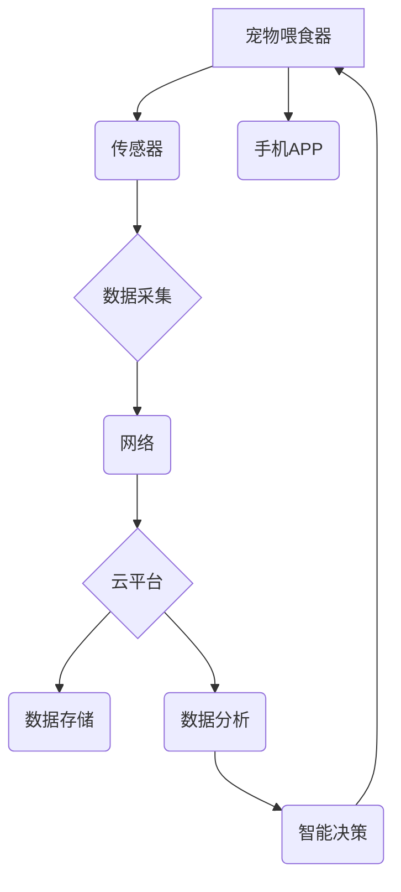

                 

## 智能宠物喂食器创业：远程宠物照顾

> 关键词：智能宠物喂食器、远程宠物照顾、物联网、人工智能、机器学习、云计算、传感器技术、嵌入式系统

## 1. 背景介绍

随着城市化进程的加速和人们生活节奏的加快，越来越多的宠物主人面临着时间和精力有限的困境。如何更好地照顾宠物，确保其健康和幸福，成为一个亟待解决的问题。智能宠物喂食器应运而生，它利用物联网、人工智能等先进技术，为宠物主人提供远程宠物照顾解决方案，有效缓解了宠物主人对宠物照料的担忧。

智能宠物喂食器不仅可以定时自动喂食宠物，还可以根据宠物的品种、年龄、体重等信息，精准计算并分配合适的食量，避免宠物过量或营养不良。同时，智能宠物喂食器还具备多种智能功能，例如：

* **远程控制：** 通过手机APP，宠物主人可以随时随地查看宠物的喂食情况，并远程控制喂食器进行喂食操作。
* **智能识别：** 利用摄像头和图像识别技术，智能宠物喂食器可以识别宠物的品种和身份，确保只有特定的宠物才能获得食物。
* **健康监测：** 通过传感器监测宠物的体重、食量、活动量等数据，智能宠物喂食器可以帮助宠物主人了解宠物的健康状况，及时发现潜在问题。
* **语音交互：** 智能宠物喂食器可以支持语音交互，宠物主人可以通过语音指令控制喂食器，与宠物进行互动。

## 2. 核心概念与联系

智能宠物喂食器的实现依赖于物联网、人工智能、云计算等多项技术的融合。

**2.1 物联网 (IoT)**

物联网是指通过传感器、网络和数据分析技术，将物理世界和数字世界连接起来，实现万物互联的网络。智能宠物喂食器作为物联网设备，通过传感器收集宠物的喂食数据，并将数据传输到云端进行存储和分析。

**2.2 人工智能 (AI)**

人工智能是指模拟人类智能行为的计算机系统。智能宠物喂食器利用人工智能技术，例如机器学习和深度学习，实现智能识别、健康监测、个性化喂食等功能。

**2.3 云计算 (Cloud Computing)**

云计算是指通过互联网提供计算资源、存储资源和软件服务。智能宠物喂食器的数据存储、处理和分析都依赖于云计算平台，实现大数据处理和智能决策。

**2.4 架构图**



## 3. 核心算法原理 & 具体操作步骤

### 3.1 算法原理概述

智能宠物喂食器的核心算法主要包括：

* **图像识别算法：** 用于识别宠物的品种和身份。
* **机器学习算法：** 用于分析宠物的喂食数据，预测宠物的食量需求。
* **控制算法：** 用于控制喂食器的喂食动作。

### 3.2 算法步骤详解

**3.2.1 图像识别算法**

1. **数据采集：** 摄像头采集宠物的图像数据。
2. **图像预处理：** 对图像进行尺寸调整、灰度化、去噪等处理，提高图像识别精度。
3. **特征提取：** 利用卷积神经网络等算法，提取宠物图像的关键特征。
4. **分类识别：** 将提取的特征与已训练好的模型进行匹配，识别宠物的品种和身份。

**3.2.2 机器学习算法**

1. **数据收集：** 收集宠物的喂食数据，包括喂食时间、食量、体重等信息。
2. **数据清洗：** 对数据进行清洗和处理，去除异常值和缺失值。
3. **模型训练：** 利用机器学习算法，例如线性回归、决策树、支持向量机等，训练一个预测宠物食量需求的模型。
4. **模型评估：** 使用测试数据评估模型的预测精度。
5. **模型部署：** 将训练好的模型部署到云平台，用于实时预测宠物的食量需求。

**3.2.3 控制算法**

1. **接收指令：** 接收来自手机APP或云平台的喂食指令。
2. **判断条件：** 根据宠物的品种、年龄、体重等信息，以及机器学习算法预测的食量需求，判断是否满足喂食条件。
3. **执行动作：** 如果满足喂食条件，则控制喂食器进行喂食动作，例如打开食料仓、释放食料等。

### 3.3 算法优缺点

**优点：**

* **精准喂食：** 根据宠物的具体情况，精准计算并分配合适的食量。
* **远程控制：** 宠物主人可以随时随地查看宠物的喂食情况，并远程控制喂食器进行喂食操作。
* **健康监测：** 通过传感器监测宠物的体重、食量、活动量等数据，帮助宠物主人了解宠物的健康状况。
* **个性化喂食：** 可以根据宠物的喜好和需求，定制个性化的喂食方案。

**缺点：**

* **成本较高：** 智能宠物喂食器的硬件成本和软件开发成本较高。
* **技术复杂：** 需要整合多种技术，例如物联网、人工智能、云计算等。
* **网络依赖：** 需要稳定的网络连接才能正常工作。
* **安全问题：** 需要考虑网络安全和数据隐私问题。

### 3.4 算法应用领域

智能宠物喂食器的应用领域非常广泛，除了宠物喂食之外，还可以应用于：

* **农业：** 自动控制动物喂食，提高饲养效率。
* **医疗：** 自动控制药物喂药，帮助患者按时服药。
* **教育：** 自动控制实验设备，帮助学生进行实验操作。

## 4. 数学模型和公式 & 详细讲解 & 举例说明

### 4.1 数学模型构建

智能宠物喂食器的食量计算模型可以采用以下数学模型：

$$
食量 = f(体重, 年龄, 品种, 活动量)
$$

其中：

* **食量:** 宠物每天需要摄入的总食物量。
* **体重:** 宠物的体重。
* **年龄:** 宠物的年龄。
* **品种:** 宠物的品种。
* **活动量:** 宠物的活动量。

### 4.2 公式推导过程

具体的食量计算公式可以根据宠物的品种、年龄、体重等信息进行调整。例如，对于小型犬，可以采用以下公式：

$$
食量 = 0.03 * 体重 + 5
$$

其中：

* **食量:** 单位为克。
* **体重:** 单位为千克。

### 4.3 案例分析与讲解

假设有一只体重为5千克的小型犬，年龄为2岁，活动量中等。根据上述公式，其每天需要摄入的食量为：

$$
食量 = 0.03 * 5 + 5 = 0.15 + 5 = 5.15克
$$

因此，需要为这只小型犬准备5.15克的食物。

## 5. 项目实践：代码实例和详细解释说明

### 5.1 开发环境搭建

智能宠物喂食器的开发环境可以根据项目需求进行搭建。一般来说，需要以下软件和硬件：

* **操作系统:** Linux、Windows 或 macOS
* **编程语言:** Python、C++ 或 Java
* **物联网平台:** AWS IoT、Azure IoT 或 Google Cloud IoT
* **云计算平台:** AWS、Azure 或 Google Cloud
* **传感器:** 温度传感器、湿度传感器、重量传感器
* **微控制器:** ESP32、STM32 或 Raspberry Pi

### 5.2 源代码详细实现

以下是一个使用 Python 和 Raspberry Pi 实现智能宠物喂食器的基本代码示例：

```python
import RPi.GPIO as GPIO
import time

# 设置 GPIO 引脚
motor_pin = 18
sensor_pin = 23

# 初始化 GPIO
GPIO.setmode(GPIO.BCM)
GPIO.setup(motor_pin, GPIO.OUT)
GPIO.setup(sensor_pin, GPIO.IN)

# 定时喂食
while True:
    # 读取传感器数据
    sensor_value = GPIO.input(sensor_pin)

    # 判断是否需要喂食
    if sensor_value == 1:
        # 控制电机喂食
        GPIO.output(motor_pin, GPIO.HIGH)
        time.sleep(5)
        GPIO.output(motor_pin, GPIO.LOW)
    else:
        time.sleep(1)
```

### 5.3 代码解读与分析

* 该代码首先设置了 GPIO 引脚，并初始化了 GPIO 模块。
* 然后，代码定义了一个无限循环，用于定时喂食。
* 在循环中，代码读取了传感器的值，判断是否需要喂食。
* 如果传感器值是 1，则表示宠物需要喂食，代码控制电机喂食。
* 否则，代码等待 1 秒钟，然后继续循环。

### 5.4 运行结果展示

当代码运行时，如果传感器检测到宠物需要喂食，则电机会启动，释放食物。

## 6. 实际应用场景

智能宠物喂食器已经开始在市场上应用，并取得了一定的成功。例如，一些宠物品牌推出了自己的智能宠物喂食器产品，并通过手机APP提供远程控制和数据分析功能。

### 6.4 未来应用展望

未来，智能宠物喂食器的应用场景将会更加广泛，例如：

* **个性化喂食方案：** 根据宠物的健康状况、饮食习惯等信息，定制个性化的喂食方案。
* **远程健康监测：** 通过传感器监测宠物的体重、食量、活动量等数据，及时发现宠物的健康问题。
* **智能互动：** 利用语音识别和图像识别技术，实现宠物与主人之间的智能互动。

## 7. 工具和资源推荐

### 7.1 学习资源推荐

* **书籍:**
    * 《物联网编程》
    * 《人工智能入门》
    * 《云计算基础》
* **在线课程:**
    * Coursera
    * edX
    * Udemy

### 7.2 开发工具推荐

* **物联网平台:** AWS IoT、Azure IoT、Google Cloud IoT
* **云计算平台:** AWS、Azure、Google Cloud
* **编程语言:** Python、C++、Java
* **微控制器:** ESP32、STM32、Raspberry Pi

### 7.3 相关论文推荐

* **物联网:**
    * "The Internet of Things: A Survey"
    * "A Survey on Security and Privacy in the Internet of Things"
* **人工智能:**
    * "Deep Learning"
    * "Machine Learning: A Probabilistic Perspective"
* **云计算:**
    * "Cloud Computing: Concepts, Technology & Architecture"
    * "A Survey of Cloud Computing Models"

## 8. 总结：未来发展趋势与挑战

### 8.1 研究成果总结

智能宠物喂食器的研发取得了显著成果，实现了宠物喂食的自动化、智能化和远程化。

### 8.2 未来发展趋势

未来，智能宠物喂食器的发展趋势包括：

* **更智能的算法:** 利用更先进的人工智能算法，实现更精准的喂食方案和更全面的健康监测。
* **更丰富的功能:** 添加更多智能功能，例如语音交互、宠物识别、游戏娱乐等。
* **更便捷的交互:** 支持多种交互方式，例如语音、图像、触控等。
* **更安全的系统:** 加强网络安全和数据隐私保护，确保宠物信息安全。

### 8.3 面临的挑战

智能宠物喂食器的研发和应用还面临着一些挑战：

* **技术复杂性:** 需要整合多种技术，例如物联网、人工智能、云计算等，技术难度较高。
* **成本问题:** 智能宠物喂食器的硬件成本和软件开发成本较高，需要降低成本才能普及。
* **安全问题:** 需要考虑网络安全和数据隐私问题，确保宠物信息安全。
* **用户体验:** 需要不断优化用户体验，提高用户使用满意度。

### 8.4 研究展望

未来，我们将继续致力于智能宠物喂食器的研发和应用，努力解决上述挑战，为宠物主人提供更智能、更便捷、更安全的宠物照料解决方案。

## 9. 附录：常见问题与解答

**Q1: 智能宠物喂食器的价格是多少？**

A1: 智能宠物喂食器的价格根据功能、品牌、材质等因素有所不同，一般在几百元到几千元之间。

**Q2: 智能宠物喂食器需要联网吗？**

A2: 为了实现远程控制和数据分析功能，智能宠物喂食器需要联网。

**Q3: 智能宠物喂食器的安全性能如何？**

A3: 好的智能宠物喂食器会采用加密技术和安全协议，保护宠物信息安全。

**Q4: 如何选择合适的智能宠物喂食器？**

A4: 选择智能宠物喂食器时，需要考虑宠物的品种、年龄、体重、饮食习惯等因素，以及产品的功能、价格、安全性等方面。

**Q5: 智能宠物喂食器的维护保养方法是什么？**

A5: 智能宠物喂食器需要定期清洁，并根据说明书进行维护保养。


作者：禅与计算机程序设计艺术 / Zen and the Art of Computer Programming 
<end_of_turn>

