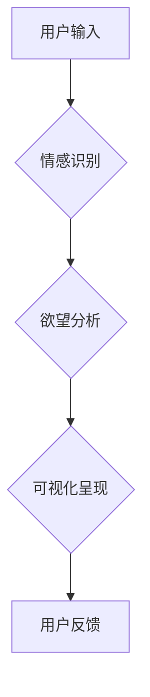

                 

## 欲望的可视化：AI呈现内心世界

> 关键词：人工智能、情感识别、欲望可视化、神经网络、深度学习、数据分析、人机交互

## 1. 背景介绍

人类历史悠久，对自身情感的探索从未停止。从古希腊哲学家对“理性”与“情感”的辩论，到现代心理学对“潜意识”的挖掘，我们一直在试图理解和解读内心世界的奥秘。而随着人工智能技术的飞速发展，我们拥有了前所未有的工具和手段，可以更深入地探索人类情感的本质，并将其可视化呈现。

欲望，作为人类情感的重要组成部分，一直是艺术、文学和哲学的永恒主题。它驱动着我们的行为，塑造着我们的命运，也成为我们内心深处难以捉摸的迷雾。然而，欲望的本质究竟是什么？它如何影响我们的决策？如何与其他情感相互作用？这些问题一直困扰着人类学者。

近年来，人工智能技术在情感识别领域取得了突破性进展。通过对语言、表情、生理信号等多模态数据的分析，AI模型能够识别和理解人类的情感，甚至可以预测个体的行为倾向。这为我们提供了 unprecedented 的机会，可以将人类的欲望可视化，并将其与其他情感进行关联分析，从而更深入地理解人类行为的动机。

## 2. 核心概念与联系

**2.1 欲望的定义与特征**

欲望是一种强烈而持续的愿望或渴望，它驱使我们追求某种目标或状态。欲望可以是积极的，例如对知识、成功或幸福的渴望；也可以是消极的，例如对权力、财富或报复的渴望。

**2.2 情感识别与分析**

情感识别是指通过分析人类的行为、语言和生理信号，识别和理解其所处的情感状态。情感分析则进一步将情感识别结果进行解读和分析，例如识别情感的强度、类型和背后的动机。

**2.3 人工智能与欲望可视化**

人工智能技术为欲望可视化提供了强大的工具和手段。通过深度学习算法，AI模型可以从海量数据中学习人类情感的特征，并将其映射到可视化的形式，例如颜色、形状、动画等。

**2.4 欲望可视化架构**



## 3. 核心算法原理 & 具体操作步骤

**3.1 算法原理概述**

欲望可视化算法通常基于深度学习技术，主要包括以下几个步骤：

1. **数据收集与预处理:** 收集包含情感和行为信息的丰富数据，例如文本、图像、音频等，并进行清洗、标注和格式转换。
2. **特征提取:** 利用深度学习模型，例如卷积神经网络（CNN）和循环神经网络（RNN），从数据中提取情感和行为特征。
3. **欲望模型训练:** 利用训练数据，训练一个欲望模型，该模型能够将情感特征映射到欲望类型和强度。
4. **可视化呈现:** 根据欲望模型的输出结果，将欲望类型和强度以可视化的形式呈现，例如颜色、形状、动画等。

**3.2 算法步骤详解**

1. **数据收集与预处理:**

   - 收集包含情感和行为信息的丰富数据，例如社交媒体帖子、电影评论、用户行为日志等。
   - 对数据进行清洗，去除噪声和重复信息。
   - 对数据进行标注，例如将文本标注为不同的情感类型，将图像标注为不同的行为场景。
   - 将数据格式转换为模型可接受的形式，例如将文本转换为词向量，将图像转换为特征图。

2. **特征提取:**

   - 利用深度学习模型，例如CNN和RNN，从数据中提取情感和行为特征。
   - CNN擅长提取图像中的特征，例如表情、姿势等。
   - RNN擅长处理序列数据，例如文本和语音，可以捕捉情感变化的动态趋势。

3. **欲望模型训练:**

   - 利用训练数据，训练一个欲望模型，该模型能够将情感特征映射到欲望类型和强度。
   - 可以使用监督学习算法，例如支持向量机（SVM）和随机森林（RF），训练欲望模型。
   - 模型的训练目标是尽可能准确地预测用户的欲望类型和强度。

4. **可视化呈现:**

   - 根据欲望模型的输出结果，将欲望类型和强度以可视化的形式呈现。
   - 可以使用颜色、形状、动画等多种方式进行可视化。
   - 例如，可以使用不同的颜色表示不同的欲望类型，可以使用形状的大小表示欲望的强度。

**3.3 算法优缺点**

**优点:**

- 能够识别和理解人类的复杂情感，包括欲望。
- 可以将欲望可视化，方便用户理解和分析。
- 可以用于多种应用场景，例如个性化推荐、心理咨询、市场营销等。

**缺点:**

- 需要大量的训练数据，数据标注成本较高。
- 模型的准确性受数据质量和模型复杂度的影响。
- 存在伦理问题，例如隐私泄露、情感操控等。

**3.4 算法应用领域**

- **个性化推荐:** 根据用户的欲望，推荐个性化的商品、服务和内容。
- **心理咨询:** 帮助用户识别和理解自己的欲望，并提供相应的建议和治疗。
- **市场营销:** 针对不同用户的欲望，设计更有效的营销策略。
- **游戏设计:** 根据玩家的欲望，设计更具吸引力和趣味性的游戏体验。

## 4. 数学模型和公式 & 详细讲解 & 举例说明

**4.1 数学模型构建**

欲望可视化模型可以构建为一个多层神经网络，其中每一层都包含多个神经元。每个神经元接收来自上一层的输入信号，并对其进行处理，输出到下一层。

**4.2 公式推导过程**

神经网络的输出结果可以通过以下公式计算：

$$
y = f(W x + b)
$$

其中：

- $y$ 是神经网络的输出结果。
- $f$ 是激活函数，例如 sigmoid 函数或 ReLU 函数。
- $W$ 是权重矩阵，连接上一层和当前层的每个神经元。
- $x$ 是上一层的输出信号。
- $b$ 是偏置项，用于调整神经元的激活阈值。

**4.3 案例分析与讲解**

假设我们想要构建一个简单的欲望可视化模型，用于识别用户对食物的欲望。我们可以使用一个包含两层神经元的模型。

第一层神经元接收用户对食物的描述信息，例如“香喷喷的烤鸡”、“酸甜可口的水果”等。

第二层神经元接收第一层神经元的输出信号，并将其映射到食物欲望的强度，例如“强”、“中”、“弱”。

我们可以使用训练数据，例如用户对食物的描述和相应的欲望强度，来训练这个模型。

## 5. 项目实践：代码实例和详细解释说明

**5.1 开发环境搭建**

- Python 3.x
- TensorFlow 或 PyTorch 深度学习框架
- Jupyter Notebook 或 VS Code 代码编辑器

**5.2 源代码详细实现**

```python
import tensorflow as tf

# 定义模型结构
model = tf.keras.models.Sequential([
  tf.keras.layers.Dense(64, activation='relu', input_shape=(100,)),
  tf.keras.layers.Dense(3, activation='softmax')
])

# 编译模型
model.compile(optimizer='adam',
              loss='sparse_categorical_crossentropy',
              metrics=['accuracy'])

# 训练模型
model.fit(x_train, y_train, epochs=10)

# 预测欲望
predictions = model.predict(x_test)
```

**5.3 代码解读与分析**

- 代码首先定义了一个包含两层神经元的模型。
- 第一层神经元有 64 个单元，使用 ReLU 激活函数。
- 第二层神经元有 3 个单元，使用 softmax 激活函数，用于输出三个欲望类型。
- 模型使用 Adam 优化器，损失函数为 sparse_categorical_crossentropy，评估指标为准确率。
- 模型使用训练数据进行训练，训练 10 个 epochs。
- 训练完成后，可以使用模型预测新的数据。

**5.4 运行结果展示**

运行代码后，可以得到模型的训练结果，例如准确率、损失值等。

## 6. 实际应用场景

**6.1 个性化推荐系统**

- 根据用户的欲望，推荐个性化的商品、服务和内容。
- 例如，可以根据用户的美食欲望，推荐附近的餐厅或美食外卖。

**6.2 心理咨询平台**

- 帮助用户识别和理解自己的欲望，并提供相应的建议和治疗。
- 例如，可以帮助用户识别对物质的过度渴望，并提供相应的应对策略。

**6.3 市场营销策略**

- 针对不同用户的欲望，设计更有效的营销策略。
- 例如，可以根据用户的旅行欲望，设计针对性的旅游广告。

**6.4 游戏设计**

- 根据玩家的欲望，设计更具吸引力和趣味性的游戏体验。
- 例如，可以根据玩家的冒险欲望，设计更刺激的游戏场景。

**6.5 未来应用展望**

- 随着人工智能技术的不断发展，欲望可视化技术将有更广泛的应用场景。
- 例如，可以用于教育、医疗、社会服务等领域。

## 7. 工具和资源推荐

**7.1 学习资源推荐**

- 深度学习书籍：
    - 《深度学习》
    - 《动手学深度学习》
- 在线课程：
    - Coursera 深度学习课程
    - Udacity 深度学习课程

**7.2 开发工具推荐**

- TensorFlow
- PyTorch
- Keras

**7.3 相关论文推荐**

- 《Attention Is All You Need》
- 《BERT: Pre-training of Deep Bidirectional Transformers for Language Understanding》

## 8. 总结：未来发展趋势与挑战

**8.1 研究成果总结**

- 人工智能技术在情感识别和欲望可视化领域取得了显著进展。
- 欲望可视化技术为我们理解和解读人类行为提供了新的视角。

**8.2 未来发展趋势**

- 欲望可视化技术将更加精准和细粒度。
- 欲望可视化技术将应用于更多领域。
- 欲望可视化技术将与其他人工智能技术融合，例如自然语言处理和计算机视觉。

**8.3 面临的挑战**

- 数据标注成本高昂。
- 模型的准确性受数据质量和模型复杂度的影响。
- 存在伦理问题，例如隐私泄露、情感操控等。

**8.4 研究展望**

- 研究更有效的欲望可视化算法。
- 研究更丰富的欲望类型和特征。
- 研究欲望可视化技术的伦理问题。

## 9. 附录：常见问题与解答

**9.1 如何收集欲望数据？**

可以收集用户对商品、服务和内容的评价、评论、购买记录等数据。

**9.2 如何标注欲望数据？**

可以根据用户对欲望的描述，将其标注为不同的欲望类型和强度。

**9.3 欲望可视化技术存在哪些伦理问题？**

- 隐私泄露：欲望可视化技术可能会泄露用户的隐私信息。
- 情感操控：欲望可视化技术可能会被用于操控用户的行为。


作者：禅与计算机程序设计艺术 / Zen and the Art of Computer Programming 
<end_of_turn>

