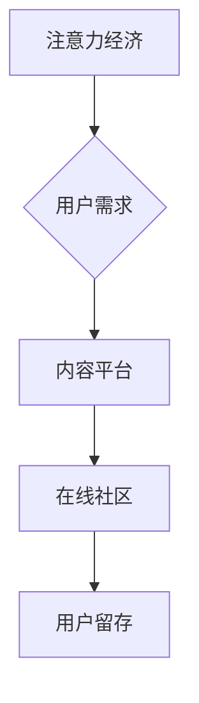

                 

##  注意力经济与在线社区建设策略与实践：吸引并留住受众

> 关键词：注意力经济、在线社区、用户留存、内容策略、社区运营、算法推荐、用户体验

## 1. 背景介绍

在当今信息爆炸的时代，人们面临着来自各方信息的冲击，注意力成为了稀缺的资源。这便是“注意力经济”的核心概念。在线社区作为信息传播和用户互动的重要平台，在注意力经济中扮演着越来越重要的角色。如何吸引用户进入社区，并留住他们的注意力，成为了社区运营者面临的重大挑战。

传统社区建设模式往往依赖于内容的质量和数量，但随着用户获取信息的便捷性提高，单纯依靠内容难以满足用户的需求。用户对内容的接受度和留存率不断下降，社区运营者需要探索新的策略和方法，以更好地利用注意力经济，吸引和留住用户。

## 2. 核心概念与联系

### 2.1 注意力经济

注意力经济是指在信息过载的时代，人们对信息的筛选和选择能力成为重要的经济资源。注意力是有限的，用户会根据自身兴趣和需求选择关注的内容和平台。社区运营者需要理解用户的注意力机制，并提供能够吸引和留住用户注意力的内容和服务。

### 2.2 在线社区

在线社区是指基于互联网平台构建的，用户可以进行交流、分享、互动和协作的虚拟空间。在线社区可以根据不同的主题、兴趣或目标群体进行分类，例如社交社区、兴趣社区、专业社区等。

### 2.3 用户留存

用户留存是指用户在使用社区后持续活跃和参与的程度。用户留存率是衡量社区成功的重要指标，高留存率意味着社区能够有效地吸引和留住用户，并建立起稳定的用户群体。

**核心概念联系流程图**



## 3. 核心算法原理 & 具体操作步骤

### 3.1 算法原理概述

用户留存算法的核心目的是通过分析用户行为数据，预测用户是否会再次访问社区，并根据预测结果提供个性化的内容推荐和服务，以提高用户留存率。常见的用户留存算法包括：

* **生存分析模型**:  通过分析用户在社区中的活跃时间和退出时间，预测用户未来留存的概率。
* **机器学习模型**: 利用用户行为数据训练机器学习模型，预测用户是否会再次访问社区。
* **推荐算法**: 根据用户的兴趣和行为数据，推荐个性化的内容，提高用户参与度和留存率。

### 3.2 算法步骤详解

1. **数据收集**: 收集用户行为数据，例如用户注册时间、登录时间、浏览记录、点赞记录、评论记录等。
2. **数据预处理**: 对收集到的数据进行清洗、转换和特征工程，以便于算法训练和预测。
3. **模型选择**: 根据实际需求选择合适的算法模型，例如生存分析模型、机器学习模型或推荐算法。
4. **模型训练**: 使用预处理后的数据训练选择的算法模型，并评估模型的性能。
5. **模型部署**: 将训练好的模型部署到线上环境，用于预测用户留存概率和个性化推荐。
6. **效果评估**: 定期评估模型的性能，并根据评估结果进行模型调整和优化。

### 3.3 算法优缺点

**优点**:

* 可以准确预测用户留存概率，帮助社区运营者制定有效的留存策略。
* 可以根据用户的兴趣和行为数据提供个性化的内容推荐，提高用户参与度和留存率。
* 可以帮助社区运营者了解用户的行为模式，优化社区运营策略。

**缺点**:

* 需要大量的用户行为数据进行训练，数据质量直接影响模型的性能。
* 模型训练和部署需要一定的技术门槛。
* 算法可能会存在偏差，导致推荐结果不准确。

### 3.4 算法应用领域

用户留存算法广泛应用于各种在线社区，例如社交媒体平台、电商平台、游戏平台、知识付费平台等。

## 4. 数学模型和公式 & 详细讲解 & 举例说明

### 4.1 数学模型构建

用户留存率可以表示为用户在特定时间段内持续活跃的比例。假设社区有N个用户，在时间t时，活跃的用户数为M(t)，则用户留存率可以表示为：

$$
Retention\_Rate(t) = \frac{M(t)}{N}
$$

### 4.2 公式推导过程

用户留存率的计算公式是基于用户活跃度的统计分析。用户活跃度可以根据不同的指标进行定义，例如登录次数、评论次数、点赞次数等。

### 4.3 案例分析与讲解

假设一个社区有1000个用户，在第一天注册后，活跃用户数为800人，第二天活跃用户数为650人，则该社区的第二天留存率为：

$$
Retention\_Rate(2) = \frac{650}{1000} = 0.65
$$

## 5. 项目实践：代码实例和详细解释说明

### 5.1 开发环境搭建

* 语言：Python
* 库：Pandas, Scikit-learn, TensorFlow

### 5.2 源代码详细实现

```python
import pandas as pd
from sklearn.model_selection import train_test_split
from sklearn.linear_model import LogisticRegression

# 加载用户行为数据
data = pd.read_csv('user_behavior.csv')

# 数据预处理
# ...

# 将数据分为训练集和测试集
X_train, X_test, y_train, y_test = train_test_split(data.drop('retention', axis=1), data['retention'], test_size=0.2)

# 训练逻辑回归模型
model = LogisticRegression()
model.fit(X_train, y_train)

# 模型评估
# ...

# 使用模型预测用户留存概率
predictions = model.predict(X_test)

# ...
```

### 5.3 代码解读与分析

* 代码首先加载用户行为数据，并进行预处理，例如缺失值处理、特征工程等。
* 然后将数据分为训练集和测试集，用于训练和评估模型。
* 选择逻辑回归模型进行训练，并使用训练集数据训练模型。
* 评估模型的性能，例如准确率、召回率等。
* 最后使用训练好的模型预测用户留存概率。

### 5.4 运行结果展示

* 模型的预测结果可以以表格或图表的形式展示，例如预测的用户留存概率、留存率等。
* 运行结果可以帮助社区运营者了解用户留存情况，并制定相应的策略。

## 6. 实际应用场景

### 6.1 社区内容推荐

根据用户的兴趣和行为数据，推荐个性化的内容，提高用户参与度和留存率。

### 6.2 用户个性化推送

根据用户的留存概率和行为模式，推送个性化的通知和消息，提醒用户参与社区活动，提高用户活跃度。

### 6.3 社区运营策略优化

通过分析用户留存数据，了解用户行为模式，优化社区运营策略，例如内容更新频率、活动策划等。

### 6.4 未来应用展望

随着人工智能技术的不断发展，用户留存算法将会更加智能化和个性化。未来，用户留存算法可以应用于更广泛的场景，例如：

* **用户画像构建**: 通过分析用户留存数据，构建更精准的用户画像，为社区运营提供更有效的决策依据。
* **用户行为预测**: 利用机器学习算法，预测用户的未来行为，例如是否会购买商品、是否会参与活动等。
* **社区生态建设**: 通过用户留存算法，促进社区用户之间的互动和交流，构建更加活跃和健康的社区生态。

## 7. 工具和资源推荐

### 7.1 学习资源推荐

* **书籍**:
    * 《深度学习》
    * 《机器学习实战》
    * 《Python数据科学手册》
* **在线课程**:
    * Coursera
    * edX
    * Udacity

### 7.2 开发工具推荐

* **Python**: 
    * Pandas
    * Scikit-learn
    * TensorFlow
* **数据库**:
    * MySQL
    * PostgreSQL
* **云平台**:
    * AWS
    * Azure
    * GCP

### 7.3 相关论文推荐

* **用户留存预测**:
    * "A Survey on User Retention Prediction in Online Communities"
    * "Deep Learning for User Retention Prediction"
* **推荐算法**:
    * "Collaborative Filtering for Recommender Systems"
    * "Content-Based Recommendation Systems"

## 8. 总结：未来发展趋势与挑战

### 8.1 研究成果总结

用户留存算法在在线社区建设中发挥着越来越重要的作用，能够帮助社区运营者更好地理解用户行为，并制定有效的留存策略。

### 8.2 未来发展趋势

* **更精准的用户画像**: 利用更丰富的用户数据，构建更精准的用户画像，为社区运营提供更有效的决策依据。
* **更智能的留存策略**: 利用人工智能技术，开发更智能的留存策略，例如个性化推送、动态内容推荐等。
* **更丰富的应用场景**: 用户留存算法将会应用于更广泛的场景，例如用户行为预测、社区生态建设等。

### 8.3 面临的挑战

* **数据质量**: 用户留存算法的性能直接依赖于数据质量，如何收集和处理高质量的用户数据是一个重要的挑战。
* **算法复杂度**: 一些用户留存算法的复杂度较高，需要强大的计算能力和技术支持。
* **隐私保护**: 用户数据涉及到隐私问题，如何保护用户隐私是一个需要认真考虑的挑战。

### 8.4 研究展望

未来，用户留存算法的研究将会更加深入，朝着更精准、更智能、更安全的方向发展。


## 9. 附录：常见问题与解答

* **Q1: 如何提高用户留存率？**

* **A1:** 提高用户留存率需要从多个方面入手，例如提供优质的内容，优化用户体验，个性化推荐，加强用户互动等。

* **Q2: 用户留存算法有哪些？**

* **A2:** 常见的用户留存算法包括生存分析模型、机器学习模型和推荐算法。

* **Q3: 如何评估用户留存算法的性能？**

* **A3:** 用户留存算法的性能可以评估准确率、召回率、F1-score等指标。

作者：禅与计算机程序设计艺术 / Zen and the Art of Computer Programming 


<end_of_turn>

